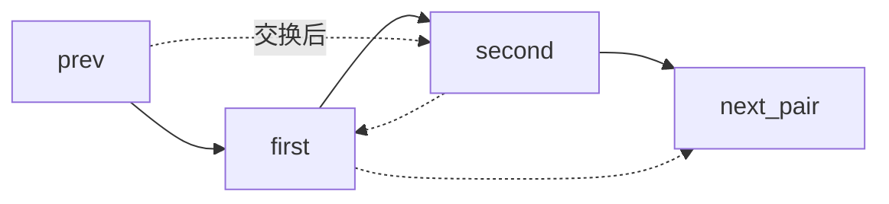

# 01 · 链表两两交换

> 目标：把“指针不丢失”的链表模板练熟。面试里这题不难，难点是代码要稳定，不要靠新建节点逃避指针操作。

## 1. 题目描述

给定一个单链表，将链表中相邻的两个节点两两交换，返回交换后的头节点。

示例：

```text
输入：1 -> 2 -> 3 -> 4 -> 5
输出：2 -> 1 -> 4 -> 3 -> 5
```

约束：

- 只能改变节点指针，不能只交换节点值。
- 节点数量可能为 0、1、奇数或偶数。

## 2. 思路分析

关键点：

- 使用 dummy head 统一处理头节点变化。
- 每轮维护 `prev -> first -> second -> next_pair`。
- 交换后变成 `prev -> second -> first -> next_pair`。
- 移动 `prev = first`，进入下一组。



## 3. 代码实现

```python
from __future__ import annotations

from dataclasses import dataclass
from typing import Iterable


@dataclass
class ListNode:
    val: int
    next: "ListNode | None" = None


def swap_pairs(head: ListNode | None) -> ListNode | None:
    """Swap adjacent linked-list nodes in-place.

    Time: O(n)
    Space: O(1)
    """
    dummy = ListNode(0, head)
    prev = dummy

    while prev.next is not None and prev.next.next is not None:
        first = prev.next
        second = first.next
        next_pair = second.next

        prev.next = second
        second.next = first
        first.next = next_pair

        prev = first

    return dummy.next


def build_list(values: Iterable[int]) -> ListNode | None:
    dummy = ListNode(0)
    tail = dummy
    for value in values:
        tail.next = ListNode(value)
        tail = tail.next
    return dummy.next


def to_list(head: ListNode | None) -> list[int]:
    values: list[int] = []
    while head is not None:
        values.append(head.val)
        head = head.next
    return values


def test_swap_pairs() -> None:
    assert to_list(swap_pairs(build_list([]))) == []
    assert to_list(swap_pairs(build_list([1]))) == [1]
    assert to_list(swap_pairs(build_list([1, 2]))) == [2, 1]
    assert to_list(swap_pairs(build_list([1, 2, 3]))) == [2, 1, 3]
    assert to_list(swap_pairs(build_list([1, 2, 3, 4, 5]))) == [2, 1, 4, 3, 5]


if __name__ == "__main__":
    test_swap_pairs()
```

## 4. 复杂度分析

| 维度 | 复杂度 | 说明 |
|---|---|---|
| 时间 | O(n) | 每个节点最多访问和改指针一次 |
| 空间 | O(1) | 只使用固定数量指针 |

## 5. 易错点

- 没有 dummy，导致头两个节点交换后 head 更新混乱。
- 先改 `first.next`，导致 `second` 或 `next_pair` 丢失。
- 奇数长度链表最后一个节点不应该被丢掉。
- 新建节点复制值虽然也能得到输出，但不符合“交换节点”的题意。

## 6. 追问扩展

- 如果是 k 个一组反转，循环条件和指针移动怎么改？
- 如果链表很长，为什么递归写法可能栈溢出？
- 如果节点里有大对象，为什么交换值不如交换指针？

## 7. 面试口播

> 我用 dummy head 统一处理头节点变化。每轮固定拿 `prev.next` 和 `prev.next.next` 作为一组，先保存下一组入口，再把 `prev` 指向第二个节点、第二个指回第一个、第一个接回下一组。最后把 `prev` 移到交换后的组尾。这样每个节点只处理一次，时间 O(n)，空间 O(1)。
