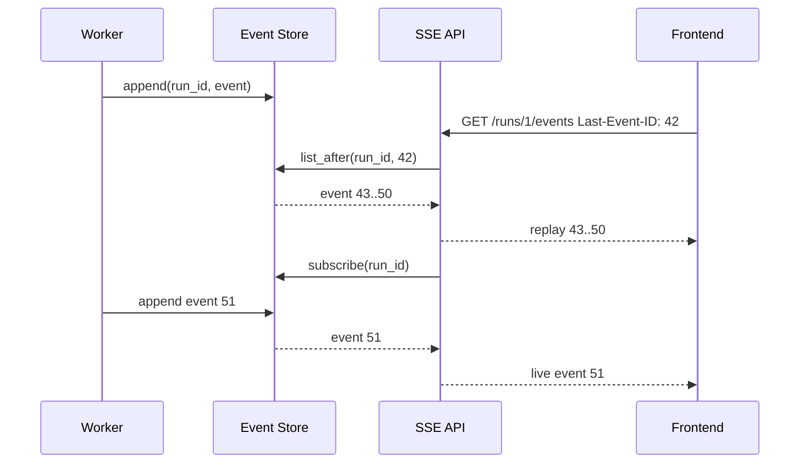

# 01 · SSE Event Store 与断线重放

> 目标：把“长任务事件流”从概念讲法落到代码。核心不是会 `yield`，而是能处理事件持久化、Last-Event-ID、断线重连、慢客户端和幂等。

## 1. 题目描述

实现一个简化版 SSE 事件流服务：

- `POST /runs/{run_id}/events` 写入事件。
- `GET /runs/{run_id}/events` 从 `Last-Event-ID` 之后开始重放历史事件，再持续推送实时事件。
- 客户端断线后再次连接不能重复执行后台任务，只能重放事件。

## 2. 思路分析

关键设计：

- `event_store` 是事实来源，不要把事件只放内存队列。
- `event_id` 必须单调递增，便于断线后按游标重放。
- `replay_then_subscribe` 先读历史，再订阅实时。
- SSE 连接是展示通道，不负责驱动任务执行。



## 3. 代码实现

```python
from __future__ import annotations

import asyncio
import json
from dataclasses import dataclass, field
from typing import Any, AsyncIterator


@dataclass(frozen=True)
class RunEvent:
    id: int
    run_id: str
    type: str
    payload: dict[str, Any]


class InMemoryEventStore:
    def __init__(self) -> None:
        self._events: dict[str, list[RunEvent]] = {}
        self._next_id = 1
        self._lock = asyncio.Lock()
        self._subscribers: dict[str, set[asyncio.Queue[RunEvent]]] = {}

    async def append(self, run_id: str, event_type: str, payload: dict[str, Any]) -> RunEvent:
        async with self._lock:
            event = RunEvent(
                id=self._next_id,
                run_id=run_id,
                type=event_type,
                payload=payload,
            )
            self._next_id += 1
            self._events.setdefault(run_id, []).append(event)
            subscribers = list(self._subscribers.get(run_id, set()))

        for queue in subscribers:
            queue.put_nowait(event)
        return event

    async def list_after(self, run_id: str, after_id: int | None) -> list[RunEvent]:
        events = self._events.get(run_id, [])
        if after_id is None:
            return list(events)
        return [event for event in events if event.id > after_id]

    async def subscribe(self, run_id: str) -> AsyncIterator[RunEvent]:
        queue: asyncio.Queue[RunEvent] = asyncio.Queue(maxsize=256)
        self._subscribers.setdefault(run_id, set()).add(queue)
        try:
            while True:
                yield await queue.get()
        finally:
            self._subscribers.get(run_id, set()).discard(queue)


async def replay_then_subscribe(
    store: InMemoryEventStore,
    run_id: str,
    last_event_id: str | None,
) -> AsyncIterator[RunEvent]:
    after_id = int(last_event_id) if last_event_id else None
    replayed = await store.list_after(run_id, after_id)
    for event in replayed:
        yield event

    newest_seen = replayed[-1].id if replayed else after_id
    async for event in store.subscribe(run_id):
        if newest_seen is not None and event.id <= newest_seen:
            continue
        yield event


def format_sse(event: RunEvent) -> str:
    data = json.dumps(event.payload, ensure_ascii=False)
    return f"id: {event.id}\nevent: {event.type}\ndata: {data}\n\n"
```

FastAPI 形态：

```python
from fastapi import APIRouter, Header, Request
from fastapi.responses import StreamingResponse

router = APIRouter()
store = InMemoryEventStore()


@router.get("/runs/{run_id}/events")
async def stream_events(
    run_id: str,
    request: Request,
    last_event_id: str | None = Header(default=None, alias="Last-Event-ID"),
):
    async def gen():
        async for event in replay_then_subscribe(store, run_id, last_event_id):
            if await request.is_disconnected():
                break
            yield format_sse(event)

    return StreamingResponse(
        gen(),
        media_type="text/event-stream",
        headers={
            "Cache-Control": "no-cache",
            "X-Accel-Buffering": "no",
        },
    )
```

## 4. 复杂度分析

| 维度 | 复杂度 | 说明 |
|---|---|---|
| 写入 | O(s) | s 是当前 run 的订阅者数 |
| 重放 | O(n) | n 是该 run 已有事件数，生产环境用 DB 索引优化 |
| 实时推送 | O(1) / event | 每个订阅者队列入队 |

生产环境的数据库索引：

```sql
create table run_events (
  id bigserial primary key,
  run_id text not null,
  event_type text not null,
  payload jsonb not null,
  created_at timestamptz not null default now()
);

create index run_events_run_id_id_idx on run_events(run_id, id);
```

## 5. 易错点

- 直接把模型 generator 暴露给 SSE，前端断线导致后台任务中断。
- 没有 event id，断线后只能从头重放或丢事件。
- 只用内存队列，服务重启后无法恢复。
- Nginx / 网关 buffering 没关，前端看到的是“假流式”。
- 慢客户端无限堆积队列，需要最大队列和断开策略。

## 6. 追问扩展

- 多实例 API 下订阅如何做？可以用 Redis Stream、Postgres LISTEN/NOTIFY、Kafka。
- Exactly-once 需要吗？前端展示通常做到 at-least-once + event id 去重。
- Last-Event-ID 是浏览器自动带的吗？EventSource 重连会带，手写 fetch 需要自己传。
- 如何取消任务？SSE 断开不等于 cancel，取消要独立 `POST /runs/{id}/cancel`。

## 7. 面试口播

> 我不会让 SSE 连接直接驱动后台任务。后台任务只负责把事件 append 到 event store，SSE API 负责根据 Last-Event-ID 先重放历史，再订阅实时事件。这样浏览器刷新或断线不会重复执行任务，只会按 event id 补齐缺失事件。生产上 event store 用数据库或 Redis Stream，并按 `(run_id, id)` 建索引。
