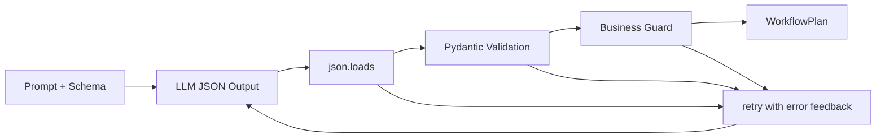

# 02 · Pydantic Structured Output 校验与修复重试

> 目标：把“结构化输出可靠性”从抽象原则落成代码。核心是 schema 约束、业务校验、错误反馈和有限重试。

## 1. 题目描述

实现一个 `generate_plan()`：

- 调用 LLM 生成工作流计划 JSON。
- 用 Pydantic 校验结构。
- 对业务约束做二次校验。
- 如果校验失败，把错误反馈给模型重试，最多 2 次。

## 2. 思路分析

结构化输出不要只相信 provider 的 JSON mode。更稳的链路是：



分层：

- Provider 负责尽量输出 JSON。
- Pydantic 负责字段、类型、枚举、范围。
- Business Guard 负责跨字段约束和真实系统约束。
- Retry 负责把具体错误反馈给模型，而不是笼统说“格式错了”。

## 3. 代码实现

```python
from __future__ import annotations

import json
from typing import Literal, Protocol

from pydantic import BaseModel, Field, ValidationError, model_validator


class ShotSpec(BaseModel):
    index: int = Field(ge=0)
    duration_sec: float = Field(gt=0, le=12)
    scene_description: str = Field(min_length=4)
    camera: Literal["wide", "medium", "close-up", "tracking", "dolly"]


class WorkflowPlan(BaseModel):
    workflow_ref: Literal["t2i_basic", "i2i_style", "t2v_two_step"]
    aspect_ratio: Literal["9:16", "16:9", "1:1"]
    shots: list[ShotSpec] = Field(min_length=1, max_length=8)
    total_duration_sec: float = Field(gt=0, le=60)

    @model_validator(mode="after")
    def duration_must_match_shots(self) -> "WorkflowPlan":
        shot_total = sum(shot.duration_sec for shot in self.shots)
        if abs(shot_total - self.total_duration_sec) > 0.5:
            raise ValueError("total_duration_sec must match sum(shots.duration_sec)")
        return self


class LLMClient(Protocol):
    def complete_json(self, prompt: str, schema: dict) -> str:
        ...


def business_guard(plan: WorkflowPlan, allowed_workflows: set[str]) -> None:
    if plan.workflow_ref not in allowed_workflows:
        raise ValueError(f"workflow_ref {plan.workflow_ref!r} is not enabled")
    indexes = [shot.index for shot in plan.shots]
    if indexes != list(range(len(plan.shots))):
        raise ValueError("shot indexes must be contiguous and start from 0")


def parse_plan(raw: str, allowed_workflows: set[str]) -> WorkflowPlan:
    try:
        data = json.loads(raw)
    except json.JSONDecodeError as exc:
        raise ValueError(f"invalid JSON: {exc}") from exc

    try:
        plan = WorkflowPlan.model_validate(data)
    except ValidationError as exc:
        raise ValueError(exc.errors(include_url=False)) from exc

    business_guard(plan, allowed_workflows)
    return plan


def generate_plan(
    client: LLMClient,
    user_request: str,
    allowed_workflows: set[str],
    max_attempts: int = 3,
) -> WorkflowPlan:
    schema = WorkflowPlan.model_json_schema()
    feedback = ""

    for attempt in range(1, max_attempts + 1):
        prompt = f"""
You are generating a workflow plan.
User request:
{user_request}

Return JSON matching the schema exactly.
Allowed workflows: {sorted(allowed_workflows)}
{feedback}
"""
        raw = client.complete_json(prompt=prompt, schema=schema)
        try:
            return parse_plan(raw, allowed_workflows)
        except ValueError as exc:
            feedback = f"\nPrevious attempt failed. Fix these errors only:\n{exc}\n"
            if attempt == max_attempts:
                raise

    raise RuntimeError("unreachable")
```

## 4. 测试样例

```python
class FakeClient:
    def __init__(self, outputs: list[str]) -> None:
        self.outputs = outputs
        self.calls = 0

    def complete_json(self, prompt: str, schema: dict) -> str:
        output = self.outputs[self.calls]
        self.calls += 1
        return output


def test_generate_plan_retries() -> None:
    client = FakeClient(
        [
            '{"workflow_ref":"bad","aspect_ratio":"16:9","shots":[],"total_duration_sec":10}',
            '{"workflow_ref":"t2v_two_step","aspect_ratio":"16:9","shots":[{"index":0,"duration_sec":5,"scene_description":"city night","camera":"wide"}],"total_duration_sec":5}',
        ]
    )

    plan = generate_plan(client, "make a city video", {"t2v_two_step"})
    assert plan.workflow_ref == "t2v_two_step"
    assert client.calls == 2
```

## 5. 复杂度分析

| 维度 | 复杂度 | 说明 |
|---|---|---|
| 校验时间 | O(n) | n 是 shots 数量 |
| 重试成本 | O(k * LLM) | k 是最大尝试次数 |
| 空间 | O(n) | 保存结构化计划 |

## 6. 易错点

- 只做 `json.loads`，没有 schema 校验。
- schema 校验通过后，没有检查 workflow 是否真实存在。
- 重试时只说“格式错了”，模型不知道修哪里。
- 无限重试，导致成本和延迟不可控。
- 把业务规则写进 prompt，却没有代码 guard。

## 7. 追问扩展

- 如果 provider 支持 strict schema，还需要 Pydantic 吗？需要，provider 只保证输出形状，不保证业务约束。
- 如果模型持续失败怎么办？返回可解释错误，降级到模板或人工确认。
- 如何观测失败？记录 validation error 类型、attempt 次数、原始输出 hash。
- 如何避免 prompt injection 改 schema？schema 和 allowed_workflows 由服务端代码提供，用户输入不能覆盖。

## 8. 面试口播

> 我会把结构化输出分成三层：模型按 JSON Schema 输出，Pydantic 做类型和枚举校验，业务 guard 检查 workflow 是否真实存在、shot index 是否连续、总时长是否一致。失败后把具体错误反馈给模型有限重试，最多 2-3 次。这样 LLM 只负责语义生成，系统正确性仍由代码兜底。
