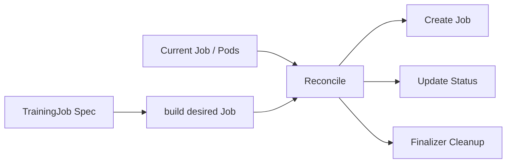

# 03 · K8s Operator Reconcile 骨架

> 目标：能手写一个 CRD Controller 的核心循环。面试重点不是 Kubebuilder 命令，而是期望状态、真实状态、幂等、Status、Finalizer。

## 1. 题目描述

设计一个 `TrainingJob` Operator：

- 用户提交 `TrainingJob.spec`，描述镜像、命令、GPU 数量和最大重试次数。
- Operator 创建或更新底层 `batch/v1 Job`。
- Operator 聚合 Job 状态写回 `TrainingJob.status.phase`。
- 删除 `TrainingJob` 时清理队列占用和外部资源。

## 2. 思路分析

Operator 的核心是控制循环：



关键原则：

- Reconcile 可能被重复调用，必须幂等。
- `spec` 是用户期望，`status` 是控制器观察到的事实。
- 创建子资源时设置 OwnerReference。
- 外部资源清理用 Finalizer。
- 不要在 Reconcile 里做长时间阻塞任务。

## 3. CRD 形态

```yaml
apiVersion: ai.example.com/v1alpha1
kind: TrainingJob
metadata:
  name: qwen-finetune
spec:
  image: registry.example.com/train:qwen
  command: ["python", "train.py"]
  gpuCount: 2
  maxRetries: 1
status:
  phase: Scheduling
  jobName: qwen-finetune-worker
  conditions: []
```

## 4. Go 代码骨架

```go
package controllers

import (
    "context"
    "time"

    batchv1 "k8s.io/api/batch/v1"
    corev1 "k8s.io/api/core/v1"
    apierrors "k8s.io/apimachinery/pkg/api/errors"
    metav1 "k8s.io/apimachinery/pkg/apis/meta/v1"
    "k8s.io/apimachinery/pkg/api/resource"
    "k8s.io/apimachinery/pkg/runtime"
    "k8s.io/apimachinery/pkg/types"
    ctrl "sigs.k8s.io/controller-runtime"
    "sigs.k8s.io/controller-runtime/pkg/client"
    "sigs.k8s.io/controller-runtime/pkg/controller/controllerutil"
)

const trainingJobFinalizer = "ai.example.com/trainingjob-finalizer"

type TrainingJobReconciler struct {
    client.Client
    Scheme *runtime.Scheme
    Quota  QuotaService
}

func (r *TrainingJobReconciler) Reconcile(ctx context.Context, req ctrl.Request) (ctrl.Result, error) {
    tj := &aiv1alpha1.TrainingJob{}
    if err := r.Get(ctx, req.NamespacedName, tj); err != nil {
        return ctrl.Result{}, client.IgnoreNotFound(err)
    }

    if !tj.ObjectMeta.DeletionTimestamp.IsZero() {
        return r.reconcileDelete(ctx, tj)
    }

    if controllerutil.AddFinalizer(tj, trainingJobFinalizer) {
        if err := r.Update(ctx, tj); err != nil {
            return ctrl.Result{}, err
        }
    }

    if ok, reason := r.Quota.Allow(ctx, tj.Namespace, tj.Spec.GPUCount); !ok {
        tj.Status.Phase = "Rejected"
        setCondition(tj, "QuotaAccepted", metav1.ConditionFalse, reason)
        return ctrl.Result{}, r.Status().Update(ctx, tj)
    }

    desired := r.buildJob(tj)
    if err := controllerutil.SetControllerReference(tj, desired, r.Scheme); err != nil {
        return ctrl.Result{}, err
    }

    current := &batchv1.Job{}
    key := types.NamespacedName{Name: desired.Name, Namespace: desired.Namespace}
    err := r.Get(ctx, key, current)
    if apierrors.IsNotFound(err) {
        tj.Status.Phase = "Scheduling"
        tj.Status.JobName = desired.Name
        _ = r.Status().Update(ctx, tj)
        return ctrl.Result{}, r.Create(ctx, desired)
    }
    if err != nil {
        return ctrl.Result{}, err
    }

    tj.Status.Phase = summarizeJob(current.Status)
    tj.Status.JobName = current.Name
    if err := r.Status().Update(ctx, tj); err != nil {
        return ctrl.Result{}, err
    }

    if tj.Status.Phase == "Running" || tj.Status.Phase == "Scheduling" {
        return ctrl.Result{RequeueAfter: 30 * time.Second}, nil
    }
    return ctrl.Result{}, nil
}

func (r *TrainingJobReconciler) reconcileDelete(ctx context.Context, tj *aiv1alpha1.TrainingJob) (ctrl.Result, error) {
    if controllerutil.ContainsFinalizer(tj, trainingJobFinalizer) {
        if err := r.Quota.Release(ctx, tj.Namespace, tj.Spec.GPUCount); err != nil {
            return ctrl.Result{}, err
        }
        controllerutil.RemoveFinalizer(tj, trainingJobFinalizer)
        return ctrl.Result{}, r.Update(ctx, tj)
    }
    return ctrl.Result{}, nil
}

func (r *TrainingJobReconciler) buildJob(tj *aiv1alpha1.TrainingJob) *batchv1.Job {
    backoffLimit := int32(tj.Spec.MaxRetries)
    return &batchv1.Job{
        ObjectMeta: metav1.ObjectMeta{
            Name:      tj.Name + "-worker",
            Namespace: tj.Namespace,
        },
        Spec: batchv1.JobSpec{
            BackoffLimit: &backoffLimit,
            Template: corev1.PodTemplateSpec{
                Spec: corev1.PodSpec{
                    RestartPolicy: corev1.RestartPolicyNever,
                    Containers: []corev1.Container{{
                        Name:    "trainer",
                        Image:   tj.Spec.Image,
                        Command: tj.Spec.Command,
                        Resources: corev1.ResourceRequirements{
                            Limits: corev1.ResourceList{
                                "nvidia.com/gpu": *resource.NewQuantity(int64(tj.Spec.GPUCount), resource.DecimalSI),
                            },
                        },
                    }},
                },
            },
        },
    }
}
```

## 5. 复杂度分析

| 维度 | 复杂度 | 说明 |
|---|---|---|
| 单次 Reconcile | O(1) | 读 CR、读/写一个 Job、更新 Status |
| 控制器整体 | O(n) | n 是被 watch 的 TrainingJob 数 |
| 空间 | O(1) / job | 状态主要存在 Kubernetes API |

## 6. 易错点

- Reconcile 不幂等，重复调用会创建多个 Job。
- 忘记 OwnerReference，删除 CR 后子 Job 泄漏。
- 把状态写进 spec，而不是 status。
- 删除外部资源时没有 finalizer，CR 先消失导致无法清理。
- 在 Reconcile 中同步等待训练完成，阻塞 worker。

## 7. 追问扩展

- 如果 spec 改了怎么办？可以禁止不可变字段，或创建新 Job 版本。
- 如何处理 quota 并发穿透？API 准入 + controller 状态 + scheduler 层联合兜底。
- 如何观测失败？记录 condition、event、Job failure reason、Pod logs。
- 多租户怎么做？namespace/project quota、priority class、queue、node pool。

## 8. 面试口播

> Operator 的核心是不断比较 TrainingJob 的期望状态和集群真实状态。Reconcile 先处理删除和 finalizer，再做配额校验，然后构建期望 Job，查当前 Job 是否存在，不存在就创建，存在就聚合状态写回 CR status。整个过程必须幂等，子资源设置 OwnerReference，外部资源用 Finalizer 清理。
