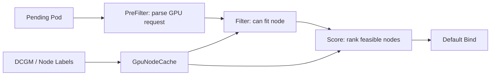

# 04 · Scheduler Framework GPU 插件骨架

> 目标：能手写一个最小 GPU 调度插件，说明 PreFilter、Filter、Score 分别放什么逻辑，以及为什么设备注入不应该放在 scheduler。

## 1. 题目描述

实现一个 kube-scheduler Framework 插件：

- 识别 Pod 请求的 `nvidia.com/gpu` 数量。
- 在 Filter 阶段过滤 GPU 不足或节点健康异常的节点。
- 在 Score 阶段偏好碎片更少、近期无 XID 错误的节点。

## 2. 思路分析

Scheduler Framework 插件只做调度决策，不做设备发现和容器注入。



职责拆分：

| 阶段 | 适合做 | 不适合做 |
|---|---|---|
| PreFilter | 解析 Pod GPU request，写入 CycleState | 查远程慢接口 |
| Filter | 判断节点是否满足硬约束 | 复杂排序 |
| Score | 给可行节点打分 | 改 Pod spec |
| Reserve | 做临时资源预留 | 长时间阻塞 |
| Bind | 特殊绑定逻辑 | GPU 设备注入 |

## 3. 代码骨架

```go
package gpuplugin

import (
    "context"

    v1 "k8s.io/api/core/v1"
    "k8s.io/apimachinery/pkg/runtime"
    "k8s.io/apimachinery/pkg/util/sets"
    framework "k8s.io/kubernetes/pkg/scheduler/framework"
)

const Name = "GpuAware"

type GPURequest struct {
    Count int64
}

type stateKey string

const gpuRequestKey stateKey = "gpuRequest"

type preFilterState struct {
    request GPURequest
}

func (s *preFilterState) Clone() framework.StateData {
    return &preFilterState{request: s.request}
}

type Plugin struct {
    handle framework.Handle
    cache  *GpuNodeCache
}

func New(_ context.Context, _ runtime.Object, handle framework.Handle) (framework.Plugin, error) {
    return &Plugin{
        handle: handle,
        cache:  NewGpuNodeCache(),
    }, nil
}

func (p *Plugin) Name() string { return Name }

func (p *Plugin) PreFilter(
    ctx context.Context,
    state *framework.CycleState,
    pod *v1.Pod,
) (*framework.PreFilterResult, *framework.Status) {
    req := parseGPURequest(pod)
    if req.Count == 0 {
        return nil, framework.NewStatus(framework.Skip)
    }
    state.Write(gpuRequestKey, &preFilterState{request: req})
    return nil, framework.NewStatus(framework.Success)
}

func (p *Plugin) PreFilterExtensions() framework.PreFilterExtensions {
    return nil
}

func (p *Plugin) Filter(
    ctx context.Context,
    state *framework.CycleState,
    pod *v1.Pod,
    nodeInfo *framework.NodeInfo,
) *framework.Status {
    data, err := getState(state)
    if err != nil {
        return framework.AsStatus(err)
    }
    if data.request.Count == 0 {
        return framework.NewStatus(framework.Success)
    }

    nodeName := nodeInfo.Node().Name
    node := p.cache.Get(nodeName)
    if node == nil {
        return framework.NewStatus(framework.Unschedulable, "gpu node cache missing")
    }
    if node.RecentXID {
        return framework.NewStatus(framework.Unschedulable, "gpu node has recent xid errors")
    }
    if node.FreeGPU < data.request.Count {
        return framework.NewStatus(framework.Unschedulable, "insufficient healthy gpu")
    }
    return framework.NewStatus(framework.Success)
}

func (p *Plugin) Score(
    ctx context.Context,
    state *framework.CycleState,
    pod *v1.Pod,
    nodeName string,
) (int64, *framework.Status) {
    data, err := getState(state)
    if err != nil {
        return 0, framework.AsStatus(err)
    }
    node := p.cache.Get(nodeName)
    if node == nil || data.request.Count == 0 {
        return 0, framework.NewStatus(framework.Success)
    }
    return node.Score(data.request), framework.NewStatus(framework.Success)
}

func (p *Plugin) ScoreExtensions() framework.ScoreExtensions {
    return nil
}

func parseGPURequest(pod *v1.Pod) GPURequest {
    var count int64
    for _, c := range pod.Spec.Containers {
        if q, ok := c.Resources.Limits["nvidia.com/gpu"]; ok {
            count += q.Value()
        }
    }
    return GPURequest{Count: count}
}
```

缓存模型：

```go
type GpuNode struct {
    Name      string
    FreeGPU   int64
    TotalGPU  int64
    RecentXID bool
    Labels    sets.Set[string]
}

func (n *GpuNode) Score(req GPURequest) int64 {
    // Prefer exact fit to reduce fragmentation.
    remaining := n.FreeGPU - req.Count
    score := int64(100 - remaining*10)
    if score < 0 {
        score = 0
    }
    if n.RecentXID {
        score -= 50
    }
    if score < 0 {
        return 0
    }
    if score > 100 {
        return 100
    }
    return score
}

type GpuNodeCache struct {
    nodes map[string]*GpuNode
}

func NewGpuNodeCache() *GpuNodeCache {
    return &GpuNodeCache{nodes: map[string]*GpuNode{}}
}

func (c *GpuNodeCache) Get(name string) *GpuNode {
    return c.nodes[name]
}
```

## 4. 配置示例

```yaml
apiVersion: kubescheduler.config.k8s.io/v1
kind: KubeSchedulerConfiguration
profiles:
  - schedulerName: gpu-scheduler
    plugins:
      preFilter:
        enabled:
          - name: GpuAware
      filter:
        enabled:
          - name: GpuAware
      score:
        enabled:
          - name: GpuAware
```

Pod 使用：

```yaml
apiVersion: v1
kind: Pod
metadata:
  name: train-a100
spec:
  schedulerName: gpu-scheduler
  containers:
    - name: train
      image: registry.example.com/train:latest
      resources:
        limits:
          nvidia.com/gpu: 2
```

## 5. 复杂度分析

| 阶段 | 复杂度 | 说明 |
|---|---|---|
| PreFilter | O(c) | c 是容器数 |
| Filter | O(1) | 查节点缓存 |
| Score | O(1) | 简单打分 |
| 整体 | O(n) | n 是候选节点数 |

## 6. 易错点

- 在 Score 阶段做硬过滤，导致不可行节点仍参与排序。
- 插件里同步请求 Prometheus / DCGM，拖慢调度关键路径。
- scheduler 里试图选择具体 GPU UUID，但 kubelet/device plugin 才负责节点内分配。
- 没有处理非 GPU Pod，导致普通 Pod 被误拦截。
- 多 profile 调度时混淆 `nvidia.com/gpu` 和 `nvidia.com/mig-*`。

## 7. 追问扩展

- 多卡训练如何避免碎片？Score 偏好 exact fit 或完整 GPU 组。
- 配额放哪里？API/Admission 做准入，scheduler 做并发兜底。
- GPU 健康从哪里来？DCGM、Node label、device plugin、DRA ResourceSlice。
- 为什么不直接用 scheduler extender？Framework 插件扩展点更细，性能和状态管理更可控。

## 8. 面试口播

> 我会把 GPU 调度插件拆成 PreFilter、Filter、Score。PreFilter 只解析 Pod 请求并写 CycleState；Filter 做硬约束，比如缓存缺失、GPU 不足、近期 XID 错误；Score 做软偏好，比如减少碎片、偏好健康节点。插件只影响选点，不负责设备发现和注入，具体设备仍由 kubelet 和 device plugin 在节点内分配。
