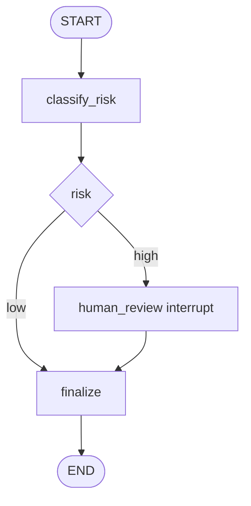

# 05 · LangGraph Custom Node 与 Checkpoint State

> 目标：能把 LangGraph 文章里的“显式状态、节点、边、checkpoint”写成可运行骨架。重点是 state schema、节点幂等、可恢复和副作用隔离。

## 1. 题目描述

实现一个简化的内容审核工作流：

- 输入用户文本。
- `classify_risk` 节点判断风险等级。
- `human_review` 节点在高风险时中断等待人工。
- `finalize` 节点输出最终决策。
- 支持 checkpoint 后 resume，不能重复执行已完成副作用。

## 2. 思路分析

LangGraph 工程题的关键不是“把节点串起来”，而是 state 设计。



状态字段建议：

- 输入：`text`
- 中间结果：`risk_level`、`risk_reason`
- 人工结果：`review_decision`
- 输出：`final_decision`
- 幂等标记：`side_effect_keys`

## 3. 代码实现

```python
from __future__ import annotations

from typing import Literal, TypedDict


RiskLevel = Literal["low", "medium", "high"]
Decision = Literal["allow", "reject", "manual_review"]


class ModerationState(TypedDict, total=False):
    text: str
    risk_level: RiskLevel
    risk_reason: str
    review_decision: Decision
    final_decision: Decision
    side_effect_keys: list[str]


def classify_risk(state: ModerationState) -> ModerationState:
    text = state["text"]
    if "违法" in text or "攻击" in text:
        return {
            "risk_level": "high",
            "risk_reason": "contains high-risk policy keywords",
        }
    if "投诉" in text:
        return {
            "risk_level": "medium",
            "risk_reason": "needs conservative review",
        }
    return {
        "risk_level": "low",
        "risk_reason": "no obvious risk signal",
    }


def route_after_classify(state: ModerationState) -> str:
    if state.get("risk_level") == "high":
        return "human_review"
    return "finalize"


def human_review(state: ModerationState) -> ModerationState:
    # Real LangGraph code would use interrupt({...}) here.
    # This pure function form keeps the interview skeleton easy to test.
    if "review_decision" not in state:
        return {"final_decision": "manual_review"}
    return {}


def finalize(state: ModerationState) -> ModerationState:
    if state.get("review_decision"):
        return {"final_decision": state["review_decision"]}
    if state.get("risk_level") == "low":
        return {"final_decision": "allow"}
    return {"final_decision": "manual_review"}
```

LangGraph 形态：

```python
from langgraph.checkpoint.memory import MemorySaver
from langgraph.graph import END, START, StateGraph


def build_graph():
    graph = StateGraph(ModerationState)
    graph.add_node("classify_risk", classify_risk)
    graph.add_node("human_review", human_review)
    graph.add_node("finalize", finalize)

    graph.add_edge(START, "classify_risk")
    graph.add_conditional_edges(
        "classify_risk",
        route_after_classify,
        {
            "human_review": "human_review",
            "finalize": "finalize",
        },
    )
    graph.add_edge("human_review", "finalize")
    graph.add_edge("finalize", END)

    return graph.compile(checkpointer=MemorySaver())
```

## 4. 幂等副作用模板

如果节点要写数据库、发通知、创建工单，要加幂等 key。

```python
def create_review_ticket(state: ModerationState, ticket_api) -> ModerationState:
    key = f"review-ticket:{hash(state['text'])}"
    done = set(state.get("side_effect_keys", []))
    if key in done:
        return {}

    ticket_api.create(text=state["text"], reason=state["risk_reason"], idempotency_key=key)
    return {"side_effect_keys": [*done, key]}
```

checkpoint resume 后，节点可能重新进入；幂等 key 能避免重复发工单。

## 5. 复杂度分析

| 维度 | 复杂度 | 说明 |
|---|---|---|
| 单节点 | O(n) | n 是输入文本长度 |
| 图执行 | O(V + E) | V 是节点数，E 是边数 |
| 状态空间 | O(k) | k 是状态字段数量 |

## 6. 易错点

- 把所有上下文塞进 state，导致 checkpoint 过大。
- 节点里做不可重复副作用，但没有 idempotency key。
- route 函数返回的标签和 conditional edge map 不一致。
- human review 中断后没有明确 resume 输入字段。
- 把最终用户可见消息、运行事件、checkpoint state 混成一个表。

## 7. 追问扩展

- StateGraph 和普通 chain 区别是什么？StateGraph 把状态和控制流显式化，适合恢复和分支。
- 为什么需要 checkpoint？长任务、人工确认、失败恢复都依赖它。
- 并行节点怎么合并 state？需要 reducer 或明确字段写入规则。
- 副作用如何处理？节点用幂等 key，外部写入可重试。

## 8. 面试口播

> 我会先定义 TypedDict 状态，把输入、中间风险、人工结果和最终决策分开。节点只读写自己负责的字段，route 函数只返回下一跳标签。高风险时进入 human_review，通过 checkpoint 暂停并等待人工输入。所有外部副作用都带 idempotency key，避免 resume 或重试时重复创建工单。
