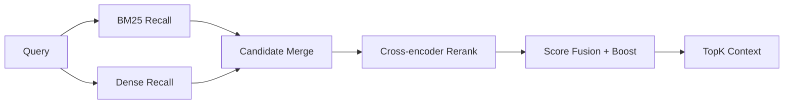

# 06 · RAG Hybrid Scorer：BM25 + Dense + Rerank

> 目标：把 RAG 文档里的“混合召回 + 重排 + 融合”写成可测试代码。面试重点是分数归一化、RRF、reranker 位置和业务 boost。

## 1. 题目描述

实现一个混合排序函数：

- 输入 BM25 召回结果、dense 向量召回结果、reranker 分数。
- 支持 RRF 融合和加权分数融合。
- 支持按 metadata 做业务 boost。
- 输出最终 TopK 文档。

## 2. 思路分析

RAG 排序链路：



常见融合方式：

- RRF：只看排名，不关心不同系统分数尺度。
- Weighted：需要先归一化分数，再加权。
- Rerank：通常放在候选集合并之后，对 TopN 做精排。

## 3. 数据结构

```python
from __future__ import annotations

from dataclasses import dataclass, field


@dataclass
class SearchHit:
    doc_id: str
    text: str
    score: float
    source: str
    metadata: dict[str, str] = field(default_factory=dict)


@dataclass
class RankedDoc:
    doc_id: str
    text: str
    score: float
    reasons: list[str]
    metadata: dict[str, str]
```

## 4. RRF 融合

```python
def reciprocal_rank_fusion(
    result_lists: list[list[SearchHit]],
    k: int = 60,
) -> dict[str, float]:
    scores: dict[str, float] = {}
    for hits in result_lists:
        for rank, hit in enumerate(hits, start=1):
            scores[hit.doc_id] = scores.get(hit.doc_id, 0.0) + 1.0 / (k + rank)
    return scores
```

RRF 优点：

- 不需要 BM25 和 dense 分数同尺度。
- 对“多个召回源都排得靠前”的文档友好。
- 简单稳定，适合做 baseline。

## 5. 加权融合

```python
def minmax(values: dict[str, float]) -> dict[str, float]:
    if not values:
        return {}
    lo = min(values.values())
    hi = max(values.values())
    if hi == lo:
        return {key: 1.0 for key in values}
    return {key: (value - lo) / (hi - lo) for key, value in values.items()}


def collect_scores(hits: list[SearchHit]) -> dict[str, float]:
    return {hit.doc_id: hit.score for hit in hits}


def weighted_fusion(
    bm25_hits: list[SearchHit],
    dense_hits: list[SearchHit],
    rerank_scores: dict[str, float],
    weights: dict[str, float] | None = None,
) -> dict[str, float]:
    weights = weights or {"bm25": 0.25, "dense": 0.25, "rerank": 0.50}
    bm25 = minmax(collect_scores(bm25_hits))
    dense = minmax(collect_scores(dense_hits))
    rerank = minmax(rerank_scores)
    doc_ids = set(bm25) | set(dense) | set(rerank)

    fused: dict[str, float] = {}
    for doc_id in doc_ids:
        fused[doc_id] = (
            weights["bm25"] * bm25.get(doc_id, 0.0)
            + weights["dense"] * dense.get(doc_id, 0.0)
            + weights["rerank"] * rerank.get(doc_id, 0.0)
        )
    return fused
```

## 6. 业务 Boost

```python
def apply_business_boost(score: float, metadata: dict[str, str]) -> tuple[float, list[str]]:
    reasons: list[str] = []
    if metadata.get("authority") in {"official", "clinical_guideline"}:
        score += 0.08
        reasons.append("authority_boost")
    if metadata.get("freshness") == "recent":
        score += 0.03
        reasons.append("freshness_boost")
    if metadata.get("risk") == "deprecated":
        score -= 0.20
        reasons.append("deprecated_penalty")
    return score, reasons
```

## 7. 完整排序函数

```python
def hybrid_rank(
    bm25_hits: list[SearchHit],
    dense_hits: list[SearchHit],
    rerank_scores: dict[str, float],
    top_k: int = 5,
    mode: str = "rrf",
) -> list[RankedDoc]:
    by_id: dict[str, SearchHit] = {}
    for hit in [*bm25_hits, *dense_hits]:
        by_id.setdefault(hit.doc_id, hit)

    if mode == "rrf":
        base_scores = reciprocal_rank_fusion([bm25_hits, dense_hits])
        rerank_norm = minmax(rerank_scores)
        for doc_id, rerank_score in rerank_norm.items():
            base_scores[doc_id] = base_scores.get(doc_id, 0.0) + rerank_score
    elif mode == "weighted":
        base_scores = weighted_fusion(bm25_hits, dense_hits, rerank_scores)
    else:
        raise ValueError(f"unknown mode: {mode}")

    ranked: list[RankedDoc] = []
    for doc_id, score in base_scores.items():
        hit = by_id.get(doc_id)
        if hit is None:
            continue
        boosted, reasons = apply_business_boost(score, hit.metadata)
        ranked.append(
            RankedDoc(
                doc_id=doc_id,
                text=hit.text,
                score=boosted,
                reasons=reasons,
                metadata=hit.metadata,
            )
        )

    return sorted(ranked, key=lambda doc: doc.score, reverse=True)[:top_k]
```

## 8. 测试样例

```python
def test_hybrid_rank() -> None:
    bm25 = [
        SearchHit("a", "official refund policy", 12.0, "bm25", {"authority": "official"}),
        SearchHit("b", "forum discussion", 9.0, "bm25", {"authority": "community"}),
    ]
    dense = [
        SearchHit("c", "semantic refund guide", 0.88, "dense", {"freshness": "recent"}),
        SearchHit("a", "official refund policy", 0.80, "dense", {"authority": "official"}),
    ]
    rerank = {"a": 0.91, "c": 0.82, "b": 0.30}

    ranked = hybrid_rank(bm25, dense, rerank, top_k=2)
    assert ranked[0].doc_id == "a"
    assert "authority_boost" in ranked[0].reasons
```

## 9. 复杂度分析

| 阶段 | 复杂度 | 说明 |
|---|---|---|
| 候选合并 | O(n + m) | n/m 是两个召回列表长度 |
| 融合打分 | O(d) | d 是候选去重后数量 |
| 排序 | O(d log d) | 可用 heap 优化 TopK |
| 空间 | O(d) | 保存候选和分数 |

## 10. 易错点

- 直接加 BM25 和 cosine 分数，尺度不一致。
- reranker 对全量文档跑，成本不可控；应该只对候选 TopN。
- metadata boost 过大，压过语义相关性。
- 没有记录 reasons，线上 badcase 难复盘。
- TopK 只看分数，不做去重和上下文长度预算。

## 11. 追问扩展

- RRF 的 k 怎么选？常用 60，越大越平滑，需按验证集调。
- reranker 放哪里？召回后、融合前或融合后都可试，常见是候选合并后精排。
- 如何评测？Recall@K、MRR、NDCG、答案引用命中率、人工 badcase 分桶。
- 如何处理医疗安全？权威来源 boost、低权威降权、高风险 query 召回优先。

## 12. 面试口播

> 我不会直接把 BM25 和向量分数相加，因为尺度不一致。简单稳定的 baseline 是 RRF，按各召回源排名做倒数融合；如果要 weighted fusion，先 min-max 归一化，再加权 BM25、dense、rerank。最后可以做小幅业务 boost，并记录 reasons，方便 badcase 复盘。
