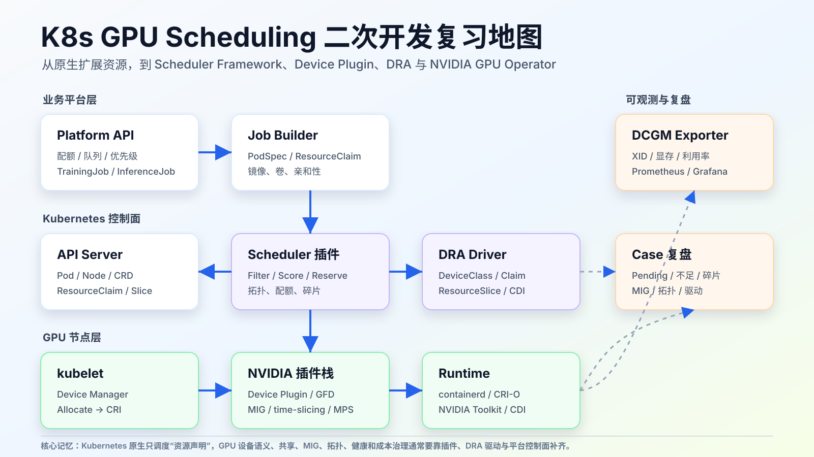
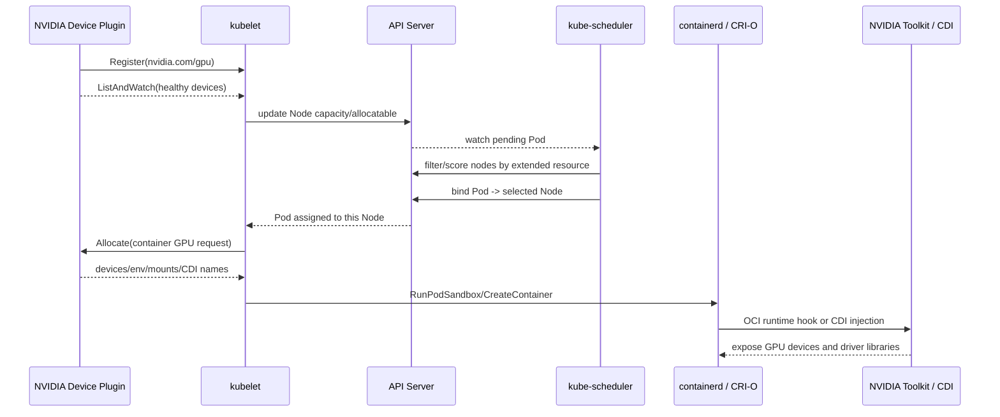
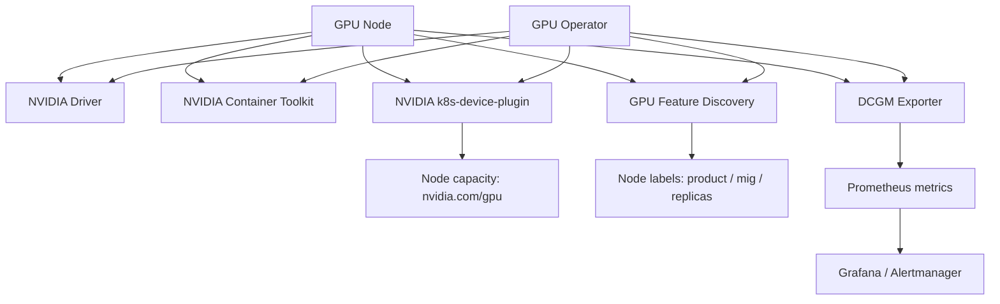
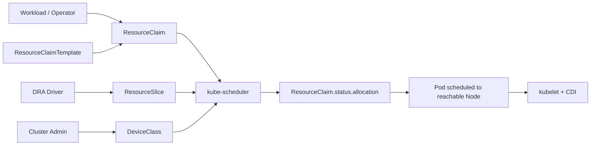
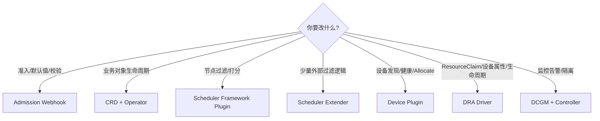
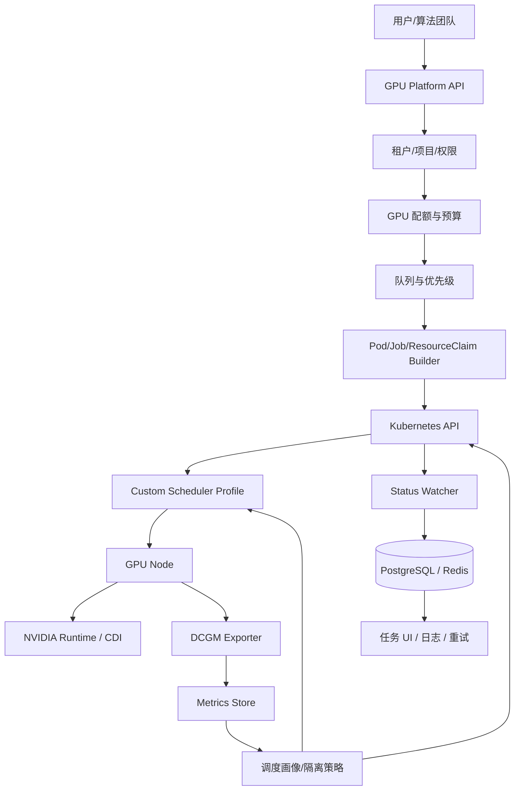
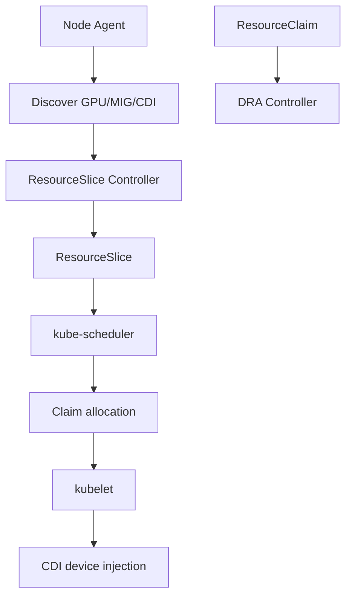

# 云原生开发：K8s GPU 调度二次开发复习文档



> 复习目标：能从零讲清 Kubernetes GPU 调度的原生链路、NVIDIA 插件栈、DRA 新模型，以及如何做面向 GPU 共享、MIG、拓扑、配额和故障隔离的二次开发。重点不是背 API 名字，而是把“谁负责声明资源、谁负责选择节点、谁负责选择设备、谁负责把设备注入容器”讲清楚。

## 0. 本文地图

| 层次 | 要讲清楚 | 面试追问 |
|---|---|---|
| 入门 | Pod 为什么只写 `limits: nvidia.com/gpu` | request/limit、扩展资源、不可超卖 |
| 原生链路 | Device Plugin -> kubelet -> scheduler -> CRI -> NVIDIA runtime | scheduler 是否知道具体 GPU ID |
| NVIDIA 栈 | GPU Operator、device-plugin、GFD、DCGM exporter、MIG Manager | Operator 解决了哪些运维问题 |
| DRA | DeviceClass、ResourceClaim、ResourceSlice 与 CDI | DRA 与传统 Device Plugin 的区别 |
| 二次开发 | Scheduler Framework、Extender、Device Plugin、DRA Driver、Webhook、Operator | 应该在哪一层改 |
| 架构设计 | 多租户配额、队列、共享、拓扑感知、故障隔离 | 如何避免 GPU 碎片和低利用率 |
| 代码设计 | CRD、controller、scheduler plugin、gRPC device plugin、DRA driver | 关键接口怎么写 |
| Case 复盘 | Pending、Insufficient GPU、MIG 失败、拓扑错配、插件异常 | 怎么定位，怎么修 |

## 1. 一句话总览

Kubernetes 原生 GPU 调度本质是：

> **厂商插件把 GPU 注册成扩展资源，scheduler 只按资源数量把 Pod 放到 Node，kubelet 再在本节点选择具体设备并调用插件 Allocate，最后 container runtime / NVIDIA toolkit 把设备注入容器。**

这句话背后有两个关键边界：

- Kubernetes 默认不懂 CUDA、显存、MIG profile、NVLink、GPU 利用率、业务队列和成本预算。
- 传统 Device Plugin 模型里，scheduler 调的是 `nvidia.com/gpu: 1` 这种整数资源，不直接选择 `GPU-uuid-xxx`。

所以二次开发通常不是“改 Kubernetes 核心”，而是在以下几层补能力：

- 平台层：队列、配额、优先级、成本、用户体验。
- 调度层：Filter/Score、拓扑感知、碎片治理、gang scheduling 联动。
- 设备层：Device Plugin、MIG、time-slicing、MPS、DRA driver。
- 运维层：Operator、健康监控、故障隔离、自动恢复。

## 2. 原生 GPU 调度主链路



### 2.1 Pod 里怎么申请 GPU

```yaml
apiVersion: batch/v1
kind: Job
metadata:
  name: train-resnet-a100
spec:
  template:
    spec:
      restartPolicy: Never
      containers:
        - name: trainer
          image: registry.example.com/ml/train:2026-06
          command: ["python", "train.py"]
          resources:
            limits:
              nvidia.com/gpu: 1
              cpu: "8"
              memory: 48Gi
```

复习时记住三条：

- GPU 通常只写在 `limits` 中；Kubernetes 会把 limit 作为 request。
- 如果同时写 `requests` 和 `limits`，GPU 数量必须相等。
- 不能只写 GPU request 不写 limit。

原因是 GPU 属于 Kubernetes extended resource：整数、不可超卖、默认不能像 CPU 那样按小数切分。

### 2.2 组件职责

| 组件 | 负责什么 | 不负责什么 |
|---|---|---|
| Device Plugin | 发现设备、上报健康、注册 `nvidia.com/gpu`、在 `Allocate` 返回设备访问配置 | 不做全局调度、不决定业务优先级 |
| kubelet | 接收插件注册，把 capacity/allocatable 写到 Node；Pod 到本节点后调用 Allocate | 不跨节点比较 GPU 拓扑 |
| kube-scheduler | 按 Pod request 和 Node allocatable 做过滤、打分、绑定 | 不直接调用 CUDA，不枚举具体 GPU UUID |
| CRI/runtime | 创建 Pod sandbox 和 container，承接 kubelet 传来的设备配置 | 不决定该 Pod 应排到哪个 Node |
| NVIDIA Container Toolkit / CDI | 把 GPU 设备、驱动库、环境变量注入容器 | 不做 Kubernetes 控制面调度 |

Device Plugin 关键接口可以简化成：

```proto
service DevicePlugin {
  rpc GetDevicePluginOptions(Empty) returns (DevicePluginOptions) {}
  rpc ListAndWatch(Empty) returns (stream ListAndWatchResponse) {}
  rpc Allocate(AllocateRequest) returns (AllocateResponse) {}
  rpc PreStartContainer(PreStartContainerRequest) returns (PreStartContainerResponse) {}
}
```

面试回答要点：

> scheduler 看的是 Node 上 `nvidia.com/gpu` 的剩余数量；具体用哪张卡，是 kubelet device manager 在目标节点上配合 device plugin 决定的。

## 3. NVIDIA 云原生 GPU 组件栈



### 3.1 GPU Operator

GPU Operator 是生命周期编排器。它用 Operator/Helm 自动安装和管理：

- NVIDIA driver
- NVIDIA Container Toolkit
- Kubernetes device-plugin
- GPU Feature Discovery
- DCGM / DCGM exporter
- MIG Manager

它解决的是“GPU 节点软件栈难装、难升级、容易版本不匹配”的运维问题。复习时可以这么讲：

> 手工装驱动、container runtime、device plugin、GFD、DCGM exporter 很容易漏组件或版本错配。GPU Operator 把这些组件作为 operands 管起来，并用节点标签选择哪些节点需要 GPU 栈。

### 3.2 NVIDIA device-plugin

device-plugin 是资源暴露层，常见能力包括：

- 暴露 `nvidia.com/gpu`。
- 维护 GPU 健康状态。
- 支持 MIG 暴露策略：`none`、`single`、`mixed`。
- 支持 time-slicing / MPS 这类共享策略。
- 支持通过 CDI 或传统 env/mount/device 方式把设备信息传给 runtime。

MIG 策略记忆：

| 策略 | 资源暴露方式 | 适用场景 |
|---|---|---|
| `none` | 不按 MIG 语义暴露，仍看成普通 GPU | 未启用 MIG |
| `single` | 同一种 MIG profile 继续暴露为 `nvidia.com/gpu` | 节点上 MIG profile 单一 |
| `mixed` | 不同 profile 暴露为 `nvidia.com/mig-1g.5gb` 等资源 | 多 profile 混合调度 |

### 3.3 GPU Feature Discovery

GFD 基于 Node Feature Discovery 给节点打标签。它让调度策略可以写：

```yaml
nodeSelector:
  nvidia.com/gpu.product: NVIDIA-A100-SXM4-40GB
```

实际生产中，更常见的是平台 API 把用户选择的“卡型、显存、MIG profile、共享/独占”等抽象成 Pod 的 node affinity、resource limits 或 ResourceClaim。

### 3.4 DCGM exporter

DCGM exporter 是监控出口层，暴露 GPU 指标给 Prometheus：

- GPU 利用率、显存使用、温度、功耗。
- XID 错误。
- NVLink / PCIe 相关指标。
- Pod / namespace / container 维度映射。

它不是调度器，但它给二次开发提供“反馈信号”：低利用率、热点节点、错误 GPU、频繁 XID 的节点都可以进入调度打分或隔离逻辑。

## 4. DRA：Kubernetes 新资源分配模型

传统 Device Plugin 的问题是资源语义太粗：`nvidia.com/gpu: 1` 只能表达“要一张卡”，表达不了设备属性、拓扑、分区容量、claim 生命周期、跨 Pod 共享和更丰富的绑定条件。

DRA（Dynamic Resource Allocation）引入了新的资源模型：



核心对象：

| 对象 | 作用 | 作用域 |
|---|---|---|
| `DeviceClass` | 管理员定义一类设备及选择规则 | cluster-scoped |
| `ResourceSlice` | DRA driver 发布设备池、设备属性、容量和可达节点 | cluster-scoped |
| `ResourceClaim` | workload 对设备的声明，请求和分配结果都在这里 | namespaced |
| `ResourceClaimTemplate` | 为每个 Pod 自动生成独立 claim | namespaced |

版本口径按 2026-06-25 复习：

- Device Plugin Framework 在 Kubernetes v1.26 stable。
- DRA 主能力在 v1.34 起进入 GA/默认开启线；最新官方文档快照可能显示 v1.35/v1.36 stable，复习时要强调“查目标集群版本和 feature gates”。
- DRA 核心 API 位于 `resource.k8s.io/v1`。
- DRA 当前仍需要厂商驱动实现，例如 NVIDIA DRA Driver for GPUs；Kubernetes 不自带 NVIDIA GPU 驱动。
- NVIDIA GPU DRA 生产落地要关注 GPU Operator、NVIDIA driver、CDI、传统 device plugin 是否冲突等前置条件。

DRA 不是把 Device Plugin 立刻淘汰，而是提供更强的声明式资源分配能力。传统 `nvidia.com/gpu` 仍是最常见、兼容性最好的路径；需要细粒度设备属性、claim 生命周期、设备共享语义时，再考虑 DRA。

## 5. 二次开发扩展点怎么选



| 扩展点 | 适合做 | 不适合做 |
|---|---|---|
| Admission Webhook | 自动补 node affinity、默认队列、拒绝非法 GPU request | 做复杂全局调度 |
| CRD + Operator | TrainingJob/InferenceService 生命周期、状态同步、重试、清理 | 替代 scheduler 做节点选择 |
| Scheduler Framework Plugin | GPU 拓扑、碎片、配额、低利用率倾斜、故障节点过滤 | 设备注入容器 |
| Scheduler Extender | 老系统接入、快速外部过滤/打分 | 长期复杂二开，性能和维护成本高 |
| Device Plugin | 设备发现、健康、MIG/共享策略、Allocate 返回 CDI | 项目配额、队列公平 |
| DRA Driver | 设备属性建模、ResourceSlice 发布、claim 分配 | 简单 `nvidia.com/gpu` 场景 |
| Controller | 观测闭环、故障隔离、节点打标签、自动修复 | 同步阻塞调度关键路径 |

面试时的判断原则：

> 先问能力属于“调度决策、设备管理、业务生命周期、准入校验、还是运维闭环”。不要把所有逻辑都塞进 scheduler，也不要让业务 API 直接操作节点设备。

## 6. 面向 GPU 平台的架构设计

### 6.1 控制面分层



### 6.2 核心数据模型

业务 CRD 可以定义成 `GpuWorkload` 或 `TrainingJob`：

```yaml
apiVersion: ai.example.com/v1alpha1
kind: GpuWorkload
metadata:
  name: qwen-finetune
spec:
  project: ads-ranking
  queue: gpu-prod
  priority: high
  accelerator:
    vendor: nvidia
    model: A100
    count: 2
    mode: exclusive
    migProfile: ""
    topology: same-node
  runtime:
    image: registry.example.com/train:qwen-2026-06
    command: ["python", "finetune.py"]
  retry:
    maxAttempts: 2
status:
  phase: Pending
  allocated:
    nodeName: ""
    devices: []
  conditions: []
```

为什么不用用户直接写 Pod？

- 用户不应该记忆复杂 GPU 节点标签。
- 平台要统一做配额、队列、公平性和成本。
- 业务状态需要比 Pod 更稳定，例如 `Queued`、`Scheduling`、`Allocated`、`Running`、`Retrying`、`Failed`。
- 后续可切换传统 Device Plugin 或 DRA，不影响用户 API。

### 6.3 调度策略设计

一个实用 GPU Score 模型：

```text
score(node, pod) =
  + card_model_match * 30
  + topology_match * 25
  + anti_fragmentation * 20
  + health_score * 15
  + queue_fairness * 10
  - hot_node_penalty
  - recent_xid_penalty
```

常见策略：

- 大卡作业优先放到“完整 GPU 数量更多”的节点，减少碎片。
- 多卡训练优先同节点、同 NUMA、同 NVLink 域。
- 推理小任务可走 time-slicing/MPS 或 MIG。
- 出现 XID、温度异常、ECC 错误的设备要降权或隔离。
- 项目配额不要只在 API 层检查，调度层也要防并发穿透。

## 7. 底层代码设计

### 7.1 Operator Reconcile

```go
func (r *GpuWorkloadReconciler) Reconcile(ctx context.Context, req ctrl.Request) (ctrl.Result, error) {
    wl := &aiv1alpha1.GpuWorkload{}
    if err := r.Get(ctx, req.NamespacedName, wl); err != nil {
        return ctrl.Result{}, client.IgnoreNotFound(err)
    }

    if !wl.DeletionTimestamp.IsZero() {
        return r.finalize(ctx, wl)
    }

    if ok, reason := r.quota.Allow(ctx, wl); !ok {
        meta.SetStatusCondition(&wl.Status.Conditions, metav1.Condition{
            Type: "QuotaAccepted", Status: metav1.ConditionFalse, Reason: reason,
        })
        wl.Status.Phase = "Rejected"
        return ctrl.Result{}, r.Status().Update(ctx, wl)
    }

    job := buildBatchJob(wl)
    if err := controllerutil.SetControllerReference(wl, job, r.Scheme); err != nil {
        return ctrl.Result{}, err
    }

    current := &batchv1.Job{}
    key := types.NamespacedName{Name: job.Name, Namespace: job.Namespace}
    err := r.Get(ctx, key, current)
    if apierrors.IsNotFound(err) {
        wl.Status.Phase = "Scheduling"
        _ = r.Status().Update(ctx, wl)
        return ctrl.Result{}, r.Create(ctx, job)
    }
    if err != nil {
        return ctrl.Result{}, err
    }

    wl.Status.Phase = summarizeJobPhase(current.Status)
    wl.Status.Allocated = extractGpuAllocation(current)
    return ctrl.Result{RequeueAfter: 30 * time.Second}, r.Status().Update(ctx, wl)
}
```

设计点：

- CRD 表达业务期望状态。
- Controller 生成 Job/Pod/ResourceClaim。
- Status 聚合 Pod 状态、GPU allocation、失败原因。
- Finalizer 清理 claim、临时卷、队列占用。

### 7.2 Scheduler Framework 插件

```go
type GpuTopologyPlugin struct {
    handle framework.Handle
    cache  *GpuNodeCache
    quota  *QuotaStore
}

func (p *GpuTopologyPlugin) Name() string { return "GpuTopology" }

func (p *GpuTopologyPlugin) PreFilter(
    ctx context.Context,
    state *framework.CycleState,
    pod *v1.Pod,
) (*framework.PreFilterResult, *framework.Status) {
    req := parseGpuRequest(pod)
    if req.Count == 0 {
        return nil, framework.NewStatus(framework.Skip)
    }
    state.Write("gpuRequest", req)
    return nil, framework.NewStatus(framework.Success)
}

func (p *GpuTopologyPlugin) Filter(
    ctx context.Context,
    state *framework.CycleState,
    pod *v1.Pod,
    nodeInfo *framework.NodeInfo,
) *framework.Status {
    req, _ := state.Read("gpuRequest")
    node := p.cache.Get(nodeInfo.Node().Name)
    if node == nil || !node.CanFit(req.(GpuRequest)) {
        return framework.NewStatus(framework.Unschedulable, "gpu topology does not fit")
    }
    if !p.quota.MaySchedule(pod.Namespace, req.(GpuRequest)) {
        return framework.NewStatus(framework.Unschedulable, "gpu quota exceeded")
    }
    return framework.NewStatus(framework.Success)
}

func (p *GpuTopologyPlugin) Score(
    ctx context.Context,
    state *framework.CycleState,
    pod *v1.Pod,
    nodeName string,
) (int64, *framework.Status) {
    req, _ := state.Read("gpuRequest")
    node := p.cache.Get(nodeName)
    return node.Score(req.(GpuRequest)), framework.NewStatus(framework.Success)
}
```

缓存模型：

```go
type GpuNodeCache struct {
    mu    sync.RWMutex
    nodes map[string]*GpuNode
}

type GpuNode struct {
    Name       string
    GPUs       []GpuDevice
    NUMA       map[string]int
    NVLink     map[string][]string
    Labels     map[string]string
    Health     NodeHealth
    UpdatedAt  time.Time
}

type GpuDevice struct {
    UUID        string
    Product     string
    MemoryMiB   int64
    MIGProfile  string
    Allocated   bool
    XIDRecent   bool
    Utilization int
}
```

缓存来源可以是：

- Node label / allocatable。
- NVIDIA DCGM exporter 指标。
- device plugin checkpoint 或自建 node agent 上报。
- DRA ResourceSlice。

### 7.3 Device Plugin 伪代码

```go
func (p *Plugin) ListAndWatch(_ *pluginapi.Empty, s pluginapi.DevicePlugin_ListAndWatchServer) error {
    for {
        devices := p.scan()
        resp := &pluginapi.ListAndWatchResponse{Devices: toPluginDevices(devices)}
        if err := s.Send(resp); err != nil {
            return err
        }
        <-p.changed
    }
}

func (p *Plugin) Allocate(ctx context.Context, reqs *pluginapi.AllocateRequest) (*pluginapi.AllocateResponse, error) {
    resp := &pluginapi.AllocateResponse{}
    for _, req := range reqs.ContainerRequests {
        allocated, err := p.allocator.Assign(req.DevicesIDs)
        if err != nil {
            return nil, err
        }
        resp.ContainerResponses = append(resp.ContainerResponses, &pluginapi.ContainerAllocateResponse{
            Envs: map[string]string{
                "NVIDIA_VISIBLE_DEVICES": strings.Join(allocated.UUIDs(), ","),
            },
            Devices: toDeviceSpecs(allocated),
            Mounts:  driverMounts(),
            CDIAnnotations: map[string]string{
                "cdi.k8s.io/gpu": strings.Join(allocated.CDINames(), ","),
            },
        })
    }
    return resp, nil
}
```

注意边界：

- Device Plugin 可以决定设备如何暴露给容器。
- 它不应该实现复杂租户配额，否则会和 scheduler/platform 产生双写状态。
- 健康状态变化必须及时通过 `ListAndWatch` 通知 kubelet。

### 7.4 DRA Driver 设计



DRA driver 要解决三件事：

- 发布资源：把 GPU、MIG、容量、属性、node 可达性写到 `ResourceSlice`。
- 分配资源：响应 claim allocation，把结果写回 `ResourceClaim.status`。
- 注入资源：与 kubelet/CDI 配合，让容器拿到对应设备。

适合 DRA 的场景：

- 需要表达 “A100 80GB + NVLink + 某个 MIG profile”。
- 需要手工创建 claim 并被多个 Pod 共享。
- 想把设备属性、容量、分区、绑定条件纳入 Kubernetes API。

不适合一上来就 DRA 的场景：

- 只需要普通 `nvidia.com/gpu: 1`。
- 集群版本低于 v1.34 或托管 K8s 尚未开放相关 feature gates。
- 运维团队还没有 CDI、GPU Operator 和驱动版本治理能力。

## 8. 常见 Case 复盘

### Case 1：Pod 一直 Pending，提示 Insufficient nvidia.com/gpu

现象：

```text
0/20 nodes are available: 5 Insufficient nvidia.com/gpu,
15 node(s) didn't match Pod's node affinity/selector.
```

定位：

```bash
kubectl describe pod train-xxx
kubectl get nodes -o custom-columns=NAME:.metadata.name,GPU:.status.allocatable.nvidia\\.com/gpu
kubectl describe node gpu-node-1 | grep -A5 -E "Capacity|Allocatable"
kubectl get pods -A -o wide | grep gpu-node-1
```

复盘：

- 先看是 GPU 数量不足，还是 nodeSelector/affinity 把可用节点排除了。
- 检查 device plugin DaemonSet 是否在 GPU 节点运行。
- 检查节点 taint/toleration。
- 如果是碎片问题，多卡任务要看每个节点剩余卡数，而不是全局剩余卡数。

改进：

- 平台层做预检查和可读错误提示。
- scheduler score 加 anti-fragmentation。
- 多卡训练引入 gang scheduling，避免半数 Pod 占位。

### Case 2：节点有 GPU，但 allocatable 为空

定位：

```bash
kubectl -n gpu-operator get pods -o wide
kubectl -n kube-system get ds | grep -i nvidia
kubectl logs -n gpu-operator ds/nvidia-device-plugin-daemonset
kubectl describe node gpu-node-1 | grep -i nvidia
```

常见原因：

- 驱动没装好或版本不匹配。
- NVIDIA Container Toolkit 未配置到 containerd/CRI-O。
- device plugin 没有跑到该节点，或被节点标签/污点挡住。
- kubelet device plugin socket 目录异常。

改进：

- 用 GPU Operator 统一管理组件版本。
- 给 `nvidia.com/gpu.present`、driver ready、plugin ready 建立节点 condition。
- 平台提交任务前过滤未 ready 节点。

### Case 3：MIG 任务调度失败

现象：

```yaml
resources:
  limits:
    nvidia.com/mig-1g.5gb: 1
```

但 Pod Pending。

定位：

```bash
kubectl describe node gpu-node-a100 | grep -A20 "nvidia.com/mig"
kubectl get node gpu-node-a100 --show-labels | tr ',' '\n' | grep nvidia.com
kubectl -n gpu-operator logs ds/nvidia-device-plugin-daemonset
```

复盘：

- `MIG_STRATEGY` 是否为 `mixed`。
- GPU 是否真的切好了 MIG profile。
- GFD 标签是否和资源名一致。
- Pod 是否同时请求了不兼容资源，例如同一容器混用 `nvidia.com/gpu` 和 `nvidia.com/mig-*`。

改进：

- MIG 切分由平台/Operator 管，不让用户直接改节点。
- 建立 MIG profile 库：`1g.5gb` 适合轻推理，`3g.20gb` 适合中等训练。
- 调度前检查目标 profile 的库存。

### Case 4：GPU 利用率低，但集群显示满载

定位：

```promql
avg by (namespace, pod) (DCGM_FI_DEV_GPU_UTIL)
avg by (namespace, pod) (DCGM_FI_DEV_FB_USED)
```

复盘：

- Kubernetes 的 `nvidia.com/gpu: 1` 是独占语义，不关心真实利用率。
- 小模型推理或开发 Notebook 很可能占整卡但利用率很低。
- CPU、数据加载、网络或存储瓶颈也会让 GPU 空转。

改进：

- 对低风险推理任务启用 MIG、time-slicing 或 MPS。
- 通过 DCGM 指标识别长期低利用率任务，提示降配或迁移共享池。
- 把独占池、共享池、MIG 池分开，用 namespace/queue 控制准入。

### Case 5：多卡训练性能差，疑似拓扑错配

定位：

```bash
nvidia-smi topo -m
kubectl get pod train-xxx -o wide
kubectl describe node gpu-node-1 | grep -i numa -A5
```

复盘：

- 默认 scheduler 不知道 NVLink、PCIe switch、NUMA 关系。
- 多卡任务可能拿到跨 NUMA 或跨 PCIe switch 的设备。
- CPU manager、topology manager、device plugin 的拓扑信息如果没配好，会影响性能。

改进：

- scheduler plugin 在 Score 阶段偏好同 NVLink 域。
- node agent 上报 GPU 拓扑到缓存或 ResourceSlice。
- 对分布式训练优先同节点完整卡；跨节点时结合网络拓扑。

### Case 6：任务运行后容器里看不到 GPU

定位：

```bash
kubectl exec -it pod/train-xxx -- nvidia-smi
kubectl describe pod train-xxx | grep -A20 "Limits"
kubectl logs -n gpu-operator ds/nvidia-container-toolkit-daemonset
kubectl get runtimeclass
```

复盘：

- Pod 调度成功只说明 Kubernetes 分配了扩展资源，不等于容器 runtime 注入成功。
- containerd/CRI-O 的 NVIDIA runtime 或 CDI 配置可能缺失。
- 镜像里没有 `nvidia-smi` 不代表没有 GPU，要看 CUDA 程序和 device 文件。

改进：

- 节点 ready 检查增加 runtime smoke test。
- 标准训练镜像内置 CUDA 兼容性检查。
- 升级时先灰度一批 GPU 节点。

### Case 7：DRA ResourceClaim 不分配

定位：

```bash
kubectl get resourceclaims -A
kubectl describe resourceclaim -n ml train-claim
kubectl get resourceslices
kubectl get deviceclasses
kubectl describe pod train-xxx
```

复盘：

- Pod 引用的 claim 必须存在于同 namespace。
- ResourceSlice 是否由 DRA driver 正常发布。
- DeviceClass 选择规则是否过窄。
- 集群版本、feature gate、CDI、NVIDIA DRA Driver 版本是否满足。

改进：

- 平台层隐藏 ResourceClaim 细节，由 Job Builder 生成。
- 对 DRA 资源做专门 dashboard：claim -> allocation -> slice -> node。
- DRA 与传统 device plugin 不要在同一资源语义下混用，避免双重分配。

## 9. 复习时怎么回答系统设计题

题目：

> 设计一个 Kubernetes GPU 调度平台，支持多租户、A100/T4、MIG、共享 GPU、训练和推理混部。

可以按 6 步回答：

1. **用户 API**：提供 `TrainingJob` / `InferenceService`，用户选择模型、镜像、卡型、卡数、是否独占，不直接写 Pod YAML。
2. **准入层**：Admission/平台 API 做参数校验、默认队列、配额预扣、镜像白名单和安全策略。
3. **资源表达**：普通独占 GPU 用 `nvidia.com/gpu`；MIG 用 `nvidia.com/mig-*`；复杂设备属性和 claim 生命周期逐步引入 DRA。
4. **调度层**：Scheduler Framework 插件做卡型匹配、拓扑感知、碎片治理、故障节点过滤和队列公平。
5. **节点层**：GPU Operator 管 driver/toolkit/device-plugin/GFD/DCGM；共享策略由平台按节点池管理。
6. **观测闭环**：DCGM + Pod 状态 + 事件日志进入 metrics store；对 XID、低利用率、Pending、OOM、镜像拉取失败做 case 复盘和自动隔离。

面试金句：

> Kubernetes 负责把资源声明落到节点，平台负责把业务意图翻译成资源声明，并补齐原生调度不理解的 GPU 语义：显存、拓扑、MIG、共享、健康、配额和成本。

## 10. 必背清单

- GPU 是 extended resource，整数、不可超卖，通常只写 `limits`。
- scheduler 默认只看 Node allocatable，不知道具体 GPU UUID。
- kubelet 在目标节点调用 Device Plugin `Allocate`。
- NVIDIA Container Toolkit / CDI 负责容器设备注入。
- GPU Operator 负责 GPU 节点软件栈生命周期。
- GFD 负责节点 GPU 标签，DCGM exporter 负责指标。
- MIG 是 NVIDIA 插件/Operator 能力，不是 Kubernetes 核心直接提供。
- DRA 用 `DeviceClass`、`ResourceClaim`、`ResourceSlice` 表达更丰富设备分配。
- Scheduler Framework 适合做 Filter/Score/Reserve/Permit/Bind 等扩展。
- Device Plugin 不要承担项目配额和业务队列。
- Operator 适合封装 TrainingJob/InferenceJob 生命周期。
- 故障定位顺序：Pod events -> Node allocatable -> device plugin logs -> GPU Operator operands -> runtime/CDI -> DCGM 指标。

## 11. Open Questions

- DRA 在不同托管 Kubernetes 上的 feature gates、CDI、NVIDIA DRA Driver 开放程度不一致，落地前要以目标集群版本和云厂商文档为准。
- NVIDIA device-plugin、GPU Operator、DCGM exporter、driver、container toolkit 要按官方版本矩阵升级，不能只单独升级某个组件。
- GPU 共享策略涉及隔离和公平性，time-slicing/MPS/MIG 的安全边界不同，生产上应按租户等级和任务类型拆节点池。

## 12. Sources

- Kubernetes Device Plugins：<https://kubernetes.io/docs/concepts/extend-kubernetes/compute-storage-net/device-plugins/>
- Kubernetes Schedule GPUs：<https://kubernetes.io/docs/tasks/manage-gpus/scheduling-gpus/>
- Kubernetes Scheduler：<https://kubernetes.io/docs/concepts/scheduling-eviction/kube-scheduler/>
- Kubernetes Scheduling Framework：<https://kubernetes.io/docs/concepts/scheduling-eviction/scheduling-framework/>
- Kubernetes Container Runtime Interface：<https://kubernetes.io/docs/concepts/architecture/cri/>
- Kubernetes Dynamic Resource Allocation：<https://kubernetes.io/docs/concepts/scheduling-eviction/dynamic-resource-allocation/>
- Kubernetes ResourceClaim API：<https://kubernetes.io/docs/reference/kubernetes-api/resource/resource-claim-v1/>
- Kubernetes ResourceSlice API：<https://kubernetes.io/docs/reference/kubernetes-api/resource/resource-slice-v1/>
- Kubernetes Feature Gates：<https://kubernetes.io/docs/reference/command-line-tools-reference/feature-gates/>
- NVIDIA Container Toolkit Architecture：<https://docs.nvidia.com/datacenter/cloud-native/container-toolkit/latest/arch-overview.html>
- NVIDIA GPU Operator Overview：<https://docs.nvidia.com/datacenter/cloud-native/gpu-operator/latest/overview.html>
- NVIDIA GPU Operator Platform Support：<https://docs.nvidia.com/datacenter/cloud-native/gpu-operator/latest/platform-support.html>
- NVIDIA DRA Driver for GPUs：<https://docs.nvidia.com/datacenter/cloud-native/gpu-operator/latest/dra-intro-install.html>
- NVIDIA MIG Support in Kubernetes：<https://docs.nvidia.com/datacenter/cloud-native/kubernetes/latest/index.html>
- NVIDIA k8s-device-plugin：<https://github.com/NVIDIA/k8s-device-plugin>
- NVIDIA DCGM Exporter：<https://docs.nvidia.com/datacenter/dcgm/latest/gpu-telemetry/dcgm-exporter.html>
