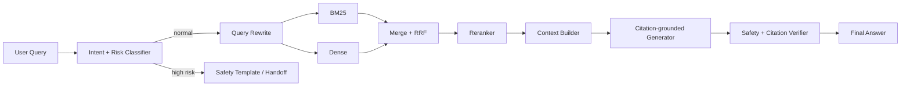
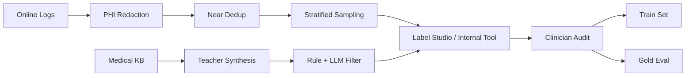
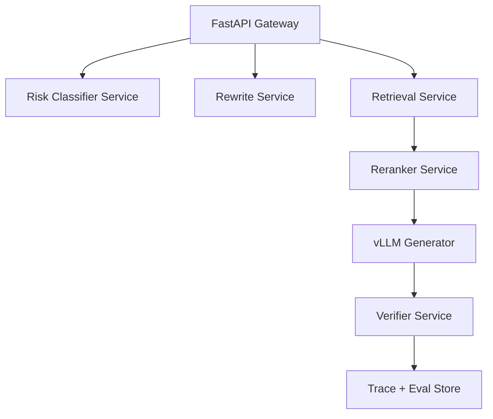

# 医疗问答 Bot 小模型 SFT 训练与应用

> 目标：把百度健康助手这类医疗问答 Bot 里的小模型训练讲成一套能落地的算法工程方案。SFT 不负责把医学知识“记进模型”，医学知识仍然来自医学百科、药品库、指南、医生/科室库和 RAG 证据；SFT 负责让小模型稳定完成意图识别、风险识别、query rewrite、引用式回答格式、reranker 精排和结果校验。

---

## 0. 一句话结论

医疗问答 Bot 里最值得 SFT 的不是一个“全能医疗大模型”，而是一组小模型：

| 模型 | 位置 | 训练目标 | 推荐基座 | 线上形态 |
|---|---|---|---|---|
| 意图/风险分类器 | 用户输入后、RAG 前 | 分清症状咨询、药品问答、报告解读、急症/处方/诊断高风险 | Qwen3-0.6B / Qwen3-1.7B / 中文 encoder | 独立分类服务 |
| Query rewrite 模型 | 检索前 | 把口语症状改写成医学术语、药品别名、BM25 关键词和 dense query | Qwen3-1.7B / Qwen3-4B | 低温生成 JSON |
| Reranker | 召回后 | 判断 query-doc 是否真实相关，压掉“语义像但医学关系错”的 chunk | Qwen3-Reranker-0.6B / BGE reranker | cross-encoder 服务 |
| Grounded answer 模型 | 生成阶段 | 只基于 context 回答、逐条引用、不足则拒答或追问 | Qwen3-4B / Qwen3-8B | vLLM + LoRA |
| Safety verifier | 生成后 | 检查未引用医学断言、处方剂量、延误就医、高危漏拦 | Qwen3-1.7B / Qwen3-4B | 同步 gate |

工程上先训三个最值钱的：**风险分类器、query rewrite、reranker**。这三个直接影响召回质量和安全兜底，比一开始训生成模型更稳。

## 1. 和现有医疗 RAG 链路的关系

现有链路是：



SFT 插入的是四个确定位置：

1. **RISK**：高风险召回优先，不追求单纯 accuracy。
2. **RW**：提升 BM25 / Dense 的召回覆盖率，不能编造用户没说的事实。
3. **RR**：提升 Top-3 / Top-5 高位质量。
4. **GEN / VER**：控制回答格式、引用、拒答和转人工风格。

这和 [RAG、混合检索与医疗问答](../review/02-rag-retrieval.md)、[医疗 RAG 工程实现](../interview/notes/rag-hybrid-retrieval.md)、[RAG Hybrid Scorer](../code/engineering/06-rag-hybrid-scorer.md) 是同一条链路，只是把“模型怎么训”补齐。

## 2. 场景拆分：每个小模型训什么

### 2.1 意图/风险分类器

输入是一轮或多轮对话上下文，输出结构化标签：

```json
{
  "intent": "drug_qa",
  "risk_level": "high",
  "risk_types": ["pregnancy_drug", "dose_adjustment"],
  "entities": [
    {"type": "drug", "text": "布洛芬"},
    {"type": "population", "text": "孕妇"}
  ],
  "action": "handoff_or_refuse",
  "confidence": 0.91
}
```

标签体系建议：

| 一级标签 | 二级标签 | 线上动作 |
|---|---|---|
| symptom | chest_pain / dyspnea / fever / pain / child_symptom | 普通症状进问诊状态机，高危直接急症提示 |
| disease_qa | disease_intro / prevention / treatment_overview | RAG-only，禁止确诊 |
| drug_qa | contraindication / interaction / dose / side_effect | 药品库优先，剂量/调整类高风险 |
| report | lab_value / imaging / interpretation | 解释指标含义，禁止诊断结论 |
| dept_doctor | department / registration / hospital | 走业务检索 |
| high_risk | emergency / prescription / diagnosis / pregnancy / child / elderly / self_harm | 拒答、追问或转人工 |

评测重点：

- 高风险召回率 >= 98%。
- 急症漏拦率接近 0，宁可误拦。
- macro-F1 看整体，但不能用整体 accuracy 掩盖长尾风险。
- confidence 需要 calibration，线上按阈值分级。

### 2.2 Query Rewrite

Query rewrite 不是“润色问题”，而是生成检索计划：

```json
{
  "original_query": "最近胸口闷喘不上气，还出了好多汗",
  "semantic_queries": [
    "胸闷 气短 出汗 可能原因",
    "胸痛 呼吸困难 大汗 急症"
  ],
  "keyword_queries": [
    "胸闷 气短 大汗",
    "胸痛 呼吸困难 心肌梗死"
  ],
  "entities": [
    {"type": "symptom", "text": "胸闷"},
    {"type": "symptom", "text": "呼吸困难"},
    {"type": "symptom", "text": "大汗"}
  ],
  "risk_hints": ["possible_emergency"],
  "filters": {"kb_scope": ["guideline", "disease", "first_aid"]}
}
```

训练约束：

- 可以补医学同义词，不能补病史、年龄、性别、用药史等用户没说的信息。
- 对药品名、检查指标、疾病名做别名扩展。
- 对高风险 query 输出 `risk_hints`，上层安全策略仍由 risk classifier 决定。
- 输出必须是 JSON，配合 Pydantic 校验失败重试。

### 2.3 Reranker

Reranker 是最有性价比的 SFT 对象。Bi-encoder 负责大规模召回，cross-encoder 对 Top-100/Top-200 做精排。

训练样本形式：

```json
{
  "query": "孕妇可以吃布洛芬吗",
  "doc": "布洛芬属于非甾体抗炎药，孕晚期禁用，孕期用药需遵医嘱。",
  "label": 1,
  "hard_negative_type": "same_drug_wrong_population",
  "source": "drug_label"
}
```

负样本要硬：

- BM25 命中药品名但人群错。
- Dense 语义相似但医学关系错。
- 同疾病不同阶段。
- 同检查项目但指标方向相反。
- 过期指南或低权威来源。

指标：

- nDCG@10。
- MRR@10。
- Top-3 全相关率。
- answerable-context precision。
- rerank latency：Top-100 P95 目标 < 250ms，Top-50 P95 目标 < 150ms。

### 2.4 Grounded Answer

Grounded answer 的 SFT 目标不是“医学更聪明”，而是让模型遵守回答模板：

- 每个医学断言都必须引用 context。
- context 不足就说资料不足。
- 不给确诊、不改处方、不建议延误就医。
- 高风险情况直接触发线下就医/急诊/人工。
- 回答短、可读、可追溯。

输出模板：

```json
{
  "answer": "根据资料，布洛芬属于非甾体抗炎药，孕晚期通常不建议使用[1]。如果你已经怀孕或正在备孕，不建议自行用药，应咨询线下医生或药师。",
  "citations": [
    {"id": "1", "doc_id": "drug_label_ibuprofen", "span": "孕晚期禁用..."}
  ],
  "safety": {
    "risk_level": "high",
    "handoff": true,
    "reason": "pregnancy_drug"
  }
}
```

## 3. 数据集设计

### 3.1 数据来源

| 来源 | 用途 | 处理方式 |
|---|---|---|
| 线上匿名日志 | 意图、rewrite、badcase、真实口语表达 | 脱敏、去 PHI、去重、分层采样 |
| 医学百科 / 疾病库 / 药品说明书 | grounded QA、reranker 正样本 | 切 chunk、保留版本、权威等级 |
| 临床指南 / 共识 | 高权威 context、冲突/过期样本 | 只做引用来源，不让模型背诵 |
| 人工标注高风险集 | risk classifier、verifier | 医学审核优先 |
| LLM teacher 合成样本 | 冷启动覆盖长尾表达 | 必须用规则和人工抽检过滤 |
| 公共数据集 | 预热和 sanity check | 不作为上线 gate |

公共数据可用于冷启动和评测补充：

- Huatuo-26M：中文医疗问答/指令数据，可做通用医疗语言风格预热。
- CMExam / CMB / MedBench：更适合考试型医学能力 sanity check。
- medical-o1-reasoning-SFT：可参考复杂医学推理格式，但不能直接代表中文 C 端问答。

核心原则：**公共数据不能替代本项目日志和医学审核数据**。用户真实表达、风险边界、知识库版本、产品策略都来自本项目。

### 3.2 推荐规模

| 任务 | 冷启动规模 | 稳定迭代规模 | 标注优先级 |
|---|---:|---:|---|
| 意图/风险分类 | 5k-20k | 50k+ | 高风险必须人工审核 |
| Query rewrite | 10k-50k | 100k+ | 抽检实体幻觉 |
| Grounded answer | 20k-100k | 200k+ | 高风险/药品/儿童/孕妇人工审核 |
| Reranker | 50k-500k pair/triple | 1M+ | hard negative 自动生成 + 抽检 |
| Verifier | 10k-50k | 100k+ | 重点覆盖漏引用和 unsafe advice |
| Gold eval | 300-1,000 | 2k-5k | 医学人员审核 |

### 3.3 统一样本 schema

```json
{
  "id": "medbot_sft_000001",
  "task": "intent|rewrite|answer|rerank|verifier",
  "messages": [
    {"role": "system", "content": "你是医疗问答助手的安全子模型。"},
    {"role": "user", "content": "孕妇头疼能吃布洛芬吗"}
  ],
  "retrieved_context": [
    {
      "doc_id": "drug_ibuprofen_2025",
      "title": "布洛芬说明书",
      "section": "孕妇及哺乳期妇女用药",
      "authority": "drug_label",
      "updated_at": "2025-03-01",
      "text": "孕晚期禁用布洛芬，孕期用药需咨询医生或药师。",
      "url": "internal://drug/ibuprofen"
    }
  ],
  "labels": {
    "intent": "drug_qa",
    "risk_level": "high",
    "risk_types": ["pregnancy_drug"],
    "entities": [{"type": "drug", "text": "布洛芬"}],
    "rewrite": ["孕妇 布洛芬 禁忌", "孕期 非甾体抗炎药 用药安全"]
  },
  "answer": {
    "text": "不建议自行服用。资料显示孕晚期禁用布洛芬，孕期用药需要咨询医生或药师[1]。",
    "citations": [{"citation_id": "1", "doc_id": "drug_ibuprofen_2025", "span": "孕晚期禁用布洛芬"}],
    "safety_flags": ["handoff_pharmacist"]
  },
  "source": "log|guideline|synthetic|clinician_written",
  "review_status": "llm_labeled|clinician_reviewed",
  "split": "train|dev|test"
}
```

### 3.4 数据清洗流水线



关键细节：

- 脱敏先于任何 teacher 生成，用户 ID、手机号、地址、就诊号、病历号全部去掉。
- 训练/验证/测试按 disease、drug、source_doc 维度切分，避免同一文档泄漏。
- 高风险样本过采样，但 eval 按线上分布 + 风险分桶各出一份。
- synthetic 样本必须带 `source_doc_id`，否则后续无法验证引用。
- label studio 里标注员要看到上下文、候选答案和安全标签，不只标 intent。

## 4. 模型选型

### 4.1 基座选择

| 模型 | 适用位置 | 取舍 |
|---|---|---|
| Qwen3-0.6B | intent、risk、轻量 verifier | 延迟低，复杂生成能力弱 |
| Qwen3-1.7B | intent、rewrite、verifier | 单卡成本低，中文能力够用 |
| Qwen3-4B | rewrite、grounded answer、策略生成 | 质量/延迟平衡点 |
| Qwen3-8B | 高质量 grounded answer / teacher distill | 质量更好，线上成本更高 |
| Qwen3-Reranker-0.6B / BGE reranker | rerank | cross-encoder，吞吐比生成模型更可控 |
| 中文 RoBERTa / DeBERTa encoder | intent/risk 分类 | 对固定标签任务极便宜，但改标签需重训 |

建议路线：

1. 意图/风险先用 encoder 或 Qwen3-0.6B SFT。
2. Query rewrite 用 Qwen3-1.7B / 4B。
3. Grounded answer 用 Qwen3-4B LoRA，保留 8B 做高质量候选。
4. Reranker 单独训，不要用生成模型“打分”替代 cross-encoder。

### 4.2 为什么不用一个 7B/8B 干所有事

- 风险分类需要极低漏拦和稳定 latency，生成模型容易受 prompt 影响。
- Rerank 是 query-doc pair scoring，cross-encoder 更合适。
- Query rewrite 需要结构化 JSON，可用小生成模型。
- Grounded answer 才需要更强生成能力。
- 多小模型可以独立 A/B、回滚、压测和扩容。

## 5. 训练框架选择

| 框架 | 用在什么阶段 | 为什么选 |
|---|---|---|
| LLaMA-Factory | 第一版 SFT / LoRA / DPO 实验 | 配置化、中文社区成熟、支持多种后训练方式 |
| Transformers + TRL SFTTrainer | 需要自定义 dataset、collator、loss mask 时 | 官方生态清晰，适合工程化脚本 |
| PEFT + bitsandbytes | LoRA / QLoRA | 降低显存，迭代快 |
| DeepSpeed ZeRO-2/3 | 多卡训练 / full fine-tune | 参数、梯度、优化器状态分片 |
| Unsloth | 单卡快速试验 | 适合 24GB/48GB 单卡调参 |
| FlagEmbedding / Sentence-Transformers | reranker / embedding 训练 | 检索模型训练生态成熟 |
| vLLM | 生成模型 serving | 支持高吞吐推理、LoRA adapter、prefix caching |

落地建议：

- 研究/冷启动：LLaMA-Factory + QLoRA。
- 工程化训练：TRL + PEFT + 自定义数据校验。
- 大规模多卡：DeepSpeed / FSDP。
- 服务化：vLLM 部署 generator；reranker 用 TEI、FlagEmbedding server 或自建 FastAPI batch 服务。

## 6. 机器配置

### 6.1 训练配置分层

| 层级 | 机器 | 适用任务 | 说明 |
|---|---|---|---|
| 本地迭代 | 1 x RTX 4090 24GB / RTX 6000 Ada 48GB | Qwen3-0.6B/1.7B QLoRA、分类器、少量 rewrite | 用 Unsloth 或 QLoRA，快速看 loss 和格式 |
| 单卡生产试训 | 1 x L40S 48GB / A100 40GB | Qwen3-4B QLoRA、reranker 0.6B | 可以跑 2k-8k seq_len，适合日常迭代 |
| 标准训练 | 4 x A100 80GB / 4 x H800 80GB | Qwen3-4B/8B LoRA、多任务混合 SFT、reranker 大样本 | 推荐作为主训练资源 |
| full fine-tune | 8 x A100/H100/H800 80GB | 8B full fine-tune 或长上下文 | 成本高，除非 LoRA 不够再上 |
| 服务压测 | 1-2 x L40S / A10 / L4 | 线上推理、reranker batch | 关注 QPS、P95、显存水位 |

### 6.2 软件环境

```text
OS: Ubuntu 22.04
CUDA: 12.1 / 12.4
Python: 3.10 / 3.11
PyTorch: 2.4+
Transformers: 4.50+
TRL: 0.20+ / 1.x
PEFT: 0.14+
bitsandbytes: 0.43+
DeepSpeed: 0.15+
LLaMA-Factory: latest stable
vLLM: latest stable
```

环境固定后要把以下信息写入每次训练的 `run_config.json`：

- base model revision。
- dataset commit/hash。
- tokenizer revision。
- LoRA rank/alpha/dropout。
- max sequence length。
- global batch size。
- precision。
- GPU 型号和数量。
- seed。
- eval set version。

## 7. SFT 训练配置

### 7.1 QLoRA 默认参数

| 参数 | 建议值 | 说明 |
|---|---|---|
| quantization | 4bit NF4 | 适合 24GB/48GB 单卡 |
| compute dtype | bf16 | A100/L40S/H100 更稳 |
| LoRA rank | 16 / 32 / 64 | 小任务 16，生成 32-64 |
| LoRA alpha | 32 / 64 | 通常 alpha = 2 * rank |
| LoRA dropout | 0.03-0.05 | 医疗数据不大时防过拟合 |
| target modules | q_proj,k_proj,v_proj,o_proj,gate_proj,up_proj,down_proj | 生成任务覆盖 attention + MLP |
| learning rate | 1e-4 LoRA 起步 | full fine-tune 用 1e-5 或更低 |
| epoch | 1-3 | 超过 3 轮警惕格式记忆和过拟合 |
| warmup | 3% | 小数据集保持稳定 |
| scheduler | cosine | 常规稳定 |
| max seq len | 2048 / 4096 / 8192 | answer 模型要覆盖 RAG context |
| packing | rewrite/classification 可开，answer 谨慎 | 避免长上下文样本混乱 |
| loss mask | assistant_only_loss | 不训练用户/system/context token |

### 7.2 LLaMA-Factory 配置示例

```yaml
### model
model_name_or_path: Qwen/Qwen3-4B
trust_remote_code: true

### method
stage: sft
do_train: true
finetuning_type: lora
lora_rank: 32
lora_alpha: 64
lora_dropout: 0.05
lora_target: all

### dataset
dataset: medbot_grounded_answer_v1
template: qwen3
cutoff_len: 4096
overwrite_cache: true
preprocessing_num_workers: 16

### output
output_dir: output/qwen3-4b-medbot-sft-lora
logging_steps: 10
save_steps: 500
plot_loss: true
overwrite_output_dir: true

### train
per_device_train_batch_size: 2
gradient_accumulation_steps: 16
learning_rate: 1.0e-4
num_train_epochs: 2
lr_scheduler_type: cosine
warmup_ratio: 0.03
bf16: true
ddp_timeout: 180000000
gradient_checkpointing: true

### eval
val_size: 0.03
per_device_eval_batch_size: 2
eval_strategy: steps
eval_steps: 500
```

对应命令：

```bash
llamafactory-cli train configs/medbot/qwen3_4b_sft_lora.yaml
```

### 7.3 TRL SFTTrainer 骨架

```python
from datasets import load_dataset
from peft import LoraConfig
from transformers import AutoModelForCausalLM, AutoTokenizer, BitsAndBytesConfig
from trl import SFTConfig, SFTTrainer
import torch

model_id = "Qwen/Qwen3-4B"

bnb_config = BitsAndBytesConfig(
    load_in_4bit=True,
    bnb_4bit_quant_type="nf4",
    bnb_4bit_compute_dtype=torch.bfloat16,
)

tokenizer = AutoTokenizer.from_pretrained(model_id, trust_remote_code=True)
model = AutoModelForCausalLM.from_pretrained(
    model_id,
    trust_remote_code=True,
    quantization_config=bnb_config,
    device_map="auto",
)

dataset = load_dataset("json", data_files={
    "train": "data/medbot_sft_train.jsonl",
    "validation": "data/medbot_sft_dev.jsonl",
})

peft_config = LoraConfig(
    r=32,
    lora_alpha=64,
    lora_dropout=0.05,
    target_modules=["q_proj", "k_proj", "v_proj", "o_proj", "gate_proj", "up_proj", "down_proj"],
    task_type="CAUSAL_LM",
)

args = SFTConfig(
    output_dir="output/qwen3-4b-medbot-sft",
    max_length=4096,
    learning_rate=1e-4,
    num_train_epochs=2,
    per_device_train_batch_size=2,
    gradient_accumulation_steps=16,
    warmup_ratio=0.03,
    bf16=True,
    assistant_only_loss=True,
    logging_steps=10,
    eval_steps=500,
    save_steps=500,
)

trainer = SFTTrainer(
    model=model,
    args=args,
    train_dataset=dataset["train"],
    eval_dataset=dataset["validation"],
    peft_config=peft_config,
    processing_class=tokenizer,
)

trainer.train()
```

## 8. Reranker 训练方案

Reranker 不建议混在 generator SFT 里。它是检索链路模型，独立训练、独立评测、独立部署。

### 8.1 数据组织

```json
{
  "query": "孩子发烧 39 度能吃布洛芬吗",
  "positive": {
    "doc_id": "drug_ibuprofen_child",
    "text": "儿童使用布洛芬需按年龄和体重，并注意禁忌症..."
  },
  "hard_negatives": [
    {
      "doc_id": "drug_ibuprofen_adult",
      "text": "成人布洛芬常规用法..."
    },
    {
      "doc_id": "disease_fever_general",
      "text": "发热可能由感染等原因引起..."
    }
  ],
  "risk_tags": ["child", "drug_dose"]
}
```

### 8.2 训练策略

- 每个 query 配 1 个正样本 + 4-10 个 hard negatives。
- hard negatives 从 BM25 和 dense Top-100 里采样。
- 对药品、儿童、孕妇、急症 query 加大权重。
- max length 512 起步；如果 chunk 很长，用 1024/2048，但要压测延迟。
- 输出 relevance score 后做 threshold calibration：低于阈值时不让生成模型自由回答。

### 8.3 目标指标

| 指标 | 基线 | 目标 |
|---|---:|---:|
| nDCG@10 | 0.60-0.70 | 0.75+ |
| Top-3 命中率 | 70% | 88%+ |
| 高风险 answerable-context precision | 85% | 95%+ |
| Top-100 rerank P95 | 300ms+ | < 250ms |
| 弱证据误放行率 | 5%+ | < 1% |

这里的数值是压测目标，必须绑定具体硬件、batch size、max length、TopK，不能脱离环境空报。

## 9. 线上服务与性能压测

### 9.1 服务拓扑



部署建议：

- intent/risk：CPU encoder 或 1 张 L4/T4 跑 batch；Qwen 小模型则独立 GPU。
- rewrite：Qwen3-1.7B/4B，低温、JSON schema、max_new_tokens 256。
- reranker：按 TopK batch，batch size 32/64 压测。
- generator：vLLM + LoRA adapter，开启 prefix caching；RAG 系统 prompt 和工具说明通常是共享前缀。
- verifier：小模型 + 规则组合，失败时重试一次或降级安全模板。

### 9.2 性能指标口径

| 链路 | 指标 | 目标口径 |
|---|---|---|
| risk classifier | P95 latency | < 50ms encoder / < 150ms 小生成模型 |
| query rewrite | P95 latency | < 300ms |
| BM25 + dense | P95 latency | < 250ms 并发执行 |
| reranker Top-100 | P95 latency | < 250ms |
| generator TTFT | P95 | < 800ms |
| full answer | P95 | < 3.5s，视回答长度 |
| safety verifier | P95 latency | < 200ms |
| 主链路 SLA | availability | 99.9%+ |

压测必须记录：

- GPU 型号、数量、显存。
- quantization：bf16 / fp16 / int8 / int4。
- context length。
- input/output token 分布。
- batch size / max concurrency。
- TopK 和 rerank max length。
- 是否启用 prefix cache。

### 9.3 vLLM serving 示例

```bash
vllm serve Qwen/Qwen3-4B \
  --served-model-name medbot-answer-sft \
  --enable-lora \
  --lora-modules medbot_sft=output/qwen3-4b-medbot-sft-lora \
  --max-model-len 8192 \
  --gpu-memory-utilization 0.85
```

调用时对普通问答关闭 thinking/长推理，减少 latency：

```json
{
  "model": "medbot-answer-sft",
  "messages": [
    {"role": "system", "content": "你只能根据给定医学资料回答，并为每个医学断言添加引用。"},
    {"role": "user", "content": "孕妇头疼能吃布洛芬吗\n\n资料：[1] ..."}
  ],
  "temperature": 0.1,
  "max_tokens": 512
}
```

## 10. 离线评测

### 10.1 分类器

| 指标 | 说明 |
|---|---|
| macro-F1 | 避免头部意图掩盖长尾 |
| high-risk recall | 医疗安全主 KPI |
| emergency false negative rate | 必须单独报 |
| AUROC / AUPRC | 风险阈值选择 |
| ECE / Brier score | 置信度校准 |

### 10.2 Rewrite

| 指标 | 说明 |
|---|---|
| Recall@50 / Recall@100 | 改写后是否提升召回覆盖 |
| nDCG@10 | 高位质量 |
| entity hallucination rate | 是否编造实体/病史 |
| query drift rate | 是否把问题改偏 |
| downstream answerable rate | context builder 是否拿到可回答证据 |

### 10.3 Reranker

| 指标 | 说明 |
|---|---|
| nDCG@10 | 排序质量 |
| MRR@10 | 首个正确证据位置 |
| Top-3 full relevance | 前三条是否都支持回答 |
| weak-evidence block rate | 弱证据是否能拦住 |
| latency/QPS | 服务指标 |

### 10.4 Grounded Answer / Verifier

| 指标 | 说明 |
|---|---|
| citation precision / recall | 引用是否真实支撑回答 |
| unsupported claim rate | 医学断言是否脱离 context |
| refusal precision / recall | 拒答是否过度或漏拦 |
| clinician usefulness score | 医学人员打分 |
| unsafe advice rate | 处方、剂量、延误就医等 |

## 11. 上线策略

### 11.1 灰度顺序

1. 只上线 risk classifier shadow，不影响用户。
2. 用 rewrite shadow 观察 Recall@K 和 query drift。
3. reranker A/B：只改排序，不改生成策略。
4. grounded answer 小流量灰度，保留旧模型 fallback。
5. verifier 先只报警，再逐步接管拦截。

### 11.2 回滚条件

- 高风险漏拦增加。
- 弱证据误放行增加。
- 引用错误率增加。
- P95 latency 超过 SLA。
- 用户投诉/人工复核 badcase 激增。

### 11.3 线上 active learning

每条 trace 记录：

```json
{
  "query": "...",
  "risk_result": {...},
  "rewrite_result": {...},
  "retrieved_docs": [...],
  "rerank_scores": [...],
  "answer": "...",
  "verifier": {...},
  "user_feedback": "helpful|unsafe|wrong|unclear",
  "human_review": {...}
}
```

回流优先级：

1. 高风险低置信样本。
2. 用户点踩 + verifier 未拦。
3. 召回无结果但人工能回答。
4. 引用错位。
5. 新疾病、新药品、新指南版本。

## 12. 常见失败模式

| 失败 | 原因 | 修复 |
|---|---|---|
| 分类器整体准确率高但急症漏拦 | 数据分布被头部普通问答占满 | 高风险重采样，单独看 recall |
| rewrite 编造年龄/性别/病史 | teacher 合成数据没约束 | schema 增加 `unsupported_additions`，训练负例 |
| reranker 把语义相似错误 chunk 排前 | hard negative 不够硬 | 从线上 badcase 采同药不同人群、同病不同阶段 |
| answer 有引用但引用不支撑断言 | 只训格式，没训 span 对齐 | 加 citation verifier 和 span-level 标注 |
| 模型过度拒答 | safety 样本比例过高 | 分桶评测 refusal precision/recall，调阈值 |
| latency 爆炸 | 所有阶段都用生成模型 | 分类器/规则前置，reranker batch，普通问答禁用长推理 |

## 13. 面试口播

> 医疗问答里的 SFT 我不会理解成“把医学知识灌进模型”。知识应该留在可更新、可审计的 RAG 知识库里。SFT 主要训五类小模型：风险分类、query rewrite、reranker、引用式回答和 verifier。训练上我会用本地脱敏日志、医学知识库生成的 grounded QA、人工审核高风险样本和 hard negative rerank 数据；框架上冷启动用 LLaMA-Factory，工程化用 TRL + PEFT/QLoRA，多卡才上 DeepSpeed。上线看的是 high-risk recall、Top-3 命中率、citation precision、unsupported claim rate 和 P95 latency，而不是只看 loss 降没降。

## 14. 资料来源

- TRL SFTTrainer：<https://huggingface.co/docs/trl/sft_trainer>
- PEFT：<https://huggingface.co/docs/peft/en/index>
- LLaMA-Factory：<https://github.com/hiyouga/LLaMA-Factory>
- vLLM：<https://docs.vllm.ai/en/latest/>
- Qwen3：<https://qwenlm.github.io/blog/qwen3/>
- Qwen3 Embedding：<https://arxiv.org/abs/2506.05176>
- Qwen3-Reranker-0.6B：<https://huggingface.co/Qwen/Qwen3-Reranker-0.6B>
- DeepSpeed ZeRO：<https://www.deepspeed.ai/tutorials/zero/>
- Huatuo-26M：<https://arxiv.org/abs/2305.01526>
- CMExam：<https://arxiv.org/abs/2306.03030>
- CMB：<https://arxiv.org/abs/2308.08833>
- RAGAS：<https://arxiv.org/abs/2309.15217>
