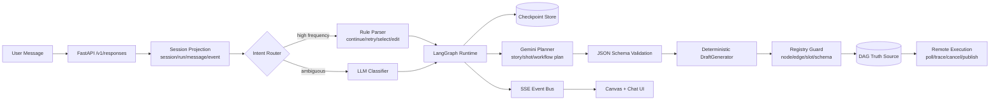
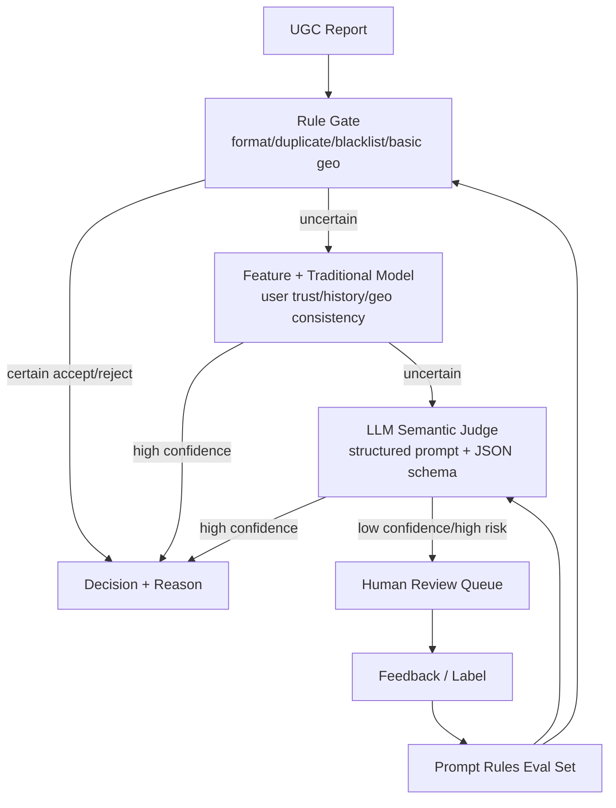

# 马震 AI Agent / 后端研发面试深度 Q&A

> 目标岗位：AI Agent 开发工程师 / LLM 应用平台研发 / Python & Golang 后端研发  
> 使用方式：先背“主线叙事”和“项目总览”，再按章节做追问演练。每个答案都要落到：业务问题 -> 技术决策 -> 工程取舍 -> 指标结果 -> 复盘反思。

## 0. 候选人主线定位

你的优势不是“会调大模型 API”，而是“能把 LLM 原型做成可恢复、可观测、可评测、可控成本的生产级系统”。面试中应持续强化三条主线：

1. **Agent Runtime 工程化**：LangGraph 多阶段状态机、Checkpoint、Interrupt/Resume、SSE 流式、DAG 装配与执行闭环。
2. **RAG 与搜索质量**：混合检索、rerank、引用溯源、Badcase 回流、医疗安全边界。
3. **后端与平台底座**：FastAPI/Golang/K8s/GPU 调度/中间件/可观测，让 AI 能在真实流量和组织流程里稳定运行。

面试官真正想确认的是：

- 你是否理解 Agent 和 Workflow 的边界，而不是一味追求“全自动”。
- 你是否知道 LLM 不稳定，所以把不确定性隔离在 Planner、Classifier、Judge 这类可评测模块中。
- 你是否能处理上线后的工程细节：SSE 断线、反代缓冲、幂等、重试、回放、成本、评测、trace、权限、兜底。
- 你是否能用真实项目指标证明“做过”，并解释指标是怎么量出来的。

## 1. 开场与自我介绍

### Q1：请做一个 1 分钟自我介绍。

**建议答案：**

我有 7 年后端和 AI 平台研发经验，前几年主要在百度做医疗 Bot、地图 UGC 机审和 Kubernetes GPU 调度平台，近一年聚焦 AI Agent、LangGraph、RAG 和多模态 DAG 编排。

我比较核心的特点是能把 LLM 原型落到生产系统里。比如在 ArtArch.AI，我基于 LangGraph 做了一个多阶段 Agent Runtime，把创作任务拆成意图识别、规格确认、故事方案、核心元素、分镜和 DAG Draft 等节点；LLM 负责 Planner，最终 DAG 由确定性装配器生成。这个设计把 DAG 一次性可执行率从大约 55% 提升到 95% 以上，也把幻觉节点和非法边基本压住了。

在百度健康助手，我参与 RAG 召回链路重构，通过 BM25 + Dense 混合检索、bge-reranker 和引用溯源，把 Top-3 命中率从约 70% 提到 88% 以上，同时做了高风险医疗问题的安全兜底。整体来说，我更擅长把业务规则、模型能力和后端平台结合起来，做可上线、可追踪、可持续迭代的 AI 系统。

**回答要点：**

- 不要把自己介绍成“普通后端 + 会用 AI”。
- 第一段给年限和方向，第二段给 Agent 标志性成果，第三段给 RAG/平台补强。
- 指标只讲简历中能解释清楚的：95%+、1.5s、40%、88%+、98%+、300+ GPU。

### Q2：你为什么适合 AI Agent 岗位，而不是传统后端岗位？

**建议答案：**

AI Agent 岗位需要两类能力叠加：一类是 LLM/RAG/工具调用/状态机这些新技术，另一类是传统后端的可靠性、数据建模、流式协议、任务调度、可观测和成本治理。我的经历刚好在这两个方向都有生产经验。

在 Agent 平台里，我不会把所有事情都交给模型，而是会拆成：规则能确定的用规则，LLM 擅长理解和规划的交给 Planner，最终需要稳定执行的 DAG 用确定性装配。这个思路本质上是把 LLM 当成“不确定的智能组件”，再用后端工程把边界收住。

传统后端经验也非常关键，比如 SSE 要处理代理缓冲和断线恢复，DAG 执行要考虑幂等和重试，工具调用要有 schema、权限、超时、fallback 和 trace。没有这些工程能力，Agent demo 很容易能跑但上不了线。

**面试官可能追问：那你认为 Agent 工程和普通后端最大差异是什么？**

普通后端大多追求确定性输入输出，Agent 工程要管理概率性组件。核心差异不是多调一个模型，而是要建立一套“控制不确定性”的系统：状态显式化、工具边界清晰、输出结构化、每一步可观测、失败可恢复、质量可评测、成本可预算。

## 2. ArtArch.AI Agent Runtime 深挖

### Q3：你们为什么选择 LangGraph，而不是直接用 LangChain Agent 或自己写状态机？

**建议答案：**

我会从控制力、持久化和生产可恢复性三个角度回答。

第一，创作 Agent 不是一个简单的 ReAct loop。它有明确阶段：意图识别、规格确认、故事方案、核心元素、分镜、音乐音效、DAG Draft，每个阶段的输入输出、校验规则、是否需要用户确认都不一样。LangGraph 的 StateGraph 更适合把这些阶段显式建模，而不是隐藏在一个 prompt loop 里。

第二，生产系统需要 Checkpoint、Interrupt/Resume、历史回放和断线恢复。LangGraph 的 persistence 机制会按 thread 保存图状态，使我们可以用 `thread_id=session_id` 管理会话；当用户中断、刷新、重新连接时，可以从 checkpoint 恢复，而不是重新跑完整任务。

第三，LangGraph 抽象比较低层，不强迫我采用某一种 Agent 形态。我们可以让 LLM 做 Planner，也可以插入规则节点、验证节点、确定性装配节点和工具执行节点。这个灵活度对多模态 DAG 平台很重要。

**深挖补充：**

- LangChain Agent 更适合快速搭建标准工具调用；LangGraph 更适合长流程、强状态、可中断、可恢复的 Agent Runtime。
- 自己写状态机也能做，但 checkpoint、subgraph、streaming、HITL 这些通用能力自己维护成本高，且容易遗漏边界。

### Q4：请画一下你们 Agent Runtime 的核心架构。

**讲解顺序：**

1. 用户输入进入 `/v1/responses`，先落 session/run/message/event 投影，保证可追踪。
2. 意图层分两层：规则先处理高频明确指令，歧义再给 LLM 分类。
3. LangGraph 管阶段流转和 checkpoint。
4. Planner 输出创意结构和工作流选择，但不直接生成最终 DAG。
5. DraftGenerator 用模板和 registry 做确定性装配。
6. Registry Guard 校验节点、edge、slot、schema，避免非法 DAG。
7. 前端通过 SSE 看到阶段推进、planner delta、DAG 更新和验证报告。

### Q5：为什么用“Planner + 确定性装配”，而不是让 LLM 直接生成 DAG？

**建议答案：**

我们最开始试过直接让 LLM 输出完整 DAG，但问题很明显：节点名会幻觉，edge 的 targetHandle 容易错，slot 类型不匹配，布局和真实 Canvas 数据差距很大，导致一次性可执行率只有约 55%。

后来把职责拆开：LLM 负责它擅长的创意理解、分镜规划、选择合适 workflow pattern；DraftGenerator 负责它不擅长但系统必须稳定的部分，比如真实节点模板、edge handle、slot schema、custom_config、flow_info 布局。这样 LLM 输出的是受 schema 约束的 plan，而不是任意 JSON。

这个方案的本质是“让模型做语义决策，让代码做结构装配”。最终 DAG 一次性可执行率提升到 95%+，非法节点和非法边基本归零，后续排障也更容易，因为问题可以定位在 Planner、模板、装配器或 registry 校验中的某一层。

**可追问：怎么定义 DAG 一次性可执行率？**

一次性可执行率是指用户一次生成后，不经过人工修 DAG，系统能通过 Registry Guard 校验并提交到执行引擎的比例。我们会统计生成任务总数、校验通过数、远程执行提交成功数，以及失败原因分布，例如非法 node type、缺 slot、edge handle 错误、模型输出缺字段等。

### Q6：真实模板蒸馏具体怎么做？

**建议答案：**

真实模板蒸馏不是模型训练，而是从线上已经可执行的 DAG/Canvas 数据中抽取结构模式，形成可复用的 Draft Pattern。

我会抽取几类信息：

- workflow ref：某类创作链路对应哪些节点组合，比如 T2I、I2I、T2V、首尾帧视频、音乐生成、视频拼接。
- edge 结构：source/target、targetHandle、输入输出 slot 对应关系。
- node schema：每个节点必填字段、默认值、custom_config、输入输出约束。
- layout 信息：flow_info 中节点位置、分组和 Canvas 展示习惯。
- 业务槽位：例如人物、风格、时长、镜头数、比例、音效、转场。

Planner 只需要选择 pattern 和填充高层语义，装配器再把 pattern 展开成真实 DAG。这样模型输出更贴近产品已有工作流，工程风险也更低。

### Q7：双层意图解析为什么能降低 40% 成本？

**建议答案：**

Agent 对话里有大量高频短指令，其实不需要 LLM。比如“继续”“重试”“选 A”“改第 2 个镜头”“再短一点”“重新生成音乐”。这些指令如果每次都调用 LLM 分类，延迟和成本都很浪费。

所以我做了双层意图解析：

1. 规则层用正则、关键词、当前阶段上下文处理明确意图。
2. 规则层不确定时，再交给 LLM Classifier。

规则层覆盖了约 70% 高频指令，平均解析延迟小于 50ms。因为这些请求不再调用模型，整体 LLM 调用成本下降约 40%。同时规则层不是硬编码业务答案，而是针对“动作类型”做解析，例如 continue/retry/select/edit/cancel，这样可维护性还可以。

**容易被追问：规则会不会误判？**

会，所以规则层必须只处理高置信场景。比如“继续”在某些阶段可能是确认进入下一步，某些阶段可能是继续生成；判断时要结合 current_stage、pending_choices、last_agent_action。低置信或多义表达必须让 LLM 分类，不能为了省成本牺牲正确性。

### Q8：SSE 流式协议怎么设计？为什么不用 WebSocket？

**建议答案：**

我们的核心需求是服务端持续把阶段事件、planner delta、DAG 更新、校验报告推给前端，客户端不需要在同一连接上高频双向通信，所以 SSE 更合适。SSE 基于 HTTP，和反向代理、鉴权、日志链路更容易集成，浏览器有 EventSource 机制，断线重连也比较自然。

事件设计上，我不会只发纯文本 token，而是发结构化事件：

- `stage.started` / `stage.completed`：阶段状态。
- `planner.delta`：模型规划的增量内容。
- `dag.updated`：DAG 草稿或 patch。
- `validation.report`：校验结果和错误原因。
- `message.completed`：一次 run 完成。
- `error` / `run.cancelled`：异常和取消。

服务端要处理几个工程细节：`Content-Type: text/event-stream`、定期 ping 防超时、禁用 Nginx buffering、事件 id 支持断线恢复、长连接清理、客户端取消后释放后台任务。

**什么时候会选择 WebSocket？**

如果需要真正双向高频交互，比如多人协作 Canvas、前端频繁上传操作事件、低延迟双向控制，我会考虑 WebSocket。但单向 run event streaming 用 SSE 更简单、更稳。

### Q9：Checkpoint、Interrupt/Resume 在你们场景里解决了什么问题？

**建议答案：**

它解决的是长流程 Agent 的可恢复和可控问题。创作任务不是一次 LLM 调用结束，用户可能中途确认规格、选择故事方案、修改分镜、断线重连、刷新页面。如果没有 checkpoint，就很难知道当前处在哪个阶段、已经有哪些用户确认、哪些节点已经执行过。

我们用 `thread_id=session_id` 管理会话，每个阶段执行后保存 graph state。用户需要确认时，图可以 interrupt，把待确认选项和上下文发给前端；用户选择后，通过 resume 把决策写回状态继续执行。断线重连时，前端可以根据 session/run/event 投影恢复展示，服务端从 checkpoint 接上。

这里的关键是 state schema 要稳定，不能随便把所有上下文堆进去。需要区分可恢复状态、展示事件、临时变量和大对象引用，大对象放 S3/CDN 或数据库，state 只保存引用。

### Q10：你怎么处理 Agent 的上下文预算？

**建议答案：**

我会按信息价值分层，而不是把 50 轮对话全塞给模型。

- 长期事实：用户固定偏好、项目设定、角色、风格，结构化保存。
- 阶段状态：当前阶段需要的字段，例如脚本规格、镜头列表、DAG pattern。
- 最近交互：保留最近几轮原文，用于消歧和语气延续。
- 历史摘要：早期对话压缩成摘要，但关键决策要结构化保存，不能只靠自然语言摘要。
- 工具结果：只传对当前决策必要的字段，大对象用引用。

对于 Planner，我更倾向给它“结构化上下文 + 当前任务 + 输出 schema”，而不是完整聊天记录。这样既节省 token，也降低模型被历史噪声干扰的风险。

## 3. RAG 与医疗问答深挖

### Q11：你们 RAG 链路为什么要做 BM25 + Dense 混合检索？

**建议答案：**

医疗问答里单一检索方法都有明显短板。BM25 对精确术语、药品名、疾病名、检查指标很强，但对同义表达、口语化症状不够好。Dense 检索能捕捉语义相似，比如“胸口闷喘不上气”和“胸闷气短”，但可能在专业名词、数字、禁忌症上召回不稳定。

所以我们用混合检索：BM25 保证关键词和专业术语召回，Dense 保证语义泛化，再用 reranker 做精排。召回阶段宁可多取一些候选，重排阶段再控制 Top-K 质量。最终 Top-3 命中率从约 70% 提升到 88%+。

**追问：混合结果怎么融合？**

常见有加权归一、RRF、分路召回后合并去重再 rerank。我的经验是不要过早迷信某个公式，先建立评测集，看不同 query 类型的召回贡献：疾病名、症状口语、药品禁忌、报告指标、科室推荐。融合策略要服务于业务分布。

### Q12：bge-reranker 为什么有效？和 embedding 检索有什么区别？

**建议答案：**

Embedding 检索通常是 bi-encoder：query 和 doc 分别编码成向量，用向量相似度快速召回，适合大规模候选筛选，但 query-doc 的细粒度交互不足。

Reranker 通常是 cross-encoder：把 query 和候选文档一起输入模型，直接输出相关性分数。它慢一些，不能全库跑，但对 Top-100 或 Top-200 候选做重排很合适，能更好判断“这个片段是否真的回答了这个问题”。

在医疗场景里，reranker 对降低“看起来语义相似但医学关系不对”的候选很有价值，比如症状、病因、禁忌、适应症之间的关系必须准确。

### Q13：医疗 RAG 怎么降低幻觉？

**建议答案：**

我会从召回、生成、风控、评测四层做。

召回层要保证证据质量：知识源可信、chunk 粒度合适、混合检索 + rerank、Top-K 有足够覆盖，必要时按疾病库、药品库、科室库做垂直路由。

生成层要强制引用溯源：答案必须基于检索片段，关键医学结论要能映射到来源；对证据不足的问题要明确“不足以判断”，不能编。

风控层要识别高风险意图：急症、处方、剂量、孕妇儿童、慢病并发、诊断结论等场景要拒答、建议线下就医或转人工。

评测层要有 Badcase 回流：把线上错误、用户追问、低置信样本纳入评测集，按召回失败、重排失败、生成误读、风控漏判分类修复。

### Q14：高风险问题 98%+ 召回率怎么做？

**建议答案：**

医疗安全更看重召回率，宁可多拦一些，也不能漏掉真正高风险问题。所以我们用了规则 + LLM 双层识别。

规则层覆盖明确高危关键词和模式，比如“胸痛 + 出汗”“呼吸困难”“自杀倾向”“药物过量”“孕妇用药”“儿童剂量”“处方药替代”等。LLM 层处理隐晦表达和上下文组合，例如用户没有说“急症”，但描述持续胸闷、放射痛、冷汗。

命中后不是简单拒答，而是分级处理：急症建议立即线下急诊，诊断/处方类说明不能替代医生，用药风险提示咨询医生或药师。所有命中规则和模型理由都要记录，方便质检和策略迭代。

### Q15：如何构建 RAG 评测集？

**建议答案：**

我会把 RAG 评测拆成 retrieval eval 和 answer eval。

Retrieval eval 需要标注 query 对应的 gold passage 或 gold document，指标看 Recall@K、MRR、Top-3 命中率、按意图类型分桶。Answer eval 则看事实正确性、引用覆盖、拒答正确性、医学安全、可读性。

数据来源包括历史 query、线上 Badcase、人工构造的高风险样本、药品/疾病/报告解读典型问题。关键是样本要覆盖真实分布和高风险长尾，不能只测简单 FAQ。

评测结果要能指导修复：如果 Top-3 没命中是召回问题；召回有正确片段但排不上去是 rerank 问题；证据正确但答案错是 prompt 或生成约束问题；该拒答没拒答是风控问题。

## 4. 百度地图 UGC + LLM 机审深挖

### Q16：LLM 在 UGC 机审里具体做什么？为什么不能全交给 LLM？

**建议答案：**

LLM 主要负责传统规则和模型不擅长的语义判断，比如用户描述和 POI 字段是否一致、证据文本是否支持营业状态变化、上报理由是否可信、是否需要人工复核。它输出结构化 JSON：审核结论、置信度、理由、需人工复核字段。

不能全交给 LLM 有三个原因：

第一，成本和延迟不允许。UGC 是日均百万级，上来就全量调用 LLM 不现实。

第二，很多 case 规则更稳定，比如字段缺失、格式错误、重复上报、黑名单、明显坐标异常，规则直接处理更便宜。

第三，审核系统需要可解释和可回溯。规则、传统模型、LLM、HITL 分层后，每层只处理适合自己的样本，低置信再上抛，成本和质量更可控。

### Q17：四层机审管线怎么设计？

**讲解重点：**

- 低成本层先处理确定样本。
- LLM 只处理语义复杂、规则不确定的样本。
- 人工复核不是失败，而是 HITL 的质量阀门。
- 人工结果回流到规则、prompt 和离线评测。

### Q18：如何保证 LLM 输出可解释？

**建议答案：**

我会要求模型输出结构化结果，而不是自然语言长答案。字段包括：

- `decision`: approve/reject/manual_review
- `confidence`: 0-1
- `reason_codes`: 命中原因枚举
- `evidence`: 支撑判断的用户文本或字段
- `risk_flags`: 是否有低质、重复、地理不一致、证据不足
- `manual_review_fields`: 需要人工确认的字段

这样审核结果可以进工单系统、质检系统和统计报表。解释不是让模型自由发挥，而是把理由限制在业务可枚举的维度里。

## 5. Kubernetes GPU 调度平台深挖

### Q19：你在 K8s GPU 调度平台里做的核心工作是什么？

**建议答案：**

我主要负责后端调度模块，围绕项目、任务、算子、镜像、云盘、GPU、终端、工单等能力建模，并基于 Kubernetes 封装任务提交、资源配置、状态跟踪、日志查看、失败重试和结果管理。

平台统一管理 300+ 张 V100/T4 GPU，用于训练、推理和数据处理任务。技术上要解决多租户资源隔离、GPU 资源申请、任务排队、优先级、失败重试、运行状态同步和可观测。用户不直接面对 K8s YAML，而是通过平台提交任务，平台把业务任务翻译成 Kubernetes 资源。

### Q20：Kubernetes 如何调度 GPU？

**建议答案：**

Kubernetes 本身通过 Device Plugin Framework 管理 GPU 这类特殊硬件。集群管理员在 GPU 节点安装驱动和 NVIDIA device plugin，插件向 kubelet 注册资源，例如 `nvidia.com/gpu`。Pod 在 resources limits 里声明 GPU 数量，调度器就会把 Pod 调度到有对应可用资源的节点。

GPU 和 CPU/memory 不完全一样，通常 GPU 只在 limits 里声明，request 和 limit 要一致或由 limit 推导。平台层还要处理不同 GPU 型号的节点标签、任务队列、配额、优先级和可观测。

### Q21：CRD + Operator 适合什么场景？

**建议答案：**

当一个业务对象有明确生命周期，且需要用 Kubernetes 声明式 API 管理时，适合用 CRD + Operator。CRD 定义自定义资源，Operator 通过控制循环把实际状态不断调和到期望状态。

比如一个 `TrainingJob` 或 `DataProcessJob`，用户声明镜像、资源、输入输出、重试策略和优先级；Operator 负责创建 Pod/Job、挂载存储、监听状态、失败重试、更新 status、清理资源。这样平台可以把领域知识沉淀进控制器，而不是散落在后端脚本里。

## 6. 后端工程与系统设计

### Q22：你如何设计一个生产级 Agent 服务？

**建议答案：**

我会分六层：

1. API 层：REST/SSE/WebSocket，鉴权、限流、幂等、CORS。
2. 会话层：session/run/message/event/checkpoint 投影模型。
3. 编排层：LangGraph 或自研状态机，处理阶段流转、interrupt/resume、重试。
4. 模型层：Provider 抽象、模型路由、fallback、超时、结构化输出校验。
5. 工具层：工具注册、schema、权限、审计、超时、幂等。
6. 可观测与评测：trace、token/cost、latency、error code、eval dataset、Badcase 回流。

核心原则是把 Agent 当成分布式系统，而不是一个 prompt。每次 run 都要可追踪，每个工具调用都要有输入输出和耗时，每次模型输出都要可校验，每个失败都要能分类。

### Q23：如何做多模型路由和 fallback？

**建议答案：**

先抽象统一 Provider 接口：输入 messages/tools/schema/stream config，输出标准化 content/tool_calls/usage/error。上层不要直接依赖某个厂商 SDK。

路由策略可以按任务类型、成本、延迟和质量分层：高频简单分类走便宜模型或规则，复杂规划走强模型，结构化输出要求高的任务选择 schema 支持更好的模型。Fallback 要区分错误类型：超时、429、5xx、schema validation failed、内容安全拒答。不是所有错误都适合重试，例如业务校验失败应该修 prompt 或返回用户澄清。

还要记录 provider、model、prompt version、token、latency、cost、fallback chain，方便后续优化。

### Q24：Agent 工具调用怎么保证安全？

**建议答案：**

工具不是给模型一个函数名就完了，至少要有五层控制：

- Schema：参数强类型、枚举、必填字段、范围约束。
- Permission：哪些用户、哪些阶段、哪些 agent 可以调用。
- Validation：执行前二次校验，不能信任模型参数。
- Idempotency：写操作要有 idempotency key，避免重试造成重复执行。
- Audit：记录调用输入、输出、耗时、调用方、trace id。

高风险工具必须 HITL，比如发送消息、删除数据、发布内容、扣费、调用外部系统。模型可以提出 action proposal，但最终执行要经过策略或用户确认。

## 7. 评测与可观测

### Q25：你如何评测一个 Agent？

**建议答案：**

我会区分 capability eval 和 regression eval。

Capability eval 用来回答“这个 Agent 能做到什么程度”，可以有一定难度，初始通过率不一定高，用于爬坡。Regression eval 用来回答“老能力有没有坏”，应该接近 100% 通过率，适合进 CI。

Agent 评测不能只看最终文本，还要看轨迹：是否调用了正确工具、是否遵守状态机、是否在不确定时请求用户确认、是否超过 token/cost/latency 预算、是否产生非法 DAG。对于可执行任务，最好用确定性 grader，比如 schema validation、DAG dry-run、单元测试、状态检查。主观质量再用 LLM-as-judge，并定期人工校准。

### Q26：Trace 里你最关心哪些字段？

**建议答案：**

我会把 trace 分成 run、stage、model call、tool call、retrieval、validation、execution 几类 span。关键字段包括：

- 业务维度：session_id、run_id、user_id、stage、intent。
- 模型维度：provider、model、prompt_version、input/output tokens、cost、latency、temperature、schema。
- 工具维度：tool_name、arguments hash、status、duration、error_code、retry_count。
- RAG 维度：query rewrite、retrieved doc ids、scores、rerank scores、selected context。
- DAG 维度：node_count、edge_count、validation errors、execution status。
- 用户体验：first token latency、total latency、断线重连、cancel。

这些字段能支持排障、成本优化、质量回放和评测集回流。

## 8. 行为面与反问

### Q27：你项目中最大的技术挑战是什么？

**建议答案：**

最大的挑战是让多模态创作 Agent 既有创意灵活性，又能稳定生成可执行 DAG。LLM 很适合理解创意，但不擅长严格遵守复杂工作流 schema；如果完全靠模型生成，幻觉节点和非法 edge 很难消除。

我的解决方式是重新划分职责：模型做 Planner，代码做确定性装配，真实 DAG 模板做结构先验，Registry Guard 做最后防线。这个改造让一次性可执行率从约 55% 到 95%+。对我来说，这个挑战的收获是：生产级 Agent 的关键不是让模型“更自由”，而是把自由度放在正确的位置。

### Q28：你有没有失败或踩坑的经历？

**建议答案：**

有。早期我们对 LLM 直接生成 DAG 的能力预期过高，以为给足 prompt、示例和 JSON Schema 就能稳定输出。但实际发现，模型能生成“看起来像”的 DAG，却经常在 targetHandle、slot、节点类型、布局细节上犯错。这些错误肉眼不一定马上看出来，但执行时会失败。

后来我把问题拆成两类：语义规划问题和结构执行问题。语义规划交给 LLM，结构执行交给确定性代码。这个调整比继续堆 prompt 更有效。复盘来看，LLM 工程里不能把“格式正确”当成“业务正确”，必须有 registry、dry-run 和线上失败分类。

### Q29：你希望加入后解决什么类型的问题？

**建议答案：**

我希望做两类事情。

第一是 Agent Runtime 和 LLM 应用平台，把工具调用、状态机、RAG、评测、trace、成本治理这些通用能力平台化，让业务 Agent 从 demo 更快走向生产。

第二是复杂业务场景里的 Agent 落地，比如内容创作、企业知识助手、审核提效、数据分析、运营自动化。这类场景需要模型能力，也需要后端工程和业务规则结合，我过去的经历比较匹配。

### Q30：面试最后可以反问什么？

建议反问：

- 当前团队的 Agent 更偏 workflow 编排，还是更偏自主工具调用？
- 线上 Agent 最大瓶颈是效果、延迟、成本、稳定性，还是评测体系？
- 是否已经有统一的 trace/eval/prompt version/model routing 平台？
- 工具调用是否涉及高风险写操作？HITL 和权限体系怎么设计？
- 团队如何衡量 Agent 的上线质量：任务完成率、人工节省、转化率、满意度、成本，还是其他指标？

## 9. 参考资料

- LangGraph Persistence：<https://docs.langchain.com/oss/python/langgraph/persistence>
- LangGraph Human-in-the-loop：<https://docs.langchain.com/oss/python/langchain/frontend/human-in-the-loop>
- Anthropic Building Effective Agents：<https://www.anthropic.com/engineering/building-effective-agents>
- Gemini Structured Outputs：<https://ai.google.dev/gemini-api/docs/structured-output>
- Gemini Function Calling：<https://ai.google.dev/gemini-api/docs/function-calling>
- RAG 论文：<https://papers.nips.cc/paper/2020/hash/6b493230205f780e1bc26945df7481e5-Abstract.html>
- BGE Reranker：<https://bge-model.com/bge/bge_reranker.html>
- Elasticsearch RRF：<https://www.elastic.co/guide/en/elasticsearch/reference/current/rrf.html>
- MDN Server-sent events：<https://developer.mozilla.org/en-US/docs/Web/API/Server-sent_events/Using_server-sent_events>
- Kubernetes Device Plugins：<https://kubernetes.io/docs/concepts/extend-kubernetes/compute-storage-net/device-plugins/>
- Kubernetes Operator Pattern：<https://kubernetes.io/docs/concepts/extend-kubernetes/operator>
- Anthropic Agent Evals：<https://www.anthropic.com/engineering/demystifying-evals-for-ai-agents>
