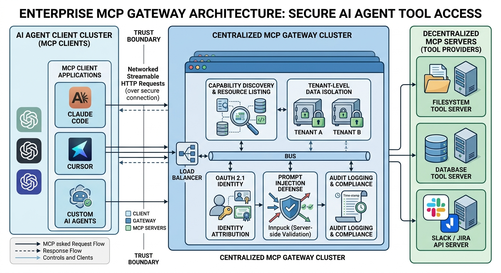
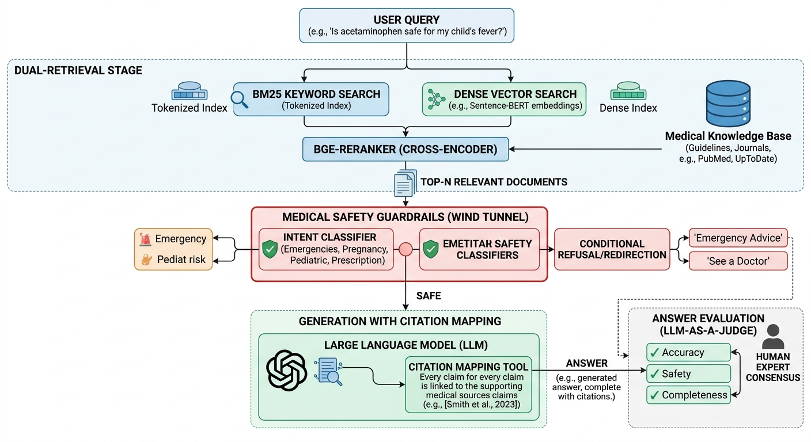

# AI Agent / 后端研发面试深度 Q&A


> **目标岗位**：AI Agent 资深开发工程师 / LLM 应用平台架构师 / Python & Go 后端研发  
> **核心原则**：用**工程系统管理模型的不确定性**，用**评测和可观测持续逼近业务目标**。拒绝空洞概念，所有回答均需落地于：业务痛点 ➜ 技术决策 ➜ 工程取舍 ➜ 核心指标 ➜ 深度复盘。

---

## 0. 候选人主线定位与核心标签

在面试中，你必须树立“**生产级 Agent 落地专家**”的定位。你的优势绝非单纯的模型调用（Wrapper），而是具备以下三个核心技术标签：

1. **Agent Runtime 工程化**：深刻理解 LangGraph 运行机制（Pregel/BSP 模型），能主导状态显式化、异步持久化、动态中断/恢复（Wait-and-Resume）、时间旅行（Time Travel）等长流程会话治理。
2. **不确定性隔离架构**：擅长将生成任务拆解，用“LLM 做语义规划（Planner），代码做确定性装配（Assembly）”，配合 FSM/Constrained Decoding 约束，将任务一次性执行成功率提升至生产级。
3. **企业级 AI 平台底座**：拥有扎实的后端功底（SSE 流式治理、高并发多租户隔离、安全边界控制、K8s GPU 调度/Operator 控制器、企业级 MCP Gateway 设计），能让 AI 稳定在企业现有生产流量和组织流程中运行。

---

## 1. 开场与自我介绍

### Q1：请做一个 1-2 分钟的自我介绍。

**💡 极简高分回答模板：**

> “您好，我是马震，拥有 7 年后端和 AI 应用平台研发经验。我曾先后在百度和 AI 创业公司（ArtArch.AI）主导核心 AI 系统的架构设计。
> 
> 我的核心专业特点是**‘用后端工程保障 AI 系统的生产稳定性’**。在最近的项目 **ArtArch.AI** 中，我基于 LangGraph 架构并自研了一套双运行时 Agent 架构：上层通过 **Agent Runtime** 治理多阶段长会话状态，下层通过 **DAG Engine** 进行确定性的视频/媒体流渲染。针对大模型生成工作流的失控问题，我提出 **‘Planner 语义决策 + 确定性装配器’** 的解耦架构，通过 JSON Schema 强校验和 FSM 约束，将多模态 DAG 一次性可执行率从 **55% 提升至 95% 以上**，整体 LLM 成本下降了 **40%**。
> 
> 在此之前，我在百度健康助手主导了医疗 RAG 系统的重构，通过 BM25 + Dense 混合检索、BGE-Reranker、强制引用溯源以及双层高风险风控，将 Top-3 召回率提升至 **88%**，高风险医疗问题安全召回率达到 **98% 以上**。
> 
> 我非常契合贵团队对 AI Agent 资深开发岗位的诉求，既懂大模型/RAG 工程化落地，又有深厚的 K8s GPU 平台和流式后端功底，希望今天能与您深入交流。”

---

## 2. ArtArch.AI Agent Runtime 架构深挖

### Q2：请画出你们 Agent Runtime 的核心架构图，并讲清楚其运行链路。


**💡 核心链路讲解要点：**
1. **API & 投影层**：用户输入进入 FastAPI `/v1/responses`，立即生成 `run_id` 并持久化到 `Session Projection`（保存 session/run/message/event 状态），用以提供完整的溯源和事件查询视图。
2. **双层意图路由**：高频、明确的短指令（如“继续”、“重试”、“选 A”）直接通过轻量规则解析器（Rule Parser）路由，非结构化意图则由 LLM Classifier 分类，避免无意义的 LLM 消耗。
3. **LangGraph 状态机**：多轮对话和长流程阶段（意图解析 ➜ 规格确认 ➜ 故事脚本 ➜ 分镜生成 ➜ 音乐音效 ➜ DAG 计划）在 LangGraph Stateful Runtime 中流转。通过 `thread_id=session_id` 绑定 checkpointer。
4. **不确定性隔离（Planner + Assembly）**：
   - **Planner**：使用 Gemini Pro + JSON Schema 输出高级规划（分镜描述、镜头参数、所需工作流 Pattern）。
   - **装配器（DraftGenerator）**：根据内置的 Registry Pattern 库，将模型输出的 Planner JSON 展开并填充为合法的、包含具体 Node/Edge/Slot/Layout 属性的真实 DAG。
5. **执行层（DAG Engine）**：将生成的 DAG 提交到自研的确定性 DAG 引擎，利用拓扑调度器、线程池/队列和 RPC 调用，实现后台异步大媒体渲染。
6. **事件流（SSE Bus）**：全链路采用 Server-Sent Events（SSE）单向事件流，将 `stage.started`、`planner.delta`、`dag.updated` 和 `validation.report` 实时推送至前端 Canvas，提供极佳的交互体验。

---

### Q3：为什么选择 LangGraph 框架？它与普通的 LangChain Agent 或自研状态机有什么本质区别？

| 方案 | 运行机制与局限 | 为什么选择 LangGraph（2026 生产标准） |
| :--- | :--- | :--- |
| **LangChain Agent** | 基于单一 Prompt-ReAct 循环，逻辑全部封装在底层黑盒中。无法应对复杂的阶段性多轮对话。 | **显式控制流**：支持显式声明 Node、Edge 与 State，完美对应“意图-规格-方案-分镜-渲染”的多阶段业务长流程。 |
| **自研状态机** | 需要手写大量的持久化、分支合并、版本兼容、中断和重拾代码，极易产生逻辑边界遗漏。 | **Pregel 内核与 BSP 并发模型**：并发节点状态隔离，执行结束后通过 Reducer 合并 update，并在 super-step 边界执行持久化。 |
| **生产级特性** | 无内置 persistence 和 time-travel。 | **Wait-and-Resume**：原生支持 `interrupt()` 与 `Command` API，可将长流程中途暂停（等待用户确认/修改分镜），并通过游标在任意历史 Checkpoint 重新 fork（时间旅行）。 |

---

### Q4：如何实现生产级 Human-in-the-loop (Wait-and-Resume) 机制？在 API 层面又是如何流转的？

在生产环境下，我们绝对不能用阻塞线程的 `input()`。我们使用 **LangGraph 的动态中断（Dynamic Interrupt）** 与 **异步 Postgres 状态存储** 实现了非阻塞的 Wait-and-Resume 架构。


**💡 Wait-and-Resume 详细生命周期：**

1. **图中断（Interrupt）**：当图运行到规格确认或分镜生成节点，触发业务校验逻辑，节点内部直接调用 `interrupt(payload)`。
   - 运行时抛出 `GraphInterrupt` 异常，立即中止当前 super-step。
   - **异步持久化**：`AsyncPostgresSaver` 在 super-step 边界将当前的 `StateGraph` 数据序列化并持久化到 PostgreSQL。
2. **API 响应**：FastAPI 捕获中断信号，将中断类型（例如 `need_user_choice`）和候选数据拼装，作为 SSE 事件或 HTTP 响应返回给前端，随后释放当前工作线程。
3. **用户动作与时间旅行（Time Travel）**：用户在 Canvas UI 上查看数据，可以做“审批通过”，也可以对脚本/分镜参数进行“在线编辑（Fork/Edit）”。
4. **图恢复（Resume）**：前端提交修改，调用 FastAPI 的 `/resume` 接口。
   - API 层利用 `thread_id` 从 Postgres 重新反序列化加载图状态。
   - 使用 `Command(resume=user_modification)`，让图接上中断时的 node，以用户输入覆盖原参数，无缝继续下半场执行。

---

### Q5：为什么你们采用“Planner + 确定性装配”，而不是让 LLM 直接生成最终的 DAG JSON？

让大模型直接生成 50 个节点、100 条边、带复杂坐标、布局、slot 配置的完整 DAG JSON，是典型的“**过度信任大模型**”的工程反模式。
我们最开始尝试此方案时，遭遇了三大灾难性痛点：
1. **语法与类型幻觉**：模型会瞎编节点名称（如 `Text2Image` 幻觉成 `T2I`）、边对不上 slots、targetHandle 格式不匹配。
2. **逻辑边缺失/冗余**：生成的图经常带有非闭合环、孤立节点，或者布局错乱，导致 Canvas 直接崩溃。
3. **高成本与长延迟**：生成 1000 行 JSON 消耗极大的 Output Tokens，首字延迟（TTFT）与执行延迟高不可承受。

**💡 我们的工程解耦方案：**
* **模型做语义规划（Planner）**：模型只需输出一个轻量、抽象的“规划意图 JSON”（如：需要 3 个镜头、主角为 A、场景为 B、使用 I2I 风格迁移渲染模式）。我们通过 **constrained decoding**（如 `xgrammar` 配合 `JSON Schema`）强约束其采样 logits，保证格式 100% 合规。
* **代码做结构装配（Deterministic Assembly）**：装配器（DraftGenerator）作为一个确定性的 Python 模块，读取上述“规划意图”，从 `Registry Pattern` 库中提取对应的真实节点模板（包含严格的输入/输出 slots、默认 custom_config、坐标布局算法），并安全拼接成完整的生产级 DAG。

> **核心效益**：一次性可执行率从 **55% 暴涨至 95% 以上**；生成 Tokens 消耗下降 75%，端到端延迟降低 50% 以上。

---

## 3. Model Context Protocol (MCP) 与工具链治理

### Q6：在生产级 Agent 架构中，你们是如何进行工具链安全隔离与权限控制的？

让 LLM 随意执行 shell 脚本、本地读写、数据库写操作无异于安全灾难。在我们的 Agent 架构中，我们参考 **Model Context Protocol (MCP) 2026 最新企业级架构规范**，设计了**中心化 MCP Gateway（Hub-and-Spoke）防线**。



**💡 核心安全策略五重防线：**
1. **客户端与传输安全**：所有客户端（如前端 Canvas 助手、后台 Sub-Agent）统一通过 **Streamable HTTP** 与 MCP Gateway 通信，全面淘汰不安全的 stdio 本地进程通道，避免提权漏洞。
2. **多租户隔离与 OAuth 2.1 鉴权**：在 MCP Gateway 拦截并校验用户 JWT/OAuth 2.1 凭证。所有 downstream MCP 节点的执行必须绑定明确的用户 Identity，实现“租户内数据强物理隔离”，禁止越权。
3. **输入防注入检验（Prompt Injection Defense）**：即便模型在 `tools/call` 中提出了命令参数，MCP Gateway 也会对参数执行严格的 schema 强校验和敏感词拦截（如 shell 工具禁止 `;` `&&` `rm -rf` 等拼接，SQL 工具禁止拼接字符串）。
4. **高风险工具 Dynamic Interrupt / 人工介入（HITL）**：
   - 划分工具敏感级别：`Read-only` 工具（如 `read_file`）自动放行；`Destructive` 写工具（如 `delete_database`、`send_notification`）必须触发 `interrupt()`，上抛给用户界面，由人类在前端点击“确认授权”后，Gateway 才会真正执行。
5. **全量审计日志（Audit Trace）**：通过 OpenTelemetry trace 记录每次 tool 调用的入参、执行耗时、发起用户、对应的模型 `run_id` 及其执行结果，满足企业合规审计。

---

## 4. RAG 与检索算法深挖 (百度健康助手)

### Q7：医疗 RAG 系统中，为什么做“BM25 + Dense 混合检索”？双路召回的结果如何做融合重排（Rerank）？

在生命安全级别高、容错率低的医疗场景，任何单一的检索方式都存在致命缺陷。

* **BM25（字面匹配强，泛化性弱）**：能极度精准地召回罕见疾病名、专业药名（如“卡托普利”）、特异性生理指标（如“ALT 150”）。但面对口语化提问（“胸口发闷、气喘不过来” vs “胸闷气短”）时，会因为字面不匹配而彻底漏招。
* **Dense Vector（语义理解强，特异性弱）**：能准确匹配口语化意图，但极易在专业数字、近似拼写药名上发生语义混淆，导致误召回（比如把 A 药混淆成 B 药，产生灾难性用药建议）。

**💡 双路召回与融合精排设计：**



1. **分路并行召回**：
   - **BM25 召回**：Elasticsearch 倒排索引，设置专业医学词表权重。
   - **Dense 召回**：Milvus 向量数据库，使用定制医疗 Embedding 模型（如 BGE-M3）做向量相似度召回。
2. **精排重排（Rerank）**：
   - 提取双路召回的 Top-100 候选 Chunk，拼接成 `[Query, Chunk]` 实体，统一送入 **BGE-Reranker (Cross-Encoder 模型)**。
   - **为什么 Cross-Encoder 比 Bi-Encoder 精准**：向量检索是 Bi-Encoder（两端独立计算余弦相似度），缺乏 Query 和 Doc 词与词之间的深度交叉注意力。Reranker 在注意力层让 Query 的每个字与 Doc 的每个字做 full attention 交互，能精细鉴别“高血压伴随糖尿病不能吃什么”与“糖尿病伴随高血压不能吃什么”这种微弱但致命的语义差别。
3. **指标提升**：Top-3 召回命中率从 **70% 提升至 88% 以上**。

---

### Q8：如何实现绝对可靠的“引用溯源（Citations）”，避免模型“张冠李戴”瞎编证据来源？

很多 RAG 系统的溯源只是简单在回答末尾挂几个链接（“我觉得是 A，来源：[1], [2]”），但实际上 [1] 和 [2] 根本没有提到支持 A 的事实。这在医疗和金融场景是不可接受的。

**💡 我们的引用溯源闭环方案：**
1. **严格的 Chunk 身份锚定**：每个召回的知识片段都被打包成结构化的 `evidence_object`，包含 `doc_id`、`chunk_id`、`source_url`、`hash`。
2. **结构化生成约束（Response Schema）**：在调用大模型生成时，强制配置 Output Schema，要求模型必须返回结构化列表，其中每一段医学论述必须与召回的 `chunk_id` 进行强关联绑定：
   ```json
   {
     "paragraphs": [
       {
         "content": "孕妇在怀孕前三个月应严格禁用利巴韦林，因其具有明确的致畸风险。",
         "supported_by_chunk_ids": ["chunk_med_libavirin_003"]
       }
     ]
   }
   ```
3. **后置工程映射与校验（Ref-Verifier）**：
   - 装配器提取 model 吐出的 `supported_by_chunk_ids`。
   - **双字面相似度校验（N-gram Verification）**：计算 content 内容与对应 chunk 的语义重合度（如 Rouge-L 或特定实体匹配度）。
   - 如果发现模型声明引用了 `chunk_A`，但在 `chunk_A` 中根本找不到对应事实（相似度低于阈值），或者引用了未被召回的幻觉 ID，则自动**截断引用**，在回答前端降级显示“来自系统医疗库，引用待人工审核”，确保不向用户呈现任何不实或错误溯源。

---

### Q9：面对高危医疗问题（如急症、处方剂量建议），你们是如何实现 98% 以上的安全防线与拒答拦截的？

在医疗场景中，Agent 绝不能给出确诊建议或提供处方用药剂量。我们采用**“轻量规则风控 ➜ 意图微调模型分类 ➜ 生成拦截 ➜ 终置转人工”**的四层漏斗安全风控体系。

1. **第一层：高危字典与正则网关（毫秒级，高召回）**
   - 梳理高危急症词典（“心绞痛”、“大出血”、“吞服异物”、“欲自杀”）与药品字典（麻醉药、精神毒性药）。
   - 命中后，**一键秒级秒退**，前置拦截并强制吐出标准红色字体的警示文案，并引导拨打 120，或直接转呼人工医生。
2. **第二层：特化意图微调分类模型（语义安全）**
   - 针对非结构化的高危隐晦表达，部署专门经过指令微调（SFT）的 7B 意图分类器。
   - 输入 query 识别其属于（急症/处方咨询/常规科普/报告解读）中的哪一类。如果置信度在“急症”或“处方”类别中大于 0.85，强行触发拒答兜底策略。
3. **第三层：检索证据饱和度校验（无米之炊不乱下锅）**
   - 如果召回阶段经过 BGE-Reranker 后，相关性最大得分低于 **0.65**（代表知识库对此完全无储备），生成阶段禁止大模型自由发挥，而是直接触发标准拒答：“抱歉，医学知识库中暂未收录相关循证依据，为保障您的用药安全，请务必咨询线下执业医师。”
4. **第四层：医疗安全对齐 Prompt（生成约束）**
   - 在 System Prompt 中植入最高优先级的边界规则，并使用 System Instructions 强锁定，模型必须始终带有免责提示，禁止使用“确诊为……”、“应服用剂量为……”等确定性医学诊断语气。

---

## 5. 后端工程、SSE 治理与高性能底座

### Q10：如何设计高可靠的 SSE (Server-Sent Events) 流式流控系统？遇到了哪些真实的线上故障，又是怎么解决的？

**💡 线上真实故障：代理层缓冲积压（Lag/Buffering Disaster）**
* **故障现象**：上线初期，前端反馈大模型生成的打字机效果极差，要么卡顿数秒后一下子吐出一大块文字，要么在长响应时直接报 504 Gateway Timeout。
* **原因排查**：我们的服务部署在 Kubernetes 中，前面挂了 Nginx Ingress。Nginx 默认启用了 **Response Buffering**（响应缓冲区）。Nginx 试图等后端 FastAPI 把几十个字节的 chunk 积攒到默认的 4KB 或 8KB 缓冲区，或者整条响应返回后才一次性发给前端，导致流式传输退化为普通阻塞传输。

**💡 生产级 SSE 流控治理方案：**
1. **强制禁用 Nginx 缓冲区**：在 FastAPI 返回的 Response Header 中显式写入 `X-Accel-Buffering: no`，通知 Nginx 立即将每一个 event 刷新到客户端。
2. **结构化事件规范定义**：不发纯文本裸流，统一事件协议，包含 `event` 类型、`id`、`data`（JSON 字符串格式）：
   ```text
   event: planner_delta
   id: msg_run_982173_001
   data: {"delta": "【分镜 3 规划中】", "percentage": 45}
   ```
3. **Keep-Alive 心跳保活机制**：针对模型长时间思考导致的连接中断问题，在 API 层启动后台心跳协程，每隔 15 秒向客户端发送一次 `: ping` 空注释行，防止 AWS ALB 或 Nginx 反代因闲置超时（Idle Timeout）强行切断 TCP 连接。
4. **客户端断线重连（Resume on Reconnect）**：
   - 客户端通过 `Last-Event-ID` 自动向后端上报最后接收到的事件 ID。
   - 服务端内存维护轻量级 Event RingBuffer，如果断线时间较短，可将遗漏的事件自动补发；如果时间过长，则前端主动利用 `thread_id` 调用 `/v1/runs/recover` 从 Postgres checkpointer 处重新拉取全量状态刷新画布。

---

### Q11：你在 K8s GPU 调度平台里，是如何设计 GPU 资源隔离与算力调度的？

对于企业内部训练和推理混部的集群，300+ 张 GPU 卡如果缺乏有效管理，极易产生“小任务卡死大显存”、“算力闲置与资源饥饿并存”的混乱状态。

**💡 我们的核心调度方案：**
1. **基于 NVIDIA Device Plugin 的物理感知**：在 Kubernetes 工作节点安装 nvidia-device-plugin，使 Kubelet 能够精准上报各节点的物理 GPU 总卡数与型号（如 A100、V100、T4），注册自定义系统资源 `nvidia.com/gpu`。
2. **声明式配额管理（ResourceQuota）**：
   - 为不同的算法研究组、业务线划分 Namespace。
   - 在 Namespace 层限制其 `nvidia.com/gpu` 的 Limit 总数，防止某个组批量提交大型参数搜索任务时，吃光集群所有算力导致在线推理服务挂掉。
3. **优先级与抢占调度（PriorityClass & Preemption）**：
   - **在线推理与 Runtime 业务（High-Priority）**：配置高优先级，发生资源冲突时可强行抢占（Preempt）低优先级 Pod。
   - **离线训练与大批处理（Low-Priority）**：配置低优先级，进入优先级排队队列。当高优先级任务需要资源时，K8s 调度器会主动驱逐并重新调度低优先级的离线 Pod。
4. **GPU 算力切分（vGPU/MPS）落地**：
   - 对于显存占用极小的轻量推理任务（如 7B 意图分类模型），禁止独占整张 16GB 的 T4 卡。
   - 引入 **NVIDIA MPS (Multi-Process Service)**，在容器 limit 标签中实现显存与算力比例的切分（如限制一个 Pod 仅使用 20% 的 GPU 算力与 4GB 显存），将单卡利用率提升 **3 倍以上**。

---

## 6. 评测、可观测性与 Trace 闭环

### Q12：你如何评估一个 AI Agent 是真的“变聪明了”还是仅仅在特定测试用例上过拟合？

评估 Agent 绝不可只看几个 Demo 跑通了没有。我们建立了**“离线基准测试 (Evals) ➜ 生产金丝雀 (Shadowing) ➜ 线上 Badcase 自动回流”**的评估三部曲。

```text
               【AI Agent 持续评测闭环模型】
               
   [ 生产级 Badcase ] ── (自动抓取与清洗) ──> [ 离线 Golden Dataset ]
          ▲                                         │
          │ (持续回流与监控)                         │ (版本发布前 CI 跑测)
          │                                         ▼
   [ 线上 Shadow 流量 ] <── (指标通过放行) ─── [ LLM-as-a-Judge 评测 ]
```

1. **构建 Golden Dataset 评测数据集**
   - 收集 **500+ 个典型多轮会话样本**，覆盖核心业务分布（15% 急症，40% 慢病用药，30% 报告解读，15% 偏僻问答），并对每个会话手动标注专家共识的 Gold Path 和 Gold Answer。
2. **两级评测指标体系设计**
   - **Execution Evals（硬约束指标，进入 CI）**：
     - **DAG Schema 合规率**：100%（不合规直接不给部署）。
     - **状态机流转正确率**：验证 node 的执行轨迹是否完全符合预期状态机，不可发生阶段跨越或回退混乱。
     - **API 安全过滤准确率**：高风险问题的拦截召回率必须达到 98% 以上。
   - **Subjective Evals（语义指标，LLM-as-a-Judge）**：
     - 使用更强大的大模型（如 GPT-4o 或 Claude 3.5 Sonnet）作为 Grader，对系统生成的医学建议、创意分镜进行打分。
     - **对齐校准（Human Alignment）**：为了防止 Grader 产生偏差，我们定期组织人工医学专家对 Grader 的打分进行盲测，计算 **Kappa 关联系数**。当 Kappa 系数大于 0.82 时，方可认为 LLM-as-a-Judge 的自动化打分在业务上是具备线上参考价值的。
3. **Shadow Mode / 影子模型灰度验证**
   - 新模型与新 Prompt 上线时，不直接面向用户。
   - 在 Gateway 复制一份生产流量发给“影子 Agent”，对比新老 Agent 的决策分叉（Action Divergence Rate），在无感知的状态下收集 1000 轮运行记录，对比其 Rerank 命中率和 Token 耗时表现。

---

### Q13：当用户反馈线上某个创作任务执行效果差（Badcase）时，你如何利用 Trace 链路快速排查与归因？

我们基于 OpenTelemetry 构建了面向 LLM 的 **LLM-Trace (语义追踪)** 链路。一条 Run Trace 包含以下几个维度的结构化 Span：

```text
Trace: run_id_89231
├── Span: http_request (FastAPI Endpoint, Latency: 12.5s)
│   ├── Span: intent_classification (Router Rule, Latency: 45ms)
│   └── Span: langgraph_superstep_1 (Pregel Execution, Latency: 3.2s)
│       ├── Span: retrieval_milvus (Milvus Vector DB, Recall: 20 documents)
│       ├── Span: reranker (Cross-Encoder Model, Latency: 220ms, Top-3 Score: 0.88, 0.52, 0.31)
│       └── Span: model_planner_call (Gemini Pro, Cost: $0.004, TTFT: 150ms)
│           └── Span: constrained_decoding_validation (xgrammar parser, Status: Success)
```

**💡 典型 Badcase 的定位与分类归因标准：**

| 故障现象 | Trace 深度排查路径 | 最终定位归因与治理方案 |
| :--- | :--- | :--- |
| **视频画面完全张冠李戴** | 检查 `retrieval_milvus` 的召回结果和 `reranker` 得分。 | **检索失败（Retrieval Failure）**：Milvus 召回的相关性得分极低，说明本地知识库没建全，需要调整 chunk 策略、加入专有词表或扩充知识库。 |
| **画面描述符合预期，但 Canvas 上节点报错无法运行** | 检查 `constrained_decoding_validation` 的状态和 `model_planner_call` 的 output 文本。 | **约束解码失败（Validation Failure）**：模型未严格按照 JSON Schema 输出，触发了 Fallback。需要收紧 Prompt Schema 边界，或者升级 Constrained Decoding (FSM) 过滤插件。 |
| **召回的参考资料极其完美，但模型依然胡说八道** | 对比 `model_planner_call` 的 input message（包含召回 chunks）与 output message。 | **生成能力崩溃（Generation Hallucination）**：说明 Prompt 中给参考资料赋予的权重不够，或者模型自身长上下文注意力失控。解决方案是：在 Prompt 中强化限制（例如使用“如果参考资料中没有，必须回答‘不知道’”，并用 XML tags 隔离 Chunks）。 |

---

## 7. 行为面试（Behavioral）与反问

### Q14：你在项目中遇到过最大的技术挑战是什么？你是如何攻克它的？

**💡 回答高分要点（STAR 法则）：**
* **Situation（背景）**：在 ArtArch.AI 平台中，多模态创作 Agent 处于最核心地位。我们早期面临最棘手的问题是 **“DAG 渲染流一次性执行成功率极低，只有约 55%”**。
* **Task（目标）**：必须将成功率强行拔高到 **95% 以上** 的商用标准，否则用户在前端 Canvas 经常遭遇莫名其妙的报错、死循环或断线。
* **Action（行动）**：
  1. 我对线上 5000 多个失败的 DAG payload 进行了分类聚类，发现大部分错误是由于 LLM 在长文本输出下无法 100% 遵守严苛的 DAG 结构规范（槽位名、边指向、JSON 格式、布局坐标等）。
  2. 我说服团队放弃让 LLM “直出 DAG”的幻想，重新设计系统。提出 **“Planner + 确定性装配”** 架构，将不确定性（创意、故事大纲、镜头描述）交由模型规划，将确定性（节点结构、Slot 类型、Handle 连接、坐标布局）强收拢进本地 Python 装配层。
  3. 引入基于 FSM（有限状态机）的 constrained decoding 采样拦截，在 token 级别物理屏蔽不合法 JSON 的输出。
* **Result（结果）**：DAG 一次性合规率从 **55% 飙升至 95% 以上**，非法节点与非法边彻底归零。因为模型输出体积大幅压缩，LLM token 成本暴降 **40%**，端到端生成时延缩短 50%。

---

### Q15：面试最后，你有什么想问我的？（高价值反问）

反问是展现你专业深度、彰显你对生产级落地关注的最佳机会。**千万不要问“包不包吃住”或“几点上下班”。**

1. **反问业务痛点**：“咱们团队目前线上的 Agent，最大痛点是卡在**模型生成效果（如幻觉、拒答）**，还是卡在**工程性能（如首字延迟 TTFT、SSE 断线、并发性能）**？或者是**评测体系（缺乏高效的 Golden Dataset 与 Grader）**上？”
2. **反问架构选型**：“我们对于长流程、复杂状态的 Agent，目前是主要采用类似 **LangGraph 的有状态图编排**，还是偏向更自由的 **Multi-Agent 协同（例如 Supervisor、Hierarchical）** 模式？”
3. **反问安全风控**：“对于 Tool Calling 的安全性，因为我们涉及企业内部敏感系统的写操作/敏感数据，咱们团队是如何设计**工具权限体系、安全审计网关以及 Human-in-the-loop 审批审批流**的？”
4. **反问评测成熟度**：“咱们团队目前对于 Agent 效果的迭代，是否建立起了**全自动的离线/在线评测流水线（如 CI 运行 Eval 脚本）**？在 LLM-as-a-Judge 打分上，是否做过人工共识（Kappa 系数）校准？”
