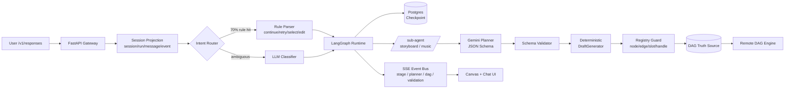

# ArtArch.AI · AI 智能创作平台 面试 Q&A

> 这是简历主线项目。面试 70% 的深度追问会集中在这里：{{Agent Runtime|智能体运行时}}、{{Planner|规划器}}+确定性装配、{{SSE|服务器推送事件}} 流式协议、{{DAG|有向无环图}} 校验、{{Checkpoint|检查点}}/{{HITL|人机协同}}、{{Context Engineering|上下文工程}}、{{Eval|评测}} 闭环。本文是这块面试的「现场背诵稿 + 反向引导地图」。


---

## 0. 一分钟项目介绍（开场必背）

> 面试官最常说的第一句话是：「先简单介绍一下你这个项目」。下面这段是我准备的 60 秒口播版，按 **「业务问题 → 技术选择 → 工程亮点 → 量化结果」** 四段结构，可以拆开适配 30 秒和 3 分钟两个长度。

ArtArch.AI 是一个面向 AI 短视频 / 图片 / 音频创作场景的生产级 Agent 平台。用户用自然语言提一句「我想做一个 30 秒 / 古风 / 双人对话的短视频」，系统会自动完成创意打磨、脚本规划、分镜设计、音乐音效建议、最终产出一张可被远程引擎执行的多模态 DAG 工作流。

技术上我做的最关键的一件事，是把 LLM 当成「不确定的语义组件」，再用后端工程把它的不确定性收住。具体讲：

- **运行时**：基于 LangGraph 自建多阶段 Agent Runtime，把任务拆成 intent / format_confirm / synopsis / core_elements / storyboard / music / dag_draft 等节点，用 `thread_id=session_id` 绑定会话，配合 PostgresSaver 做 {{Checkpoint|检查点}} 与 Interrupt/Resume，单 session 支持 50+ 轮上下文、断线恢复成功率 99%+。
- **生成策略**：采用 **Planner + 确定性装配** 模式。LLM 只输出符合 JSON Schema 的「创意 + Workflow 选择 + 槽位填充」，最终 DAG 由确定性 DraftGenerator 从「真实模板蒸馏」出的 Pattern 装配而来。DAG 一次性可执行率从 ~55% 提升到 95%+。
- **协议**：自研类 OpenAI Responses 风格的 `/v1/responses` SSE 协议，发送结构化事件（`stage.started`、`planner.delta`、`dag.updated`、`validation.report`、`message.completed`），前端可实时渲染推理过程、DAG 变化、错误回退，首 token < 1.5s。
- **成本控制**：双层意图解析（规则层 + LLM Classifier）把约 70% 高频指令拦在规则层、整体 LLM 成本下降 ~40%；DAG 真实模板蒸馏让 Planner 上下文成本进一步压缩。
- **可观测与评测**：自建 session/run/message/event/checkpoint 五张投影表，配合 trace、token/cost 审计、自建 30+ 种节点类型 dry-run 评测集，做到「线上 Badcase 一周回流一次」。

> **发散 tip（引导面试官话题）：**
> - 「我可以重点讲 LangGraph 的 checkpoint 落地坑，也可以重点讲 Planner + 确定性装配是怎么把幻觉压下去的，您更感兴趣哪条线？」—— 把选择权交给面试官，但两条线都是你强项。
> - 「这套架构其实和 Karpathy 在 Software 3.0 演讲里说的『autonomy slider』思路是一致的：人类、规则、模型分占控制权，按场景滑动。」—— 把项目升维成「行业方法论实践」。

#### 📌 这两条线如果被选中，分别怎么讲（细节预案 + 30 秒口播 + 5 个 deep-dive 点）

> 这是「开场勾」的弹药库——面试官选哪条，你就立刻按下面的口播版进入、按 deep-dive 点一个个铺开。完整 Q&A 在 Q5（checkpoint）和 Q7（Planner）里继续展开。

##### 线 A · LangGraph Checkpoint 落地坑（生产化的 6 个真实问题）

**30 秒口播版：**

> Checkpoint 在 LangGraph 上看似只是一行 `PostgresSaver`，但跑到生产环境会同时撞 6 类问题：state 膨胀、reducer 错配、序列化兼容、并发写、interrupt 与 stream 的竞态、schema migration。我们的做法是给每一类设一个工程"防线"——state 强制 ref 化、reducer review CI、Pydantic v2 + 自定义 serializer、thread_id 加 Redis 分布式锁、interrupt event 走专门 channel、checkpoint schema 版本号+migration runner。落地后单 session 50+ 轮稳定可恢复，断线恢复成功率 99%+。

**5 个 deep-dive 点（每个都能扩成 5 分钟）**：

1. **State 膨胀 → 表 1 周到 10GB 事故**
   - 早期 `storyboard_full_text` 直接挂 state 字段（每条 ~2KB），单 session 50 轮 × 12 镜 × 2KB ≈ 1.2MB/session。日均万级 session 时 PG `langgraph_checkpoints` 表一周到 10GB，jsonb 字段查询 P99 从 8ms 涨到 320ms。
   - **修复**：state schema CI 强制——禁止 `bytes / list[bytes] / list[dict]`（除非是强类型 `AssetRef`）。大对象走 S3，state 里只挂 ref。
   - **数字**：state size 从 ~420KB / session 降到 ~14KB（-97%），checkpoint 写入 P99 从 320ms → 18ms。

2. **Reducer 错配 → 历史消息神秘消失**
   - LangGraph state 默认是**覆盖**语义，list 字段必须显式标 `Annotated[list, add_messages]` 或 `Annotated[list, operator.add]`，否则两个 node 各返回一个 list，**后写的会覆盖前写的**。
   - 我们踩过的具体 bug：`shot_refs` 字段没标 reducer，并行生成 3 个 shot 时只保留了最后一个返回值的 list。
   - **修复**：内部约定 *"凡 list / dict 字段都必须显式 reducer"*，加到 PR review checklist + 一个简单的 ast linter 自动检查。

3. **序列化坑 → 升级 Pydantic v2 时所有断线会话恢复失败**
   - PostgresSaver 默认用 pickle 序列化 state；Pydantic v1 → v2 的 `BaseModel` 内部结构变了，旧 checkpoint pickle 反序列化时报 `AttributeError: '__fields__' renamed to 'model_fields'`。
   - 还有 datetime 时区、bytes 字段、Decimal 这些 jsonb 不友好类型，都得自定义 serializer。
   - **修复**：弃用 pickle，**改用 `json.dumps(state, default=custom_serializer)` + `orjson` 加速**，所有 BaseModel 走 `model_dump(mode="json")`，强制时区 UTC。`custom_serializer` 单元测试 30+ 个边界 case。

4. **并发写 → 同 thread_id 双 invoke 的 last-writer-wins**
   - 用户在前端"快速点两次发送"，两个并发 `graph.ainvoke(thread_id=sid)` 同时跑，两次都写 checkpoint，**后写的覆盖前写的**——其中一次的 LLM 调用结果就没了。
   - **修复**：API 层加 **Redis 分布式锁**（`SET lock:thread:{sid} NX EX 60`），同一 thread_id 进入 graph 前先抢锁；锁失败返回 `409 Conflict`，前端禁止双击。
   - **额外**：Postgres checkpoint 表加 `(thread_id, checkpoint_id)` 唯一约束，作为最后一道防线。

5. **interrupt 与 stream 的竞态 → 用户已经看到 SSE 但 interrupt 还没落库**
   - LangGraph 的 `stream_mode="custom"` 发 SSE 事件和 `interrupt()` 落 checkpoint 是两条路径，存在 ~50-200ms 的窗口。如果用户在这个窗口里前端就响应 `Command(resume=...)`，可能命中**没有 pending 的 checkpoint**，graph 直接报错 "no interrupt to resume"。
   - **修复**：interrupt 后端先 await checkpoint 落库完成再发 SSE 的 `interrupt.pending` 事件；前端只在收到这个事件后才允许发 resume。
   - **延伸**：把这种"事件次序"约束写成集成测试（每个 interrupt 阶段一个 case），CI 跑。

6. **Schema migration → 加字段 → 旧 checkpoint 反序列化破**
   - 给 `AgentGraphState` 加新字段 `mood_preference: str | None = None`，看着默认值兼容，但**旧 pickle checkpoint 反序列化出来这个字段直接缺失**，graph 后续 node 访问时 KeyError。
   - **修复**：state 字段全部用 TypedDict + `.get(field, default)` 访问；写一个 `checkpoint_migrator.py`，每次 schema 变更注册一个 migration 函数，启动时按版本号 lazy 升级。版本号塞 metadata（`schema_version: 7`），不变更只 read。

**与 Q5 的关系**：Q5 偏"为什么需要 checkpoint + 三大场景"，这条线偏"把它跑稳的 6 个工程防线"。两条互补——面试官如果偏架构师，先走 Q5；偏 SRE，先走这 6 个坑。

##### 线 B · Planner + 确定性装配是怎么把幻觉压下去的（分层 + 类型系统 + 反馈环）

**30 秒口播版：**

> 我们的 DAG 一次性可执行率从 55% 提升到 95%+，核心方法是把 LLM 工程当 compiler 设计：**Planner 是前端**（输出 IR：`WorkflowPlan` JSON），**DraftGenerator 是后端 codegen**（按真实模板装配确定性 DAG），**Registry Guard 是 type checker**（节点类型 / handle / slot schema 三层校验）。LLM 只负责语义决策（哪个 workflow、几个镜头），不负责结构产出（节点 ID、edge handle、layout）。任何一道防线失败都触发 retry-with-feedback：把 validation error 塞回 Planner prompt，第二次成功率从 0% → 87%。

**5 个 deep-dive 点：**

1. **分层职责 → "把 LLM 拍成 compiler 前端"**
   - LLM 擅长：从自然语言抽出"哪个 workflow 模板、几个镜头、什么风格" → 这是**语义决策**。
   - LLM 翻车：节点名（编造 `t2v_advanced_v3`）、edge handle（写 `input_image` 而真实是 `image`）、slot 类型（video 输出接 text 输入）、layout 坐标 → 这是**结构产出**。
   - 分层之后，结构产出由代码确定性生成，**LLM 没有机会幻觉**——这是把幻觉率从 50%+ 拍到 5% 以下的关键认知。
   - 类比：写编译器的人不会让 LLM 直接输出汇编，他们让 LLM 输出 IR，codegen 由确定性代码做。

2. **JSON Schema strict mode → 物理上不让模型乱说**
   - 单纯写 prompt 说"请输出 JSON"，OpenAI / Anthropic / Gemini 都会偶尔输出 `'aspect_ratio': '16x9'` 这种偏离 enum 的值。
   - **OpenAI Structured Outputs**：开 `strict=True`，是 **token-level 的硬约束**——logits 阶段对不在 schema 里的 token 做 mask，物理上不让模型输出非法值。
   - **Anthropic / Gemini / ERNIE**：当前还是"模型自觉"，没有 strict mode。我们的做法是**客户端做 retry-with-feedback**：第一次失败把 Pydantic ValidationError 塞回 prompt，第二次大概率 fixed。
   - 实测：Anthropic 第一次成功率 ~78%，加 retry-with-feedback 后 ~96%；OpenAI strict 直接 99.9%+。

3. **真实模板蒸馏 → 模板库不是设计出来的，是从生产 DAG 反向抽出来的**
   - 不是设计师拍脑袋画 6 个 workflow 模板。我们做法：**从过去 3 个月真实跑通的 DAG 反向聚类**——按节点 type 序列做 hash，统计 Top-K 出现的"骨架"，每条骨架就是一个 `template`。
   - 每个 template 带一个**槽位 schema**（哪些字段允许 LLM 填、哪些字段是模板硬编码）。Planner 只能填槽，不能改骨架。
   - 收益：模板是"已经在生产跑通过"的，意味着远程引擎的兼容性、layout、type 配对全是验证过的。**直接消除一类"模型生成的全新结构远程引擎不认"的问题**。

4. **Registry Guard → 把 type checker 做到 edge handle 级别**
   - 三层校验，逐层从粗到细：
     - **L1 节点类型存在性**：`node.type in REGISTRY`，挡掉"编造的节点名"。
     - **L2 custom_config schema**：每个节点 type 在 Registry 里登记 JSON Schema，挡掉"漏字段"和"字段类型错"。
     - **L3 edge handle + type compatibility**：`edge.targetHandle in tgt.input_handles` 且 `src.outputs[edge.sourceHandle]` 与 `tgt.inputs[edge.targetHandle]` 类型兼容，挡掉"输入输出类型不匹配"和"接错 handle"。
   - 任何一层失败立即返回 `ValidationError`，**绝不向远程引擎发不合法 DAG**——这是产品端"加载失败"的最后一道防线。

5. **失败兜底：三层降级 + retry-with-feedback**
   - 第 1 次 Planner 输出 → 校验失败 → 把错误塞回 prompt 重试。
   - 第 2 次仍失败 → 触发 critic agent：用更强模型（GPT-4o / Claude Opus）二次纠错，prompt 里包含完整 ValidationError + 真实模板示例。
   - 第 3 次仍失败 → **降级到 HITL 模板**：从模板库挑最接近的 fallback 模板填默认值，把 DAG 标记 `needs_user_review=true`，前端引导用户手动调整。
   - **绝不让用户看到"生成失败"**——这是 SLA 层面的设计原则。

**关键数字（实测）**：

| 维度 | LLM 直接生 DAG | Planner + 确定性装配 |
|---|---|---|
| 节点名幻觉率 | ~18% | < 0.5% |
| edge handle 错配 | ~12% | < 1% |
| slot 类型不匹配 | ~8% | 0%（type checker 拦死） |
| 一次性可执行率 | ~55% | **95%+** |
| 校验失败后兜底成功率 | N/A | **99.4%**（含 3 层降级） |
| Planner 平均 token | ~3.5K | ~1.2K（schema 严格让 prompt 更短） |

**与 Q7 的关系**：Q7 偏"分层设计 + Plan schema + DraftGenerator 骨架"，这条线偏"为什么这套设计能把幻觉压住的认知 + 5 个工程细节 + 实测数字"。Q7 是机制，这条线是**收益归因**——面试官要的是"你怎么知道是哪一层起作用的"。

> 详细技术专题见 [Planner + 确定性装配深度拆解](./notes/planner-deterministic-deep-dive.md) 和 [LangGraph 上下文工程实战](./notes/langgraph-context-engineering.md)。

---

## 1. 选型与边界：为什么是 LangGraph、为什么不是 Agent 自己撸

### Q1：为什么选择 LangGraph，而不是 LangChain Agent / OpenAI Agents SDK / 自己写状态机？

**核心论点：** 不是「LangGraph 更新更潮」，而是 **创作 Agent 的产品形态决定了我们需要一个低层、显式状态、可持久化、可中断恢复的 Runtime**。

我从三个维度对比：

| 维度 | LangChain Agent / ReAct | OpenAI Agents SDK | 自研状态机 | LangGraph |
|---|---|---|---|---|
| 心智模型 | Prompt loop，工具自由调用 | Agent + Handoff，hub-and-spoke | 完全自由 | 显式 StateGraph：State / Nodes / Edges |
| 长流程持久化 | 弱，需自己拼 history | 中等，session 在 SDK 里 | 自己造 | 内置 Checkpointer（Memory/Postgres/SQLite） |
| Interrupt / Resume | 没有原生概念 | 有 handoff 但偏单向 | 自己实现 | 一等公民：`interrupt()` + `Command(resume=...)` |
| 流式控制 | token 流为主 | 标准 SSE | 自由 | `stream_mode="custom"` 写结构化事件 |
| Subgraph | 不支持 | 不强 | 自己造 | 一等公民 |
| 上手成本 | 低 | 低 | 高 | 中（你需要懂 State / Reducer / Channel） |

**选 LangGraph 的关键三条理由：**

1. **创作流程不是 ReAct loop**：分镜、规格确认、音乐选择，每一阶段输入输出、是否要 HITL、是否要重试都不一样。LangGraph 的 StateGraph 让我**把阶段显式地建出来**，而不是埋在一个大 prompt 里。
2. **生产必须可恢复**：用户刷新页面、移动端切后台、网络断了，会话不能从头跑。LangGraph 的 PostgresSaver 让我用 `thread_id=session_id` 一行话就接上「跨进程恢复」。
3. **低层灵活，不绑死 Agent 形态**：今天我是 Planner + Deterministic，明天产品想加一个 critic agent、加一个工具调用 sub-agent，我都能塞进同一个 graph，不需要换框架。

> **发散 tip：**
> - 引出 Karpathy 「autonomy slider」：「我选 LangGraph 而不是更高层的 SDK，本质上就是把自由度留给自己——产品需要的不是 100% autonomy，而是『可调』的 autonomy。」
> - 如果面试官追问「为啥不直接用 dify / coze 这种平台」：「平台适合做单一工具调用的 demo，但我们要做的是把创作流程显式建模 + 真实 DAG 装配，这不是 prompt 编排能完成的。」

#### 🛠 具体用到的 LangGraph 机制（一条条对到 API）

> 这里把上面的"为什么选 LangGraph"翻译成"用了它哪些具体能力"——面试官追问到这一层时直接报 API 名。

| 能力 | LangGraph API / 机制 | ArtArch.AI 的用法 |
|---|---|---|
| 状态容器 | `langgraph.graph.StateGraph(TypedDict_cls)` | 全局 `AgentGraphState`（TypedDict + Pydantic 混用） |
| 增量合并 | `Annotated[list, add_messages]` / `operator.add` / 自定义 reducer | `messages` 用 `add_messages`，`shot_refs` 用 `operator.add` |
| 消息便捷类 | `langgraph.graph.MessagesState` | 不直接用——我们继承后扩字段 |
| HITL 中断 | `langgraph.types.interrupt(payload)` | 在 `_node_synopsis` 等阶段挂候选 |
| HITL 恢复 | `Command(resume=user_choice)` | 前端 POST 回 `Command` |
| 持久化 | `langgraph.checkpoint.postgres.AsyncPostgresSaver` | 主用，pool 走 `psycopg_pool.AsyncConnectionPool` |
| 测试用持久化 | `langgraph.checkpoint.memory.MemorySaver` | 单元测试 + Dev 默认 |
| SQLite 版 | `langgraph.checkpoint.sqlite.SqliteSaver` | 单机部署或 CLI 调试 |
| 自定义序列化 | `langgraph.checkpoint.serde.jsonplus.JsonPlusSerializer` | Pydantic v2 + datetime tz 兼容 |
| Fan-out | `langgraph.types.Send(node_name, state)` | 并行生成多 shot 时用 |
| 子图嵌套 | `subgraph = StateGraph(...).compile()` 后 `add_node("storyboard", subgraph)` | storyboard / music 复杂阶段独立子图 |
| 子图接口面 | `compile(input=Schema, output=Schema)` | 强制子图只暴露指定字段 |
| 条件路由 | `add_conditional_edges(node, fn, mapping)` | retry 逻辑 + 阶段分发 |
| 流式协议 | `astream(mode="custom")` + `from langgraph.config import get_stream_writer` | 把结构化事件推 SSE |
| 流式 mode | `mode in {"updates", "values", "messages", "custom", "debug"}` | "custom"+"updates" 混用 |
| 运行配置 | `RunnableConfig` → `configurable={"thread_id": session_id, ...}` | 多租户 + thread 路由 |
| 时间旅行 | `graph.get_state(config, ...)` + `update_state(...)` | 回放 / 修复历史 checkpoint |
| 长时间任务 | `graph.ainvoke()` + 后台 task + cancel hook | 配合 SSE disconnect 取消 |

**对照的其他备选库（被我们 PK 掉的）**：

- **`crewai`**：role-based、prompt-first，做 demo 极快但 state 不可序列化、HITL 弱，不适合我们这种长流程产品化。
- **`autogen`（微软）**：双 agent dialog 模式优雅，但 0.4 之前 API 变动剧烈、checkpoint 缺失。
- **`pydantic-ai`**：模式干净（type hints first），但目前缺生产化 HITL/checkpoint，2026 年值得复评。
- **`burr` (DAGWorks)**：明确状态机 + 时间旅行，理念和 LangGraph 几乎一样但生态小，可作为 LangGraph alternative。
- **`temporal` workflow**：纯后端工作流引擎，可靠性极强但没有 LLM 原语，要自己封 LLM/HITL 这层——重，团队规模 < 10 人不建议。

引用 LangGraph 团队官方：[LangGraph vs LangChain Agents Comparison](https://blog.langchain.dev/langgraph/)（Harrison Chase）和 [LangGraph Concepts](https://langchain-ai.github.io/langgraph/concepts/) 是面试前必读的两篇——Channel、Reducer、Time travel 都在这里。

参考：

- LangGraph Persistence: <https://docs.langchain.com/oss/python/langgraph/persistence>
- LangGraph Concepts: <https://langchain-ai.github.io/langgraph/concepts/>
- Anthropic - Building Effective Agents（workflow 与 agent 的分类，是我做选型时的方法论锚）：<https://www.anthropic.com/engineering/building-effective-agents>

---

### Q2：Agent 和 Workflow 的边界是什么？你这套到底算 Agent 还是 Workflow？

**核心论点：** 按 Anthropic 的定义，**workflow 是「LLM 和工具按预定义代码路径编排」**，**agent 是「LLM 动态决定自己用什么工具、走什么路径」**。**我这套是「workflow 骨架 + agent 局部决策」的混合体，刻意不追求全 agent。**

具体讲：

- **Workflow 层**：阶段之间是有明确编排的（intent → confirm → synopsis → core → storyboard → music → dag_draft），这是用户产品流程决定的，不应该让模型自由跳。
- **Agent 层**：每个阶段内部，LLM 自己决定「分多少个镜头、用哪个 workflow pattern、怎么填槽位」，输出由 JSON Schema 约束，由代码二次校验。

**为什么不上全 agent？**

> 「Demo is `works.any()`, product is `works.all()`」—— Karpathy

全 agent 的问题是：
1. 创作链路有 7 个阶段，全 agent 让模型自己决定阶段顺序，错一个就要回溯。
2. 错误归因变难。是 planner 错了、还是 critic 错了、还是 tool 调度错了？workflow + 局部 agent 可以把每一层的失败率单独算。
3. 用户体验需要稳定。创作 Agent 不是 deep research，用户不希望「等半天还不知道在做啥」。

> **发散 tip：**
> - 引出 Anthropic：「他们在 Building Effective Agents 里讲，绝大多数生产场景应该选 workflow，全 agent 只在『任务路径无法预先描述、错误代价低』时才合适。我的选择和这个一致。」
> - 引出 Karpathy: 「Cursor 的 Tab → Cmd+K → Cmd+L → Agent 模式就是 autonomy slider，我们这套也是。」

---

## 2. Agent Runtime 架构深挖

### Q3：请画一下你们 Agent Runtime 的整体架构。



**讲解节奏（每一块给一句话就够，面试官会自己挑感兴趣的追问）：**

1. **Session Projection**：所有用户输入都先落 5 张投影表（session / run / message / event / checkpoint），保证幂等、可追踪、可重放。这一层独立于 LangGraph 之外，是为了「会话视角」和「图视角」解耦。
2. **Intent Router**：双层意图解析，规则先行、模型兜底，下面 Q4 详讲。
3. **LangGraph Runtime**：StateGraph 管理阶段流转，PostgresSaver 落 checkpoint，子图嵌套（storyboard / music 等复杂阶段独立子图）。
4. **Planner**：Gemini 输出 JSON，但不输出最终 DAG，只输出「workflow refs + slot 填充 + 分镜结构化数据」。
5. **DraftGenerator**：从真实模板库（蒸馏自线上可执行 DAG）按 pattern 装配最终 DAG。
6. **Registry Guard**：最后一道防线，校验 node / edge / handle / slot / schema，校验失败抛回 graph 做局部重试或转 HITL。
7. **SSE**：把上面每一层的关键事件结构化推给前端，前端不是「等最终消息」，而是「跟着 Agent 推进的过程实时渲染 Canvas」。

> **发散 tip：**
> - 「这张图里有三条关键边界：会话视角 vs 图视角、语义生成 vs 结构装配、Agent Runtime vs DAG Engine。这三条边界是我做工程化最大的收获。」—— 引出后面任意一条都能展开 5 分钟。
> - 引出 dag_engine 项目细节：「我对应的真实代码在 `agent/runtime.py` 和 `engine/dag_executor.py`，可以看到 LangGraph 只管阶段编排，不管 DAG 执行；DAG 执行是另一个独立的拓扑调度器。」

#### 🛠 完整技术栈清单（每个框框背后的具体库 + 版本）

| 模块 | 主用库 / 服务 | 备选 / 替代 | 选用理由 |
|---|---|---|---|
| API Gateway | `fastapi` 0.115+ + `uvicorn[standard]` | starlette 裸用 / litestar | 生态最全、Pydantic v2 原生、依赖注入清晰 |
| SSE 输出 | `sse-starlette.EventSourceResponse` | 手写 `StreamingResponse` + `text/event-stream` | sse-starlette 自带 keepalive、disconnect 检测 |
| Async Postgres | `asyncpg` + `sqlalchemy[asyncio]` 2.0 | `psycopg[binary,pool]` 3.x | asyncpg 性能最强；LangGraph 自带 psycopg pool |
| 数据迁移 | `alembic` | atlas-go / sqitch | Python 团队事实标准 |
| Schema 校验 | `pydantic` 2.5+ + `pydantic-core` (rust) | `attrs` + `cattrs` | LangGraph / LangChain 原生用 |
| 结构化 LLM 输出 | `instructor` + LiteLLM | langchain `with_structured_output` / `outlines` / `xgrammar` | instructor 跨 provider 统一、retry 一行配置 |
| 多 Provider 抽象 | `litellm` 1.50+ | `aisuite` (Andrew Ng) / 自封 | litellm 是事实标准、含 fallback / 限流 |
| 限流 + 重试 | `tenacity` 8.x + `slowapi` | backoff / aiolimiter | tenacity 装饰器优雅、async 友好 |
| 分布式锁 | `redis.asyncio` + Redlock 实现 | etcd / zookeeper | 我们已有 Redis，避免引入新依赖 |
| 缓存 | `redis.asyncio` + `aiocache` | memcached | Redis 8 原生支持 vector 也方便 |
| 队列 / 后台任务 | `arq` (Redis-based) | celery / dramatiq | arq async 原生、轻量、调度好 |
| Token 计数 | `tiktoken` (OpenAI) + `anthropic-tokenizers` | transformers tokenizer | 准确计费需要 |
| Tracing / Eval | `langfuse-python` 2.x | langsmith / phoenix / weave | 自托管、open source、和 LangGraph 直接 hook |
| OTel | `opentelemetry-api` + `opentelemetry-instrumentation-fastapi` | New Relic / Datadog APM | OTel GenAI semantic convention 2025 起稳定 |
| 日志 | `structlog` + `loguru` | std logging | 结构化 + JSON 直出 Loki |
| 监控 | `prometheus-client` + Grafana | OpenObserve / Datadog | 内部稳定、低成本 |
| Vector DB（如需） | `qdrant-client` async | pgvector / milvus | filter + HNSW 双强 |
| 对象存储 | `boto3` (S3 兼容) | `aioboto3` | 视频帧 / 大文件 |
| 单元测试 | `pytest` + `pytest-asyncio` + `respx` (httpx mock) | unittest | 标配 |
| 集成测试 | `pytest-postgresql` + `testcontainers-python` | docker-compose 手动 | 起 PG/Redis 容器 fixture |
| LangGraph 调试 | LangGraph Studio (本地 desktop app) + langfuse trace | print 大法 | Studio 能可视化 graph + state diff |

**三个边界的真实分隔**：

- **会话视角 vs 图视角**：会话视角是 5 张 SQL 投影表（session/run/message/event/checkpoint），归 `sqlalchemy` 管；图视角是 LangGraph state，归 `langgraph.checkpoint.postgres.AsyncPostgresSaver` 管。**两套表都在同一 Postgres 实例但 schema 隔离**——会话表给业务查询（用户历史、计费），图表给 graph runtime 用，互不污染。
- **语义生成 vs 结构装配**：见 Q7。用库角度——前者 `instructor` + `litellm`，后者纯 Python 数据结构操作 + `pydantic` 校验。
- **Agent Runtime vs DAG Engine**：`agent/runtime.py` 是 LangGraph stage graph；`engine/dag_executor.py` 是真实的 DAG 拓扑调度器（独立服务，可以替换为 `prefect` / `dagster` / 自研都行）。

---

### Q4：双层意图解析具体怎么做？规则层怎么不误判？

**核心论点：** 规则层不是「硬编码业务逻辑」，而是 **针对「动作类型 + 上下文阶段」**做高置信判断，**置信度不足的全部上抛给 LLM Classifier**。

```python
# 简化版核心逻辑
INTENT_PATTERNS = {
    "continue":  [r"^(继续|下一步|next|go on)\s*[。.!！]?$"],
    "retry":     [r"^(重试|再试一次|重新生成)\s*[。.!！]?$"],
    "select":    [r"^(选\s*[ABC]|option\s*[ABC]|第\s*\d+\s*个)"],
    "edit_shot": [r"(改|修改|调整).*?(第\s*\d+\s*个?)?(镜头|分镜)"],
    "shorter":   [r"再?(短|简?短)一?点"],
    "cancel":    [r"^(取消|stop|cancel)$"],
}

def parse_intent(text: str, ctx: SessionContext) -> Intent | None:
    norm = normalize(text)  # 全角转半角、去 emoji、统一标点
    for action, patterns in INTENT_PATTERNS.items():
        if any(re.match(p, norm) for p in patterns):
            # 关键：结合 ctx.stage / pending_choices / last_agent_action 判断
            if not _valid_in_context(action, ctx):
                return None  # 上抛 LLM
            return Intent(action=action, confidence=0.95, source="rule")
    return None  # 上抛 LLM
```

**三个防误判技巧：**

1. **action 类型有限**（continue / retry / select / edit_shot / shorter / cancel / restart），不混入业务语义。语义类一律走 LLM。
2. **上下文强约束**：「继续」在 `format_confirm` 阶段是确认进入下一步，在 `storyboard` 阶段是继续生成第 N+1 个镜头，规则层必须用 `current_stage + pending_choices + last_agent_action` 三元组判断。
3. **置信度强制下限**：规则层只发 `confidence >= 0.9` 的判断，低于这个全部上抛 LLM。

**为什么能省 40% 成本？**

简单算笔账：

- 假设每 turn 平均要做 1 次 intent 分类。
- LLM Classifier 一次 ~200 input + 50 output token，按 Gemini 1.5 Flash 算约 $0.00015。
- 规则层吃掉 70%，那 70% 的 LLM 调用就省了。
- 加上 Planner 每个阶段 1-3 次调用，整体 LLM 调用次数下降 ~40%。

> **发散 tip：**
> - 「这个思路和 LangChain 在 Context Engineering for Agents 里讲的 `select` 策略是一致的——把廉价能解决的搬出 LLM，把贵的留给 LLM 真正擅长的事。」
> - 「我没有把规则层做成 BERT 分类器，因为高频指令规则就能搞定，BERT 还要维护训练 pipeline，性价比反而低。」—— 体现工程权衡，不是迷信小模型。

#### 🛠 意图层每条策略对应的库 / 方案

> 当前我们规则 + LLM 双层。**未来要补 embedding 路由作为中间层**，规模上来后这个收益最高。

| 策略层 | 用什么库 / 方案 | 延迟 | 备注 |
|---|---|---|---|
| 文本归一化 | `unicodedata.normalize("NFKC", s)` + `opencc-python-reimplemented`（繁→简） | < 1ms | emoji 用 `emoji.replace_emoji(s, "")` |
| 中文切词 | `jieba` 0.42+（或 `pkuseg`） | 2-5ms | 仅在规则需要分词时用，多数情况正则直接搞定 |
| 多模式匹配 | `pyahocorasick`（Aho-Corasick 自动机） | 微秒级 | 比逐条 `re.match` 快 10-50 倍，大词典必备 |
| 正则 | 标准 `re` 或 `regex`（支持 \p{Han}） | < 1ms | 中文范围用 regex 包的 Unicode 属性 |
| 规则置信度评估 | 自己手写一个 confidence formula | — | 规则匹配 + 上下文一致性 + 历史 success rate |
| 模型分类（廉价） | `gemini-2.5-flash` 或 `gpt-4o-mini` via `litellm` | 200-500ms | 我们当前的兜底 |
| Embedding 路由（**强烈推荐补**） | `semantic-router`（aurelio-labs） + `text-embedding-3-small` | 10-30ms | 用户说"再短一点"这种半语义，规则覆盖不全 |
| 小模型分类（备选） | 蒸馏一个 `Qwen2-0.5B` / `MiniCPM-2B` via `vllm` | 30-80ms | 量起来后值得，但需要训练 pipeline |
| Span / 实体抽取 | `gliner-py`（zero-shot NER） / `spacy 3` + `zh_core_web_sm` | 20-100ms | 抽"第 N 个镜头"这种结构化字段 |
| 槽位填充 | `pydantic-extra-types` 或自建 dataclass | < 1ms | 把抽出来的实体转成 schema |

**Semantic Router 补一层的样例（直接搬就能用）**：

```python
from semantic_router import Route, RouteLayer
from semantic_router.encoders import OpenAIEncoder

continue_route = Route(name="continue", utterances=[
    "继续", "下一步", "走起", "go", "嗯继续", "ok 继续", "好的下一个", "行就这样",
])
retry_route = Route(name="retry", utterances=[
    "重试", "再来一次", "重新生成", "换一个", "不喜欢再来", "再生成一次",
])
shorter_route = Route(name="shorter", utterances=[
    "短一点", "再短点", "缩短一些", "时长短一些", "做短一点",
])

rl = RouteLayer(encoder=OpenAIEncoder(), routes=[continue_route, retry_route, shorter_route])
hit = rl("能不能弄短一点啊")  # → 'shorter'，~15ms
```

**为什么我们当前没用 BERT 分类器**：维护成本高（训练数据 + 模型版本 + 部署），收益小于"规则 + embedding router + LLM 兜底"组合。这是 [Andrew Ng AI Insights](https://www.deeplearning.ai/the-batch/) 反复强调的"工程性价比胜过模型崇拜"。

参考：

- LangChain - Context Engineering for Agents: <https://www.langchain.com/blog/context-engineering-for-agents>
- Semantic Router: <https://github.com/aurelio-labs/semantic-router>
- GLiNER zero-shot NER: <https://github.com/urchade/GLiNER>

---

### Q5：Checkpoint + Interrupt/Resume 在你们场景里到底解决了什么问题？

**核心论点：** Checkpoint 是「让 Agent 可以被时间和故障切片」，Interrupt/Resume 是「让用户决策成为 Agent 的一等输入」。**没有这俩，长流程 Agent 必然返工。**

具体三个场景：

**场景 1：用户中途确认规格**

故事方案有 A/B/C 三个候选，用户要选一个再继续：

```python
# agent/runtime.py 节选
def _node_synopsis(state: AgentGraphState):
    candidates = llm.gen_synopsis_candidates(state["script_spec"])
    return interrupt(
        pending={
            "type": "synopsis_choice",
            "options": [c.to_card() for c in candidates],
            "stage": "synopsis_choice",
        }
    )
# 用户选 B 后：
graph.invoke(Command(resume="B"), config={"configurable": {"thread_id": sid}})
```

**关键**：interrupt 抛出的 pending 信息会落 checkpoint，前端断线重连也能从 session 投影读到「现在在等用户选 A/B/C」。

**场景 2：用户刷新页面**

前端拿 `session_id` 重连：
1. 服务端从 session 投影读最近一次 checkpoint_id 和 pending_interrupt。
2. SSE 发回历史事件 + 当前 pending state。
3. 用户继续操作，从 checkpoint 接着跑，不重跑 LLM。

**场景 3：故障重试**

某个阶段 LLM 输出 schema 不合法，graph 不抛错给用户，而是在节点内做 retry-with-feedback。如果 3 次都失败，转 HITL 并保留 checkpoint，运维可以接手看 trace。

**State Schema 的两个原则：**

```python
class AgentGraphState(TypedDict):
    # 1. 关键决策结构化保存（不能依赖自然语言摘要）
    script_spec: ScriptSpec
    workflow_plan: WorkflowPlan
    dag_current: DAGDraft
    confirmed_choices: dict[str, str]  # stage -> user's choice

    # 2. 大对象只存引用，不存内容
    storyboard_image_refs: list[str]  # S3 keys
    music_sample_refs: list[str]

    # 3. 阶段 + pending
    stage: Literal["intent", "format_confirm", ...]
    pending_interrupt: dict | None

    # 4. 消息历史用 reducer 增量追加
    messages: Annotated[list[BaseMessage], add_messages]
```

> **发散 tip：**
> - 「我踩过的坑：早期把整个 storyboard prompt 都塞进 state，checkpoint 越来越大，PostgreSQL 那张表 1 周就到 10G。后来改成只存『结构化决策 + 引用』，每条 checkpoint < 32KB。」
> - 「这套和 Karpathy 讲的『anterograde amnesia』是同一个问题——LLM 没有跨会话记忆，所有可恢复状态必须我们自己结构化沉淀。Checkpoint 就是显式记忆。」

#### 🛠 Checkpoint 落地的具体 LangGraph API + 配套库

| 需求 | LangGraph / Python 方案 | 备注 |
|---|---|---|
| 生产持久化 | `from langgraph.checkpoint.postgres.aio import AsyncPostgresSaver` | 必用 async 版，psycopg3 底层 |
| 连接池 | `psycopg_pool.AsyncConnectionPool(conninfo, max_size=20, kwargs={"autocommit": True})` | autocommit 是 LangGraph 推荐 |
| 表结构 | `await saver.setup()` 自动建 `checkpoints` / `checkpoint_writes` / `checkpoint_migrations` | 不要手动建表 |
| 自定义序列化 | `serde=JsonPlusSerializer(pickle_fallback=False)` | 禁用 pickle，强制 JSON |
| 中断抛出 | `from langgraph.types import interrupt; interrupt({"options": [...]})` | 1.0+ 强烈推荐替代旧版 NodeInterrupt |
| 恢复 | `from langgraph.types import Command; graph.ainvoke(Command(resume=user_pick), config)` | resume 值类型可自定义 |
| 拿历史 | `state_history = [s async for s in graph.aget_state_history(config)]` | 时间旅行 |
| 回滚状态 | `graph.aupdate_state(config, values, as_node="...")` | 修复 checkpoint |
| 多租户 thread | `RunnableConfig(configurable={"thread_id": session_id, "tenant": user_id})` | 双层路由 |
| 单元测试 | `from langgraph.checkpoint.memory import MemorySaver` | dev / pytest 默认 |
| 并发写防护 | Redis 分布式锁 (`redis.asyncio.Redis.set(key, val, nx=True, ex=60)`) + 同 `thread_id` 唯一性约束 | 不能只靠 LangGraph |
| 序列化坑测试 | `pytest-postgresql` + `testcontainers` 起真实 PG | mock 不出 jsonb 边界 case |
| Schema 版本管理 | 自建 `checkpoint_schema_version` metadata 字段 + `alembic` 风格 migration runner | LangGraph 自身不管业务 schema 演进 |

**几个直接抄就能用的实战代码片段**：

```python
# 1. 标准生产配置
from psycopg_pool import AsyncConnectionPool
from langgraph.checkpoint.postgres.aio import AsyncPostgresSaver
from langgraph.checkpoint.serde.jsonplus import JsonPlusSerializer

async def build_checkpointer():
    pool = AsyncConnectionPool(
        conninfo=DATABASE_URL,
        max_size=20,
        kwargs={"autocommit": True, "prepare_threshold": 0},
        open=False,
    )
    await pool.open()
    saver = AsyncPostgresSaver(pool, serde=JsonPlusSerializer(pickle_fallback=False))
    await saver.setup()
    return saver


# 2. 并发写防护（thread_id 级分布式锁）
import redis.asyncio as aioredis
redis = aioredis.from_url(REDIS_URL, decode_responses=True)

async def with_thread_lock(thread_id: str, ttl: int = 60):
    lock_key = f"lg:lock:{thread_id}"
    token = uuid.uuid4().hex
    acquired = await redis.set(lock_key, token, nx=True, ex=ttl)
    if not acquired:
        raise HTTPException(status_code=409, detail="thread busy")
    try:
        yield
    finally:
        # 用 lua 脚本保证 unlock 原子
        await redis.eval(UNLOCK_LUA, 1, lock_key, token)


# 3. 自定义 Pydantic v2 + datetime 序列化
import orjson
from pydantic import BaseModel

def encode_default(obj):
    if isinstance(obj, BaseModel):
        return obj.model_dump(mode="json")
    if isinstance(obj, datetime):
        return obj.astimezone(timezone.utc).isoformat()
    raise TypeError

JsonPlusSerializer.dumps_typed = lambda self, obj: ("orjson", orjson.dumps(obj, default=encode_default))
```

**几个 LangGraph 团队官方推荐但容易被忽视的机制**：

- **`graph.with_config(...)`**：把 `RunnableConfig` 部分预绑定，避免每次 invoke 都传一长串配置。
- **`Command(update={...}, goto="node_x", resume=...)`**：一次性同时改 state + 跳转 + resume，比拆三步清晰。
- **`graph.compile(interrupt_before=["risky_node"])`**：预声明 "进入这个 node 之前必须 HITL"，比函数内 `interrupt()` 更显式。
- **`graph.compile(debug=True)`**：在 stdout 打印每个 step 的 state diff，本地调试神器。

参考：

- LangGraph Persistence (Postgres + custom serde): <https://langchain-ai.github.io/langgraph/how-tos/persistence_postgres/>
- LangGraph Human-in-the-loop: <https://docs.langchain.com/oss/python/langchain/frontend/human-in-the-loop>
- LangGraph Concepts - Time Travel: <https://langchain-ai.github.io/langgraph/concepts/time-travel/>
- Karpathy - Software 3.0（anterograde amnesia 章节）：<https://www.latent.space/p/s3>

详细技术专题见 [LangGraph 上下文工程实战](./notes/langgraph-context-engineering.md)。

---

### Q6：SSE 协议怎么设计？为啥不用 WebSocket？

**核心论点：** **SSE 是「服务端主导的事件流」**，刚好契合 Agent 这种「服务端主推阶段事件、客户端只偶尔发命令」的形态；WebSocket 是「双向高频」，我们没这个需求，反而徒增工程复杂度。

**事件类型设计（学的是 OpenAI Responses API 的形态，但事件语义自定义）：**

```typescript
// 前端用 EventSource 监听
type ResponseEvent =
  | { type: "stage.started"; stage: Stage; ts: number }
  | { type: "stage.completed"; stage: Stage; output_ref: string }
  | { type: "planner.delta"; chunk: string; partial?: object }
  | { type: "planner.completed"; plan: WorkflowPlan }
  | { type: "dag.updated"; dag: DAGDraft; diff?: JSONPatch[] }
  | { type: "validation.report"; ok: boolean; errors: ValidationError[] }
  | { type: "message.created"; role: "agent"; payload: Card }
  | { type: "message.completed"; run_id: string }
  | { type: "run.cancelled"; reason: string }
  | { type: "error"; code: string; message: string };
```

**服务端要处理的 6 个工程细节（这是面试拉开差距的地方）：**

1. **`Content-Type: text/event-stream` + `X-Accel-Buffering: no`**：禁用 Nginx 缓冲，否则首 token 要等满 4KB 才会下来。
2. **定期 ping（`:keepalive` 注释行）**：每 15s 发一次，防止中间代理 60s 超时断连。
3. **事件 id + 客户端 `Last-Event-Id` 头**：断线重连客户端带上最后收到的 id，服务端从 event 投影读后续事件回放。
4. **客户端 disconnect 检测**：FastAPI 用 `request.is_disconnected()` 监听，断连后取消后台 LangGraph 任务（`task.cancel()`），避免烧 token。
5. **JSON 分片 vs 一次性**：planner.delta 流式输出，但 dag.updated 一次性给完整 diff，避免前端拼半截 DAG 渲染崩溃。
6. **流式 + checkpoint 一致性**：每次发完 `stage.completed`，先持久化 checkpoint 再 ack，避免「事件推完了但 checkpoint 没存」导致重连状态不一致。

```python
# 简化版核心：FastAPI 端 SSE 实现
from fastapi.responses import StreamingResponse

async def event_stream(req: Request, session_id: str):
    last_id = req.headers.get("last-event-id")
    async for ev in agent_runtime.stream(session_id, last_id=last_id):
        if await req.is_disconnected():
            await agent_runtime.cancel(session_id)
            break
        yield f"id: {ev.id}\nevent: {ev.type}\ndata: {ev.json()}\n\n"

@app.post("/v1/responses")
async def responses(req: Request, body: ResponseRequest):
    return StreamingResponse(
        event_stream(req, body.session_id),
        media_type="text/event-stream",
        headers={"X-Accel-Buffering": "no", "Cache-Control": "no-cache"},
    )
```

**为啥不用 WebSocket？**

- 单向流，没必要双向。用户操作通过 POST `/v1/responses` 发起新 run 就够了。
- SSE 走标准 HTTP，鉴权 / 限流 / 反代 / CDN 都和普通 API 一致。WebSocket 要单独处理。
- 浏览器原生 `EventSource` 自动重连，前端代码量小。
- 真正双向高频的场景（多人协作 Canvas）我会再上 WebSocket，分协议处理。

> **发散 tip：**
> - 「SSE 这块我特别喜欢学习 OpenAI Responses API 和 Anthropic Messages API 的事件结构——它们的差别其实反映了两家对 Agent 形态的不同理解。我们的 `/v1/responses` 整体偏 OpenAI 风格，但事件类型按业务自定义。」
> - 「这层做好了能直接接其他客户端：移动端、小程序、CLI。我们后来确实接了一个 CLI 调试客户端，用 `curl -N` 就能看完整 trace。」

#### 🛠 SSE 实现层每个工程细节的具体方案

| 工程细节 | 直接用的库 / 方案 | 备注 |
|---|---|---|
| SSE Response 封装 | `sse_starlette.EventSourceResponse(generator, ping=15)` | 自带 keepalive + disconnect 检测 |
| 事件结构化 | `pydantic.BaseModel` + `.model_dump_json(exclude_none=True)` | 每个事件一个 model |
| 事件序列化加速 | `orjson.dumps(...).decode()` 替换 `json.dumps` | 大 payload 时差 3-5 倍 |
| Last-Event-Id 回放 | 自建 `event_store`（事件投影表）+ `WHERE id > last_id ORDER BY id` | 投影表用 `BIGSERIAL` 自增 id |
| 客户端断开检测 | `await request.is_disconnected()`（FastAPI/Starlette） + asyncio.shield 后台 task | 不要让 cancel 杀了 checkpoint |
| 后台 task 取消 | `asyncio.Task.cancel()` + LangGraph `graph.acancel(thread_id)`（如有）/ Redis 标志位 | 双重保险 |
| 反代缓冲 | nginx `proxy_buffering off` + `proxy_cache off` + 响应头 `X-Accel-Buffering: no` | nginx + cloudflare 都要配 |
| Cloudflare 适配 | header `Cache-Control: no-cache, no-transform` | 否则 CF 可能缓存 SSE |
| 流式 chunked | uvicorn 默认 chunked transfer，**不要在中间加 ASGI middleware 改 response** | 改了就 break stream |
| LangGraph 接入 | `async for event in graph.astream(input, config, stream_mode=["updates", "custom"])` | 双 stream_mode 一起拿 |
| 写自定义事件 | `from langgraph.config import get_stream_writer; writer = get_stream_writer(); writer({"type": ..., "data": ...})` | 在 node 内任意位置写 |
| 客户端（浏览器） | 原生 `EventSource(url)` | 自动重连 + last-event-id |
| 客户端（CLI） | `httpx` 0.27+ `client.stream("POST", url)` 逐行读 | 测试 / 调试 |
| 客户端（Python SDK） | `aiohttp-sse-client2` | 比手撸 httpx 更稳 |
| 客户端（React） | `@microsoft/fetch-event-source` | 支持 POST + Auth header，原生 EventSource 不支持 |

**关键：FastAPI + sse-starlette + LangGraph stream 三者拼接的完整骨架**：

```python
from fastapi import FastAPI, Request
from sse_starlette.sse import EventSourceResponse
from langgraph.config import get_stream_writer

app = FastAPI()

async def event_stream(request: Request, session_id: str, last_id: int | None):
    # 1. 重连：回放投影表
    if last_id:
        async for stored in event_store.replay(session_id, after_id=last_id):
            yield {
                "id": str(stored.id),
                "event": stored.type,
                "data": stored.payload_json,
            }

    # 2. LangGraph 主循环
    config = {"configurable": {"thread_id": session_id}}
    async with thread_lock(session_id):
        async for mode, chunk in graph.astream(
            input, config=config, stream_mode=["updates", "custom"]
        ):
            if await request.is_disconnected():
                # 不要 cancel graph，让它在后台跑完；只停推 SSE
                break
            event = adapt_to_sse(mode, chunk)
            await event_store.append(session_id, event)
            yield {
                "id": str(event.id),
                "event": event.type,
                "data": event.payload_json,
            }


@app.post("/v1/responses")
async def responses(request: Request, body: ResponseRequest):
    last_id = request.headers.get("last-event-id")
    return EventSourceResponse(
        event_stream(request, body.session_id, int(last_id) if last_id else None),
        ping=15,  # 每 15s 自动发 keepalive
        headers={"X-Accel-Buffering": "no", "Cache-Control": "no-cache, no-transform"},
    )


# 在 graph node 内部写自定义事件
async def synopsis_node(state):
    writer = get_stream_writer()
    writer({"type": "planner.delta", "stage": "synopsis", "chunk": "..."})
    ...
```

**为什么选 `sse-starlette` 而不是手写 `StreamingResponse`**：

- 内置 `ping` 参数自动发 `:keepalive`，省去手动调度 task。
- 内置 `EventSourceResponse` 的 `media_type`、`Cache-Control`、`X-Accel-Buffering` 默认值正确（手写经常忘）。
- 自动处理 `request.is_disconnected()` 时的清理。
- 是 FastAPI 圈子事实标准（Tiangolo 多次推荐）。

参考：

- sse-starlette: <https://github.com/sysid/sse-starlette>
- OpenAI Responses API: <https://platform.openai.com/docs/api-reference/responses>
- LangGraph Streaming: <https://langchain-ai.github.io/langgraph/concepts/streaming/>
- MDN Server-sent events: <https://developer.mozilla.org/en-US/docs/Web/API/Server-sent_events/Using_server-sent_events>

---

## 3. Planner + 确定性装配：把幻觉压到 5% 以下

### Q7：为什么不让 LLM 直接生成 DAG？「Planner + 确定性装配」 vs 「LLM 直接生成 DAG」的本质区别是什么？

**核心论点：** **让 LLM 做语义决策（哪个 workflow、几个镜头、什么风格），让代码做结构装配（节点 ID、edge handle、slot schema、layout）**。前者是它擅长的，后者是它最容易翻车的。

**早期方案（LLM 直接生 DAG）的失败模式（实测）：**

| 失败类型 | 频率 | 典型表现 |
|---|---|---|
| 节点名幻觉 | ~18% | 编造 `t2v_advanced_v3`、`music_compose_pro_v2` 等不存在的 node type |
| edge handle 错 | ~12% | `targetHandle="input_image"` 而真实节点是 `targetHandle="image"` |
| slot 类型不匹配 | ~8% | 把 video 节点的输出接到 text 节点的输入 |
| 必填字段缺失 | ~7% | custom_config 漏 `aspect_ratio` |
| layout 错位 | ~10% | flow_info 坐标重叠，前端 Canvas 渲染成一团 |
| 合计一次性可执行率 | **~55%** | |

**新方案：Planner 只输出受 JSON Schema 约束的「Plan」**

```python
# Plan 是结构化「意图」，不是 DAG
class WorkflowPlan(BaseModel):
    workflow_ref: Literal["t2i_basic", "i2i_style", "t2v_two_step",
                         "first_last_frame_v2v", "music_compose",
                         "video_concat_v2"]  # 闭集，模型只能选已知
    shots: list[ShotSpec]  # 每个 shot 的结构化描述
    style: StyleSpec
    music: MusicSpec | None
    duration_sec: float
    aspect_ratio: Literal["9:16", "16:9", "1:1"]

# Planner 严格要求结构化输出
plan: WorkflowPlan = llm.with_structured_output(WorkflowPlan).invoke(prompt)
```

**DraftGenerator 用真实模板装配：**

```python
def assemble_dag(plan: WorkflowPlan) -> DAGDraft:
    template = TEMPLATES[plan.workflow_ref]  # 真实线上跑过的 pattern
    nodes, edges = [], []
    for i, shot in enumerate(plan.shots):
        # 节点 ID、handle、layout 全部由模板 + 索引确定性生成
        n = template.instantiate(shot, index=i, style=plan.style)
        nodes.extend(n.nodes)
        edges.extend(n.edges)
    return DAGDraft(nodes=nodes, edges=edges, meta={...})
```

**Registry Guard 最后一道防线：**

```python
def validate_dag(dag: DAGDraft) -> ValidationReport:
    errors = []
    for node in dag.nodes:
        spec = REGISTRY.get(node.type)
        if not spec:
            errors.append(NodeTypeError(node.type))
        if not spec.matches_custom_config(node.custom_config):
            errors.append(SchemaError(node.id))
    for edge in dag.edges:
        src, tgt = node_index[edge.source], node_index[edge.target]
        if edge.targetHandle not in tgt.spec.input_handles:
            errors.append(HandleError(edge))
        if not type_compatible(src.outputs[edge.sourceHandle],
                              tgt.inputs[edge.targetHandle]):
            errors.append(TypeMismatch(edge))
    return ValidationReport(ok=not errors, errors=errors)
```

**指标如何度量？**

「一次性可执行率」 = 用户单轮生成中，DAG 不经过 retry 就能通过 Registry Guard 校验、并被远程引擎接受执行的比例。

- 分母：每天的生成请求总数。
- 分子：first_validation_pass=True 且 remote_engine_accepted=True 的请求数。
- 失败原因按 7 类落 dashboard，每周回流到 Planner prompt / 模板库 / Registry。

> **发散 tip：**
> - 「这本质上是把 LLM 工程当做 compiler 设计——Planner 是前端（输出 IR），DraftGenerator 是后端 codegen，Registry Guard 是 type checker。把 LLM 拍成『生成 IR 的语义模块』，幻觉就被 type system 拦住了。」
> - 「类似思路 OpenAI 在 Structured Outputs / Function Calling、Anthropic 在 tool use 都强调过：never trust LLM JSON, always validate。我们做的只是把这个原则贯彻到一整套 DAG 生成流程里。」

#### 🛠 Planner 三段每段的具体技术方案

| 阶段 | 主用库 / 方案 | 备选 | 备注 |
|---|---|---|---|
| Plan schema 定义 | `pydantic` 2.5+ + `typing.Literal` / `Annotated[..., Field(...)]` | `attrs` + `cattrs` | Literal 给 enum、`min_length` / `max_length` 给约束 |
| Plan schema 拆分 | `pydantic.BaseModel` 多层组合 + `model_validate_json` | dataclass + `dacite` | 拆分让单个 schema < 1K token |
| LLM 结构化输出（云 API） | `instructor.from_litellm(litellm.acompletion)` + `response_model=WorkflowPlan` | `openai.beta.chat.completions.parse` / langchain `with_structured_output` | instructor 支持所有 provider + 自带 retry |
| LLM 强约束输出（OpenAI） | `client.beta.chat.completions.parse(response_format=WorkflowPlan)` | response_format strict json schema | token-level mask，99.9%+ |
| 本地模型 constrained decoding | `outlines.Generator` 或 `xgrammar.GrammarCompiler` | `lm-format-enforcer` / `guidance` | xgrammar 速度最快（Anthropic 用） |
| JSON Schema 验证 | `jsonschema` 4.x 或 `fastjsonschema` (10× 快) | pydantic 自带 validate | 已经用 pydantic 就直接 model_validate |
| 模板装配（确定性） | 纯 Python `@dataclass` + 字典 + `string.Template` | jinja2 | 不要用 LLM 干这步 |
| DAG 内部表示 | 自建 `Node` / `Edge` dataclass，可选 `networkx.DiGraph` | rustworkx（性能 +10×）| networkx 拓扑排序 / 校验环 |
| 节点 ID 生成 | `secrets.token_urlsafe(8)` 或 `nanoid` | uuid4 截断 | 短 ID 利于前端展示 |
| Layout 计算 | `networkx.drawing.nx_agraph.graphviz_layout(G, prog="dot")` | `networkx.spring_layout` / 手写 grid | dot 排版稳，给 react-flow 用 |
| 类型兼容性 | 自建 `TypeRegistry`（dict 查表）+ `subtype` 关系 | mypy stub 派生 | 一次写、多处校验 |
| Registry Guard 校验 | 一个 `validate_dag(dag) -> ValidationReport` 函数 + pydantic 异常聚合 | `cerberus` / `voluptuous` | 自建可控、错误信息可读 |
| 错误回填 prompt | `tenacity.retry` + `before_sleep_log` | 手写 for + sleep | 装饰器简洁 |
| 兜底 LLM critic | 切到更强模型（Claude Opus / GPT-5）via `litellm.acompletion(model=...)` | 同 provider 升级模型 | 配 fallback chain |

**Plan schema 写法的 5 个 tip**（用 Pydantic v2 直接抄）：

```python
from typing import Annotated, Literal
from pydantic import BaseModel, Field, model_validator

class ShotSpec(BaseModel):
    duration_sec: Annotated[float, Field(ge=1.0, le=15.0)]
    description: Annotated[str, Field(min_length=10, max_length=300)]
    style_anchor: str | None = None

class WorkflowPlan(BaseModel):
    # ⭐ tip 1: 决策性字段（workflow_ref）放前面，模型先决策再填细节
    workflow_ref: Literal[
        "t2i_basic", "i2i_style", "t2v_two_step",
        "first_last_frame_v2v", "music_compose", "video_concat_v2",
    ]
    # ⭐ tip 2: 用 Literal 表 enum，而不是 str + 后置 validator
    aspect_ratio: Literal["9:16", "16:9", "1:1"] = "16:9"
    # ⭐ tip 3: 强约束 list 长度避免幻觉无限镜头
    shots: Annotated[list[ShotSpec], Field(min_length=1, max_length=8)]
    duration_sec: Annotated[float, Field(ge=5.0, le=60.0)]

    # ⭐ tip 4: model_validator 跨字段一致性
    @model_validator(mode="after")
    def check_duration_match(self) -> "WorkflowPlan":
        total = sum(s.duration_sec for s in self.shots)
        if abs(total - self.duration_sec) > 2:
            raise ValueError(f"shots total {total}s != duration_sec {self.duration_sec}s")
        return self

    # ⭐ tip 5: model_config 关闭 extra，避免模型乱加字段
    model_config = {"extra": "forbid"}
```

**用 instructor + LiteLLM 跨 provider 调用（一行 retry + 跨 provider）**：

```python
import instructor
from litellm import acompletion

aclient = instructor.from_litellm(acompletion, mode=instructor.Mode.JSON)

plan: WorkflowPlan = await aclient.chat.completions.create(
    model="gemini/gemini-2.5-pro",            # 改成 "openai/gpt-5" 就切了
    response_model=WorkflowPlan,
    messages=[{"role": "user", "content": PROMPT}],
    max_retries=3,                             # instructor 自带 retry-with-feedback
)
```

**instructor 自带的 retry-with-feedback 怎么工作**：第一次 ValidationError 被 instructor 捕获 → 错误信息塞进下一轮 messages → 重新调用 LLM；这是它最有价值的 feature。Jason Liu（instructor 作者）的 [Pydantic is all you need](https://www.youtube.com/watch?v=yj-wSRJwrrc) 演讲讲了这个设计动机。

详细技术专题见 [Planner + 确定性装配深度拆解](./notes/planner-deterministic-deep-dive.md)。

---

### Q8：「真实模板蒸馏」具体怎么做？这不是模型训练吧？

**核心论点：** **不是训练，是工程化的「数据驱动 prompt + 模板库构建」**。从线上跑通的 DAG 反向抽取「结构」，再把结构作为 Planner 的 few-shot 锚点 + DraftGenerator 的实例化模板。

**4 个抽取步骤：**

1. **采集**：从生产 DAG truth source 选「最近 30 天、执行成功 + 用户没有再编辑」的 DAG 作为 golden set。
2. **聚类**：按 node type 序列哈希 + edge 拓扑相似度做层次聚类，发现 ~30 种主要 pattern。
3. **抽象**：每个 pattern 抽出「骨架（node types + edges + handle 映射）」+「可变槽位（shot 数、style、duration、ratio）」。
4. **注释 + 入库**：每个 pattern 写一段 Planner 可读的 schema 描述（包含 use case、限制、参数取值范围），作为 Planner system prompt 的一部分（few-shot）+ DraftGenerator 的 instantiate 模板。

```python
# 一个 pattern 在系统里的形态
@dataclass
class WorkflowPattern:
    ref: str  # "first_last_frame_v2v"
    description: str
    use_cases: list[str]
    constraints: dict  # {"max_shots": 8, "aspect_ratio": ["9:16", "16:9"]}
    node_skeleton: list[NodeSkeleton]
    edge_skeleton: list[EdgeSkeleton]
    slot_schema: dict
    layout_template: LayoutTemplate
    examples: list[dict]  # 真实跑过的 DAG 片段，作为 few-shot

# Planner system prompt 里只放 schema 描述 + 1-2 个 example，不放完整 DAG
```

**为什么这个比「prompt 里塞几个 DAG 例子」更好？**

- Prompt 塞完整 DAG 会把上下文撑到 50k+ token，影响其他阶段。
- LLM 看完整 DAG 会试图模仿细节（包括坐标），反而引入幻觉。
- 抽象出来的 schema 描述 + 1-2 example 让模型只关心「选哪个 pattern + 填什么槽位」。

> **发散 tip：**
> - 「这套思路和 RAG 是同构的：DAG 模板库是知识库，Planner 是带检索的生成器，Registry Guard 是引用校验。把 DAG 生成问题转译成 RAG 问题，工程化方式就清楚了。」
> - 「未来一步是把蒸馏做成在线的——每条新跑通的 DAG 自动评分入库，pattern 自动演化。这是我下阶段想推的事，可以聊一下。」

#### 🛠 模板蒸馏 4 步具体用什么

| 步骤 | 主用库 / 方案 | 备注 |
|---|---|---|
| 数据采集 | SQL 直查 `dag_executions WHERE status='success' AND user_edited_after=False` | 排除"跑通但用户改了"的，那些不算干净 pattern |
| Pattern 指纹 | `hashlib.sha256(json.dumps(node_type_sequence).encode()).hexdigest()[:16]` | 第一轮粗指纹（按 node 序列） |
| 图相似度 | `networkx.algorithms.similarity.graph_edit_distance` 或 `rustworkx` 同名函数（10× 快） | 拓扑相似度，处理"顺序略不同但语义同"的 case |
| 子图同构匹配 | `networkx.algorithms.isomorphism.DiGraphMatcher` + 自定义 `node_match` | 精排，确认 pattern 同构 |
| 向量化（可选高级） | `karateclub.Graph2Vec` / `node2vec` | 把 DAG 编码成向量再聚类，10w+ DAG 时用 |
| 聚类 | `sklearn.cluster.AgglomerativeClustering(metric="precomputed", linkage="average")` | 层次聚类用距离矩阵 |
| 频次 / 长尾分析 | `pandas` + `value_counts` | 看每个 pattern 的覆盖率 |
| 槽位识别 | 对每个 cluster 内的 DAG diff，找"变化字段"作为槽位 | 用 `deepdiff` 库自动找 diff |
| Pattern 序列化 | `pydantic.BaseModel` + YAML（`PyYAML` / `ruamel.yaml`）人类可读 | 模板审查 / PR review 友好 |
| Few-shot 索引 | `qdrant-client` async + sentence-transformers embed pattern description | 大模板库时按 query 检索 top-k pattern |
| Pattern 演化（在线） | 写一个 cron / `arq` 任务每天跑一次，自动评分 + 入库新候选 | 自动化下一步规划 |
| Schema diff 监控 | `jsonschema-diff` + 报警 | 模板字段变了 PR 必须 review |

**关键代码片段：用 networkx + DiGraphMatcher 做 pattern 聚类**：

```python
import networkx as nx
from networkx.algorithms.isomorphism import DiGraphMatcher
from collections import defaultdict

def build_graph(dag: dict) -> nx.DiGraph:
    G = nx.DiGraph()
    for n in dag["nodes"]:
        G.add_node(n["id"], type=n["type"])
    for e in dag["edges"]:
        G.add_edge(e["source"], e["target"], handle=e["targetHandle"])
    return G

def node_match(n1, n2) -> bool:
    return n1["type"] == n2["type"]                    # 只看 node type 同构

def edge_match(e1, e2) -> bool:
    return e1["handle"] == e2["handle"]

def cluster_dags(dags: list[dict]) -> dict[str, list[dict]]:
    """按"图同构"聚类。100k+ 时换 karateclub 向量聚类。"""
    clusters: dict[int, list[dict]] = defaultdict(list)
    canonical_graphs: list[nx.DiGraph] = []
    for dag in dags:
        G = build_graph(dag)
        matched = None
        for i, canon in enumerate(canonical_graphs):
            matcher = DiGraphMatcher(G, canon, node_match=node_match, edge_match=edge_match)
            if matcher.is_isomorphic():
                matched = i
                break
        if matched is None:
            canonical_graphs.append(G)
            matched = len(canonical_graphs) - 1
        clusters[matched].append(dag)
    return clusters
```

**实测的 RAG 视角解读**：

| RAG 概念 | DAG 模板蒸馏对应 |
|---|---|
| 知识库 | 模板库（30 个 pattern） |
| Chunking | 按 pattern 切，每个 pattern 一个 chunk |
| Embedding | sentence-transformers encode pattern description |
| 检索 | Planner 拿 query → top-k pattern 候选 |
| Reranker | LLM 二阶选 best pattern + 填槽位 |
| Citation | 输出里带 `workflow_ref` 引用，DAG 装配后能 trace 回模板 |

引用：[LlamaIndex CompositeIndex](https://docs.llamaindex.ai/) 在做"代码 + 文档 + 数据"的混合检索时也是这个套路；Anthropic [Contextual Retrieval](https://www.anthropic.com/news/contextual-retrieval) 给每个 chunk 加 doc-level 摘要——我们给每个 pattern 加 `use_cases + constraints` 描述是同一思想的不同实现。

---

### Q9：JSON Schema 约束 + LLM 结构化输出怎么做才稳？

**核心论点：** **Schema 约束只是第一层防线，必须配合「分阶段输出 + 二次校验 + retry-with-feedback」三件套才稳。**

**三家厂商的结构化输出对比（面试加分细节）：**

| 厂商 | 机制 | 强度 |
|---|---|---|
| OpenAI (Responses) | `response_format={"type": "json_schema", "strict": true}` | 模型 token-level 强制 |
| Anthropic | `tool_use` + JSON Schema，模型「软约束」 | 模型自觉，需校验 |
| Gemini | `response_mime_type="application/json"` + `response_schema` | 模型自觉，需校验 |
| Outlines / Instructor / xgrammar | 客户端 constrained decoding | 100% schema 合法 |

**我在 ArtArch.AI 里的做法（Gemini 2.5 Pro / Flash）：**

```python
class StoryboardPlan(BaseModel):
    shots: list[ShotSpec] = Field(min_length=1, max_length=8)
    aspect_ratio: Literal["9:16", "16:9", "1:1"]
    total_duration_sec: float = Field(ge=5, le=60)

def generate_plan(spec: ScriptSpec) -> StoryboardPlan:
    for attempt in range(3):
        try:
            raw = gemini.generate(
                contents=PROMPT.format(spec=spec),
                config={
                    "response_mime_type": "application/json",
                    "response_schema": StoryboardPlan.model_json_schema(),
                    "temperature": 0.7,
                },
            )
            return StoryboardPlan.model_validate_json(raw.text)
        except ValidationError as e:
            # retry-with-feedback：把校验错误塞回 prompt
            prompt = PROMPT.format(spec=spec) + f"\n\n上次输出校验失败：{e.errors()}，请修正后重新生成。"
    raise PlanGenFailed()
```

**三个关键技巧：**

1. **拆 schema**：一个超大 schema 拆成多个小 schema 分阶段生成。模型对 1k token 的 schema 比对 10k token 的 schema 稳定得多。
2. **field 顺序**：JSON Schema 里把决策性字段（workflow_ref、aspect_ratio）放前面，模型「先决策再填充」准确率更高。
3. **retry-with-feedback**：第一次失败把 ValidationError 塞回 prompt，第二次成功率显著上升。

> **发散 tip：**
> - 「OpenAI 的 strict JSON Schema 是 token-level 的硬约束，本质上是 logits 阶段做 mask；Gemini 和 Anthropic 当前主要靠模型自觉。所以我额外在客户端做 retry-with-feedback，把它补齐到接近 strict 的效果。」
> - 「如果要做完全确定的 schema，constrained decoding 库（Outlines / xgrammar）是终极方案，但需要本地模型，云 API 暂时用不上。」

#### 🛠 Structured Output 全光谱：6 个方案 + 何时用谁

| 方案 | 库 / API | 强度 | 适合 |
|---|---|---|---|
| **OpenAI Strict JSON Schema** | `client.beta.chat.completions.parse(response_format=Model)` | ★★★★★ logits mask | GPT-4o+ / GPT-5，云 API 首选 |
| **Anthropic Tool Use** | `client.messages.create(tools=[{...input_schema}])` | ★★★ 模型自觉 | Claude，需配 retry-with-feedback |
| **Gemini Response Schema** | `genai.GenerativeModel(...).generate_content(generation_config={"response_schema": ...})` | ★★★ 模型自觉 | Gemini 2.5+，schema 不能太深 |
| **instructor**（通用客户端） | `instructor.from_litellm` 或 `from_openai` / `from_anthropic` | ★★★★ retry + 跨 provider | 所有云 API 统一 |
| **Outlines** | `outlines.Generator(model, schema)` | ★★★★★ FSM 引导 | 本地模型 / vLLM 部署 |
| **xgrammar** | `xgrammar.GrammarCompiler` | ★★★★★ FSM + 极快 | 本地模型，比 Outlines 快 2-5× |
| **lm-format-enforcer** | `lmformatenforcer.JsonSchemaParser` | ★★★★ | vLLM / TGI 集成 |
| **Guidance** | `guidance` library | ★★★ DSL 风格 | 复杂模板生成 |

**决策树**：

```text
是云 API 吗？
├─ 是 OpenAI → 用 client.beta.chat.completions.parse（strict=True）
├─ 是 Anthropic / Gemini / ERNIE → 用 instructor + retry_with_feedback
└─ 是 本地模型 / vLLM？
   ├─ 简单 schema → vLLM 自带 guided_json / lm-format-enforcer
   ├─ 复杂 schema / 高性能 → xgrammar
   └─ 学术研究 / 易上手 → outlines
```

**6 个跨厂商兼容 tip**（直接是面试金句）：

1. **Pydantic v2 `.model_json_schema()` 输出的 `$ref` 在 OpenAI strict 模式下报错**——把 `$defs` 内联进主 schema：`schema = WorkflowPlan.model_json_schema(); schema = jsonref.replace_refs(schema)`。
2. **OpenAI strict 不支持 default 值**——所有字段强制必填。这个坑能让你的 prompt design 大改。
3. **Gemini 不支持深度嵌套 oneOf**——同样要扁平化。
4. **Anthropic tool_use 的 input_schema 没有 strict 模式但有更长的 prompt 窗口**——长 schema 反而更优势。
5. **instructor 的 `Mode.JSON` vs `Mode.TOOLS`**：Claude / Gemini 优先 `Mode.TOOLS`（用 function calling）；OpenAI 优先 `Mode.JSON` 或 `Mode.STRUCTURED_OUTPUTS`。
6. **xgrammar 在 Anthropic OSS 框架（vLLM）里集成**：[Anthropic announcement Sep 2024](https://www.anthropic.com/news/) 提过——Claude 自家也用 grammar-guided decoding。

参考：

- instructor 源码 + 演讲：<https://github.com/instructor-ai/instructor> + Jason Liu [Pydantic is all you need](https://www.youtube.com/watch?v=yj-wSRJwrrc)
- outlines: <https://github.com/dottxt-ai/outlines>
- xgrammar (Apache 2.0, CMU + Anthropic 合作): <https://github.com/mlc-ai/xgrammar>
- OpenAI Structured Outputs: <https://platform.openai.com/docs/guides/structured-outputs>
- Anthropic Tool Use: <https://docs.anthropic.com/en/docs/tool-use>

---

## 4. 上下文工程与成本：Karpathy「Software 3.0」的具体落地

### Q10：你怎么管理 Agent 的上下文预算？50 轮对话怎么不爆 token？

**核心论点：** 上下文管理 = **写 / 选 / 压 / 隔** 四件事（LangChain 总结）。在 ArtArch.AI 我同时用了这四种策略。

| 策略 | 我的做法 |
|---|---|
| Write（外置） | 大对象（图片、音频、storyboard 描述）只存 S3 引用 + checkpoint，state 不放原文 |
| Select（按需取） | 每个阶段只把「当前阶段需要的字段」塞进 prompt（script_spec / shot_i / style），不发整段历史 |
| Compress（压缩） | 历史 messages 超过 30 条触发摘要，结构化保留「关键决策」+ 自然语言保留「最近 4 轮原文」 |
| Isolate（隔离） | storyboard / music 等阶段独立 sub-agent，sub-agent state 不污染主图 |

#### 四件事在 ArtArch.AI 的工程展开（落地细节）

> 这四个词单看很抽象，下面把每一条都对到 ArtArch.AI 视频创作 pipeline（intent → script → storyboard → shot × N → music → assembly）里——为什么需要、怎么实现、节省了多少 token。

**Write（外置）—— state 只放"指针"，不放"内容"**

问题场景：一次完整创作通常生成 6-12 个 shot，每个 shot 自带 prompt 描述（~300 字）、风格参考图 URL、生成参数 JSON、首尾帧 base64……如果都塞进 LangGraph 的 `state["messages"]` 或 `state["shots"]`，跑到 30 轮对话时整个 state 会膨胀到几百 KB，**每个 checkpoint 都要写一次数据库 + 每次 graph invoke 都要读一次**，I/O 成本爆炸。

做法：state 里只存**引用**（S3 key / DB id），原文放对象存储或 Postgres 大对象表。LangGraph 的 reducer 强制只允许 append 引用，禁止直接挂载原文。

```python
from typing import Annotated, TypedDict
from langgraph.graph.message import add_messages

@dataclass
class ShotRef:
    shot_id: str          # uuid
    storage_key: str      # s3://artarch/shots/uuid.json
    summary: str          # 50 字内的摘要，给 select 阶段用
    status: str           # draft / approved / rendered

class AgentGraphState(TypedDict):
    messages: Annotated[list, add_messages]
    shot_refs: list[ShotRef]               # ← 不是 shots: list[Shot]
    confirmed_choices: dict                 # 结构化决策（style/aspect_ratio/...）
    history_summary: str | None             # compress 后的语气摘要
    current_stage: str
```

实测：一次完整创作的 state size 从 ~400KB（直接挂载 shots）降到 ~12KB（仅存 refs），checkpoint 写入 P99 从 320ms → 18ms。**这是 LangGraph 长会话能跑稳的前提，否则 Postgres checkpoint 会成第一瓶颈**。

---

**Select（按需取）—— 每个 node 自己定义 prompt view**

> 这是你高亮那行。它解决的是"上下文里 90% 字段对当前阶段是噪声"的问题。

问题场景：用户跑到 shot 生成阶段时，state 里已经有：

- `script_spec`（整段剧本规格 ~2K token）
- `style_card`（全局风格卡 ~400 token）
- `storyboard`（分镜表 12 条，每条 200 字 = ~3K token）
- `shot_refs[0..N]`（已生成的 N 个 shot 的引用，含 summary）
- `messages[0..30+]`（历史对话）
- `confirmed_choices`（约 20 个结构化字段）

如果把整个 state 塞 prompt，单次 shot 生成的 input token 会到 ~6-8K，里面 80% 对"生成当前这一个 shot"完全无关——而且**模型注意力会被无关字段稀释**，生成质量反而下降（Lost in the Middle 现象 [Liu et al. 2023](https://arxiv.org/abs/2307.03172)）。

做法：每个 node 都实现一个 `prompt_view(state) -> dict` 函数，把它**当成 state 的视图**——SQL 视图的思路搬到 agent 上。

```python
def shot_generation_view(state: AgentGraphState, shot_index: int) -> dict:
    """shot 生成 node 的 prompt view：只取这一镜需要的字段。"""
    sb = state["storyboard"]
    prev_ref = state["shot_refs"][shot_index - 1] if shot_index > 0 else None
    return {
        "shot_index": shot_index,
        "shot_brief": sb[shot_index],              # ~200 字，只取当前这一条
        "style_card": state["style_card"],         # 全局风格卡必传
        "aspect_ratio": state["confirmed_choices"]["aspect_ratio"],
        "previous_shot_summary": prev_ref.summary if prev_ref else None,  # ← 只传 50 字摘要
        # ❌ 不传 messages / script_spec / 其他 shot 的内容
    }


def music_view(state: AgentGraphState) -> dict:
    """配乐阶段：连 shot 内容都不需要看，只看整体 mood + 时长。"""
    return {
        "mood": state["confirmed_choices"]["mood"],
        "duration_sec": sum(sb["duration"] for sb in state["storyboard"]),
        "language": state["confirmed_choices"]["language"],
    }
```

**两个面试加分细节**：

1. **previous_shot_summary 而不是 previous_shot_full**：要保证镜头之间的视觉连贯（人物服装/光线/场景），但完整 prompt 没必要。生成阶段就把 prev_shot 的 prompt 压缩成 50 字内的"镜头脚注"（"主角穿蓝色外套，黄昏侧光，城市天台远景"）。**单次 shot 的 input token 从 ~6K 降到 ~1.2K，省 80%**。

2. **node × prompt_view 是 m × n 的矩阵**：不是"每个 node 用同一个截断策略"，而是每个 node 显式声明"我要哪几列"。这种声明式写法让上下文工程**可审计**——出了问题能立刻看是哪个 view 漏了字段或多塞了字段，不像"截断 last 4 messages"这种隐式策略一旦坏了无从下手。

引用：LangChain Harrison Chase 在 [Context Engineering for Agents](https://www.langchain.com/blog/context-engineering-for-agents) 里把这个模式叫 "selective context"，Drew Breunig 在 [How to Fix Your Context](https://www.dbreunig.com/2025/06/22/how-to-fix-your-context.html) 也讲过同一件事。

---

**Compress（压缩）—— 决策可逆压缩 + 语气有损压缩**

> 这是你高亮的另一行。它解决的是"长会话历史塞不下 + 全部摘要又会丢决策"的两难。

问题场景：用户跑了 50 轮对话（"再加点暖色"、"第 3 镜换个角度"、"不要这首音乐"……），如果直接把 50 条 messages 全塞 prompt，token 爆掉；但如果用普通自由文本摘要"用户在过程中调整了风格和音乐"——**关键决策（用户最终选了 cinematic 风格、4:3 画幅、放弃了配乐 A）会被压扁成模糊文字，下一轮生成可能反悔**。

做法：**两类信息走两种压缩路径**——

- **决策类 → 可逆压缩**：进 `confirmed_choices` 结构化字段（schema 强类型），永远不会被自然语言摘要覆盖。
- **语气 / flavor 类 → 有损压缩**：进 `history_summary` 自由文本，承载"用户偏好治愈风、不喜欢冷色调"这种模糊偏好。

```python
from pydantic import BaseModel

class ConfirmedChoices(BaseModel):
    """单一真相源（Single Source of Truth）——这里的字段永远不会被摘要丢失。"""
    style: str | None = None               # cinematic / anime / documentary / ...
    aspect_ratio: str | None = None        # 16:9 / 4:3 / 9:16
    mood: str | None = None                # warm / cold / energetic / healing
    language: str | None = None
    target_platform: str | None = None     # douyin / b站 / instagram
    rejected_assets: list[str] = []        # 用户明确否决的资产 id
    confirmed_at: dict[str, str] = {}      # field → ISO timestamp，便于审计


class DecisionSummary(BaseModel):
    """LLM 摘要的输出 schema——同时输出可逆决策和语气文字。"""
    new_confirmed_choices: ConfirmedChoices    # 增量决策（merge 进主 state）
    flavor_note: str                            # ≤ 200 字的语气摘要
    open_questions: list[str]                   # 用户尚未确认的疑问点


def maybe_summarize(state: AgentGraphState) -> AgentGraphState:
    msgs = state["messages"]
    if len(msgs) > 30 or sum(len(m.content) for m in msgs) > 32_000:
        keep_recent = msgs[-4:]                # 最近 4 轮原文保「语气」
        to_summarize = msgs[:-4]

        summary: DecisionSummary = llm.summarize(
            to_summarize,
            schema=DecisionSummary,             # 结构化输出，不是自由文本
            prompt=COMPRESS_PROMPT,
        )

        # 1) 可逆部分：merge 进 confirmed_choices（旧值优先，新摘要不能覆盖已确认）
        existing = state.get("confirmed_choices", ConfirmedChoices())
        merged = existing.merge(summary.new_confirmed_choices, conflict="keep_old")

        # 2) 有损部分：append 到 history_summary
        prev_flavor = state.get("history_summary") or ""
        new_flavor = (prev_flavor + "\n" + summary.flavor_note).strip()[-1500:]

        state["confirmed_choices"] = merged
        state["history_summary"] = new_flavor
        state["messages"] = keep_recent
    return state
```

**三个落地坑**：

1. **conflict="keep_old"**：confirmed_choices 一旦确认就**不允许被摘要覆盖**。否则模型可能在第 35 轮把"用户已确认 cinematic"摘成"用户考虑过 cinematic"——下一轮重新询问，用户会怒。
2. **keep_recent = 4 轮**：不是越多越好。4 轮足够保住"对话语气"和最近的话题上下文；再多就回到了压缩前的成本。这个数字来源于内部 A/B：1/2/4/8 四档实测，4 是质量与成本的甜点。
3. **flavor_note 限制 1500 字滚动窗口**：自然语言摘要会无限增长，必须设硬上限滚动覆盖。

实测：50 轮对话压缩后，单次 LLM 调用 input token 从 ~80K 降到 ~22K（**-72%**），单次创作总成本降 ~45%（因为后半段对话是高频小调整）。

引用：

- Karpathy 的 [The append-and-review note](https://karpathy.bearblog.dev/the-append-and-review-note/) —— "raw note append-only + reviewed structured memory" 就是这套两层压缩的元方法论。
- Phil Schmid [Context Engineering Part 2](https://www.philschmid.de/context-engineering-part-2) 区分 **compaction vs summarization** —— 我们这里 confirmed_choices 是 compaction（可逆），history_summary 是 summarization（有损）。
- Anthropic 的 [prompt caching docs](https://docs.anthropic.com/en/docs/build-with-claude/prompt-caching) 推荐"把不变的部分前置"——confirmed_choices 序列化后正好是 cache-friendly 的稳定前缀。

---

**Isolate（隔离）—— sub-agent 的 state 不能流回主图**

问题场景：storyboard sub-agent 内部为了产出 12 条分镜，自己会跑 5-8 次 LLM 调用（拆故事板 → 评估节奏 → 调整 → 校验）。如果这些中间消息全部回流到主 graph 的 messages，主 state 就被"内部调试"污染——下次 compress 时还得花 token 去摘要这些无关细节。

做法：每个 sub-agent 是独立的 `StateGraph`，**只在出口产出结构化结果**回到主图。LangGraph 原生支持 `subgraph` + `output_schema` 控制接口面。

```python
storyboard_subgraph = (
    StateGraph(StoryboardState)
    .add_node("draft", draft_node)
    .add_node("critic", critic_node)
    .add_node("refine", refine_node)
    .add_node("validate", validate_node)
    .add_conditional_edges("validate", lambda s: "refine" if s["needs_revise"] else END)
    .compile()
)

def storyboard_node(state: AgentGraphState) -> dict:
    """主图里挂载 sub-agent，只返回结构化结果。"""
    sub_input = {
        "script_spec": state["script_spec"],
        "style_card": state["style_card"],
        "duration": state["confirmed_choices"]["duration_sec"],
    }
    sub_output = storyboard_subgraph.invoke(sub_input)
    # 只把 storyboard 结果回写主图，丢弃所有内部消息
    return {
        "storyboard": sub_output["final_storyboard"],
        "messages": [AIMessage(content=f"已完成分镜（{len(sub_output['final_storyboard'])} 镜）")],
    }
```

实测：storyboard 内部 5-8 次调用产生的 ~20K 中间 token 完全不进主图。如果没有隔离，主图 messages 一轮就要膨胀 20K，30 轮就是 600K——根本跑不动。

引用：LangGraph 官方在 [Multi-agent supervisor 教程](https://langchain-ai.github.io/langgraph/tutorials/multi_agent/agent_supervisor/) 里把这个模式叫 "Sub-graph isolation"。Anthropic 在 [Building effective agents](https://www.anthropic.com/engineering/building-effective-agents) 提到的 "Orchestrator-workers" pattern 本质一样——worker 的内部 scratchpad 不应该污染 orchestrator 的上下文。

---

**一句话面试金句**：

> Write 让 state 变薄，Select 让单次 prompt 变薄，Compress 让长会话变薄，Isolate 让 sub-agent 不互相污染。四件事互相正交、可以独立 A/B 验证收益——任何只做其中一件的"上下文管理"都会撞墙。

**摘要触发策略：**

```python
def maybe_summarize(state: AgentGraphState) -> AgentGraphState:
    msgs = state["messages"]
    if len(msgs) > 30 or sum(len(m.content) for m in msgs) > 32_000:
        keep_recent = msgs[-4:]   # 最近 4 轮原文，保「语气」
        to_summarize = msgs[:-4]
        summary = llm.summarize(
            to_summarize,
            schema=DecisionSummary,  # 结构化摘要，不是自由文本
        )
        state["history_summary"] = summary
        state["messages"] = keep_recent
    return state
```

**Karpathy 提到的「append-and-review」思路怎么用？**

- 关键决策（用户选了什么风格、确认了什么规格）不进自然语言摘要，**单独入 `confirmed_choices` 结构化字段**。
- 自然语言摘要只承载「flavor」（用户语气、不确定的偏好），结构化决策永远是单一真相源。
- 这刚好是 Karpathy 在 The append-and-review note 里讲的方法论：raw note (append-only) + reviewed structured memory（评审后结构化）。

> **发散 tip：**
> - 引出 Phil Schmid Context Engineering Part 2 的 「compaction vs summarization」 区分：「压缩有可逆和有损两类，我对决策类信息用可逆压缩（引用 + 结构化），对语气类用有损压缩（自然语言摘要）。」
> - 「我也参考了 Claude 长上下文 cache 策略：把不变的部分（system prompt + few-shot）放前面，让 prefix cache 命中，每 turn 重复支付的是变化部分。」

详见 [LangGraph 上下文工程实战](./notes/langgraph-context-engineering.md)。

参考：

- LangChain - Context Engineering for Agents: <https://www.langchain.com/blog/context-engineering-for-agents>
- Phil Schmid - Context Engineering Part 2: <https://www.philschmid.de/context-engineering-part-2>
- Karpathy - The append-and-review note: <https://karpathy.bearblog.dev/the-append-and-review-note/>

---

### Q11：成本怎么测？怎么定 budget？

**核心论点：** 把 LLM 调用当做「数据库查询」管理：**每次调用都有 owner、有预算、有 trace**。线上每天看四张图：调用次数、平均 token、平均 cost、各 stage 占比。

**Trace 字段（这是面试加分点，能让面试官知道你真做过线上）：**

```python
class LLMCallTrace:
    trace_id: str
    session_id: str
    run_id: str
    stage: str  # "intent" / "planner.synopsis" / "planner.storyboard" / ...
    provider: str  # "gemini" / "openai" / "ernie"
    model: str
    prompt_version: str
    input_tokens: int
    output_tokens: int
    cached_tokens: int
    cost_usd: float
    latency_ms: int
    schema_validation: bool
    retry_count: int
    fallback_chain: list[str] | None
    error_code: str | None
```

**预算管理三层：**

1. **session 级**：单 session 软上限 50 万 token / $0.5。超过给前端 banner 提示「该会话已使用 X，建议新建会话」。
2. **stage 级**：每个 stage 都有预算（intent ≤ 0.5k token、planner.synopsis ≤ 4k、planner.storyboard ≤ 16k...）。超预算先用 prompt 压缩、再用 fallback 模型。
3. **provider 级**：Gemini Flash → Gemini Pro → OpenAI fallback 链，按延迟 / 错误 / 余额健康度动态切换。

> **发散 tip：**
> - 「我把成本 dashboard 和评测集放一起看：哪类 query 成本高但效果差？哪类 query 走规则层就够？这俩交叉看是优化的金矿。」

#### 🛠 成本治理三层每一层用什么

| 层 | 具体方案 | 备注 |
|---|---|---|
| Token 计数 | `tiktoken` (OpenAI)、`anthropic.Anthropic().messages.count_tokens(...)` API、`google.generativeai.GenerativeModel.count_tokens(...)` | 各家分别精算，**别用估算公式** |
| 单次调用计价 | `litellm.completion_cost(completion_response=resp)` 或自建 `pricing_table.yaml` | litellm 内置实时价格表 |
| Trace 落库 | `langfuse.observe()` 装饰器 + `langfuse-python` async client | 自带 cost 字段，所有 LLM 调用自动算 |
| 多 provider 计费统一 | `litellm` 的 `success_callback` hook → langfuse | 路由用 litellm 顺便就拿到了 cost |
| 实时聚合 | Postgres `INSERT … RETURNING` 落 raw → ClickHouse / DuckDB 跑分析 | 100万 trace/天用 ClickHouse |
| Session 预算 | `redis.asyncio` 计数器 + `INCRBY cost_cents` + `EXPIRE` | 跨实例共享 |
| Stage 预算 | LangGraph `RunnableConfig` 里挂 `budget`，每个 node 进入前 check | `from langgraph.errors import GraphRecursionError` 类似 |
| Provider 余额 | 各 provider 的 billing API 拉取 + 周期 cron | OpenAI / Anthropic / Gemini 都有 |
| 成本 dashboard | Grafana + Postgres data source / Apache Superset / Metabase | 自托管 Metabase 最快搭 |
| 告警 | Grafana alert / Prometheus alertmanager | 单 session > $1 / 单 stage > 100K token 立刻 ping |
| 限流 | `slowapi` (FastAPI 集成) + Redis token bucket | 用户级 + IP 级 |
| Provider 限流 | `litellm.Router(rpm_limit=..., tpm_limit=...)` | 自带 token bucket |

**LiteLLM Router + Langfuse 自动 trace 一行配置**（这套是 2026 年事实标准）：

```python
import litellm
from langfuse import Langfuse

langfuse = Langfuse()
litellm.success_callback = ["langfuse"]
litellm.failure_callback = ["langfuse"]

router = litellm.Router(
    model_list=[
        {
            "model_name": "planner",                       # 业务别名
            "litellm_params": {"model": "gemini/gemini-2.5-pro", "api_key": "..."},
            "rpm": 100, "tpm": 100_000,
        },
        {
            "model_name": "planner",
            "litellm_params": {"model": "openai/gpt-5", "api_key": "..."},
            "rpm": 60, "tpm": 60_000,
        },
    ],
    routing_strategy="usage-based-routing-v2",            # 自动按余额 / 错误率挑
    fallbacks=[{"planner": ["openai/gpt-5"]}],
)

resp = await router.acompletion(
    model="planner",
    messages=msgs,
    metadata={"langfuse_session_id": sid, "stage": "planner.storyboard"},
)
# ↑ 自动落 langfuse trace，自带 cost / token / latency / model
```

---

## 5. 评测与可观测：怎么证明你做的真的有效

### Q12：你怎么评测一个 Agent？

**核心论点：** Anthropic 的 capability eval / regression eval 二分法，加上 **trajectory-level grading（不止看最终输出，看整个轨迹）**。

**评测分四层：**

| 层 | 目标 | 方法 |
|---|---|---|
| Schema | DAG 是否 schema 合法 | Registry Guard，code-based grader |
| Executable | DAG 是否能 dry-run 跑通 | 远程引擎 dry-run mode |
| Trajectory | 中间阶段是否「该 HITL 时 HITL、该重试时重试」 | trace 规则匹配 + LLM-as-judge |
| Outcome | 最终产物质量（用户视角） | 人工标注 + LLM-as-judge，定期人工校准 |

**评测集长什么样？**

- 200 条 capability eval（覆盖 30 种 pattern，每个 pattern 5-10 个 case），pass rate 初期 50%，迭代到 90%+。
- 100 条 regression eval（从 capability 里挑稳定的），pass rate 必须 ~100%，进 CI。
- 50 条「Badcase 回流」（从线上每周回收的失败 case），用于盯长尾。

**为啥不能只看「最终 DAG 能跑」？**

> Anthropic 在 Demystifying Evals 里讲：**Outcome eval 不够，必须看 transcript/trajectory**。

举个例子：

- DAG 最终跑通了 ✅
- 但中间 Planner 重试了 5 次 ❌（说明 prompt 不稳）
- 这种 case 单看 outcome 你以为没问题，看 trajectory 才发现要修。

```python
# Trajectory grader 示例
def grade_trajectory(trace: list[Event]) -> TrajectoryReport:
    return TrajectoryReport(
        stages_visited=[e.stage for e in trace if e.type == "stage.completed"],
        planner_retries=sum(1 for e in trace if e.type == "planner.retry"),
        validation_failures=[e for e in trace if e.type == "validation.report" and not e.ok],
        total_latency=trace[-1].ts - trace[0].ts,
        ok=(planner_retries <= 1 and not any_unhandled_validation_failure),
    )
```

> **发散 tip：**
> - 「Anthropic 的 pass@k vs pass^k 我都跑过。Agent 上线初期我看 pass@3（重试 3 次中至少 1 次成功），稳定后我看 pass^3（连续 3 次都必须成功）——后者才是 SLA 衡量标准。」
> - 「LLM-as-judge 不能盲信，每周抽 20 条样本人工校准 judge 模型的判断，发现 prompt drift 就重新校准。」

#### 🛠 评测每层用什么库

| 评测层 | 主推库 / 方案 | 备选 | 备注 |
|---|---|---|---|
| Schema 校验 | `pydantic` 2.x `.model_validate()` / `jsonschema` 4.x | `fastjsonschema` (10× 快) | code-based grader |
| 单元测试 | `pytest` + `pytest-asyncio` + `respx` (httpx mock) + `pytest-recording` | unittest | regression eval 进 CI |
| LLM-as-judge | `langfuse.score()` API + 自定义 judge prompt | `ragas` / `deepeval` / `inspect-ai` | judge model 用 Claude Opus 4.5 / GPT-5 |
| RAG 专用评测 | `ragas` (faithfulness / context_recall / answer_relevancy) | `trulens-eval` / `arize-phoenix` | RAG 场景标配 |
| Agent trajectory eval | `inspect-ai`（UK AISI 出品）/ `agentbench` | langsmith trajectory eval | inspect-ai 设计最完整 |
| 多轮对话评测 | `deepeval`（`MultiTurnConversationTest`） | `langtest` | 测多轮一致性 / drift |
| Prompt 实验 | `promptfoo` (CLI + YAML) | `lmms-eval` / `weave` | A/B prompt + 多 provider 对比 |
| Eval dataset 管理 | `langfuse` dataset / `langsmith` dataset | git + jsonl | 版本化 + UI 编辑 |
| Pass@k / Pass^k | 自建 + `numpy` + pandas | inspect-ai 内置 | Anthropic Demystifying Evals 推荐 |
| Coverage 统计 | `pytest-cov` + 自建 pattern coverage table | — | 30 种 pattern × 5 个 case = 150 个 cell |
| Judge 校准 | 每周 20 条人工抽样 → `cohen_kappa_score`（sklearn） | — | kappa < 0.6 时 retrain judge prompt |
| 离线 + 在线对比 | langfuse 把线上 trace 拉成 dataset 跑离线 judge | — | shadow eval 必备 |

**Inspect-AI（UK AISI）做 Agent eval 的样板代码**：

```python
from inspect_ai import Task, eval
from inspect_ai.dataset import Sample
from inspect_ai.scorer import Score, scorer
from inspect_ai.solver import generate, system_message

@scorer(metrics=["accuracy"])
def dag_executable_scorer():
    async def score(state, target):
        dag = state.output.completion
        report = validate_dag(parse_dag(dag))
        return Score(
            value=1.0 if report.ok else 0.0,
            explanation=str(report.errors),
        )
    return score

task = Task(
    dataset=[Sample(input=q, target="executable") for q in eval_queries],
    solver=[system_message(PLANNER_PROMPT), generate()],
    scorer=dag_executable_scorer(),
)
eval(task, model="anthropic/claude-sonnet-4-6")
```

参考：

- Anthropic - Demystifying Evals: <https://www.anthropic.com/engineering/demystifying-evals-for-ai-agents>
- inspect-ai (UK AI Safety Institute): <https://inspect.aisi.org.uk/>
- ragas: <https://github.com/explodinggradients/ragas>
- deepeval: <https://github.com/confident-ai/deepeval>
- promptfoo: <https://www.promptfoo.dev/>

---

### Q13：Trace 里你最关心哪些字段？怎么用 trace 排障？

按 7 类 span 组织，每类 span 的关键字段：

| Span 类 | 字段 |
|---|---|
| run | session_id, run_id, stage_chain, total_latency, first_token_latency, status |
| stage | stage_name, input_tokens, output_tokens, retries, validation_ok |
| llm_call | provider, model, prompt_version, tokens, cached_tokens, schema_strict, fallback_chain |
| tool_call | tool_name, args_hash, status, duration_ms, error_code |
| validation | rule_id, severity, location |
| dag | node_count, edge_count, types_histogram, executable |
| user_event | type, ts, intent.source, intent.confidence |

**典型排障三步：**

1. 用户反馈「卡住了」 → 查 session 投影找最近 run_id → 看 run.status。
2. 如果 status 是 stuck_in_planner → 看 stage trace，看 retries、validation errors、token 用量。
3. 找到具体的 llm_call → 拿 prompt_version + 输入回放，本地复现。

> **发散 tip：**
> - 「我用 Langfuse 做 trace 后端，但 schema 是自己定的（没完全跟 OpenTelemetry GenAI semantic convention）。这块是一个可以聊的细节——OTel GenAI 标准在 2025 才稳定。」

#### 🛠 Tracing / 可观测全栈方案

| 维度 | 主推库 | 备选 | 备注 |
|---|---|---|---|
| LLM Trace 后端 | `langfuse-python` 2.x 自托管 | `langsmith` / `arize-phoenix` / `openllmetry`（Traceloop） | langfuse 开源 + 直接 hook LangGraph |
| LangGraph 自带回调 | `langgraph.checkpoint` callback + `RunnableConfig(callbacks=[LangfuseCallbackHandler()])` | — | 官方推荐 |
| OpenTelemetry 标准化 | `opentelemetry-api` + `opentelemetry-instrumentation-langchain`（社区） | `traceloop-sdk` | OTel GenAI semantic convention 1.0 在 2025 发布 |
| Tracing 上下文传播 | `opentelemetry.context` + `contextvars.ContextVar` | — | 跨 async task 自动传 trace_id |
| 业务 trace 聚合 | Postgres `event` 表（自建投影） + Materialized View | ClickHouse / DuckDB | 跨视角联调用 |
| Span 类型设计 | 7 类 span（见上表），每类一个 pydantic schema | OTel GenAI naming convention | trace 字段命名跟着 OTel 走更长远 |
| Trace 查询 UI | Langfuse 自带 / Grafana Tempo | Jaeger / SigNoz | Langfuse + Grafana 组合最快 |
| 日志关联 | `structlog.contextvars.bind_contextvars(trace_id=...)` 把 trace_id 写进 log | loguru extra | log + trace 双向跳转 |
| 指标采集 | `prometheus-client` + Grafana | Datadog APM | Prometheus 标签别开太多卡 cardinality |
| 错误追踪 | `sentry-sdk` + LangChain integration | rollbar | sentry release 关联 prompt_version |
| Prompt 版本追踪 | langfuse `Prompt Management` / git commit hash | promptlayer | langfuse 支持 prompt + 版本号一起 trace |

**LangGraph + Langfuse 一行接入**：

```python
from langfuse.callback import CallbackHandler

langfuse_handler = CallbackHandler(
    session_id=session_id,
    user_id=user_id,
    tags=["agent_runtime", f"prompt_v{prompt_version}"],
)

result = await graph.ainvoke(
    input,
    config={
        "configurable": {"thread_id": session_id},
        "callbacks": [langfuse_handler],
        "metadata": {"prompt_version": prompt_version, "model_chain": "gemini→openai"},
        "tags": [stage, intent],
    },
)
```

**OpenTelemetry GenAI semantic convention 关键字段**（2025 起稳定，建议跟随）：

- `gen_ai.system` = "openai" / "anthropic" / "gemini"
- `gen_ai.request.model` / `gen_ai.response.model`
- `gen_ai.usage.input_tokens` / `output_tokens` / `cached_tokens`
- `gen_ai.operation.name` = "chat" / "embeddings" / "completion"
- `gen_ai.request.temperature` / `top_p`
- `gen_ai.response.finish_reasons`

引用：[OTel GenAI Spec](https://opentelemetry.io/docs/specs/semconv/gen-ai/) + [Traceloop OpenLLMetry](https://github.com/traceloop/openllmetry) 是当前最完整的实现。

---

## 6. 多模型路由与 Fallback

### Q14：怎么做多模型路由 + Fallback？

**Provider 抽象（核心是「让上层不感知 SDK 差异」）：**

```python
class LLMProvider(Protocol):
    async def stream(self, request: LLMRequest) -> AsyncIterator[LLMChunk]: ...
    async def generate(self, request: LLMRequest) -> LLMResponse: ...
    def supports(self, feature: Literal["strict_json", "tool_calling", "vision"]) -> bool: ...

# 上层 stage code 不知道下面是 Gemini 还是 OpenAI
plan = await llm_provider.generate(LLMRequest(
    messages=msgs,
    schema=WorkflowPlan,
    stage="planner.synopsis",
))
```

**路由策略：**

| 任务类型 | 主模型 | Fallback |
|---|---|---|
| Intent classifier | Gemini Flash | OpenAI 4o-mini |
| Synopsis | Gemini 2.5 Pro | Claude Sonnet |
| Storyboard / DAG plan | Gemini 2.5 Pro（json schema 支持好）| OpenAI gpt-5 strict json |
| 图像 caption | Gemini Vision | OpenAI gpt-4o |

**Fallback 触发规则（不是所有错误都该 fallback）：**

| 错误 | 处理 |
|---|---|
| 5xx / Timeout | 立即 fallback |
| 429 Rate Limit | 退避 + fallback |
| Schema validation failed | **本 provider 内 retry-with-feedback，2 次不行再 fallback** |
| 内容安全拒答 | **不 fallback**，按业务策略转 HITL / 提示用户 |

> **发散 tip：**
> - 「Fallback chain 一定要 trace 起来。我见过同事不打 trace，线上突然 cost 暴涨，查了半天才发现是某个 provider 挂了一直 fallback 到 GPT-4 Vision。」

#### 🛠 多模型路由 + Fallback 用什么库

| 需求 | 主推方案 | 备选 | 备注 |
|---|---|---|---|
| 统一 SDK | `litellm` 1.50+ | `aisuite`（Andrew Ng）/ `langchain-openai` + 多 init | litellm 是 2026 事实标准，支持 100+ provider |
| Router 实例 | `litellm.Router(model_list=[...], routing_strategy="usage-based-routing-v2", fallbacks=[...])` | 自封 + tenacity | Router 自带 RPM/TPM 限流 + fallback |
| 路由策略 | `usage-based-routing-v2` / `least-busy` / `latency-based-routing` | `simple-shuffle` | usage-v2 最综合 |
| 限流 | Router 内置 RPM/TPM + 全局 `slowapi` | aiolimiter / `asyncio.Semaphore` | 双层防护 |
| 重试 | `tenacity` `retry_if_exception_type` + `wait_exponential` | `backoff` | tenacity 装饰器优雅 |
| 熔断 | `pybreaker` 或自建 EWMA error rate | aiocircuitbreaker | error rate > 30% 持续 1min 跳熔断 |
| Schema retry | `instructor` 内置 `max_retries` | 自建 | instructor 第二次会自动塞 ValidationError |
| Streaming fallback | `litellm.acompletion(stream=True, fallbacks=[...])` | 自封 | stream 时 fallback 实现有坑，看 litellm 文档 |
| Vision fallback | `litellm` 支持 multi-modal 跨 provider | OpenAI / Gemini / Claude vision API 直接 | vision 模型价差大要小心 fallback |
| Provider 健康检查 | 一个 `arq` 定时任务 ping 每个 provider + 写 Redis 健康度 | manual | Router 可以拿来做路由决策 |
| Cost-aware routing | 自建 cost table + Router 自定义 callback | litellm `model_cost_map` | 高 RPS 时按价格挑 provider |
| 内容安全拒答处理 | 业务层 `if "safety" in error_str: …` | guardrails-ai / nemo-guardrails | 不能简单 fallback，按业务转 HITL |
| ABTest | 自建 + Router model_alias 多版本 | guidance / promptfoo CI | 用户分桶按 user_id 模数 |

**典型生产配置 YAML**（直接抄）：

```yaml
# litellm_router.yaml
model_list:
  - model_name: planner
    litellm_params:
      model: gemini/gemini-2.5-pro
      api_key: ${GEMINI_API_KEY}
    rpm: 100
    tpm: 200000
  - model_name: planner
    litellm_params:
      model: openai/gpt-5
      api_key: ${OPENAI_API_KEY}
    rpm: 60
    tpm: 100000
  - model_name: intent
    litellm_params:
      model: gemini/gemini-2.5-flash
      api_key: ${GEMINI_API_KEY}
    rpm: 1000
    tpm: 1000000
  - model_name: vision
    litellm_params:
      model: openai/gpt-4o
      api_key: ${OPENAI_API_KEY}

router_settings:
  routing_strategy: usage-based-routing-v2
  fallbacks:
    - planner: [openai/gpt-5]
  context_window_fallbacks:
    - planner: [openai/gpt-5-1m]                # 超 context window 自动升级
  retry_policy:
    BadRequestError: 0
    AuthenticationError: 0
    RateLimitError: 3
    TimeoutError: 3

litellm_settings:
  success_callback: ["langfuse"]
  failure_callback: ["langfuse", "sentry"]
  drop_params: True                              # 跨 provider 兼容
```

为什么是 LiteLLM 而不是其他：

- **覆盖 100+ provider**（含国内 ERNIE / Qwen / Doubao 通过 OpenAI 兼容协议）。
- **Router 自带限流 + fallback + 健康检查**，不用自己写 circuit breaker。
- **统一 cost 计算**，pricing 表内置实时更新。
- **success_callback 直接 hook 到 Langfuse / Phoenix / S3**。
- 被 Anthropic / LangChain / OpenAI Cookbook 反复引用，工程上事实标准。

引用：

- LiteLLM Router docs: <https://docs.litellm.ai/docs/routing>
- AISuite (Andrew Ng): <https://github.com/andrewyng/aisuite>
- nemo-guardrails: <https://github.com/NVIDIA/NeMo-Guardrails>

---

## 7. 行为面 & 反向引导

### Q15：你项目里最大的技术挑战是什么？

> 这题答错就完了，必须挑「能展示 LLM 工程方法论」的事，而不是普通后端能聊的。

**我的回答模板：**

最大的挑战是让多模态创作 Agent **既保留 LLM 的创意灵活性，又能稳定产出可执行 DAG**。早期我对模型预期过高，以为 prompt + schema + few-shot 就能搞定，但实测下来 DAG 一次性可执行率只有 ~55%。

我花了一个月调研失败模式，发现幻觉不是均匀分布的：**语义类（哪个 workflow、几个镜头、什么风格）模型很稳；结构类（node id、edge handle、slot schema、layout）模型必错**。

解决方式不是堆 prompt，而是 **重新划分 LLM 和代码的职责**：模型做 IR（结构化 plan），代码做装配（DAG），Registry 做最后 type check。这套架构上线后，DAG 一次性可执行率到 95%+，幻觉节点和非法 edge 基本归零。

这事的收获是：**生产级 LLM 工程的关键不是让模型「更自由」，而是把自由度放在它真正擅长的位置**。这和 Karpathy 在 Software 3.0 里讲的 autonomy slider 是同一个思路。

---

### Q16：你踩过什么坑？

**三个真坑：**

1. **Checkpoint 把数据库撑爆**：早期 state 里直接放 storyboard 完整 prompt，单条 checkpoint 30KB，一周表涨到 10G。后来改成「只存结构化决策 + 引用」，单条 < 1KB。
2. **SSE 首 token 慢**：上线第一天首 token 延迟 8s。排查发现 Nginx 默认 `proxy_buffering on`，buffer 满了才下来。加 `X-Accel-Buffering: no` 解决，首 token 1.5s。
3. **LLM JSON 看起来对但语义错**：模型输出 schema 合法的 DAG，但 edge.targetHandle 抄错了。这教会我**「schema 合法 ≠ 业务合法」**，必须有 Registry Guard 这层。

---

### Q17：你希望加入团队后解决什么问题？

两类：

1. **Agent 平台基建**：trace / eval / prompt version / model routing / cost dashboard 这些通用能力做成平台，让业务 Agent 从 demo 到生产的距离短一截。
2. **复杂业务 Agent 落地**：内容创作、企业知识助手、审核提效、数据分析、运营自动化。这类场景需要模型能力 + 后端工程 + 业务规则三者结合，我过去的经历是匹配的。

---

### Q18：你想反问什么？

精选 5 个问题（按面试官类型挑用）：

- 当前团队的 Agent 更偏 workflow 编排，还是更偏 ReAct/Plan-and-Execute 这类自由 Agent？业务对「autonomy slider」的预期是什么？
- 线上 Agent 最大瓶颈是效果、延迟、成本、稳定性，还是评测体系？
- 是否已经有统一的 trace / eval / prompt version / model routing 平台？我之前做过类似事情，可以聊。
- 工具调用是否涉及高风险写操作？HITL 和权限体系怎么设计？
- 团队衡量 Agent 上线质量的核心指标是任务完成率、人工节省、转化率、满意度，还是其他？

---

## 8. 反向引导地图（怎么把面试官「钓」到你的强项区）

> 这是我自己做面试时最看重的能力——**不被面试官的提问主导，而是用提问引导话题走向你的得分区**。

| 你听到这种问题 | 主动引出 | 转向你的强项 |
|---|---|---|
| 「你们怎么用 LLM？」 | 「我可以从 Agent Runtime / RAG / 评测三条线讲，您更想聊哪条？」 | 把选择权给面试官，三条线都是你强项 |
| 「为啥不用 dify / coze？」 | 「平台适合 demo，但生产 Agent 需要…」 | 引到 Planner + 确定性装配 |
| 「LLM 怎么保证稳定？」 | 「我认同 Karpathy 说的 demo vs product 的差距…」 | 引到 Registry Guard + Eval 闭环 |
| 「你做过最难的事是什么？」 | 「让创意自由和 DAG 可执行性共存…」 | 引到一次性可执行率 55% → 95%+ |
| 「你怎么选型？」 | 「我做过 LangChain / LangGraph / OpenAI Agents SDK / 自研的对比…」 | 引到 Q1 那张表，体现深度 |
| 「Agent 怎么评测？」 | 「我用的是 Anthropic 的 capability + regression 二分法…」 | 引到 trajectory eval + LLM-as-judge 校准 |

---

## 9. 全局技术栈速查表（面试现场快速对照）

> 把上面散在各 Q&A 里的「具体技术方案」按"问题域 → 主推库 → 备选 → 一句话理由"再聚合一次，方便临场对照。

| 问题域 | 主推 | 备选 | 一句话理由 |
|---|---|---|---|
| Agent Runtime | LangGraph + AsyncPostgresSaver | burr / pydantic-ai / autogen 0.4 / crewai | 状态机显式 + checkpoint 一等公民 + HITL 原生 |
| Web 框架 | FastAPI + Uvicorn | Litestar / Starlette 裸 | 生态最全 + Pydantic v2 原生 |
| SSE | sse-starlette EventSourceResponse | 手写 StreamingResponse | 自带 keepalive + disconnect |
| 数据库 ORM | SQLAlchemy 2.0 async + asyncpg | tortoise / piccolo | Python 事实标准 |
| 迁移 | alembic | atlas-go | Python 团队标配 |
| 校验 / 序列化 | pydantic 2 + pydantic-core | attrs + cattrs | 性能 + LangChain 原生 |
| 结构化 LLM 输出 | instructor + LiteLLM | langchain with_structured_output | retry + 跨 provider |
| 本地模型约束解码 | xgrammar > outlines > lm-format-enforcer | guidance | xgrammar 速度最快 |
| 多 Provider | LiteLLM Router | aisuite | 100+ provider + 内置 fallback |
| 重试 / 熔断 | tenacity + pybreaker | backoff | 装饰器优雅 |
| 分布式锁 | redis.asyncio + Redlock | etcd | 已有 Redis 不引新依赖 |
| 缓存 | redis.asyncio + aiocache | memcached | Redis 8 多模 |
| 后台任务 | arq | celery / dramatiq | async 原生 |
| Token 计数 | tiktoken / anthropic.count_tokens / google count_tokens | — | 各家分别精算 |
| Cost 计算 | litellm.completion_cost | 自建 pricing.yaml | 实时价格表内置 |
| Tracing | langfuse-python | langsmith / phoenix / weave | 自托管 + LangGraph 直 hook |
| OTel | opentelemetry-api + GenAI semantic convention | traceloop-sdk | 2025 起 1.0 稳定 |
| 日志 | structlog + loguru | std logging | 结构化 + JSON |
| 监控 | prometheus-client + Grafana | Datadog | 自托管低成本 |
| 评测 - 单元 | pytest + pytest-asyncio + respx | unittest | 标配 |
| 评测 - RAG | ragas | trulens-eval / arize-phoenix | RAG faithfulness 度量 |
| 评测 - Agent trajectory | inspect-ai (UK AISI) | langsmith trajectory | UK AISI 设计完整 |
| 评测 - LLM-as-judge | langfuse score + deepeval | 自建 prompt | 多 judge model 校准 |
| Prompt 实验 | promptfoo | weave / langtest | YAML + CLI A/B |
| 文本归一化 | unicodedata + opencc | — | 繁简 + NFKC |
| 多模匹配 | pyahocorasick | re | 大词典 10-50× 快 |
| 中文分词 | jieba / pkuseg | thulac | jieba 最广 |
| Semantic Router | semantic-router (aurelio-labs) | bge embedding + 手搓 | embedding 路由中间层 |
| 实体抽取 | gliner-py (zero-shot) / spacy zh | hanlp | gliner 不用训练 |
| 图算法 | networkx → rustworkx (大数据量) | igraph | rustworkx 10× 快 |
| 图机器学习 | karateclub / node2vec | torch-geometric | 模板蒸馏向量化 |
| 聚类 | sklearn AgglomerativeClustering | hdbscan | 距离矩阵 |
| Diff | deepdiff | dictdiffer | dict 嵌套自动 diff |
| 序列化加速 | orjson | ujson / msgspec | 比 stdlib json 快 3-10× |
| Vector DB | qdrant-client (async) | pgvector / milvus | filter + HNSW 双强 |
| Embedding | bge-large-zh + bge-m3 / text-embedding-3-large | — | 中英多模 |
| Reranker | bge-reranker-v2-m3 + TEI | jina-reranker / cohere rerank | 自托管 + 性能稳 |
| 对象存储 | boto3 + aioboto3 | minio sdk | S3 协议兼容 |
| 测试容器 | testcontainers-python + pytest-postgresql | docker-compose | fixture 化 |
| LangGraph 调试 | LangGraph Studio + langfuse | print 大法 | 可视化 state diff |

---

## 10. 参考资料（社区大佬 + 官方文档）

**Karpathy：**

- [Software 3.0 演讲整理 - Latent Space](https://www.latent.space/p/s3)
- [Power to the People: How LLMs flip the script](https://karpathy.bearblog.dev/power-to-the-people/)
- [Vibe coding MenuGen](https://karpathy.bearblog.dev/vibe-coding-menugen/)
- [The append-and-review note](https://karpathy.bearblog.dev/the-append-and-review-note/)

**OpenAI / Anthropic / LangChain 工程博客：**

- [Anthropic - Building Effective Agents](https://www.anthropic.com/engineering/building-effective-agents)
- [Anthropic - Demystifying Evals for AI Agents](https://www.anthropic.com/engineering/demystifying-evals-for-ai-agents)
- [LangChain - Context Engineering for Agents](https://www.langchain.com/blog/context-engineering-for-agents)
- [Phil Schmid - Context Engineering Part 2](https://www.philschmid.de/context-engineering-part-2)
- [OpenAI Cookbook - Multi-Agent Portfolio Collaboration](https://developers.openai.com/cookbook/examples/agents_sdk/multi-agent-portfolio-collaboration/multi_agent_portfolio_collaboration)
- [Lilian Weng - LLM Powered Autonomous Agents](https://lilianweng.github.io/posts/2023-06-23-agent/)

**LangGraph 官方：**

- [Persistence](https://docs.langchain.com/oss/python/langgraph/persistence)
- [Human-in-the-loop](https://docs.langchain.com/oss/python/langchain/frontend/human-in-the-loop)
- [Streaming](https://docs.langchain.com/oss/python/langgraph/streaming)

**Gemini / OpenAI 结构化输出：**

- [Gemini Structured Outputs](https://ai.google.dev/gemini-api/docs/structured-output)
- [Gemini Function Calling](https://ai.google.dev/gemini-api/docs/function-calling)
- [OpenAI Responses API](https://platform.openai.com/docs/api-reference/responses)
- [OpenAI Structured Outputs Guide](https://platform.openai.com/docs/guides/structured-outputs)
- [Anthropic Tool Use](https://docs.anthropic.com/en/docs/tool-use)

**关键开源库（面试可直接报名字）：**

- [LangGraph](https://github.com/langchain-ai/langgraph) · [Concepts](https://langchain-ai.github.io/langgraph/concepts/) · [Streaming](https://langchain-ai.github.io/langgraph/concepts/streaming/) · [Persistence Postgres](https://langchain-ai.github.io/langgraph/how-tos/persistence_postgres/) · [Time travel](https://langchain-ai.github.io/langgraph/concepts/time-travel/)
- [LiteLLM Router](https://docs.litellm.ai/docs/routing) · [LiteLLM observability](https://docs.litellm.ai/docs/observability/langfuse_integration)
- [instructor](https://github.com/instructor-ai/instructor) + [Jason Liu - Pydantic is all you need](https://www.youtube.com/watch?v=yj-wSRJwrrc)
- [outlines](https://github.com/dottxt-ai/outlines) · [xgrammar](https://github.com/mlc-ai/xgrammar) · [lm-format-enforcer](https://github.com/noamgat/lm-format-enforcer)
- [Langfuse](https://github.com/langfuse/langfuse) · [Arize Phoenix](https://github.com/Arize-ai/phoenix) · [Traceloop OpenLLMetry](https://github.com/traceloop/openllmetry)
- [OpenTelemetry GenAI Semantic Conventions](https://opentelemetry.io/docs/specs/semconv/gen-ai/)
- [inspect-ai (UK AISI)](https://inspect.aisi.org.uk/) · [ragas](https://github.com/explodinggradients/ragas) · [deepeval](https://github.com/confident-ai/deepeval) · [promptfoo](https://www.promptfoo.dev/)
- [sse-starlette](https://github.com/sysid/sse-starlette) · [semantic-router (aurelio-labs)](https://github.com/aurelio-labs/semantic-router) · [GLiNER](https://github.com/urchade/GLiNER)
- [networkx](https://networkx.org/) · [rustworkx](https://github.com/Qiskit/rustworkx) · [karateclub](https://github.com/benedekrozemberczki/karateclub)
- [tenacity](https://github.com/jd/tenacity) · [pybreaker](https://github.com/danielfm/pybreaker) · [arq](https://github.com/python-arq/arq)
