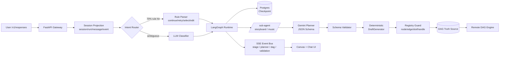

# ArtArch.AI · AI 智能创作平台 面试 Q&A

> 这是简历主线项目。面试 70% 的深度追问会集中在这里：{{Agent Runtime|智能体运行时}}、{{Planner|规划器}}+确定性装配、{{SSE|服务器推送事件}} 流式协议、{{DAG|有向无环图}} 校验、{{Checkpoint|检查点}}/{{HITL|人机协同}}、{{Context Engineering|上下文工程}}、{{Eval|评测}} 闭环。本文是这块面试的「现场背诵稿 + 反向引导地图」。


---

## 0. 一分钟项目介绍（开场必背）

> 面试官最常说的第一句话是：「先简单介绍一下你这个项目」。下面这段是我准备的 60 秒口播版，按 **「业务问题 → 技术选择 → 工程亮点 → 量化结果」** 四段结构，可以拆开适配 30 秒和 3 分钟两个长度。

ArtArch.AI 是一个面向 AI 短视频 / 图片 / 音频创作场景的生产级 Agent 平台。用户用自然语言提一句「我想做一个 30 秒 / 古风 / 双人对话的短视频」，系统会自动完成创意打磨、脚本规划、分镜设计、音乐音效建议、最终产出一张可被远程引擎执行的多模态 DAG 工作流。

技术上我做的最关键的一件事，是把 LLM 当成「不确定的语义组件」，再用后端工程把它的不确定性收住。具体讲：

- **运行时**：基于 LangGraph 自建多阶段 Agent Runtime，把任务拆成 intent / format_confirm / synopsis / core_elements / storyboard / music / dag_draft 等节点，用 `thread_id=session_id` 绑定会话，配合 PostgresSaver 做 {{Checkpoint|检查点}} 与 Interrupt/Resume，单 session 支持 50+ 轮上下文、断线恢复成功率 99%+。
- **生成策略**：采用 **Planner + 确定性装配** 模式。LLM 只输出符合 JSON Schema 的「创意 + Workflow 选择 + 槽位填充」，最终 DAG 由确定性 DraftGenerator 从「真实模板蒸馏」出的 Pattern 装配而来。DAG 一次性可执行率从 ~55% 提升到 95%+。
- **协议**：自研类 OpenAI Responses 风格的 `/v1/responses` SSE 协议，发送结构化事件（`stage.started`、`planner.delta`、`dag.updated`、`validation.report`、`message.completed`），前端可实时渲染推理过程、DAG 变化、错误回退，首 token < 1.5s。
- **成本控制**：双层意图解析（规则层 + LLM Classifier）把约 70% 高频指令拦在规则层、整体 LLM 成本下降 ~40%；DAG 真实模板蒸馏让 Planner 上下文成本进一步压缩。
- **可观测与评测**：自建 session/run/message/event/checkpoint 五张投影表，配合 trace、token/cost 审计、自建 30+ 种节点类型 dry-run 评测集，做到「线上 Badcase 一周回流一次」。

> **发散 tip（引导面试官话题）：**
> - 「我可以重点讲 LangGraph 的 checkpoint 落地坑，也可以重点讲 Planner + 确定性装配是怎么把幻觉压下去的，您更感兴趣哪条线？」—— 把选择权交给面试官，但两条线都是你强项。
> - 「这套架构其实和 Karpathy 在 Software 3.0 演讲里说的『autonomy slider』思路是一致的：人类、规则、模型分占控制权，按场景滑动。」—— 把项目升维成「行业方法论实践」。

---

## 1. 选型与边界：为什么是 LangGraph、为什么不是 Agent 自己撸

### Q1：为什么选择 LangGraph，而不是 LangChain Agent / OpenAI Agents SDK / 自己写状态机？

**核心论点：** 不是「LangGraph 更新更潮」，而是 **创作 Agent 的产品形态决定了我们需要一个低层、显式状态、可持久化、可中断恢复的 Runtime**。

我从三个维度对比：

| 维度 | LangChain Agent / ReAct | OpenAI Agents SDK | 自研状态机 | LangGraph |
|---|---|---|---|---|
| 心智模型 | Prompt loop，工具自由调用 | Agent + Handoff，hub-and-spoke | 完全自由 | 显式 StateGraph：State / Nodes / Edges |
| 长流程持久化 | 弱，需自己拼 history | 中等，session 在 SDK 里 | 自己造 | 内置 Checkpointer（Memory/Postgres/SQLite） |
| Interrupt / Resume | 没有原生概念 | 有 handoff 但偏单向 | 自己实现 | 一等公民：`interrupt()` + `Command(resume=...)` |
| 流式控制 | token 流为主 | 标准 SSE | 自由 | `stream_mode="custom"` 写结构化事件 |
| Subgraph | 不支持 | 不强 | 自己造 | 一等公民 |
| 上手成本 | 低 | 低 | 高 | 中（你需要懂 State / Reducer / Channel） |

**选 LangGraph 的关键三条理由：**

1. **创作流程不是 ReAct loop**：分镜、规格确认、音乐选择，每一阶段输入输出、是否要 HITL、是否要重试都不一样。LangGraph 的 StateGraph 让我**把阶段显式地建出来**，而不是埋在一个大 prompt 里。
2. **生产必须可恢复**：用户刷新页面、移动端切后台、网络断了，会话不能从头跑。LangGraph 的 PostgresSaver 让我用 `thread_id=session_id` 一行话就接上「跨进程恢复」。
3. **低层灵活，不绑死 Agent 形态**：今天我是 Planner + Deterministic，明天产品想加一个 critic agent、加一个工具调用 sub-agent，我都能塞进同一个 graph，不需要换框架。

> **发散 tip：**
> - 引出 Karpathy 「autonomy slider」：「我选 LangGraph 而不是更高层的 SDK，本质上就是把自由度留给自己——产品需要的不是 100% autonomy，而是『可调』的 autonomy。」
> - 如果面试官追问「为啥不直接用 dify / coze 这种平台」：「平台适合做单一工具调用的 demo，但我们要做的是把创作流程显式建模 + 真实 DAG 装配，这不是 prompt 编排能完成的。」

参考：

- LangGraph Persistence: <https://docs.langchain.com/oss/python/langgraph/persistence>
- Anthropic - Building Effective Agents（workflow 与 agent 的分类，是我做选型时的方法论锚）：<https://www.anthropic.com/engineering/building-effective-agents>

---

### Q2：Agent 和 Workflow 的边界是什么？你这套到底算 Agent 还是 Workflow？

**核心论点：** 按 Anthropic 的定义，**workflow 是「LLM 和工具按预定义代码路径编排」**，**agent 是「LLM 动态决定自己用什么工具、走什么路径」**。**我这套是「workflow 骨架 + agent 局部决策」的混合体，刻意不追求全 agent。**

具体讲：

- **Workflow 层**：阶段之间是有明确编排的（intent → confirm → synopsis → core → storyboard → music → dag_draft），这是用户产品流程决定的，不应该让模型自由跳。
- **Agent 层**：每个阶段内部，LLM 自己决定「分多少个镜头、用哪个 workflow pattern、怎么填槽位」，输出由 JSON Schema 约束，由代码二次校验。

**为什么不上全 agent？**

> 「Demo is `works.any()`, product is `works.all()`」—— Karpathy

全 agent 的问题是：
1. 创作链路有 7 个阶段，全 agent 让模型自己决定阶段顺序，错一个就要回溯。
2. 错误归因变难。是 planner 错了、还是 critic 错了、还是 tool 调度错了？workflow + 局部 agent 可以把每一层的失败率单独算。
3. 用户体验需要稳定。创作 Agent 不是 deep research，用户不希望「等半天还不知道在做啥」。

> **发散 tip：**
> - 引出 Anthropic：「他们在 Building Effective Agents 里讲，绝大多数生产场景应该选 workflow，全 agent 只在『任务路径无法预先描述、错误代价低』时才合适。我的选择和这个一致。」
> - 引出 Karpathy: 「Cursor 的 Tab → Cmd+K → Cmd+L → Agent 模式就是 autonomy slider，我们这套也是。」

---

## 2. Agent Runtime 架构深挖

### Q3：请画一下你们 Agent Runtime 的整体架构。



**讲解节奏（每一块给一句话就够，面试官会自己挑感兴趣的追问）：**

1. **Session Projection**：所有用户输入都先落 5 张投影表（session / run / message / event / checkpoint），保证幂等、可追踪、可重放。这一层独立于 LangGraph 之外，是为了「会话视角」和「图视角」解耦。
2. **Intent Router**：双层意图解析，规则先行、模型兜底，下面 Q4 详讲。
3. **LangGraph Runtime**：StateGraph 管理阶段流转，PostgresSaver 落 checkpoint，子图嵌套（storyboard / music 等复杂阶段独立子图）。
4. **Planner**：Gemini 输出 JSON，但不输出最终 DAG，只输出「workflow refs + slot 填充 + 分镜结构化数据」。
5. **DraftGenerator**：从真实模板库（蒸馏自线上可执行 DAG）按 pattern 装配最终 DAG。
6. **Registry Guard**：最后一道防线，校验 node / edge / handle / slot / schema，校验失败抛回 graph 做局部重试或转 HITL。
7. **SSE**：把上面每一层的关键事件结构化推给前端，前端不是「等最终消息」，而是「跟着 Agent 推进的过程实时渲染 Canvas」。

> **发散 tip：**
> - 「这张图里有三条关键边界：会话视角 vs 图视角、语义生成 vs 结构装配、Agent Runtime vs DAG Engine。这三条边界是我做工程化最大的收获。」—— 引出后面任意一条都能展开 5 分钟。
> - 引出 dag_engine 项目细节：「我对应的真实代码在 `agent/runtime.py` 和 `engine/dag_executor.py`，可以看到 LangGraph 只管阶段编排，不管 DAG 执行；DAG 执行是另一个独立的拓扑调度器。」

---

### Q4：双层意图解析具体怎么做？规则层怎么不误判？

**核心论点：** 规则层不是「硬编码业务逻辑」，而是 **针对「动作类型 + 上下文阶段」**做高置信判断，**置信度不足的全部上抛给 LLM Classifier**。

```python
# 简化版核心逻辑
INTENT_PATTERNS = {
    "continue":  [r"^(继续|下一步|next|go on)\s*[。.!！]?$"],
    "retry":     [r"^(重试|再试一次|重新生成)\s*[。.!！]?$"],
    "select":    [r"^(选\s*[ABC]|option\s*[ABC]|第\s*\d+\s*个)"],
    "edit_shot": [r"(改|修改|调整).*?(第\s*\d+\s*个?)?(镜头|分镜)"],
    "shorter":   [r"再?(短|简?短)一?点"],
    "cancel":    [r"^(取消|stop|cancel)$"],
}

def parse_intent(text: str, ctx: SessionContext) -> Intent | None:
    norm = normalize(text)  # 全角转半角、去 emoji、统一标点
    for action, patterns in INTENT_PATTERNS.items():
        if any(re.match(p, norm) for p in patterns):
            # 关键：结合 ctx.stage / pending_choices / last_agent_action 判断
            if not _valid_in_context(action, ctx):
                return None  # 上抛 LLM
            return Intent(action=action, confidence=0.95, source="rule")
    return None  # 上抛 LLM
```

**三个防误判技巧：**

1. **action 类型有限**（continue / retry / select / edit_shot / shorter / cancel / restart），不混入业务语义。语义类一律走 LLM。
2. **上下文强约束**：「继续」在 `format_confirm` 阶段是确认进入下一步，在 `storyboard` 阶段是继续生成第 N+1 个镜头，规则层必须用 `current_stage + pending_choices + last_agent_action` 三元组判断。
3. **置信度强制下限**：规则层只发 `confidence >= 0.9` 的判断，低于这个全部上抛 LLM。

**为什么能省 40% 成本？**

简单算笔账：

- 假设每 turn 平均要做 1 次 intent 分类。
- LLM Classifier 一次 ~200 input + 50 output token，按 Gemini 1.5 Flash 算约 $0.00015。
- 规则层吃掉 70%，那 70% 的 LLM 调用就省了。
- 加上 Planner 每个阶段 1-3 次调用，整体 LLM 调用次数下降 ~40%。

> **发散 tip：**
> - 「这个思路和 LangChain 在 Context Engineering for Agents 里讲的 `select` 策略是一致的——把廉价能解决的搬出 LLM，把贵的留给 LLM 真正擅长的事。」
> - 「我没有把规则层做成 BERT 分类器，因为高频指令规则就能搞定，BERT 还要维护训练 pipeline，性价比反而低。」—— 体现工程权衡，不是迷信小模型。

参考：

- LangChain - Context Engineering for Agents: <https://www.langchain.com/blog/context-engineering-for-agents>

---

### Q5：Checkpoint + Interrupt/Resume 在你们场景里到底解决了什么问题？

**核心论点：** Checkpoint 是「让 Agent 可以被时间和故障切片」，Interrupt/Resume 是「让用户决策成为 Agent 的一等输入」。**没有这俩，长流程 Agent 必然返工。**

具体三个场景：

**场景 1：用户中途确认规格**

故事方案有 A/B/C 三个候选，用户要选一个再继续：

```python
# agent/runtime.py 节选
def _node_synopsis(state: AgentGraphState):
    candidates = llm.gen_synopsis_candidates(state["script_spec"])
    return interrupt(
        pending={
            "type": "synopsis_choice",
            "options": [c.to_card() for c in candidates],
            "stage": "synopsis_choice",
        }
    )
# 用户选 B 后：
graph.invoke(Command(resume="B"), config={"configurable": {"thread_id": sid}})
```

**关键**：interrupt 抛出的 pending 信息会落 checkpoint，前端断线重连也能从 session 投影读到「现在在等用户选 A/B/C」。

**场景 2：用户刷新页面**

前端拿 `session_id` 重连：
1. 服务端从 session 投影读最近一次 checkpoint_id 和 pending_interrupt。
2. SSE 发回历史事件 + 当前 pending state。
3. 用户继续操作，从 checkpoint 接着跑，不重跑 LLM。

**场景 3：故障重试**

某个阶段 LLM 输出 schema 不合法，graph 不抛错给用户，而是在节点内做 retry-with-feedback。如果 3 次都失败，转 HITL 并保留 checkpoint，运维可以接手看 trace。

**State Schema 的两个原则：**

```python
class AgentGraphState(TypedDict):
    # 1. 关键决策结构化保存（不能依赖自然语言摘要）
    script_spec: ScriptSpec
    workflow_plan: WorkflowPlan
    dag_current: DAGDraft
    confirmed_choices: dict[str, str]  # stage -> user's choice

    # 2. 大对象只存引用，不存内容
    storyboard_image_refs: list[str]  # S3 keys
    music_sample_refs: list[str]

    # 3. 阶段 + pending
    stage: Literal["intent", "format_confirm", ...]
    pending_interrupt: dict | None

    # 4. 消息历史用 reducer 增量追加
    messages: Annotated[list[BaseMessage], add_messages]
```

> **发散 tip：**
> - 「我踩过的坑：早期把整个 storyboard prompt 都塞进 state，checkpoint 越来越大，PostgreSQL 那张表 1 周就到 10G。后来改成只存『结构化决策 + 引用』，每条 checkpoint < 32KB。」
> - 「这套和 Karpathy 讲的『anterograde amnesia』是同一个问题——LLM 没有跨会话记忆，所有可恢复状态必须我们自己结构化沉淀。Checkpoint 就是显式记忆。」

参考：

- LangGraph Human-in-the-loop: <https://docs.langchain.com/oss/python/langchain/frontend/human-in-the-loop>
- Karpathy - Software 3.0（anterograde amnesia 章节）：<https://www.latent.space/p/s3>

详细技术专题见 [LangGraph 上下文工程实战](./notes/langgraph-context-engineering.md)。

---

### Q6：SSE 协议怎么设计？为啥不用 WebSocket？

**核心论点：** **SSE 是「服务端主导的事件流」**，刚好契合 Agent 这种「服务端主推阶段事件、客户端只偶尔发命令」的形态；WebSocket 是「双向高频」，我们没这个需求，反而徒增工程复杂度。

**事件类型设计（学的是 OpenAI Responses API 的形态，但事件语义自定义）：**

```typescript
// 前端用 EventSource 监听
type ResponseEvent =
  | { type: "stage.started"; stage: Stage; ts: number }
  | { type: "stage.completed"; stage: Stage; output_ref: string }
  | { type: "planner.delta"; chunk: string; partial?: object }
  | { type: "planner.completed"; plan: WorkflowPlan }
  | { type: "dag.updated"; dag: DAGDraft; diff?: JSONPatch[] }
  | { type: "validation.report"; ok: boolean; errors: ValidationError[] }
  | { type: "message.created"; role: "agent"; payload: Card }
  | { type: "message.completed"; run_id: string }
  | { type: "run.cancelled"; reason: string }
  | { type: "error"; code: string; message: string };
```

**服务端要处理的 6 个工程细节（这是面试拉开差距的地方）：**

1. **`Content-Type: text/event-stream` + `X-Accel-Buffering: no`**：禁用 Nginx 缓冲，否则首 token 要等满 4KB 才会下来。
2. **定期 ping（`:keepalive` 注释行）**：每 15s 发一次，防止中间代理 60s 超时断连。
3. **事件 id + 客户端 `Last-Event-Id` 头**：断线重连客户端带上最后收到的 id，服务端从 event 投影读后续事件回放。
4. **客户端 disconnect 检测**：FastAPI 用 `request.is_disconnected()` 监听，断连后取消后台 LangGraph 任务（`task.cancel()`），避免烧 token。
5. **JSON 分片 vs 一次性**：planner.delta 流式输出，但 dag.updated 一次性给完整 diff，避免前端拼半截 DAG 渲染崩溃。
6. **流式 + checkpoint 一致性**：每次发完 `stage.completed`，先持久化 checkpoint 再 ack，避免「事件推完了但 checkpoint 没存」导致重连状态不一致。

```python
# 简化版核心：FastAPI 端 SSE 实现
from fastapi.responses import StreamingResponse

async def event_stream(req: Request, session_id: str):
    last_id = req.headers.get("last-event-id")
    async for ev in agent_runtime.stream(session_id, last_id=last_id):
        if await req.is_disconnected():
            await agent_runtime.cancel(session_id)
            break
        yield f"id: {ev.id}\nevent: {ev.type}\ndata: {ev.json()}\n\n"

@app.post("/v1/responses")
async def responses(req: Request, body: ResponseRequest):
    return StreamingResponse(
        event_stream(req, body.session_id),
        media_type="text/event-stream",
        headers={"X-Accel-Buffering": "no", "Cache-Control": "no-cache"},
    )
```

**为啥不用 WebSocket？**

- 单向流，没必要双向。用户操作通过 POST `/v1/responses` 发起新 run 就够了。
- SSE 走标准 HTTP，鉴权 / 限流 / 反代 / CDN 都和普通 API 一致。WebSocket 要单独处理。
- 浏览器原生 `EventSource` 自动重连，前端代码量小。
- 真正双向高频的场景（多人协作 Canvas）我会再上 WebSocket，分协议处理。

> **发散 tip：**
> - 「SSE 这块我特别喜欢学习 OpenAI Responses API 和 Anthropic Messages API 的事件结构——它们的差别其实反映了两家对 Agent 形态的不同理解。我们的 `/v1/responses` 整体偏 OpenAI 风格，但事件类型按业务自定义。」
> - 「这层做好了能直接接其他客户端：移动端、小程序、CLI。我们后来确实接了一个 CLI 调试客户端，用 `curl -N` 就能看完整 trace。」

参考：

- OpenAI Responses API: <https://platform.openai.com/docs/api-reference/responses>
- MDN Server-sent events: <https://developer.mozilla.org/en-US/docs/Web/API/Server-sent_events/Using_server-sent_events>

---

## 3. Planner + 确定性装配：把幻觉压到 5% 以下

### Q7：为什么不让 LLM 直接生成 DAG？「Planner + 确定性装配」 vs 「LLM 直接生成 DAG」的本质区别是什么？

**核心论点：** **让 LLM 做语义决策（哪个 workflow、几个镜头、什么风格），让代码做结构装配（节点 ID、edge handle、slot schema、layout）**。前者是它擅长的，后者是它最容易翻车的。

**早期方案（LLM 直接生 DAG）的失败模式（实测）：**

| 失败类型 | 频率 | 典型表现 |
|---|---|---|
| 节点名幻觉 | ~18% | 编造 `t2v_advanced_v3`、`music_compose_pro_v2` 等不存在的 node type |
| edge handle 错 | ~12% | `targetHandle="input_image"` 而真实节点是 `targetHandle="image"` |
| slot 类型不匹配 | ~8% | 把 video 节点的输出接到 text 节点的输入 |
| 必填字段缺失 | ~7% | custom_config 漏 `aspect_ratio` |
| layout 错位 | ~10% | flow_info 坐标重叠，前端 Canvas 渲染成一团 |
| 合计一次性可执行率 | **~55%** | |

**新方案：Planner 只输出受 JSON Schema 约束的「Plan」**

```python
# Plan 是结构化「意图」，不是 DAG
class WorkflowPlan(BaseModel):
    workflow_ref: Literal["t2i_basic", "i2i_style", "t2v_two_step",
                         "first_last_frame_v2v", "music_compose",
                         "video_concat_v2"]  # 闭集，模型只能选已知
    shots: list[ShotSpec]  # 每个 shot 的结构化描述
    style: StyleSpec
    music: MusicSpec | None
    duration_sec: float
    aspect_ratio: Literal["9:16", "16:9", "1:1"]

# Planner 严格要求结构化输出
plan: WorkflowPlan = llm.with_structured_output(WorkflowPlan).invoke(prompt)
```

**DraftGenerator 用真实模板装配：**

```python
def assemble_dag(plan: WorkflowPlan) -> DAGDraft:
    template = TEMPLATES[plan.workflow_ref]  # 真实线上跑过的 pattern
    nodes, edges = [], []
    for i, shot in enumerate(plan.shots):
        # 节点 ID、handle、layout 全部由模板 + 索引确定性生成
        n = template.instantiate(shot, index=i, style=plan.style)
        nodes.extend(n.nodes)
        edges.extend(n.edges)
    return DAGDraft(nodes=nodes, edges=edges, meta={...})
```

**Registry Guard 最后一道防线：**

```python
def validate_dag(dag: DAGDraft) -> ValidationReport:
    errors = []
    for node in dag.nodes:
        spec = REGISTRY.get(node.type)
        if not spec:
            errors.append(NodeTypeError(node.type))
        if not spec.matches_custom_config(node.custom_config):
            errors.append(SchemaError(node.id))
    for edge in dag.edges:
        src, tgt = node_index[edge.source], node_index[edge.target]
        if edge.targetHandle not in tgt.spec.input_handles:
            errors.append(HandleError(edge))
        if not type_compatible(src.outputs[edge.sourceHandle],
                              tgt.inputs[edge.targetHandle]):
            errors.append(TypeMismatch(edge))
    return ValidationReport(ok=not errors, errors=errors)
```

**指标如何度量？**

「一次性可执行率」 = 用户单轮生成中，DAG 不经过 retry 就能通过 Registry Guard 校验、并被远程引擎接受执行的比例。

- 分母：每天的生成请求总数。
- 分子：first_validation_pass=True 且 remote_engine_accepted=True 的请求数。
- 失败原因按 7 类落 dashboard，每周回流到 Planner prompt / 模板库 / Registry。

> **发散 tip：**
> - 「这本质上是把 LLM 工程当做 compiler 设计——Planner 是前端（输出 IR），DraftGenerator 是后端 codegen，Registry Guard 是 type checker。把 LLM 拍成『生成 IR 的语义模块』，幻觉就被 type system 拦住了。」
> - 「类似思路 OpenAI 在 Structured Outputs / Function Calling、Anthropic 在 tool use 都强调过：never trust LLM JSON, always validate。我们做的只是把这个原则贯彻到一整套 DAG 生成流程里。」

详细技术专题见 [Planner + 确定性装配深度拆解](./notes/planner-deterministic-deep-dive.md)。

---

### Q8：「真实模板蒸馏」具体怎么做？这不是模型训练吧？

**核心论点：** **不是训练，是工程化的「数据驱动 prompt + 模板库构建」**。从线上跑通的 DAG 反向抽取「结构」，再把结构作为 Planner 的 few-shot 锚点 + DraftGenerator 的实例化模板。

**4 个抽取步骤：**

1. **采集**：从生产 DAG truth source 选「最近 30 天、执行成功 + 用户没有再编辑」的 DAG 作为 golden set。
2. **聚类**：按 node type 序列哈希 + edge 拓扑相似度做层次聚类，发现 ~30 种主要 pattern。
3. **抽象**：每个 pattern 抽出「骨架（node types + edges + handle 映射）」+「可变槽位（shot 数、style、duration、ratio）」。
4. **注释 + 入库**：每个 pattern 写一段 Planner 可读的 schema 描述（包含 use case、限制、参数取值范围），作为 Planner system prompt 的一部分（few-shot）+ DraftGenerator 的 instantiate 模板。

```python
# 一个 pattern 在系统里的形态
@dataclass
class WorkflowPattern:
    ref: str  # "first_last_frame_v2v"
    description: str
    use_cases: list[str]
    constraints: dict  # {"max_shots": 8, "aspect_ratio": ["9:16", "16:9"]}
    node_skeleton: list[NodeSkeleton]
    edge_skeleton: list[EdgeSkeleton]
    slot_schema: dict
    layout_template: LayoutTemplate
    examples: list[dict]  # 真实跑过的 DAG 片段，作为 few-shot

# Planner system prompt 里只放 schema 描述 + 1-2 个 example，不放完整 DAG
```

**为什么这个比「prompt 里塞几个 DAG 例子」更好？**

- Prompt 塞完整 DAG 会把上下文撑到 50k+ token，影响其他阶段。
- LLM 看完整 DAG 会试图模仿细节（包括坐标），反而引入幻觉。
- 抽象出来的 schema 描述 + 1-2 example 让模型只关心「选哪个 pattern + 填什么槽位」。

> **发散 tip：**
> - 「这套思路和 RAG 是同构的：DAG 模板库是知识库，Planner 是带检索的生成器，Registry Guard 是引用校验。把 DAG 生成问题转译成 RAG 问题，工程化方式就清楚了。」
> - 「未来一步是把蒸馏做成在线的——每条新跑通的 DAG 自动评分入库，pattern 自动演化。这是我下阶段想推的事，可以聊一下。」

---

### Q9：JSON Schema 约束 + LLM 结构化输出怎么做才稳？

**核心论点：** **Schema 约束只是第一层防线，必须配合「分阶段输出 + 二次校验 + retry-with-feedback」三件套才稳。**

**三家厂商的结构化输出对比（面试加分细节）：**

| 厂商 | 机制 | 强度 |
|---|---|---|
| OpenAI (Responses) | `response_format={"type": "json_schema", "strict": true}` | 模型 token-level 强制 |
| Anthropic | `tool_use` + JSON Schema，模型「软约束」 | 模型自觉，需校验 |
| Gemini | `response_mime_type="application/json"` + `response_schema` | 模型自觉，需校验 |
| Outlines / Instructor / xgrammar | 客户端 constrained decoding | 100% schema 合法 |

**我在 ArtArch.AI 里的做法（Gemini 2.5 Pro / Flash）：**

```python
class StoryboardPlan(BaseModel):
    shots: list[ShotSpec] = Field(min_length=1, max_length=8)
    aspect_ratio: Literal["9:16", "16:9", "1:1"]
    total_duration_sec: float = Field(ge=5, le=60)

def generate_plan(spec: ScriptSpec) -> StoryboardPlan:
    for attempt in range(3):
        try:
            raw = gemini.generate(
                contents=PROMPT.format(spec=spec),
                config={
                    "response_mime_type": "application/json",
                    "response_schema": StoryboardPlan.model_json_schema(),
                    "temperature": 0.7,
                },
            )
            return StoryboardPlan.model_validate_json(raw.text)
        except ValidationError as e:
            # retry-with-feedback：把校验错误塞回 prompt
            prompt = PROMPT.format(spec=spec) + f"\n\n上次输出校验失败：{e.errors()}，请修正后重新生成。"
    raise PlanGenFailed()
```

**三个关键技巧：**

1. **拆 schema**：一个超大 schema 拆成多个小 schema 分阶段生成。模型对 1k token 的 schema 比对 10k token 的 schema 稳定得多。
2. **field 顺序**：JSON Schema 里把决策性字段（workflow_ref、aspect_ratio）放前面，模型「先决策再填充」准确率更高。
3. **retry-with-feedback**：第一次失败把 ValidationError 塞回 prompt，第二次成功率显著上升。

> **发散 tip：**
> - 「OpenAI 的 strict JSON Schema 是 token-level 的硬约束，本质上是 logits 阶段做 mask；Gemini 和 Anthropic 当前主要靠模型自觉。所以我额外在客户端做 retry-with-feedback，把它补齐到接近 strict 的效果。」
> - 「如果要做完全确定的 schema，constrained decoding 库（Outlines / xgrammar）是终极方案，但需要本地模型，云 API 暂时用不上。」

---

## 4. 上下文工程与成本：Karpathy「Software 3.0」的具体落地

### Q10：你怎么管理 Agent 的上下文预算？50 轮对话怎么不爆 token？

**核心论点：** 上下文管理 = **写 / 选 / 压 / 隔** 四件事（LangChain 总结）。在 ArtArch.AI 我同时用了这四种策略。

| 策略 | 我的做法 |
|---|---|
| Write（外置） | 大对象（图片、音频、storyboard 描述）只存 S3 引用 + checkpoint，state 不放原文 |
| Select（按需取） | 每个阶段只把「当前阶段需要的字段」塞进 prompt（script_spec / shot_i / style），不发整段历史 |
| Compress（压缩） | 历史 messages 超过 30 条触发摘要，结构化保留「关键决策」+ 自然语言保留「最近 4 轮原文」 |
| Isolate（隔离） | storyboard / music 等阶段独立 sub-agent，sub-agent state 不污染主图 |

**摘要触发策略：**

```python
def maybe_summarize(state: AgentGraphState) -> AgentGraphState:
    msgs = state["messages"]
    if len(msgs) > 30 or sum(len(m.content) for m in msgs) > 32_000:
        keep_recent = msgs[-4:]   # 最近 4 轮原文，保「语气」
        to_summarize = msgs[:-4]
        summary = llm.summarize(
            to_summarize,
            schema=DecisionSummary,  # 结构化摘要，不是自由文本
        )
        state["history_summary"] = summary
        state["messages"] = keep_recent
    return state
```

**Karpathy 提到的「append-and-review」思路怎么用？**

- 关键决策（用户选了什么风格、确认了什么规格）不进自然语言摘要，**单独入 `confirmed_choices` 结构化字段**。
- 自然语言摘要只承载「flavor」（用户语气、不确定的偏好），结构化决策永远是单一真相源。
- 这刚好是 Karpathy 在 The append-and-review note 里讲的方法论：raw note (append-only) + reviewed structured memory（评审后结构化）。

> **发散 tip：**
> - 引出 Phil Schmid Context Engineering Part 2 的 「compaction vs summarization」 区分：「压缩有可逆和有损两类，我对决策类信息用可逆压缩（引用 + 结构化），对语气类用有损压缩（自然语言摘要）。」
> - 「我也参考了 Claude 长上下文 cache 策略：把不变的部分（system prompt + few-shot）放前面，让 prefix cache 命中，每 turn 重复支付的是变化部分。」

详见 [LangGraph 上下文工程实战](./notes/langgraph-context-engineering.md)。

参考：

- LangChain - Context Engineering for Agents: <https://www.langchain.com/blog/context-engineering-for-agents>
- Phil Schmid - Context Engineering Part 2: <https://www.philschmid.de/context-engineering-part-2>
- Karpathy - The append-and-review note: <https://karpathy.bearblog.dev/the-append-and-review-note/>

---

### Q11：成本怎么测？怎么定 budget？

**核心论点：** 把 LLM 调用当做「数据库查询」管理：**每次调用都有 owner、有预算、有 trace**。线上每天看四张图：调用次数、平均 token、平均 cost、各 stage 占比。

**Trace 字段（这是面试加分点，能让面试官知道你真做过线上）：**

```python
class LLMCallTrace:
    trace_id: str
    session_id: str
    run_id: str
    stage: str  # "intent" / "planner.synopsis" / "planner.storyboard" / ...
    provider: str  # "gemini" / "openai" / "ernie"
    model: str
    prompt_version: str
    input_tokens: int
    output_tokens: int
    cached_tokens: int
    cost_usd: float
    latency_ms: int
    schema_validation: bool
    retry_count: int
    fallback_chain: list[str] | None
    error_code: str | None
```

**预算管理三层：**

1. **session 级**：单 session 软上限 50 万 token / $0.5。超过给前端 banner 提示「该会话已使用 X，建议新建会话」。
2. **stage 级**：每个 stage 都有预算（intent ≤ 0.5k token、planner.synopsis ≤ 4k、planner.storyboard ≤ 16k...）。超预算先用 prompt 压缩、再用 fallback 模型。
3. **provider 级**：Gemini Flash → Gemini Pro → OpenAI fallback 链，按延迟 / 错误 / 余额健康度动态切换。

> **发散 tip：**
> - 「我把成本 dashboard 和评测集放一起看：哪类 query 成本高但效果差？哪类 query 走规则层就够？这俩交叉看是优化的金矿。」

---

## 5. 评测与可观测：怎么证明你做的真的有效

### Q12：你怎么评测一个 Agent？

**核心论点：** Anthropic 的 capability eval / regression eval 二分法，加上 **trajectory-level grading（不止看最终输出，看整个轨迹）**。

**评测分四层：**

| 层 | 目标 | 方法 |
|---|---|---|
| Schema | DAG 是否 schema 合法 | Registry Guard，code-based grader |
| Executable | DAG 是否能 dry-run 跑通 | 远程引擎 dry-run mode |
| Trajectory | 中间阶段是否「该 HITL 时 HITL、该重试时重试」 | trace 规则匹配 + LLM-as-judge |
| Outcome | 最终产物质量（用户视角） | 人工标注 + LLM-as-judge，定期人工校准 |

**评测集长什么样？**

- 200 条 capability eval（覆盖 30 种 pattern，每个 pattern 5-10 个 case），pass rate 初期 50%，迭代到 90%+。
- 100 条 regression eval（从 capability 里挑稳定的），pass rate 必须 ~100%，进 CI。
- 50 条「Badcase 回流」（从线上每周回收的失败 case），用于盯长尾。

**为啥不能只看「最终 DAG 能跑」？**

> Anthropic 在 Demystifying Evals 里讲：**Outcome eval 不够，必须看 transcript/trajectory**。

举个例子：

- DAG 最终跑通了 ✅
- 但中间 Planner 重试了 5 次 ❌（说明 prompt 不稳）
- 这种 case 单看 outcome 你以为没问题，看 trajectory 才发现要修。

```python
# Trajectory grader 示例
def grade_trajectory(trace: list[Event]) -> TrajectoryReport:
    return TrajectoryReport(
        stages_visited=[e.stage for e in trace if e.type == "stage.completed"],
        planner_retries=sum(1 for e in trace if e.type == "planner.retry"),
        validation_failures=[e for e in trace if e.type == "validation.report" and not e.ok],
        total_latency=trace[-1].ts - trace[0].ts,
        ok=(planner_retries <= 1 and not any_unhandled_validation_failure),
    )
```

> **发散 tip：**
> - 「Anthropic 的 pass@k vs pass^k 我都跑过。Agent 上线初期我看 pass@3（重试 3 次中至少 1 次成功），稳定后我看 pass^3（连续 3 次都必须成功）——后者才是 SLA 衡量标准。」
> - 「LLM-as-judge 不能盲信，每周抽 20 条样本人工校准 judge 模型的判断，发现 prompt drift 就重新校准。」

参考：

- Anthropic - Demystifying Evals: <https://www.anthropic.com/engineering/demystifying-evals-for-ai-agents>

---

### Q13：Trace 里你最关心哪些字段？怎么用 trace 排障？

按 7 类 span 组织，每类 span 的关键字段：

| Span 类 | 字段 |
|---|---|
| run | session_id, run_id, stage_chain, total_latency, first_token_latency, status |
| stage | stage_name, input_tokens, output_tokens, retries, validation_ok |
| llm_call | provider, model, prompt_version, tokens, cached_tokens, schema_strict, fallback_chain |
| tool_call | tool_name, args_hash, status, duration_ms, error_code |
| validation | rule_id, severity, location |
| dag | node_count, edge_count, types_histogram, executable |
| user_event | type, ts, intent.source, intent.confidence |

**典型排障三步：**

1. 用户反馈「卡住了」 → 查 session 投影找最近 run_id → 看 run.status。
2. 如果 status 是 stuck_in_planner → 看 stage trace，看 retries、validation errors、token 用量。
3. 找到具体的 llm_call → 拿 prompt_version + 输入回放，本地复现。

> **发散 tip：**
> - 「我用 Langfuse 做 trace 后端，但 schema 是自己定的（没完全跟 OpenTelemetry GenAI semantic convention）。这块是一个可以聊的细节——OTel GenAI 标准在 2025 才稳定。」

---

## 6. 多模型路由与 Fallback

### Q14：怎么做多模型路由 + Fallback？

**Provider 抽象（核心是「让上层不感知 SDK 差异」）：**

```python
class LLMProvider(Protocol):
    async def stream(self, request: LLMRequest) -> AsyncIterator[LLMChunk]: ...
    async def generate(self, request: LLMRequest) -> LLMResponse: ...
    def supports(self, feature: Literal["strict_json", "tool_calling", "vision"]) -> bool: ...

# 上层 stage code 不知道下面是 Gemini 还是 OpenAI
plan = await llm_provider.generate(LLMRequest(
    messages=msgs,
    schema=WorkflowPlan,
    stage="planner.synopsis",
))
```

**路由策略：**

| 任务类型 | 主模型 | Fallback |
|---|---|---|
| Intent classifier | Gemini Flash | OpenAI 4o-mini |
| Synopsis | Gemini 2.5 Pro | Claude Sonnet |
| Storyboard / DAG plan | Gemini 2.5 Pro（json schema 支持好）| OpenAI gpt-5 strict json |
| 图像 caption | Gemini Vision | OpenAI gpt-4o |

**Fallback 触发规则（不是所有错误都该 fallback）：**

| 错误 | 处理 |
|---|---|
| 5xx / Timeout | 立即 fallback |
| 429 Rate Limit | 退避 + fallback |
| Schema validation failed | **本 provider 内 retry-with-feedback，2 次不行再 fallback** |
| 内容安全拒答 | **不 fallback**，按业务策略转 HITL / 提示用户 |

> **发散 tip：**
> - 「Fallback chain 一定要 trace 起来。我见过同事不打 trace，线上突然 cost 暴涨，查了半天才发现是某个 provider 挂了一直 fallback 到 GPT-4 Vision。」

---

## 7. 行为面 & 反向引导

### Q15：你项目里最大的技术挑战是什么？

> 这题答错就完了，必须挑「能展示 LLM 工程方法论」的事，而不是普通后端能聊的。

**我的回答模板：**

最大的挑战是让多模态创作 Agent **既保留 LLM 的创意灵活性，又能稳定产出可执行 DAG**。早期我对模型预期过高，以为 prompt + schema + few-shot 就能搞定，但实测下来 DAG 一次性可执行率只有 ~55%。

我花了一个月调研失败模式，发现幻觉不是均匀分布的：**语义类（哪个 workflow、几个镜头、什么风格）模型很稳；结构类（node id、edge handle、slot schema、layout）模型必错**。

解决方式不是堆 prompt，而是 **重新划分 LLM 和代码的职责**：模型做 IR（结构化 plan），代码做装配（DAG），Registry 做最后 type check。这套架构上线后，DAG 一次性可执行率到 95%+，幻觉节点和非法 edge 基本归零。

这事的收获是：**生产级 LLM 工程的关键不是让模型「更自由」，而是把自由度放在它真正擅长的位置**。这和 Karpathy 在 Software 3.0 里讲的 autonomy slider 是同一个思路。

---

### Q16：你踩过什么坑？

**三个真坑：**

1. **Checkpoint 把数据库撑爆**：早期 state 里直接放 storyboard 完整 prompt，单条 checkpoint 30KB，一周表涨到 10G。后来改成「只存结构化决策 + 引用」，单条 < 1KB。
2. **SSE 首 token 慢**：上线第一天首 token 延迟 8s。排查发现 Nginx 默认 `proxy_buffering on`，buffer 满了才下来。加 `X-Accel-Buffering: no` 解决，首 token 1.5s。
3. **LLM JSON 看起来对但语义错**：模型输出 schema 合法的 DAG，但 edge.targetHandle 抄错了。这教会我**「schema 合法 ≠ 业务合法」**，必须有 Registry Guard 这层。

---

### Q17：你希望加入团队后解决什么问题？

两类：

1. **Agent 平台基建**：trace / eval / prompt version / model routing / cost dashboard 这些通用能力做成平台，让业务 Agent 从 demo 到生产的距离短一截。
2. **复杂业务 Agent 落地**：内容创作、企业知识助手、审核提效、数据分析、运营自动化。这类场景需要模型能力 + 后端工程 + 业务规则三者结合，我过去的经历是匹配的。

---

### Q18：你想反问什么？

精选 5 个问题（按面试官类型挑用）：

- 当前团队的 Agent 更偏 workflow 编排，还是更偏 ReAct/Plan-and-Execute 这类自由 Agent？业务对「autonomy slider」的预期是什么？
- 线上 Agent 最大瓶颈是效果、延迟、成本、稳定性，还是评测体系？
- 是否已经有统一的 trace / eval / prompt version / model routing 平台？我之前做过类似事情，可以聊。
- 工具调用是否涉及高风险写操作？HITL 和权限体系怎么设计？
- 团队衡量 Agent 上线质量的核心指标是任务完成率、人工节省、转化率、满意度，还是其他？

---

## 8. 反向引导地图（怎么把面试官「钓」到你的强项区）

> 这是我自己做面试时最看重的能力——**不被面试官的提问主导，而是用提问引导话题走向你的得分区**。

| 你听到这种问题 | 主动引出 | 转向你的强项 |
|---|---|---|
| 「你们怎么用 LLM？」 | 「我可以从 Agent Runtime / RAG / 评测三条线讲，您更想聊哪条？」 | 把选择权给面试官，三条线都是你强项 |
| 「为啥不用 dify / coze？」 | 「平台适合 demo，但生产 Agent 需要…」 | 引到 Planner + 确定性装配 |
| 「LLM 怎么保证稳定？」 | 「我认同 Karpathy 说的 demo vs product 的差距…」 | 引到 Registry Guard + Eval 闭环 |
| 「你做过最难的事是什么？」 | 「让创意自由和 DAG 可执行性共存…」 | 引到一次性可执行率 55% → 95%+ |
| 「你怎么选型？」 | 「我做过 LangChain / LangGraph / OpenAI Agents SDK / 自研的对比…」 | 引到 Q1 那张表，体现深度 |
| 「Agent 怎么评测？」 | 「我用的是 Anthropic 的 capability + regression 二分法…」 | 引到 trajectory eval + LLM-as-judge 校准 |

---

## 9. 参考资料（社区大佬 + 官方文档）

**Karpathy：**

- [Software 3.0 演讲整理 - Latent Space](https://www.latent.space/p/s3)
- [Power to the People: How LLMs flip the script](https://karpathy.bearblog.dev/power-to-the-people/)
- [Vibe coding MenuGen](https://karpathy.bearblog.dev/vibe-coding-menugen/)
- [The append-and-review note](https://karpathy.bearblog.dev/the-append-and-review-note/)

**OpenAI / Anthropic / LangChain 工程博客：**

- [Anthropic - Building Effective Agents](https://www.anthropic.com/engineering/building-effective-agents)
- [Anthropic - Demystifying Evals for AI Agents](https://www.anthropic.com/engineering/demystifying-evals-for-ai-agents)
- [LangChain - Context Engineering for Agents](https://www.langchain.com/blog/context-engineering-for-agents)
- [Phil Schmid - Context Engineering Part 2](https://www.philschmid.de/context-engineering-part-2)
- [OpenAI Cookbook - Multi-Agent Portfolio Collaboration](https://developers.openai.com/cookbook/examples/agents_sdk/multi-agent-portfolio-collaboration/multi_agent_portfolio_collaboration)
- [Lilian Weng - LLM Powered Autonomous Agents](https://lilianweng.github.io/posts/2023-06-23-agent/)

**LangGraph 官方：**

- [Persistence](https://docs.langchain.com/oss/python/langgraph/persistence)
- [Human-in-the-loop](https://docs.langchain.com/oss/python/langchain/frontend/human-in-the-loop)
- [Streaming](https://docs.langchain.com/oss/python/langgraph/streaming)

**Gemini / OpenAI 结构化输出：**

- [Gemini Structured Outputs](https://ai.google.dev/gemini-api/docs/structured-output)
- [Gemini Function Calling](https://ai.google.dev/gemini-api/docs/function-calling)
- [OpenAI Responses API](https://platform.openai.com/docs/api-reference/responses)
