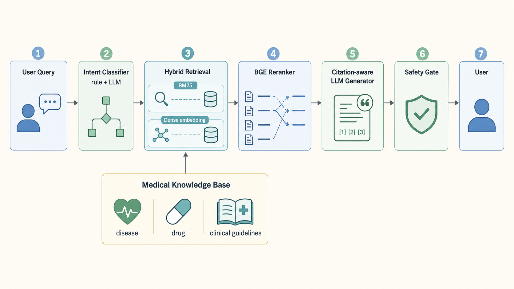

# 百度健康助手 · 医疗 RAG 多轮 Bot 面试 Q&A

> 这块面试主要考三件事：**多轮状态机怎么建**、**RAG 召回质量怎么提**、**医疗安全边界怎么守**。在这三件事里再扣细节：意图分桶、混合检索的融合公式、bge-reranker 的训练数据、引用溯源的做法、{{HITL|人机协同}}和拒答策略。



---

## 0. 一分钟项目介绍

百度健康助手是面向 C 端的医疗对话 Bot，覆盖**症状咨询、疾病科普、用药建议、报告解读、挂号导诊**等场景，**日均十万级 query**。我在里面**主导多轮状态机设计 + 参与 RAG 召回链路重构 + 医疗安全兜底体系**。

技术决策上的三个关键点：

1. **多轮状态机不是 chat loop**：按意图（症状咨询 / 疾病科普 / 药品问答 / 报告解读 / 导诊）做路由，每类意图维护独立的「症状上下文 + 已确认信息 + 待追问字段」。**多轮意图识别准确率 92%+，平均对话深度 3.5 轮**。
2. **RAG 不止是 vector search**：医学场景里术语、剂量、禁忌、并发症对召回精确度极敏感。我们用 **BM25（保术语）+ Dense（保语义）+ bge-reranker（保相关性）+ 引用溯源（保可信）** 四件套，**Top-3 命中率从 ~70% 到 88%+**。
3. **安全是召回率优先而不是准确率优先**：医疗场景宁可多拦也不能漏。我们用 **规则层（明确高危词模式）+ LLM 层（隐晦组合上下文）** 双层风控，**高风险命中召回率 98%+**，并按急症 / 处方 / 诊断三类分级处理。

工程化层面，配套有：Prompt 版本管理、千级标注的医学评测集、Badcase 回流、多模型路由、限流降级、A/B 实验、链路 trace。整体让 RAG + LLM 系统**稳定支撑 C 端高并发，主链路 SLA 99.9%+**。

> **发散 tip：**
> - 「医疗 RAG 和通用 RAG 最大的区别不在召回算法，而在**评测标准和安全边界**。可以从『召回质量』『生成质量』『安全合规』『可解释』四个维度展开聊。」
> - 「我特别想强调一点：医疗场景的 RAG 评测如果只看 Top-K 命中率，会严重低估错误代价。我们后来把指标重做成『按风险加权的召回率』。」

---

## 1. 多轮状态机：从「单轮问答」到「连续问诊」

### Q1：医疗 Bot 多轮怎么建？为什么不直接让 LLM 跑 chat loop？

**核心论点：** 医疗对话是「连续问诊」，不是「闲聊」。**状态显式化** 才能保证「该追问的字段被追问、已确认的信息不会被忘」。

**意图分桶（state machine 第一层）：**

```
用户输入 → 意图分类器（规则 + LLM）→
  ┌─ 症状咨询（symptom）→ 症状状态机
  ├─ 疾病科普（disease_qa）→ RAG-only
  ├─ 药品问答（drug_qa）→ RAG + 风控
  ├─ 报告解读（report）→ 多模态/结构化
  ├─ 导诊推荐（dept_doctor）→ 业务系统
  └─ 闲聊兜底（chitchat）→ 拒答模板
```

**症状咨询的核心 state（举例最复杂的一类）：**

```python
class SymptomContext(BaseModel):
    chief_complaint: str | None        # 主诉
    confirmed_symptoms: list[Symptom]  # 已确认症状（部位、性质、时长、伴随）
    pending_questions: list[str]       # 待追问字段
    risk_flags: list[RiskFlag]         # 触发的风险点
    candidate_conditions: list[Condition]  # 候选疾病
    suggested_actions: list[Action]    # 当前建议（继续问 / 就医 / 拒答）
    turn_count: int
    last_user_intent: str
```

**为什么不直接 chat loop？**

| 维度 | Chat loop（直接 LLM） | 显式状态机 |
|---|---|---|
| 上下文一致性 | 长会话容易遗忘前面确认的信息 | 结构化字段永远存在 |
| 可追问字段 | LLM 自己决定问什么，常漏 | 业务可控（按部位 → 性质 → 时长 → 伴随顺序） |
| 安全策略 | 高风险词检测难做 | 每轮跑一次 risk_flags 计算 |
| 评测 | 没有客观指标 | 可看「追问命中率」「确诊路径长度」 |
| 可解释 | 用户问「为啥让我去医院」答不上来 | suggested_actions 带 reason |

**状态转移逻辑（伪代码）：**

```python
def next_turn(state: SymptomContext, user_msg: str) -> Response:
    # 1. 抽取本轮新信息
    new_facts = extractor.run(user_msg, state)
    state.confirmed_symptoms = merge(state.confirmed_symptoms, new_facts.symptoms)

    # 2. 风控前置（高风险词命中 / 风险组合）
    state.risk_flags = risk_engine.check(state)
    if state.risk_flags.has_emergency:
        return SafetyResponse(action="emergency_redirect", reason=state.risk_flags)

    # 3. 看是否已经够触发候选疾病检索
    if confidence(state.confirmed_symptoms) > 0.6:
        state.candidate_conditions = condition_retriever.run(state)

    # 4. 决定本轮回应：追问 / 给答案 / HITL
    return decide_response(state)
```

> **发散 tip：**
> - 「这套 state machine 本质上是把『医生问诊路径』做成代码——主诉 → 系统性追问 → 鉴别诊断 → 处置建议。如果想偷懒只用 LLM 也能跑，但每条线都会漏。」
> - 「Anthropic 在 Building Effective Agents 里强调 prompt chaining 和 routing 这两种 workflow pattern 适用于结构化领域，医疗对话刚好是典型。」

---

### Q2：意图识别怎么做？92% 准确率怎么测？

**两层意图识别：**

1. **规则前置**：高频明确意图（「我感冒了」/「咨询药品」/「想挂号」）用关键词 + 正则命中，置信度高的直接 dispatch。
2. **LLM 分类兜底**：规则不命中的，过文心 ERNIE 做多标签分类（输出 intent_label + confidence + 备选 intent）。

**评测怎么算 92%？**

- 标注集：从线上日志按意图分布抽 5000 条 query，由 3 个医学 + 工程标注员投票，得到 gold label。
- 指标：
  - **整体准确率**：92%+
  - **按意图召回率**：症状 95%、疾病 90%、药品 93%、报告 88%、导诊 96%、闲聊 80%
  - **混淆矩阵**：症状和疾病误分类率 4%（最常见错误，因为用户描述边界模糊）

**误分类典型 case + 修复策略：**

| 用户表达 | 错分类 | 正确 | 修复 |
|---|---|---|---|
| 「头疼是什么病」 | 疾病科普 | 症状咨询 | 加规则：症状词 + 「是什么」→ 症状 |
| 「氯雷他定」（单纯药品名） | 闲聊 | 药品问答 | 命名实体识别前置 |
| 「我血压 160」 | 闲聊 | 报告解读 | 数字模式匹配 |

> **发散 tip：**
> - 「意图分类我用的是文心，不是 BERT。原因：医学 vocab 在 BERT 上需要额外预训练，文心做 zero-shot 多标签分类，prompt 一行话就能调，迭代速度快得多。Karpathy 在 Software 3.0 里说『一行 prompt 替代百行代码』，这块就是典型。」

---

## 2. RAG 链路重构：从 70% 到 88% 怎么干

### Q3：为什么要做 BM25 + Dense 混合检索？单独一种不行吗？

**核心论点：** 单一检索方法在医学场景都有结构性短板。**BM25 保术语精确，Dense 保语义泛化**，必须 hybrid。

**典型 case 对比：**

| Query | BM25 召回 | Dense 召回 | Hybrid 命中 |
|---|---|---|---|
| 「氯雷他定的禁忌症」 | ✅（药名精确） | ❌（语义模糊到「过敏药」） | ✅ |
| 「胸口闷喘不上气」 | ❌（口语化，文档里是「胸闷气短」） | ✅ | ✅ |
| 「孕妇能吃布洛芬吗」 | ✅（药名）| ✅（孕期用药） | ✅✅（双路加权） |
| 「儿童剂量怎么算」 | ❌（太泛）| 部分 | 还需要 rerank 拉精 |

**召回阶段的具体做法：**

```python
def hybrid_retrieve(query: str, kb: str, top_k: int = 50) -> list[Doc]:
    # 1. Query 改写（normalize、纠错、扩展同义词）
    q_norm = query_rewriter.run(query)

    # 2. 并行召回
    bm25_results = es_client.search(
        index=kb, body={"query": {"match": {"content": q_norm}}, "size": 80}
    )
    dense_results = faiss_client.search(
        embedding=embedder.encode(q_norm), top_k=80,
    )

    # 3. 融合：RRF
    fused = rrf_merge(bm25_results, dense_results, k=60)

    # 4. 截断 Top-50 给 rerank
    return fused[:top_k]
```

**RRF 公式 + k 取值：**

```
score(d) = Σ_i  1 / (k + rank_i(d))
```

- `k=60` 是社区共识默认值，Elasticsearch、Vespa 都用这个。
- 我们试过加权融合（`α * bm25 + (1-α) * dense`，α=0.5），但需要分数归一化，对不同 query 长度敏感；RRF 不需要分数，鲁棒性更好。

> **发散 tip：**
> - 「RRF 的好处是 rank-based，不需要 score 归一化，跨检索器异构时特别稳。Elastic 官方就推这个。」
> - 「我们试过 ColBERT-style 的 late interaction，效果好但运维复杂度（GPU / 索引大小）翻倍，性价比不够。」

---

### Q4：bge-reranker 为什么有效？怎么部署？

**核心区别（必背的一段）：**

| 模型类 | 结构 | 用途 | 复杂度 |
|---|---|---|---|
| Embedding 模型（bi-encoder） | 双塔，query 和 doc 独立编码 | 大规模召回 | O(N) 向量检索 |
| Reranker（cross-encoder） | 单塔，query+doc 拼接进 transformer | 精排小集合 | O(K) 全 transformer forward |

bge-reranker 把 query 和候选 doc 一起喂给模型，每对生成一个相关性分数。它**能看到 query-doc 之间的细粒度 token 交互**，对医学场景里「症状-病因」「药品-禁忌症」这类语义关系判断更准。

**部署 + 调优经验：**

- 模型：bge-reranker-large（中文），FP16 推理。
- 输入：Top-50 候选，每条 (query, doc_chunk)，最长 512 token。
- 部署：4 卡 T4 + Triton Inference Server，batch=32，P95 延迟 80ms。
- 调优：Top-K 从 50 砍到 20 后准确率没掉太多但延迟降一倍，最终选 K=30。

**rerank 阶段的二次约束：**

```python
def rerank_with_constraints(query: str, candidates: list[Doc]) -> list[Doc]:
    pairs = [(query, c.chunk) for c in candidates]
    scores = bge_reranker.score(pairs)

    reranked = []
    for c, s in zip(candidates, scores):
        # 业务约束加在 rerank score 上：
        # 1. 来源权威性 boost（医学百科 > 论坛 > 用户评论）
        # 2. 时间衰减（药品库新版本 > 旧版本）
        # 3. 风险关键词命中加分
        final_score = s + source_boost(c) + recency_boost(c) + risk_boost(c, query)
        reranked.append((c, final_score))
    return sorted(reranked, key=lambda x: -x[1])[:5]
```

> **发散 tip：**
> - 「bge-reranker 我们没自己 fine-tune，因为效果已经够；但如果场景特别窄（比如只做药品禁忌），fine-tune 几千条标注数据，准确率还能再上 3-5 个点。这是后续可以聊的方向。」

详细 RAG 工程见 [RAG 混合检索 + Rerank 工程实现](./notes/rag-hybrid-retrieval.md)。

---

### Q5：引用溯源具体怎么做？怎么避免「答案对但引用错」？

**核心论点：** 引用溯源不是「在答案后面附几个链接」，而是 **「答案的每个关键医学事实都必须能映射到具体的检索片段」**。

**两种方式对比：**

| 方案 | 做法 | 问题 |
|---|---|---|
| Post-hoc 引用 | 生成完答案，再用相似度匹配回 source | 容易「答案 ≠ 引用」 |
| 强制结构化引用 | 生成时就要求每个 fact 带 source_id | 准确但 token 成本高 |

**我们的做法（介于两者之间）：**

```python
class CitedAnswer(BaseModel):
    summary: str
    facts: list[Fact]

class Fact(BaseModel):
    text: str
    source_ids: list[str]   # 来自哪些 chunk
    confidence: Literal["high", "medium", "low"]
    risk: Literal["safe", "warn", "danger"]

PROMPT = """
你是医学问答助手。基于下面的检索片段回答用户问题。
每个医学事实必须标注来源 source_ids。
对证据不足的部分，必须明确说「现有资料不足以判断」。
对高风险结论必须标 risk="danger"。

[检索片段]
{passages_with_ids}

[用户问题]
{query}

请用 JSON 输出 CitedAnswer 结构。
"""
```

**校验后处理：**

```python
def validate_citations(answer: CitedAnswer, passages: dict[str, str]) -> ValidationResult:
    issues = []
    for fact in answer.facts:
        # 1. 引用 id 必须存在于检索集合
        if not all(sid in passages for sid in fact.source_ids):
            issues.append(InvalidSourceId(fact))
        # 2. fact 文本要和被引用 chunk 有词汇/语义重叠
        if not has_overlap(fact.text, [passages[sid] for sid in fact.source_ids]):
            issues.append(NoEvidence(fact))
    return ValidationResult(ok=not issues, issues=issues)
```

**没引用 / 引用错的处理：**

- 引用不合法 → 重新让 LLM 修正一次，第二次仍不合法 → 转「无法回答」模板。
- 高风险 fact 但 confidence=low → 直接转 HITL / 建议线下就医。

> **发散 tip：**
> - 「引用溯源最大的价值不是给用户看，而是给 **评测和审计** 看。我们把每条线上对话的引用合法率打成指标，每周看长尾。」
> - 「这块和 Anthropic Claude 的 citations API 思路一致——他们也是要求模型显式输出 source span，再 server 端校验。」

---

### Q6：评测集怎么建？千级标注怎么不偏？

**评测集组成（关键的「分桶 + 加权」思路）：**

| 桶 | 数量 | 来源 | 难度 |
|---|---|---|---|
| 简单 FAQ | 200 | 高频 query | 低（保底） |
| 鉴别问题 | 200 | 易混淆症状 / 药品 | 中 |
| 长尾专业 | 150 | 罕见病、特定剂量 | 高 |
| 报告解读 | 100 | 真实化验单（脱敏） | 中 |
| 高风险陷阱 | 200 | 急症 / 自杀 / 处方 / 孕妇 / 儿童 | **必拦** |
| 边界 / 拒答 | 150 | 闲聊 / 非医疗 / 法律咨询 | 必拒 |
| **合计** | **1000** | | |

**指标分层：**

- **Retrieval eval**：Recall@3 / Recall@10 / MRR / 按桶分别看。
- **Answer eval**：事实正确性（人工） / 引用合法率（自动） / 风险拦截召回率（自动）。
- **风险加权指标**：高风险拦截漏一个 = 简单 FAQ 错 100 个。Dashboard 主指标改成 **risk-weighted error rate**，而不是 simple accuracy。

**Badcase 回流闭环：**

```
线上日志 → 低置信样本（confidence < 0.5）+ 用户负反馈 + 抽样人工审核
  → 标注（3 人投票）→ 加入评测集 → 触发评测失败分析
  → 看是召回失败 / rerank 失败 / 生成失败 / 风控漏判
  → 对应修：扩 chunk / 调 rerank / 改 prompt / 加规则
  → A/B 验证 → 上线
```

> **发散 tip：**
> - 「我特别想强调风险加权——这是医疗 RAG 和通用 RAG 最大的差异。可以由这块引到『Anthropic eval framework 里的 dimension-based grading』。」
> - 「评测集每季度做一次『反向偏差检查』——人工抽 50 条看分布是否还和线上一致，如果偏离就重采样。」

---

## 3. 医疗安全：宁可错杀，不可放过

### Q7：高风险问题怎么做 98%+ 召回率？

**核心论点：** **风险拦截看召回率，不看准确率**。宁可多拦（误判可以转人工解释），不能漏（漏一个出医疗事故）。

**两层风险识别：**

```python
# 第一层：规则（高置信、低成本、不能漏）
HIGH_RISK_PATTERNS = {
    "emergency": [
        r"(胸痛|胸闷).*?(出汗|放射|压榨)",   # 心梗
        r"突然.{0,5}(头痛|麻木|失语|偏瘫)",   # 卒中
        r"自杀|想死|不想活",
        r"过量|超量|吃了.{0,5}\d+\s*[片粒颗]",
    ],
    "prescription": [r"开.{0,3}处方|代替.{0,3}医生|不去医院"],
    "pediatric": [r"宝宝|婴儿|小孩|儿童.*(剂量|多少|能吃)"],
    "pregnancy": [r"(怀孕|孕妇|早孕).*(用药|能吃|吃)"],
    "dosage": [r"\d+\s*(mg|毫克|片|粒).*(行不行|能不能|多吗)"],
}

def rule_risk_check(text: str) -> list[RiskFlag]:
    flags = []
    for category, patterns in HIGH_RISK_PATTERNS.items():
        for p in patterns:
            if re.search(p, text):
                flags.append(RiskFlag(category=category, source="rule", confidence=0.95))
    return flags
```

第二层：LLM 兜底处理「隐晦组合」和「上下文累积」：

```python
RISK_PROMPT = """
你是医疗风险识别助手。判断用户输入是否属于以下风险类别：
- emergency（急症体征）
- prescription（要求开处方）
- pediatric / pregnancy（儿童 / 孕妇用药）
- self_harm（自伤）
- dangerous_dosage（异常剂量）
注意：
1. 单一症状不一定高危，但症状组合（如『胸闷 + 冷汗 + 持续 30 分钟』）必须标 emergency。
2. 输出 JSON：{risk: [...], confidence: 0-1, reason: ...}
"""
```

**两层合并 + 分级处理：**

```python
def safety_gate(user_msg: str, ctx: SessionContext) -> SafetyDecision:
    rule_flags = rule_risk_check(user_msg)
    llm_flags = llm_risk_check(user_msg, ctx)
    flags = merge(rule_flags, llm_flags)

    if any(f.category == "emergency" for f in flags):
        return SafetyDecision(
            action="emergency_redirect",
            message="您描述的症状可能需要立即就医，建议立即拨打 120 或前往就近急诊。",
            block_rag=True,
        )
    if any(f.category in ("prescription", "dangerous_dosage") for f in flags):
        return SafetyDecision(
            action="advise_offline",
            message="此问题涉及处方药使用，建议咨询医生或药师，本助手不能替代医生判断。",
            block_rag=False,  # RAG 仍可回答科普性内容
        )
    return SafetyDecision(action="proceed")
```

**98% 召回率怎么测？**

- 评测集 200 条高风险 case（每类 30-40 条）。
- 指标：高风险拦截召回率 ≥ 98%（漏拦超过 4 条触发告警）。
- 误拦（false positive）放在次要指标，但需要可控（< 15%，否则用户体验崩）。

> **发散 tip：**
> - 「医疗 LLM 的安全策略和通用安全不一样：通用 LLM 怕『说脏话』，医疗 LLM 怕『说错诊断 + 给错剂量』。所以我们的拦截策略偏向 medical content safety 而不是 toxic language safety。」
> - 「我看过 Anthropic 的 constitutional AI 思路——他们的拒答是模型自洽，我们这块更像 OpenAI 的 moderation API + 业务规则叠加。」

---

### Q8：医疗幻觉怎么降？

**核心论点：** 幻觉是召回、生成、风控、评测四层叠出来的结果，**降幻觉就是降每一层的失败率**。

| 层 | 主要做法 |
|---|---|
| 召回 | 知识源权威 + chunk 粒度合适 + 混合检索 + 垂直库路由 |
| 生成 | 强制引用溯源 + 「证据不足时不回答」+ 关键事实结构化输出 |
| 风控 | 双层风险识别 + 急症 / 处方 / 剂量分级拒答 |
| 评测 | 高风险样本独立桶 + Badcase 回流 + 人工抽审 |

**生成层「证据不足时不回答」的具体做法：**

```python
PROMPT_HEAD = """
回答规则（必须遵守）：
1. 只用「检索片段」里的信息，不能凭模型先验回答。
2. 检索片段不足以回答时，必须说「目前资料不足，建议线下就医」。
3. 关键医学事实必须标注 source_ids。
4. 不能给出剂量、不能给出处方建议、不能给出诊断结论。
"""
```

**幻觉检测线上策略：**

- 答案生成后，再过一次「事实校验 LLM-as-judge」抽样 5%，判断答案中所有 medical claim 是否被引用片段支持。
- 不支持的 claim → 降级为「补充信息」或重新生成。

> **发散 tip：**
> - 「Anthropic 在 demystifying evals 里强调 LLM-as-judge 必须定期人工校准，否则 judge 模型自己也会 drift。我们每月抽 50 条 judge 结果人工复核。」

---

## 4. 工程化：怎么撑住日均 10 万级 query

### Q9：日均十万级 query，怎么保 SLA？

**关键工程化点：**

1. **多模型路由 + Fallback**：文心 ERNIE 主、内部小模型兜底（intent / safety 用小模型省钱）。
2. **缓存**：
   - **Embedding 缓存**：相同 query 的 embedding 30 天 Redis 缓存。
   - **检索结果缓存**：相同 (query_hash, kb_version) 的 Top-K 30 分钟缓存。
   - **不缓存**：最终生成结果（会话上下文相关），但缓存「FAQ 模板答案」。
3. **限流降级**：
   - 用户级 QPS 限流（防滥用 / 爬虫）。
   - 总 LLM 调用预算超阈值时，自动把「闲聊」「重复 query」打到模板答案。
4. **超时降级**：
   - LLM 5s 超时 → fallback 模型。
   - Fallback 也超时 → 模板回复 + trace 标记。
5. **Trace + A/B**：
   - 每条 query 一个 trace_id，落 ES + Hadoop。
   - A/B 框架按 user_id 分桶，灰度策略变更不影响主流量。

**P95 延迟分解：**

```
总延迟 P95: 2.2s
├─ Intent classification: 80ms (规则) / 200ms (LLM)
├─ Hybrid retrieve:       180ms (BM25 + Faiss 并行)
├─ Reranker:              80ms (batched)
├─ LLM generation:        1.6s (含 streaming)
└─ Safety post-check:     60ms (抽样)
```

> **发散 tip：**
> - 「这套架构里特别值得聊的是缓存层级：从 embedding cache → retrieval cache → template cache 一层层往上，命中率分别是 30% / 12% / 5%，合并节省 LLM 调用约 40%。」

---

### Q10：怎么做 Prompt 版本管理？

**关键三件套：**

1. **Prompt 用代码管理（不是数据库）**：每个 prompt 是 `.j2` 模板文件，进 git。
2. **版本号 + Diff 评测**：每次改 prompt，CI 跑评测集对比新旧版本通过率。
3. **A/B 灰度**：新 prompt 先 5% 流量，看 trace + 评测指标，OK 再放量。

```python
# Prompt 注册
@register_prompt(name="diagnose.symptom_followup", version="v3.2.1")
def build_followup_prompt(state: SymptomContext) -> str:
    return env.get_template("symptom_followup.j2").render(state=state)

# Trace 里带 prompt_version，事后能精确回放
```

> **发散 tip：**
> - 「Prompt 版本化是 LLM 工程独有的事情，类似 sklearn model registry。我们后来引入 Langfuse 做 prompt management，效果更好。」

---

## 5. 行为面 & 反向引导

### Q11：你在这个项目里最大的收获是什么？

**模板回答：**

我最大的收获是想明白了一件事：**RAG 不是「向量检索 + 大模型生成」这么简单。RAG 是一条「数据 - 召回 - 重排 - 生成 - 风控 - 评测」的完整链路，链路上每一环都可能成为质量瓶颈。**

更深一层：医疗这种高风险领域 RAG 和通用 RAG 的差异不在算法，而在 **评测指标和安全边界**。Top-K 命中率高不代表系统可用——一个把「胸闷可能是心脏问题」漏拦的 90% 系统，比把所有问题都拒答的 50% 系统更危险。

这件事让我后来做 ArtArch.AI 时也很自然地把「评测优先」「风控独立」当成工程化默认，不是事后补的。

---

### Q12：踩过什么坑？

**三个真坑：**

1. **chunk 粒度选错**：早期按段落切，1 段 600 字。结果用户问「布洛芬禁忌症」，召回里禁忌症常被拆到下一段。后来按「语义边界 + 滑动窗口 100 字 overlap」重切，召回率涨了 6 个点。
2. **Embedding 模型升级踩 schema**：m3e 升级到 bge-large-zh，维度从 768 → 1024，没做版本兼容，线上一段时间 retrieval 命中率掉到 30%。教训：embedding 版本必须和索引版本绑定。
3. **风险规则误伤老人用户**：早期把「头疼 + 时间长」标 emergency，导致大量老人慢病头痛被误拦到急诊建议。后来把规则改成「头疼 + 急性发作 + 伴随症状」组合命中，误伤率下来 80%。

---

### Q13：反问？

- 当前医疗 / 健康业务的 RAG 主要瓶颈是召回质量、生成幻觉、风控漏判，还是评测体系？
- 是否有「按风险加权的评测指标」？还是按 accuracy 看？
- 多轮上下文是否独立成体系？还是塞 prompt？
- Prompt 是工程师维护还是医学专家维护？
- 高风险拦截后的人工通道是否打通？谁负责复核？

---

## 6. 反向引导地图

| 听到这种问 | 引到 |
|---|---|
| 「你们 RAG 怎么做的？」 | 「主要从混合检索 + rerank + 引用溯源 + 评测闭环四块讲」→ 任选一条展开 |
| 「医疗场景特殊在哪？」 | 「评测标准和安全边界，不在算法」→ 风险加权 |
| 「你测过哪些 embedding？」 | bge-large-zh / m3e / OpenAI ada 实测对比 |
| 「LLM 怎么不胡说？」 | 「四层：召回 / 生成 / 风控 / 评测」→ 任选一层 |
| 「多轮怎么管？」 | 「显式状态机 + 风控前置」→ Q1 那段 |
| 「日均 10 万 query 怎么撑？」 | 三级缓存 + 多模型路由 + Fallback |

---

## 7. 参考资料

- [LangChain - Context Engineering for Agents](https://www.langchain.com/blog/context-engineering-for-agents)
- [Anthropic - Demystifying Evals](https://www.anthropic.com/engineering/demystifying-evals-for-ai-agents)
- [Anthropic - Citations API](https://docs.anthropic.com/en/docs/build-with-claude/citations)
- [BGE Reranker 模型](https://bge-model.com/bge/bge_reranker.html)
- [Elasticsearch - Reciprocal Rank Fusion (RRF)](https://www.elastic.co/guide/en/elasticsearch/reference/current/rrf.html)
- [Karpathy - Software 3.0](https://www.latent.space/p/s3)
- [Lilian Weng - LLM Powered Autonomous Agents](https://lilianweng.github.io/posts/2023-06-23-agent/)
- [RAG 原论文 (NeurIPS 2020)](https://papers.nips.cc/paper/2020/hash/6b493230205f780e1bc26945df7481e5-Abstract.html)
