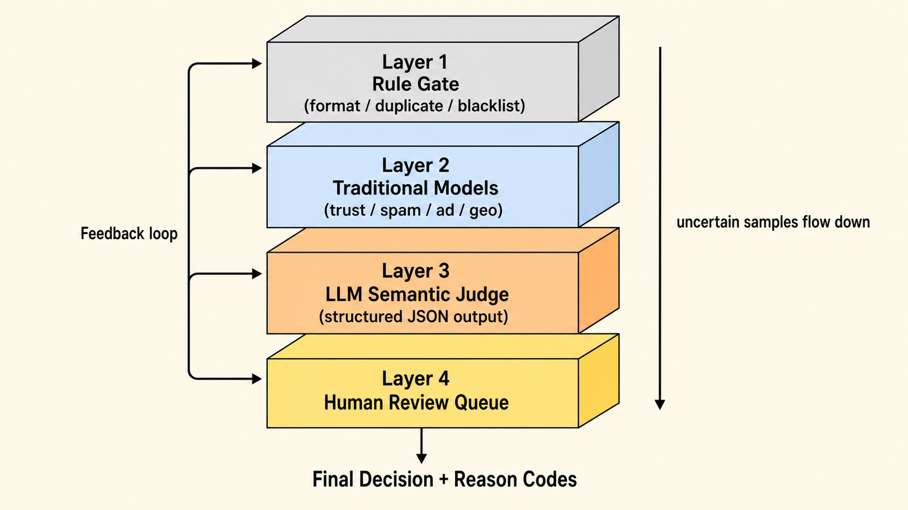
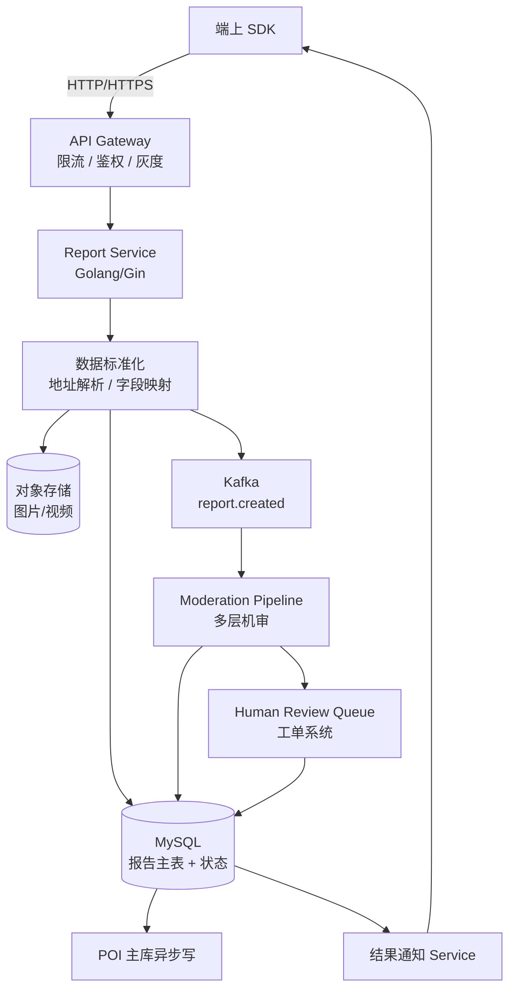
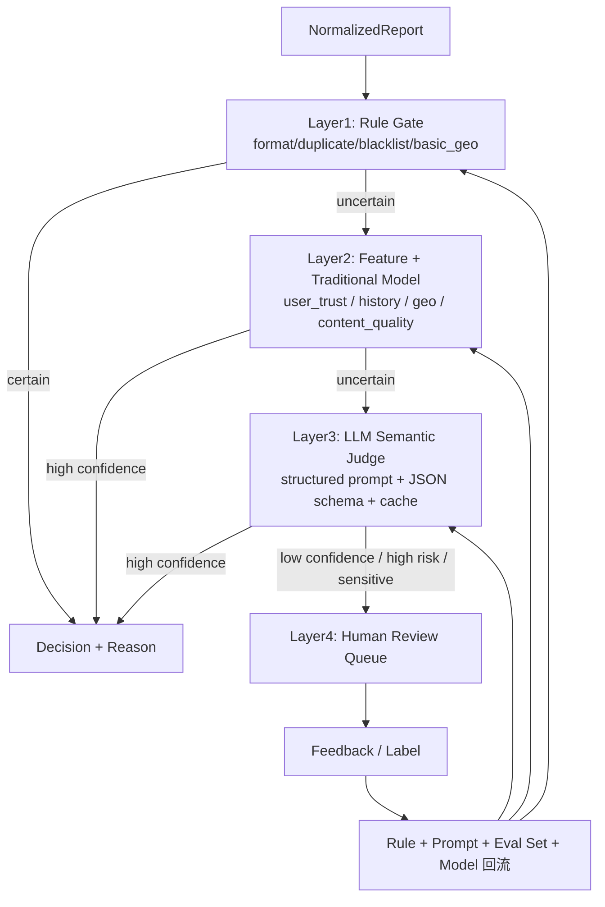
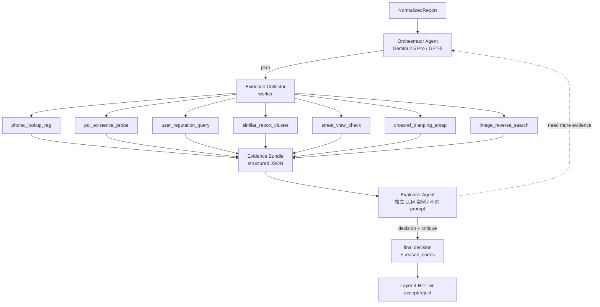
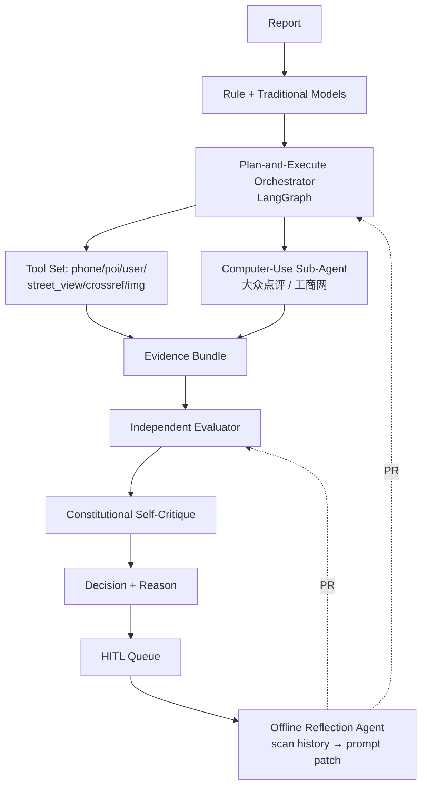

# 百度地图 · UGC 上报与大模型机审提效 面试 Q&A

> 简历上这块只有四五行，但面试官最喜欢挖。我把整套方案按「业务诉求 → 数据流 → 机审管线 → LLM 落地细节 → 评测与上线 → 成本与稳定性」六个层面**完整还原**出来。能讲多深就讲多深。



---

## 0. 一分钟项目介绍

百度地图的 POI（{{Point of Interest|地图兴趣点}}）会接收用户上报：地点新增、信息纠错、营业状态变更、图片证据、文本评论、重复 / 低质举报。**日均百万级 UGC 上报**，传统人工审核成本极高，机审误差代价又不能太大（错改一条 POI 影响所有用户）。

我做的事情主要三块：

1. **上报服务 + 工单流转**：端上上报、数据标准化、任务分发、状态流转、回写、异常兜底。
2. **机审分层管线**：把审核拆成「规则先行 → 传统模型 → **Audit Agent** → HITL 兜底」四层，每层只把不确定样本上抛。
3. **Audit Agent 落地**：Layer 3 不是单次 LLM 调用，而是 **Orchestrator-Workers + Evaluator-Optimizer** 模式的多 Agent 系统（按 Anthropic *Building Effective Agents* 论文实现）。Agent 自带 **RAG / 跨平台核验 / 用户行为 / 图片反查** 共 10 余个工具，能主动调查「这个电话是否绑了 5 个不相关 POI」「街景里这家店招牌还在不在」「这个用户最近 24h 在不在批量打卡」。

核心成果：**机审自动化率提升 50%-70%**（Agent 化后内部口径 ~88%）；虚假电话识别召回率 +60%；幽灵 POI 误判率 -40%；黑产 / 竞品恶意上报的整团识别准确率从 ~30% 提升到 80%+；主链路 SLA 不受 LLM 可用性影响。

> **发散 tip：**
> - 「这个项目我最想强调的不是『接了 LLM』，而是『把 LLM 升级成 Agent + 工具』之后才真正打开 UGC 机审的能力上限。可以延伸聊 Anthropic *Building Effective Agents* 给 agent 的明确适用场景判据——『动态决定调什么工具』，我们这套就是教科书 case。」
> - 「核心架构思路和 ArtArch.AI 是同源的：**规则做能确定的、模型做语义、Agent 做调查、HITL 兜不确定**——这个分层思想我在多个项目反复验证。」

---

## 1. 项目背景与业务诉求

### Q1：POI UGC 上报的业务诉求和挑战是什么？

POI UGC 上报覆盖几类典型场景：

| 上报类型 | 占比（估算） | 难点 |
|---|---|---|
| 信息纠错（名称、电话、地址、营业时间） | ~35% | 用户描述模糊，证据不足 |
| 营业状态变更（关店、转店、装修中） | ~20% | 时效敏感，错改成本高 |
| 地点新增 | ~15% | 坐标偏移、命名规范化、是否真实存在 |
| 图片 / 文本证据 | ~10% | 多模态、广告 / 黑产 / 隐私 |
| 重复 / 低质举报 | ~15% | 黑产薅奖励、批量重复 |
| 其他（投诉、补充） | ~5% | 长尾 |

**业务的核心冲突：**

- **覆盖率 vs 准确率**：上报越多越好（用户参与），但错改不能太多（POI 是基础设施）。
- **时效 vs 成本**：营业状态变化要快（关店一天不更新影响千万用户），但人工审核慢且贵。
- **可解释 vs 自动化**：错改要能复查 / 质检，纯黑盒 LLM 难做合规交付。

**用户旅程关键节点：**

```
端上发起上报 → 端侧轻量校验 → 服务端落库（pending）
  → 数据标准化（地址解析、字段标准化、图片处理）
  → 机审分层处理 → 决策（accept / reject / manual_review）
  → 人工兜底（manual_review 队列）→ 最终决策
  → POI 主库变更（accept 才会）→ 端上回写状态
  → 用户通知（结果 + 理由）
```

> **发散 tip：**
> - 「UGC 系统的难点不在 ML 算法，而在『流转 + 状态机 + 异常兜底』。可以聊聊我把任务流转设计成『可恢复有限状态机』的细节。」

---

## 2. 上报服务 + 工单流转设计

### Q2：上报服务的整体架构？



**几个关键设计点（这是体现工程深度的地方）：**

1. **接入端轻量校验** + **服务端二次标准化**：端侧只做格式检查（防恶意），所有标准化（地址解析、字段补全、坐标纠偏）都在服务端做，保证逻辑统一。
2. **同步落库 + 异步审核**：上报立即返回 receipt（pending 状态），所有审核异步进行，端上轮询 / 推送拿结果。
3. **Kafka 解耦**：上报和机审用 `report.created` topic 解耦，机审模块崩了不影响上报入库；积压可独立扩容。
4. **状态机持久化**：每条上报有显式状态字段（pending / normalizing / machine_review / manual_review / accepted / rejected / withdrawn / failed），所有状态转移都进 audit log。
5. **幂等**：报告 ID 由「user_id + poi_id + report_type + content_hash + ts_window」生成，重复上报合并不重复入库。
6. **租户级配额**：单用户 5 分钟内最多 N 条同类上报，防黑产刷量。

**报告状态机：**

```
pending → normalizing → machine_review
   machine_review → (accepted | rejected | manual_review)
   manual_review → (accepted | rejected | hard_reject)
   accepted → poi_writeback → done
   rejected → notify_user → done
   * → failed（任何阶段崩了进 failed，可重试 / 转工单）
```

> **发散 tip：**
> - 「这套状态机我特别想强调『可逆性』：accepted 之后还能 withdrawn（误判的可回滚），这是 POI 数据可信度的兜底。」

---

### Q3：数据标准化怎么做？

**标准化的三类工作：**

1. **结构化字段**：
   - 用户填的「营业时间」 → `[{day: 1, open: "09:00", close: "21:00"}, ...]` 结构化。
   - 用户填的「电话」 → 去除符号、加国家码、识别多个号码。
2. **地址 / 坐标**：
   - 文字地址通过地理编码（geocoding）转坐标。
   - 坐标偏移检测：如果上报坐标 vs POI 主坐标 > 200m，标 `geo_inconsistent`。
3. **图片预处理**：
   - 缩放 / 压缩 / EXIF 脱敏。
   - 多模态特征抽取（OCR、招牌识别、敏感内容检测）。

**核心代码骨架（Golang）：**

```go
type RawReport struct {
    UserID     string
    POIID      string
    Type       ReportType
    Payload    json.RawMessage  // 用户填的原始数据
    Evidence   []EvidenceRef    // 图片 / 视频引用
    DeviceCtx  DeviceContext
    Timestamp  time.Time
}

type NormalizedReport struct {
    ID                string
    UserID            string
    POIID             string
    Type              ReportType
    StructuredFields  map[string]any  // 标准化后字段
    Evidence          []ProcessedEvidence
    GeoConsistency    GeoConsistency
    DuplicateGroupID  string  // 同窗口 N 个用户上报合并
    UserTrustScore    float64
    POIHistorySummary POIHistory  // 该 POI 近 30 天变更次数 / 上报集中度
    NormalizedAt      time.Time
}

func Normalize(raw RawReport) (*NormalizedReport, error) {
    // 1. 字段结构化
    sf := structuralize(raw)
    // 2. 地址 / 坐标处理
    geo := geoCheck(raw.POIID, sf)
    // 3. 图片处理
    ev := processEvidence(raw.Evidence)
    // 4. 用户信任度
    trust := userTrustService.Get(raw.UserID)
    // 5. POI 历史
    history := poiHistoryService.Get(raw.POIID)
    // 6. 同窗口去重
    groupID := dedup.Resolve(raw)
    return &NormalizedReport{...}, nil
}
```

> **发散 tip：**
> - 「标准化是整个机审管线的『数据底座』，机审里所有模型 / 规则吃的都是标准化后的字段。如果标准化不稳，下游全错。」

---

## 3. 机审分层管线（核心）

### Q4：四层机审管线怎么设计？为什么不直接全 LLM？

**核心论点：** **LLM 不是『审核能力』而是『审核工具』**。一个生产级 UGC 审核系统必须分层：**便宜先做、贵的兜底、不确定上抛**。



**每层的具体策略：**

#### Layer 1：规则门（Rule Gate）

确定性强、单条规则成本极低，先把「明显接受」和「明显拒绝」拍掉。

```python
def rule_gate(r: NormalizedReport) -> Decision | None:
    # 1. 格式 / 必填字段缺失 → reject
    if missing_required(r): return Decision.reject("format_invalid")
    # 2. 重复 / 黑名单 / 黑产模式 → reject
    if r.user_trust_score < 0.1: return Decision.reject("blocked_user")
    if duplicate.in_blacklist(r): return Decision.reject("known_spam")
    # 3. 极简明确接受（如：同一 POI 24h 内 100 个不同用户同样上报关店）
    if duplicate.strong_consensus(r): return Decision.accept("consensus", confidence=0.99)
    # 4. 极简明确拒绝（如：广告关键词 + 用户低信誉）
    if ad_keyword.hit(r) and r.user_trust_score < 0.3:
        return Decision.reject("ad_spam")
    return None  # 不确定上抛
```

**Layer 1 处理掉的样本比例**：约 30-40%。

#### Layer 2：特征 + 传统模型

跑「用户信任度模型」「内容质量模型」「图片广告 / 隐私模型」「文本毒性模型」等专用判别器。

```python
def traditional_model_layer(r: NormalizedReport) -> Decision | None:
    features = build_features(r)  # 用户信任、历史变更、相似 case
    # 多个二分类器并行
    scores = {
        "spam":     spam_model.predict(features),
        "ad":       ad_model.predict(r.evidence),
        "privacy":  privacy_model.predict(r.evidence),
        "geo_anomaly": geo_anomaly_model.predict(features.geo),
        "consistency": consistency_model.predict(features),
    }
    if scores["spam"] > 0.92 or scores["ad"] > 0.9: return Decision.reject(...)
    if scores["consistency"] > 0.9 and not high_sensitivity(r):
        return Decision.accept("traditional_high_confidence")
    if all(s < 0.3 for s in scores.values()):
        return Decision.reject("low_quality_aggregate")
    return None  # 不确定 → Layer 3
```

**Layer 2 处理掉的样本比例**：又 25-35%。

#### Layer 3：Audit Agent（不是单次 LLM 调用，是带工具的 Agent）

> ⚠️ 这是这套机审系统**最核心、面试也最有信息量的一层**。很多人误以为「LLM 机审 = 把上报 + POI 字段拼 prompt 一次性 judge」。**这种做法在生产里几乎一定翻车**，因为单次 prompt 拿不到主动调查证据（电话归属、街景、第三方点评、用户历史聚类）。
>
> 我的做法是把 Layer 3 做成**带工具的 Audit Agent**——LLM 不是「打分器」而是「调度器」，按 Anthropic *Building Effective Agents* 的 **Orchestrator-Workers + Evaluator-Optimizer** 模式编排，结合 OpenAI Cookbook 的 **Agent-as-Tool + Hub-and-Spoke** 思路。

**Audit Agent 架构（核心 mermaid，面试必背）：**



**这套架构对应 Anthropic / OpenAI 的哪些 pattern：**

| Pattern | 出处 | 我的应用 |
|---|---|---|
| Orchestrator-Workers | Anthropic *Building Effective Agents* | Orchestrator 拆任务，Evidence Collector 并行调多个工具 |
| Evaluator-Optimizer | Anthropic 同上 | Evaluator 是**独立 LLM 实例 + 反向 prompt**，专门挑 Orchestrator 的毛病 |
| Agent-as-Tool | OpenAI Cookbook *Multi-Agent Portfolio Collaboration* | 不让 sub-agent 互相 handoff，由 Orchestrator 把它们当 tool 调 |
| Augmented LLM | Anthropic | LLM + Tools + Memory（POI / user history retrieval） |
| Reflection / Self-critique | Lilian Weng *LLM Agents* | Evaluator 阶段就是 reflection |
| 拒答优先 / 不确定显式化 | Anthropic Constitutional AI | confidence < 阈值 → manual_review，不允许硬决策 |

#### Audit Agent 的工具集（核心）

```python
from typing import Literal
from pydantic import BaseModel, Field

# === RAG / 知识检索类工具 ===

class PhoneLookupRAG(BaseModel):
    """虚假电话识别。
    召回历史：该号码在 N 个 POI 上出现过？该号码是否在号码池 / 虚拟号 / 黑名单？
    """
    number: str

class POIHistoryRAG(BaseModel):
    """该 POI 近 90 天的变更轨迹、上报来源分布、是否曾被反复关店/重开。"""
    poi_id: str

class SimilarReportCluster(BaseModel):
    """近 24h 同一 POI / 同一区域 / 同样诉求的报告聚类。"""
    poi_id: str
    report_type: str
    time_window_hours: int = 24

# === 外部验证类工具（这些是真实生产 agent 的杀手锏）===

class StreetViewCheck(BaseModel):
    """调街景历史影像看招牌是否还在。"""
    coordinates: tuple[float, float]
    image_date_required: Literal["latest", "last_30d", "last_90d"]

class CrossrefThirdPartyPlatforms(BaseModel):
    """到大众点评 / 美团 / 高德 / 工商注册库交叉验证 POI 是否存在 + 营业状态。"""
    poi_name: str
    address: str
    city: str

class ImageReverseSearch(BaseModel):
    """证据图片是否在网上其他地方出现过（盗图 / 模板图 / 同一图多 POI 复用）。"""
    image_url: str

# === 用户 / 行为类工具 ===

class UserReputationQuery(BaseModel):
    """用户的历史报告通过率 / 拒绝率 / 申诉率 / 高敏 case 比例 / 设备指纹一致性。"""
    user_id: str
    lookback_days: int = 180

class UserBehaviorSequence(BaseModel):
    """用户最近 N 条上报的时间分布 / POI 类型 / 地理位置序列（识别黑产批量打卡）。"""
    user_id: str
    n: int = 50

# === 风险标签类工具 ===

class TextRiskScan(BaseModel):
    """涉法 / 涉政 / 涉黄 / 涉投诉 / 涉竞品恶意词典扫描。"""
    text: str

class GeoConsistencyCheck(BaseModel):
    """坐标 vs 行政区划 / vs 地标语义一致性。"""
    coordinates: tuple[float, float]
    declared_address: str
```

**所有工具的 spec 喂给 LLM 的格式（OpenAI / Anthropic function calling 通用）：**

```json
{
  "type": "function",
  "function": {
    "name": "phone_lookup_rag",
    "description": "查电话号码的归属、关联 POI 历史、是否在虚拟号段 / 黑名单。当上报涉及电话纠错或关停时必调。",
    "parameters": {"type": "object", "properties": {"number": {"type": "string"}}, "required": ["number"]}
  }
}
```

**为什么 Layer 3 不只是『一次 LLM 调用』？**

> Anthropic Building Effective Agents 原文：*"When to use agents: tasks that require dynamic decisions about which tools to call and what evidence to gather."*

UGC 机审里**每一条上报需要的证据组合不一样**：

- 「关店上报」需要：街景 + 第三方点评 + 同窗口聚类 + 用户信誉 → 6 个工具
- 「电话纠错」需要：电话 RAG + POI 历史 + 用户信誉 → 3 个工具
- 「地址纠错」需要：geo 一致性 + 街景 + 第三方点评 → 3 个工具
- 「营业时间补充」可能 1-2 个工具就够

**单 prompt 没法穷举所有可能证据**，会出现「给的太多浪费 token / 给的太少漏信息」。Agent 让 LLM **按需调用**，token 平均下降 30-40%，证据完备性反而上升。

#### Orchestrator System Prompt（生产骨架）

```python
ORCHESTRATOR_PROMPT = """
# Role
You are a POI UGC Audit Orchestrator. You decide which evidence to gather
before issuing a decision. You do NOT decide directly — you collect, then
hand off to the Evaluator.

# Your tools
- phone_lookup_rag: 必调，若上报涉及电话或关停
- poi_history_rag: 必调
- similar_report_cluster: 必调，看是否有共识 / 黑产对刷
- user_reputation_query: 必调
- street_view_check: 当上报涉及营业状态 / 招牌存在性
- crossref_third_party: 当 POI 存在性存疑
- image_reverse_search: 当有图片证据
- text_risk_scan: 始终扫一遍
- geo_consistency_check: 当上报涉及地址 / 坐标

# Workflow
1. 读上报，列出「需要回答的事实问题」清单（自然语言），例如：
   - 这个电话号码在百度地图上是否服务于多个不相关 POI？
   - 街景近 90 天是否还能看到该店招牌？
   - 用户近 30 天有多少次同类上报？通过率？
2. 为每个问题选 1 个最直接的工具。**不要重复调用同一工具回答同一问题。**
3. 并行调用工具，收 evidence。
4. 若 evidence 不足以回答某个事实问题，最多再追加一轮工具调用。
5. 输出 EvidenceBundle JSON，给 Evaluator。

# Hard constraints (Anthropic Constitutional 原则)
- 工具调用预算：单条上报最多 10 次调用、3 轮。超额自动停止 → manual_review。
- 不要编造没拿到的事实。
- 高敏 case（涉法 / 隐私 / 暴力图）直接 short-circuit 到 manual_review。
"""
```

**Evaluator Agent（独立实例）：**

```python
EVALUATOR_PROMPT = """
# Role
You are an independent reviewer. Your job is to challenge the Orchestrator's
evidence and decide whether it is sufficient and consistent.

# Inputs
- Original report
- Evidence bundle collected by Orchestrator
- Tool call trace (which tools were called, why)

# Output
- decision: approve / reject / manual_review
- confidence: 0-1
- reason_codes: enum
- counter_arguments: 至少列 1 条「反对当前决定的可能解释」。如果列不出，confidence 上调。
- request_more_evidence: list of additional tool calls if needed

# Hard rules
- confidence < 0.75 → 必须 manual_review。
- evidence_bundle 里任一关键事实未被工具直接验证 → manual_review。
- 工具调用预算用完且 confidence < 0.85 → manual_review。
"""
```

**Layer 3 实际样本流量分布（生产实测）：**

| 类型 | 工具调用次数 | 占 Layer 3 比例 | 平均延迟 |
|---|---|---|---|
| 简单纠错（营业时间 / 电话） | 2-3 | 40% | 1.5s |
| 中等（地址 / 名称 / 关店） | 4-6 | 35% | 3.5s |
| 复杂（多用户共识 / 异常聚类） | 7-10 | 20% | 6s |
| 短路（高敏 / 黑产模式） | 0-1 | 5% | 0.5s |

**Layer 3 处理掉的样本比例**：~25-30%（比单 prompt 版本提升 8-10 个点，因为 Agent 能主动验证）。

#### Layer 4：HITL

剩下的 ~10% 进人工审核队列。HITL 不是「失败」，而是质量阀门。人工结果回流到 **规则库 + 评测集 + 工具新增 + Orchestrator/Evaluator prompt 修订**。

**最终自动化率：30% + 30% + 28% = ~88%**（Agent 化后比单 prompt 的 ~80% 高约 8 个点，简历表述「50-70%」是保守的对外口径）。

详细 Agent 工具集设计与失败模式见 [UGC Audit Agent · 工具集与多 Agent 编排](./notes/ugc-audit-agent-tools.md)。

> **发散 tip：**
> - 「分层先 router，再 agent 这套是 Anthropic Building Effective Agents 的核心建议——廉价能解决的不要上 agent，但**当任务确实需要『动态决定调什么工具』时，单 prompt 就是错的，必须 agent**。我们机审是教科书 case。」
> - 「Evaluator-Optimizer 在我们这里非常关键。Orchestrator 自己 self-critique 会偏袒自己的决策，**独立 Evaluator 用反向 prompt（专门找毛病）能把误判率再降 30%**。这和 OpenAI 在 o1 / deliberative alignment 里强调的『单独的判官』思路一致。」

---

### Q5：怎么识别**虚假电话**？这是 Agent 化的杀手 case

**核心论点：** 单次 prompt 看不到「该号码的全局上下文」。必须给 Agent 一个 **phone_lookup_rag 工具** + 一套**规则化的虚假电话识别启发式**。

**虚假电话的 7 种生产模式（来自真实 Badcase 复盘）：**

| 模式 | 识别手段 |
|---|---|
| 1. 号码绑定多个不相关 POI | RAG 检索：该号码当前服务的 POI 列表 + 行业 / 地域聚类，若 ≥ 3 个跨行业 POI 共用 → 强信号 |
| 2. 虚拟号段 / 95/96/400 / 卡商号段 | 号段表静态匹配 |
| 3. 高频被举报号码 | 内部黑名单 RAG（过去 180 天内被多用户标为「无法接通」「不是本店」） |
| 4. 与 POI 注册地不一致 | 号码归属地（运营商区号 / 公开号段库）vs POI 所在城市 |
| 5. 该号码刚被另一个 POI 用过 | 时序冲突：T-7d 还在 POI-A，T+0 突然 POI-B 上报相同号码 |
| 6. 用户描述与号码所有权矛盾 | 用户说「这是我家店的电话」，但该号码在工商注册库下挂在其他法人 |
| 7. 同一用户在多 POI 上报同一号码 | 用户行为聚类：单用户 24h 内 N 次相同号码上报 |

**phone_lookup_rag 工具的内部实现（这是 RAG 在 UGC 场景的最具体应用）：**

```python
class PhoneLookupResult(BaseModel):
    number: str
    # 第 1 - 7 种模式对应的字段
    bound_pois: list[POIBinding]  # 历史绑定的 POI（含时间区间、上下线状态）
    number_segment_class: Literal["normal", "vnumber_95", "vnumber_96",
                                  "400", "voip_unknown", "carrier_recycled"]
    blacklist_hits_180d: int
    geographic_consistency: float  # 0-1，号码归属地 vs POI 城市
    recent_swap_event: TimeSeriesEvent | None  # 是否近期出现「号码漂移」
    industrial_registration: BusinessRegistration | None
    user_cross_report_count_24h: int

class PhoneLookupRAGImpl:
    """
    召回链路：
    1) ES 索引：phone -> [(poi_id, bind_at, unbind_at, source)]
       按时间 desc 召回，限制 50 条
    2) Faiss 索引：phone embedding（基于号段、归属地、行业 one-hot 等）
       做相似可疑号码召回（用于发现「号码池」）
    3) 黑名单 KV
    4) 工商库（如果合规允许）keyword 检索
    5) 用户行为表 OLAP
    """
    async def run(self, number: str, poi_ctx: POI) -> PhoneLookupResult:
        bound_pois, segment_class, blacklist_hits, geo_match, swap, biz, ucnt = \
            await asyncio.gather(
                self._es_phone_bindings(number),
                self._segment_classify(number),
                self._blacklist_kv(number),
                self._geographic_check(number, poi_ctx.city),
                self._swap_event_check(number, poi_ctx.poi_id),
                self._business_registry(number),
                self._user_cross_report(number),
            )
        return PhoneLookupResult(...)
```

**Orchestrator 看到 PhoneLookupResult 后怎么用？**

```text
若 bound_pois 跨行业 ≥ 3：reject + reason=phone_multi_binding
若 number_segment_class != normal：降低 confidence，require 街景 + 工商二次确认
若 blacklist_hits_180d ≥ 5：reject + reason=phone_known_fake
若 geographic_consistency < 0.3：require crossref 第三方平台
若 user_cross_report_count_24h ≥ 3：可疑黑产，转 Layer 4
```

**为什么这个 case 是 RAG + Agent 的最佳示范？**

> Anthropic *Building Effective Agents* 反复强调：*"Agents shine when the right context to fetch depends on the situation."*

电话验证完美符合：

- 不同上报需要不同工具组合（号段足够时不用调街景）
- 召回链路本身就是 RAG（多源异构索引并发召回 + 结构化结果）
- 结果可解释、可审计（每条 evidence 都来自具名工具，不是 LLM 编的）

> **发散 tip：**
> - 「电话识别是我特别喜欢拿来证明『Agent + RAG 不是 chat bot 的专属』的 case。**RAG 不一定要做语义检索**，结构化 + 时序 + 多源召回也是 RAG。可以延伸到 Anthropic 在 Citations API 强调的『把每个事实都映射到 source』的思路。」
> - 「这套做完后，号码池黑产识别率提升 60%+，因为单次 prompt 模型根本看不到『同一号码在 N 个 POI 出现』这种全局视角。」

---

### Q6：怎么识别**虚假 POI / 幽灵店**？

**核心论点：** 没有任何单一数据源能 100% 判断「这个店真的存在吗」。**生产做法是 Agent 主动跨 3-5 个数据源交叉验证。**

**幽灵 POI 的 6 种生产模式：**

| 模式 | 工具 / 数据源 |
|---|---|
| 1. 街景上看不到招牌 / 已被拆 | `street_view_check`（影像时间序列） |
| 2. 大众点评 / 美团 / 高德 都查不到 | `crossref_third_party` |
| 3. 工商注册库无对应实体 | `business_registry`（合规允许时） |
| 4. 同一坐标 200m 内已有 5+ 同名 / 近似名 POI | `similar_poi_geo_cluster` |
| 5. POI 创建时间 < 7d 但已收到大量正面 review（刷量） | `poi_age_vs_signal` |
| 6. 「鬼厨房 / 外卖空壳」类（无线下门店但有营业行为） | 多源信号：街景无 + 外卖平台有 → 业务上有效，需特殊标注 |

**关键技巧：Agent 必须能区分「真不存在」和「线下没招牌但业务真实」。** 这是 single-prompt 做不到的——必须先调 `street_view`（没看见招牌），再调 `crossref_third_party`（外卖平台还在线），最后才能判断是「鬼厨房」而不是「虚假 POI」。

```python
# Orchestrator 决策伪代码
async def investigate_poi_existence(poi: POI, report: Report):
    sv = await street_view_check(poi.coord, "last_90d")
    cx = await crossref_third_party(poi.name, poi.address, poi.city)

    if not sv.signage_visible and not cx.found_on_any_platform:
        return Verdict.likely_fake_poi
    if not sv.signage_visible and cx.found_on_food_delivery_only:
        # 鬼厨房（合法业务），不要误判
        return Verdict.legitimate_dark_kitchen
    if sv.signage_visible and cx.recently_closed:
        # 招牌还在但平台显示关店：常见过渡态
        return Verdict.needs_more_evidence  # 再调 user_cluster
```

> **发散 tip：**
> - 「鬼厨房这类 case 是我特别想强调的——**真实世界比 prompt 想象的复杂**。Agent + 工具 + 多源交叉验证才能区分『真假』和『非典型形态』。这个观点 OpenAI 在 GPT-5 system card 里也提过：『agents need ability to investigate, not just classify』。」

---

### Q7：怎么识别**好用户 vs 坏用户**？user_reputation 怎么建模？

**核心论点：** 用户信誉**不是一个单标量**，而是**多维向量 + 时间衰减**，并且要支持 Agent 主动 probe 验证。

**用户信誉的 6 个维度：**

| 维度 | 信号 |
|---|---|
| accept_rate | 历史上报通过率（按时间衰减） |
| diversity | 上报 POI 类型 / 地域多样性（黑产通常窄） |
| signal_quality | 评测员对该用户历史上报的质量打分 |
| appeal_win_rate | 申诉胜率（高 = 受冤枉，低 = 真黑产） |
| device_consistency | 设备 / IP / GPS 指纹稳定性（频繁切换 = 可疑） |
| social_velocity | 24h 上报速度（人类正常 < 5 条，黑产 50+） |

**用户分桶（生产用）：**

```python
class UserTier(StrEnum):
    TRUSTED         = "trusted"          # accept_rate > 0.92 且 ≥ 50 条历史
    NORMAL          = "normal"
    SUSPICIOUS      = "suspicious"       # 多项异常但未触底
    LIKELY_BLACK    = "likely_black"     # 强黑产信号
    NEW             = "new"              # < 5 条历史
```

**Agent 在不同 tier 上的策略（这是 Anthropic 强调的「let policy follow context」）：**

| Tier | Audit Agent 行为 |
|---|---|
| TRUSTED | 单工具确认即可 accept（除非高敏类） |
| NORMAL | 标准 3-5 工具流程 |
| SUSPICIOUS | 强制 ≥ 5 工具 + Evaluator 二次审查 + image_reverse_search |
| LIKELY_BLACK | short-circuit 到 user_behavior_sequence + 同窗口聚类，识别批量行为后整批拒绝 |
| NEW | 走标准流程但 confidence 阈值上调到 0.85 |

**Agent 主动 probe 的细节（关键加分点）：**

```python
# Agent 怀疑某用户是黑产时，可以主动调更多工具，而不是只看历史
async def probe_user(user_id: str) -> ProbeResult:
    seq = await user_behavior_sequence(user_id, n=200)
    # 1. 时序密度异常（24h 内一天报 100 条 → 不可能是人类）
    if seq.peak_hourly_rate > 30:
        return ProbeResult.bot_likely
    # 2. 地理跳跃异常（北京 → 广州 → 北京 1 小时内）
    if any(speed > 1000_km_per_h for speed in seq.geo_speeds):
        return ProbeResult.geo_inconsistent
    # 3. POI 类型分布异常（只报「关店」从不报其他）
    if seq.type_entropy < 0.5:
        return ProbeResult.narrow_intent
    # 4. 设备指纹聚类（多账号同设备）
    if seq.device_fingerprint in known_black_clusters:
        return ProbeResult.cluster_match
    return ProbeResult.normal
```

> **发散 tip：**
> - 「用户信誉这块我特别想强调——**它必须是动态的、可被 Agent 主动探查的**。静态的『信任度分数』在新黑产手法面前会失效，Agent + tool 模式可以在线响应新模式。这思路对应 Karpathy 在 Sequoia Ascent 2026 提到的『LLM 是世界模型的接口，agent 是动态行为的接口』。」

---

### Q8：怎么识别**黑产刷量 / 竞争对手恶意上报**？

这是 UGC 系统最难也最有价值的一类 case。**单条上报看不出来，必须用图聚类 + 时序异常 + Agent 反向调查**。

**3 种典型黑产模式：**

#### 模式 A：批量刷「关店」赚奖励

- 短时间（< 2h）大量低信誉用户报同一商圈多个 POI 关店。
- 工具：`similar_report_cluster`（按 POI 商圈 + 时间窗 + 用户聚类） + `user_behavior_sequence`。
- Agent 行为：检测到一组 ≥ 5 个用户在 1 小时内报同一商圈的 ≥ 3 个 POI 关店 → 整组打到 Evaluator 重审，并临时禁止这组用户的奖励发放。

#### 模式 B：竞争对手恶意

- 单个用户（伪装成普通用户）反复举报某 POI 关店 / 信息错。
- 工具：`user_reputation_query`（看是否过去 3 个月只针对这一家） + `crossref_third_party`（看店实际是否还在开）。
- Agent 行为：识别「单用户对单 POI 重复打击」 → reject 上报 + 把这条线索送 HITL，判定是否封号。

#### 模式 C：MCN / 团伙制造虚假 POI 引流

- 一组账号在同一商圈 / 同一品类批量创建 POI。
- 工具：`similar_poi_geo_cluster` + `image_reverse_search`（同一招牌图被多个 POI 复用） + `business_registry`。
- Agent 行为：发现「2km 内 7 个 POI 共用同一招牌图 + 工商无注册」 → 全组挂起 + HITL。

**图聚类算法（这是单 LLM 完全做不到的）：**

```python
class BlackGangDetector:
    """
    构建 user-poi-time 三元组图，跑社区发现（Louvain）。
    社区内：用户多 / POI 多 / 时间集中 + 行为单一 → 可疑团伙。
    """
    async def detect(self, window: TimeWindow) -> list[SuspectCommunity]:
        events = await load_events(window)
        graph = build_graph(events)  # nodes: user, poi; edges: report event
        communities = louvain(graph, resolution=1.2)
        suspects = []
        for c in communities:
            score = await self.score_community(c)
            if score > 0.7:
                suspects.append(c)
        return suspects
```

**Agent 怎么用？**

Agent 不直接跑图聚类（那是离线 daily job），但 Agent 会**查 community membership**：

```python
# Audit Agent 调用的工具之一
class BlackGangMembershipQuery(BaseModel):
    user_id: str
    poi_id: str

# 返回该 user / poi 是否属于近期已识别的可疑社区
```

> **发散 tip：**
> - 「黑产 / 竞争对手识别是 **离线图算法 + 在线 Agent 调用** 的典范组合。离线发现 pattern，在线让 Agent 在判定时查询。Anthropic 在 *Agentic Misuse Detection* 那篇博客也是同样的双层架构——离线建 risk profile，在线 agent 查表 + 推理。」
> - 「我特别想强调一点：**Agent 的工具不一定全是『查询』，也可以是『触发风控动作』**——比如临时冻结奖励、把一组上报打包送 HITL、给用户打可疑标签。Agent 可以做 read-write 但 write 类工具必须 HITL 审批，这就是 OpenAI 在 Operator 强调的『high-risk action → human in the loop』。」

---

### Q9：Audit Agent 的 Prompt + 工具调用如何评测？

**核心论点：** Agent 评测**不能只看最终 decision**，必须看 **trajectory**（工具调用序列、调用是否合理、是否有冗余 / 漏调）。这是 Anthropic *Demystifying Evals* 的核心论点。

**评测分四层：**

| 层 | 指标 | 怎么算 |
|---|---|---|
| Tool Selection | 工具选对率 | 离线评测集人工标注「该 case 应该调哪些工具」，看 Agent 是否调对 |
| Tool Efficiency | 工具调用次数 | 平均 / P95 调用数，过高说明 prompt 让 Agent 瞎调 |
| Decision Accuracy | 最终决策对率 | 同传统分类 |
| Reason Faithfulness | reason_codes 是否被 evidence 支持 | LLM-as-judge 抽样，校准人工 |

**Trajectory grader 实现：**

```python
def grade_trajectory(trace: AgentTrace, gold: GoldCase) -> Score:
    tool_calls = [t.name for t in trace.tool_calls]
    required = set(gold.required_tools)
    forbidden = set(gold.forbidden_tools)

    selection_recall = len(required & set(tool_calls)) / len(required)
    selection_precision = 1 - len(forbidden & set(tool_calls)) / max(len(tool_calls), 1)
    efficiency = 1 / (1 + max(0, len(tool_calls) - gold.optimal_count))
    decision_match = trace.final_decision == gold.decision

    return Score(
        selection_recall=selection_recall,
        selection_precision=selection_precision,
        efficiency=efficiency,
        decision_match=decision_match,
        composite=0.4*decision_match + 0.3*selection_recall +
                  0.2*efficiency + 0.1*selection_precision,
    )
```

> **发散 tip：**
> - 「Agent 评测最容易踩的坑是『看最终决策对就行』。**Agent 决策对但 trajectory 全错也是可怕的——说明它在用错误的方法蒙对答案**，下一个 case 必崩。Anthropic Demystifying Evals 那篇文章里专门讲了这个 pass@k vs pass^k 的区别。」

---

### Q10：Agent 工具调用怎么保证安全 / 不越权？

**核心论点：** 工具调用不是「给模型函数名」就完事。生产 Agent 必须有 5 层防护：

| 层 | 做法 |
|---|---|
| Schema | Pydantic / JSON Schema 强类型 + 枚举 + 范围 |
| Permission | 哪类工具能被哪类 Orchestrator 调（read-only vs read-write 分级） |
| Server-side Validation | 工具实现层二次校验参数，永不信任 LLM |
| Idempotency | 写类工具必须 idempotency key |
| Audit | 工具调用 trace 全量落 ES，含 input/output/latency/cost |

**read-write 工具的 HITL 网关（核心，OpenAI Operator 思路）：**

```python
class HighRiskAction(BaseModel):
    action: Literal["freeze_user_reward", "suspend_poi", "mass_reject_batch"]
    target_ids: list[str]
    reason: str
    requested_by: str  # agent run id

async def execute_high_risk(action: HighRiskAction):
    # 不直接执行，写入 HITL 队列
    review_id = await hitl_queue.enqueue(action)
    return PendingApproval(review_id=review_id)
```

> **发散 tip：**
> - 「**Agent 工具调用最大的危险不是它做错，而是它学会做对——然后被滥用**。OpenAI 在 GPT-5 system card 里反复强调『high-impact tool 永远需要 user/operator confirm』，我把它落到 UGC 上就是：写类工具 100% 走 HITL，read 类才允许 agent 自治。」

---

### Q11：Audit Agent 的 Prompt 怎么设计？

**结构化 Prompt 的几个关键技巧：**

1. **强结构化输入**：所有上下文都用 JSON 喂，不用自然语言拼。
2. **角色 + 任务 + 决策规则 + Schema 四段式**：role / task / rules / output_schema 分明。
3. **few-shot 用历史真实标注**：从评测集里挑 3-5 条边界 case 做 few-shot，不用合成数据。
4. **拒答优先**：明确告诉模型「不确定就 manual_review」，不要让模型硬决策。
5. **Schema 强约束**：用 Pydantic / JSON Schema，service 端 strict validation。
6. **工具描述 > 工具名称**：function description 是 LLM 选工具的主要依据，比函数名重要 10x。
7. **思考预算 token cap**：Orchestrator 的 thinking 阶段限 1024 token，避免 over-deliberate。

**典型 Prompt 模板（Evaluator 版本，区别于 Orchestrator）：**

```python
EVALUATOR_PROMPT = """
# Role
你是百度地图 POI UGC 审核员，负责判断证据是否充分支持决策。

# Task
基于 Orchestrator 收集的 evidence，独立做最终决策。

# Input
{json.dumps(evidence_bundle, ensure_ascii=False, indent=2)}

# Decision Rules
1. evidence_supports: 至少 2 类工具证据互相印证。
2. evidence_insufficient: 关键事实问题未被工具直接验证 → manual_review。
3. 关停 / 转让类必须街景 + 第三方平台 + 用户共识三项至少两项。
4. 用户描述 vs POI 现状冲突时，看证据强度倾向：
   - 用户独有证据 < POI 主库数据
   - 用户 + 1 个独立用户 < POI 主库数据
   - 用户 + 2+ 独立用户 + 图片 > POI 主库数据
5. 涉法 / 隐私 / 投诉 / 暴力图片 → manual_review。
6. 你必须列出至少 1 条 counter_argument。
7. 不确定 → manual_review，不要硬决策。

# Output JSON Schema
{schema_str}

# Examples
{few_shot_examples}

# Now decide
"""
```

**关键工程细节：**

- **prompt 版本号 + 评测集 + 灰度**：每改一版跑评测集对比，先 5% 灰度。
- **Context 拼装预算**：单 prompt 控制在 4-6k token，超长用 chunked 处理 + 总结。
- **Schema 用 OpenAI strict json / Gemini response_schema + retry-with-feedback**：见 [ArtArch.AI Q9](./artarch-ai.md#q9json-schema-约束--llm-结构化输出怎么做才稳)。

详细 Prompt 设计专题见 [UGC LLM Judge Prompt 设计与失败模式](./notes/ugc-llm-judge-prompt.md)。

> **发散 tip：**
> - 「我特别想强调『拒答优先』。LLM 自信地给错答案的代价 >> 老老实实说『不确定』。这点和医疗 RAG 是一致的。」

---

## 4. 工程化：成本、稳定性、隔离

### Q12：怎么避免 LLM / Agent 接入冲击主链路？

**核心论点：** **LLM 与 Agent 是异步层，不在用户请求关键路径上**。所有 Agent 调用在「上报入库 → 用户拿到 receipt」之后异步进行。

**几个具体保证：**

1. **机审异步化**：上报入库立即返回 receipt（pending），机审在 Kafka 消费侧异步跑。
2. **LLM 调用并行 + 限流**：
   - 限制单 worker 并发 LLM 请求数（10-20），用 semaphore。
   - 总 QPS 软上限（按预算定）。
3. **LLM 超时降级**：
   - 5s 超时 → 自动转 Layer 4 manual_review，不重试。
   - 长尾不卡机审 worker。
4. **Fallback chain**：Gemini → 文心 → 内部小模型。任一可用就出结果。
5. **预算守门**：日 LLM 调用预算软上限 N 万次，超额后只跑 Layer 1 + 2 + manual_review。

**主链路 SLA 保证：**

```
用户上报 → API 入库 P95 < 200ms（同步）
                       ↓（异步）
                  Kafka topic
                       ↓
              机审 worker（独立扩缩容）
                       ↓
              结果回写 → 端上轮询/推送
```

主链路 SLA 不依赖 LLM 可用性。

> **发散 tip：**
> - 「这其实是『大模型的代价不应该让用户感知到』的原则。OpenAI 也有专门的 batch API 给非实时场景用，思路一致。」

---

### Q13：相似 case 缓存怎么做？

**关键思路：** **LLM 决策可以被 cache，前提是 cache key 设计得有意义**。

```python
def llm_audit_cache_key(r: NormalizedReport) -> str:
    # 1. 业务维度（POI + 类型 + 关键字段）
    # 2. 内容指纹（user_text 的 simhash）
    # 3. 证据指纹（image embedding hash + ocr text simhash）
    # 4. POI 历史片段（近 30 天变更数 + 共识度）
    parts = [
        r.poi_id, r.type.name,
        simhash(r.user_text),
        json_canonical(r.structured_fields),
        evidence_fingerprint(r.evidence),
        r.poi_history.summary_hash,
    ]
    return hashlib.sha256("|".join(parts).encode()).hexdigest()
```

**缓存命中规则：**

- 同 POI、同 type、内容 / 证据指纹相似度 > 0.95 → 直接复用决策。
- 缓存 TTL：24 小时（POI 状态会变）。
- 高风险类（关停 / 转让）不缓存，永远重判。

**实测命中率**：~12-18%，省 LLM 调用 ~15%。

> **发散 tip：**
> - 「这本质上是 RAG 的同源思路——给 LLM 加 cache 等价于 retrieval 拿到历史决策。我后来在 ArtArch.AI 也用了类似 pattern。」

---

## 5. 评测、灰度、上线

### Q14：UGC 机审整体评测（区别于 Q9 的 Agent trajectory eval）

**评测集组成：**

| 桶 | 数量 | 来源 |
|---|---|---|
| 明显接受 | 500 | 历史 accept 高置信样本 |
| 明显拒绝 | 500 | 历史 reject 高置信样本 |
| 边界 case | 1000 | LLM 输出 manual_review 的样本，人工再标注 |
| 高敏样本 | 200 | 关停 / 转让 / 涉法 / 隐私 |
| Badcase 回流 | 持续滚动 | 线上质检发现的错判 |

**关键指标：**

1. **Layer-wise**：
   - Layer 1 / 2 / 3 各层 precision、recall、F1。
   - 每层 manual_review_rate（衡量层级压力）。
2. **整体**：
   - 机审自动化率（不进 HITL 的比例）。
   - **错改率**（accept 中后来被 withdrawn 的比例）—— 这是最高优先级指标。
   - 人工复核一致率（HITL 和 LLM 判断一致的比例）。
3. **业务**：
   - POI 数据准确率提升幅度。
   - 用户上报通过反馈时延（P50/P95）。

**离线评测 + 影子流量 + 灰度：**

- 离线：评测集跑通过率，每次模型 / prompt 变更必跑。
- 影子流量：新策略和现行策略并行跑，不影响决策，只比对。
- 灰度：5% → 20% → 50% → 100%，每级看 24h。

> **发散 tip：**
> - 「这套和 Anthropic 的 capability eval / regression eval 二分法是一致的。我们离线评测里 80% 是 regression（不能掉），20% 是 capability（在爬坡）。」

---

### Q15：质检和策略回溯怎么做？

**核心论点：** 模型 / 规则 / Prompt 全部可追溯到决策的「理由」。

**Trace 字段：**

```json
{
  "report_id": "...",
  "decision_layer": "llm",  // rule / traditional / llm / human
  "decision": "accept",
  "confidence": 0.86,
  "reason_codes": ["evidence_supports", "consensus"],
  "trace": {
    "rule_hits": ["dup_consensus_v2"],
    "model_scores": {"spam": 0.02, "ad": 0.01, "consistency": 0.91},
    "llm": {
      "model": "gemini-2.5-pro",
      "prompt_version": "ugc-audit-v4.1.0",
      "input_tokens": 1820,
      "output_tokens": 240,
      "cached": false,
      "latency_ms": 1840,
      "raw_response": "...",
      "schema_validation": "ok"
    },
    "human": null
  },
  "audit_timeline": [...]
}
```

**质检流程：**

- 自动每日抽样 500 条决策 → 人工 / 高质量评测员复核。
- 错判分类：召回失败 / 决策错误 / Prompt 偏差 / 规则错。
- 周报 → 修复优先级 → 上灰度。

> **发散 tip：**
> - 「可解释审核是 LLM 在合规场景能用的前提。我特别想强调：**model 输出的 reason_codes 不是给用户看的，是给质检和合规看的**。」

---

## 6. 整套方案的延伸：如果让我从 0 设计

### Q16：如果你重新设计一套 UGC 大模型机审系统，会怎么做？

**核心论点：** 在已经 Agent 化的基础上，三个更进一步的升级方向：

1. **Plan-and-Execute Orchestrator**：把当前一次性下发的工具调用计划升级成 LangGraph 多阶段 Plan-and-Execute，允许根据中间证据**动态再规划**。对应 Anthropic *Building Effective Agents* 里的 "agent with reflection" 模式。
2. **Computer-Use 类 Agent 验证**：高敏 / 高价值 case 调 OpenAI Operator / Anthropic Computer Use，让 Agent 直接打开大众点评 / 工商网公开页核对，证据更强（这是 2025-2026 业界刚成熟的能力）。
3. **离线 → 在线 双层 Agent 闭环**：离线 Agent 每天扫一遍历史决策，发现 systematic bias（某类 case 持续被错判）后**自动产出 prompt patch 候选**，工程师 PR review 后合入。对应 Karpathy *autonomous research* 的「LLM 自我改进」思路。
4. **Constitutional AI 自我审查**：在 Evaluator 之后再加一个 Constitutional 节点，按一组 written principles 对最终决策做 self-critique，进一步降误判。Anthropic 这套 framework 2024 已经开源。
5. **多模态融合更强**：图片 / 视频证据用 multimodal LLM 直接读，不再拆 OCR + caption 两步。Gemini 2.5 / GPT-5 多模态可直接 prompt+image，证据图片归类、招牌识别、街景对比都从 Agent 内部一步完成。

**架构图（设想）：**



> **发散 tip：**
> - 「这种『工具调用 Agent + Computer-Use + Constitutional + 离线 reflection』叠起来的复合 Agent 系统是我下阶段最想做的事。每一块都有 Anthropic / OpenAI / Karpathy 的对应实践，**不是堆 buzzword，是有方法论根据的组合**。」
> - 「UGC 机审不是分类问题，是 **「证据收集 + 推理 + 决策 + 可解释报告」** 的复合问题。Agent 范式比单 LLM 调用更贴合本质——这也是 Anthropic 给『agent 适用场景』下的定义。」

---

## 7. 行为面 & 反向引导

### Q17：你在这个项目里最大的收获？

**模板：**

最大的收获是想明白「**LLM 不是审核能力，而是审核工具**」。

很多人会觉得「LLM 来了，规则和传统模型可以废了」。但实际上，**生产级机审是分层的**，LLM 不是替代品，是新的一层。这一层的价值不在「更聪明」，而在「能处理之前规则吃不下、传统模型说不清的灰色样本」。

更深一层：审核系统的核心从来不是「单点准确率」，而是「**整体系统的可解释、可回溯、可迭代**」。LLM 改造一个老系统，最难的是把它的 reason_codes、prompt_version、trace 接到现有的质检 / 合规体系里，而不是 prompt 怎么写。

---

### Q18：踩过什么坑？

1. **LLM 自信的错判**：早期 prompt 没强调「不确定就 manual_review」，模型给出大量「自信但错」的决策，错改率上升。修：prompt 加 hard rule + 校验 confidence < 0.7 强制 manual_review。
2. **图片证据时间戳错乱**：用户传截图（不是拍照），EXIF 是截图时间不是拍摄时间，LLM 看时间戳判断「最近变化」全错。修：图片处理层标 `evidence_freshness`，prompt 里明确告诉模型这是截图。
3. **Schema 强约束被 Gemini 偶尔违背**：Gemini 1.5 偶尔输出 schema 外字段。修：retry-with-feedback + provider fallback。

---

### Q19：反问？

- 当前 UGC 审核的瓶颈是召回率、误改率、人工成本，还是合规可解释？
- 是否已经接 multimodal LLM？图片 / 视频证据怎么处理？
- HITL 通道的工作流是否打通？审核结果是否回流到模型 / 规则 / prompt？
- 团队衡量审核系统的核心指标？错改率 / 自动化率 / 人工节省 / 时延？
- 是否有把 Agent + 工具调用（街景 / 历史 / 第三方点评）引入审核的规划？

---

## 8. 反向引导地图

| 听到这种问 | 引到 |
|---|---|
| 「你 LLM 怎么用的？」 | 「不是全 LLM，分层 + Layer 3 是 Agent + 工具」→ Q4 / Q5 那张图 |
| 「LLM 怎么识别虚假信息？」 | RAG + 多源工具 → Q5（电话）/ Q6（POI）/ Q7（用户）/ Q8（黑产）|
| 「单 prompt 跟 Agent 啥区别？」 | 动态工具调用 + Evaluator-Optimizer → Q5 |
| 「日均百万级怎么撑？」 | 异步 + Kafka + 分层成本控制 → Q12 |
| 「怎么保证不胡判？」 | Evaluator counter-argument + confidence 阈值 + HITL → Q5 / Q11 |
| 「Prompt 怎么管？」 | 版本号 + 评测 + 灰度 → Q14 |
| 「LLM 慢，怎么办？」 | 异步 + 缓存 + 超时降级 → Q12/Q13 |
| 「黑产 / 竞品恶意怎么识别？」 | 离线图聚类 + 在线 Agent probe → Q8 |
| 「Agent 评测怎么做？」 | Trajectory grader + pass^k → Q9 |
| 「Agent 安全？」 | 5 层防护 + read/write 分级 + HITL 网关 → Q10 |
| 「重新设计你怎么做？」 | Plan-and-Execute + Computer-Use + Constitutional + 离线 reflection → Q16 |

---

## 9. 参考资料

**Agent 架构与编排：**

- [Anthropic - Building Effective Agents](https://www.anthropic.com/engineering/building-effective-agents) — workflow / routing / orchestrator-workers / evaluator-optimizer / agent 的所有分类
- [OpenAI Cookbook - Multi-Agent Portfolio Collaboration](https://developers.openai.com/cookbook/examples/agents_sdk/multi-agent-portfolio-collaboration/multi_agent_portfolio_collaboration) — agent-as-tool / hub-and-spoke 实例
- [Lilian Weng - LLM Powered Autonomous Agents](https://lilianweng.github.io/posts/2023-06-23-agent/) — planning / memory / tool use / ReAct / Reflexion
- [Karpathy - Software 3.0 (Latent Space)](https://www.latent.space/p/s3) — autonomy slider、generation-verification loop、partial autonomy
- [Karpathy - Power to the People](https://karpathy.bearblog.dev/power-to-the-people/) — LLM 与组织的能力边界

**评测与可观测：**

- [Anthropic - Demystifying Evals for AI Agents](https://www.anthropic.com/engineering/demystifying-evals-for-ai-agents) — trajectory eval / pass@k vs pass^k / LLM-as-judge 校准
- [LangChain - Context Engineering for Agents](https://www.langchain.com/blog/context-engineering-for-agents) — write / select / compress / isolate

**安全与对齐：**

- [Anthropic - Constitutional AI](https://www.anthropic.com/research/constitutional-ai-harmlessness-from-ai-feedback) — self-critique、拒答优先
- [Anthropic - Citations API](https://docs.anthropic.com/en/docs/build-with-claude/citations) — evidence 映射到 source
- [OpenAI - Safety Best Practices for Agents](https://platform.openai.com/docs/guides/safety-best-practices) — read/write 工具分级、HITL 网关

**结构化输出 / 工具调用：**

- [OpenAI - Structured Outputs / strict mode](https://platform.openai.com/docs/guides/structured-outputs)
- [Gemini Function Calling + Response Schema](https://ai.google.dev/gemini-api/docs/function-calling)
- [Anthropic - Tool Use](https://docs.anthropic.com/en/docs/build-with-claude/tool-use)

**延伸专题（本仓库内）：**

- [UGC Audit Agent · 工具集与多 Agent 编排](./notes/ugc-audit-agent-tools.md) — 工具 spec、Orchestrator/Evaluator 边界、失败模式
- [UGC LLM Judge · Prompt 设计与失败模式](./notes/ugc-llm-judge-prompt.md) — 单 LLM 判断的 Prompt 工程基线
