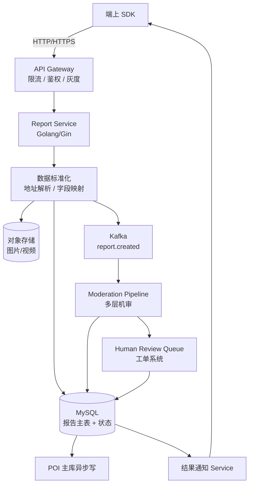
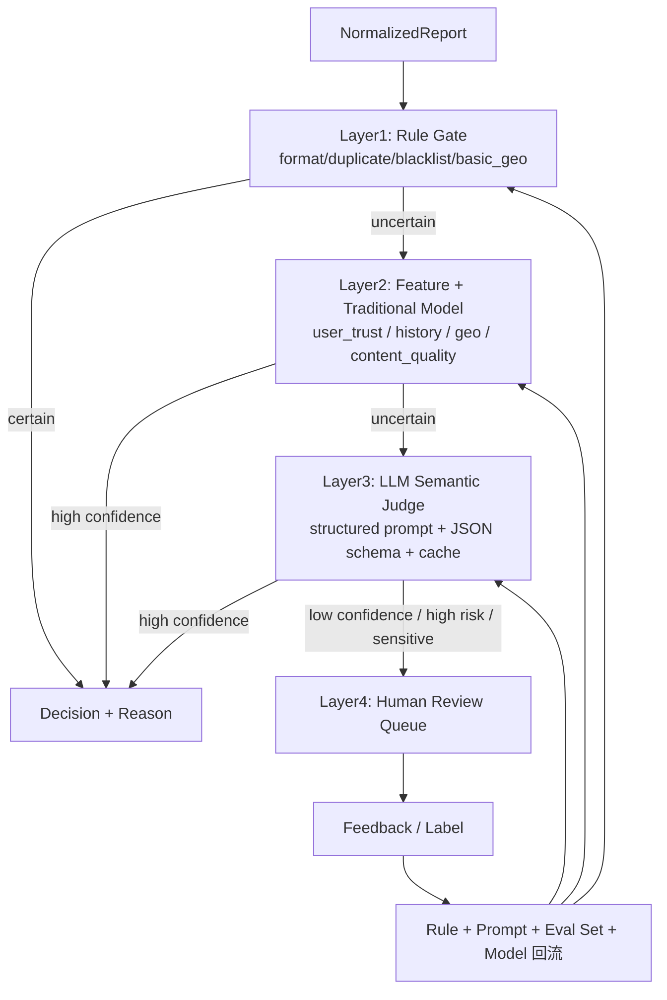
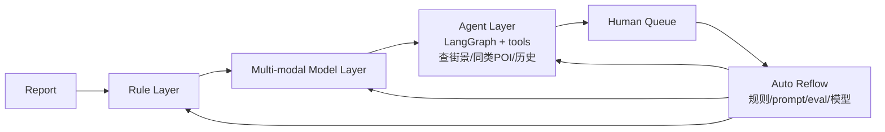

# 百度地图 · UGC 上报与大模型机审提效 面试 Q&A

> 简历上这块只有四五行，但面试官最喜欢挖。我把整套方案按「业务诉求 → 数据流 → 机审管线 → LLM 落地细节 → 评测与上线 → 成本与稳定性」六个层面**完整还原**出来。能讲多深就讲多深。


---

## 0. 一分钟项目介绍

百度地图的 POI（{{Point of Interest|地图兴趣点}}）会接收用户上报：地点新增、信息纠错、营业状态变更、图片证据、文本评论、重复 / 低质举报。**日均百万级 UGC 上报**，传统人工审核成本极高，机审误差代价又不能太大（错改一条 POI 影响所有用户）。

我做的事情主要三块：

1. **上报服务 + 工单流转**：端上上报、数据标准化、任务分发、状态流转、回写、异常兜底。
2. **机审分层管线**：把审核拆成「规则先行 → 传统模型 → LLM 语义判断 → HITL 兜底」四层，每层只把不确定样本上抛。
3. **LLM 在 UGC 机审的落地**：用结构化 Prompt + JSON Schema 输出 + 评测集 + 灰度，让 LLM 不直接砸主链路。

核心成果：**机审自动化率提升 50%-70%**，进入人工队列的低价值上报显著减少；审核理由可解释，质检和策略迭代提效明显；LLM 接入未对原有主链路 SLA 造成可见影响。

> **发散 tip：**
> - 「这个项目是『传统审核 + LLM 改造』的典型，可以延伸聊『不是所有审核都该用 LLM』『LLM 在什么 case 是性价比最高』这种行业话题。」
> - 「核心架构思路和 ArtArch.AI 是同源的：**规则做能确定的、模型做语义、HITL 兜不确定** — 这个分层思想我在多个项目反复验证。」

---

## 1. 项目背景与业务诉求

### Q1：POI UGC 上报的业务诉求和挑战是什么？

POI UGC 上报覆盖几类典型场景：

| 上报类型 | 占比（估算） | 难点 |
|---|---|---|
| 信息纠错（名称、电话、地址、营业时间） | ~35% | 用户描述模糊，证据不足 |
| 营业状态变更（关店、转店、装修中） | ~20% | 时效敏感，错改成本高 |
| 地点新增 | ~15% | 坐标偏移、命名规范化、是否真实存在 |
| 图片 / 文本证据 | ~10% | 多模态、广告 / 黑产 / 隐私 |
| 重复 / 低质举报 | ~15% | 黑产薅奖励、批量重复 |
| 其他（投诉、补充） | ~5% | 长尾 |

**业务的核心冲突：**

- **覆盖率 vs 准确率**：上报越多越好（用户参与），但错改不能太多（POI 是基础设施）。
- **时效 vs 成本**：营业状态变化要快（关店一天不更新影响千万用户），但人工审核慢且贵。
- **可解释 vs 自动化**：错改要能复查 / 质检，纯黑盒 LLM 难做合规交付。

**用户旅程关键节点：**

```
端上发起上报 → 端侧轻量校验 → 服务端落库（pending）
  → 数据标准化（地址解析、字段标准化、图片处理）
  → 机审分层处理 → 决策（accept / reject / manual_review）
  → 人工兜底（manual_review 队列）→ 最终决策
  → POI 主库变更（accept 才会）→ 端上回写状态
  → 用户通知（结果 + 理由）
```

> **发散 tip：**
> - 「UGC 系统的难点不在 ML 算法，而在『流转 + 状态机 + 异常兜底』。可以聊聊我把任务流转设计成『可恢复有限状态机』的细节。」

---

## 2. 上报服务 + 工单流转设计

### Q2：上报服务的整体架构？



**几个关键设计点（这是体现工程深度的地方）：**

1. **接入端轻量校验** + **服务端二次标准化**：端侧只做格式检查（防恶意），所有标准化（地址解析、字段补全、坐标纠偏）都在服务端做，保证逻辑统一。
2. **同步落库 + 异步审核**：上报立即返回 receipt（pending 状态），所有审核异步进行，端上轮询 / 推送拿结果。
3. **Kafka 解耦**：上报和机审用 `report.created` topic 解耦，机审模块崩了不影响上报入库；积压可独立扩容。
4. **状态机持久化**：每条上报有显式状态字段（pending / normalizing / machine_review / manual_review / accepted / rejected / withdrawn / failed），所有状态转移都进 audit log。
5. **幂等**：报告 ID 由「user_id + poi_id + report_type + content_hash + ts_window」生成，重复上报合并不重复入库。
6. **租户级配额**：单用户 5 分钟内最多 N 条同类上报，防黑产刷量。

**报告状态机：**

```
pending → normalizing → machine_review
   machine_review → (accepted | rejected | manual_review)
   manual_review → (accepted | rejected | hard_reject)
   accepted → poi_writeback → done
   rejected → notify_user → done
   * → failed（任何阶段崩了进 failed，可重试 / 转工单）
```

> **发散 tip：**
> - 「这套状态机我特别想强调『可逆性』：accepted 之后还能 withdrawn（误判的可回滚），这是 POI 数据可信度的兜底。」

---

### Q3：数据标准化怎么做？

**标准化的三类工作：**

1. **结构化字段**：
   - 用户填的「营业时间」 → `[{day: 1, open: "09:00", close: "21:00"}, ...]` 结构化。
   - 用户填的「电话」 → 去除符号、加国家码、识别多个号码。
2. **地址 / 坐标**：
   - 文字地址通过地理编码（geocoding）转坐标。
   - 坐标偏移检测：如果上报坐标 vs POI 主坐标 > 200m，标 `geo_inconsistent`。
3. **图片预处理**：
   - 缩放 / 压缩 / EXIF 脱敏。
   - 多模态特征抽取（OCR、招牌识别、敏感内容检测）。

**核心代码骨架（Golang）：**

```go
type RawReport struct {
    UserID     string
    POIID      string
    Type       ReportType
    Payload    json.RawMessage  // 用户填的原始数据
    Evidence   []EvidenceRef    // 图片 / 视频引用
    DeviceCtx  DeviceContext
    Timestamp  time.Time
}

type NormalizedReport struct {
    ID                string
    UserID            string
    POIID             string
    Type              ReportType
    StructuredFields  map[string]any  // 标准化后字段
    Evidence          []ProcessedEvidence
    GeoConsistency    GeoConsistency
    DuplicateGroupID  string  // 同窗口 N 个用户上报合并
    UserTrustScore    float64
    POIHistorySummary POIHistory  // 该 POI 近 30 天变更次数 / 上报集中度
    NormalizedAt      time.Time
}

func Normalize(raw RawReport) (*NormalizedReport, error) {
    // 1. 字段结构化
    sf := structuralize(raw)
    // 2. 地址 / 坐标处理
    geo := geoCheck(raw.POIID, sf)
    // 3. 图片处理
    ev := processEvidence(raw.Evidence)
    // 4. 用户信任度
    trust := userTrustService.Get(raw.UserID)
    // 5. POI 历史
    history := poiHistoryService.Get(raw.POIID)
    // 6. 同窗口去重
    groupID := dedup.Resolve(raw)
    return &NormalizedReport{...}, nil
}
```

> **发散 tip：**
> - 「标准化是整个机审管线的『数据底座』，机审里所有模型 / 规则吃的都是标准化后的字段。如果标准化不稳，下游全错。」

---

## 3. 机审分层管线（核心）

### Q4：四层机审管线怎么设计？为什么不直接全 LLM？

**核心论点：** **LLM 不是『审核能力』而是『审核工具』**。一个生产级 UGC 审核系统必须分层：**便宜先做、贵的兜底、不确定上抛**。



**每层的具体策略：**

#### Layer 1：规则门（Rule Gate）

确定性强、单条规则成本极低，先把「明显接受」和「明显拒绝」拍掉。

```python
def rule_gate(r: NormalizedReport) -> Decision | None:
    # 1. 格式 / 必填字段缺失 → reject
    if missing_required(r): return Decision.reject("format_invalid")
    # 2. 重复 / 黑名单 / 黑产模式 → reject
    if r.user_trust_score < 0.1: return Decision.reject("blocked_user")
    if duplicate.in_blacklist(r): return Decision.reject("known_spam")
    # 3. 极简明确接受（如：同一 POI 24h 内 100 个不同用户同样上报关店）
    if duplicate.strong_consensus(r): return Decision.accept("consensus", confidence=0.99)
    # 4. 极简明确拒绝（如：广告关键词 + 用户低信誉）
    if ad_keyword.hit(r) and r.user_trust_score < 0.3:
        return Decision.reject("ad_spam")
    return None  # 不确定上抛
```

**Layer 1 处理掉的样本比例**：约 30-40%。

#### Layer 2：特征 + 传统模型

跑「用户信任度模型」「内容质量模型」「图片广告 / 隐私模型」「文本毒性模型」等专用判别器。

```python
def traditional_model_layer(r: NormalizedReport) -> Decision | None:
    features = build_features(r)  # 用户信任、历史变更、相似 case
    # 多个二分类器并行
    scores = {
        "spam":     spam_model.predict(features),
        "ad":       ad_model.predict(r.evidence),
        "privacy":  privacy_model.predict(r.evidence),
        "geo_anomaly": geo_anomaly_model.predict(features.geo),
        "consistency": consistency_model.predict(features),
    }
    if scores["spam"] > 0.92 or scores["ad"] > 0.9: return Decision.reject(...)
    if scores["consistency"] > 0.9 and not high_sensitivity(r):
        return Decision.accept("traditional_high_confidence")
    if all(s < 0.3 for s in scores.values()):
        return Decision.reject("low_quality_aggregate")
    return None  # 不确定 → Layer 3
```

**Layer 2 处理掉的样本比例**：又 25-35%。

#### Layer 3：LLM 语义判断（重点）

剩下的就是「语义复杂、规则吃不下、传统模型不确定」的样本。这一层用 LLM 做结构化判断，输出可解释结论。

```python
@dataclass
class LLMAuditDecision(BaseModel):
    decision: Literal["approve", "reject", "manual_review"]
    confidence: float  # 0-1
    reason_codes: list[Literal[
        "evidence_supports", "evidence_insufficient",
        "user_description_inconsistent", "geo_inconsistent",
        "content_quality_low", "sensitive_no_evidence",
        "needs_human_judgment", "ambiguous_intent",
    ]]
    evidence: list[str]  # 引用的具体字段 / 文本片段
    risk_flags: list[str]  # 涉敏 / 隐私 / 投诉 / 法律风险
    manual_review_fields: list[str]  # 需要人工确认的字段
    suggested_action: str | None  # 可选的具体改动建议

LLM_PROMPT = """
你是一个 POI UGC 审核助手，目标是判断用户上报是否应该被采纳。
严格按 JSON Schema 输出，不要写 JSON 之外的内容。

上报基本信息：
- POI 现有数据：{{poi_current_json}}
- 用户上报字段：{{user_report_json}}
- 用户描述文本：{{user_text}}
- 证据图片 OCR/描述：{{evidence_summary}}
- 用户信誉：{{user_trust}}
- 该 POI 近 30 天历史变更：{{poi_history}}
- 同窗口其他用户上报：{{similar_reports}}

判断规则：
1. 上报字段必须有充分证据支持（用户文本 + 图片 + 历史 + 其他用户上报）。
2. 涉及关停 / 转让等不可逆操作必须证据强烈。
3. 用户描述与现有 POI 数据冲突时，看证据更倾向哪边。
4. 涉法 / 涉隐私 / 涉投诉一律 manual_review。
5. 证据不足 → manual_review，不要硬决策。

输出 JSON Schema：{{schema}}
"""
```

**Layer 3 处理掉的样本比例**：又 15-25%。

#### Layer 4：HITL

剩下的 ~10% 进人工审核队列。HITL 不是「失败」，而是质量阀门。人工结果回流到 **规则库 + 评测集 + 模型训练 + Prompt 修订**。

**最终自动化率：30% + 30% + 20% = ~80%**（不同时期波动，简历表述「50-70%」是保守的）。

> **发散 tip：**
> - 「这套分层是从『Anthropic Building Effective Agents』里学的——他们也是建议先 router / chain workflow，再 agent。我们机审就是 router workflow 的典型。」
> - 「分层最妙的地方是 **每层独立可评测**：Layer 1 看 precision 不能错伤、Layer 2 看 F1、Layer 3 看 manual_review_rate 是否过高。」

---

### Q5：LLM Prompt 怎么设计？

**结构化 Prompt 的几个关键技巧（这是核心干货）：**

1. **强结构化输入**：所有上下文都用 JSON 喂，不用自然语言拼。
2. **角色 + 任务 + 决策规则 + Schema 四段式**：role / task / rules / output_schema 分明。
3. **few-shot 用历史真实标注**：从评测集里挑 3-5 条边界 case 做 few-shot，不用合成数据。
4. **拒答优先**：明确告诉模型「不确定就 manual_review」，不要让模型硬决策。
5. **Schema 强约束**：用 Pydantic / JSON Schema，service 端 strict validation。

**典型 Prompt 模板：**

```python
PROMPT = """
# Role
你是百度地图 POI UGC 审核员，负责判断用户上报是否应采纳。

# Task
对单条上报做审核决策。

# Input
{json.dumps(context, ensure_ascii=False, indent=2)}

# Decision Rules
1. evidence_supports: 用户文本 / 图片 / 历史 / 同窗口上报至少 2 类证据一致。
2. evidence_insufficient: 任何一类证据缺失或弱时优先 manual_review。
3. 关停 / 转让类必须图片证据 + 时间戳合理 + 至少 2 个独立用户。
4. 用户描述 vs POI 现状冲突时，看证据强度倾向：
   - 用户独有证据 < POI 主库数据
   - 用户 + 1 个独立用户 < POI 主库数据
   - 用户 + 2+ 独立用户 + 图片 > POI 主库数据
5. 涉法 / 隐私 / 投诉 / 暴力图片 → manual_review。
6. 你不确定 → manual_review，不要硬决策。

# Output JSON Schema
{schema_str}

# Examples
{few_shot_examples}

# Now decide
"""
```

**关键工程细节：**

- **prompt 版本号 + 评测集 + 灰度**：每改一版跑评测集对比，先 5% 灰度。
- **Context 拼装预算**：单 prompt 控制在 4-6k token，超长用 chunked 处理 + 总结。
- **Schema 用 OpenAI strict json / Gemini response_schema + retry-with-feedback**：见 [ArtArch.AI Q9](./artarch-ai.md#q9json-schema-约束--llm-结构化输出怎么做才稳)。

详细 Prompt 设计专题见 [UGC LLM Judge Prompt 设计与失败模式](./notes/ugc-llm-judge-prompt.md)。

> **发散 tip：**
> - 「我特别想强调『拒答优先』。LLM 自信地给错答案的代价 >> 老老实实说『不确定』。这点和医疗 RAG 是一致的。」

---

### Q6：怎么避免 LLM 接入冲击主链路？

**核心论点：** **LLM 是异步层，不在用户请求关键路径上**。所有 LLM 调用在「上报入库 → 用户拿到 receipt」之后异步进行。

**几个具体保证：**

1. **机审异步化**：上报入库立即返回 receipt（pending），机审在 Kafka 消费侧异步跑。
2. **LLM 调用并行 + 限流**：
   - 限制单 worker 并发 LLM 请求数（10-20），用 semaphore。
   - 总 QPS 软上限（按预算定）。
3. **LLM 超时降级**：
   - 5s 超时 → 自动转 Layer 4 manual_review，不重试。
   - 长尾不卡机审 worker。
4. **Fallback chain**：Gemini → 文心 → 内部小模型。任一可用就出结果。
5. **预算守门**：日 LLM 调用预算软上限 N 万次，超额后只跑 Layer 1 + 2 + manual_review。

**主链路 SLA 保证：**

```
用户上报 → API 入库 P95 < 200ms（同步）
                       ↓（异步）
                  Kafka topic
                       ↓
              机审 worker（独立扩缩容）
                       ↓
              结果回写 → 端上轮询/推送
```

主链路 SLA 不依赖 LLM 可用性。

> **发散 tip：**
> - 「这其实是『大模型的代价不应该让用户感知到』的原则。OpenAI 也有专门的 batch API 给非实时场景用，思路一致。」

---

### Q7：相似 case 缓存怎么做？

**关键思路：** **LLM 决策可以被 cache，前提是 cache key 设计得有意义**。

```python
def llm_audit_cache_key(r: NormalizedReport) -> str:
    # 1. 业务维度（POI + 类型 + 关键字段）
    # 2. 内容指纹（user_text 的 simhash）
    # 3. 证据指纹（image embedding hash + ocr text simhash）
    # 4. POI 历史片段（近 30 天变更数 + 共识度）
    parts = [
        r.poi_id, r.type.name,
        simhash(r.user_text),
        json_canonical(r.structured_fields),
        evidence_fingerprint(r.evidence),
        r.poi_history.summary_hash,
    ]
    return hashlib.sha256("|".join(parts).encode()).hexdigest()
```

**缓存命中规则：**

- 同 POI、同 type、内容 / 证据指纹相似度 > 0.95 → 直接复用决策。
- 缓存 TTL：24 小时（POI 状态会变）。
- 高风险类（关停 / 转让）不缓存，永远重判。

**实测命中率**：~12-18%，省 LLM 调用 ~15%。

> **发散 tip：**
> - 「这本质上是 RAG 的同源思路——给 LLM 加 cache 等价于 retrieval 拿到历史决策。我后来在 ArtArch.AI 也用了类似 pattern。」

---

## 4. 评测、灰度、上线

### Q8：UGC 机审怎么评测？

**评测集组成：**

| 桶 | 数量 | 来源 |
|---|---|---|
| 明显接受 | 500 | 历史 accept 高置信样本 |
| 明显拒绝 | 500 | 历史 reject 高置信样本 |
| 边界 case | 1000 | LLM 输出 manual_review 的样本，人工再标注 |
| 高敏样本 | 200 | 关停 / 转让 / 涉法 / 隐私 |
| Badcase 回流 | 持续滚动 | 线上质检发现的错判 |

**关键指标：**

1. **Layer-wise**：
   - Layer 1 / 2 / 3 各层 precision、recall、F1。
   - 每层 manual_review_rate（衡量层级压力）。
2. **整体**：
   - 机审自动化率（不进 HITL 的比例）。
   - **错改率**（accept 中后来被 withdrawn 的比例）—— 这是最高优先级指标。
   - 人工复核一致率（HITL 和 LLM 判断一致的比例）。
3. **业务**：
   - POI 数据准确率提升幅度。
   - 用户上报通过反馈时延（P50/P95）。

**离线评测 + 影子流量 + 灰度：**

- 离线：评测集跑通过率，每次模型 / prompt 变更必跑。
- 影子流量：新策略和现行策略并行跑，不影响决策，只比对。
- 灰度：5% → 20% → 50% → 100%，每级看 24h。

> **发散 tip：**
> - 「这套和 Anthropic 的 capability eval / regression eval 二分法是一致的。我们离线评测里 80% 是 regression（不能掉），20% 是 capability（在爬坡）。」

---

### Q9：质检和策略回溯怎么做？

**核心论点：** 模型 / 规则 / Prompt 全部可追溯到决策的「理由」。

**Trace 字段：**

```json
{
  "report_id": "...",
  "decision_layer": "llm",  // rule / traditional / llm / human
  "decision": "accept",
  "confidence": 0.86,
  "reason_codes": ["evidence_supports", "consensus"],
  "trace": {
    "rule_hits": ["dup_consensus_v2"],
    "model_scores": {"spam": 0.02, "ad": 0.01, "consistency": 0.91},
    "llm": {
      "model": "gemini-2.5-pro",
      "prompt_version": "ugc-audit-v4.1.0",
      "input_tokens": 1820,
      "output_tokens": 240,
      "cached": false,
      "latency_ms": 1840,
      "raw_response": "...",
      "schema_validation": "ok"
    },
    "human": null
  },
  "audit_timeline": [...]
}
```

**质检流程：**

- 自动每日抽样 500 条决策 → 人工 / 高质量评测员复核。
- 错判分类：召回失败 / 决策错误 / Prompt 偏差 / 规则错。
- 周报 → 修复优先级 → 上灰度。

> **发散 tip：**
> - 「可解释审核是 LLM 在合规场景能用的前提。我特别想强调：**model 输出的 reason_codes 不是给用户看的，是给质检和合规看的**。」

---

## 5. 整套方案的延伸：如果让我从 0 设计

### Q10：如果你重新设计一套 UGC 大模型机审系统，会怎么做？

**核心论点：** 三个升级方向：

1. **多模态融合更强**：图片 / 视频证据用 multimodal LLM 直接读，不再拆 OCR + caption 两步。Gemini 2.5 多模态做得好，可以直接 prompt+image。
2. **Agent 化的复杂判断**：高敏 case 走 Agent + 工具调用，让 LLM 主动查「该 POI 大众点评 / 团购 / 街景历史 / 同 POI 关停时间序列」再判断。这一块用 LangGraph 比 chat completion 合理。
3. **自动化 Prompt / 规则迭代**：基于失败 case 用 LLM 反推 prompt 修订建议（meta-prompt），工程师评审后合入；规则用「自动挖掘高 precision 模式」补强。

**架构图（设想）：**



> **发散 tip：**
> - 「这种『工具调用型 Agent 用在审核场景』是我下阶段最想做的事情。可以由这块引出 Anthropic 的『Agentic RAG』和 OpenAI 的 web_search tool 思路。」
> - 「我特别想强调：UGC 机审不是分类问题，是 **「证据收集 + 推理 + 决策 + 可解释报告」** 的复合问题。Agent 范式比单 LLM 调用更贴合本质。」

---

## 6. 行为面 & 反向引导

### Q11：你在这个项目里最大的收获？

**模板：**

最大的收获是想明白「**LLM 不是审核能力，而是审核工具**」。

很多人会觉得「LLM 来了，规则和传统模型可以废了」。但实际上，**生产级机审是分层的**，LLM 不是替代品，是新的一层。这一层的价值不在「更聪明」，而在「能处理之前规则吃不下、传统模型说不清的灰色样本」。

更深一层：审核系统的核心从来不是「单点准确率」，而是「**整体系统的可解释、可回溯、可迭代**」。LLM 改造一个老系统，最难的是把它的 reason_codes、prompt_version、trace 接到现有的质检 / 合规体系里，而不是 prompt 怎么写。

---

### Q12：踩过什么坑？

1. **LLM 自信的错判**：早期 prompt 没强调「不确定就 manual_review」，模型给出大量「自信但错」的决策，错改率上升。修：prompt 加 hard rule + 校验 confidence < 0.7 强制 manual_review。
2. **图片证据时间戳错乱**：用户传截图（不是拍照），EXIF 是截图时间不是拍摄时间，LLM 看时间戳判断「最近变化」全错。修：图片处理层标 `evidence_freshness`，prompt 里明确告诉模型这是截图。
3. **Schema 强约束被 Gemini 偶尔违背**：Gemini 1.5 偶尔输出 schema 外字段。修：retry-with-feedback + provider fallback。

---

### Q13：反问？

- 当前 UGC 审核的瓶颈是召回率、误改率、人工成本，还是合规可解释？
- 是否已经接 multimodal LLM？图片 / 视频证据怎么处理？
- HITL 通道的工作流是否打通？审核结果是否回流到模型 / 规则 / prompt？
- 团队衡量审核系统的核心指标？错改率 / 自动化率 / 人工节省 / 时延？
- 是否有把 Agent + 工具调用（街景 / 历史 / 第三方点评）引入审核的规划？

---

## 7. 反向引导地图

| 听到这种问 | 引到 |
|---|---|
| 「你 LLM 怎么用的？」 | 「不是全 LLM，是分层」→ Q4 那张图 |
| 「日均百万级怎么撑？」 | 异步 + Kafka + 分层成本控制 → Q6 |
| 「怎么保证不胡判？」 | 拒答优先 + 引用 / reason_codes + HITL → Q5 |
| 「Prompt 怎么管？」 | 版本号 + 评测 + 灰度 → Q8 |
| 「LLM 慢，怎么办？」 | 异步 + 缓存 + 超时降级 → Q6/Q7 |
| 「重新设计你怎么做？」 | Agent + 工具调用 → Q10 |

---

## 8. 参考资料

- [Anthropic - Building Effective Agents](https://www.anthropic.com/engineering/building-effective-agents) — workflow / routing / 分层思路
- [Anthropic - Demystifying Evals](https://www.anthropic.com/engineering/demystifying-evals-for-ai-agents) — capability vs regression eval
- [OpenAI - Structured Outputs / strict mode](https://platform.openai.com/docs/guides/structured-outputs)
- [Gemini Function Calling + Response Schema](https://ai.google.dev/gemini-api/docs/function-calling)
- [LangChain - Context Engineering for Agents](https://www.langchain.com/blog/context-engineering-for-agents)
- [Karpathy - Software 3.0](https://www.latent.space/p/s3) — 大模型是工具不是替代品
