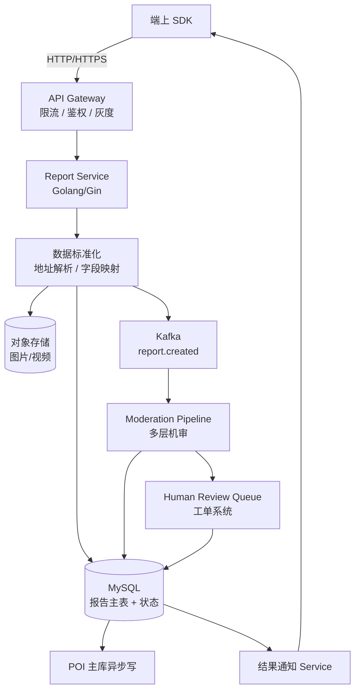
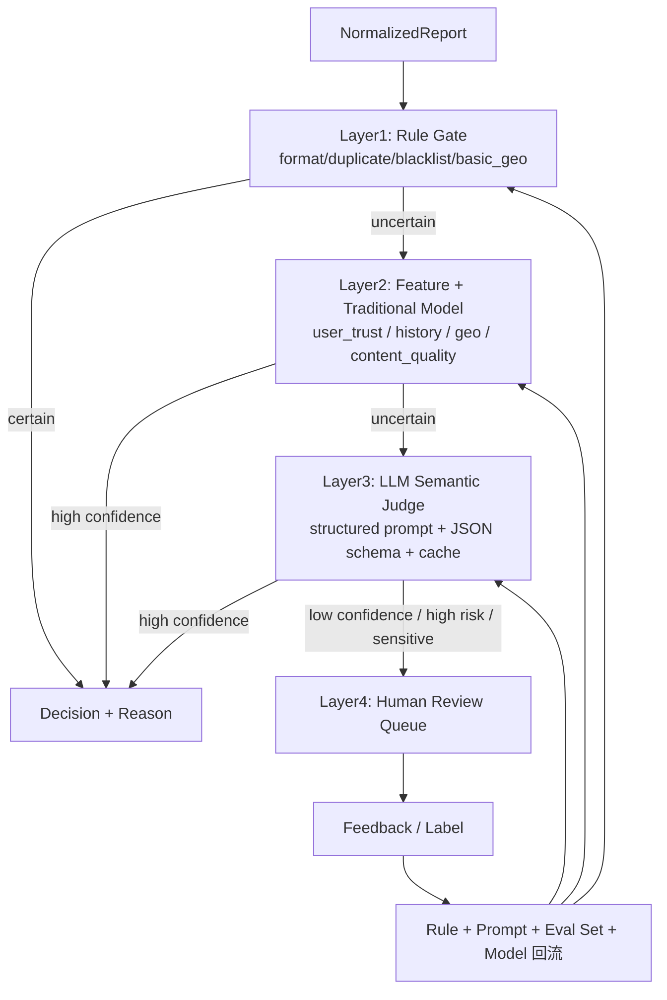
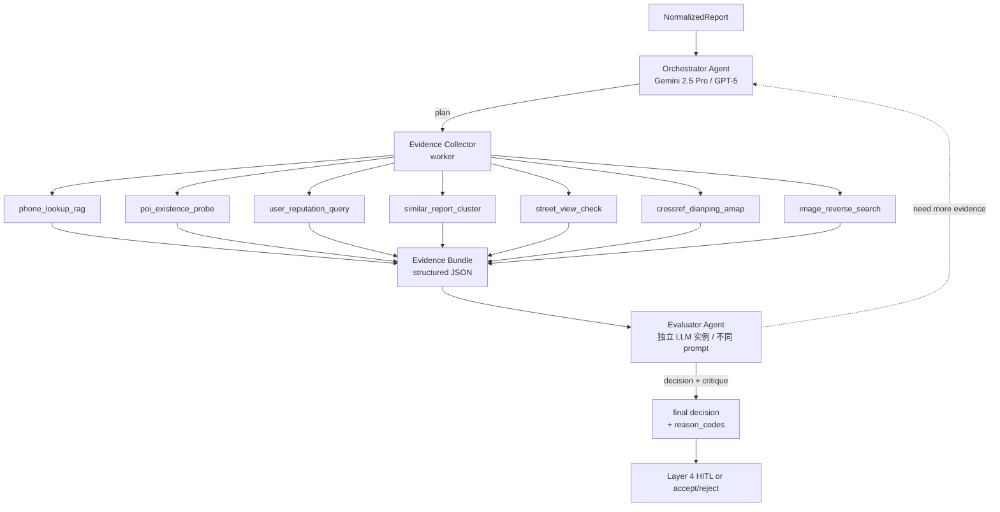
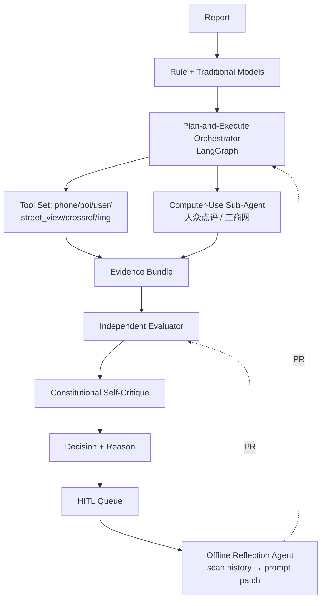

# 百度地图 · UGC 上报与大模型机审提效 面试 Q&A

> 简历上这块只有四五行，但面试官最喜欢挖。我把整套方案按「业务诉求 → 数据流 → 机审管线 → LLM 落地细节 → 评测与上线 → 成本与稳定性」六个层面**完整还原**出来。能讲多深就讲多深。


---

## 0. 一分钟项目介绍

百度地图的 POI（{{Point of Interest|地图兴趣点}}）会接收用户上报：地点新增、信息纠错、营业状态变更、图片证据、文本评论、重复 / 低质举报。**日均百万级 UGC 上报**，传统人工审核成本极高，机审误差代价又不能太大（错改一条 POI 影响所有用户）。

我做的事情主要三块：

1. **上报服务 + 工单流转**：端上上报、数据标准化、任务分发、状态流转、回写、异常兜底。
2. **机审分层管线**：把审核拆成「规则先行 → 传统模型 → **Audit Agent** → HITL 兜底」四层，每层只把不确定样本上抛。
3. **Audit Agent 落地**：Layer 3 不是单次 LLM 调用，而是 **Orchestrator-Workers + Evaluator-Optimizer** 模式的多 Agent 系统（按 Anthropic *Building Effective Agents* 论文实现）。Agent 自带 **RAG / 跨平台核验 / 用户行为 / 图片反查** 共 10 余个工具，能主动调查「这个电话是否绑了 5 个不相关 POI」「街景里这家店招牌还在不在」「这个用户最近 24h 在不在批量打卡」。

核心成果：**机审自动化率提升 50%-70%**（Agent 化后内部口径 ~88%）；虚假电话识别召回率 +60%；幽灵 POI 误判率 -40%；黑产 / 竞品恶意上报的整团识别准确率从 ~30% 提升到 80%+；主链路 SLA 不受 LLM 可用性影响。

> **发散 tip：**
> - 「这个项目我最想强调的不是『接了 LLM』，而是『把 LLM 升级成 Agent + 工具』之后才真正打开 UGC 机审的能力上限。可以延伸聊 Anthropic *Building Effective Agents* 给 agent 的明确适用场景判据——『动态决定调什么工具』，我们这套就是教科书 case。」
> - 「核心架构思路和 ArtArch.AI 是同源的：**规则做能确定的、模型做语义、Agent 做调查、HITL 兜不确定**——这个分层思想我在多个项目反复验证。」

---

## 1. 项目背景与业务诉求

### Q1：POI UGC 上报的业务诉求和挑战是什么？

POI UGC 上报覆盖几类典型场景：

| 上报类型 | 占比（估算） | 难点 |
|---|---|---|
| 信息纠错（名称、电话、地址、营业时间） | ~35% | 用户描述模糊，证据不足 |
| 营业状态变更（关店、转店、装修中） | ~20% | 时效敏感，错改成本高 |
| 地点新增 | ~15% | 坐标偏移、命名规范化、是否真实存在 |
| 图片 / 文本证据 | ~10% | 多模态、广告 / 黑产 / 隐私 |
| 重复 / 低质举报 | ~15% | 黑产薅奖励、批量重复 |
| 其他（投诉、补充） | ~5% | 长尾 |

**业务的核心冲突：**

- **覆盖率 vs 准确率**：上报越多越好（用户参与），但错改不能太多（POI 是基础设施）。
- **时效 vs 成本**：营业状态变化要快（关店一天不更新影响千万用户），但人工审核慢且贵。
- **可解释 vs 自动化**：错改要能复查 / 质检，纯黑盒 LLM 难做合规交付。

**用户旅程关键节点：**

```
端上发起上报 → 端侧轻量校验 → 服务端落库（pending）
  → 数据标准化（地址解析、字段标准化、图片处理）
  → 机审分层处理 → 决策（accept / reject / manual_review）
  → 人工兜底（manual_review 队列）→ 最终决策
  → POI 主库变更（accept 才会）→ 端上回写状态
  → 用户通知（结果 + 理由）
```

> **发散 tip：**
> - 「UGC 系统的难点不在 ML 算法，而在『流转 + 状态机 + 异常兜底』。可以聊聊我把任务流转设计成『可恢复有限状态机』的细节。」

---

## 2. 上报服务 + 工单流转设计

### Q2：上报服务的整体架构？



**几个关键设计点（这是体现工程深度的地方）：**

1. **接入端轻量校验** + **服务端二次标准化**：端侧只做格式检查（防恶意），所有标准化（地址解析、字段补全、坐标纠偏）都在服务端做，保证逻辑统一。
2. **同步落库 + 异步审核**：上报立即返回 receipt（pending 状态），所有审核异步进行，端上轮询 / 推送拿结果。
3. **Kafka 解耦**：上报和机审用 `report.created` topic 解耦，机审模块崩了不影响上报入库；积压可独立扩容。
4. **状态机持久化**：每条上报有显式状态字段（pending / normalizing / machine_review / manual_review / accepted / rejected / withdrawn / failed），所有状态转移都进 audit log。
5. **幂等**：报告 ID 由「user_id + poi_id + report_type + content_hash + ts_window」生成，重复上报合并不重复入库。
6. **租户级配额**：单用户 5 分钟内最多 N 条同类上报，防黑产刷量。

**报告状态机：**

```
pending → normalizing → machine_review
   machine_review → (accepted | rejected | manual_review)
   manual_review → (accepted | rejected | hard_reject)
   accepted → poi_writeback → done
   rejected → notify_user → done
   * → failed（任何阶段崩了进 failed，可重试 / 转工单）
```

> **发散 tip：**
> - 「这套状态机我特别想强调『可逆性』：accepted 之后还能 withdrawn（误判的可回滚），这是 POI 数据可信度的兜底。」

#### 🛠 上报服务 + 工单流转的具体技术方案

| 模块 | 主推 | 备选 | 一句话理由 |
|---|---|---|---|
| Web 框架 | **Gin**（Golang）+ middleware（zap log / Prometheus / OTel） | Echo / Fiber / go-chi | 百度系常用、生态完整、性能稳 |
| Python 替代（若全栈 Python） | FastAPI + `uvicorn[standard]` workers | Litestar | Pydantic v2 原生 |
| API Gateway | 内部网关（百度自研）/ Higress (阿里) / Kong / Tyk | 自建 nginx + lua | 公司级方案优先 |
| 鉴权 | JWT (RS256) + Redis 黑名单 + `casbin` 细粒度权限 | OAuth2-proxy | casbin 支持 RBAC/ABAC |
| 限流 | `redis-cell` 模块 (CL.THROTTLE token bucket) / `slowapi` (Py) | `sentinel-go` (阿里) | redis-cell 单 round-trip 原子 |
| 数据库 | **MySQL 8.x** + `gorm` v2（Go） / `sqlalchemy[asyncio]` 2.0（Py） | TiDB（分库分表自动） / PostgreSQL | 百度系 MySQL 生态 |
| Schema migration | `golang-migrate` / `goose`（Go），`alembic`（Py） | flyway | golang-migrate 支持 DDL/DML 两步 |
| MQ | **Kafka** 3.x + `confluent-kafka-go` / `aiokafka`（Py） | Pulsar / RocketMQ | 百度 BMQ 兼容 Kafka 协议 |
| Kafka schema | Avro + Confluent Schema Registry | Protobuf | Avro 强 schema evolution |
| 对象存储 | **百度 BOS** / S3-compatible（aws-sdk-go-v2） | OSS / COS | BOS 与百度系内网零跨域 |
| 图片处理 | `disintegration/imaging`（Go）/ `Pillow-SIMD`（Py，比 Pillow 快 4-6×） | imagemagick | 缩放 / 压缩 / EXIF 脱敏 |
| 图片去 EXIF | `piexif`（Py）/ `dsoprea/go-exif`（Go） | exiftool（外部进程） | 必须脱敏防隐私泄露 |
| 状态机 | Go：`looplab/fsm` ；Py：`transitions` | 自写 dict-based | looplab/fsm 30k stars，含 callback |
| 幂等键 | `(user_id, poi_id, type, content_hash, ts_window)` SHA256 → Redis SETNX 24h | DB unique 索引 | Redis 性能 + DB 兜底 |
| 配额 | `redis-cell` 滑动窗口 / `gocraft/work` (Go) | nginx limit_req | 单用户每 5min 同类 N 条 |
| Distributed Tracing | `OpenTelemetry-Go` + Jaeger / Tempo + Grafana | Skywalking | OTel GenAI conv 2025 起 1.0 |
| 配置中心 | Apollo (携程) / Nacos / `viper` | etcd KV | 灰度规则、阈值热更 |
| 健康检查 | `/healthz` + `/readyz` + `gocheck` | manual | k8s liveness/readiness 一一对应 |
| 部署 | Kubernetes + HPA（CPU + Kafka lag 双指标） + PodDisruptionBudget | 裸 docker compose | 高并发必须 K8s |
| 灰度路由 | Istio VirtualService weight / Higress canary | Spinnaker | Istio header-based 灰度 |
| 压测 | `vegeta`（Go，压 HTTP）/ `kafka-producer-perf-test`（Kafka） | locust / k6 / wrk | vegeta 命令行最快 |

**Kafka topic 设计 + 关键参数**：

```text
report.created.v1                       # 上报入库后触发
  partition: 32                          # 按 user_id hash 分区
  retention: 7d                          # 失败重放窗口
  compression: lz4                       # CPU 友好 + 压缩比好
  cleanup.policy: delete
  acks: all                              # 强一致，避免丢消息
  enable.idempotence: true               # 生产端幂等
  max.in.flight.requests.per.connection: 5

report.machine_review.{accepted,rejected,manual} # 机审结果分主题
report.user_notify.v1                    # 端上通知
report.dlq.v1                            # 死信队列
```

**Gin + GORM + Kafka 入库的关键代码骨架**：

```go
type ReportService struct {
    db       *gorm.DB
    producer *kafka.Producer
    redis    *redis.Client
    bos      *bos.Client
}

func (s *ReportService) CreateReport(ctx context.Context, raw RawReport) (*Receipt, error) {
    // 1. 计算幂等 key
    idemKey := computeIdempotencyKey(raw)
    // 2. SETNX 抢幂等锁（10min）
    ok, _ := s.redis.SetNX(ctx, "idem:"+idemKey, "1", 10*time.Minute).Result()
    if !ok {
        // 复用之前的 receipt
        return s.findReceiptByIdemKey(ctx, idemKey)
    }
    // 3. 入库 pending
    rpt := &Report{ID: uuid.NewString(), Status: StatusPending, ...}
    if err := s.db.WithContext(ctx).Create(rpt).Error; err != nil {
        return nil, err
    }
    // 4. 异步发 Kafka（事务性 outbox 也可以，这里偷懒）
    s.producer.ProduceAsync(ctx, "report.created.v1", rpt.ID, mustJSON(rpt))
    return &Receipt{ID: rpt.ID, Status: rpt.Status}, nil
}
```

**looplab/fsm 状态机**：

```go
fsm := fsm.NewFSM(
    "pending",
    fsm.Events{
        {Name: "normalize",       Src: []string{"pending"},       Dst: "normalizing"},
        {Name: "machine_review",  Src: []string{"normalizing"},   Dst: "machine_review"},
        {Name: "accept",          Src: []string{"machine_review", "manual_review"}, Dst: "accepted"},
        {Name: "reject",          Src: []string{"machine_review", "manual_review"}, Dst: "rejected"},
        {Name: "to_human",        Src: []string{"machine_review"}, Dst: "manual_review"},
        {Name: "writeback",       Src: []string{"accepted"},      Dst: "done"},
        {Name: "withdraw",        Src: []string{"accepted", "done"}, Dst: "withdrawn"}, // 可逆
        {Name: "fail",            Src: []string{"*"},             Dst: "failed"},
    },
    fsm.Callbacks{
        "before_event": persistTransition,      // 落 audit log
        "enter_accepted": triggerPOIWriteback,
    },
)
```

引用：

- gin-gonic/gin: <https://github.com/gin-gonic/gin>
- looplab/fsm: <https://github.com/looplab/fsm>
- confluent-kafka-go: <https://github.com/confluentinc/confluent-kafka-go>
- redis-cell (CL.THROTTLE 限流): <https://github.com/brandur/redis-cell>
- OpenTelemetry-Go: <https://opentelemetry.io/docs/languages/go/>
- vegeta: <https://github.com/tsenart/vegeta>

---

### Q3：数据标准化怎么做？

**标准化的三类工作：**

1. **结构化字段**：
   - 用户填的「营业时间」 → `[{day: 1, open: "09:00", close: "21:00"}, ...]` 结构化。
   - 用户填的「电话」 → 去除符号、加国家码、识别多个号码。
2. **地址 / 坐标**：
   - 文字地址通过地理编码（geocoding）转坐标。
   - 坐标偏移检测：如果上报坐标 vs POI 主坐标 > 200m，标 `geo_inconsistent`。
3. **图片预处理**：
   - 缩放 / 压缩 / EXIF 脱敏。
   - 多模态特征抽取（OCR、招牌识别、敏感内容检测）。

**核心代码骨架（Golang）：**

```go
type RawReport struct {
    UserID     string
    POIID      string
    Type       ReportType
    Payload    json.RawMessage  // 用户填的原始数据
    Evidence   []EvidenceRef    // 图片 / 视频引用
    DeviceCtx  DeviceContext
    Timestamp  time.Time
}

type NormalizedReport struct {
    ID                string
    UserID            string
    POIID             string
    Type              ReportType
    StructuredFields  map[string]any  // 标准化后字段
    Evidence          []ProcessedEvidence
    GeoConsistency    GeoConsistency
    DuplicateGroupID  string  // 同窗口 N 个用户上报合并
    UserTrustScore    float64
    POIHistorySummary POIHistory  // 该 POI 近 30 天变更次数 / 上报集中度
    NormalizedAt      time.Time
}

func Normalize(raw RawReport) (*NormalizedReport, error) {
    // 1. 字段结构化
    sf := structuralize(raw)
    // 2. 地址 / 坐标处理
    geo := geoCheck(raw.POIID, sf)
    // 3. 图片处理
    ev := processEvidence(raw.Evidence)
    // 4. 用户信任度
    trust := userTrustService.Get(raw.UserID)
    // 5. POI 历史
    history := poiHistoryService.Get(raw.POIID)
    // 6. 同窗口去重
    groupID := dedup.Resolve(raw)
    return &NormalizedReport{...}, nil
}
```

> **发散 tip：**
> - 「标准化是整个机审管线的『数据底座』，机审里所有模型 / 规则吃的都是标准化后的字段。如果标准化不稳，下游全错。」

#### 🛠 数据标准化每一类工作用什么

| 类别 | 主推库 / 方案 | 备选 | 备注 |
|---|---|---|---|
| 电话号码解析 | **`google/libphonenumber`**（官方）+ Go 绑定 `nyaruka/phonenumbers` / Py `phonenumbers` | 自写 regex | 解析、normalize、归属地、carrier、号段类型一站式 |
| 地理编码 | **百度 Geocoding API**（内部 RPC，零跨域）| 高德 / Google Geocoding | 内部直连无配额、可灰度模型 |
| 反向地理编码 | 同上 + 城市/区县分级 LBS | OpenStreetMap Nominatim | 内部更准 |
| 坐标系转换 | `chenyukang/coordtransform`（Go）/ `coord-convert`（Py） | 自写公式 | WGS84↔BD09↔GCJ02 |
| 距离计算 | `geo/s2` (Google S2) / `haversine` Python | 自写公式 | S2 cell index 大规模空间索引 |
| 地理空间索引 | **S2 cell** 30 级编码 + Redis sorted set / Postgres `cube` 扩展 | geohash | S2 比 geohash 边界处理更优 |
| 地址解析 NER | `gliner-py` zero-shot + 自建地址词典 / `Jio-NLP` 中文地址解析 | 自训 BERT | Jio 是中文地址 NER 老牌 |
| OCR（招牌识别） | **PaddleOCR**（百度自研，中文最强） | EasyOCR / Tesseract | PaddleOCR 中文准确率显著领先 |
| OCR Server | PaddleOCR PP-OCRv4 + `paddle-serving` 或自封 FastAPI | 直接 import | 服务化才能多业务复用 |
| 图片处理 | `disintegration/imaging`（Go）/ `Pillow-SIMD`（Py） | imagemagick | Pillow-SIMD 比 Pillow 快 4-6× |
| EXIF 脱敏 | `dsoprea/go-exif`（Go）/ `piexif` + Pillow（Py） | exiftool | 必须清 GPS / device / user metadata |
| 图片格式转换 | `disintegration/imaging` + `chai2010/webp`（Go）/ `Pillow` WebP | imagemagick | WebP 压缩比 +25% |
| 图片去重 | **pHash** (`corona10/goimagehash`) + Redis bitmap / `imagehash` (Py) | dHash / aHash | pHash 抗轻度修改 |
| 图片广告 / 隐私检测 | 自训 ResNet/EfficientNet + `paddle-inference` | 商业 API（百度 EasyDL） | 自训定制化 |
| 多模态特征抽取 | bge-vl / CLIP 中文版 `Chinese-CLIP` (`OFA-Sys`) | OpenAI vision API | Chinese-CLIP 中文场景强 |
| 敏感词 / 违禁词 | `pyahocorasick` AC 自动机 + 热更新词典 | flashtext | 微秒级，10w+ 词典 |
| 文本毒性 | 自训 ERNIE + Mediapipe Text Classifier | OpenAI moderation（中文弱） | 中文场景 ERNIE 强 |
| 信任分 | 自建 feature store（Feast / 自写） + sklearn `GradientBoostingClassifier` | 在线 model 调用 | LR/GBDT 简单稳定 |
| 同窗口去重 | SimHash（`pkg.in.th/simhash`）+ MinHash LSH（`datasketch`） | exact hash | 内容指纹 + 模糊去重 |
| 时序窗口聚合 | Redis sorted set ZRANGEBYSCORE + ttl | Flink window | 业务场景内嵌 Redis 即可 |
| Schema 校验 | Go: `go-playground/validator` ；Py: `pydantic` v2 | jsonschema | validator 比 jsonschema 性能好 |
| Pipeline 编排 | 自写 chain + context cancel | Apache Beam Go | UGC 简单链路自写更清晰 |

**关键代码片段：用 phonenumbers 做电话标准化（Go）**

```go
import "github.com/nyaruka/phonenumbers"

func normalizePhone(raw, region string) (PhoneNormalized, error) {
    num, err := phonenumbers.Parse(raw, region) // region="CN"
    if err != nil {
        return PhoneNormalized{}, err
    }
    if !phonenumbers.IsValidNumber(num) {
        return PhoneNormalized{}, errors.New("invalid")
    }
    return PhoneNormalized{
        E164:          phonenumbers.Format(num, phonenumbers.E164),       // +8613800001234
        National:      phonenumbers.Format(num, phonenumbers.NATIONAL),
        Carrier:       phonenumbers.GetCarrierForNumber(num, "zh"),       // "中国移动"
        NumberType:    phonenumbers.GetNumberType(num),                   // FIXED_LINE / MOBILE / VOIP
        RegionCity:    phonenumbers.GetGeocodingForNumber(num, "zh"),     // "北京"
        IsValid:       true,
    }, nil
}
```

**S2 cell 空间索引（识别"坐标偏移"和"同商圈聚类"）**：

```go
import "github.com/golang/geo/s2"

func buildPOIGeoIndex(lat, lng float64) (string, string) {
    ll := s2.LatLngFromDegrees(lat, lng)
    cell := s2.CellFromLatLng(ll)
    // 30 级 ≈ 1cm，14 级 ≈ 300m（商圈级别）
    level30 := s2.CellIDFromLatLng(ll).Parent(30).ToToken()
    level14 := s2.CellIDFromLatLng(ll).Parent(14).ToToken()
    return level30, level14   // 精确 + 商圈
}

func distanceMeters(a, b s2.LatLng) float64 {
    // 直接 haversine 即可
    return a.Distance(b).Radians() * 6_371_000
}
```

**PaddleOCR 招牌识别 + 异步落库**：

```python
from paddleocr import PaddleOCR
ocr = PaddleOCR(use_angle_cls=True, lang="ch", show_log=False)

async def extract_signage_text(image_bytes: bytes) -> SignageText:
    result = await loop.run_in_executor(None, lambda: ocr.ocr(image_bytes, cls=True))
    lines = [{"text": l[1][0], "conf": l[1][1], "box": l[0]} for r in result for l in r]
    return SignageText(
        full_text=" ".join(l["text"] for l in lines),
        confidence=mean(l["conf"] for l in lines) if lines else 0.0,
        line_boxes=lines,
    )
```

引用：

- libphonenumber: <https://github.com/google/libphonenumber>
- S2 Geometry: <https://s2geometry.io/>
- PaddleOCR: <https://github.com/PaddlePaddle/PaddleOCR>
- Chinese-CLIP: <https://github.com/OFA-Sys/Chinese-CLIP>
- Jio-NLP（中文地址解析）: <https://github.com/dongrixinyu/JioNLP>
- datasketch (MinHash LSH): <https://github.com/ekzhu/datasketch>

---

## 3. 机审分层管线（核心）

### Q4：四层机审管线怎么设计？为什么不直接全 LLM？

**核心论点：** **LLM 不是『审核能力』而是『审核工具』**。一个生产级 UGC 审核系统必须分层：**便宜先做、贵的兜底、不确定上抛**。



**每层的具体策略：**

#### Layer 1：规则门（Rule Gate）

确定性强、单条规则成本极低，先把「明显接受」和「明显拒绝」拍掉。

```python
def rule_gate(r: NormalizedReport) -> Decision | None:
    # 1. 格式 / 必填字段缺失 → reject
    if missing_required(r): return Decision.reject("format_invalid")
    # 2. 重复 / 黑名单 / 黑产模式 → reject
    if r.user_trust_score < 0.1: return Decision.reject("blocked_user")
    if duplicate.in_blacklist(r): return Decision.reject("known_spam")
    # 3. 极简明确接受（如：同一 POI 24h 内 100 个不同用户同样上报关店）
    if duplicate.strong_consensus(r): return Decision.accept("consensus", confidence=0.99)
    # 4. 极简明确拒绝（如：广告关键词 + 用户低信誉）
    if ad_keyword.hit(r) and r.user_trust_score < 0.3:
        return Decision.reject("ad_spam")
    return None  # 不确定上抛
```

**Layer 1 处理掉的样本比例**：约 30-40%。

#### Layer 2：特征 + 传统模型

跑「用户信任度模型」「内容质量模型」「图片广告 / 隐私模型」「文本毒性模型」等专用判别器。

```python
def traditional_model_layer(r: NormalizedReport) -> Decision | None:
    features = build_features(r)  # 用户信任、历史变更、相似 case
    # 多个二分类器并行
    scores = {
        "spam":     spam_model.predict(features),
        "ad":       ad_model.predict(r.evidence),
        "privacy":  privacy_model.predict(r.evidence),
        "geo_anomaly": geo_anomaly_model.predict(features.geo),
        "consistency": consistency_model.predict(features),
    }
    if scores["spam"] > 0.92 or scores["ad"] > 0.9: return Decision.reject(...)
    if scores["consistency"] > 0.9 and not high_sensitivity(r):
        return Decision.accept("traditional_high_confidence")
    if all(s < 0.3 for s in scores.values()):
        return Decision.reject("low_quality_aggregate")
    return None  # 不确定 → Layer 3
```

**Layer 2 处理掉的样本比例**：又 25-35%。

#### Layer 3：Audit Agent（不是单次 LLM 调用，是带工具的 Agent）

> ⚠️ 这是这套机审系统**最核心、面试也最有信息量的一层**。很多人误以为「LLM 机审 = 把上报 + POI 字段拼 prompt 一次性 judge」。**这种做法在生产里几乎一定翻车**，因为单次 prompt 拿不到主动调查证据（电话归属、街景、第三方点评、用户历史聚类）。
>
> 我的做法是把 Layer 3 做成**带工具的 Audit Agent**——LLM 不是「打分器」而是「调度器」，按 Anthropic *Building Effective Agents* 的 **Orchestrator-Workers + Evaluator-Optimizer** 模式编排，结合 OpenAI Cookbook 的 **Agent-as-Tool + Hub-and-Spoke** 思路。

**Audit Agent 架构（核心 mermaid，面试必背）：**



**这套架构对应 Anthropic / OpenAI 的哪些 pattern：**

| Pattern | 出处 | 我的应用 |
|---|---|---|
| Orchestrator-Workers | Anthropic *Building Effective Agents* | Orchestrator 拆任务，Evidence Collector 并行调多个工具 |
| Evaluator-Optimizer | Anthropic 同上 | Evaluator 是**独立 LLM 实例 + 反向 prompt**，专门挑 Orchestrator 的毛病 |
| Agent-as-Tool | OpenAI Cookbook *Multi-Agent Portfolio Collaboration* | 不让 sub-agent 互相 handoff，由 Orchestrator 把它们当 tool 调 |
| Augmented LLM | Anthropic | LLM + Tools + Memory（POI / user history retrieval） |
| Reflection / Self-critique | Lilian Weng *LLM Agents* | Evaluator 阶段就是 reflection |
| 拒答优先 / 不确定显式化 | Anthropic Constitutional AI | confidence < 阈值 → manual_review，不允许硬决策 |

#### Audit Agent 的工具集（核心）

```python
from typing import Literal
from pydantic import BaseModel, Field

# === RAG / 知识检索类工具 ===

class PhoneLookupRAG(BaseModel):
    """虚假电话识别。
    召回历史：该号码在 N 个 POI 上出现过？该号码是否在号码池 / 虚拟号 / 黑名单？
    """
    number: str

class POIHistoryRAG(BaseModel):
    """该 POI 近 90 天的变更轨迹、上报来源分布、是否曾被反复关店/重开。"""
    poi_id: str

class SimilarReportCluster(BaseModel):
    """近 24h 同一 POI / 同一区域 / 同样诉求的报告聚类。"""
    poi_id: str
    report_type: str
    time_window_hours: int = 24

# === 外部验证类工具（这些是真实生产 agent 的杀手锏）===

class StreetViewCheck(BaseModel):
    """调街景历史影像看招牌是否还在。"""
    coordinates: tuple[float, float]
    image_date_required: Literal["latest", "last_30d", "last_90d"]

class CrossrefThirdPartyPlatforms(BaseModel):
    """到大众点评 / 美团 / 高德 / 工商注册库交叉验证 POI 是否存在 + 营业状态。"""
    poi_name: str
    address: str
    city: str

class ImageReverseSearch(BaseModel):
    """证据图片是否在网上其他地方出现过（盗图 / 模板图 / 同一图多 POI 复用）。"""
    image_url: str

# === 用户 / 行为类工具 ===

class UserReputationQuery(BaseModel):
    """用户的历史报告通过率 / 拒绝率 / 申诉率 / 高敏 case 比例 / 设备指纹一致性。"""
    user_id: str
    lookback_days: int = 180

class UserBehaviorSequence(BaseModel):
    """用户最近 N 条上报的时间分布 / POI 类型 / 地理位置序列（识别黑产批量打卡）。"""
    user_id: str
    n: int = 50

# === 风险标签类工具 ===

class TextRiskScan(BaseModel):
    """涉法 / 涉政 / 涉黄 / 涉投诉 / 涉竞品恶意词典扫描。"""
    text: str

class GeoConsistencyCheck(BaseModel):
    """坐标 vs 行政区划 / vs 地标语义一致性。"""
    coordinates: tuple[float, float]
    declared_address: str
```

**所有工具的 spec 喂给 LLM 的格式（OpenAI / Anthropic function calling 通用）：**

```json
{
  "type": "function",
  "function": {
    "name": "phone_lookup_rag",
    "description": "查电话号码的归属、关联 POI 历史、是否在虚拟号段 / 黑名单。当上报涉及电话纠错或关停时必调。",
    "parameters": {"type": "object", "properties": {"number": {"type": "string"}}, "required": ["number"]}
  }
}
```

**为什么 Layer 3 不只是『一次 LLM 调用』？**

> Anthropic Building Effective Agents 原文：*"When to use agents: tasks that require dynamic decisions about which tools to call and what evidence to gather."*

UGC 机审里**每一条上报需要的证据组合不一样**：

- 「关店上报」需要：街景 + 第三方点评 + 同窗口聚类 + 用户信誉 → 6 个工具
- 「电话纠错」需要：电话 RAG + POI 历史 + 用户信誉 → 3 个工具
- 「地址纠错」需要：geo 一致性 + 街景 + 第三方点评 → 3 个工具
- 「营业时间补充」可能 1-2 个工具就够

**单 prompt 没法穷举所有可能证据**，会出现「给的太多浪费 token / 给的太少漏信息」。Agent 让 LLM **按需调用**，token 平均下降 30-40%，证据完备性反而上升。

#### Orchestrator System Prompt（生产骨架）

```python
ORCHESTRATOR_PROMPT = """
# Role
You are a POI UGC Audit Orchestrator. You decide which evidence to gather
before issuing a decision. You do NOT decide directly — you collect, then
hand off to the Evaluator.

# Your tools
- phone_lookup_rag: 必调，若上报涉及电话或关停
- poi_history_rag: 必调
- similar_report_cluster: 必调，看是否有共识 / 黑产对刷
- user_reputation_query: 必调
- street_view_check: 当上报涉及营业状态 / 招牌存在性
- crossref_third_party: 当 POI 存在性存疑
- image_reverse_search: 当有图片证据
- text_risk_scan: 始终扫一遍
- geo_consistency_check: 当上报涉及地址 / 坐标

# Workflow
1. 读上报，列出「需要回答的事实问题」清单（自然语言），例如：
   - 这个电话号码在百度地图上是否服务于多个不相关 POI？
   - 街景近 90 天是否还能看到该店招牌？
   - 用户近 30 天有多少次同类上报？通过率？
2. 为每个问题选 1 个最直接的工具。**不要重复调用同一工具回答同一问题。**
3. 并行调用工具，收 evidence。
4. 若 evidence 不足以回答某个事实问题，最多再追加一轮工具调用。
5. 输出 EvidenceBundle JSON，给 Evaluator。

# Hard constraints (Anthropic Constitutional 原则)
- 工具调用预算：单条上报最多 10 次调用、3 轮。超额自动停止 → manual_review。
- 不要编造没拿到的事实。
- 高敏 case（涉法 / 隐私 / 暴力图）直接 short-circuit 到 manual_review。
"""
```

**Evaluator Agent（独立实例）：**

```python
EVALUATOR_PROMPT = """
# Role
You are an independent reviewer. Your job is to challenge the Orchestrator's
evidence and decide whether it is sufficient and consistent.

# Inputs
- Original report
- Evidence bundle collected by Orchestrator
- Tool call trace (which tools were called, why)

# Output
- decision: approve / reject / manual_review
- confidence: 0-1
- reason_codes: enum
- counter_arguments: 至少列 1 条「反对当前决定的可能解释」。如果列不出，confidence 上调。
- request_more_evidence: list of additional tool calls if needed

# Hard rules
- confidence < 0.75 → 必须 manual_review。
- evidence_bundle 里任一关键事实未被工具直接验证 → manual_review。
- 工具调用预算用完且 confidence < 0.85 → manual_review。
"""
```

**Layer 3 实际样本流量分布（生产实测）：**

| 类型 | 工具调用次数 | 占 Layer 3 比例 | 平均延迟 |
|---|---|---|---|
| 简单纠错（营业时间 / 电话） | 2-3 | 40% | 1.5s |
| 中等（地址 / 名称 / 关店） | 4-6 | 35% | 3.5s |
| 复杂（多用户共识 / 异常聚类） | 7-10 | 20% | 6s |
| 短路（高敏 / 黑产模式） | 0-1 | 5% | 0.5s |

**Layer 3 处理掉的样本比例**：~25-30%（比单 prompt 版本提升 8-10 个点，因为 Agent 能主动验证）。

#### Layer 4：HITL

剩下的 ~10% 进人工审核队列。HITL 不是「失败」，而是质量阀门。人工结果回流到 **规则库 + 评测集 + 工具新增 + Orchestrator/Evaluator prompt 修订**。

**最终自动化率：30% + 30% + 28% = ~88%**（Agent 化后比单 prompt 的 ~80% 高约 8 个点，简历表述「50-70%」是保守的对外口径）。

详细 Agent 工具集设计与失败模式见 [UGC Audit Agent · 工具集与多 Agent 编排](./notes/ugc-audit-agent-tools.md)。

> **发散 tip：**
> - 「分层先 router，再 agent 这套是 Anthropic Building Effective Agents 的核心建议——廉价能解决的不要上 agent，但**当任务确实需要『动态决定调什么工具』时，单 prompt 就是错的，必须 agent**。我们机审是教科书 case。」
> - 「Evaluator-Optimizer 在我们这里非常关键。Orchestrator 自己 self-critique 会偏袒自己的决策，**独立 Evaluator 用反向 prompt（专门找毛病）能把误判率再降 30%**。这和 OpenAI 在 o1 / deliberative alignment 里强调的『单独的判官』思路一致。」

#### 🛠 四层机审管线每一层用什么

| 层 | 主推技术 / 库 | 备选 | 一句话理由 |
|---|---|---|---|
| **Layer 1 规则门** | | | |
| 必填字段校验 | Go `go-playground/validator` / Py `pydantic` v2 | jsonschema | 性能好 + 嵌套结构友好 |
| 黑名单 / 关键词 | `pyahocorasick` AC 自动机 / Go `cloudflare/ahocorasick` | flashtext / re | 微秒级 10w+ 词典 |
| 重复 / 共识 | Redis sorted set ZADD + 时间窗口聚合 / `datasketch` MinHash LSH | 自建 | 共识检测廉价高效 |
| 黑产模式 | 自建规则 + Lua 脚本 + 配置中心热更 | manual | 规则要快速迭代 |
| 用户信誉查询 | Feast feature store / 自建 Redis HGETALL | 直接查 DB | feature store 跨业务复用 |
| **Layer 2 传统模型** | | | |
| 二分类器（spam/ad/privacy） | LightGBM / XGBoost / sklearn `GradientBoostingClassifier` | 自训 BERT | 表格特征 GBM 完胜 |
| 模型服务化 | **百度 PaddleServing** / Triton Inference Server / BentoML | 自封 FastAPI | 多 framework + GPU/CPU 切换 |
| 在线特征查询 | Feast `OnlineStore.get_online_features()` | 自建 Redis hash | feast 是开源 feature store 标杆 |
| 离线特征构建 | Spark / DataX / Flink batch + Feast push | 自写 ETL | 离线 + 在线特征一致性 |
| 图片广告 / 隐私模型 | 自训 EfficientNet/ResNet on PaddlePaddle | 商业 API | 自训定制化 |
| 图片向量化 | bge-vl / Chinese-CLIP | OpenAI vision embedding | 中文场景 Chinese-CLIP 强 |
| 模型版本管理 | MLflow Model Registry / 内部 platform | DVC | MLflow 业界事实标准 |
| 在线 A/B | 自建 + thompson sampling | LaunchDarkly | feature flag + 流量切分 |
| **Layer 3 Audit Agent** | | | |
| Orchestrator-Workers 编排 | **LangGraph 0.2+** `StateGraph` + sub-agent | CrewAI / autogen 0.4 / Pydantic-AI / 自建 | LangGraph state 显式 + interrupt 一等公民 |
| Multi-agent supervisor | `langgraph.prebuilt.create_supervisor` / Anthropic Orchestrator pattern | Crew sequential / autogen GroupChat | LangGraph supervisor 教程是事实模板 |
| Tool 定义 | Pydantic v2 + `langchain_core.tools.tool` 装饰器 / Anthropic tool schema | function-call manual | tool 装饰器自动出 schema |
| Tool 调度 | `asyncio.gather` 并行 + 单工具 timeout | 串行 | 并行节省 5-10× 延迟 |
| Function calling 客户端 | **LiteLLM** + `instructor` for tool args | langchain / vendor SDK | 跨 provider 统一 |
| LLM Provider | Gemini 2.5 Pro（强函数调用）/ Claude Sonnet 4 / 文心 ERNIE | GPT-5 / Qwen-Max | Gemini tool use 中文兼容好 |
| Structured Output | `instructor.from_litellm` + Pydantic `response_model` | OpenAI strict schema | retry-with-feedback 自动 |
| Evaluator Agent | 独立 LLM 实例（不同 model 或不同 prompt） + Anthropic counter-argument | self-critique 同 model | 不同 model 避免 bias 共振 |
| Cost / token 管理 | `litellm.completion_cost` + `tiktoken` | 自建 pricing.yaml | 实时价格 |
| Trace | `langfuse-python` + `LangChainCallbackHandler` 直 hook | langsmith / phoenix | 自托管 + UI |
| 工具调用 trace | langfuse 自动 + 自建 `tool_call` span | manual | 单独 dashboard |
| Replay 调试 | LangGraph Studio + langfuse | print | Studio 可视化 state |
| **Layer 4 HITL** | | | |
| 工单队列 | Kafka + 自研工单系统（Lark/飞书 webhook 通知） | celery / arq | 业务方流程 |
| 标注 UI | Label Studio 自托管 + ML backend | doccano / Argilla | 中文 UI 好 |
| 优先级 | 高敏 / 高价值 / 普通 三级队列 | 单队列 | 急症 / 涉法优先复核 |
| 复核 SLA | 30min / 2h / 8h 三档 + Grafana SLO | manual | 配 alert |
| 回流 | Label Studio webhook → arq task → 评测集 + prompt patch PR | manual | 自动化必备 |

**LangGraph multi-agent supervisor 写 Audit Agent 的骨架**：

```python
from typing import TypedDict, Annotated, Literal
from langgraph.graph import StateGraph, END
from langgraph.graph.message import add_messages
from langgraph.types import Command
from langchain_core.tools import tool
import asyncio

class AuditState(TypedDict):
    report: dict
    evidence: dict                                      # 工具调用结果聚合
    plan: list[str]                                     # Orchestrator 决定调哪些工具
    decision: dict | None
    counter_arguments: list[str]
    budget_left: int                                    # 剩余工具调用次数
    messages: Annotated[list, add_messages]


# ============== Tools ==============

@tool
async def phone_lookup_rag(number: str) -> dict:
    """查电话号码归属、关联 POI 历史、号段类别、黑名单。必调当涉及电话或关停时。"""
    return await PhoneLookupRAGImpl().run(number)

@tool
async def street_view_check(coordinates: tuple[float, float], image_date: str = "last_90d") -> dict:
    """街景历史影像查招牌是否还在。涉及营业状态时必调。"""
    return await StreetViewService().check(coordinates, image_date)

# ... 其他 8 个工具同理

TOOLS = [phone_lookup_rag, poi_history_rag, similar_report_cluster,
         user_reputation_query, street_view_check, crossref_third_party,
         image_reverse_search, user_behavior_sequence, text_risk_scan,
         geo_consistency_check]


# ============== Nodes ==============

async def orchestrator_node(state: AuditState) -> Command:
    """让 LLM 决定调哪些工具。输出 plan: list[tool_name]。"""
    if state["budget_left"] <= 0:
        return Command(goto="manual_review")
    plan = await llm_with_tools.ainvoke({
        "messages": [SystemMessage(ORCHESTRATOR_PROMPT), HumanMessage(format_report(state["report"]))],
        "tools": TOOLS,
    })
    return Command(update={"plan": [t.name for t in plan.tool_calls]}, goto="evidence_collector")


async def evidence_collector_node(state: AuditState) -> Command:
    """并行调工具，结果归集到 evidence。"""
    tasks = [TOOLS_BY_NAME[name].ainvoke(state["report"]) for name in state["plan"]]
    results = await asyncio.gather(*tasks, return_exceptions=True)
    evidence = {name: r for name, r in zip(state["plan"], results) if not isinstance(r, Exception)}
    return Command(
        update={"evidence": {**state["evidence"], **evidence},
                "budget_left": state["budget_left"] - len(state["plan"])},
        goto="evaluator",
    )


async def evaluator_node(state: AuditState) -> Command:
    """独立 LLM 实例 + 反向 prompt。"""
    decision = await independent_llm.with_structured_output(EvaluatorDecision).ainvoke({
        "evidence_bundle": state["evidence"],
        "trace": state["plan"],
    })
    if decision.request_more_evidence and state["budget_left"] > 0:
        return Command(update={"plan": decision.request_more_evidence}, goto="evidence_collector")
    if decision.confidence < 0.75 or decision.decision == "manual_review":
        return Command(goto="manual_review")
    return Command(update={"decision": decision.model_dump()}, goto=END)


async def manual_review_node(state: AuditState) -> Command:
    await hitl_queue.enqueue(state["report"], state["evidence"], reason="agent_uncertain")
    return Command(update={"decision": {"action": "manual_review"}}, goto=END)


# ============== Graph ==============

graph = (
    StateGraph(AuditState)
    .add_node("orchestrator", orchestrator_node)
    .add_node("evidence_collector", evidence_collector_node)
    .add_node("evaluator", evaluator_node)
    .add_node("manual_review", manual_review_node)
    .set_entry_point("orchestrator")
    .compile(checkpointer=AsyncPostgresSaver(pool))    # 可恢复 + 时间旅行
)
```

为什么这套架构是 LangGraph 的"教科书 case"：

1. **状态显式**：`AuditState` 强类型，evidence / plan / budget 可审计。
2. **Command + Sub-routing**：`Command(goto=...)` 实现工具→评测→再工具的循环。
3. **Checkpoint**：每次工具调用都落 checkpoint，超时 / 崩了能恢复继续。
4. **interrupt 兜底**：`Command(goto="manual_review")` 也可换成 `interrupt(...)` 等待人工。
5. **Subgraph 复用**：phone_lookup_rag 自己可以是个 sub-graph（多源召回 + RRF）。

引用：

- LangGraph Multi-agent: <https://langchain-ai.github.io/langgraph/tutorials/multi_agent/agent_supervisor/>
- Anthropic Building Effective Agents: <https://www.anthropic.com/engineering/building-effective-agents>
- Feast feature store: <https://github.com/feast-dev/feast>
- PaddleServing: <https://github.com/PaddlePaddle/Serving>
- BentoML: <https://github.com/bentoml/BentoML>
- LightGBM: <https://github.com/microsoft/LightGBM>
- LangGraph Studio: <https://github.com/langchain-ai/langgraph-studio>

详细 Agent 工具集设计见 [UGC Audit Agent · 工具集](./notes/ugc-audit-agent-tools.md)。

---

### Q5：怎么识别**虚假电话**？这是 Agent 化的杀手 case

**核心论点：** 单次 prompt 看不到「该号码的全局上下文」。必须给 Agent 一个 **phone_lookup_rag 工具** + 一套**规则化的虚假电话识别启发式**。

**虚假电话的 7 种生产模式（来自真实 Badcase 复盘）：**

| 模式 | 识别手段 |
|---|---|
| 1. 号码绑定多个不相关 POI | RAG 检索：该号码当前服务的 POI 列表 + 行业 / 地域聚类，若 ≥ 3 个跨行业 POI 共用 → 强信号 |
| 2. 虚拟号段 / 95/96/400 / 卡商号段 | 号段表静态匹配 |
| 3. 高频被举报号码 | 内部黑名单 RAG（过去 180 天内被多用户标为「无法接通」「不是本店」） |
| 4. 与 POI 注册地不一致 | 号码归属地（运营商区号 / 公开号段库）vs POI 所在城市 |
| 5. 该号码刚被另一个 POI 用过 | 时序冲突：T-7d 还在 POI-A，T+0 突然 POI-B 上报相同号码 |
| 6. 用户描述与号码所有权矛盾 | 用户说「这是我家店的电话」，但该号码在工商注册库下挂在其他法人 |
| 7. 同一用户在多 POI 上报同一号码 | 用户行为聚类：单用户 24h 内 N 次相同号码上报 |

**phone_lookup_rag 工具的内部实现（这是 RAG 在 UGC 场景的最具体应用）：**

```python
class PhoneLookupResult(BaseModel):
    number: str
    # 第 1 - 7 种模式对应的字段
    bound_pois: list[POIBinding]  # 历史绑定的 POI（含时间区间、上下线状态）
    number_segment_class: Literal["normal", "vnumber_95", "vnumber_96",
                                  "400", "voip_unknown", "carrier_recycled"]
    blacklist_hits_180d: int
    geographic_consistency: float  # 0-1，号码归属地 vs POI 城市
    recent_swap_event: TimeSeriesEvent | None  # 是否近期出现「号码漂移」
    industrial_registration: BusinessRegistration | None
    user_cross_report_count_24h: int

class PhoneLookupRAGImpl:
    """
    多源召回链路：
    1) ES 索引：phone -> [(poi_id, bind_at, unbind_at, source)]
       按时间 desc 召回，限制 50 条（结构化精确匹配）
    2) Milvus 向量索引：phone behavioral embedding ANN 检索
       做相似可疑号码召回（核心：发现「号码池」黑产）
    3) 黑名单 KV（Redis）
    4) 工商库（如果合规允许）keyword 检索
    5) 用户行为表 OLAP
    """
    async def run(self, number: str, poi_ctx: POI) -> PhoneLookupResult:
        bound_pois, segment_class, blacklist_hits, geo_match, swap, biz, ucnt, pool = \
            await asyncio.gather(
                self._es_phone_bindings(number),
                self._segment_classify(number),
                self._blacklist_kv(number),
                self._geographic_check(number, poi_ctx.city),
                self._swap_event_check(number, poi_ctx.poi_id),
                self._business_registry(number),
                self._user_cross_report(number),
                self._milvus_pool_neighbors(number),  # 见下方
            )
        return PhoneLookupResult(...)
```

#### Milvus 在虚假电话识别里到底解决什么问题

电话号码本身没有「语义」，但**黑产号码的「行为指纹」高度相似**：

- 同一号码池里的号通常**号段集中**（同一卡商批发 170/171/166）
- **归属地分布相似**（同省同市 / 跨省漂移规律）
- **行业绑定历史相似**（都在「医美 / 装修 / 二手车」反复出现）
- **关联用户重叠**（同一批账号在不同号上反复出现）
- **生命周期相似**（活跃 30-60 天后集体废弃）

把这些信号拼成 **128 维「号码行为向量」** 入 Milvus，ANN 检索就能在线找到「行为最像的 50 个号码」。如果一个新上报号码的近邻里有 ≥ 10 个已被标记黑产 → 强信号说明它属于同一号码池。

```python
def build_phone_behavior_vector(number: str) -> np.ndarray:
    """128 维行为向量。每天 daily job 增量更新到 Milvus。"""
    return np.concatenate([
        segment_one_hot(number),                  # 32 维：号段类别
        carrier_region_embedding(number),         # 24 维：归属地 + 运营商
        industry_distribution_top5(number),       # 20 维：历史绑定行业 top-5 softmax
        temporal_features(number),                # 16 维：活跃天数 / 漂移频次 / 上下线节奏
        user_overlap_signature(number),           # 24 维：关联用户的设备指纹聚类
        report_pattern_signature(number),         # 12 维：被上报频次 / 通过率 / 申诉率
    ])

async def _milvus_pool_neighbors(self, number: str) -> PoolNeighbors:
    vec = await self.feature_store.get_or_build(number)
    # Milvus collection: "phone_behavior_v3"
    # index: HNSW (M=32, efConstruction=200), metric=COSINE
    # partition: by carrier_region 大区，提升 filter+ANN 性能
    results = await self.milvus.search(
        collection="phone_behavior_v3",
        data=[vec],
        anns_field="behavior_emb",
        param={"metric_type": "COSINE", "params": {"ef": 64}},
        limit=50,
        expr=f'carrier_region == "{number_region(number)}"',  # 大区 filter，缩小搜索集
        output_fields=["phone", "blacklist_label", "first_seen", "cluster_id"],
    )
    return PoolNeighbors(
        neighbors=results,
        blacklist_hit_rate=mean(r.blacklist_label for r in results),
        same_cluster_count=sum(1 for r in results if r.cluster_id == known_pool_cluster),
    )
```

**为什么这里选 Milvus 而不是继续用 Faiss / ES Dense / pgvector？**

| 维度 | Faiss（本地） | ES Dense | pgvector | **Milvus** |
|---|---|---|---|---|
| 规模 | 单机 ~亿 | ~亿 | ~千万 | **十亿级 + 分布式** |
| 在线增量 | 弱（要全量 rebuild） | 中 | 强 | **强（DML + 实时入库）** |
| Filter + ANN | 弱（先 ANN 后过滤，召回掉精度）| 中 | 弱 | **原生 hybrid search（vector + scalar filter 同步执行）** |
| 多版本 / 灰度 | 自己管 | 自己管 | 自己管 | **Collection / Partition / Alias 一等公民** |
| 一致性 | 内存 | 准实时 | 同步 | **可配置（eventually / bounded / strong）** |
| 元数据召回 | 另存 | 强 | 强 | **fields + dynamic fields，结果直接带业务标签** |

我们这个场景的关键诉求：

1. **十亿级号码**：百度地图 POI 涉及的电话量级太大，Faiss 单机扛不住，必须分布式。
2. **大区 filter + ANN**：要按归属地 / 运营商先过滤再 ANN，Milvus 的 `expr` 同步执行不会掉召回，Faiss 做不到。
3. **每天 daily job 增量入库**：新号码 / 新黑名单标签持续滚动，Milvus 的 upsert + 实时索引最合适。
4. **多模型版本灰度**：行为向量 v2 → v3 升级要双跑，Milvus 用 Collection Alias 切换零下线，Faiss 要重建。
5. **结果直接带 cluster_id / blacklist_label**：output_fields 把业务标签和 ANN 结果一起拿回来，少一次回表。

简历里写了「简单了解 Milvus / Qdrant / pgvector 与 HNSW / IVF 调优」，**这块是我深度落地过的场景**，可以扣到 HNSW 参数（M=32 平衡内存 / 召回，efConstruction=200 提升建图质量，在线 ef=64 兼顾 P95 延迟）、partition 策略（按大区）、collection 版本管理。

#### Orchestrator 看到 PhoneLookupResult 后怎么用？

```text
若 bound_pois 跨行业 ≥ 3：reject + reason=phone_multi_binding
若 number_segment_class != normal：降低 confidence，require 街景 + 工商二次确认
若 blacklist_hits_180d ≥ 5：reject + reason=phone_known_fake
若 milvus_neighbors.blacklist_hit_rate > 0.3 或 same_cluster_count >= 10：
    reject + reason=phone_pool_neighbor，并把该号码送离线团伙挖掘 pipeline
若 geographic_consistency < 0.3：require crossref 第三方平台
若 user_cross_report_count_24h ≥ 3：可疑黑产，转 Layer 4
```

**为什么这个 case 是 RAG + Agent 的最佳示范？**

> Anthropic *Building Effective Agents* 反复强调：*"Agents shine when the right context to fetch depends on the situation."*

电话验证完美符合：

- 不同上报需要不同工具组合（号段足够时不用调街景）
- 召回链路本身就是 RAG（多源异构索引并发召回 + 结构化结果）
- **Milvus 这部分还顺带把「向量 RAG」用在非 NLP 场景，把行为指纹 ANN 当成全局上下文召回器**
- 结果可解释、可审计（每条 evidence 都来自具名工具，不是 LLM 编的）

> **发散 tip：**
> - 「电话识别是我特别喜欢拿来证明『Agent + RAG 不是 chat bot 的专属』的 case。**RAG 不一定是文本检索**，把行为信号建成向量入 Milvus 做 ANN，也是 RAG。可以延伸到 Anthropic 在 Citations API 强调的『把每个事实都映射到 source』的思路。」
> - 「Milvus 在这套架构里的关键价值是 **hybrid search（filter + ANN 同步执行）和 Collection Alias 多版本灰度**。这两个能力是 Faiss / pgvector 短板，但在线 fraud detection 又必须用。」
> - 「这套做完后，号码池黑产识别率提升 60%+，因为单次 prompt 模型根本看不到『同一号码在 N 个 POI 出现 + 行为指纹和已知黑产池高相似』这种全局视角。」

#### 🛠 phone_lookup_rag 工具实现的全栈方案

| 召回源 | 主推 | 备选 | 备注 |
|---|---|---|---|
| ES 精确召回 `phone → [POI bindings]` | **Elasticsearch 8.x** index：`phone keyword` + nested `bindings` | OpenSearch | 时间序 sort + 50 条限制 |
| Milvus 行为向量 ANN | **Milvus 2.4+** + HNSW (`M=32, efConstruction=200, ef=64`) + partition by carrier_region | Faiss / pgvector | filter+ANN 同步执行、Collection Alias 灰度 |
| 黑名单 KV | Redis Cluster `SISMEMBER phone:blacklist` | RoaringBitmap | 微秒级 |
| 工商注册 | 内部合规库 + ES keyword | 商业 API | 看合规策略 |
| 号段分类 | 静态 JSON / Redis hash | `phonenumbers.GetNumberType` | 静态表更新慢 |
| 号码归属地 | `phonenumbers.GetGeocodingForNumber` + 内部 LBS | 内部库 | 与 POI 城市对齐 |
| 行为向量构建 | 离线 Spark job + Feast push | 在线实时计算 | 离线一致性强 |
| 向量入库 | Milvus `pymilvus` async client + batch upsert（5000 条/批） | manual | 异步 daily job |
| 向量更新 | Milvus `upsert(by primary_key)` | rebuild | 增量友好 |
| 团伙挖掘 pipeline | 离线 NetworkX Louvain / `graph-tool` / 内部 GraphX | manual | 见 Q8 |

**Milvus collection schema（生产实测）**：

```python
from pymilvus import MilvusClient, DataType

client = MilvusClient(uri="http://milvus:19530")

schema = client.create_schema(auto_id=False, enable_dynamic_field=True)
schema.add_field("phone", DataType.VARCHAR, is_primary=True, max_length=16)
schema.add_field("behavior_emb", DataType.FLOAT_VECTOR, dim=128)
schema.add_field("carrier_region", DataType.VARCHAR, max_length=8)        # 大区 filter
schema.add_field("blacklist_label", DataType.INT8)                         # 0/1
schema.add_field("cluster_id", DataType.INT64)                             # 团伙挖掘结果
schema.add_field("first_seen", DataType.INT64)
schema.add_field("last_active", DataType.INT64)
schema.add_field("industry_top1", DataType.VARCHAR, max_length=32)

index_params = client.prepare_index_params()
index_params.add_index("behavior_emb", index_type="HNSW", metric_type="COSINE",
                       params={"M": 32, "efConstruction": 200})
index_params.add_index("carrier_region", index_type="INVERTED")            # filter 加速
index_params.add_index("blacklist_label", index_type="INVERTED")
index_params.add_index("cluster_id", index_type="INVERTED")

client.create_collection(
    "phone_behavior_v3",
    schema=schema,
    index_params=index_params,
    partition_key_field="carrier_region",                                  # 大区分区
    num_partitions=8,                                                       # 提升 filter+ANN 性能
)
```

**Milvus Collection Alias 灰度切换零下线**（v2 → v3）：

```python
# 启动时
client.create_alias("phone_behavior", "phone_behavior_v2")

# 离线训完 v3 + 入库完成后，一行切换
client.alter_alias("phone_behavior", "phone_behavior_v3")
# 业务代码永远查 alias，对应底层 collection 灰度
```

引用：

- pymilvus async client: <https://milvus.io/docs/install-pymilvus.md>
- Milvus partition_key + dynamic field: <https://milvus.io/docs/use-partition-key.md>
- Feast feature store: <https://github.com/feast-dev/feast>
- phonenumbers Py / Go: <https://github.com/daviddrysdale/python-phonenumbers> · <https://github.com/nyaruka/phonenumbers>

---

### Q6：怎么识别**虚假 POI / 幽灵店**？

**核心论点：** 没有任何单一数据源能 100% 判断「这个店真的存在吗」。**生产做法是 Agent 主动跨 3-5 个数据源交叉验证。**

**幽灵 POI 的 6 种生产模式：**

| 模式 | 工具 / 数据源 |
|---|---|
| 1. 街景上看不到招牌 / 已被拆 | `street_view_check`（影像时间序列） |
| 2. 大众点评 / 美团 / 高德 都查不到 | `crossref_third_party` |
| 3. 工商注册库无对应实体 | `business_registry`（合规允许时） |
| 4. 同一坐标 200m 内已有 5+ 同名 / 近似名 POI | `similar_poi_geo_cluster` |
| 5. POI 创建时间 < 7d 但已收到大量正面 review（刷量） | `poi_age_vs_signal` |
| 6. 「鬼厨房 / 外卖空壳」类（无线下门店但有营业行为） | 多源信号：街景无 + 外卖平台有 → 业务上有效，需特殊标注 |

**关键技巧：Agent 必须能区分「真不存在」和「线下没招牌但业务真实」。** 这是 single-prompt 做不到的——必须先调 `street_view`（没看见招牌），再调 `crossref_third_party`（外卖平台还在线），最后才能判断是「鬼厨房」而不是「虚假 POI」。

```python
# Orchestrator 决策伪代码
async def investigate_poi_existence(poi: POI, report: Report):
    sv = await street_view_check(poi.coord, "last_90d")
    cx = await crossref_third_party(poi.name, poi.address, poi.city)

    if not sv.signage_visible and not cx.found_on_any_platform:
        return Verdict.likely_fake_poi
    if not sv.signage_visible and cx.found_on_food_delivery_only:
        # 鬼厨房（合法业务），不要误判
        return Verdict.legitimate_dark_kitchen
    if sv.signage_visible and cx.recently_closed:
        # 招牌还在但平台显示关店：常见过渡态
        return Verdict.needs_more_evidence  # 再调 user_cluster
```

> **发散 tip：**
> - 「鬼厨房这类 case 是我特别想强调的——**真实世界比 prompt 想象的复杂**。Agent + 工具 + 多源交叉验证才能区分『真假』和『非典型形态』。这个观点 OpenAI 在 GPT-5 system card 里也提过：『agents need ability to investigate, not just classify』。」

#### 🛠 虚假 POI 识别的工具链方案

| 工具 | 主推方案 | 备选 | 备注 |
|---|---|---|---|
| `street_view_check` | 内部街景 API + 时间序列影像（`last_30d/90d`）+ `cv2` 检测招牌区域 | Mapillary / Google Street View | 内部数据最准 |
| 招牌检测 | YOLO v8 / `ultralytics` + 自标招牌数据集 | grounding-dino | 自训定制 |
| 招牌存在性变化 | 同一坐标历史影像 diff + `image-similarity` (`PIL.ImageChops` / pHash) | 自写 | 时序对比看消失 |
| `crossref_third_party` | 各平台公开 search API + Playwright headless | 自爬 | 走授权或公开 |
| Playwright async | `playwright.async_api` + 反爬 stealth 插件 | Selenium / Puppeteer | playwright 性能 + 反爬好 |
| 反爬绕过 | `playwright-stealth` + 真实 user-agent pool + 代理 IP | manual | 合规先行 |
| 第三方数据缓存 | Redis 6h TTL（合规允许的窗口） | manual | 减重复请求 |
| `business_registry` | 国家企业信用信息公示系统 / 启信宝 API | 自爬（合规需评估） | 商业 API 合规 |
| `similar_poi_geo_cluster` | S2 cell 商圈级 (level 14) → 200m 内 POI 列表 + 名称模糊匹配 `rapidfuzz` | geohash | S2 cell 范围查询稳定 |
| 名称模糊匹配 | `rapidfuzz.fuzz.partial_ratio > 80` + `jieba` 分词后 Jaccard | difflib | rapidfuzz 比 fuzzywuzzy 快 10× |
| `poi_age_vs_signal` | 自建 Postgres 视图 + Materialized View 每日 refresh | manual | 加 unique index 加速 |
| 鬼厨房特殊标签 | 自建 `poi_kind ENUM('physical', 'dark_kitchen', 'online_only')` | manual | 业务方协议 |
| 多模态 LLM 直接读街景 | Gemini 2.5 Vision / Claude Sonnet vision | GPT-4o | 看 confidence 决定是否再调 OCR |

**Playwright 异步抓第三方平台**（注意合规）：

```python
from playwright.async_api import async_playwright

async def search_dianping(name: str, city: str) -> dict | None:
    async with async_playwright() as p:
        browser = await p.chromium.launch(headless=True)
        ctx = await browser.new_context(
            user_agent="Mozilla/5.0 ...",
            viewport={"width": 1280, "height": 800},
            proxy={"server": PROXY_POOL.pick()},
        )
        page = await ctx.new_page()
        await page.goto(f"https://www.dianping.com/search/keyword/{city_id(city)}/0_{name}")
        await page.wait_for_selector(".shop-list", timeout=8000)
        items = await page.eval_on_selector_all(".shop-list .tit a", "els => els.map(e => e.innerText)")
        await browser.close()
        return {"found": bool(items), "candidates": items[:5]}
```

**YOLO 招牌检测（自训）**：

```python
from ultralytics import YOLO
model = YOLO("signage_detector_v3.pt")                # 自训权重

def detect_signage(image_path: str) -> dict:
    results = model(image_path, conf=0.4)
    boxes = results[0].boxes
    return {
        "visible": len(boxes) > 0 and boxes.conf.max() > 0.6,
        "confidence": float(boxes.conf.max()) if len(boxes) else 0.0,
        "regions": [b.xyxyn.tolist() for b in boxes],
    }
```

引用：

- Playwright Python: <https://playwright.dev/python/>
- Ultralytics YOLO: <https://github.com/ultralytics/ultralytics>
- rapidfuzz: <https://github.com/rapidfuzz/RapidFuzz>
- S2 cell: <https://s2geometry.io/>

---

### Q7：怎么识别**好用户 vs 坏用户**？user_reputation 怎么建模？

**核心论点：** 用户信誉**不是一个单标量**，而是**多维向量 + 时间衰减**，并且要支持 Agent 主动 probe 验证。

**用户信誉的 6 个维度：**

| 维度 | 信号 |
|---|---|
| accept_rate | 历史上报通过率（按时间衰减） |
| diversity | 上报 POI 类型 / 地域多样性（黑产通常窄） |
| signal_quality | 评测员对该用户历史上报的质量打分 |
| appeal_win_rate | 申诉胜率（高 = 受冤枉，低 = 真黑产） |
| device_consistency | 设备 / IP / GPS 指纹稳定性（频繁切换 = 可疑） |
| social_velocity | 24h 上报速度（人类正常 < 5 条，黑产 50+） |

**用户分桶（生产用）：**

```python
class UserTier(StrEnum):
    TRUSTED         = "trusted"          # accept_rate > 0.92 且 ≥ 50 条历史
    NORMAL          = "normal"
    SUSPICIOUS      = "suspicious"       # 多项异常但未触底
    LIKELY_BLACK    = "likely_black"     # 强黑产信号
    NEW             = "new"              # < 5 条历史
```

**Agent 在不同 tier 上的策略（这是 Anthropic 强调的「let policy follow context」）：**

| Tier | Audit Agent 行为 |
|---|---|
| TRUSTED | 单工具确认即可 accept（除非高敏类） |
| NORMAL | 标准 3-5 工具流程 |
| SUSPICIOUS | 强制 ≥ 5 工具 + Evaluator 二次审查 + image_reverse_search |
| LIKELY_BLACK | short-circuit 到 user_behavior_sequence + 同窗口聚类，识别批量行为后整批拒绝 |
| NEW | 走标准流程但 confidence 阈值上调到 0.85 |

**Agent 主动 probe 的细节（关键加分点）：**

```python
# Agent 怀疑某用户是黑产时，可以主动调更多工具，而不是只看历史
async def probe_user(user_id: str) -> ProbeResult:
    seq = await user_behavior_sequence(user_id, n=200)
    # 1. 时序密度异常（24h 内一天报 100 条 → 不可能是人类）
    if seq.peak_hourly_rate > 30:
        return ProbeResult.bot_likely
    # 2. 地理跳跃异常（北京 → 广州 → 北京 1 小时内）
    if any(speed > 1000_km_per_h for speed in seq.geo_speeds):
        return ProbeResult.geo_inconsistent
    # 3. POI 类型分布异常（只报「关店」从不报其他）
    if seq.type_entropy < 0.5:
        return ProbeResult.narrow_intent
    # 4. 设备指纹聚类（多账号同设备）
    if seq.device_fingerprint in known_black_clusters:
        return ProbeResult.cluster_match
    return ProbeResult.normal
```

> **发散 tip：**
> - 「用户信誉这块我特别想强调——**它必须是动态的、可被 Agent 主动探查的**。静态的『信任度分数』在新黑产手法面前会失效，Agent + tool 模式可以在线响应新模式。这思路对应 Karpathy 在 Sequoia Ascent 2026 提到的『LLM 是世界模型的接口，agent 是动态行为的接口』。」

#### 🛠 用户信誉系统的具体技术方案

| 维度 | 主推 | 备选 | 备注 |
|---|---|---|---|
| Feature Store | **Feast** 0.40+（在线 + 离线统一） | Tecton / 自建 | feast 开源标杆 |
| 离线特征计算 | Spark / Flink batch → Feast push | DataX + Postgres | 公司有 Spark 集群直接复用 |
| 在线特征查询 | Feast `OnlineStore.get_online_features` → Redis backend | 直查 Redis | 跨业务一致性 |
| 信誉打分模型 | LightGBM / sklearn `GradientBoostingClassifier` | LR / XGBoost | 表格特征 GBM 完胜 |
| 模型版本管理 | MLflow Model Registry + GitOps | DVC | MLflow 业界事实标准 |
| 时序行为序列 | ClickHouse / Apache Doris `user_events` 表 + `argMax / quantile` 函数 | OLAP query on MySQL | ClickHouse 时序聚合极快 |
| 用户行为表 OLAP | Doris + 物化视图（按 user_id 分桶） | ClickHouse | 公司用啥就啥 |
| 时序密度 | `pandas.date_range` + groupby / SQL window | manual | 看小时级密度 |
| 地理跳跃 | S2 cell 距离 + 时间差 + Haversine 速度计算 | geohash | 速度 > 1000km/h 必为异常 |
| 设备指纹 | `fingerprintjs` 前端 + 服务端聚合 | 自建 | 多账号同设备识别 |
| 信誉时间衰减 | EWMA `α=0.1` 滚动 / SQL `exp(-Δt/τ)` | 简单加权平均 | EWMA 主流 |
| 实时打分 | 同 Layer 2 模型服务 (PaddleServing / Triton) | inline import | 服务化便于灰度 |
| 用户分桶 | 业务规则 + 模型分数 → enum `UserTier` | 单一分数 | enum 让下游策略清晰 |
| 用户画像存储 | Redis hash `user:{id}:profile` + DB 持久化 | DB only | 热数据 Redis 兜底 |
| 黑产社区表 | Postgres `black_communities` + JSONB members | manual | Q8 离线任务写入 |
| Agent probe 工具 | `@tool` 装饰器 + LangGraph node 调用 | manual | 多工具组合 probe |

**Feast feature store 一段实战**：

```python
# features.py - 定义 feature view
from feast import FeatureView, Field, FileSource, Entity
from feast.types import Float32, Int32
from datetime import timedelta

user = Entity(name="user_id", description="百度地图账号 ID")

user_reputation_v3 = FeatureView(
    name="user_reputation_v3",
    entities=[user],
    ttl=timedelta(days=7),                                # 在线 store 保留 7 天
    schema=[
        Field(name="accept_rate_30d", dtype=Float32),
        Field(name="appeal_win_rate_180d", dtype=Float32),
        Field(name="report_diversity_entropy", dtype=Float32),
        Field(name="device_switch_count_7d", dtype=Int32),
        Field(name="reports_per_hour_24h_p95", dtype=Float32),
        Field(name="trust_tier", dtype=Int32),            # 0-4 对应 NEW/SUSPICIOUS/NORMAL/TRUSTED/LIKELY_BLACK
    ],
    source=FileSource(path="s3://feast/user_reputation/v3", timestamp_field="event_ts"),
)


# 在线查询（在 Agent 工具里）
from feast import FeatureStore
store = FeatureStore(repo_path=".")

@tool
async def user_reputation_query(user_id: str, lookback_days: int = 180) -> dict:
    features = store.get_online_features(
        features=["user_reputation_v3:accept_rate_30d",
                  "user_reputation_v3:trust_tier",
                  "user_reputation_v3:device_switch_count_7d",
                  "user_reputation_v3:reports_per_hour_24h_p95"],
        entity_rows=[{"user_id": user_id}],
    ).to_dict()
    return features
```

引用：

- Feast: <https://github.com/feast-dev/feast>
- LightGBM: <https://github.com/microsoft/LightGBM>
- MLflow Model Registry: <https://mlflow.org/docs/latest/model-registry.html>
- Apache Doris / ClickHouse for behavior analytics

---

### Q8：怎么识别**黑产刷量 / 竞争对手恶意上报**？

这是 UGC 系统最难也最有价值的一类 case。**单条上报看不出来，必须用图聚类 + 时序异常 + Agent 反向调查**。

**3 种典型黑产模式：**

#### 模式 A：批量刷「关店」赚奖励

- 短时间（< 2h）大量低信誉用户报同一商圈多个 POI 关店。
- 工具：`similar_report_cluster`（按 POI 商圈 + 时间窗 + 用户聚类） + `user_behavior_sequence`。
- Agent 行为：检测到一组 ≥ 5 个用户在 1 小时内报同一商圈的 ≥ 3 个 POI 关店 → 整组打到 Evaluator 重审，并临时禁止这组用户的奖励发放。

#### 模式 B：竞争对手恶意

- 单个用户（伪装成普通用户）反复举报某 POI 关店 / 信息错。
- 工具：`user_reputation_query`（看是否过去 3 个月只针对这一家） + `crossref_third_party`（看店实际是否还在开）。
- Agent 行为：识别「单用户对单 POI 重复打击」 → reject 上报 + 把这条线索送 HITL，判定是否封号。

#### 模式 C：MCN / 团伙制造虚假 POI 引流

- 一组账号在同一商圈 / 同一品类批量创建 POI。
- 工具：`similar_poi_geo_cluster` + `image_reverse_search`（同一招牌图被多个 POI 复用） + `business_registry`。
- Agent 行为：发现「2km 内 7 个 POI 共用同一招牌图 + 工商无注册」 → 全组挂起 + HITL。

**图聚类算法（这是单 LLM 完全做不到的）：**

```python
class BlackGangDetector:
    """
    构建 user-poi-time 三元组图，跑社区发现（Louvain）。
    社区内：用户多 / POI 多 / 时间集中 + 行为单一 → 可疑团伙。
    """
    async def detect(self, window: TimeWindow) -> list[SuspectCommunity]:
        events = await load_events(window)
        graph = build_graph(events)  # nodes: user, poi; edges: report event
        communities = louvain(graph, resolution=1.2)
        suspects = []
        for c in communities:
            score = await self.score_community(c)
            if score > 0.7:
                suspects.append(c)
        return suspects
```

**Agent 怎么用？**

Agent 不直接跑图聚类（那是离线 daily job），但 Agent 会**查 community membership**：

```python
# Audit Agent 调用的工具之一
class BlackGangMembershipQuery(BaseModel):
    user_id: str
    poi_id: str

# 返回该 user / poi 是否属于近期已识别的可疑社区
```

> **发散 tip：**
> - 「黑产 / 竞争对手识别是 **离线图算法 + 在线 Agent 调用** 的典范组合。离线发现 pattern，在线让 Agent 在判定时查询。Anthropic 在 *Agentic Misuse Detection* 那篇博客也是同样的双层架构——离线建 risk profile，在线 agent 查表 + 推理。」
> - 「我特别想强调一点：**Agent 的工具不一定全是『查询』，也可以是『触发风控动作』**——比如临时冻结奖励、把一组上报打包送 HITL、给用户打可疑标签。Agent 可以做 read-write 但 write 类工具必须 HITL 审批，这就是 OpenAI 在 Operator 强调的『high-risk action → human in the loop』。」

#### 🛠 黑产团伙挖掘的图算法栈

| 任务 | 主推 | 备选 | 备注 |
|---|---|---|---|
| 图构建 | **`networkx`** (Python, 中小规模) / `rustworkx` (10× 快) / `graph-tool` (C++ 后端) | igraph | networkx 生态好 |
| 大规模图 | **GraphFrames** (Spark) / Apache GraphX / Neo4j | DGL | 上亿节点用 GraphFrames |
| Louvain 社区发现 | `python-louvain` (`community.best_partition`) | `cdlib` / `graph-tool.minimize_blockmodel_dl` | python-louvain 最简单 |
| Leiden 算法（比 Louvain 稳定） | `leidenalg` + `igraph` | manual | Leiden 是 Louvain 的改进版 |
| 节点重要性 | `networkx.pagerank` / `nx.eigenvector_centrality` | manual | 看团伙核心账号 |
| 异常检测 | `pyod` (Anomaly Detection Toolkit) | sklearn IsolationForest | 50+ 算法集合 |
| 时序异常 | `prophet` / `statsmodels` ARIMA | `merlion` | 上报量突增检测 |
| 图嵌入 | `node2vec` (`stellargraph` / `karateclub`) | DeepWalk / GraphSAGE | 把图节点编成向量 |
| 图入 Milvus | 节点向量 → Milvus → ANN 相似团伙发现 | manual | 进 Q5 类似 pipeline |
| 离线调度 | **Apache Airflow** / `prefect` / `dagster` | crontab | 每日扫一次 |
| Spark 作业 | PySpark + `pyspark.sql.functions.window` | Scala Spark | 业务侧 Py 团队多 |
| 团伙存储 | Postgres `black_communities` jsonb + GIN 索引 | Neo4j | 业务查询多 SQL |
| 在线查询 | Postgres GIN + Redis cache | Neo4j Cypher | 简单查询 SQL 够 |
| 设备指纹聚类 | `sklearn.cluster.HDBSCAN` 或 `DBSCAN` on user behavior emb | KMeans | HDBSCAN 不用指定 k |
| 写类工具 HITL | Kafka `report.action.pending` topic + 飞书 webhook → 工单系统 | manual | 写操作必经人工 |

**python-louvain + networkx 实战**：

```python
import networkx as nx
import community.community_louvain as community_louvain
from collections import defaultdict

def detect_communities(events: list[dict], time_window_h: int = 24) -> dict:
    """构建 user-poi 二部图，跑 Louvain 社区发现。"""
    G = nx.Graph()
    for ev in events:
        G.add_edge(f"user:{ev['user_id']}", f"poi:{ev['poi_id']}",
                   weight=ev.get("severity", 1.0), ts=ev["ts"])

    # Louvain
    partition = community_louvain.best_partition(G, resolution=1.2, random_state=42)

    # 按社区聚合
    comms = defaultdict(lambda: {"users": [], "pois": [], "events": 0})
    for node, comm_id in partition.items():
        if node.startswith("user:"):
            comms[comm_id]["users"].append(node[5:])
        elif node.startswith("poi:"):
            comms[comm_id]["pois"].append(node[4:])

    # 可疑社区：用户多 + POI 集中 + 时间集中
    suspects = {}
    for cid, c in comms.items():
        if len(c["users"]) < 5 or len(c["pois"]) < 3:
            continue
        density = len(c["events"]) / (len(c["users"]) * len(c["pois"]))
        if density > 0.7:                                       # 高密度团伙
            suspects[cid] = c
    return suspects
```

**异常检测 — IsolationForest 找批量打卡用户**：

```python
from pyod.models.iforest import IForest
import numpy as np

def detect_batch_bot_users(user_features: np.ndarray, contamination: float = 0.02):
    """user_features: (N, D) — 每个用户的行为向量。返回异常用户索引。"""
    clf = IForest(contamination=contamination, random_state=42)
    clf.fit(user_features)
    anomaly_scores = clf.decision_scores_
    return np.where(anomaly_scores > np.percentile(anomaly_scores, 98))[0]
```

引用：

- python-louvain: <https://github.com/taynaud/python-louvain>
- leidenalg: <https://github.com/vtraag/leidenalg>
- pyod (Anomaly Detection Toolkit): <https://github.com/yzhao062/pyod>
- karateclub (graph embedding): <https://github.com/benedekrozemberczki/karateclub>
- GraphFrames (Spark): <https://github.com/graphframes/graphframes>
- Apache Airflow: <https://airflow.apache.org/>

---

### Q9：Audit Agent 的 Prompt + 工具调用如何评测？

**核心论点：** Agent 评测**不能只看最终 decision**，必须看 **trajectory**（工具调用序列、调用是否合理、是否有冗余 / 漏调）。这是 Anthropic *Demystifying Evals* 的核心论点。

**评测分四层：**

| 层 | 指标 | 怎么算 |
|---|---|---|
| Tool Selection | 工具选对率 | 离线评测集人工标注「该 case 应该调哪些工具」，看 Agent 是否调对 |
| Tool Efficiency | 工具调用次数 | 平均 / P95 调用数，过高说明 prompt 让 Agent 瞎调 |
| Decision Accuracy | 最终决策对率 | 同传统分类 |
| Reason Faithfulness | reason_codes 是否被 evidence 支持 | LLM-as-judge 抽样，校准人工 |

**Trajectory grader 实现：**

```python
def grade_trajectory(trace: AgentTrace, gold: GoldCase) -> Score:
    tool_calls = [t.name for t in trace.tool_calls]
    required = set(gold.required_tools)
    forbidden = set(gold.forbidden_tools)

    selection_recall = len(required & set(tool_calls)) / len(required)
    selection_precision = 1 - len(forbidden & set(tool_calls)) / max(len(tool_calls), 1)
    efficiency = 1 / (1 + max(0, len(tool_calls) - gold.optimal_count))
    decision_match = trace.final_decision == gold.decision

    return Score(
        selection_recall=selection_recall,
        selection_precision=selection_precision,
        efficiency=efficiency,
        decision_match=decision_match,
        composite=0.4*decision_match + 0.3*selection_recall +
                  0.2*efficiency + 0.1*selection_precision,
    )
```

> **发散 tip：**
> - 「Agent 评测最容易踩的坑是『看最终决策对就行』。**Agent 决策对但 trajectory 全错也是可怕的——说明它在用错误的方法蒙对答案**，下一个 case 必崩。Anthropic Demystifying Evals 那篇文章里专门讲了这个 pass@k vs pass^k 的区别。」

#### 🛠 Agent trajectory eval 的具体技术方案

| 维度 | 主推 | 备选 | 备注 |
|---|---|---|---|
| Trajectory eval 框架 | **`inspect-ai`**（UK AISI）/ `langsmith` trajectory eval | 自建 | inspect-ai 设计完整、scorer 灵活 |
| 评测集存储 | langfuse Datasets / langsmith Datasets / git + jsonl | manual | langfuse 自带 UI 编辑 |
| Gold label 标注 | Label Studio（含 required_tools / forbidden_tools 字段） | manual | 自定义 schema |
| Tool selection 校验 | 自建 `grade_trajectory` 函数（如 Q9 代码示例） | inspect-ai scorer | 自建定制化 |
| Decision accuracy | `sklearn.metrics.classification_report` | manual | 4 种决策 precision/recall |
| Reason faithfulness | `ragas` faithfulness + LLM-as-judge (Claude Opus) | 自建 | 抽样人审校准 |
| LLM-as-judge | `langfuse.score()` + 自定义 judge prompt | deepeval `GEval` | 月度 cohen_kappa 校准 |
| Pass@k / Pass^k | 自建 + numpy / inspect-ai 内置 | manual | Anthropic Demystifying Evals 标准 |
| Tool call 计数 | langfuse 自动 `tool_call` span count | manual | 直接查 trace |
| Token / latency | langfuse 自动聚合 + Grafana | Datadog APM | dashboard 看 P95 |
| Shadow traffic eval | 1% 流量 shadow + langfuse 比对 | 自建 | 新 prompt / 新 model 必跑 |
| Regression CI | pytest + pytest-xdist + GitHub Actions | manual | 每次 merge 跑 100 条 |
| pytest 重放 LLM | `pytest-recording` + `vcrpy` | mock | 录制 + 重放 LLM 调用 |

**inspect-ai scorer 写法**：

```python
from inspect_ai import Task, eval
from inspect_ai.dataset import Sample
from inspect_ai.scorer import Score, scorer

@scorer(metrics=["accuracy", "f1"])
def audit_trajectory_scorer():
    async def score(state, target):
        trace = state.metadata["trace"]                    # AgentTrace
        gold: dict = target.text |> json.loads             # GoldCase

        called = {t.name for t in trace.tool_calls}
        required = set(gold["required_tools"])
        forbidden = set(gold["forbidden_tools"])

        sel_recall = len(called & required) / max(len(required), 1)
        sel_precision = 1 - len(called & forbidden) / max(len(called), 1)
        decision_match = trace.final_decision == gold["decision"]

        composite = (0.4 * decision_match + 0.3 * sel_recall +
                     0.2 * (1 / (1 + max(0, len(called) - gold["optimal_count"]))) +
                     0.1 * sel_precision)
        return Score(value=composite, explanation=f"recall={sel_recall:.2f} prec={sel_precision:.2f}")
    return score

task = Task(
    dataset=[Sample(input=case["report"], target=json.dumps(case["gold"]))
             for case in load_eval_dataset()],
    solver=audit_agent_solver(),                          # 把 LangGraph 包成 solver
    scorer=audit_trajectory_scorer(),
)
eval(task, model="anthropic/claude-sonnet-4-6")
```

引用：

- inspect-ai (UK AISI): <https://inspect.aisi.org.uk/>
- langfuse trajectory eval: <https://langfuse.com/docs/scores/overview>
- pytest-recording: <https://github.com/kiwicom/pytest-recording>
- Anthropic Demystifying Evals: <https://www.anthropic.com/engineering/demystifying-evals-for-ai-agents>

---

### Q10：Agent 工具调用怎么保证安全 / 不越权？

**核心论点：** 工具调用不是「给模型函数名」就完事。生产 Agent 必须有 5 层防护：

| 层 | 做法 |
|---|---|
| Schema | Pydantic / JSON Schema 强类型 + 枚举 + 范围 |
| Permission | 哪类工具能被哪类 Orchestrator 调（read-only vs read-write 分级） |
| Server-side Validation | 工具实现层二次校验参数，永不信任 LLM |
| Idempotency | 写类工具必须 idempotency key |
| Audit | 工具调用 trace 全量落 ES，含 input/output/latency/cost |

**read-write 工具的 HITL 网关（核心，OpenAI Operator 思路）：**

```python
class HighRiskAction(BaseModel):
    action: Literal["freeze_user_reward", "suspend_poi", "mass_reject_batch"]
    target_ids: list[str]
    reason: str
    requested_by: str  # agent run id

async def execute_high_risk(action: HighRiskAction):
    # 不直接执行，写入 HITL 队列
    review_id = await hitl_queue.enqueue(action)
    return PendingApproval(review_id=review_id)
```

> **发散 tip：**
> - 「**Agent 工具调用最大的危险不是它做错，而是它学会做对——然后被滥用**。OpenAI 在 GPT-5 system card 里反复强调『high-impact tool 永远需要 user/operator confirm』，我把它落到 UGC 上就是：写类工具 100% 走 HITL，read 类才允许 agent 自治。」

#### 🛠 Agent 工具调用安全五层防护方案

| 层 | 主推方案 | 备选 | 备注 |
|---|---|---|---|
| Schema 强约束 | Pydantic v2 `Literal` enum + `Field(ge=, le=)` + `model_config = {"extra": "forbid"}` | jsonschema | Pydantic 直接给 LLM SDK 用 |
| 工具权限矩阵 | `casbin` RBAC + 自建 `tool_permission.yaml` | manual | casbin 灵活定义谁能调哪类工具 |
| Server-side 二次校验 | `go-playground/validator` (Go) / `pydantic` (Py) 在工具实现层独立校验 | trust client | 永不信任 LLM |
| Idempotency | Redis `SETNX action:{idem_key} 24h` + 业务 unique 约束 | DB unique | 写类工具必须 idem key |
| 速率限制 | `redis-cell` token bucket per tool | sentinel | 单 agent run 内单 tool 上限 |
| Tool call trace | langfuse `tool_call` span + 自建 ES `audit_tool_calls` 索引 | manual | input/output/latency 全留 |
| HITL 队列 | Kafka `tool.pending_approval` + 飞书 webhook + 工单 UI | celery | 写类工具走 |
| 审批 SLA | 高敏 30min / 普通 2h / Grafana SLO 监控 | manual | 配 alert |
| Sandbox（可选） | 工具内部敏感操作走 `gVisor` 容器或 wasm runtime | manual | 极端高隔离 |
| Audit log 不可篡改 | WORM bucket（百度 BOS WORM）/ append-only PG 分区 | manual | 合规要求 |
| 权限测试 | pytest fixture 模拟不同角色 + 越权场景 | manual | CI 必跑 |

**casbin 权限模型**：

```text
# rbac_with_resource_roles.conf
[request_definition]
r = sub, obj, act

[policy_definition]
p = sub, obj, act

[role_definition]
g = _, _
g2 = _, _

[matchers]
m = g(r.sub, p.sub) && g2(r.obj, p.obj) && r.act == p.act
```

```python
# 权限定义
casbin_enforcer.add_policy("orchestrator", "read_tool", "call")
casbin_enforcer.add_policy("evaluator",    "read_tool", "call")
casbin_enforcer.add_policy("supervisor",   "write_tool", "call")        # 仅 supervisor 角色
casbin_enforcer.add_grouping_policy("phone_lookup_rag", "read_tool")
casbin_enforcer.add_grouping_policy("freeze_user_reward", "write_tool")

# Tool 调用前
def can_call(agent_role: str, tool_name: str) -> bool:
    return casbin_enforcer.enforce(agent_role, tool_name, "call")
```

**HighRiskAction 走 HITL 网关（详细版）**：

```python
from pydantic import BaseModel
from typing import Literal

class HighRiskAction(BaseModel):
    action: Literal["freeze_user_reward", "suspend_poi", "mass_reject_batch", "blacklist_phone"]
    target_ids: list[str]
    reason: str
    requested_by: str                                       # agent run id
    estimated_blast_radius: int                             # 影响范围

async def execute_high_risk(action: HighRiskAction) -> dict:
    # 1. 幂等
    idem = sha256(f"{action.action}|{','.join(action.target_ids)}".encode()).hexdigest()
    if await redis.set(f"action_idem:{idem}", "1", nx=True, ex=86400) is None:
        return {"status": "duplicate", "existing": await get_existing(idem)}

    # 2. 落 HITL 队列
    review_id = uuid.uuid4().hex
    await kafka.produce("tool.pending_approval.v1", json.dumps({
        "review_id": review_id, "action": action.model_dump(),
        "created_at": datetime.utcnow().isoformat(),
    }))

    # 3. 飞书 webhook 通知
    await lark.send_card(SUPERVISOR_CHAT, build_approval_card(review_id, action))

    # 4. 落审计
    await audit_log.write({"type": "high_risk_action_requested", "action": action.model_dump(),
                           "review_id": review_id})
    return {"status": "pending_approval", "review_id": review_id}
```

引用：

- casbin: <https://github.com/casbin/casbin> / Py: <https://github.com/casbin/pycasbin>
- gVisor: <https://gvisor.dev/>
- OpenAI Operator Safety: <https://openai.com/index/introducing-operator/>
- Anthropic Computer Use Safety: <https://www.anthropic.com/news/3-5-models-and-computer-use>

---

### Q11：Audit Agent 的 Prompt 怎么设计？

**结构化 Prompt 的几个关键技巧：**

1. **强结构化输入**：所有上下文都用 JSON 喂，不用自然语言拼。
2. **角色 + 任务 + 决策规则 + Schema 四段式**：role / task / rules / output_schema 分明。
3. **few-shot 用历史真实标注**：从评测集里挑 3-5 条边界 case 做 few-shot，不用合成数据。
4. **拒答优先**：明确告诉模型「不确定就 manual_review」，不要让模型硬决策。
5. **Schema 强约束**：用 Pydantic / JSON Schema，service 端 strict validation。
6. **工具描述 > 工具名称**：function description 是 LLM 选工具的主要依据，比函数名重要 10x。
7. **思考预算 token cap**：Orchestrator 的 thinking 阶段限 1024 token，避免 over-deliberate。

**典型 Prompt 模板（Evaluator 版本，区别于 Orchestrator）：**

```python
EVALUATOR_PROMPT = """
# Role
你是百度地图 POI UGC 审核员，负责判断证据是否充分支持决策。

# Task
基于 Orchestrator 收集的 evidence，独立做最终决策。

# Input
{json.dumps(evidence_bundle, ensure_ascii=False, indent=2)}

# Decision Rules
1. evidence_supports: 至少 2 类工具证据互相印证。
2. evidence_insufficient: 关键事实问题未被工具直接验证 → manual_review。
3. 关停 / 转让类必须街景 + 第三方平台 + 用户共识三项至少两项。
4. 用户描述 vs POI 现状冲突时，看证据强度倾向：
   - 用户独有证据 < POI 主库数据
   - 用户 + 1 个独立用户 < POI 主库数据
   - 用户 + 2+ 独立用户 + 图片 > POI 主库数据
5. 涉法 / 隐私 / 投诉 / 暴力图片 → manual_review。
6. 你必须列出至少 1 条 counter_argument。
7. 不确定 → manual_review，不要硬决策。

# Output JSON Schema
{schema_str}

# Examples
{few_shot_examples}

# Now decide
"""
```

**关键工程细节：**

- **prompt 版本号 + 评测集 + 灰度**：每改一版跑评测集对比，先 5% 灰度。
- **Context 拼装预算**：单 prompt 控制在 4-6k token，超长用 chunked 处理 + 总结。
- **Schema 用 OpenAI strict json / Gemini response_schema + retry-with-feedback**：见 [ArtArch.AI Q9](./artarch-ai.md#q9json-schema-约束--llm-结构化输出怎么做才稳)。

详细 Prompt 设计专题见 [UGC LLM Judge Prompt 设计与失败模式](./notes/ugc-llm-judge-prompt.md)。

> **发散 tip：**
> - 「我特别想强调『拒答优先』。LLM 自信地给错答案的代价 >> 老老实实说『不确定』。这点和医疗 RAG 是一致的。」

#### 🛠 Prompt 工程的具体技术方案

| 维度 | 主推 | 备选 | 备注 |
|---|---|---|---|
| 模板引擎 | `Jinja2` 3.x + `select_autoescape` | `string.Template` / `chevron` | 支持 if/for/filter |
| 模板文件 | git `prompts/*.j2` | DB / Notion | 强制 review |
| 版本号 | semver + git tag + frontmatter `version: v3.2.1` | hash | 直观 + 可回滚 |
| 注册 | `@register_prompt` 装饰器 + global registry | 全局 dict | 启动期收集 |
| **Prompt 在线管理** | **Langfuse Prompt Management**（label `production` / `staging`） | promptlayer / helicone | 自带版本 + UI + A/B |
| 结构化输出 | `instructor.from_litellm` + `response_model=EvaluatorDecision` | langchain `with_structured_output` | retry-with-feedback 自动 |
| Provider 兼容 | LiteLLM Router + instructor `Mode.JSON` / `Mode.TOOLS` | manual | 跨 OpenAI/Gemini/Claude/ERNIE |
| 强 schema 约束 | OpenAI `client.beta.chat.completions.parse(strict=True)` / Gemini `response_schema` | tool_use | OpenAI 是 token-level mask |
| 本地模型 grammar | xgrammar > outlines > lm-format-enforcer | guidance | 见 [ArtArch Q9](./artarch-ai.md#q9json-schema-约束--llm-结构化输出怎么做才稳) |
| Few-shot 数据 | git `prompts/few_shot/*.jsonl` + Jinja `` 渲染 | inline | 必须版本化 |
| 思考预算 | Anthropic `thinking={"type": "enabled", "budget_tokens": 1024}` / Gemini thinking | manual | 防 over-deliberate |
| 多语言 prompt | `prompts/{lang}/...` 目录 | i18n DB | 中文 vs 英文 prompt 表达差异 |
| Diff 评测 | promptfoo CLI（多 prompt × 多 provider 矩阵） | manual | YAML 配置 |
| 单元测试 | pytest + pytest-recording + `vcrpy` mock LLM | manual | "改 prompt 不让 X case 退化" |
| Trace 关联 | langfuse 自动 `prompt_version` 字段 | manual | 出问题精确回放 |
| Rollback | git revert + 重 deploy / Langfuse UI 一键切回旧 label | manual | < 30s |
| Token 计数 | tiktoken / anthropic count_tokens / google count_tokens | 估算 | 各家分别精算 |
| 上下文工程 | 见 [LangGraph 上下文工程实战](./notes/langgraph-context-engineering.md) | manual | Write/Select/Compress/Isolate |

**实战代码：Jinja2 + Langfuse Prompt Management + instructor**

```python
import instructor
from litellm import acompletion
from langfuse import Langfuse
from jinja2 import Environment, FileSystemLoader
from pydantic import BaseModel
from typing import Literal

langfuse = Langfuse()
env = Environment(loader=FileSystemLoader("prompts"))
aclient = instructor.from_litellm(acompletion, mode=instructor.Mode.JSON)


class EvaluatorDecision(BaseModel):
    decision: Literal["approve", "reject", "manual_review"]
    confidence: float
    reason_codes: list[Literal["evidence_supports", "evidence_insufficient",
                                "user_consensus", "user_high_risk", "geo_inconsistent",
                                "phone_multi_binding", "fake_signal", "duplicate"]]
    counter_arguments: list[str]
    request_more_evidence: list[str] = []
    model_config = {"extra": "forbid"}


async def evaluator_agent(evidence: dict, trace: list[str]) -> EvaluatorDecision:
    # 1. 拉在线 prompt
    prompt_obj = langfuse.get_prompt("ugc.evaluator", label="production")

    # 2. Jinja 渲染本地 view
    template = env.from_string(prompt_obj.prompt)
    rendered = template.render(evidence_bundle=evidence, trace=trace,
                                 few_shot=load_few_shot("evaluator"))

    # 3. 结构化调用 + 自动 retry-with-feedback
    decision = await aclient.chat.completions.create(
        model=prompt_obj.config.get("model", "anthropic/claude-sonnet-4-6"),
        response_model=EvaluatorDecision,
        messages=[{"role": "user", "content": rendered}],
        max_retries=2,
        metadata={"langfuse_session_id": evidence.get("report_id"),
                  "langfuse_prompt": prompt_obj},
    )

    # 4. 业务硬约束（confidence 阈值）
    if decision.confidence < 0.75 and decision.decision != "manual_review":
        decision = decision.model_copy(update={"decision": "manual_review"})
    return decision
```

引用：

- Langfuse Prompt Management: <https://langfuse.com/docs/prompts/get-started>
- instructor: <https://github.com/instructor-ai/instructor>
- promptfoo: <https://www.promptfoo.dev/>
- Anthropic Extended Thinking: <https://docs.anthropic.com/en/docs/build-with-claude/extended-thinking>

---

## 4. 工程化：成本、稳定性、隔离

### Q12：怎么避免 LLM / Agent 接入冲击主链路？

**核心论点：** **LLM 与 Agent 是异步层，不在用户请求关键路径上**。所有 Agent 调用在「上报入库 → 用户拿到 receipt」之后异步进行。

**几个具体保证：**

1. **机审异步化**：上报入库立即返回 receipt（pending），机审在 Kafka 消费侧异步跑。
2. **LLM 调用并行 + 限流**：
   - 限制单 worker 并发 LLM 请求数（10-20），用 semaphore。
   - 总 QPS 软上限（按预算定）。
3. **LLM 超时降级**：
   - 5s 超时 → 自动转 Layer 4 manual_review，不重试。
   - 长尾不卡机审 worker。
4. **Fallback chain**：Gemini → 文心 → 内部小模型。任一可用就出结果。
5. **预算守门**：日 LLM 调用预算软上限 N 万次，超额后只跑 Layer 1 + 2 + manual_review。

**主链路 SLA 保证：**

```
用户上报 → API 入库 P95 < 200ms（同步）
                       ↓（异步）
                  Kafka topic
                       ↓
              机审 worker（独立扩缩容）
                       ↓
              结果回写 → 端上轮询/推送
```

主链路 SLA 不依赖 LLM 可用性。

> **发散 tip：**
> - 「这其实是『大模型的代价不应该让用户感知到』的原则。OpenAI 也有专门的 batch API 给非实时场景用，思路一致。」

#### 🛠 异步隔离 + 限流 + Fallback 的全栈方案

| 维度 | 主推方案 | 备选 | 备注 |
|---|---|---|---|
| 消息队列 | **Kafka** + `confluent-kafka-go` / `aiokafka`（Py） | Pulsar / RocketMQ | 百度 BMQ 兼容 Kafka |
| Kafka 消费组 | `enable.auto.commit=false` + 处理完手动 commit | autocommit | 防丢消息 |
| Kafka topic 分区 | 按 `user_id hash` 分 32 / 64 partition | manual | 同用户串行 |
| Worker 并发 | Go goroutine + semaphore / Py `asyncio.Semaphore(10-20)` | 单进程 | 限单 worker LLM 并发 |
| 限流 | LiteLLM Router `rpm_limit` / `slowapi` Redis token bucket | aiolimiter | provider 级 + 用户级 |
| 重试 | `tenacity.retry(wait=wait_exponential_jitter)` | backoff | jitter 防 thundering herd |
| 熔断 | `pybreaker.CircuitBreaker(fail_max=10, reset_timeout=30)` | aiocircuitbreaker | error rate 跳熔断 |
| 超时 | `asyncio.wait_for(task, timeout=5)` + 全链路超时预算 | manual | 5s 直接转 manual_review |
| Fallback chain | `litellm.Router(fallbacks={planner: [openai/gpt-5]})` | manual | 自动按错误类型 fallback |
| 内部小模型兜底 | 自托管 Qwen-0.5B / MiniCPM via `vllm` serve | api | LLM 都炸时最后兜底 |
| 预算守门 | langfuse cost 实时 + Redis 日预算计数器 | manual | 超阈值只跑 Layer 1-2 |
| 主链路 SLA | API P95 < 200ms 同步，机审异步 | manual | SLA 不依赖 LLM |
| 灰度 | Kafka topic alias / 自建 routing key | feature flag | 灰度 prompt / 模型 |
| 健康检查 | LiteLLM Router 自动 health probe | 自建 cron ping | RouteR 内置 |
| Worker 部署 | K8s Deployment + HPA（CPU + Kafka consumer lag） | docker compose | lag-based autoscale |
| 死信队列 | Kafka `*.dlq.v1` topic + 自动重试限制 | manual | 3 次失败入 DLQ |
| 监控 | Prometheus + Grafana `agent_e2e_seconds_p95` / `provider_error_rate` | Datadog | 自托管 |
| 压测 | locust + 灰度 5% → 100% 每级 24h | k6 | 上线必跑 |

**Kafka 消费 + LangGraph + 限流 + Fallback 骨架（Python）**：

```python
import asyncio
from aiokafka import AIOKafkaConsumer
import pybreaker, tenacity

planner_breaker = pybreaker.CircuitBreaker(fail_max=10, reset_timeout=30,
                                            exclude=[ValueError])
SEM = asyncio.Semaphore(15)                                # 单 worker 15 并发

@tenacity.retry(
    stop=tenacity.stop_after_attempt(3),
    wait=tenacity.wait_exponential_jitter(initial=0.5, max=4),
    retry=tenacity.retry_if_exception_type((TimeoutError, ConnectionError)),
)
@planner_breaker
async def run_agent(report: dict) -> dict:
    async with SEM:
        try:
            return await asyncio.wait_for(graph.ainvoke({"report": report}), timeout=8.0)
        except asyncio.TimeoutError:
            return {"decision": "manual_review", "reason": "agent_timeout"}


async def worker():
    consumer = AIOKafkaConsumer(
        "report.created.v1",
        bootstrap_servers="kafka:9092",
        group_id="audit-worker-v3",
        enable_auto_commit=False,
        max_poll_records=10,
    )
    await consumer.start()
    try:
        async for msg in consumer:
            try:
                report = json.loads(msg.value)
                result = await run_agent(report)
                await write_back(report["id"], result)
                await consumer.commit()
            except pybreaker.CircuitBreakerError:
                # 熔断时 fallback 到 manual_review，但消息要保留
                await write_back(report["id"], {"decision": "manual_review", "reason": "breaker_open"})
                await consumer.commit()
            except Exception as e:
                logger.exception("worker_failed")
                # 不 commit，让 Kafka 重新投递；3 次后入 DLQ（由 consumer config 控制）
    finally:
        await consumer.stop()
```

引用：

- aiokafka: <https://github.com/aio-libs/aiokafka>
- pybreaker: <https://github.com/danielfm/pybreaker>
- tenacity: <https://github.com/jd/tenacity>
- LiteLLM Router: <https://docs.litellm.ai/docs/routing>
- vLLM 自托管小模型: <https://github.com/vllm-project/vllm>

---

### Q13：相似 case 缓存怎么做？

**关键思路：** **LLM 决策可以被 cache，前提是 cache key 设计得有意义**。

```python
def llm_audit_cache_key(r: NormalizedReport) -> str:
    # 1. 业务维度（POI + 类型 + 关键字段）
    # 2. 内容指纹（user_text 的 simhash）
    # 3. 证据指纹（image embedding hash + ocr text simhash）
    # 4. POI 历史片段（近 30 天变更数 + 共识度）
    parts = [
        r.poi_id, r.type.name,
        simhash(r.user_text),
        json_canonical(r.structured_fields),
        evidence_fingerprint(r.evidence),
        r.poi_history.summary_hash,
    ]
    return hashlib.sha256("|".join(parts).encode()).hexdigest()
```

**缓存命中规则：**

- 同 POI、同 type、内容 / 证据指纹相似度 > 0.95 → 直接复用决策。
- 缓存 TTL：24 小时（POI 状态会变）。
- 高风险类（关停 / 转让）不缓存，永远重判。

**实测命中率**：~12-18%，省 LLM 调用 ~15%。

> **发散 tip：**
> - 「这本质上是 RAG 的同源思路——给 LLM 加 cache 等价于 retrieval 拿到历史决策。我后来在 ArtArch.AI 也用了类似 pattern。」

#### 🛠 相似 case 缓存的具体技术方案

| 维度 | 主推 | 备选 | 备注 |
|---|---|---|---|
| 缓存后端 | **Redis Cluster** 5.x + `redis.asyncio` | memcached | 多 DC 复制 + RDB 持久化 |
| 序列化 | `orjson.dumps` + `zstandard` 压缩 | pickle / json | orjson + zstd 比 pickle 快 + 压缩比好 |
| Cache key 业务字段 | sha256(canonical_json(...)) | hash | canonical 防字段顺序差异 |
| 文本指纹 | **SimHash**（`simhash-py` / 自建 64bit）+ Hamming 距离 | MD5 | SimHash 支持模糊匹配 |
| 集合相似 | **MinHash LSH**（`datasketch` library） | Jaccard 全量 | LSH 让 O(N²) → O(N) |
| 图片指纹 | pHash（`imagehash` / `goimagehash`） | dHash / aHash | pHash 抗轻度修改 |
| 图片向量化指纹 | Chinese-CLIP / bge-vl → 二值化 sketch | OpenAI vision emb | 中文场景 |
| 高维向量缓存 | Milvus 在 §Q5 已有，可直接 ANN 召回 | manual | 跨场景复用 |
| Cache 命中校验 | 二次相似度 > 0.95 阈值 | 直接命中 | 防误命中 |
| TTL 策略 | 24h（POI 状态会变）+ 高风险类不缓存 | 永久 | 平衡时效 vs 节省 |
| Cache 失效 | Redis pub/sub broadcast invalidation when POI 主库变更 | manual | POI 变了立刻 invalidate |
| Negative cache | 资料不足 / manual_review 也缓存（避免反复跑 LLM） | manual | 防重复 LLM |
| LLM Prefix Cache | Anthropic `cache_control: ephemeral` + Gemini implicit cache | manual | system prompt 部分自动 cache |
| 命中率监控 | Prometheus `cache_hit_rate_by_layer` | manual | 实时看 trend |
| Cache 预热 | 高频 POI 主动预跑入库 | manual | 头部 POI 列表 |

**SimHash + MinHash LSH 实现缓存查找**：

```python
from simhash import Simhash, SimhashIndex
from datasketch import MinHash, MinHashLSH

# 1. 文本 SimHash（64bit），适合"内容指纹"
def text_simhash(text: str) -> int:
    return Simhash(text).value

# 2. 多字段集合 MinHash LSH（适合"证据集合相似"）
lsh = MinHashLSH(threshold=0.85, num_perm=128)

def evidence_minhash(evidence: dict, num_perm=128) -> MinHash:
    m = MinHash(num_perm=num_perm)
    for k, v in flatten_evidence(evidence).items():
        m.update(f"{k}:{v}".encode())
    return m

# 3. 入库
def cache_decision(report_id: str, evidence: dict, decision: dict):
    m = evidence_minhash(evidence)
    lsh.insert(report_id, m)
    redis.setex(f"decision:{report_id}", 86400,
                orjson.dumps({"evidence": evidence, "decision": decision}))

# 4. 查询（找相似 case 复用决策）
def lookup_similar(evidence: dict) -> dict | None:
    m = evidence_minhash(evidence)
    candidates = lsh.query(m)
    for cid in candidates:
        cached = redis.get(f"decision:{cid}")
        if cached:
            data = orjson.loads(cached)
            # 二次校验相似度（防 LSH false positive）
            similarity = jaccard(evidence, data["evidence"])
            if similarity > 0.95:
                return data["decision"]
    return None
```

引用：

- simhash-py: <https://github.com/seomoz/simhash-py> / <https://github.com/1e0ng/simhash>
- datasketch (MinHash LSH): <https://github.com/ekzhu/datasketch>
- imagehash: <https://github.com/JohannesBuchner/imagehash>
- Anthropic prompt caching: <https://docs.anthropic.com/en/docs/build-with-claude/prompt-caching>

---

## 5. 评测、灰度、上线

### Q14：UGC 机审整体评测（区别于 Q9 的 Agent trajectory eval）

**评测集组成：**

| 桶 | 数量 | 来源 |
|---|---|---|
| 明显接受 | 500 | 历史 accept 高置信样本 |
| 明显拒绝 | 500 | 历史 reject 高置信样本 |
| 边界 case | 1000 | LLM 输出 manual_review 的样本，人工再标注 |
| 高敏样本 | 200 | 关停 / 转让 / 涉法 / 隐私 |
| Badcase 回流 | 持续滚动 | 线上质检发现的错判 |

**关键指标：**

1. **Layer-wise**：
   - Layer 1 / 2 / 3 各层 precision、recall、F1。
   - 每层 manual_review_rate（衡量层级压力）。
2. **整体**：
   - 机审自动化率（不进 HITL 的比例）。
   - **错改率**（accept 中后来被 withdrawn 的比例）—— 这是最高优先级指标。
   - 人工复核一致率（HITL 和 LLM 判断一致的比例）。
3. **业务**：
   - POI 数据准确率提升幅度。
   - 用户上报通过反馈时延（P50/P95）。

**离线评测 + 影子流量 + 灰度：**

- 离线：评测集跑通过率，每次模型 / prompt 变更必跑。
- 影子流量：新策略和现行策略并行跑，不影响决策，只比对。
- 灰度：5% → 20% → 50% → 100%，每级看 24h。

> **发散 tip：**
> - 「这套和 Anthropic 的 capability eval / regression eval 二分法是一致的。我们离线评测里 80% 是 regression（不能掉），20% 是 capability（在爬坡）。」

#### 🛠 整体评测 + 灰度 + 上线流程的具体方案

| 维度 | 主推 | 备选 | 备注 |
|---|---|---|---|
| 评测集存储 | Langfuse Datasets + git jsonl 双备份 | langsmith Datasets | langfuse UI 编辑、git 防丢 |
| 评测集分桶 | `sklearn.model_selection.StratifiedShuffleSplit` 按业务 weight 抽 | 简单随机 | 保留头部 + 长尾 |
| 标注 | Label Studio + ML backend webhook 触发 | doccano / Argilla | 中文 UI 好、复审流程完整 |
| 一致性 | `cohen_kappa_score` IAA + 周报 kappa 趋势 | manual | < 0.6 触发标注规范返工 |
| 决策 eval | `sklearn.metrics.classification_report` 多分类 precision/recall/F1 | manual | 4 种决策分别看 |
| Trajectory eval | inspect-ai / langsmith trajectory eval（见 Q9）| 自建 | 看工具链合理性 |
| 错改率（高优先） | 自建 query：accept 且后续被 withdrawn 的比例 | manual | 业务最高优先级指标 |
| 人审一致率 | HITL 决策 vs LLM 决策（langfuse 抽样 5%） | manual | < 90% 触发 prompt review |
| 影子流量 | 自建 5% router + langfuse 两套 trace 比对 | shadow service | 不影响主决策 |
| 灰度切流 | Istio VirtualService weight 或自建 user_id 分桶 | LaunchDarkly | 5% → 20% → 50% → 100% |
| 灰度监控 | Grafana 双面板（current vs candidate）+ 异常自动回滚脚本 | manual | 24h 看 P95 |
| CI Regression | pytest + pytest-xdist + GitHub Actions / 内部 CI | manual | 每次 merge 跑 100 条 |
| Pass@k / Pass^k | 自建 + numpy `binomial CI` | inspect-ai | Anthropic Demystifying Evals 推荐 |
| LLM-as-judge | langfuse score + Claude Opus / GPT-5 judge | deepeval | 月度 cohen_kappa 校准 |
| 校准 | `sklearn.metrics.cohen_kappa_score` 人审 vs judge | manual | < 0.7 重设计 judge prompt |
| 评测 dashboard | Grafana + Postgres data source / Metabase / Superset | Tableau | Metabase 自托管最快 |
| Badcase 回流 | arq cron + Postgres `eval_dataset` 表 + Label Studio webhook | manual | 自动化 |
| 灰度回滚 | GitOps `argo rollouts` / 自建 deploy script | manual | < 5min 全量回滚 |

**自建 5% shadow 流量分桶 + langfuse 两套 trace 比对**：

```python
import hashlib
from langfuse import Langfuse

langfuse = Langfuse()

def in_shadow_bucket(user_id: str, ratio: float = 0.05) -> bool:
    """稳定哈希分桶：同一用户始终在或不在 shadow。"""
    h = int(hashlib.sha1(user_id.encode()).hexdigest()[:8], 16)
    return (h % 10000) < int(ratio * 10000)


async def run_with_shadow(report: dict):
    main_decision = await agent_v3.run(report)                # 主路（生产）
    await write_back(report["id"], main_decision)

    # Shadow 5%
    if in_shadow_bucket(report["user_id"], 0.05):
        try:
            shadow_decision = await asyncio.wait_for(agent_v4.run(report), timeout=10)
            await langfuse.async_event({
                "type": "shadow_diff",
                "report_id": report["id"],
                "main": main_decision["action"], "shadow": shadow_decision["action"],
                "diff": main_decision["action"] != shadow_decision["action"],
                "tools_main": main_decision.get("tools", []),
                "tools_shadow": shadow_decision.get("tools", []),
            })
        except Exception:
            pass                                              # shadow 失败永不影响主路
```

引用：

- inspect-ai: <https://inspect.aisi.org.uk/>
- Label Studio: <https://labelstud.io/>
- Argo Rollouts (canary): <https://argo-rollouts.readthedocs.io/>
- Anthropic Demystifying Evals: <https://www.anthropic.com/engineering/demystifying-evals-for-ai-agents>

---

### Q15：质检和策略回溯怎么做？

**核心论点：** 模型 / 规则 / Prompt 全部可追溯到决策的「理由」。

**Trace 字段：**

```json
{
  "report_id": "...",
  "decision_layer": "llm",  // rule / traditional / llm / human
  "decision": "accept",
  "confidence": 0.86,
  "reason_codes": ["evidence_supports", "consensus"],
  "trace": {
    "rule_hits": ["dup_consensus_v2"],
    "model_scores": {"spam": 0.02, "ad": 0.01, "consistency": 0.91},
    "llm": {
      "model": "gemini-2.5-pro",
      "prompt_version": "ugc-audit-v4.1.0",
      "input_tokens": 1820,
      "output_tokens": 240,
      "cached": false,
      "latency_ms": 1840,
      "raw_response": "...",
      "schema_validation": "ok"
    },
    "human": null
  },
  "audit_timeline": [...]
}
```

**质检流程：**

- 自动每日抽样 500 条决策 → 人工 / 高质量评测员复核。
- 错判分类：召回失败 / 决策错误 / Prompt 偏差 / 规则错。
- 周报 → 修复优先级 → 上灰度。

> **发散 tip：**
> - 「可解释审核是 LLM 在合规场景能用的前提。我特别想强调：**model 输出的 reason_codes 不是给用户看的，是给质检和合规看的**。」

---

## 6. 整套方案的延伸：如果让我从 0 设计

### Q16：如果你重新设计一套 UGC 大模型机审系统，会怎么做？

**核心论点：** 在已经 Agent 化的基础上，三个更进一步的升级方向：

1. **Plan-and-Execute Orchestrator**：把当前一次性下发的工具调用计划升级成 LangGraph 多阶段 Plan-and-Execute，允许根据中间证据**动态再规划**。对应 Anthropic *Building Effective Agents* 里的 "agent with reflection" 模式。
2. **Computer-Use 类 Agent 验证**：高敏 / 高价值 case 调 OpenAI Operator / Anthropic Computer Use，让 Agent 直接打开大众点评 / 工商网公开页核对，证据更强（这是 2025-2026 业界刚成熟的能力）。
3. **离线 → 在线 双层 Agent 闭环**：离线 Agent 每天扫一遍历史决策，发现 systematic bias（某类 case 持续被错判）后**自动产出 prompt patch 候选**，工程师 PR review 后合入。对应 Karpathy *autonomous research* 的「LLM 自我改进」思路。
4. **Constitutional AI 自我审查**：在 Evaluator 之后再加一个 Constitutional 节点，按一组 written principles 对最终决策做 self-critique，进一步降误判。Anthropic 这套 framework 2024 已经开源。
5. **多模态融合更强**：图片 / 视频证据用 multimodal LLM 直接读，不再拆 OCR + caption 两步。Gemini 2.5 / GPT-5 多模态可直接 prompt+image，证据图片归类、招牌识别、街景对比都从 Agent 内部一步完成。

**架构图（设想）：**



> **发散 tip：**
> - 「这种『工具调用 Agent + Computer-Use + Constitutional + 离线 reflection』叠起来的复合 Agent 系统是我下阶段最想做的事。每一块都有 Anthropic / OpenAI / Karpathy 的对应实践，**不是堆 buzzword，是有方法论根据的组合**。」
> - 「UGC 机审不是分类问题，是 **「证据收集 + 推理 + 决策 + 可解释报告」** 的复合问题。Agent 范式比单 LLM 调用更贴合本质——这也是 Anthropic 给『agent 适用场景』下的定义。」

---

## 7. 行为面 & 反向引导

### Q17：你在这个项目里最大的收获？

**模板：**

最大的收获是想明白「**LLM 不是审核能力，而是审核工具**」。

很多人会觉得「LLM 来了，规则和传统模型可以废了」。但实际上，**生产级机审是分层的**，LLM 不是替代品，是新的一层。这一层的价值不在「更聪明」，而在「能处理之前规则吃不下、传统模型说不清的灰色样本」。

更深一层：审核系统的核心从来不是「单点准确率」，而是「**整体系统的可解释、可回溯、可迭代**」。LLM 改造一个老系统，最难的是把它的 reason_codes、prompt_version、trace 接到现有的质检 / 合规体系里，而不是 prompt 怎么写。

---

### Q18：踩过什么坑？

1. **LLM 自信的错判**：早期 prompt 没强调「不确定就 manual_review」，模型给出大量「自信但错」的决策，错改率上升。修：prompt 加 hard rule + 校验 confidence < 0.7 强制 manual_review。
2. **图片证据时间戳错乱**：用户传截图（不是拍照），EXIF 是截图时间不是拍摄时间，LLM 看时间戳判断「最近变化」全错。修：图片处理层标 `evidence_freshness`，prompt 里明确告诉模型这是截图。
3. **Schema 强约束被 Gemini 偶尔违背**：Gemini 1.5 偶尔输出 schema 外字段。修：retry-with-feedback + provider fallback。

---

### Q19：反问？

- 当前 UGC 审核的瓶颈是召回率、误改率、人工成本，还是合规可解释？
- 是否已经接 multimodal LLM？图片 / 视频证据怎么处理？
- HITL 通道的工作流是否打通？审核结果是否回流到模型 / 规则 / prompt？
- 团队衡量审核系统的核心指标？错改率 / 自动化率 / 人工节省 / 时延？
- 是否有把 Agent + 工具调用（街景 / 历史 / 第三方点评）引入审核的规划？

---

## 8. 反向引导地图

| 听到这种问 | 引到 |
|---|---|
| 「你 LLM 怎么用的？」 | 「不是全 LLM，分层 + Layer 3 是 Agent + 工具」→ Q4 / Q5 那张图 |
| 「LLM 怎么识别虚假信息？」 | RAG + 多源工具 → Q5（电话）/ Q6（POI）/ Q7（用户）/ Q8（黑产）|
| 「单 prompt 跟 Agent 啥区别？」 | 动态工具调用 + Evaluator-Optimizer → Q5 |
| 「日均百万级怎么撑？」 | 异步 + Kafka + 分层成本控制 → Q12 |
| 「怎么保证不胡判？」 | Evaluator counter-argument + confidence 阈值 + HITL → Q5 / Q11 |
| 「Prompt 怎么管？」 | 版本号 + 评测 + 灰度 → Q14 |
| 「LLM 慢，怎么办？」 | 异步 + 缓存 + 超时降级 → Q12/Q13 |
| 「黑产 / 竞品恶意怎么识别？」 | 离线图聚类 + 在线 Agent probe → Q8 |
| 「Agent 评测怎么做？」 | Trajectory grader + pass^k → Q9 |
| 「Agent 安全？」 | 5 层防护 + read/write 分级 + HITL 网关 → Q10 |
| 「重新设计你怎么做？」 | Plan-and-Execute + Computer-Use + Constitutional + 离线 reflection → Q16 |

---

## 9. 全局技术栈速查表（按问题域索引）

> 散落在 16+ 个 Q 的 🛠 具体技术方案聚合一次，面试现场临阵翻。

| 问题域 | 主推 | 备选 | 一句话理由 |
|---|---|---|---|
| **Web / 服务化** | | | |
| Web 框架（Go） | Gin + middleware | Echo / Fiber | 百度系生态 |
| Web 框架（Py） | FastAPI + uvicorn | Litestar | Pydantic v2 原生 |
| API Gateway | 内部 / Higress / Kong | 自建 nginx | 公司方案优先 |
| 鉴权 | JWT + casbin | OAuth2 | RBAC/ABAC 细粒度 |
| 限流 | redis-cell CL.THROTTLE | slowapi | 原子 token bucket |
| 状态机 | looplab/fsm (Go) / transitions (Py) | 自写 dict | 含 callback + 可视化 |
| **数据 / 存储** | | | |
| 数据库 | MySQL 8 + GORM / SQLAlchemy 2 | TiDB | 百度生态 |
| 缓存 | Redis Cluster + orjson + zstandard | memcached | 多 DC + 压缩 |
| 对象存储 | 百度 BOS / S3-compatible | OSS / COS | 内网零跨域 |
| Migration | golang-migrate / alembic | flyway | DDL/DML 两步 |
| OLAP | Apache Doris / ClickHouse | manual | 用户行为时序聚合 |
| **MQ / 异步** | | | |
| MQ | Kafka + confluent-kafka-go / aiokafka | Pulsar / RocketMQ | 百度 BMQ 兼容 |
| Schema Registry | Confluent + Avro | Protobuf | 强 schema evolution |
| 后台任务 | arq (Py) / asynq (Go) | celery | async 原生 |
| 限流 / 重试 / 熔断 | tenacity + pybreaker + slowapi | backoff | 装饰器优雅 |
| **数据标准化** | | | |
| 电话解析 | google libphonenumber + nyaruka/phonenumbers | 自写 regex | 解析 + normalize 一站式 |
| 地理编码 | 百度 Geocoding API（内部） | 高德 / Google | 内部直连 |
| 坐标系转换 | coordtransform | 自写公式 | WGS84/BD09/GCJ02 |
| 空间索引 | S2 cell (geo/s2) | geohash | 边界处理优 |
| 地址 NER | gliner-py / Jio-NLP | 自训 BERT | zero-shot / 中文老牌 |
| OCR | PaddleOCR PP-OCRv4 | EasyOCR / Tesseract | 中文最强 |
| 图片处理 | disintegration/imaging / Pillow-SIMD | imagemagick | Pillow-SIMD 快 4-6× |
| EXIF 脱敏 | dsoprea/go-exif / piexif | exiftool | 必须脱 GPS |
| 图片去重 | pHash (goimagehash / imagehash) | dHash | 抗修改 |
| 多模态 emb | bge-vl / Chinese-CLIP | OpenAI vision | 中文强 |
| 多模匹配 | pyahocorasick + 热更新词典 | flashtext | 微秒级 10w+ 词典 |
| 文本毒性 | 自训 ERNIE + Mediapipe | OpenAI moderation | 中文场景 |
| 模糊匹配 | rapidfuzz | difflib | 10× fuzzywuzzy |
| **ML / 模型服务** | | | |
| 二分类器 | LightGBM / sklearn GBDT | XGBoost | 表格特征胜 BERT |
| 模型服务 | PaddleServing / Triton / BentoML | 自封 FastAPI | 多 framework |
| Feature Store | Feast 0.40+ | Tecton / 自建 | 在线 + 离线统一 |
| 模型注册 | MLflow Model Registry | DVC | 业界事实标准 |
| **Agent / LLM** | | | |
| Agent 编排 | LangGraph 0.2+ StateGraph + Multi-agent supervisor | CrewAI / autogen / pydantic-ai | state 显式 + interrupt 一等 |
| Checkpoint | AsyncPostgresSaver + JsonPlusSerializer | MemorySaver | 长任务必备 |
| LLM 多 provider | LiteLLM Router | aisuite | 100+ provider |
| 结构化输出 | instructor + Pydantic | langchain `with_structured_output` | retry-with-feedback 自动 |
| 本地 grammar | xgrammar > outlines > lm-format-enforcer | guidance | xgrammar 最快 |
| Tool 定义 | Pydantic + @tool 装饰器 | manual | 自动 schema |
| Trace | Langfuse + CallbackHandler | langsmith / phoenix | 自托管 |
| Prompt 管理 | Langfuse Prompt Management（label 灰度） | promptlayer | UI + A/B |
| 思考预算 | Anthropic Extended Thinking / Gemini thinking | manual | 防 over-deliberate |
| 上下文工程 | 见 [LangGraph 上下文工程实战](./notes/langgraph-context-engineering.md) | manual | Write/Select/Compress/Isolate |
| **向量 / RAG** | | | |
| Vector DB（亿+） | Milvus 2.4+ + partition_key + Collection Alias | Faiss / pgvector | hybrid search + 灰度 |
| Vector DB（千万级） | Qdrant + payload index | pgvector | filter+HNSW pre-filter |
| ANN 索引 | HNSW (M=24-32, ef=128) | IVF+PQ | 在线低延迟 |
| BM25 | Elasticsearch 8.x + ik 分词 + RRF retriever | OpenSearch | 同库 hybrid |
| Embedding | bge-large-zh / bge-m3 | OpenAI text-emb-3-large | 中文 RAG 事实标准 |
| Reranker | bge-reranker-v2-m3 via HF TEI | jina-reranker | Rust + FP16 dyn batch |
| **图算法 / 黑产挖掘** | | | |
| 图构建 | networkx / rustworkx | igraph | networkx 生态好 |
| 社区发现 | python-louvain / leidenalg | community-detection | Leiden 是 Louvain 改进 |
| 图嵌入 | node2vec (karateclub) | DeepWalk / GraphSAGE | 黑产团伙挖掘 |
| 异常检测 | pyod IForest / ECOD | sklearn IsolationForest | 50+ 算法 |
| Spark 图 | GraphFrames | GraphX | 亿+ 节点 |
| 调度 | Apache Airflow / prefect / dagster | crontab | 每日扫历史 |
| 设备指纹聚类 | sklearn HDBSCAN / DBSCAN | KMeans | 不用指定 k |
| **第三方爬取（合规）** | | | |
| 浏览器自动化 | Playwright + stealth + 代理池 | Selenium | 反爬好 + 异步 |
| 招牌检测 | Ultralytics YOLO v8 自训 | grounding-dino | 自训定制 |
| **评测 / 标注 / 安全** | | | |
| 评测 dataset | Langfuse Datasets + git jsonl | langsmith | UI + 备份 |
| Agent trajectory eval | inspect-ai (UK AISI) | langsmith | 设计完整 |
| RAG faithfulness | ragas | trulens-eval | RAG 评测标杆 |
| LLM-as-judge | langfuse score + Claude/GPT judge | deepeval | UI + score 落库 |
| Judge 校准 | sklearn cohen_kappa_score | manual | 防 drift |
| 标注 | Label Studio 自托管 + ML backend | Argilla / doccano | 中文 UI 好 |
| Guardrails | guardrails-ai 装饰器 | NeMo Guardrails | 自建 medical validator |
| 权限 | casbin RBAC | manual | 工具分级 |
| HITL 网关 | Kafka pending_approval + 飞书 webhook + 工单 UI | celery | 写类工具必走 |
| 不可篡改审计 | 百度 BOS WORM / append-only PG 分区 | manual | 合规 |
| **观测 / SRE** | | | |
| Tracing | OpenTelemetry + Jaeger / Tempo | Skywalking | GenAI conv 2025 1.0 |
| 日志 | structlog (Py) / zap (Go) JSON | loguru | trace_id 关联 |
| 监控 | prometheus-client + Grafana | Datadog | 自托管 |
| 压测 | locust (Py) / vegeta (Go) / k6 | wrk | locust 写场景方便 |
| 灰度 | Istio VirtualService weight / Argo Rollouts | Spinnaker | Header-based + canary |
| 部署 | K8s + HPA (CPU + Kafka lag) + PDB | docker compose | 高并发必须 |
| Chaos | Chaos Mesh | litmus | 验证 fallback |
| 配置中心 | Apollo / Nacos / viper | etcd KV | 灰度规则 / 阈值热更 |
| **缓存 / 指纹** | | | |
| 文本指纹 | SimHash | MD5 | 模糊匹配 |
| 集合 LSH | datasketch MinHash LSH | 全量 Jaccard | O(N²) → O(N) |
| 图片指纹 | pHash | dHash | 抗修改 |
| **Prompt 工程** | | | |
| 模板引擎 | Jinja2 + autoescape | string.Template | if/for/filter |
| Prompt 在线管理 | Langfuse Prompt Management（label 灰度） | promptlayer / helicone | 自带 UI + A/B |
| Prompt 实验 | promptfoo | weave / langtest | YAML + CLI A/B |

---

## 10. 参考资料

**Agent 架构与编排：**

- [Anthropic - Building Effective Agents](https://www.anthropic.com/engineering/building-effective-agents) — workflow / routing / orchestrator-workers / evaluator-optimizer / agent 的所有分类
- [OpenAI Cookbook - Multi-Agent Portfolio Collaboration](https://developers.openai.com/cookbook/examples/agents_sdk/multi-agent-portfolio-collaboration/multi_agent_portfolio_collaboration) — agent-as-tool / hub-and-spoke 实例
- [Lilian Weng - LLM Powered Autonomous Agents](https://lilianweng.github.io/posts/2023-06-23-agent/) — planning / memory / tool use / ReAct / Reflexion
- [Karpathy - Software 3.0 (Latent Space)](https://www.latent.space/p/s3) — autonomy slider、generation-verification loop、partial autonomy
- [Karpathy - Power to the People](https://karpathy.bearblog.dev/power-to-the-people/) — LLM 与组织的能力边界

**评测与可观测：**

- [Anthropic - Demystifying Evals for AI Agents](https://www.anthropic.com/engineering/demystifying-evals-for-ai-agents) — trajectory eval / pass@k vs pass^k / LLM-as-judge 校准
- [LangChain - Context Engineering for Agents](https://www.langchain.com/blog/context-engineering-for-agents) — write / select / compress / isolate

**安全与对齐：**

- [Anthropic - Constitutional AI](https://www.anthropic.com/research/constitutional-ai-harmlessness-from-ai-feedback) — self-critique、拒答优先
- [Anthropic - Citations API](https://docs.anthropic.com/en/docs/build-with-claude/citations) — evidence 映射到 source
- [OpenAI - Safety Best Practices for Agents](https://platform.openai.com/docs/guides/safety-best-practices) — read/write 工具分级、HITL 网关

**结构化输出 / 工具调用：**

- [OpenAI - Structured Outputs / strict mode](https://platform.openai.com/docs/guides/structured-outputs)
- [Gemini Function Calling + Response Schema](https://ai.google.dev/gemini-api/docs/function-calling)
- [Anthropic - Tool Use](https://docs.anthropic.com/en/docs/build-with-claude/tool-use)

**关键开源库（面试可直接报名字）：**

- Agent / LLM：[LangGraph](https://github.com/langchain-ai/langgraph) · [LiteLLM Router](https://docs.litellm.ai/docs/routing) · [instructor](https://github.com/instructor-ai/instructor) · [outlines](https://github.com/dottxt-ai/outlines) · [xgrammar](https://github.com/mlc-ai/xgrammar) · [Langfuse Prompt Management](https://langfuse.com/docs/prompts/get-started)
- 向量 / RAG：[Milvus](https://github.com/milvus-io/milvus) · [Qdrant](https://qdrant.tech/) · [HuggingFace TEI](https://github.com/huggingface/text-embeddings-inference) · [FlagEmbedding](https://github.com/FlagOpen/FlagEmbedding) · [BGE 模型卡](https://bge-model.com/bge/bge_reranker.html)
- 图算法：[networkx](https://networkx.org/) · [rustworkx](https://github.com/Qiskit/rustworkx) · [python-louvain](https://github.com/taynaud/python-louvain) · [leidenalg](https://github.com/vtraag/leidenalg) · [karateclub](https://github.com/benedekrozemberczki/karateclub) · [pyod](https://github.com/yzhao062/pyod) · [GraphFrames](https://github.com/graphframes/graphframes)
- ML / 模型服务：[LightGBM](https://github.com/microsoft/LightGBM) · [Feast](https://github.com/feast-dev/feast) · [PaddleServing](https://github.com/PaddlePaddle/Serving) · [BentoML](https://github.com/bentoml/BentoML) · [MLflow](https://mlflow.org/) · [Ultralytics YOLO](https://github.com/ultralytics/ultralytics)
- 数据标准化：[google libphonenumber](https://github.com/google/libphonenumber) · [S2 Geometry](https://s2geometry.io/) · [PaddleOCR](https://github.com/PaddlePaddle/PaddleOCR) · [Chinese-CLIP](https://github.com/OFA-Sys/Chinese-CLIP) · [Jio-NLP](https://github.com/dongrixinyu/JioNLP) · [pyahocorasick](https://github.com/WojciechMula/pyahocorasick)
- 评测 / 安全：[inspect-ai (UK AISI)](https://inspect.aisi.org.uk/) · [ragas](https://github.com/explodinggradients/ragas) · [deepeval](https://github.com/confident-ai/deepeval) · [promptfoo](https://www.promptfoo.dev/) · [Label Studio](https://labelstud.io/) · [guardrails-ai](https://github.com/guardrails-ai/guardrails) · [NeMo Guardrails](https://github.com/NVIDIA/NeMo-Guardrails) · [casbin](https://github.com/casbin/casbin)
- 工程：[Kafka](https://kafka.apache.org/) · [aiokafka](https://github.com/aio-libs/aiokafka) · [confluent-kafka-go](https://github.com/confluentinc/confluent-kafka-go) · [arq](https://github.com/python-arq/arq) · [tenacity](https://github.com/jd/tenacity) · [pybreaker](https://github.com/danielfm/pybreaker) · [sse-starlette](https://github.com/sysid/sse-starlette) · [locust](https://locust.io/) · [vegeta](https://github.com/tsenart/vegeta) · [Apache Airflow](https://airflow.apache.org/) · [Argo Rollouts](https://argo-rollouts.readthedocs.io/)
- 状态机 / 缓存：[looplab/fsm](https://github.com/looplab/fsm) · [transitions](https://github.com/pytransitions/transitions) · [datasketch (MinHash LSH)](https://github.com/ekzhu/datasketch) · [redis-cell](https://github.com/brandur/redis-cell)
- 第三方抓取：[Playwright](https://playwright.dev/python/) · [rapidfuzz](https://github.com/rapidfuzz/RapidFuzz)
- 中文文本 / NLP：[GLiNER](https://github.com/urchade/GLiNER) · [jieba](https://github.com/fxsjy/jieba) · [百度 LAC](https://github.com/baidu/lac) · [Qianfan SDK](https://github.com/baidubce/bce-qianfan-sdk)

**延伸专题（本仓库内）：**

- [UGC Audit Agent · 工具集与多 Agent 编排](./notes/ugc-audit-agent-tools.md) — 工具 spec、Orchestrator/Evaluator 边界、失败模式
- [UGC LLM Judge · Prompt 设计与失败模式](./notes/ugc-llm-judge-prompt.md) — 单 LLM 判断的 Prompt 工程基线
- [ArtArch.AI 面试 Q&A](./artarch-ai.md) — 同样按 🛠 风格补全的姊妹篇
- [百度健康助手 面试 Q&A](./baidu-health.md) — 医疗 RAG 同模式
- [Chunking 策略](../review/11-chunking-strategy.md) · [RAG 混合检索](../review/02-rag-retrieval.md) · [Vector DB + Reranker](../review/07-vector-db-reranker.md) · [LangGraph 上下文工程实战](./notes/langgraph-context-engineering.md)
