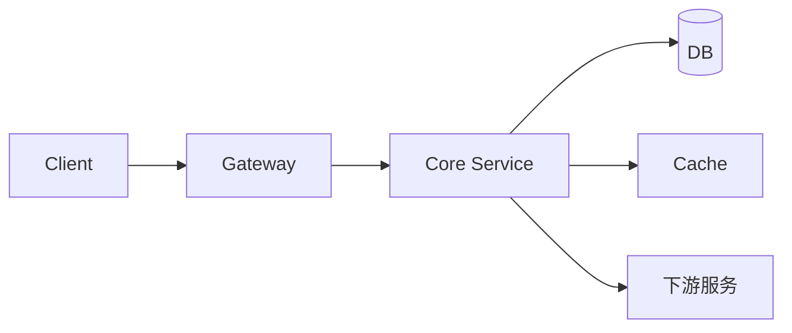

# {{项目名称}} · 面试 Q&A

> 本篇为 Demo 占位文档，实际内容请替换为真实项目经验。

---

## 1. 项目概述

> 用 3-5 句话讲清楚：这个项目解决什么问题、核心指标是什么、你在其中的角色。

**核心指标示例**（替换为真实数据）：
- 系统 QPS / TP99 / 可用性
- 业务目标：如准确率、召回率、自动化率提升
- 技术亮点：如一致性保障、容错设计、性能优化

---

## 2. 技术架构

> 用 mermaid 画架构图，标注清楚数据流与关键组件。



**关键设计点**（选填）：
- 为什么这样拆分？
- 瓶颈在哪里、如何优化？

---

## 3. 深度追问 · Q&A

### Q1: {{追问问题 1}}

**考察点**：`{{如：架构设计 / 一致性 / 性能优化}}`

**直接回答**：

{{给出可直接复述的答案，避免"我做了什么"，突出"为什么这样做"}}

**追问扩展**：

- {{如果被追问 XXX，会怎么答}}
- {{如果被追问 YYY，怎么用指标说服面试官}}

**发散 tip**：

> {{一个相关的工程实践或社区经验，增加记忆点}}

---

### Q2: {{追问问题 2}}

**考察点**：{{如：容错 / 可观测}}

**直接回答**：

{{同上}}

**追问扩展**：

- {{...}}

**发散 tip**：

> {{...}}

---

## 4. 代码骨架

> 贴核心代码片段，标注清楚自己在其中的编写/设计部分。

```python
# {{伪代码示例，替换为真实代码}}
def core_functionality(input_data: InputSchema) -> OutputSchema:
    """
    核心逻辑：{{一句话描述}}
    时间复杂度：O({{n}}) | 空间复杂度：O({{n}})
    """
    # 关键步骤 1：{{为什么这样写}}
    intermediate = transform(input_data)

    # 关键步骤 2：{{边界情况处理}}
    if not validate(intermediate):
        raise ValidationError()

    return process(intermediate)
```

**自己负责的部分**：
- {{模块 A}}：主导设计，核心逻辑编写
- {{模块 B}}：独立完成，承接上游 X，下游 Y

---

## 5. 指标数据

| 指标 | 改进前 | 改进后 | 手段 |
|------|--------|--------|------|
| {{指标 A}} | {{X%}} | {{Y%}} | {{优化方法}} |
| {{指标 B}} | {{Xms}} | {{Yms}} | {{缓存/异步/算法}} |

> 指标要有对比，有手段说明，面试官必问"怎么衡量的"。

---

## 6. 失败案例 & 反思

> 面试官喜欢问"你踩过什么坑"。提前准备一个真实的失败/教训。

**场景**：
{{描述一次失败经历}}

**根因**：
{{分析根本原因}}

**后续改进**：
{{采取了什么行动，避免重蹈覆辙}}

---

## 7. 反向引导地图

> 你想在面试里引导面试官问什么？提前埋好钩子。

| 你想引导的方向 | 埋的点（面试时自然带出） |
|---------------|------------------------|
| {{如：强调平台架构能力}} | "我们当时也考虑过用 XX，但最终选了 YY，原因是..." |
| {{如：强调性能优化经验}} | "这个接口 TP99 从 500ms 优化到 80ms，关键是..." |

---

> 配合 [复习资料索引](../review/README.md) 食用效果更佳。
