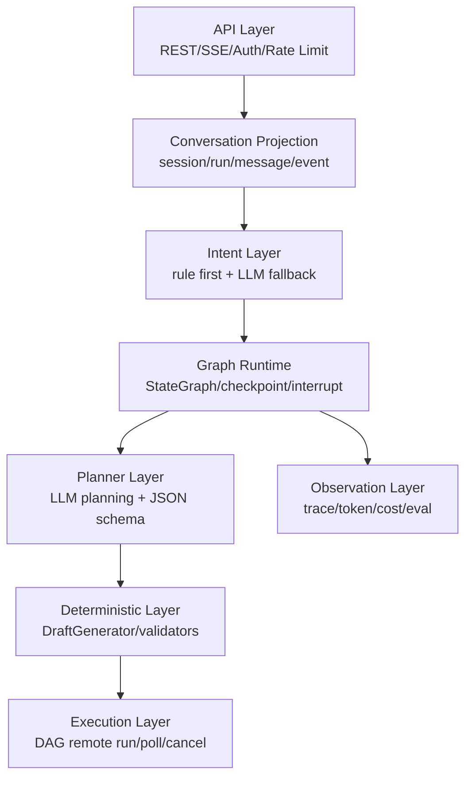
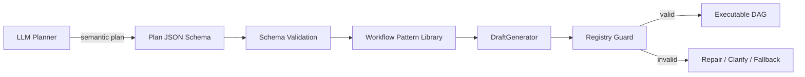

# AI Agent 与 LangGraph 工程化复习

## 1. 先建立正确概念

### Workflow vs Agent

面试官很可能问你“什么是 Agent”。不要只说“能调用工具的大模型”。更好的回答是：

- **Workflow**：LLM 和工具按照预定义代码路径执行，流程可控、适合稳定任务。
- **Agent**：LLM 动态决定下一步、工具调用和任务路径，适合开放问题，但成本、延迟和不确定性更高。
- **生产系统通常是混合形态**：用 workflow 管边界，用 agentic planning 处理开放语义，用 deterministic code 保证执行可靠。

Anthropic 的建议是先从最简单、可组合的模式开始，只有当任务复杂度真的需要模型动态决策时再提高 agent autonomy。这个观点非常适合解释你的 “Planner + 确定性装配” 设计。

## 2. LangGraph 的核心价值

LangGraph 适合生产级 Agent Runtime 的原因：

- **StateGraph**：把多阶段流程显式建模，不把状态藏在 prompt 里。
- **Checkpoint / Persistence**：每个 super-step 保存状态，支持 thread、memory、time travel、fault tolerance。
- **Interrupt / Resume**：适合 Human-in-the-loop，用户确认后从断点恢复。
- **Streaming**：可把阶段、token、工具调用、状态更新推给前端。
- **Subgraph**：复杂任务可以分层，例如主创作图 -> 分镜子图 -> DAG 装配子图。

### 典型面试回答

> 我选择 LangGraph 不是因为它“更火”，而是因为我们的问题是长流程、强状态、可中断、可恢复。普通 Agent loop 很难表达“用户在第 4 阶段选择 B 后，从 checkpoint 恢复并只重跑后续节点”这种需求。

## 3. 生产级 Agent Runtime 分层

### 每层要能讲的点

| 层 | 面试官会问 | 你的回答重点 |
|---|---|---|
| API | 为什么 SSE？ | 单向事件流、HTTP 友好、断线重连、适合 run event |
| Projection | 为什么要 session/run/message/event？ | 读模型和恢复展示，不把 UI 状态绑死在 graph 内 |
| Intent | 为什么规则先行？ | 高频低价值指令省成本，低置信再走 LLM |
| Graph | 为什么 checkpoint？ | 长流程、HITL、恢复、回放 |
| Planner | 为什么 JSON Schema？ | 让模型输出可解析、可校验、可重试 |
| Deterministic | 为什么装配器？ | DAG 结构必须稳定，不能靠模型猜 handle |
| Observation | 为什么 trace/eval？ | Agent 上线后必须能定位质量和成本问题 |

## 4. Planner + Deterministic Assembly 模式

### 问题

LLM 直接输出完整 DAG 经常出现：

- node type 幻觉。
- edge targetHandle 不存在。
- slot 类型不匹配。
- custom_config 缺字段。
- Canvas layout 不符合产品约定。
- 输出 JSON 格式正确但业务不可执行。

### 解法

### 面试金句

> LLM 负责创意理解和高层规划，代码负责结构装配和执行正确性。这样不是削弱 Agent，而是把模型自由度放在最有价值的位置。

## 5. Checkpoint 设计要点

### State 不应该存什么

- 不存大图片、视频、音频内容，只存 URI 和元数据。
- 不存完整无限历史，只存结构化决策、必要最近对话和摘要。
- 不存临时连接状态，例如当前 SSE socket。
- 不存不可序列化对象，例如 SDK client、数据库连接。

### State 应该存什么

- current_stage。
- user_spec：比例、时长、镜头数、风格。
- selected_story / selected_shots。
- planner_plan。
- dag_draft_ref。
- pending_interrupt：待用户确认的 action 或 options。
- error_context：可恢复错误信息。

## 6. Human-in-the-loop 模式

面试里要区分三类 HITL：

- **Notify**：只通知，不需要用户动作。
- **Question**：缺信息，问用户。
- **Review**：高风险动作前让用户批准。

在你的项目中：

- 规格确认属于 Question。
- 故事 A/B/C 选择属于 Question。
- 发布 Command、外部执行、覆盖已有 DAG 可归为 Review。
- 长任务进度事件属于 Notify。

## 7. Agent 设计模式速记

| 模式 | 适用场景 | 风险 |
|---|---|---|
| Prompt Chaining | 明确阶段串联 | 延迟增加 |
| Routing | 多意图分类分发 | 误分类影响下游 |
| Parallelization | 多路生成/评审/投票 | 成本增加 |
| Orchestrator-Workers | 子任务动态拆分 | trace 和汇总复杂 |
| Evaluator-Optimizer | 有明确评价标准的迭代优化 | 容易循环过长 |
| ReAct Loop | 需要边思考边用工具 | 不适合强约束流程 |
| Plan-and-Execute | 先规划再执行 | plan 过期或过粗 |

你的项目主模式：**Routing + Prompt Chaining + Plan-and-Execute + Deterministic Assembly + HITL**。

## 8. 必背问题

### LangGraph 和传统状态机差异？

传统状态机也能做流程控制，但 LangGraph 提供了面向 Agent 的持久化、thread、interrupt/resume、streaming、subgraph 和工具生态。生产里重点不是“状态机能不能写”，而是围绕长流程 Agent 的恢复、回放和可观测是否足够标准化。

### Agent 怎么避免无限循环？

- max iterations / max tool calls。
- 每阶段明确终止条件。
- 工具结果必须改变状态，否则阻断重复调用。
- 对同一错误设置 retry budget。
- LLM 输出 action 前做 schema 和 business validation。
- trace 中检测重复轨迹并进入 fallback 或人工确认。

### 怎么处理模型输出 schema 失败？

先区分语法失败、schema 失败和业务失败：

- 语法失败：JSON repair 或低温重试。
- schema 失败：把 validation error 反馈给模型一次修复。
- 业务失败：不要盲目重试，进入 fallback、澄清或确定性默认值。

## 9. 官方与高质量资料

- LangGraph Persistence：<https://docs.langchain.com/oss/python/langgraph/persistence>
- LangGraph Human-in-the-loop：<https://docs.langchain.com/oss/python/langchain/frontend/human-in-the-loop>
- LangChain / LangGraph 1.0：<https://www.langchain.com/blog/langchain-langgraph-1dot0>
- Building LangGraph：<https://www.langchain.com/blog/building-langgraph>
- Anthropic Building Effective Agents：<https://www.anthropic.com/engineering/building-effective-agents>
- 12 Factor Agents：<https://www.humanlayer.dev/blog/12-factor-agents>
- LangGraph GitHub：<https://github.com/langchain-ai/langgraph>
