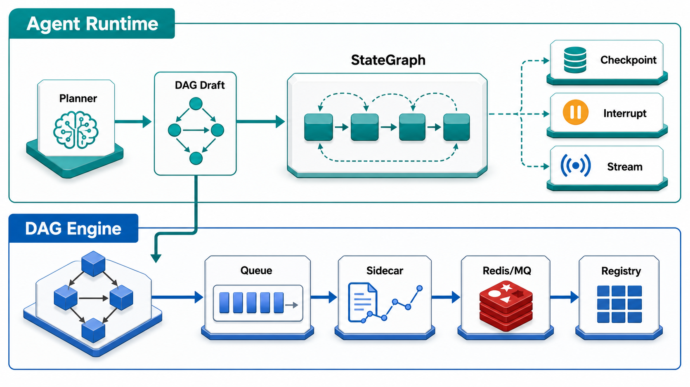
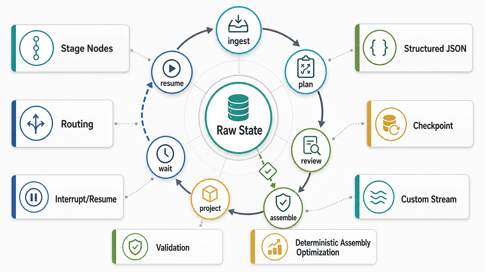

# dag-engine 与 LangGraph 工程化复盘



> 本文分析对象是 `/Users/mac/Code/Arch/dag_engine`。结论不是“这个项目像不像 LangGraph”这么简单，而是要分清两套运行时：`engine/` 是 DAG（Directed Acyclic Graph，有向无环图）执行引擎，`agent/` 是基于 LangGraph（LangChain 的低层 agent 编排框架）的长流程 Agent Runtime（智能体运行时）。

## 第一块：dag-engine 整体设计是不是借鉴了 LangGraph

### 1. 先给结论

`dag_engine` 整体不是一个“仿 LangGraph”的项目。它的底层 `engine/` 更像传统 workflow engine（工作流引擎）：读入 DAG JSON，按边依赖做拓扑调度，加载 handler（处理函数），执行节点，记录 trace（追踪）、nodemap（节点状态表）和结果。这个部分没有依赖 LangGraph，也没有 LangGraph 的 StateGraph（状态图）、checkpoint（检查点）、interrupt（中断）这些原语。

但 `agent/` 模块是明确借用了 LangGraph 的架构能力，而且是直接使用 LangGraph，而不是口头借鉴。源码里有这些直接证据：

| 证据 | 源码位置 | 说明 |
|---|---|---|
| `StateGraph`、`START` | `agent/runtime.py` | 用 LangGraph 建 agent 阶段图 |
| `InMemorySaver`、`PostgresSaver` | `agent/runtime.py` | 用 checkpointer（检查点保存器）保存图状态 |
| `Command`、`interrupt` | `agent/runtime.py` | 用于 interrupt/resume（中断/恢复） |
| `graph.stream(..., stream_mode="custom")` | `agent/runtime.py` | 用 custom stream（自定义流）把 planner 事件发给前端 |
| `thread_id = session_id` | `agent/runtime.py` | 把 LangGraph thread（会话线程）绑定到业务 session |
| `checkpoint_projection` | `agent/sql/agent_graph_schema.sql`、`agent/repository.py` | 把 LangGraph 历史快照投影到业务查询表 |

所以更准确的说法是：`dag_engine` 不是从 LangGraph 复制出来的，但它在演进成“DAG 执行底座 + LangGraph Agent 编排层”的双运行时架构。

### 2. 底层 engine 是什么架构

`engine/dag_executor.py` 是核心。它做的事情很传统，也很工程化：

1. 把 `dag_json["nodes"]` 变成 `node_id -> node` 字典。
2. 读取 `edges`，维护 `in_degree`（入度）和 `ready`（就绪队列）。
3. 入度为 0 的节点先入队。
4. `run_node()` 成功后减少下游节点入度。
5. 下游入度归 0 后加入 ready queue（就绪队列）。
6. 通过 `asyncio.create_task` 并发执行可并行节点。
7. `FIRST_COMPLETED` 返回后继续调度。
8. 某节点失败时设置 `failed=True`，触发 fail-fast（快速失败），取消未完成任务。

这是一套 DAG executor（DAG 执行器），不是 LangGraph runtime（LangGraph 运行时）。LangGraph 的核心概念是 shared state（共享状态）、nodes（节点）、edges（边）、reducers（归约器）、checkpoint（检查点）和 thread（会话线程）。而这里的核心是拓扑排序、节点结果引用、handler 加载、任务取消和节点状态落库。

`engine/` 还有几个关键组件：

| 组件 | 作用 | 和 LangGraph 的关系 |
|---|---|---|
| `NormalNodeRunner` | 加载远程 handler 并执行普通节点 | 更像任务执行器，不是 Agent node |
| `SubDAGRunner` | 支持 `%workflow` 子 DAG（subgraph，子图） | 和 LangGraph subgraph 概念相似，但实现独立 |
| `SystemNodeRunner` | 支持 `*switch` 这类系统节点 | 类似 conditional edge（条件边），但在 DAG 节点内实现 |
| `DAGSidecar` | before/after hook（钩子）、nodemap、trace、Kafka 通知 | 类似 observability（可观测性）层 |
| `NodeQueueManager` | 按模型做并发限制和 queue（队列） | 更像模型资源调度，不是 LangGraph 内核 |
| `MQTaskManager` | run 入 MQ、Redis 恢复、取消、状态持久化 | 是分布式任务层 |

这套设计的重点是“把一个已确定的 DAG 跑完”。它关心的是执行正确性、资源控制、节点状态、结果序列化和失败传播。

### 3. agent 层为什么需要 LangGraph

`agent/` 面对的问题完全不同。它不是执行一个已确定的 DAG，而是让用户在多轮对话里逐步确认一个 DAG draft（DAG 草稿）：

```text
intent
  -> format_confirm
  -> synopsis_choice
  -> core_elements
  -> storyboard
  -> music
  -> transition_sfx
  -> dag_draft
```

这些阶段都有用户选择、模型生成、局部重试、卡片化消息、SSE（Server-Sent Events，服务器发送事件）流式反馈和恢复需求。用普通函数链可以写出来，但会很快遇到几个问题：

1. 用户刷新页面后，流程停在哪个阶段？
2. 用户选择 B 后，怎样只从当前阶段继续，而不是重跑前面的 LLM 调用？
3. 每一轮 response（响应）如何和 run、message、event、checkpoint 关联？
4. streaming（流式输出）中间事件和最终业务消息如何分开？
5. 阶段图以后要插入 review（人工审核）或 tool approval（工具审批）时，如何不把代码写成 if/else 地狱？

LangGraph 解决的正是这类 long-running stateful agent（长流程有状态智能体）问题。官方 Graph API 把 agent workflow（智能体工作流）拆成三件事：State（状态）、Nodes（节点）、Edges（边）。`agent/runtime.py` 基本也是按这个模型落地：

| LangGraph 概念 | dag_engine agent 实现 |
|---|---|
| State（状态） | `AgentGraphState`，包含 session、stage、script_spec、workflow_plan、dag_current、messages、logs、pending_interrupt |
| Nodes（节点） | `_node_ingest_turn`、`_node_handle_format_confirm`、`_node_handle_storyboard`、`_node_project_turn` 等 |
| Edges（边） | `START -> ingest_turn`，再由 `_route_after_ingest` 路由到当前 stage |
| Checkpointer（检查点保存器） | 默认 `InMemorySaver`，生产用 `PostgresSaver` |
| Thread（会话线程） | `{"configurable": {"thread_id": session_id}}` |
| Interrupt（中断） | `_node_await_user_turn` 调 `interrupt(pending)` |
| Resume（恢复） | `Command(resume=user_text, ...)` |
| Custom streaming（自定义流） | `get_stream_writer()` 写 `stage.started`、`planner.delta`、`message.created` |

这个设计不是“为了用 LangGraph 而用 LangGraph”。它把 LangGraph 放在了正确的位置：管理长流程 agent 的状态和恢复，而不是替代底层 DAG 执行器。

### 4. 两套运行时的分工

可以把当前架构理解成上下两层：

| 层 | 负责什么 | 不负责什么 |
|---|---|---|
| Agent Runtime（智能体运行时） | 多轮对话、阶段推进、LLM planning（模型规划）、interrupt/resume、checkpoint、SSE 事件、DAG draft 生成 | 不直接调度 GPU 模型节点，不直接跑工作流 |
| DAG Engine（DAG 执行引擎） | 拓扑调度、handler 执行、SubDAG、sidecar trace、MQ/Redis、模型队列、cancel（取消） | 不负责对话策略，不负责用户确认和长流程会话恢复 |

这层分工是合理的。LangGraph 很适合 agent orchestration（智能体编排），但它不是一个完整的媒体生成 DAG 执行平台。`dag_engine` 的执行层有自己的业务资产：Registry（注册表）、远程 workflow、ReactFlow 画布结构、`flow_info`、模型并发队列、Kafka trace 和 MQ worker。这些不是 LangGraph 默认要解决的问题。

所以面试或架构复盘时，应该这样讲：

> `dag_engine` 底层是自研 DAG workflow engine，上层 `agent` 模块使用 LangGraph 管理长流程会话。它借鉴 LangGraph 的不是“图结构”本身，而是 stateful agent runtime（有状态智能体运行时）的工程思想：显式状态、阶段节点、条件路由、checkpoint、interrupt/resume、streaming 和可回放历史。

### 5. 这套设计里最像 LangGraph 的点

第一是显式状态。`AgentGraphState` 没把流程状态藏在 prompt（提示词）里，而是把 `stage`、`script_spec`、`workflow_plan`、`dag_current`、`messages`、`logs`、`pending_interrupt` 都放进结构化 state（状态）。这符合 LangGraph 官方 “keep state raw, format prompts on-demand”（状态保存原始数据，需要时再格式化 prompt） 的建议。

第二是 checkpointer + projection（投影模型）。LangGraph 的 checkpoint 保存执行快照，业务库里的 `session_projection`、`run_projection`、`message_projection`、`event_projection`、`checkpoint_projection` 支持列表页、详情页、日志页和历史页查询。也就是说，checkpoint 负责恢复，projection 负责读模型。这是正确分层。

第三是 interrupt/resume。当前每轮结束都会设置：

```python
"pending_interrupt": {"kind": "user_turn", "stage": session.stage}
```

然后 `await_user_turn` 节点调用 `interrupt(pending)` 暂停图执行。用户下一次输入时，runtime 发现 `pending_interrupt` 存在，就用 `Command(resume=user_text, ...)` 恢复。这和 LangGraph 官方 HITL（human-in-the-loop，人在回路中）模式一致。

第四是 custom stream。`stream_turn()` 使用 `graph.stream(..., stream_mode="custom")`，内部 `_stream_event()` 通过 `get_stream_writer()` 发事件。这使前端可以分别消费 `planner.delta` 这种过程事件，以及 `message.created` 这种最终业务事件。

第五是 planner（规划器）和 deterministic assembly（确定性装配）分离。LLM 只输出语义计划和工作流选择，`DraftGenerator` 用 Registry 规则装配真实 DAG。这个点非常关键，因为生产系统不能让模型自由编造 node func（节点函数）、targetHandle（目标句柄）和 canvas metadata（画布元数据）。

### 6. 这套设计没有完全照搬 LangGraph 的点

`engine/` 的执行层没有使用 LangGraph 的 reducer（归约器）、Send（动态发送）、Command routing（命令式路由）、checkpoint super-step（超级步检查点）。它自己维护 `results`、`globals`、`nodemap`、`ready`、`in_degree` 和 Redis 状态。

这不是问题。因为两者抽象层级不同：

```text
LangGraph: 管 agent 决策流、状态流、用户中断和恢复
DAGExecutor: 管确定性 DAG 的节点依赖、执行、取消、资源队列和结果传播
```

如果强行用 LangGraph 替代 `DAGExecutor`，反而会丢掉当前执行层已经做好的能力：模型级 semaphore（信号量）并发控制、MQ worker、Redis lazy hydration（懒加载恢复）、sidecar nodemap、子 DAG 错误向上汇总、`flow_info` 画布结构等。

### 7. 第一块总结

`dag_engine` 的整体设计可以说“在 agent 层采用了 LangGraph，在执行层保留了自研 DAG 引擎”。这是比“借鉴了 LangGraph”更专业的表述。

更进一步说，这个项目真正的架构价值在于双运行时边界：

1. **Agent Runtime** 处理不确定性：用户意图、LLM 输出、阶段确认、暂停恢复。
2. **DAG Engine** 处理确定性：节点依赖、任务执行、模型队列、状态机、结果输出。
3. 中间用 **DAG Draft** 作为契约：上层生成结构化草稿，下层只接受可校验的 DAG。

## 第二块：agent 模块用了哪些 LangGraph 最佳实践，以及优化点



### 1. 最佳实践一：把流程拆成 stage nodes（阶段节点）

LangGraph 官方建议先把要自动化的流程拆成离散 nodes（节点），再定义 transitions（转换）。`agent/runtime.py` 正是这样做的：

| 阶段节点 | 业务含义 |
|---|---|
| `ingest_turn` | 接收用户本轮输入，写 user message（用户消息），更新语言策略 |
| `workflow_understanding` | 分析已有 DAG，输出 summary（摘要）和 slot suggestions（槽位建议） |
| `intent` | 判断是否是创意视频请求 |
| `format_confirm` | 确认画幅和时长 |
| `synopsis_choice` | 让用户选择三种故事方向 |
| `core_elements` | 生成主体、主题、风格、视觉钩子 |
| `storyboard` | 生成分镜 |
| `music` | 生成音乐建议 |
| `transition_sfx` | 生成转场/音效并装配 DAG draft |
| `dag_draft` | 输出最终草稿 |
| `project_turn` | 保存 state，投影 message/event/dag |
| `await_user_turn` | 调用 interrupt 等待用户下一轮输入 |

这个拆法比单个巨大 agent loop（智能体循环）更容易维护。每个节点只负责一个阶段，失败点、streaming 事件和 state update（状态更新）都更清楚。

可以把它看成一种 product-state-machine（产品状态机）和 LangGraph 的结合：产品阶段是业务确定的，LLM 只在部分节点里做语义工作。

### 2. 最佳实践二：State 保存原始结构，不保存拼好的 prompt

官方 `Thinking in LangGraph` 文档强调：state 应该存 raw data（原始数据），prompt 应该在 node 内按需格式化。当前代码基本符合这个原则：

| State 字段 | 保存内容 | 为什么合理 |
|---|---|---|
| `script_spec` | generation_type、aspect_ratio、duration_sec、shot_count、brief、synopsis、core_elements、shots、music | 这是可恢复的业务事实 |
| `workflow_plan` | generation_node_func、sequence_node_func、audio_generation_node_func、selected_workflow_ids | 这是语义计划到 workflow 的映射 |
| `dag_current` | 已生成的 DAG draft | 这是本轮可展示产物 |
| `messages` | 业务消息块，不是 provider 原始流 | 前端可直接渲染 |
| `logs` | session 事件日志 | 便于排查和回放 |
| `pending_interrupt` | 当前等待用户输入的阶段 | 恢复所需 |

对应地，`agent/llm_planner.py` 每次调用 LLM 时再把 `script_spec` 和 `planning_context` 格式化进 prompt。这种做法有两个好处：

1. prompt template（提示词模板）可以迭代，不破坏历史 checkpoint。
2. state history（状态历史）里看到的是业务事实，而不是一大段模型输入文本。

优化点：`messages` 会随着 session 增长，长期会让 checkpoint 变大。LangGraph 官方 persistence（持久化）文档提到 checkpoint 会在 super-step（超级步）边界保存状态，长线程需要关注存储增长。这里可以考虑：

1. `messages` 在 LangGraph state 里只保留最近 N 条和 summary（摘要）。
2. 完整消息继续放 `message_projection`。
3. 对 append-heavy channel（追加型通道）评估 reducer（归约器）或 DeltaChannel（增量通道），降低 checkpoint 体积。

### 3. 最佳实践三：Routing（路由）先规则，后 LLM

当前 `AgentOrchestrator` 有明显的 rule-first（规则优先）倾向：

1. `is_creative_video_request()` 先判断是否进入创作流程。
2. `parse_format_selection()` 先解析画幅和时长。
3. `parse_confirmation_choice()` 先解析 continue/retry（继续/重试）。
4. `parse_core_element_field_revision()` 和 `parse_shot_revision()` 先识别局部修改。
5. 规则无法判断时，再调用 `workflow_planner.classify_*`。

这符合生产 Agent 的成本治理：明确指令不需要每次交给 LLM。LLM 适合处理模糊语义，不适合承担所有 if/else。

优化点：现在路由结果主要靠函数返回，缺少统一的 route trace（路由追踪）。建议每次 route 都写一条结构化日志：

```json
{
  "event": "agent.route.decided",
  "stage": "storyboard",
  "source": "rule|llm",
  "action": "revise_shot",
  "confidence": 0.86,
  "reason": "matched shot id"
}
```

这样 badcase（坏例）分析时能区分是路由错了，还是 planner 生成错了，还是装配器失败了。

### 4. 最佳实践四：Structured JSON（结构化 JSON）和 schema validation（模式校验）

`GeminiWorkflowPlanner` 的实现比较扎实：每个规划阶段都有 `response_json_schema`，并设置 `temperature=0.2`，还带 `max_retries`（最大重试次数）和 retry backoff（重试退避）。

几个关键点：

| 阶段 | schema 约束 |
|---|---|
| `plan_intent` | `script_spec` 必须包含 generation_type、aspect_ratio、duration_sec、shot_count、brief；必须返回三组 synopsis |
| `plan_core_elements` | 必须返回 selected_synopsis_id 和 core_elements |
| `plan_workflow` | 必须返回 selected_generation_workflow、shots、music |
| `classify_stage_intent` | action 限定在 continue、retry、revise_core_field、revise_shot、clarify |

这就是把“模型输出”变成“可校验中间表示”。文章里要强调：JSON 格式正确不等于业务正确，所以后面还有 `_normalize_*`、`_repair_planner_payload()`、`_resolve_workflow_plan_funcs()` 和 `DraftGenerator` 二次兜底。

优化点：

1. 对 planner payload（规划器载荷）增加版本号，例如 `planner_schema_version`，避免前后端或历史 checkpoint 在 schema 演进后不兼容。
2. 将 `_normalize_*` 的错误原因结构化，写入 `last_error`，让用户看到“缺少 workflow 选择”而不是泛化 500。
3. 对 LLM 输出加 contract tests（契约测试）：固定输入、固定 fake planner payload，验证 normalizer 和 repair 逻辑。

### 5. 最佳实践五：Checkpoint（检查点）和 thread_id（会话线程 ID）

LangGraph persistence（持久化）要求用 checkpointer 保存 graph state（图状态），并用 `thread_id` 找回同一条执行历史。当前代码：

```python
def _thread_config(self, session_id: str) -> dict[str, Any]:
    return {"configurable": {"thread_id": session_id}}
```

这个设计很正确。业务上 session_id 就是用户的一次 agent 会话，把它作为 LangGraph thread（会话线程）可以让 checkpoint、history、resume 全部围绕同一个 ID 组织。

生产模式里，`AgentGraphRuntime.from_postgres_pool()` 使用 `PostgresSaver`，同时 `PostgresAgentRepository` 又保存 `session_projection`、`run_projection`、`message_projection`、`event_projection` 和 `checkpoint_projection`。这说明作者意识到一个现实问题：LangGraph checkpoint 适合恢复，不适合直接做所有业务列表查询，所以要加 projection（投影）表。

优化点：

1. 明确 checkpointer 表和业务 projection 表的一致性边界。比如 graph checkpoint 成功但 `repository.save_state()` 失败时，恢复用哪一边为准？
2. `get_history()` 当前从 LangGraph `get_state_history()` 再保存到 `checkpoint_projection`。可以在 run 完成后异步保存，避免 response 延迟受历史扫描影响。
3. 需要为 checkpoint 做清理策略。长会话、长消息和 DAG draft 都会让状态变大。

### 6. 最佳实践六：Interrupt/Resume（中断/恢复）实现 HITL

LangGraph 官方 interrupt（中断）模式适合 human-in-the-loop（人在回路中）：图执行到需要外部输入的位置就暂停，保存状态，用户输入后再 resume（恢复）。

当前实现很接近最佳实践：

1. 每个业务阶段结束后，`_finalize_turn()` 生成 assistant message（助手消息）。
2. 它设置 `pending_interrupt={"kind": "user_turn", "stage": session.stage}`。
3. `project_turn` 保存 state，发送 message 和 stage events。
4. `await_user_turn` 调 `interrupt(pending)`。
5. 下一轮输入用 `Command(resume=user_text, ...)` 恢复。

这比“前端自己记 stage，后端每次从头判断”可靠得多。因为中断点是 graph checkpoint 体系的一部分。

但这里有两个需要注意的细节：

第一，官方文档强调 interrupt 节点恢复时会从该节点开头重跑，所以 interrupt 前的副作用要 idempotent（幂等）。当前 `_node_await_user_turn` 基本只做 `interrupt()` 和清理字段，副作用很少，这是好的。真正的消息保存和事件发送在前一个 `project_turn` 节点完成，降低了重复副作用风险。

第二，当前代码在 resume 输入里用了 `Command(resume=user_text, update=update_payload)`。最新官方 interrupts 文档强调，用于恢复的输入主要是 `Command(resume=...)`，`update/goto/graph` 更常见于节点返回。这个写法在当前版本可能可用，但建议复核 LangGraph 版本语义。更稳的做法是把 `current_run_id`、`request_locale` 包进 resume payload，或者在 resume 前用 `graph.update_state()` 写入必要字段。

### 7. 最佳实践七：Custom Stream（自定义流）驱动前端体验

`stream_turn()` 使用：

```python
self.graph.stream(command_or_input, config, stream_mode="custom")
```

内部 `_stream_event()` 调 `get_stream_writer()`，把 planner 中间输出映射成：

```text
stage.started
planner.thought_summary
planner.delta
stage.completed
message.created
stage.changed
dag_draft.replaced
message.completed
```

这很接近 LangGraph 官方 streaming（流式输出）实践：LangGraph 不要求你只能流 LLM token（令牌），也可以流自定义业务事件。对于这个产品来说，用户更关心“正在生成分镜”“正在装配 DAG”“草稿已替换”，而不是只看 token 一个字一个字冒出来。

优化点：

1. 给 SSE event 增加 `run_id`、`seq`、`stage`、`created_at`，前端可以去重和断线续接。
2. 对 `planner.delta` 做限流或采样，避免大 JSON delta 造成 UI 抖动。
3. 让 `message.completed` 带最终 state version（状态版本），前端可以判断本地缓存是否落后。

### 8. 最佳实践八：Planner + Deterministic Assembly（规划器 + 确定性装配）

这是 `agent` 模块最值得深入讲的部分。

普通 LLM 直接输出完整 DAG 会很危险，常见问题包括：

1. 编造不存在的 workflow id。
2. edge targetHandle（目标句柄）不匹配。
3. input/output type（输入输出类型）不一致。
4. canvas `flow_info` 缺字段。
5. node args（节点参数）引用错了，比如 `@shot_1.output` 写成不存在的 id。
6. JSON 语法正确，但业务不可执行。

当前代码用三层防线解决：

| 防线 | 源码 | 作用 |
|---|---|---|
| LLM planner | `agent/llm_planner.py` | 只让模型选 workflow、生成 shots、music，不让它随意拼完整 DAG |
| Orchestrator repair/resolve | `agent/orchestrator.py` | 把 symbolic key（符号键）解析成真实 Registry workflow id |
| DraftGenerator | `agent/draft_generation_skill.py` | 按真实规则生成 nodes、edges、flow_info、output_schema |

特别是 `_resolve_workflow_plan_funcs()` 的设计很好。它处理了一个真实生产 bug：模型可能返回 `video_multi_generation` 这种 preferred_workflows key（偏好工作流键），但真实 DAG 需要的是 `run_t2v_format` 这类 workflow id。代码按顺序解析：

1. 如果已经是真实 workflow id，就保留。
2. 如果是 preferred_workflows key，就映射到真实 id。
3. 再从 selection_rules（选择规则）里找 fallback。
4. 最后扫描 relevant_workflows（相关工作流）做 capability match（能力匹配）。

这就是“LLM 负责语义，代码负责结构”的典型落地。它不是削弱 agent，而是把 agent 的自由度放在最有价值的地方。

优化点：

1. `DraftGenerator` 现在负责很多规则，建议把规则拆成 validator（验证器）和 assembler（装配器）。validator 输出可读错误，assembler 只负责构造。
2. 生成 DAG 后增加一次独立 `validate_dag_draft()`，检查 node id、func、edge、targetHandle、outputs、flow_info 双向一致性。
3. 对真实模板 pattern（范式）召回增加评分解释，例如命中了什么 content_type、shot_mode、workflow_refs。
4. 失败时可走 repair loop（修复循环）：把 validator error 回传给 planner，只允许改 workflow_plan，不允许重写整个 session。

### 9. 最佳实践九：Workflow vs Agent 边界清楚

LangGraph 官方 `Workflows and agents` 文档区分得很清楚：workflow（工作流）是预定义代码路径，agent（智能体）是模型动态决定过程和工具使用。当前 `agent` 模块采用的是混合形态：

| 部分 | 类型 | 原因 |
|---|---|---|
| 阶段推进 | Workflow | `intent -> format_confirm -> synopsis_choice` 是产品固定路径 |
| 用户意图解析 | Agentic decision（智能体式决策） | 用户可能说“重来”“改第二镜”“就按 B” |
| 分镜和音乐生成 | LLM planning | 需要创意和语义理解 |
| DAG 装配 | Deterministic code | 必须结构正确 |
| 用户确认 | HITL | 不能让模型替用户选择 |

这就是生产 Agent 更常见的形态：不是让模型控制一切，而是在 workflow 的边界内给模型有限决策权。

### 10. 目前最值得优化的点

第一，`transition_sfx` 现在更像一个自动阶段，但测试里可以看到从 `music` 到 `transition_sfx` 后还需要下一轮空输入才进入 `dag_draft`。这会让用户感到“我已经确认了，为什么还停在转场音效阶段”。建议把 `transition_sfx` 设计成 no-HITL（无需人工交互）内部节点：用户确认 storyboard/music 后，图可以连续执行 `transition_sfx -> dag_draft -> project_turn -> await_user_turn`，只在最终 dag_draft 中断。

第二，当前所有阶段共用一个 `pending_interrupt={"kind": "user_turn"}`。可以把 interrupt payload（中断载荷）做得更精确：

```json
{
  "kind": "choice_required",
  "stage": "synopsis_choice",
  "choice_key": "synopsis",
  "allowed_actions": ["select", "retry", "edit"]
}
```

这样前端和恢复逻辑都更稳定。

第三，LangGraph node（节点）没有显式 retry policy（重试策略）。现在 LLM planner 内部有重试，但 graph node 本身没有统一 retry/timeout（重试/超时）策略。建议对外部调用节点配置超时和 retry policy，避免一个 provider 卡死整个 graph。

第四，错误分类还可以更接近官方建议。官方把错误分成 transient error（瞬时错误）、LLM-recoverable error（模型可恢复错误）、user-fixable error（用户可修复错误）和 unexpected error（未知错误）。当前很多错误会直接抛出。建议 `last_error` 标准化：

| 错误类型 | 处理方式 |
|---|---|
| provider timeout（模型超时） | 自动 retry，仍失败则提示稍后重试 |
| planner payload invalid（规划结果非法） | 回到 planner repair |
| missing user info（缺用户信息） | interrupt 询问用户 |
| registry workflow missing（注册表工作流缺失） | fallback 或明确提示运维配置问题 |

第五，`AgentOrchestrator` 里 runtime 调用了很多 `_private_method`（私有方法）。这说明 `runtime` 和 `orchestrator` 边界还不够干净。建议把阶段处理整理成公开方法或 stage handler registry（阶段处理器注册表），例如：

```python
handlers = {
    "format_confirm": FormatConfirmHandler(...),
    "storyboard": StoryboardHandler(...),
}
```

这样新增阶段不会继续扩大 `AgentGraphRuntime`。

第六，DAG draft 的校验应该成为单独门禁。现在 `DraftGenerator` 很强，但还需要一个最终 guard（门禁）：

```text
workflow_plan
  -> resolve real workflow ids
  -> assemble draft
  -> validate graph structure
  -> validate canvas flow_info
  -> persist dag_current
```

这个 guard 可以直接产出前端可展示错误，也可以作为离线 eval（评测）的核心。

第七，checkpoint 与 projection 的一致性需要写成文档。现在有 LangGraph checkpoint、session state_json、message_projection、event_projection、checkpoint_projection 多份状态。应该明确：

1. 恢复执行以 LangGraph checkpoint 为准。
2. 页面查询以 projection 为准。
3. 每次 run 完成后把 checkpoint history 异步投影。
4. 如果 projection 落后，可以通过 `get_state_history()` 重建。

### 11. 面试里怎么讲这段项目

可以这样组织回答：

> 我们的底层 `dag_engine` 是自研 DAG 执行器，负责拓扑调度、SubDAG、模型队列、sidecar trace 和 MQ/Redis 状态，不是用 LangGraph 跑每个媒体生成节点。真正使用 LangGraph 的是 `agent` 模块，它把一次创作对话建模成 StateGraph：每个产品阶段是一个 node，`AgentGraphState` 保存可恢复的原始业务状态，`PostgresSaver` 做 checkpoint，`thread_id` 绑定 session_id，`interrupt/resume` 处理用户确认，`stream_mode=custom` 给前端推送 planner 和 message 事件。LLM 只做语义规划，最终 DAG 由 `DraftGenerator` 按 Registry 规则确定性装配。这样既有 agent 的灵活性，也能保证 DAG 结构稳定可执行。

如果追问“是不是借鉴 LangGraph”，可以补一句：

> 底层 DAG executor 没有借 LangGraph，它是传统拓扑执行器；上层 agent runtime 不只是借鉴，而是直接使用 LangGraph。架构上借鉴的是 LangGraph 对长流程 agent 的核心实践：显式 state、checkpoint、thread、interrupt/resume、custom streaming 和可回放历史。

### 12. 官方最佳实践对照清单

| LangGraph 官方建议 | 当前实现 | 评价 |
|---|---|---|
| 把流程拆成 nodes 和 edges | `StateGraph` 中 12 个节点，按 stage 路由 | 做到了 |
| state 存原始数据，prompt 按需格式化 | `script_spec`、`workflow_plan`、`dag_current` 都是结构化对象 | 做到了 |
| 用 checkpointer 支持 persistence（持久化） | `InMemorySaver` / `PostgresSaver` | 做到了 |
| 用 thread_id 绑定一次长流程 | `thread_id=session_id` | 做到了 |
| HITL 用 interrupt/resume | `pending_interrupt` + `interrupt()` + `Command(resume=...)` | 基本做到，需复核 `Command(update=...)` 输入用法 |
| custom stream 支持前端进度 | `stream_mode="custom"` + `get_stream_writer()` | 做到了 |
| durable execution 要关注 determinism（确定性）和 idempotency（幂等性） | interrupt 节点副作用少，DAG 装配确定性强 | 方向正确，还需系统化文档 |
| 错误要分类处理 | planner 内有 retry，业务错误部分结构化 | 可加强 |
| 长状态要控制 checkpoint 体积 | 目前 messages/dag_current 可能膨胀 | 需要优化 |
| 动态并行可用 Send | 当前分镜并行在 DAGExecutor 层处理，不在 LangGraph 层 | 合理，不必强用 |

### 13. 资料来源

- LangGraph `Thinking in LangGraph`：<https://docs.langchain.com/oss/python/langgraph/thinking-in-langgraph>
- LangGraph Graph API：<https://docs.langchain.com/oss/python/langgraph/graph-api>
- LangGraph Persistence：<https://docs.langchain.com/oss/python/langgraph/persistence>
- LangGraph Durable execution：<https://docs.langchain.com/oss/python/langgraph/durable-execution>
- LangGraph Interrupts：<https://docs.langchain.com/oss/python/langgraph/interrupts>
- LangGraph Streaming：<https://docs.langchain.com/oss/python/langgraph/streaming>
- LangGraph Workflows and agents：<https://docs.langchain.com/oss/python/langgraph/workflows-agents>
