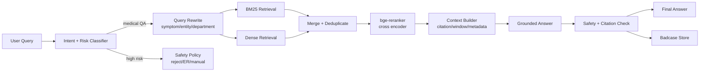
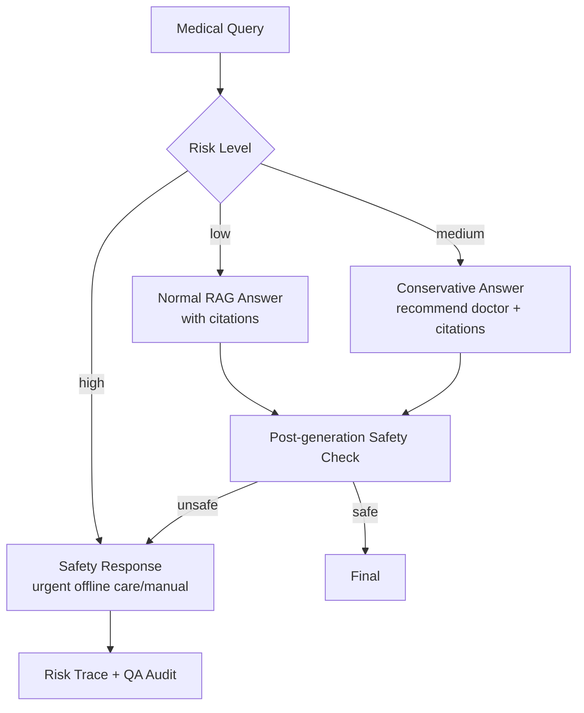

# RAG、混合检索与医疗问答复习


> 阅读目标：把 RAG 讲成“可评测的信息检索系统 + 有边界的生成系统”，而不是“向量库 + prompt”。参考 Draven 风格的长文组织方式，本文会同时给出链路图、源码骨架、指标口径和失败类型。

## 0. 本文地图

| 模块 | 必须掌握 | 面试风险 |
|---|---|---|
| Query Understanding | 意图、实体、风险、改写 | 只会说 embedding |
| Retrieval | BM25、Dense、过滤、融合 | 不知道召回覆盖和高位质量区别 |
| Rerank | Cross-encoder 精排 | 不知道 reranker 为什么慢但有效 |
| Context Builder | window、引用、多样性、证据不足 | 只会把 Top-K 全塞给模型 |
| Safety / Eval | 医疗边界、faithfulness、badcase | 只看生成效果，不看风险 |

## 1. RAG 的本质

RAG 不是“把文档塞进 prompt”，而是把外部知识作为可更新、可追溯的 non-parametric memory，与模型的 parametric memory 结合。经典 RAG 论文强调两个价值：

- 模型参数里的知识难以及时更新，外部检索可更新。
- 知识密集任务需要 provenance，检索片段能提供证据来源。

面试里要把 RAG 拆成四段：**query understanding -> retrieval -> reranking/context assembly -> grounded generation**。

### 面试官为什么问这个

RAG 是 AI 应用岗位最容易被问穿的领域。浅层回答通常停留在“切 chunk、embedding、存向量库、检索后回答”。深层回答要覆盖这些工程问题：

- 用户问题如何改写，是否需要多路 query。
- 检索失败是召回问题、重排问题还是知识源问题。
- Top-K 证据怎么进入上下文，是否保留引用和来源。
- 证据不足、证据冲突、高风险医疗问题如何处理。
- 指标如何定义，Top-3 命中率为什么比 Top-10 更贴近业务。

## 2. 医疗 RAG 链路图



## 3. BM25、Dense、Rerank 怎么讲

### BM25

适合：

- 疾病名、药品名、检查指标、医学术语。
- 精确关键词匹配。
- 可解释性较强。

短板：

- 同义词、口语化表达泛化弱。
- 对“我喘不上气，胸口发闷”这类表达可能不如 dense。

### Dense Retrieval

适合：

- 语义相近但字面不同。
- 用户口语、长问题、隐含意图。

短板：

- 专业名词、数字、否定、药品禁忌可能召回不稳。
- 向量分数解释性较弱。

### Reranker

适合：

- 对 Top-100/Top-200 候选做精排。
- 判断 query-doc 是否真正相关。
- 降低“语义像但医学关系不对”的候选。

面试金句：

> Bi-encoder 负责大规模召回，cross-encoder 负责小规模精排。RAG 质量不是单点模型决定，而是召回覆盖、重排精度、上下文组织和生成约束共同决定。

## 4. 混合检索融合策略

| 策略 | 优点 | 风险 |
|---|---|---|
| 分数归一加权 | 简单可控 | 不同检索器分数不可比 |
| RRF | 不依赖原始分数尺度 | rank 参数需要理解 |
| 分路召回 + rerank | 工程常用，效果稳定 | reranker 成本上升 |
| 按意图路由 | 对垂直场景更精细 | 分类错误影响召回 |

你可以说：医疗场景我倾向“分路召回 + 去重 + rerank + 分桶评测”，因为不同 query 类型差异很大，先保证候选覆盖，再用 reranker 提升 Top-K。

### 源码形态：分路召回 + RRF + Rerank

真实代码会依赖具体 ES / Faiss / Qdrant SDK，但面试中可以用下面的伪代码讲清控制流：

```python
def retrieve(query: str, patient_context: dict) -> list[Passage]:
    request = understand_query(query, patient_context)
    if request.risk_level == "high":
        return []

    bm25_hits = elastic_bm25.search(
        query=request.keyword_query,
        filters=request.filters,
        size=80,
    )
    dense_hits = vector_index.search(
        embedding=embed(request.semantic_query),
        filters=request.filters,
        size=80,
    )

    merged = reciprocal_rank_fusion([bm25_hits, dense_hits], k=60)
    candidates = deduplicate_by_source_and_span(merged)
    ranked = reranker.score(query=request.original_query, passages=candidates[:120])
    return context_builder.select(ranked, max_tokens=2500, citation_required=True)
```

这段代码能引出几个关键点：

- query understanding 不是可有可无，它决定检索分路、过滤条件和安全策略。
- BM25 和 Dense 的分数不要直接相加，RRF 或 rerank 更稳。
- reranker 不负责全库召回，只负责候选精排。
- context builder 是独立模块，不是简单 `"\n".join(top_k)`。

### RRF 公式怎么解释

```text
score(d) = Σ 1 / (k + rank_i(d))
```

RRF 的优点是不用比较 BM25 分数和向量相似度的绝对值，只看文档在各路召回中的排名。面试里不用推公式，但要知道它解决的是“多路检索器分数尺度不可比”的问题。

## 5. Chunking 与上下文组织

### Chunking 关键点

- 不按固定 token 机械切，尽量保留标题、疾病、药品、适应症、禁忌、剂量等结构边界。
- chunk 太小会丢上下文，太大会引入噪声。
- 医疗知识要保留 source、更新时间、适用人群、风险等级。
- 同一疾病/药品的多个字段可做 parent-child 检索：小 chunk 召回，大 context 回填。

### Context Builder 要做什么

- 按 rerank 分数和多样性选择片段。
- 合并同源相邻片段。
- 去掉互相冲突或低权威来源。
- 保留引用 id，生成答案时强制引用。
- 对证据不足的 query 标记 low evidence。

### Context Builder 的设计模式

```text
candidate passages
  -> source authority filter
  -> conflict detection
  -> adjacent-window expansion
  -> diversity selection
  -> citation id injection
  -> low-evidence flag
  -> prompt context
```

不要把 context builder 讲成拼接字符串。它应该输出结构化上下文：

```json
{
  "evidence": [
    {
      "citation_id": "doc_42#p3",
      "title": "高血压用药注意事项",
      "authority": "clinical_guideline",
      "updated_at": "2025-04-10",
      "span": "孕妇、儿童、慢病患者需咨询医生后使用..."
    }
  ],
  "low_evidence": false,
  "conflicts": []
}
```

这样生成阶段才能被约束：关键结论必须引用 `citation_id`，证据不足时必须保守回答。

## 6. 医疗安全策略

### 高风险意图

- 急症：胸痛、呼吸困难、意识丧失、大出血、中风迹象。
- 处方/剂量：处方药怎么吃、儿童/孕妇剂量、药物混用。
- 诊断结论：让模型直接判断“我是不是某病”。
- 高危人群：孕妇、儿童、老人、慢病患者。
- 自伤/精神危机。

### 策略设计



面试重点：

- 医疗安全优先召回率，不追求少拦截。
- 不能只靠 LLM 判断，必须规则 + 模型 + 人工质检。
- 拒答要有帮助性，不是简单“我不能回答”。

## 7. RAG 评测体系

### Retrieval 评测

- Recall@K：正确证据是否在 K 个候选里。
- MRR：正确证据排得是否靠前。
- Top-3 Hit Rate：业务可感知的高位命中率。
- 分桶指标：疾病科普、症状咨询、药品问答、报告解读、科室推荐、高风险。

### Generation 评测

- Faithfulness：答案是否被证据支持。
- Citation Coverage：关键结论是否有引用。
- Helpfulness：是否解决用户问题。
- Safety：是否越过医疗边界。
- Refusal Accuracy：该拒答是否拒答，不该拒答是否正常回答。

### Badcase 闭环


失败类型要分类：

- 召回失败。
- 重排失败。
- 上下文噪声。
- 生成误读。
- 引用缺失。
- 风控漏判。
- 过度拒答。

### Badcase 复盘模板

| 字段 | 例子 | 用途 |
|---|---|---|
| query_type | 药品禁忌 / 症状咨询 / 检查报告 | 分桶看问题 |
| retrieval_hit | true / false | 判断召回是否失败 |
| rerank_position | 正确证据在第几位 | 判断重排是否失败 |
| context_noise | 高 / 中 / 低 | 判断上下文是否污染 |
| answer_supported | true / false | 判断生成是否忠实 |
| safety_decision | normal / conservative / reject | 判断安全策略 |
| fix_owner | retriever / reranker / prompt / policy | 明确修复归属 |

面试时补这一段，会显得你不是只做 demo，而是做过上线后的质量迭代。

## 8. 向量数据库与索引速记

### Faiss

- `IndexFlatL2/IP`：精确搜索，适合小规模或评测基准。
- `HNSW`：图索引，召回高、查询快，内存开销较高。
- `IVF`：倒排聚类，适合大规模，需要训练和调参。
- `PQ/SQ`：压缩向量，省内存但可能损失召回。

### HNSW 参数

- `M`：图连接数，越大召回越好、内存越高。
- `ef_construct`：建图搜索宽度，越大构建慢但质量高。
- `ef_search`：查询宽度，越大召回好但延迟高。

### Elasticsearch

- BM25 是传统强项。
- dense vector / kNN 支持语义检索。
- RRF 可融合多个 retriever，不需要直接比较原始分数。

### Qdrant/Milvus/pgvector

面试中如果被问选型：

- 已有 ES 文档生态和关键词检索，先考虑 Elasticsearch 混合检索。
- 需要独立向量库、过滤和高性能 ANN，可考虑 Qdrant/Milvus。
- 数据量不大、业务强依赖 PostgreSQL、希望架构简单，可考虑 pgvector。

## 9. 必背问题

### 为什么 Top-3 比 Top-10 更重要？

因为最终给 LLM 的上下文有限，用户也只感知高位证据。Top-10 召回高但 Top-3 差，生成仍可能引用错误片段。医疗问答尤其要关注高位命中和引用质量。

### RAG 什么时候不适合？

- 问题不依赖外部知识，直接模型即可。
- 知识源质量差或互相冲突，检索会放大问题。
- 需要严格事务数据，应该查数据库/API 而不是文档检索。
- 用户要的是操作执行，不是知识回答，应走 tool calling。

### 如何处理检索不到？

不要让模型硬答。可以：

- 改写 query 再检索。
- 放宽过滤或切换检索策略。
- 返回证据不足并建议补充信息。
- 高风险医疗问题直接安全兜底。

## 10. 与简历项目的映射

| 简历技术点 | 本文章节 | 相关深读 |
|---|---|---|
| 百度健康助手 · 日均十万级 query | §2 链路图 / §6 安全策略 | [简历正文 · 百度健康助手](../马震-15253371862-后端研发工程师.md#项目经历) |
| BM25 + Dense + Reranker 混合检索 | §3 - §4 | [Vector DB 选型 + Reranker 深入](./07-vector-db-reranker.md) |
| Top-3 命中率 70% → 88%+ | §4 RRF / §7 评测 | [Vector DB 选型 + Reranker 深入](./07-vector-db-reranker.md) |
| 引用溯源 / 医学幻觉降低 | §5 Context Builder | — |
| 多轮意图识别 92%+ | §6 策略设计 | [AI Agent 与 LangGraph 工程化](./01-ai-agent-langgraph.md) |
| 高风险拦截召回率 98%+ | §6 安全策略 | — |
| Elasticsearch + Faiss 自建检索 | §8 索引速记 | [Vector DB 选型 + Reranker 深入](./07-vector-db-reranker.md) |

## 11. 官方与高质量资料

- RAG NeurIPS 2020：<https://papers.nips.cc/paper/2020/hash/6b493230205f780e1bc26945df7481e5-Abstract.html>
- BGE Reranker：<https://bge-model.com/bge/bge_reranker.html>
- Faiss Indexes：<https://github.com/facebookresearch/faiss/wiki/Faiss-indexes>
- Elasticsearch kNN：<https://www.elastic.co/guide/en/elasticsearch/reference/current/knn-search.html>
- Elasticsearch RRF：<https://www.elastic.co/guide/en/elasticsearch/reference/current/rrf.html>
- Qdrant Indexing：<https://qdrant.tech/documentation/concepts/indexing/>
- Qdrant Search：<https://qdrant.tech/documentation/search/search/>
