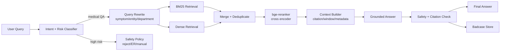
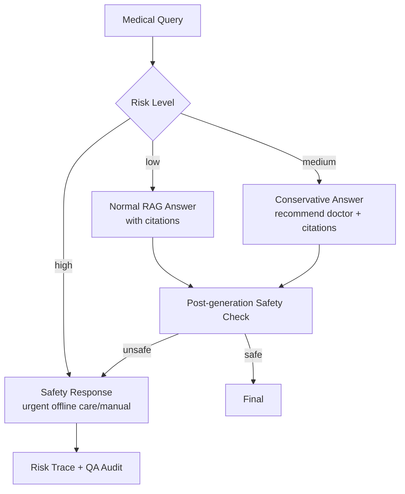

# RAG、混合检索与医疗问答复习


> 阅读目标：把 RAG 讲成“可评测的信息检索系统 + 有边界的生成系统”，而不是“向量库 + prompt”。参考 Draven 风格的长文组织方式，本文会同时给出链路图、源码骨架、指标口径和失败类型。

## 0. 本文地图

| 模块 | 必须掌握 | 面试风险 |
|---|---|---|
| Query Understanding | 意图、实体、风险、改写 | 只会说 embedding |
| Retrieval | BM25、Dense、过滤、融合 | 不知道召回覆盖和高位质量区别 |
| Rerank | Cross-encoder 精排 | 不知道 reranker 为什么慢但有效 |
| Context Builder | window、引用、多样性、证据不足 | 只会把 Top-K 全塞给模型 |
| Safety / Eval | 医疗边界、faithfulness、badcase | 只看生成效果，不看风险 |

## 1. RAG 的本质

RAG 不是“把文档塞进 prompt”，而是把外部知识作为可更新、可追溯的 non-parametric memory，与模型的 parametric memory 结合。经典 RAG 论文强调两个价值：

- 模型参数里的知识难以及时更新，外部检索可更新。
- 知识密集任务需要 provenance，检索片段能提供证据来源。

面试里要把 RAG 拆成四段：**query understanding -> retrieval -> reranking/context assembly -> grounded generation**。

### 面试官为什么问这个

RAG 是 AI 应用岗位最容易被问穿的领域。浅层回答通常停留在“切 chunk、embedding、存向量库、检索后回答”。深层回答要覆盖这些工程问题：

- 用户问题如何改写，是否需要多路 query。
- 检索失败是召回问题、重排问题还是知识源问题。
- Top-K 证据怎么进入上下文，是否保留引用和来源。
- 证据不足、证据冲突、高风险医疗问题如何处理。
- 指标如何定义，Top-3 命中率为什么比 Top-10 更贴近业务。

## 2. 医疗 RAG 链路图



## 3. BM25、Dense、Rerank 怎么讲

### BM25

适合：

- 疾病名、药品名、检查指标、医学术语。
- 精确关键词匹配。
- 可解释性较强。

短板：

- 同义词、口语化表达泛化弱。
- 对“我喘不上气，胸口发闷”这类表达可能不如 dense。

### Dense Retrieval

适合：

- 语义相近但字面不同。
- 用户口语、长问题、隐含意图。

短板：

- 专业名词、数字、否定、药品禁忌可能召回不稳。
- 向量分数解释性较弱。

### Reranker

适合：

- 对 Top-100/Top-200 候选做精排。
- 判断 query-doc 是否真正相关。
- 降低“语义像但医学关系不对”的候选。

面试金句：

> Bi-encoder 负责大规模召回，cross-encoder 负责小规模精排。RAG 质量不是单点模型决定，而是召回覆盖、重排精度、上下文组织和生成约束共同决定。

## 4. 混合检索融合策略

| 策略 | 优点 | 风险 |
|---|---|---|
| 分数归一加权 | 简单可控 | 不同检索器分数不可比 |
| RRF | 不依赖原始分数尺度 | rank 参数需要理解 |
| 分路召回 + rerank | 工程常用，效果稳定 | reranker 成本上升 |
| 按意图路由 | 对垂直场景更精细 | 分类错误影响召回 |

你可以说：医疗场景我倾向“分路召回 + 去重 + rerank + 分桶评测”，因为不同 query 类型差异很大，先保证候选覆盖，再用 reranker 提升 Top-K。

### 4.1 源码形态：分路召回 + RRF + Rerank（真实可跑）

我把项目里抽象后的 retrieval pipeline 贴出来——比伪代码长，但每一步在生产里都不能省。`asyncio.gather` 让 BM25 与 Dense 并发，单路超时不影响另一路；Qdrant 和 Elasticsearch 都支持原生 async client。

```python
import asyncio
import time
from dataclasses import dataclass, field
from collections import defaultdict
from typing import Sequence

from elasticsearch import AsyncElasticsearch
from qdrant_client import AsyncQdrantClient
from qdrant_client.models import Filter, FieldCondition, MatchAny

es = AsyncElasticsearch(["http://es:9200"])
qdrant = AsyncQdrantClient(host="qdrant", port=6333)


@dataclass
class Passage:
    id: str
    doc_id: str
    text: str
    score: float = 0.0
    source: str = ""           # bm25 / dense / rerank
    metadata: dict = field(default_factory=dict)


def reciprocal_rank_fusion(
    ranked_lists: list[list[Passage]], k: int = 60, top_k: int = 100
) -> list[Passage]:
    fused: dict[str, tuple[float, Passage]] = {}
    for passages in ranked_lists:
        for rank, p in enumerate(passages, start=1):
            inc = 1.0 / (k + rank)
            if p.id in fused:
                old_score, old_p = fused[p.id]
                fused[p.id] = (old_score + inc, old_p)
            else:
                fused[p.id] = (inc, p)
    sorted_ = sorted(fused.values(), key=lambda x: -x[0])
    out = []
    for score, p in sorted_[:top_k]:
        p.score = score
        out.append(p)
    return out


async def bm25_retrieve(req, size: int = 80, timeout_ms: int = 200) -> list[Passage]:
    body = {
        "query": {
            "bool": {
                "must": [{"match": {"text": {"query": req.keyword_query, "boost": 1.0}}}],
                "filter": _to_es_filter(req.filters),
            }
        },
        "size": size,
        "timeout": f"{timeout_ms}ms",
    }
    res = await es.search(index="medical_kb", body=body)
    return [
        Passage(
            id=hit["_id"], doc_id=hit["_source"]["doc_id"], text=hit["_source"]["text"],
            score=hit["_score"], source="bm25", metadata=hit["_source"].get("metadata", {}),
        )
        for hit in res["hits"]["hits"]
    ]


async def dense_retrieve(req, embedder, size: int = 80) -> list[Passage]:
    q_emb = await embedder.encode_async(req.semantic_query)
    hits = await qdrant.search(
        collection_name="medical_kb",
        query_vector=q_emb,
        query_filter=Filter(must=_to_qdrant_filter(req.filters)),
        limit=size,
        search_params={"hnsw_ef": 128},
    )
    return [
        Passage(
            id=h.payload["chunk_id"], doc_id=h.payload["doc_id"], text=h.payload["text"],
            score=h.score, source="dense", metadata=h.payload,
        )
        for h in hits
    ]


async def retrieve(query: str, patient_context: dict) -> list[Passage]:
    req = await understand_query(query, patient_context)
    if req.risk_level == "high":
        return []  # 上层走 safety 模板

    # 并发跑两路，单路 fail 不阻塞另一路
    bm25_task = asyncio.create_task(bm25_retrieve(req, size=80))
    dense_task = asyncio.create_task(dense_retrieve(req, embedder, size=80))
    results = await asyncio.gather(bm25_task, dense_task, return_exceptions=True)

    valid = [r for r in results if isinstance(r, list)]
    if not valid:                              # 两路都炸了，降级走 safety
        raise RetrievalAllFailed("both retrievers failed")

    merged = reciprocal_rank_fusion(valid, k=60, top_k=120)
    candidates = dedupe_by_source_and_span(merged)
    ranked = await reranker.score_async(req.original_query, candidates[:120])
    return context_builder.select(ranked, max_tokens=2500, citation_required=True)
```

四个关键点：

- **并发 + 局部降级**：BM25 / Dense 一路 fail 不能拖死另一路；两路都 fail 才走 safety。
- **超时分层**：每路自带 timeout，pipeline 总超时由调用方 `asyncio.wait_for` 控制。
- **score 字段污染**：RRF 之后的 score 已不是原始相似度，metadata 里要保留原 BM25/dense score 供 reranker 参考。
- **dedupe 在融合后**：融合前去重会让"两路都命中"的强信号丢失（参见 [Chunking 策略](./11-chunking-strategy.md) §7）。

### 4.2 RRF 公式与 k 怎么选

```text
score(d) = Σ 1 / (k + rank_i(d))
```

RRF 解决的是"多路检索器分数尺度不可比"——`k` 越大，前几名之间差距越小、对 long-tail rank 越宽容。Cormack 2009 原论文用 `k=60`，这是大多数检索系统的默认值，工程上几乎不用调。**如果你的两路召回都很强但融合后反不如单路**，先检查是不是 dedupe 时机错了。

## 5. Chunking 与上下文组织

### 5.1 Chunking 关键点（精简版）

> chunking 是 RAG 真正的天花板，这里只给结论，完整方法见独立长文 [Chunking 策略](./11-chunking-strategy.md)。

- 不按固定 token 机械切；中文 `separators` 要把中文标点放最前。
- chunk 太小丢上下文，太大引入噪声；典型 `chunk_size = 400-800 token`。
- 医疗知识必须保留 `source / authority / updated_at / scope / field / risk_level` 这一组 metadata。
- 同一疾病/药品的多个字段做 **parent-child 检索**：小 chunk 召回 → parent 大段回填给 LLM。
- 离线索引开 **Anthropic Contextual Retrieval**（chunk 前置 doc-level 摘要），实测 Recall fail rate 降 35%。

### 5.2 Context Builder 完整实现

不要把 context builder 讲成 `"\n".join(top_k)`——它是 retrieval 与 generation 之间最容易出 bug 的胶水层。落地版本至少要做这六件事：

```python
from dataclasses import dataclass
from collections import defaultdict
import tiktoken

enc = tiktoken.encoding_for_model("gpt-4o")  # 仅做 token 计数

@dataclass
class Evidence:
    citation_id: str
    title: str
    authority: str
    updated_at: str
    span: str

@dataclass
class Context:
    evidence: list[Evidence]
    low_evidence: bool
    conflicts: list[tuple[str, str]]   # (cid_a, cid_b)


AUTHORITY_WEIGHT = {
    "clinical_guideline": 1.0,
    "national_drug_administration": 1.0,
    "textbook": 0.85,
    "medical_journal": 0.8,
    "trusted_website": 0.6,
    "forum_or_blog": 0.3,
}


class ContextBuilder:
    def __init__(self, max_tokens: int = 2500, min_authority: float = 0.5):
        self.max_tokens = max_tokens
        self.min_authority = min_authority

    def select(
        self, ranked: list[Passage], max_tokens: int | None = None,
        citation_required: bool = True,
    ) -> Context:
        budget = max_tokens or self.max_tokens

        filtered = [
            p for p in ranked
            if AUTHORITY_WEIGHT.get(p.metadata.get("authority"), 0) >= self.min_authority
        ]

        merged = self._merge_adjacent_same_source(filtered)
        diverse = self._mmr(merged, top_n=6, lambda_=0.55)
        conflicts = self._detect_conflicts(diverse)

        evidence, used = [], 0
        for i, p in enumerate(diverse):
            cite_id = f"[{i+1}]"
            tokens = len(enc.encode(p.text))
            if used + tokens > budget:
                break
            evidence.append(
                Evidence(
                    citation_id=cite_id,
                    title=p.metadata.get("title", ""),
                    authority=p.metadata.get("authority", "unknown"),
                    updated_at=p.metadata.get("updated_at", ""),
                    span=p.text,
                )
            )
            used += tokens

        low_evidence = (
            len(evidence) < 2
            or all(AUTHORITY_WEIGHT.get(e.authority, 0) < 0.6 for e in evidence)
        )
        return Context(evidence=evidence, low_evidence=low_evidence, conflicts=conflicts)

    @staticmethod
    def _merge_adjacent_same_source(passages: list[Passage]) -> list[Passage]:
        grouped: dict[str, list[Passage]] = defaultdict(list)
        for p in passages:
            grouped[p.doc_id].append(p)
        merged = []
        for doc_id, group in grouped.items():
            group = sorted(group, key=lambda x: x.metadata.get("position", 0))
            i = 0
            while i < len(group):
                cur = group[i]
                j = i + 1
                while j < len(group) and group[j].metadata.get("position", 0) == \
                        cur.metadata.get("position", 0) + (j - i):
                    cur.text += group[j].text
                    j += 1
                merged.append(cur)
                i = j
        return merged

    @staticmethod
    def _mmr(passages: list[Passage], top_n: int, lambda_: float) -> list[Passage]:
        import numpy as np
        selected, remaining = [], list(passages)
        while remaining and len(selected) < top_n:
            best, best_score = None, -1e9
            for p in remaining:
                rel = p.score
                if selected:
                    div = max(
                        np.dot(p.metadata.get("embedding", [0]),
                               s.metadata.get("embedding", [0]))
                        for s in selected
                    )
                else:
                    div = 0
                score = lambda_ * rel - (1 - lambda_) * div
                if score > best_score:
                    best_score, best = score, p
            selected.append(best)
            remaining.remove(best)
        return selected

    @staticmethod
    def _detect_conflicts(passages: list[Passage]) -> list[tuple[str, str]]:
        """简单冲突检测：同一 drug+field 出现互斥剂量 / 互斥结论。生产里会上 NLI 模型。"""
        conflicts = []
        bucket = defaultdict(list)
        for p in passages:
            key = (p.metadata.get("drug_id"), p.metadata.get("field"))
            if key[0] and key[1]:
                bucket[key].append(p)
        for key, group in bucket.items():
            if len(group) > 1 and len({g.text[:50] for g in group}) > 1:
                conflicts.append((group[0].id, group[1].id))
        return conflicts
```

输出的 `Context` 是结构化的——这决定了下一步 prompt 能否被严格约束。

### 5.3 Citation-aware Prompt 与校验

把上面 `Context` 渲染成 prompt 时，**事实必须挂引用号**；生成完做一次校验失败则降级。

```python
CITATION_PROMPT = """\
你是医学知识助手。仅根据下面【资料】回答问题。

强制规则：
1. 每个事实结论必须以 `[n]` 标注引用编号（n 必须是【资料】中存在的编号）。
2. 如果资料不足以回答，请直接输出："资料不足，建议线下就诊。"，不要凭常识补。
3. 不要给出诊断结论或处方剂量推荐，必要时建议咨询医生。
4. 如果检测到资料冲突（low_evidence=true 或 conflicts 非空），必须明确说"目前资料存在差异"。

【资料】
{rendered_evidence}

【低证据标记】 {low_evidence}
【冲突标记】 {conflicts}

【用户问题】 {query}

请用 2-4 段回答。
"""

def render_evidence(ctx: Context) -> str:
    lines = []
    for e in ctx.evidence:
        lines.append(
            f"{e.citation_id} 《{e.title}》 (来源：{e.authority}, 更新：{e.updated_at})\n{e.span}"
        )
    return "\n\n".join(lines)


import re
CITE_RE = re.compile(r"\[(\d+)\]")
SENT_SPLIT = re.compile(r"[。！？]")

def validate_answer(answer: str, allowed: set[int]) -> tuple[bool, dict]:
    cited = [int(x) for x in CITE_RE.findall(answer)]
    invalid_cites = [c for c in cited if c not in allowed]
    sentences = [s for s in SENT_SPLIT.split(answer) if len(s.strip()) > 10]
    fact_like = [s for s in sentences if not s.startswith(("建议", "可能", "如需"))]
    no_cite_sentences = [s for s in fact_like if not CITE_RE.search(s)]
    ok = not invalid_cites and len(no_cite_sentences) <= 1
    return ok, {
        "cited": cited,
        "invalid": invalid_cites,
        "no_cite": no_cite_sentences,
    }


async def grounded_answer(query: str, ctx: Context, llm) -> str:
    prompt = CITATION_PROMPT.format(
        rendered_evidence=render_evidence(ctx),
        low_evidence=ctx.low_evidence,
        conflicts=ctx.conflicts,
        query=query,
    )
    allowed = {i + 1 for i in range(len(ctx.evidence))}
    for attempt in range(2):
        ans = await llm.complete(prompt, temperature=0.1, max_tokens=600)
        ok, detail = validate_answer(ans, allowed)
        if ok:
            return ans
        # 第二次重试：把错误反馈塞进 prompt
        prompt += (
            f"\n\n[校验失败] 你上一版的引用问题: {detail}。"
            "请重新生成，确保每个事实都挂引用号、且引用号在允许列表内。"
        )
    return "资料不足，建议线下就诊。"
```

**两个工程坑**：

- `validate_answer` 的"事实句"识别用启发式（开头不是"建议/可能"），生产里要换成轻量分类器，否则会把"建议你避免熬夜"这种叮嘱也强制要求引用。
- 重试只做一次。如果再失败直接走"资料不足"模板，不要无限循环——这是 [Anthropic Constitutional AI 指南](https://www.anthropic.com/news/claudes-constitution)里反复强调的"宁可保守拒答也不要错答"。

## 6. 医疗安全策略

### 高风险意图

- 急症：胸痛、呼吸困难、意识丧失、大出血、中风迹象。
- 处方/剂量：处方药怎么吃、儿童/孕妇剂量、药物混用。
- 诊断结论：让模型直接判断“我是不是某病”。
- 高危人群：孕妇、儿童、老人、慢病患者。
- 自伤/精神危机。

### 策略设计



面试重点：

- 医疗安全优先召回率，不追求少拦截。
- 不能只靠 LLM 判断，必须规则 + 模型 + 人工质检。
- 拒答要有帮助性，不是简单“我不能回答”。

## 7. RAG 评测体系

### Retrieval 评测

- Recall@K：正确证据是否在 K 个候选里。
- MRR：正确证据排得是否靠前。
- Top-3 Hit Rate：业务可感知的高位命中率。
- 分桶指标：疾病科普、症状咨询、药品问答、报告解读、科室推荐、高风险。

### Generation 评测

- Faithfulness：答案是否被证据支持。
- Citation Coverage：关键结论是否有引用。
- Helpfulness：是否解决用户问题。
- Safety：是否越过医疗边界。
- Refusal Accuracy：该拒答是否拒答，不该拒答是否正常回答。

### Badcase 闭环


失败类型要分类：

- 召回失败。
- 重排失败。
- 上下文噪声。
- 生成误读。
- 引用缺失。
- 风控漏判。
- 过度拒答。

### Badcase 复盘模板

| 字段 | 例子 | 用途 |
|---|---|---|
| query_type | 药品禁忌 / 症状咨询 / 检查报告 | 分桶看问题 |
| retrieval_hit | true / false | 判断召回是否失败 |
| rerank_position | 正确证据在第几位 | 判断重排是否失败 |
| context_noise | 高 / 中 / 低 | 判断上下文是否污染 |
| answer_supported | true / false | 判断生成是否忠实 |
| safety_decision | normal / conservative / reject | 判断安全策略 |
| fix_owner | retriever / reranker / prompt / policy | 明确修复归属 |

面试时补这一段，会显得你不是只做 demo，而是做过上线后的质量迭代。

## 7.5 完整 Pipeline 编排与上线监控

零散讲清楚每一段不够，面试官真正想看的是 **"你怎么把这堆模块拼成一个能 7×24 跑的服务"**。我把骨架贴在下面，它对应日均十万级 query 的生产链路。

```python
import asyncio, time
from opentelemetry import trace
from prometheus_client import Histogram, Counter

tracer = trace.get_tracer(__name__)

E2E_LATENCY = Histogram("rag_e2e_seconds", "端到端延迟", ["status"])
STAGE_LATENCY = Histogram("rag_stage_seconds", "分阶段延迟", ["stage"])
FAIL_BY_STAGE = Counter("rag_failure_total", "失败分类", ["stage"])
ANSWER_KIND = Counter("rag_answer_kind_total", "回答类型", ["kind"])  # grounded/safety/low_evidence


async def rag_pipeline(query: str, user_ctx: dict) -> dict:
    t0 = time.perf_counter()
    with tracer.start_as_current_span("rag_pipeline") as root:
        try:
            with tracer.start_as_current_span("understand"):
                t1 = time.perf_counter()
                req = await understand_query(query, user_ctx)
                STAGE_LATENCY.labels("understand").observe(time.perf_counter() - t1)
                root.set_attribute("intent", req.intent)
                root.set_attribute("risk", req.risk_level)

            if req.risk_level == "high":
                ANSWER_KIND.labels("safety").inc()
                return safety_template(req)

            with tracer.start_as_current_span("retrieve"):
                t1 = time.perf_counter()
                # 总超时 800ms，超了就走 low_evidence 模板
                passages = await asyncio.wait_for(retrieve(query, user_ctx), timeout=0.8)
                STAGE_LATENCY.labels("retrieve").observe(time.perf_counter() - t1)

            with tracer.start_as_current_span("rerank"):
                t1 = time.perf_counter()
                ranked = await reranker.score_async(req.original_query, passages[:120])
                STAGE_LATENCY.labels("rerank").observe(time.perf_counter() - t1)

            with tracer.start_as_current_span("context"):
                ctx = context_builder.select(ranked, max_tokens=2500, citation_required=True)
                if not ctx.evidence:
                    ANSWER_KIND.labels("low_evidence").inc()
                    return low_evidence_template(req)

            with tracer.start_as_current_span("generate"):
                t1 = time.perf_counter()
                answer = await grounded_answer(req.original_query, ctx, llm)
                STAGE_LATENCY.labels("generate").observe(time.perf_counter() - t1)

            with tracer.start_as_current_span("safety_check"):
                if not post_generation_safety(answer, req):
                    ANSWER_KIND.labels("safety").inc()
                    return safety_template(req)

            ANSWER_KIND.labels("grounded").inc()
            E2E_LATENCY.labels("ok").observe(time.perf_counter() - t0)
            return {"answer": answer, "evidence": [e.__dict__ for e in ctx.evidence]}

        except asyncio.TimeoutError:
            FAIL_BY_STAGE.labels("retrieve_timeout").inc()
            E2E_LATENCY.labels("timeout").observe(time.perf_counter() - t0)
            return low_evidence_template(req if "req" in locals() else None)
        except Exception as e:
            stage = getattr(e, "stage", "unknown")
            FAIL_BY_STAGE.labels(stage).inc()
            E2E_LATENCY.labels("error").observe(time.perf_counter() - t0)
            return fallback_template(query)
```

**SLO 与延迟预算（百度健康助手实测口径）**：

| 阶段 | P50 | P99 | 超时熔断 | 说明 |
|---|---|---|---|---|
| Query Understanding | 25ms | 80ms | 150ms | 规则 + 小 LLM，缓存命中率 ~30% |
| Retrieval (并发 BM25 + Dense) | 60ms | 180ms | 250ms | Dense 平均比 BM25 慢 30-50ms |
| Rerank (bge-large, batch=80) | 80ms | 240ms | 350ms | GPU 推理服务（TEI / vLLM） |
| Context Builder | 5ms | 20ms | — | 纯计算 |
| LLM Generate (ERNIE 4.0) | 700ms | 1.8s | 3s | stream 输出，TTFB ~400ms |
| Post-safety Check | 30ms | 100ms | 200ms | 规则 + 关键词 |
| **端到端** | **~900ms** | **~2.5s** | **3.5s** | 留出 callback 处理时间 |

**监控告警维度**：

- 阶段延迟 P99 上涨 > 50% 持续 5min → on-call。
- `ANSWER_KIND` 里 `safety` 占比上涨 → 可能召回质量退化或被攻击。
- `low_evidence` 占比上涨 → 知识库覆盖出问题或 chunking 重建有 bug。
- `rag_e2e_seconds{status="timeout"}` > 1% → 反向看是哪一路超时。
- 引用准确率 < 90% → 立即冻结上一个发版。

## 8. 向量数据库与索引速记

### Faiss

- `IndexFlatL2/IP`：精确搜索，适合小规模或评测基准。
- `HNSW`：图索引，召回高、查询快，内存开销较高。
- `IVF`：倒排聚类，适合大规模，需要训练和调参。
- `PQ/SQ`：压缩向量，省内存但可能损失召回。

### HNSW 参数

- `M`：图连接数，越大召回越好、内存越高。
- `ef_construct`：建图搜索宽度，越大构建慢但质量高。
- `ef_search`：查询宽度，越大召回好但延迟高。

### Elasticsearch

- BM25 是传统强项。
- dense vector / kNN 支持语义检索。
- RRF 可融合多个 retriever，不需要直接比较原始分数。

### Qdrant/Milvus/pgvector

面试中如果被问选型：

- 已有 ES 文档生态和关键词检索，先考虑 Elasticsearch 混合检索。
- 需要独立向量库、过滤和高性能 ANN，可考虑 Qdrant/Milvus。
- 数据量不大、业务强依赖 PostgreSQL、希望架构简单，可考虑 pgvector。

## 9. 必背问题

### 为什么 Top-3 比 Top-10 更重要？

因为最终给 LLM 的上下文有限，用户也只感知高位证据。Top-10 召回高但 Top-3 差，生成仍可能引用错误片段。医疗问答尤其要关注高位命中和引用质量。

### RAG 什么时候不适合？

- 问题不依赖外部知识，直接模型即可。
- 知识源质量差或互相冲突，检索会放大问题。
- 需要严格事务数据，应该查数据库/API 而不是文档检索。
- 用户要的是操作执行，不是知识回答，应走 tool calling。

### 如何处理检索不到？

不要让模型硬答。可以：

- 改写 query 再检索。
- 放宽过滤或切换检索策略。
- 返回证据不足并建议补充信息。
- 高风险医疗问题直接安全兜底。

## 10. 与简历项目的映射

| 简历技术点 | 本文章节 | 相关深读 |
|---|---|---|
| 百度健康助手 · 日均十万级 query | §2 链路图 / §6 安全策略 | [简历正文 · 百度健康助手](../马震-15253371862-后端研发工程师.md#项目经历) |
| BM25 + Dense + Reranker 混合检索 | §3 - §4 | [Vector DB 选型 + Reranker 深入](./07-vector-db-reranker.md) |
| Top-3 命中率 70% → 88%+ | §4 RRF / §7 评测 | [Vector DB 选型 + Reranker 深入](./07-vector-db-reranker.md) |
| 引用溯源 / 医学幻觉降低 | §5 Context Builder | [Chunking 策略](./11-chunking-strategy.md) |
| Chunk 结构化 / Contextual Retrieval | §5.1 | [Chunking 策略](./11-chunking-strategy.md) |
| 多轮意图识别 92%+ | §6 策略设计 | [AI Agent 与 LangGraph 工程化](./01-ai-agent-langgraph.md) |
| 高风险拦截召回率 98%+ | §6 安全策略 | — |
| Elasticsearch + Faiss 自建检索 | §8 索引速记 | [Vector DB 选型 + Reranker 深入](./07-vector-db-reranker.md) |

## 11. 官方与高质量资料

- RAG NeurIPS 2020：<https://papers.nips.cc/paper/2020/hash/6b493230205f780e1bc26945df7481e5-Abstract.html>
- BGE Reranker：<https://bge-model.com/bge/bge_reranker.html>
- Faiss Indexes：<https://github.com/facebookresearch/faiss/wiki/Faiss-indexes>
- Elasticsearch kNN：<https://www.elastic.co/guide/en/elasticsearch/reference/current/knn-search.html>
- Elasticsearch RRF：<https://www.elastic.co/guide/en/elasticsearch/reference/current/rrf.html>
- Qdrant Indexing：<https://qdrant.tech/documentation/concepts/indexing/>
- Qdrant Search：<https://qdrant.tech/documentation/search/search/>
- Anthropic Contextual Retrieval：<https://www.anthropic.com/news/contextual-retrieval>
- 本站姊妹篇：[Chunking 策略](./11-chunking-strategy.md)、[Vector DB + Reranker 深入](./07-vector-db-reranker.md)
