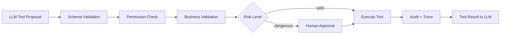
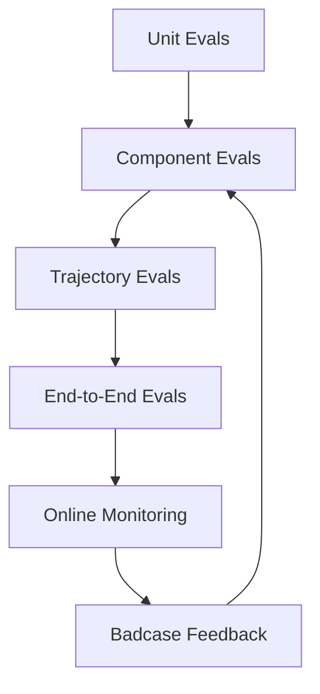
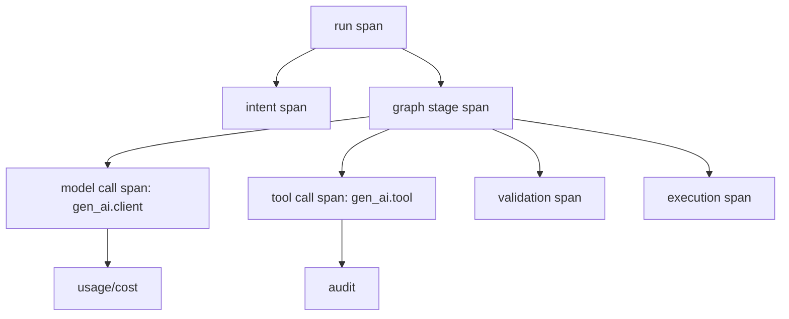

# LLM 工程化、工具调用、评测与可观测复习


> 阅读目标：把 LLM 工程化讲成一套“可信执行边界”。模型输出永远不是事实本身，而是需要被 schema、权限、业务校验、trace 和 eval 接住的 proposal。

## 0. 本文地图

| 模块 | 核心问题 | 面试回答方向 |
|---|---|---|
| Structured Output | JSON 正确是否等于业务正确 | 解析、schema、业务校验三层分开 |
| Tool Calling | 模型是否能直接执行工具 | action proposal + policy gate + audit |
| Provider Abstraction | 为什么封装多模型 | 能力、成本、fallback、错误归一 |
| Eval | 怎么证明改动变好了 | capability vs regression |
| Trace | 怎么排查线上 badcase | run/stage/model/tool span |

## 1. Structured Output

结构化输出的目的不是“让 JSON 好看”，而是让 LLM 输出进入工程系统前可解析、可验证、可回放、可修复。

### 适用场景

- Planner 输出：故事结构、镜头列表、DAG pattern 选择。
- Classifier 输出：意图、风险等级、置信度。
- UGC 审核输出：决策、理由、需人工复核字段。
- RAG 安全判断：是否高风险、是否证据不足。

### 必须二次校验

即使模型支持 JSON Schema，也只能保证更接近结构约束，不能保证业务语义正确。应用层仍要校验：

- 枚举值是否合法。
- 数量范围是否符合业务。
- 引用的 node type / slot / tool 是否存在。
- confidence 是否和 reason 一致。
- 是否缺少必填业务字段。

### 源码形态：模型 schema 与业务校验分离

```python
from pydantic import BaseModel, Field, ValidationError


class PlannerShot(BaseModel):
    id: str
    subject: str
    motion: str
    duration_sec: int = Field(ge=1, le=12)


class PlannerOutput(BaseModel):
    workflow_pattern: str
    aspect_ratio: str
    shot_count: int = Field(ge=1, le=12)
    shots: list[PlannerShot]


def validate_planner_output(raw: str, registry: WorkflowRegistry) -> PlannerOutput:
    try:
        parsed = PlannerOutput.model_validate_json(raw)
    except ValidationError as exc:
        raise RetryableModelOutputError(exc)

    if parsed.workflow_pattern not in registry.patterns:
        raise BusinessValidationError("unknown workflow pattern")
    if len(parsed.shots) != parsed.shot_count:
        raise BusinessValidationError("shot_count does not match shots")
    return parsed
```

面试表达重点：

- Pydantic / JSON Schema 解决结构问题，不自动解决业务语义问题。
- registry 校验解决“模型引用了不存在的工具、节点、slot、pattern”。
- retry 只能处理可修复错误，业务冲突要澄清或 fallback。

## 2. Tool Calling 设计

### 工具声明

一个好工具应该：

- 名字明确，动作单一。
- 参数少而强类型。
- enum 优先于自由文本。
- description 给约束和例子。
- 返回结构稳定，有 error code。
- 对写操作支持 idempotency key。

### 工具执行边界



### 面试金句

> Tool calling 不是让模型直接操作系统，而是让模型提出结构化 action proposal，系统再做权限、校验、幂等和审计。

### 工具调用的状态机

```text
LLM proposes tool_call
  -> parse arguments
  -> schema validation
  -> permission check
  -> business validation
  -> risk classification
  -> idempotency key
  -> execute
  -> audit log
  -> structured result back to model
```

如果面试官问“模型能不能删数据、发请求、发布内容”，不要只说“加人工审核”。更完整的回答是：

- 工具按风险分级，低风险只校验，高风险必须 review。
- 所有写操作要有 idempotency key，避免重试重复执行。
- 工具返回稳定结构，包含 `ok`、`error_code`、`retryable`、`audit_id`。
- 工具参数只允许 allowlist 资源，不让模型自由拼 URL、路径或 SQL。

## 3. 多模型 Provider 抽象

### 为什么需要

- 降低供应商锁定。
- 支持 Gemini、ERNIE、OpenAI compatible、Claude、DeepSeek、Qwen 等。
- 统一流式、结构化输出、tool calling、usage、error。
- 支持模型路由、fallback 和成本统计。

### Provider 接口建议

```text
generate(request) -> response
stream(request) -> event iterator
validate_capability(model, feature) -> bool
estimate_cost(model, tokens) -> money
normalize_error(error) -> ProviderError
```

### 路由策略

- 高频简单意图：规则或小模型。
- 复杂规划：强模型。
- JSON schema 要求高：选择结构化输出稳定的模型。
- 低延迟路径：预设超时 + fallback。
- 高风险场景：更强模型 + 人工审核。

### 错误归一：不要把 SDK 异常泄漏到业务层

```python
class ProviderError(Exception):
    def __init__(self, code: str, retryable: bool, provider: str, raw: Exception):
        self.code = code
        self.retryable = retryable
        self.provider = provider
        self.raw = raw


def normalize_error(provider: str, error: Exception) -> ProviderError:
    if is_rate_limit(error):
        return ProviderError("rate_limit", True, provider, error)
    if is_context_length(error):
        return ProviderError("context_length", False, provider, error)
    if is_schema_error(error):
        return ProviderError("schema_generation_failed", True, provider, error)
    return ProviderError("unknown_provider_error", False, provider, error)
```

这样模型路由、fallback 和告警系统才能用统一错误码，而不是散落在业务代码里判断各家 SDK 的异常类型。

## 4. Streaming 与用户体验指标

LLM 应用的延迟不能只看 total latency。要拆成：

- Queue latency：排队等待。
- First token latency：首 token 或首事件。
- Stage latency：每个图节点耗时。
- Tool latency：外部工具耗时。
- Retrieval latency：检索和 rerank。
- Total run latency：完整任务完成。

对于 Agent，前端体验依赖结构化进度事件，而不仅是 token：

- 告诉用户“正在识别意图”。
- 告诉用户“正在生成分镜”。
- 告诉用户“DAG 已更新 8 个节点”。
- 告诉用户“校验失败，正在修复”。

## 5. 评测体系

### Eval 分层



| 层级 | 例子 | 评分方式 |
|---|---|---|
| Unit | JSON schema、正则意图 | deterministic |
| Component | RAG Top-K、Classifier | labeled dataset |
| Trajectory | Agent 是否正确调用工具 | trace assertions |
| E2E | DAG 是否可执行 | dry-run / execution |
| Online | 用户反馈、成本、延迟 | monitoring |

### Capability vs Regression

- Capability eval：衡量新能力上限，可以难，通过率不必高。
- Regression eval：防止老能力退化，应该高通过率，适合 CI。

面试里可以说：Agent 评测要看 transcript/trajectory，因为最终答案正确不代表过程安全；过程错误也可能因为运气得到正确答案。

### Trajectory Eval 的断言例子

```yaml
case_id: dag_generation_042
input: "生成 4 个镜头的赛博朋克竖屏短片"
assertions:
  - stage_sequence_contains:
      - intent
      - spec_confirm
      - planner
      - dag_assembly
      - validation
  - tool_call_allowed:
      tool: create_dag_draft
      max_calls: 1
  - json_schema_valid:
      target: planner_output
  - dag_guard_passed: true
  - cost_less_than_usd: 0.08
```

这类断言能证明 Agent 不是“最后文本看起来对”，而是过程也符合系统约束。

## 5. 评测体系与 LLM-as-a-Judge 校准

在生产级 Agent 应用中，单纯靠人工点赞（Upvote/Downvote）或肉眼观测，根本无法支撑系统的科学迭代。我们必须建立**自动化、可量化的评测闭环体系**。

### 5.1 自动化评测三阶模型 (Evals Taxonomy)
1. **硬约束校验 (Deterministic Assertions)**：
   - **Schema 合规性**：检验模型输出的 JSON 100% 契合 Pydantic/JSON Schema 约束。
   - **执行 dry-run**：模拟运行生成的 DAG，确保无悬空 handle、节点无 slot 冲突。
2. **逻辑轨迹断言 (Trajectory Assertions)**：
   - 验证 Agent 决策路径：必须先调用 `search` 工具，再调用 `summary`，严禁越过状态机直接调用 `render`。
3. **主观语义评分 (LLM-as-a-Judge)**：
   - 针对推荐文案、分镜描述、艺术风格等主观指标，使用更强的大模型（如 GPT-4o 或 Claude 3.5 Sonnet）根据预设规则（Rubrics）进行打分（1-5 分）。

### 5.2 LLM-as-a-Judge 的数学校准与对齐 (Human-LLM Alignment)
**痛点**：模型作为评委（Judge）极易产生固有偏见（如“自恋偏见”——倾向于给自己生成的文本打高分，“长度偏见”——字数越长分数越高）。如果不经过与人类专家的共识校准，大模型打出的分数纯属自嗨。

#### 核心指标 1：Cohen's Kappa 关联系数（离散评分对齐）
为了验证 LLM 评分与人类医学/设计专家的打分（如 1-5 分离散值）是否一致，我们必须计算 **Cohen's Kappa 系数**：
$$ \kappa = \frac{p_o - p_e}{1 - p_e} $$
- **$p_o$ (Observed Agreement)**：LLM Judge 和人类专家打分完全一致的实际比例。
- **$p_e$ (Expected Agreement)**：LLM Judge 和人类专家纯粹因随机几率达成一致的期望比例。

$$\text{Kappa 值释义} \begin{cases} 
< 0.40 & \text{对齐度极低，评测不可信} \\ 
0.40 \le \kappa < 0.60 & \text{中度一致，需要修复 Judge 提示词} \\ 
0.60 \le \kappa < 0.80 & \text{高度一致，可以替代部分初级人工质检} \\ 
\ge 0.82 & \text{极高度一致，可作为 CI/CD 自动化门禁} 
\end{cases}$$

#### 核心指标 2：Spearman 秩相关系数（排序一致性对齐）
若两个 Prompt 竞争（Pairwise Win-Rate），我们使用 **Spearman Rank Correlation** 衡量 LLM 胜率矩阵与人类专家胜率矩阵在排序上的一致性，确保模型推荐的“更佳创意”与人类直觉相符。

---

## 6. Trace 设计 (基于 OpenTelemetry 语义标准)

当线上发生“回答过慢”、“画面生成错误”、“成本爆表”等 Badcase 时，唯一能救命的是**分布式链路追踪（Distributed Tracing）**。我们必须严格遵循 **OpenTelemetry (OTEL) GenAI Semantic Conventions** 标准设计 Trace 系统。

### 6.1 Trace Span 分层拓扑


### 6.2 遵循 OpenTelemetry 标准的语义属性命名规范 (Attributes)
在 GenAI 监控中，严禁瞎编字段。必须使用 OTEL 社区推荐属性：

| 属性名称 | 类型 | 说明与示例 |
| :--- | :--- | :--- |
| `gen_ai.system` | `string` | 模型供应商：`openai`, `gemini`, `anthropic` |
| `gen_ai.request.model` | `string` | 发起请求的模型名称：`gemini-2.5-pro` |
| `gen_ai.response.model` | `string` | 实际响应的模型名称：`gemini-2.5-pro-v1` |
| `gen_ai.request.temperature` | `double` | 采样温度：`0.4` |
| `gen_ai.usage.input_tokens` | `int` | 输入的 Prompt 消耗 token 数 |
| `gen_ai.usage.output_tokens` | `int` | 模型吐出的 Completion token 数 |
| `gen_ai.choice.finish_reason` | `string` | 终止原因：`stop`, `length`, `tool_calls` |

### 6.3 生产级 Trace Payload 结构 (JSON 示例)
在底层存储（如 Elasticsearch / Jaeger）中落盘的标准 JSON Span 片段：

```json
{
  "trace_id": "8fa9e2a14b5c7f8e02d41a99f11a823e",
  "span_id": "01b5c9d2fe4a3b78",
  "parent_span_id": "f5a8c903bd2e9177",
  "name": "model_planner_call",
  "start_time": "2026-06-03T18:20:00.150Z",
  "end_time": "2026-06-03T18:20:01.370Z",
  "attributes": {
    "gen_ai.system": "gemini",
    "gen_ai.request.model": "gemini-2.5-pro",
    "gen_ai.request.temperature": 0.4,
    "gen_ai.response.model": "gemini-2.5-pro-v1",
    "gen_ai.usage.input_tokens": 1420,
    "gen_ai.usage.output_tokens": 420,
    "gen_ai.choice.finish_reason": "tool_calls",
    "app.session_id": "session_creation_982173",
    "app.run_id": "run_89123_abc",
    "app.stage": "storyboard_generation",
    "app.prompt_version": "v2.1.4_cyberpunk"
  },
  "events": [
    {
      "time": "2026-06-03T18:20:00.152Z",
      "name": "gen_ai.request.content",
      "attributes": {
        "content": "Generate a 4-shot storyboard for a cyberpunk themed short..."
      }
    },
    {
      "time": "2026-06-03T18:20:01.368Z",
      "name": "gen_ai.response.content",
      "attributes": {
        "content": "{\"tool_calls\": [{\"name\": \"create_dag_draft\", \"args\": {...}}]}"
      }
    }
  ]
}
```

### 6.4 Trace 驱动的线上 Badcase 诊断排障
有了结构化的 Span Attributes，我们才能将线上故障 100% 归因：

| 线上症状 | 检索 Span 特征 | 诊断与故障归因 (Root Cause Analysis) |
| :--- | :--- | :--- |
| **回答慢（延迟长）** | `latency_ms > 5000` | 筛选下层 Span，若 `name` 为 `retrieval_milvus` 或 `reranker` 则属于知识库慢，需加向量索引或精简重排候选。若在 `model_call` 则是提供商模型抖动。 |
| **成本爆表** | `attributes.gen_ai.usage.input_tokens > 20000` | 查看上下文 Span。判断是否发生 Context Compaction 缺失、工具输出冗余导致上下文指数级膨胀。 |
| **画面渲染崩溃** | `attributes.error_type = "schema_error"` | 锁定 `validation_span`。由于模型输出不契合 JSON Schema，或 Registry 模板版本不一致，阻断了装配器执行。需回溯 `prompt_version` 修复指令。 |

---

## 7. 成本治理

### 降成本手段

- 高频明确意图规则化。
- 小模型/便宜模型处理分类。
- 上下文压缩和结构化状态。
- RAG 只传必要片段。
- tool result 摘要化。
- cache 相似 case 和静态知识。
- 失败重试设置 budget。
- 离线评测比较 prompt/model 成本收益。

### 成本指标

- cost per run。
- cost per successful task。
- cost by stage。
- cost by model/provider。
- token by prompt version。
- fallback cost。

## 8. 安全与权限

### LLM 输出永远是不可信输入

即使是自己调用的模型，也要把它的输出当成外部输入：

- 参数校验。
- SQL/命令/API 注入防护。
- URL/domain allowlist。
- 文件路径限制。
- secret 不进 prompt。
- 高风险工具审批。

### Prompt Injection 防护

RAG 或网页内容里可能出现“忽略之前指令”。应对方式：

- 系统指令区分数据和指令。
- 检索内容加引用边界。
- 工具调用前做策略校验。
- 不把敏感工具暴露给所有上下文。
- 对外部内容来源打 trust level。

## 9. 必背问题

### LLM-as-a-judge 可靠吗？

可靠性取决于任务。它适合开放质量维度，比如相关性、完整性、语气，但不应替代确定性校验。关键要用人工标注校准 judge，并用固定 rubric、pairwise 或多次采样降低噪声。

### Agent 线上出了 badcase 怎么排？

先看 trace：意图是否错、检索是否命中、rerank 是否排错、prompt version、模型输出、工具参数、validation error、fallback。然后把 badcase 分类，加入 eval dataset，修复后跑离线实验，再灰度。

### 为什么只看用户点赞不够？

用户反馈稀疏且偏向极端，无法覆盖隐藏错误。需要自动评测、生产监控、人工抽检、A/B 测试多层信号。

## 10. 与简历项目的映射

| 简历技术点 | 本文章节 | 相关深读 |
|---|---|---|
| Gemini JSON Schema 输出 | §1 Structured Output | [Tool Calling、Structured Output、MCP](./08-tool-calling-mcp.md) |
| 工具调用与权限边界 | §2 Tool Calling | [Tool Calling、Structured Output、MCP](./08-tool-calling-mcp.md) |
| 多模型 Provider 抽象（百度文心 + Gemini） | §3 | — |
| 评测与 Badcase 闭环 | §5 - §6 Trace | [RAG、混合检索与医疗问答](./02-rag-retrieval.md) |
| 成本治理（LLM 调用成本 ↓40%） | §7 | [AI Agent 与 LangGraph 工程化](./01-ai-agent-langgraph.md) §3 Layer 1 双层意图 |
| UGC 机审分层管线 | §1 / §2 业务校验 | [简历正文 · 百度地图 UGC](../马震-15253371862-后端研发工程师.md#项目经历) |

## 11. 官方与高质量资料

- Gemini Structured Outputs：<https://ai.google.dev/gemini-api/docs/structured-output>
- Gemini Function Calling：<https://ai.google.dev/gemini-api/docs/function-calling>
- OpenAI Agents SDK：<https://platform.openai.com/docs/guides/agents-sdk/>
- OpenAI Agents SDK Tracing：<https://openai.github.io/openai-agents-python/tracing/>
- Anthropic Writing Tools for Agents：<https://www.anthropic.com/engineering/writing-tools-for-agents>
- Anthropic Agent Evals：<https://www.anthropic.com/engineering/demystifying-evals-for-ai-agents>
- LangSmith Evaluation：<https://docs.langchain.com/langsmith/evaluation>
- Langfuse Overview：<https://langfuse.com/docs/>
- OpenTelemetry GenAI Semantic Conventions：<https://opentelemetry.io/docs/specs/semconv/gen-ai/>
