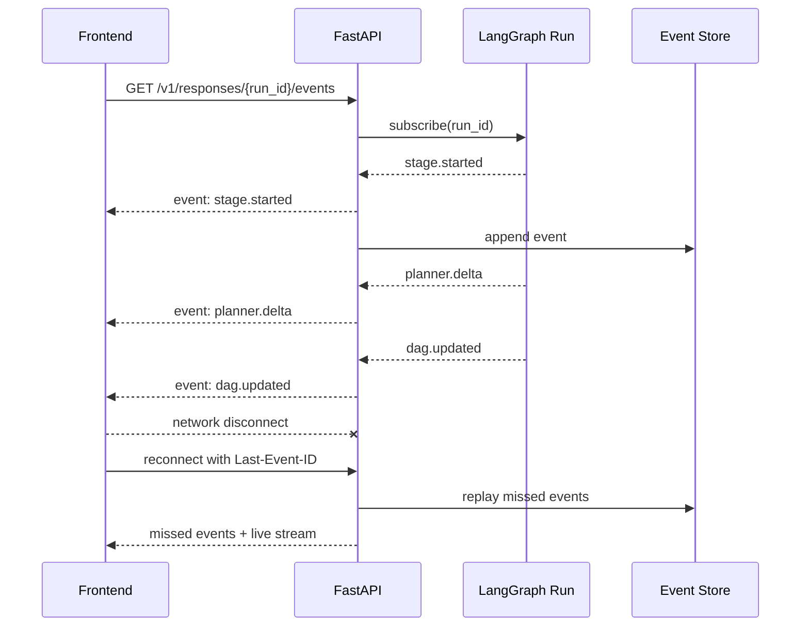
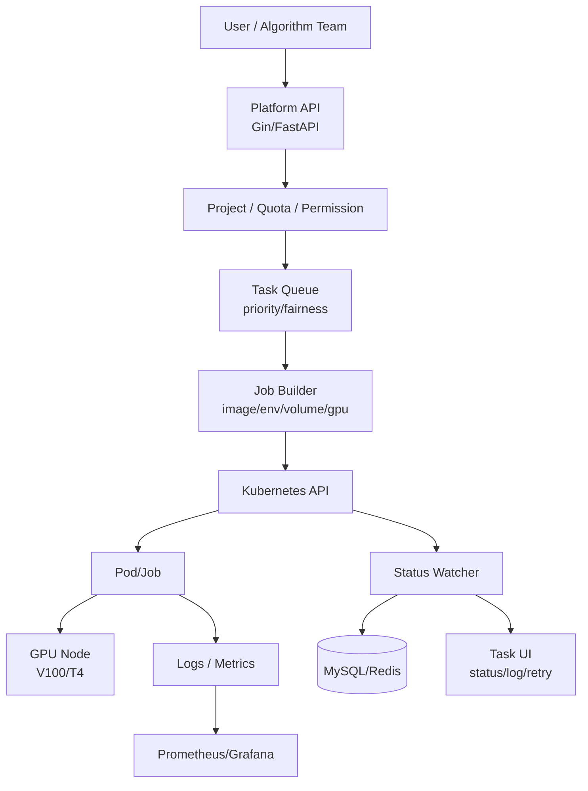
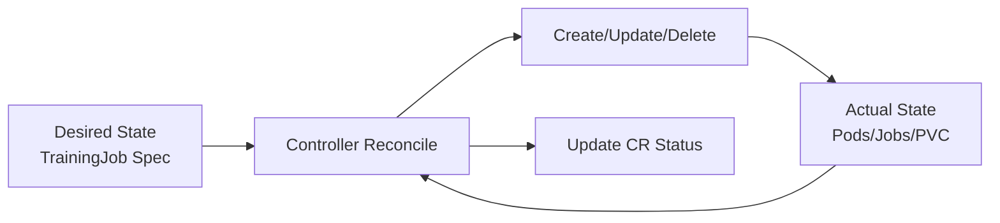

# 后端架构、SSE、Kubernetes GPU 与 Operator 复习

## 1. FastAPI / SSE / Streaming

### SSE 是什么

Server-Sent Events 是浏览器通过 HTTP 长连接接收服务端事件的机制。客户端使用 `EventSource`，服务端返回 `text/event-stream`，每个事件用空行分隔。

### SSE vs WebSocket

| 维度 | SSE | WebSocket |
|---|---|---|
| 通信方向 | 服务端 -> 客户端 | 双向 |
| 协议 | HTTP | 独立升级协议 |
| 浏览器支持 | EventSource 原生 | WebSocket 原生 |
| 重连 | 原生支持 | 需自己实现 |
| 适合场景 | LLM token/event stream、进度通知 | 协同编辑、游戏、双向控制 |
| 运维复杂度 | 较低 | 较高 |

你的项目是服务端把 Agent run event 推给前端，SSE 很合适。

## 2. SSE 工程细节



### 你要能讲出的细节

- 响应头：`Content-Type: text/event-stream`、`Cache-Control: no-cache`。
- Nginx：关闭 buffering，例如 `X-Accel-Buffering: no`。
- 心跳：定期发送 comment/ping 防止连接空闲断开。
- 事件 id：支持 Last-Event-ID 恢复。
- 背压：慢客户端不能拖垮 run。
- 清理：客户端取消后释放订阅和后台任务。
- 幂等：断线重连不应重复执行模型/工具，只重放事件。

## 3. 后端领域模型

Agent 平台不要只建一张 conversation 表。建议模型：

- `session`：用户长期会话或项目。
- `run`：一次 Agent 执行。
- `message`：用户/助手消息。
- `event`：SSE 事件和状态变更。
- `checkpoint`：graph 可恢复状态。
- `artifact`：图片/视频/音频/DAG 等产物引用。
- `trace`：模型、工具、检索、执行 spans。

面试金句：

> message 是对用户可见的对话，event 是前端恢复和实时展示的事实流，checkpoint 是运行时恢复状态，trace 是工程排障和评测依据。它们不能混成一张表。

## 4. Kubernetes GPU 调度

### Device Plugin 机制

Kubernetes 通过 Device Plugin Framework 支持 GPU、FPGA、NIC 等特殊硬件。GPU 节点安装驱动和 vendor device plugin 后，kubelet 会暴露扩展资源，例如：

```yaml
resources:
  limits:
    nvidia.com/gpu: 1
```

关键点：

- GPU 通常在 `limits` 中声明。
- GPU request 和 limit 必须一致，或只写 limit 由 K8s 推导 request。
- 不同 GPU 型号用 node label / node selector / affinity 区分。
- 平台层要做配额、队列、优先级和多租户隔离。

## 5. GPU 平台架构



### 平台要解决的问题

- 用户不写 YAML，也能提交训练/推理/数据任务。
- 资源配额：项目/用户/GPU 型号。
- 队列公平性：避免某个团队占满 GPU。
- 状态同步：Pending/Running/Succeeded/Failed/Retrying。
- 日志与结果：日志查看、对象存储输出。
- 故障恢复：失败重试、节点异常、镜像拉取失败、资源不足。

## 6. CRD / Operator

### CRD 适用条件

适合：

- 业务对象生命周期长。
- 需要声明式 API。
- 状态需要不断调和。
- 希望用户像使用 K8s 原生资源一样使用业务对象。

不适合：

- 简单 CRUD。
- 状态不在 K8s 内。
- 不需要控制循环。

### Operator 控制循环



面试回答：

> CRD 存期望状态，Operator 负责把真实状态调和过去。它不是简单把 API 换成 YAML，而是把领域运维知识编码进控制循环。

## 7. Golang / Python 后端取舍

### Python 适合

- LLM SDK、RAG、数据处理、快速迭代。
- FastAPI 做 AI API 服务。
- 与模型生态集成。

### Golang 适合

- 高并发 API。
- K8s controller/operator。
- 稳定后台服务。
- 低资源占用和部署简单。

你可以说：AI Agent 服务我倾向 Python/FastAPI，因为模型和 RAG 生态更快；平台控制面、K8s operator 和高并发稳定链路可以用 Golang。

## 8. 中间件复习速记

### Redis

- session/cache/rate limit/distributed lock/stream。
- Agent 场景：短期状态缓存、SSE pubsub、任务状态缓存、幂等 key。

### PostgreSQL/MySQL

- 强一致业务数据、session/run/message/event、权限、配置。
- PostgreSQL JSONB 适合半结构化 Agent state，但核心索引字段要列化。

### MongoDB

- 文档型配置、灵活 schema 的产物元数据。
- 不要把强事务核心状态全部塞 Mongo。

### RabbitMQ/Kafka

- RabbitMQ：任务队列、延迟重试、可靠投递。
- Kafka：高吞吐事件流、日志、行为数据、异步消费。

### S3/CDN

- 多模态产物、图片、视频、音频、大型 DAG artifact。
- DB 保存 URI、hash、metadata，不保存大对象。

## 9. 必背问题

### 长任务 API 如何设计？

- POST 创建 run，返回 run_id。
- SSE 订阅事件。
- GET 查询状态和结果。
- POST cancel。
- retry 使用新 run 或明确 retry_of。
- 所有写操作有 idempotency key。

### 如何做限流？

- 用户级、项目级、模型级、工具级。
- 区分请求数、并发 run 数、token/min、cost/day。
- 重要任务可排队，低优先级拒绝或降级。

### 如何排查线上 SSE 没有实时返回？

- 检查服务端是否 flush。
- 检查 Nginx/网关 buffering。
- 检查 Content-Type。
- 检查心跳和 idle timeout。
- 检查客户端 EventSource 是否重连。
- 检查后台 run 是否真的产生事件。

## 10. 官方与高质量资料

- MDN Using SSE：<https://developer.mozilla.org/en-US/docs/Web/API/Server-sent_events/Using_server-sent_events>
- FastAPI StreamingResponse：<https://fastapi.tiangolo.com/advanced/custom-response/>
- Starlette Responses：<https://www.starlette.io/responses/>
- Kubernetes Device Plugins：<https://kubernetes.io/docs/concepts/extend-kubernetes/compute-storage-net/device-plugins/>
- Kubernetes Schedule GPUs：<https://kubernetes.io/docs/tasks/manage-gpus/scheduling-gpus/>
- Kubernetes Custom Resources：<https://kubernetes.io/docs/concepts/api-extension/custom-resources/>
- Kubernetes Operator Pattern：<https://kubernetes.io/docs/concepts/extend-kubernetes/operator>
- GitHub Pages Actions：<https://github.com/actions/deploy-pages>
