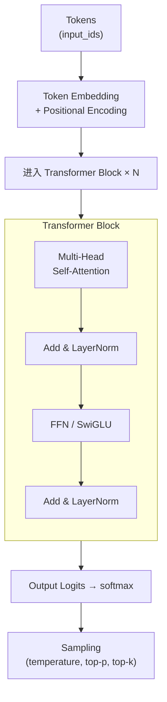
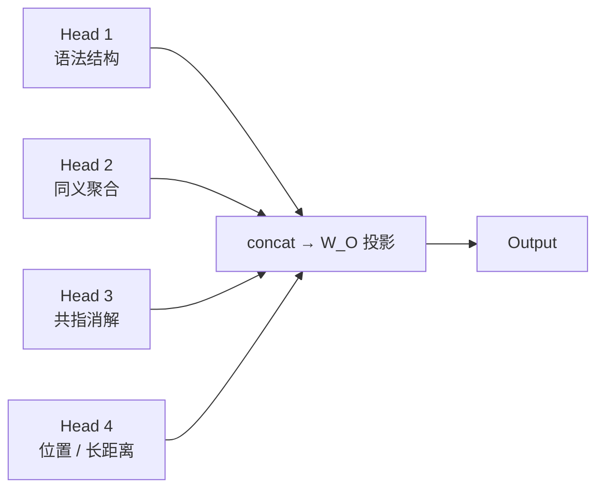
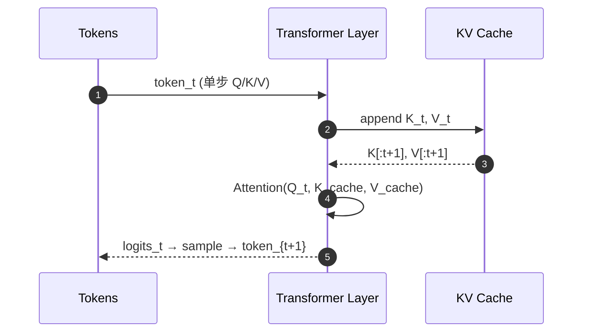
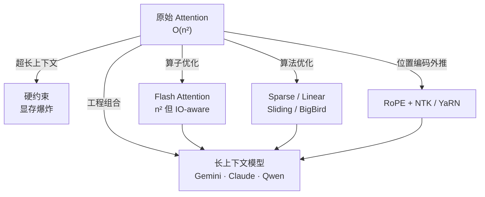

# Transformer / Attention / Embedding 速通

> 面试 90% 必问，但 80% 候选人只能复述公式，讲不清楚"为什么这样设计"和"工程上怎么用"。这一篇按"从直觉到代码，再到落地"组织，目标是面试时能在 5 分钟里把 Attention、KV Cache、位置编码、Embedding 几何这条主线讲清。


## 总览



要在面试里给一个干净的"建图叙事"：**Tokenization → Embedding → Self-Attention 在序列内部做信息聚合 → FFN 做非线性混合 → 多层堆叠形成抽象 → 输出层做下一 token 预测。** 后续的 KV Cache、长上下文、推理优化都是绕着这条链做的工程化。

## 1. 从 RNN/CNN 到 Self-Attention

RNN 顺序依赖、不能并行；CNN 感受野受限、需要堆很多层才能建立长距离依赖。Self-Attention 用一次矩阵乘法让序列里每个 token 直接看到所有其他 token，**计算可完全并行，时间复杂度 O(n²·d)**。

| 维度 | RNN | CNN | Self-Attention |
|---|---|---|---|
| 并行度 | 不可并行（顺序） | 完全并行 | 完全并行 |
| 长距离依赖 | 梯度衰减 | 需堆很多层 | 一步即达 |
| 复杂度 | O(n·d²) | O(k·n·d²) | O(n²·d) |
| 主导算子 | matmul + 时序 | conv | matmul（GEMM 友好） |

面试时强调："Transformer 真正胜出的关键不是 attention 本身，而是它和现代 GPU 的 matmul 算子高度匹配，能把训练吞吐拉到 RNN 完全做不到的量级。"

## 2. Scaled Dot-Product Attention

公式：

$$ \text{Attention}(Q, K, V) = \text{softmax}\!\left(\dfrac{QK^\top}{\sqrt{d_k}}\right) V $$

直觉拆解：

- **Q·Kᵀ**：每个 token 的查询向量和所有 key 做点积，得到 n×n 的"相关性矩阵"。
- **除以 √dₖ**：抵消 dot-product 在高维下方差过大、softmax 进入饱和区的问题。
- **softmax**：把相关性归一化成权重。
- **× V**：用权重对 value 做加权聚合。

**为什么用 dot-product 而不是 additive attention？** dot-product 可直接调用高度优化的 GEMM；additive attention 需要一个 MLP，相同精度下慢 3-5 倍。

### 关键源码骨架（PyTorch）

```python
import math
import torch
import torch.nn as nn
import torch.nn.functional as F

class MultiHeadAttention(nn.Module):
    """生产级实现，覆盖 mask、KV cache、Flash Attention 入口。"""

    def __init__(self, d_model: int, n_heads: int, dropout: float = 0.0):
        super().__init__()
        assert d_model % n_heads == 0
        self.d_model = d_model
        self.n_heads = n_heads
        self.d_head = d_model // n_heads

        # 把 Q / K / V 三个投影合并为一次矩阵乘，省一次显存往返
        self.qkv_proj = nn.Linear(d_model, 3 * d_model, bias=False)
        self.o_proj = nn.Linear(d_model, d_model, bias=False)
        self.dropout = dropout

    def forward(
        self,
        x: torch.Tensor,                         # (B, T, D)
        kv_cache: tuple[torch.Tensor, torch.Tensor] | None = None,
        attn_mask: torch.Tensor | None = None,
    ):
        B, T, D = x.shape
        qkv = self.qkv_proj(x).view(B, T, 3, self.n_heads, self.d_head)
        q, k, v = qkv.unbind(dim=2)              # 每个 (B, T, H, d_head)
        q = q.transpose(1, 2)                    # (B, H, T, d_head)
        k = k.transpose(1, 2)
        v = v.transpose(1, 2)

        # 推理时把历史 K/V 拼接进来，避免重复计算
        if kv_cache is not None:
            past_k, past_v = kv_cache
            k = torch.cat([past_k, k], dim=2)
            v = torch.cat([past_v, v], dim=2)
        new_cache = (k, v)

        # 走 PyTorch 内置的 SDPA：自动选 Flash Attention / Memory-efficient
        out = F.scaled_dot_product_attention(
            q, k, v,
            attn_mask=attn_mask,
            dropout_p=self.dropout if self.training else 0.0,
            is_causal=attn_mask is None,         # decoder 默认下三角 mask
        )
        out = out.transpose(1, 2).contiguous().view(B, T, D)
        return self.o_proj(out), new_cache
```

工程要点：

1. **QKV 合并投影**：能减少一次 launch overhead，对短序列尤其明显。
2. **`scaled_dot_product_attention`**：PyTorch 2.0 起内置 Flash Attention v2，不需要自己写 mask + softmax + matmul。
3. **`is_causal=True`**：autoregressive decoder 走因果 mask，不需要显式构造 mask 矩阵，省 O(n²) 内存。

## 3. Multi-Head：为什么要切多头？

单头 attention 倾向于学到一个主导的对齐模式；切成 H 个头后，**每个头有独立的 Q/K/V 投影**，可以学不同子空间的关系（句法、共指、远距离引用）。



> 面试加分项：**Multi-Query Attention (MQA)** 和 **Grouped-Query Attention (GQA)** 是 Llama-2/3、Gemini、Qwen 大量使用的优化。MQA 让所有 head 共享一份 K/V，推理时 KV cache 缩小 H 倍；GQA 是 MQA 的折中（每个 group 共享）。掌握这点能直接接住"推理优化怎么做"的追问。

## 4. 位置编码：从绝对到 RoPE

self-attention 是 permutation-equivariant 的，**必须显式注入位置信息**，否则 "我打你" 和 "你打我" 表示是一样的。

| 类型 | 代表模型 | 优劣 |
|---|---|---|
| 绝对位置（sin/cos） | 原始 Transformer / BERT | 简单，但泛化到训练以外长度差 |
| 学习式绝对位置 | GPT-2 | 同样泛化差 |
| 相对位置（T5 bias） | T5 / DeBERTa | 泛化好，但需要额外 bias 表 |
| **RoPE**（旋转位置编码） | Llama / Qwen / Gemini / DeepSeek | 主流，外推容易，KV cache 友好 |
| **ALiBi** | MosaicBERT / 部分长上下文模型 | 推理外推天然好，但训练略差 |

RoPE 的核心是把位置当作复数空间的旋转作用在 Q/K 上：

$$ q_m \cdot k_n^\top = (R_m q)\cdot(R_n k)^\top = q^\top R_{n-m} k $$

旋转后内积只依赖 **相对位置 n-m**，但实现成本和绝对位置一样（per-token 一次乘法）。这就是"绝对编码做相对效果"。

**外推**：训练时见过 4k，要在推理时跑 32k？社区方案有 PI（Position Interpolation）、NTK-aware、YaRN、Dynamic NTK。重要的是知道有这些方法，并知道它们都是在动 RoPE 的旋转频率，**不是在加新参数**。

## 5. KV Cache：推理优化的"主角"

decoder 推理时每生成一个新 token，只有最后一行 Q 是新的；但如果不缓存历史 K/V，每一步都要重新跑前面所有 token 的投影。**这就是为什么生成第 1000 个 token 比第 1 个慢 1000 倍——除非有 KV cache**。



KV cache 的大小：`2 × n_layers × n_heads × d_head × seq_len × dtype_bytes`。
对 Llama-3 8B (n_layers=32, n_heads=8 GQA, d_head=128, fp16) 而言，1k context ≈ 16MB，32k ≈ 512MB。这就是为什么生产部署要重点关注：

- **MQA / GQA**：直接把 KV cache 缩 8-32 倍。
- **PagedAttention (vLLM)**：把 KV cache 拆成 block，按 OS 的 page 思路调度，**显存利用率提到 96%+**。
- **量化 KV cache**：fp16 → int8 / int4，再省一半到四分之三。

> 面试问"为什么 vLLM 比直接用 transformers 快几倍？" 标准答案就是 PagedAttention + continuous batching。前者解决显存碎片，后者把不同请求的不同长度的 token 拼到同一个 batch 里跑，让 GPU 永远满载。

## 6. Embedding 与几何直觉

文本 embedding 把变长字符串映射到 d 维稠密向量。**几何直觉**：相似语义 → 向量夹角小（cosine 大），向量空间是一个"超球面"。

```python
import numpy as np

def cosine(a: np.ndarray, b: np.ndarray) -> float:
    a = a / (np.linalg.norm(a) + 1e-9)
    b = b / (np.linalg.norm(b) + 1e-9)
    return float(np.dot(a, b))

# 实际工程里：BAAI/bge-large-zh、text-embedding-3-large、jina-v3 都默认归一化输出。
# 已归一化的话，余弦相似度就是内积，比欧氏距离更快也更稳。
```

工程选型（2026 视角）：

| 维度 | 推荐 | 理由 |
|---|---|---|
| 中文通用 | **bge-large-zh-v1.5** / **bge-m3** | 中文检索 SOTA 之一，m3 还支持稠密 + 稀疏 + multi-vector |
| 英文通用 | **text-embedding-3-large** / **bge-large-en-v1.5** | OpenAI 接入快，bge 自托管成本低 |
| 多模态 | **jina-clip-v2** / **siglip-2** | 文本 + 图像同空间 |
| 长文本 | **bge-m3** / **nomic-embed-text-v1.5** | 支持 8k+ context，长 chunk 友好 |

**重要工程点**：

1. **向量归一化**：建立索引前统一 L2-normalize，否则 IP / Cosine 行为不一致。
2. **维度选择**：1024 vs 1536 vs 4096，越大越准但内存和检索延迟线性涨；Matryoshka embeddings（OpenAI v3 / bge-m3）允许"切短"使用，灵活度更高。
3. **批量推理**：embedding 服务化一定要支持 batch，单条调用 latency 高 5-10 倍。

## 7. 上下文长度：从 2k 到 1M+



面试时不要堆砌名词，要按"层次"讲：

- **算子层**：Flash Attention v2/v3 把 attention 的 IO 复杂度降低，**但理论复杂度仍然是 O(n²)**。
- **算法层**：sparse / linear attention 把复杂度降到 O(n log n) 或 O(n)，但精度会有损失。
- **位置编码层**：RoPE + 外推方法让模型能"理解"训练以外的长度。
- **工程层**：vLLM 的 PagedAttention + continuous batching，把长上下文吞吐撑起来。

## 8. 与简历项目的映射

| 简历项目 | 涉及的 Transformer 概念 |
|---|---|
| ArtArch.AI · Agent Runtime | KV cache、长上下文预算压缩、temperature/top-p 控制、JSON Schema 约束解码 |
| 百度健康助手 RAG | embedding 选型（bge-large-zh）、混合检索分数融合、reranker（cross-encoder） |
| LLM 工程化 | 量化 (KV cache / 权重)、推理引擎 (vLLM, TGI)、Provider 抽象 |
| 多模态创作 | CLIP 类双塔、多模态 embedding 对齐、图像 token 化 (ViT patch embedding) |

## 9. 面试追问模板

**Q1：自回归生成为什么必须用 causal mask？不加会怎么样？**
A：训练时每个位置都能"看到未来的标准答案"，模型会学成"复读机"，推理时立即崩溃。causal mask 通过把 attention 矩阵上三角置 -∞ 来强制因果性，是 GPT 类模型的核心约束。

**Q2：解释一下 sqrt(dₖ) 缩放为什么必要。**
A：随机初始化的 Q/K 内积的方差和 dₖ 成线性关系。dₖ 较大时（典型 64-128），softmax 输入分布会很尖，几乎是 one-hot，反传梯度几乎全死。除以 √dₖ 把方差拉回到 O(1)，softmax 才在"软"的区间工作。

**Q3：MQA / GQA 解决什么问题？代价是什么？**
A：解决推理时 KV cache 显存爆炸。MQA 让所有 head 共享一份 K/V，cache 缩 H 倍，但表达能力下降。GQA 是折中，按 group 共享，质量损失更小，主流大模型（Llama-3、Qwen、Gemini）都用 GQA。

**Q4：长上下文为什么不能简单"训练时拉长就行"？**
A：训练长度 N 时显存大约 O(N²)，N 翻倍显存就 4 倍。所以社区先训短，再用 RoPE 外推（NTK、YaRN）和短期持续训练（continued pretraining on long docs）拼出长上下文能力。

**Q5：Flash Attention 是优化复杂度还是优化常数？**
A：常数。理论复杂度仍是 O(n²)，但通过 tiling + online softmax，把 HBM ↔ SRAM 的 IO 量降低到 O(n)，**实际吞吐 2-4 倍**，显存 5-20 倍。

**Q6：你怎么在 RAG 流程里选 embedding 模型？**
A：先看 MTEB / C-MTEB 排行作为先验，再用自己的领域评测集（query → 标注相关文档）跑 Recall@K。生产里更看重：是否支持归一化、batch 推理延迟、量化版本、license、是否能继续微调（domain adapter）。

**Q7：embedding 距离选 cosine 还是 dot product？**
A：如果向量都归一化了，二者等价。生产里建议统一归一化 + 内积，方便迁移到 IVF / HNSW 等 ANN 索引。如果向量没归一化（少见），dot product 会偏向大模长向量，cosine 更稳。

**Q8：如何在 8GB 显存上跑 Llama-3 8B？**
A：组合拳：4-bit 权重量化（AWQ / GPTQ）+ KV cache int8 + PagedAttention + 限制 max context。8B fp16 是 16GB 不可能直接装，量化到 4-bit 大约 5-6GB，再留 1-2GB 给 KV cache。

## 10. 参考资料

- *Attention Is All You Need* (Vaswani et al., 2017)
- *RoFormer: Enhanced Transformer with Rotary Position Embedding* (Su et al., 2021)
- *FlashAttention-2* (Dao, 2023) — 必读，理解推理瓶颈
- *Efficient Memory Management for Large Language Model Serving with PagedAttention* (Kwon et al., 2023, vLLM)
- HuggingFace 文档 - [Transformer 库源码](https://github.com/huggingface/transformers) 的 `modeling_llama.py`、`modeling_qwen2.py`
- vLLM 源码：`vllm/attention/`、`vllm/core/scheduler.py` 是工程化范本
- MTEB / C-MTEB 排行榜
