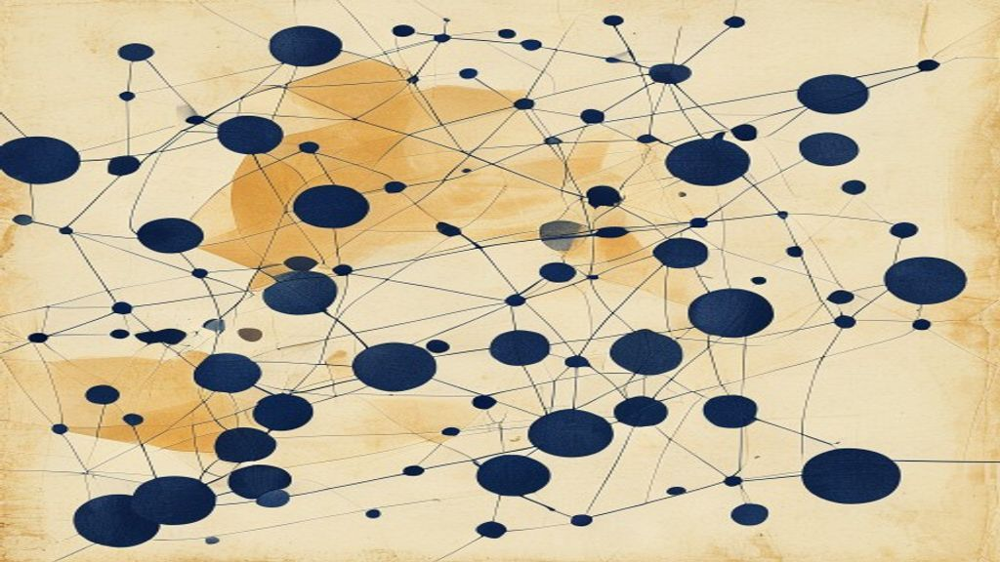
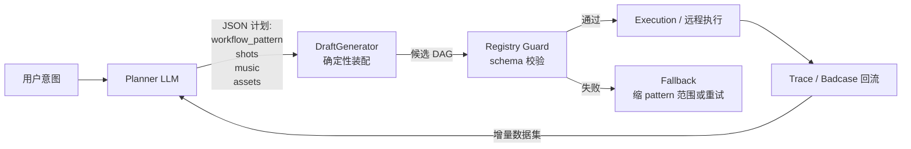
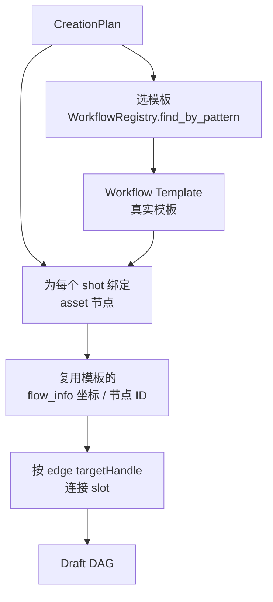
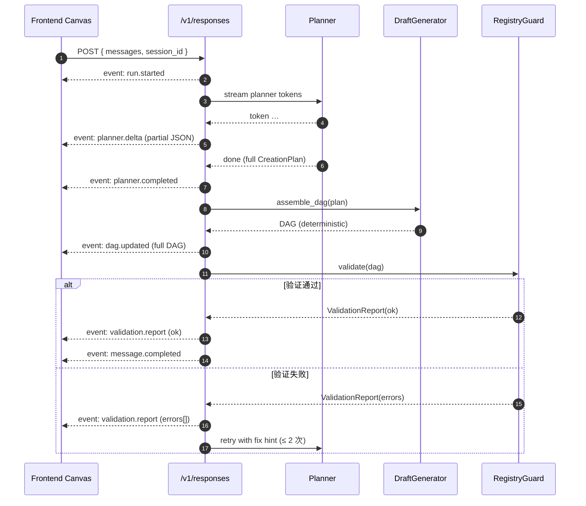

# Planner + Deterministic Assembly 模式

> ArtArch.AI 一次性可执行 DAG 从 ~55% 提到 95%+，靠的不是更强的模型，而是把"语义决策"和"结构装配"分开。这一篇用源码骨架讲清这套模式的设计取舍、Registry Guard、Draft Pattern 与 Badcase 回流。



## 这套模式解决什么问题？

让 LLM 直接吐 DAG（节点 + edge + 配置）会同时遭遇三类问题：

1. **幻觉节点 / 不存在的 workflow ref** — 模型凭空捏造一个"音乐转场 v2"节点，但 Registry 里没有。
2. **非法连线** — `targetHandle` 类型不匹配（image → text、单输入接到多输入 slot）。
3. **配置漂移** — `flow_info` 节点坐标、缩放、命名约定与产品真实模板差太远，导致前端 Canvas 渲染异常。

直接给 LLM 一个超长 system prompt + 工具列表去 RAG，效果不稳。**核心洞察**：模型擅长"理解意图、选 pattern"，不擅长"按精确字段对齐 schema"。把后者交给代码。



**口诀**：**LLM 做语义决策，代码做结构装配，Registry 做闸门，Trace 做回流**。

## 1. Planner：让 LLM 只做它擅长的事

Planner 输出的不是 DAG，是一个高层"创作计划"。结构由 JSON Schema 约束：

```python
from pydantic import BaseModel, Field
from typing import Literal

class Shot(BaseModel):
    role: Literal["intro", "core", "outro"] = "core"
    description: str = Field(..., description="单镜头一句话描述")
    duration_sec: float = Field(..., ge=0.5, le=15.0)
    asset_type: Literal["t2i", "t2v", "i2v"]
    style_hint: str | None = None

class CreationPlan(BaseModel):
    intent: Literal["promo", "tutorial", "story", "music_video"]
    workflow_pattern: str = Field(..., description="必须匹配 Registry 里的 pattern_id")
    shots: list[Shot] = Field(..., min_length=2, max_length=12)
    music: Literal["none", "ambient", "energetic", "cinematic"] = "ambient"
    transition: Literal["cut", "fade", "morph"] = "cut"
```

调用模型时强制 JSON 模式：

```python
import json
from google import genai          # 任一支持 structured output 的 SDK

client = genai.Client()

def call_planner(user_prompt: str) -> CreationPlan:
    raw = client.models.generate_content(
        model="gemini-2.5-pro",
        contents=user_prompt,
        config={
            "response_mime_type": "application/json",
            "response_schema": CreationPlan,             # 直接传 pydantic class
            "system_instruction": PLANNER_SYS_PROMPT,
            "temperature": 0.4,                          # 偏稳，但留一点创意
        },
    )
    return CreationPlan.model_validate_json(raw.text)
```

**面试关键点**：

1. **`response_schema` 不是"提示词里写 JSON"**，是 SDK 层的 constrained decoding。OpenAI 也支持（`response_format={"type":"json_schema",…}`），Anthropic 通过工具调用绕一层（`tool_use` 的 input 必须按 schema）。
2. **temperature 不要给 0**。0 在工具调用场景会让模型陷入局部最优、复读，**0.2-0.5 更稳**。
3. **`max_length=12`** 等约束写进 schema 而不是 prompt — prompt 描述模型经常忽略，schema 是硬约束。

## 2. DraftGenerator：从 Plan 装配 DAG

DraftGenerator 是一段普通 Python，**不调用 LLM**。它从 Plan + Registry（线上真实 DAG 抽取出的模板库）确定性地生成 DAG。



骨架代码：

```python
def assemble_dag(plan: CreationPlan, registry: WorkflowRegistry) -> DAG:
    tpl = registry.find_by_pattern(plan.workflow_pattern)
    if tpl is None:
        raise PlanRefusedError(f"pattern not found: {plan.workflow_pattern}")

    dag = DAG.from_template(tpl)                            # 复用真实模板的骨架

    # 为每个 shot 分配/克隆素材节点
    for shot in plan.shots:
        node = registry.spawn_asset_node(shot.asset_type)
        node.set_input("prompt", shot.description)
        node.set_input("style", shot.style_hint or tpl.default_style)
        node.set_input("duration", shot.duration_sec)
        dag.add_node(node)
        dag.connect(node, tpl.timeline_input(shot.role))    # 按 role 接到模板的 timeline slot

    # 音乐与转场是确定性的：直接套模板预留的 music_in / transition slot
    dag.connect_music(plan.music)
    dag.connect_transition(plan.transition)

    return dag
```

**为什么这么做**：

- 模板里的节点 ID、坐标、handle 名都来自 **线上真实 DAG 抽取**。这保证了前端 Canvas 拿到的结果和产品里手工搭的工作流"长得一样"。
- 模型只决定了 7-8 个语义槽位（intent、pattern、shots、music、transition），代码补齐其余几十个字段。**模型输出 token 缩小 5 倍，错的可能性也小 5 倍**。

## 3. Registry Guard：在执行前做闸门

哪怕装配成功了，仍然可能因为 Registry 升级（节点字段变更）让 DAG 失效。Registry Guard 是最后一道 schema 校验。

```python
class RegistryGuard:
    def validate(self, dag: DAG) -> ValidationReport:
        errors = []
        for node in dag.nodes:
            spec = self.registry.spec(node.workflow_ref)
            if spec is None:
                errors.append(("missing_workflow_ref", node.id))
                continue
            # 字段类型 / required 校验
            for slot in spec.required_inputs:
                if slot not in node.inputs:
                    errors.append(("missing_input", node.id, slot))
            for slot, value in node.inputs.items():
                if not spec.is_compatible(slot, value):
                    errors.append(("type_mismatch", node.id, slot))
        # edge 校验
        for edge in dag.edges:
            src_type = self.type_of_output(edge.source, edge.source_handle)
            dst_type = self.type_of_input(edge.target, edge.target_handle)
            if not type_compatible(src_type, dst_type):
                errors.append(("edge_type_mismatch", edge.source, edge.target))
        return ValidationReport(errors=errors)
```

校验结果以 SSE 事件 `validation.report` 推给前端，**前端能精确高亮哪个节点、哪个槽位错了**，而不是模糊地"DAG 生成失败"。

## 4. 失败回流：让模型一次比一次更准

每次 Registry Guard 抛错，都把 (user_prompt, plan, error) 落库。下次 Planner 调用前，从相似历史里抽 1-2 条作为 few-shot：

```python
def build_few_shots(user_prompt: str, k: int = 2) -> list[dict]:
    similar = vector_db.search_failed_cases(user_prompt, top_k=k * 3)
    selected = []
    for case in similar:
        # 只挑"修正后通过"的 case，避免把负例直接塞给模型
        if case.fixed_plan is None:
            continue
        selected.append({
            "user": case.user_prompt,
            "plan": case.fixed_plan.model_dump_json(),
            "note": case.error.brief,                # 例：'duration > 15s 不被支持'
        })
        if len(selected) == k:
            break
    return selected
```

> 面试加分项：这是一种"轻量级 RL"。没用 PPO/DPO，但通过示例不断把"哪些 plan 会失败"的隐式知识喂给模型。**在 ArtArch.AI 上，Badcase 回流上线 2 周后，95%+ 的一次性成功率才稳定**。

## 5. 流式协议：让前端能"看见"装配过程

Responses-style SSE 事件设计：



**关键工程约束**：

- 每条事件携带 `id`，前端可以用 `Last-Event-ID` 在断线后续传。
- `planner.delta` 推送的是 **partial JSON**。前端用一个 streaming JSON parser（如 `jsonparse`、`tolerant-json-parser`）边收边渲染，体验上看起来 Planner 在"思考"。
- 走 SSE 不走 WebSocket：单向、HTTP 友好、网关/鉴权/日志链路都现成。

## 6. 评测口径

不要只看"一次性可执行率"。建议至少 4 个维度：

| 指标 | 定义 | 在 ArtArch.AI 的实际值 |
|---|---|---|
| Pattern Hit Rate | Planner 选中的 workflow_pattern 在 Registry 里能找到 | 98%+（剩下 2% 是新意图） |
| Schema Pass Rate | DraftGenerator 装配后 Registry Guard 一次通过 | 95%+（从 55% 提升） |
| Visual Fidelity | 生成的 DAG 与人工搭的"看起来一样" | 人评 4.2/5.0（百级样本） |
| First Token Latency | 用户发送到第一个 `planner.delta` 事件 | < 1.5s（P95） |

## 7. 与简历项目的映射

| 简历技术点 | 对应实现 |
|---|---|
| LangGraph + StateGraph | Planner / DraftGenerator / RegistryGuard 各为一个节点 |
| Checkpoint + Interrupt/Resume | 在 `validation.report` 失败时挂起，等修正信号或自动 retry |
| Responses-style SSE | 见 §5 流式协议 |
| 真实模板蒸馏 | Registry 是从线上 DAG 抽取的 pattern 库 |
| 双层意图解析 | 高频指令规则前置，复杂意图走 Planner |

## 8. 面试追问模板

**Q1：为什么不直接让 LLM 生成完整 DAG？**
A：DAG 同时混合了"语义决策"（用什么 pattern、几个镜头）和"结构装配"（节点 ID、handle 名、坐标、edge 连接）。模型对前者强、对后者弱。把后者交给代码后，模型只需输出 7-8 个槽位，错的可能性骤降。我们的数据是从 55% 提升到 95%+。

**Q2：Planner 选错 pattern 怎么办？**
A：先看 Pattern Hit Rate，<98% 是 Registry 覆盖不够，要补 pattern。在 Hit Rate 已经够高的前提下，错选大多来自意图不明确。我们做了两件事：1) 在 Planner 前面加一道 IntentClassifier（规则 + LLM 双层），降低意图歧义；2) 失败 case 回流为 few-shot，让模型学到"这种描述应该选 X pattern"。

**Q3：Registry Guard 失败时怎么处理？是直接报错给用户吗？**
A：先尝试 ≤ 2 次自动修正，把 ValidationReport 的错误摘要拼到 Planner 的下一次输入里。仍然失败再降级：1) 用 fallback pattern（最通用的 t2v 流水线），2) 把错误以人话告诉用户（"这个时长超过当前模板支持范围"），3) 同时把 case 落库做 Badcase 回流。

**Q4：JSON Schema 约束的"代价"是什么？**
A：1) 增加 prompt token（schema 注释会被吃进 system prompt）；2) 某些 SDK 实现下首 token 延迟会增加（要先约束 grammar）；3) 极端情况下模型会"卡死"，比如要求 enum 之一但模型选不出来。**Gemini 和 OpenAI 都用 constrained decoding 实现，本质是在采样时屏蔽不合法 token**，所以一定能输出合法 JSON，但内容质量可能"撞墙"。

**Q5：如果 workflow 模板要升级，旧 DAG 怎么办？**
A：Registry 引入 `pattern_version`，Plan 里携带版本号。升级时新版本和旧版本并存，DraftGenerator 按版本选模板。Trace 数据告警老版本占比下降到阈值后再下线。

**Q6：和 LangGraph 是什么关系？**
A：LangGraph 是上层的状态机和编排引擎，Planner / DraftGenerator / RegistryGuard 都是 StateGraph 里的节点。LangGraph 提供的 checkpoint、interrupt/resume、streaming 让这套流水线能跨 session 恢复。

## 9. 参考资料

- *Toolformer* / *ReAct* / *Plan-and-Execute*：理解 Planner-Worker 分层的学术源头
- OpenAI Function Calling / Anthropic Tool Use / Gemini Structured Output 三家文档
- pydantic v2 — `model_json_schema()` 直接给模型用
- LangGraph 文档 `Checkpointer / Interrupt / Subgraph` 部分
- vLLM `guided_decoding` 与 Outlines / lm-format-enforcer — 自托管时的 constrained decoding 工具链
