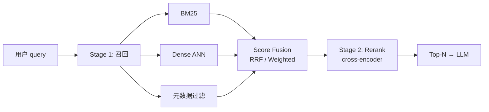
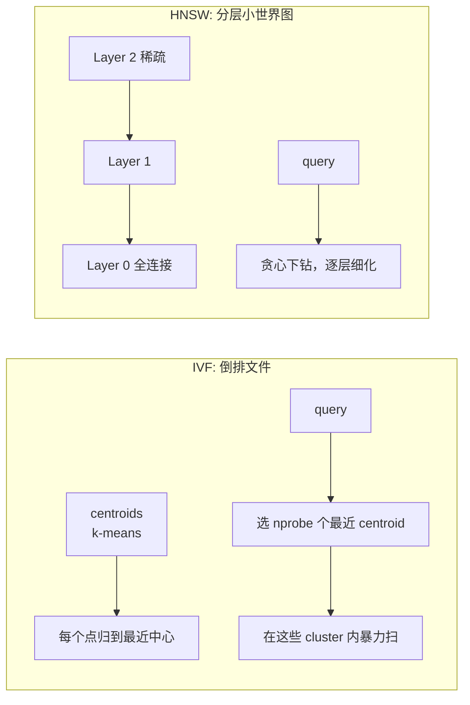
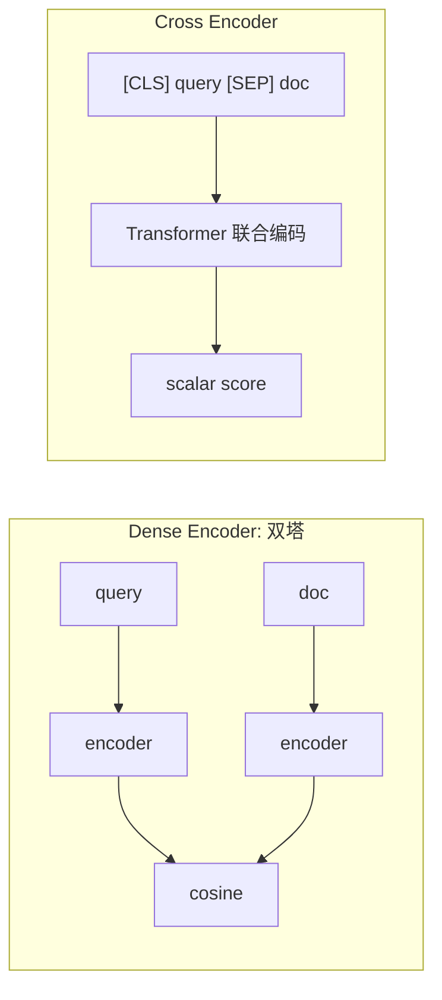

# Vector DB 选型 + Reranker 深入

> RAG 工程化里，Top-K 命中率每提升 5 个百分点都很难。这一篇覆盖 pgvector / Milvus / Qdrant / Elasticsearch + Faiss 的工程选型、HNSW vs IVF 调参、bge-reranker 训练与混合分数融合（RRF / Weighted）。


## 总览：召回 + 重排是两个独立的优化空间



**召回**：宽，要求 Recall 高（漏招回是地基塌方）。
**重排**：窄，要求精度高（让真正相关的文档排到前 N）。

把这两步用不同的模型、不同的优化目标对待，是 RAG 质量上分的关键。

## 1. Vector DB 工程选型

| 引擎 | 部署模型 | 索引类型 | 优势 | 不适合 |
|---|---|---|---|---|
| **pgvector** | Postgres 扩展 | IVFFlat、HNSW（pgvector 0.5+） | 与 OLTP 同库、SQL JOIN、事务一致 | 单节点千万向量以上、超高 QPS |
| **Milvus** | 独立分布式 | IVF、HNSW、DiskANN、SCANN | 大规模（亿级+）、GPU 索引、生产化完整 | 运维复杂、对小规模过重 |
| **Qdrant** | 独立服务 | HNSW（带过滤优化） | 元数据过滤特别强、Rust 实现 latency 稳 | 生态比 Milvus / pgvector 略小 |
| **Elasticsearch + Faiss** | ES 自带 dense_vector | HNSW | BM25 与稠密同库、运维链路成熟 | dense_vector HNSW 调优空间小于专用引擎 |
| **Weaviate** | 独立服务 | HNSW + hybrid | 模块化（embed in-line）、GraphQL | 模块多、初学曲线陡 |

**选型建议（2026 视角）**：

- **百万级以内 + 已经在用 Postgres** → pgvector，最少基础设施。
- **千万级+ 且团队能维护分布式** → Milvus。
- **重视过滤性能（按租户/时间/标签）** → Qdrant，HNSW + filter 在它家是一等公民。
- **已经有 ES 集群，BM25 是主路径** → ES + dense_vector（百度健康助手就走这条）。

### 决策细节：HNSW vs IVF



| 维度 | IVF | HNSW |
|---|---|---|
| 构建时间 | 快（k-means） | 较慢（每点逐层插入） |
| 内存 | 小（只存倒排） | 大（每点存 M 条边） |
| 查询延迟 | 中（取决于 nprobe） | 低，稳定 |
| Recall 调节 | nprobe ↑ → recall ↑ | ef_search ↑ → recall ↑ |
| 适合 | 离线批量、内存紧张 | 在线低延迟检索 |

**生产经验：**

- HNSW 调参：`M = 16~48`（图的密度），`ef_construction = 100~400`（建图质量），`ef_search = 32~256`（查询召回 vs 速度的旋钮）。
- IVF 调参：`nlist ≈ √N`（cluster 数量），`nprobe ≈ nlist / 32` 起步。
- 内存估算：HNSW 是 IVF 的 2-4 倍。1000 万 × 1024 维 fp32 + HNSW，大约 **40-50 GB**。

## 2. 混合检索：BM25 + Dense + 分数融合

百度健康助手的实践：医学术语（疾病名、药品名、检查指标）必须 **BM25** 精确召回；口语化症状描述（"心口疼喘不上气"）必须 **Dense** 语义召回。融合是必修课。

```python
import math
from collections import defaultdict

def reciprocal_rank_fusion(
    results_per_retriever: dict[str, list[str]],  # {"bm25": [doc_id...], "dense": [...]}
    k: int = 60,
) -> list[tuple[str, float]]:
    """RRF: 不需要校准不同打分器的分数尺度，只看排名。"""
    scores: dict[str, float] = defaultdict(float)
    for _retriever, docs in results_per_retriever.items():
        for rank, doc_id in enumerate(docs, start=1):
            scores[doc_id] += 1.0 / (k + rank)
    return sorted(scores.items(), key=lambda x: x[1], reverse=True)


def weighted_fusion(
    bm25: list[tuple[str, float]],
    dense: list[tuple[str, float]],
    alpha: float = 0.6,                            # dense 权重
) -> list[tuple[str, float]]:
    """Weighted: 需要先把分数 normalize 到 [0,1]。"""
    def norm(scored: list[tuple[str, float]]) -> dict[str, float]:
        if not scored:
            return {}
        lo, hi = min(s for _, s in scored), max(s for _, s in scored)
        if hi - lo < 1e-9:
            return {d: 1.0 for d, _ in scored}
        return {d: (s - lo) / (hi - lo) for d, s in scored}

    b, d = norm(bm25), norm(dense)
    keys = set(b) | set(d)
    fused = [(k_, alpha * d.get(k_, 0) + (1 - alpha) * b.get(k_, 0)) for k_ in keys]
    return sorted(fused, key=lambda x: x[1], reverse=True)
```

**经验法则**：

- **冷启动用 RRF**：不需要拍 alpha，工程上极稳。
- **有评测集后切到 Weighted**：用一份 (query, gold_docs) 数据网格搜 alpha ∈ {0.3, 0.5, 0.7}，挑 Recall@5 最高的。
- 不要在融合前去重 — 两路都命中的文档自然会拿到更高的融合分。

### 元数据过滤的工程坑

医疗问答里"过去 1 年的指南"、"成人剂量"这种约束特别多。两种实现方式：

- **Post-filter**：ANN 取 Top-K，再按元数据筛 → 简单但 Recall 会掉（如果 K 不够大就直接丢）。
- **Pre-filter (HNSW)**：在图搜索时跳过不满足条件的节点 → Qdrant、Weaviate、Milvus 较新版都支持。

> 生产坑：很多团队默认走 post-filter，发现 "明明库里有，就是检不到"，最后排查到是 K 设小了被筛光。 排查方法：把不带元数据约束的召回也拉出来对比。

## 3. Reranker：Cross-Encoder 才是精度天花板



**为什么 cross-encoder 比双塔强？** 双塔为了支持 ANN，必须把 query 和 doc 独立编码，所有交互推迟到内积一刻；cross-encoder 让 attention 在两段文本之间 **逐 token 交互**，能捕捉 "心口疼" 与 "胸痛(angina)" 这种跨文本的"翻译"关系。

**代价是慢**：每对 (query, doc) 都要跑一次完整 forward。所以只能放到 **第二阶段**，给召回阶段的 Top-K 重排。

### 选型对比

| 模型 | 语言 | 推理速度 (P95) | 备注 |
|---|---|---|---|
| **bge-reranker-large** | 中英 | ~50ms / 100 doc batch | 主流，质量稳定，BAAI 出品 |
| **bge-reranker-v2-m3** | 多语言 | ~80ms | m3 系列，长文本友好 |
| **jina-reranker-v2** | 多语言 | ~40ms | 速度优势，质量略低 |
| **rerankerSDK** (Cohere) | 多语言 | 网络 + 模型 | 不想自托管时 |
| **mxbai-rerank-large-v1** | 英文 | ~60ms | mixedbread 出品，英文榜单强 |

### 自托管 + 微调骨架

百度健康助手的 reranker 在通用 bge-reranker 上做了**领域微调**：构造 (medical_query, relevant_doc, irrelevant_doc) 三元组，用 contrastive loss 进一步 fine-tune。Top-3 命中率 70% → 88%+ 中，**~5pp 来自这次微调**。

```python
import torch
from torch.utils.data import Dataset
from transformers import AutoTokenizer, AutoModelForSequenceClassification

class TripletDataset(Dataset):
    """每条样本: (query, positive_doc, negative_doc)。"""
    def __init__(self, triplets, tokenizer, max_len=512):
        self.triplets = triplets
        self.tok = tokenizer
        self.max_len = max_len

    def __getitem__(self, i):
        q, pos, neg = self.triplets[i]
        pos_enc = self.tok(q, pos, truncation=True, max_length=self.max_len, return_tensors="pt")
        neg_enc = self.tok(q, neg, truncation=True, max_length=self.max_len, return_tensors="pt")
        return pos_enc, neg_enc


def contrastive_loss(pos_score: torch.Tensor, neg_score: torch.Tensor, margin: float = 0.2):
    """margin ranking: 正例至少比负例高 margin。"""
    return torch.clamp(margin - pos_score + neg_score, min=0).mean()


def train_step(model, pos_batch, neg_batch, opt):
    model.train()
    pos_score = model(**pos_batch).logits.squeeze(-1)
    neg_score = model(**neg_batch).logits.squeeze(-1)
    loss = contrastive_loss(pos_score, neg_score)
    loss.backward()
    opt.step()
    opt.zero_grad()
    return loss.item()
```

**负例挖掘**：训练效果对负例质量极敏感。生产里组合使用：

- **In-batch negatives**：同 batch 其他 query 的正例当负例。
- **Hard negatives**：用第一版 reranker 的 Top-K 错答案作为下一轮训练的负例。
- **Random negatives**：保留少量纯随机，防止过拟合到 hard 区。

## 4. 引用溯源：让 LLM 答案带证据

医疗、法律等高风险场景，必须告诉用户"这句话来自哪个文档的哪段"。**关键设计**：在 prompt 里给每个 chunk 编号，要求模型答案里直接附 `[doc_id]`。

```text
你是医学知识助手。仅根据下面的资料回答；每个事实必须标注引用编号 [n]。
如果资料不足以回答，请明确说明 "资料不足"。

资料：
[1] 急性胰腺炎主要表现为上腹剧烈疼痛，常向腰背部放射……
[2] 急性胰腺炎的实验室检查关键指标包括血淀粉酶、脂肪酶……
[3] ……

问题：急性胰腺炎主要有哪些症状？需要做什么检查？
```

模型输出后，做一道 **后处理校验**：

```python
import re

CITATION_RE = re.compile(r"\[(\d+)\]")

def validate_citations(answer: str, allowed_ids: set[int]) -> tuple[bool, list[int]]:
    cited = [int(x) for x in CITATION_RE.findall(answer)]
    invalid = [c for c in cited if c not in allowed_ids]
    sentences_without_cite = [
        s for s in re.split(r"[。.!?！？]", answer)
        if s.strip() and not CITATION_RE.search(s)
    ]
    return (not invalid and not sentences_without_cite), invalid
```

若校验失败：**重试一次（带错误反馈）**，还失败则降级为"资料不足"模板。

## 5. 评测口径

| 指标 | 说明 | 在百度健康助手的实际值 |
|---|---|---|
| Recall@K (K=20) | 召回阶段 Top-K 内是否包含相关文档 | 96%+ |
| nDCG@10 | 排序质量，重排后 | 0.78（重排前 0.61） |
| Top-3 命中率 | LLM 用的 Top-3 是否全相关 | 88%+ |
| 引用准确率 | 答案里的 `[n]` 标注是否对应正确文档 | 95%+ |
| 安全兜底召回 | 高风险问题（急症 / 高风险用药）被识别 | 98%+ |

测试集构造：**人工标注的 (query, relevant_doc_ids) 1000 条 + 线上 Badcase 100 条**。每次 reranker 更新或 chunking 策略改动都跑一次。

## 6. 与简历项目的映射

| 简历技术点 | 对应实现 |
|---|---|
| BM25 + Dense 混合检索 | 见 §2 score fusion |
| bge-reranker 重排 | 见 §3，含领域微调 |
| 引用溯源 | 见 §4，附校验 |
| Top-3 命中率 70% → 88%+ | mix 召回 +3pp，rerank 通用 +5pp，rerank 领域微调 +5pp |
| ES + Faiss 自建检索 | ES dense_vector + 自托管 reranker |
| 安全兜底召回 98%+ | 风险关键词词典 + 二级 LLM 分类器 |

## 7. 面试追问模板

**Q1：为什么不用 OpenAI Embeddings + cosine 一把梭？**
A：单 dense 召回在专业领域容易漏掉精确术语（"地高辛"会被映射到"心脏药"附近的语义云，但不一定是 Top-K）。BM25 对精确 token 强，dense 对口语化弱化句强，互补。**实测加 BM25 后 Recall@20 直接涨 8pp**。

**Q2：HNSW 的 `ef_search` 怎么调？**
A：`ef_search` 是查询时图搜索的"宽度"。从 64 开始，按 (Recall, Latency) 二维网格搜：每翻倍记录 Recall 涨幅和 P95 延迟。一般 128-256 是甜点。**注意 `ef_search` ≥ `top_k`，否则 recall 必然不达标**。

**Q3：reranker 不能放到第一阶段一把搞定吗？**
A：cross-encoder 必须给定 (query, doc) 对，**没有 ANN 索引可言**。如果库里 1000 万文档，每条 query 都要跑 1000 万次 forward — 不可行。所以必须先用 ANN 召回到 Top-50/100，再 rerank。

**Q4：RRF 和 Weighted 怎么选？**
A：**冷启动 RRF**：不需要校准两路分数尺度，工程上极稳。有评测集后切到 Weighted，能多挤 1-2pp。RRF 公式 `1/(k+rank)`，k 取 60 是论文默认值，大多数场景不用调。

**Q5：chunk size 怎么选？**
A：医疗答案需要"完整段落级"上下文，**典型 chunk_size 400-800 tokens，overlap 80-160**。但要看 embedding 模型上限：bge-large-zh 上限 512 token，bge-m3 是 8192，所以 m3 可以做更大 chunk。**强烈建议做 chunk size 的 A/B 评测**，不要凭直觉。

**Q6：医疗 RAG 的安全兜底怎么做？**
A：三层：1) 关键词词典识别急症（胸痛 + 大汗 + 呼吸困难 → 立刻提示就医），2) LLM 二级分类（高风险用药、诊断结论、处方），3) 命中后强制走"建议线下就医"模板，不调用 LLM 自由回答。**安全召回率 98%+ 是这层的 KPI**。

**Q7：如何评估 reranker 的提升？**
A：拿同一份 (query, gold_docs) 评测集，跑两次：纯召回 vs 召回+重排。看 **nDCG@10** 和 **Top-3 全相关率** 两个指标。我们的 reranker 把 nDCG@10 从 0.61 提到 0.78，Top-3 命中率提了 ~5pp。

**Q8：如果 pgvector 撑不住怎么办？**
A：先看是哪个维度撑不住。如果是 QPS，加只读副本；如果是写入吞吐，分表 + IVFFlat 多分片；如果是向量数量超过 5kw 单机内存装不下，迁移到 Milvus / Qdrant。**先扩 pgvector 而不是急着换栈**，业务 SQL 链路全保留是巨大的优势。

## 8. 参考资料

- *Approximate Nearest Neighbor Search in High Dimensions* (Andoni et al., 2018) — ANN 综述
- *Efficient and robust approximate nearest neighbor search using Hierarchical Navigable Small World graphs* (Malkov & Yashunin, 2018) — HNSW 原论文
- *Reciprocal Rank Fusion outperforms Condorcet and individual Rank Learning Methods* (Cormack et al., 2009)
- BAAI bge / bge-m3 / bge-reranker 模型卡 + 训练数据公开
- Qdrant 文档 `filtering` 章节 — 看 pre-filter 是怎么和 HNSW 联动的
- Milvus 文档 `Index types` — IVF / HNSW / DiskANN / SCANN 的对比
- pgvector GitHub README — HNSW vs IVFFlat 调参建议
- Anthropic *Contextual Retrieval* — chunk 加 context 前缀，召回质量再升一截
