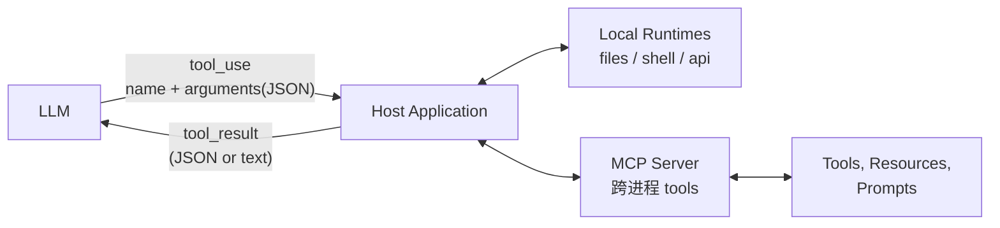
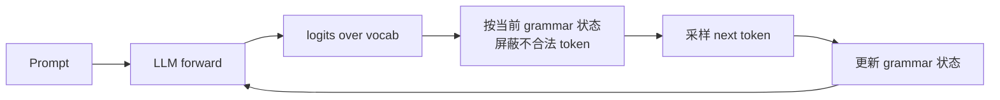
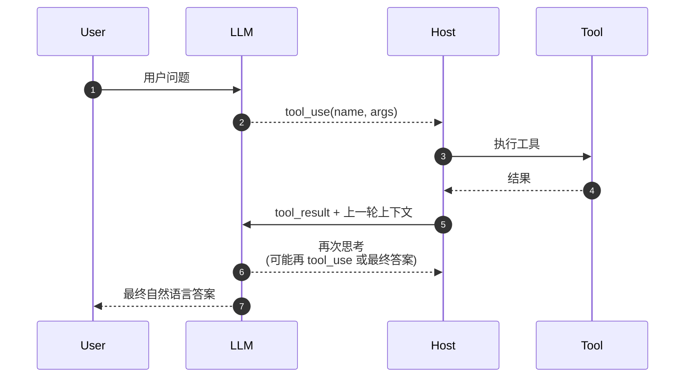
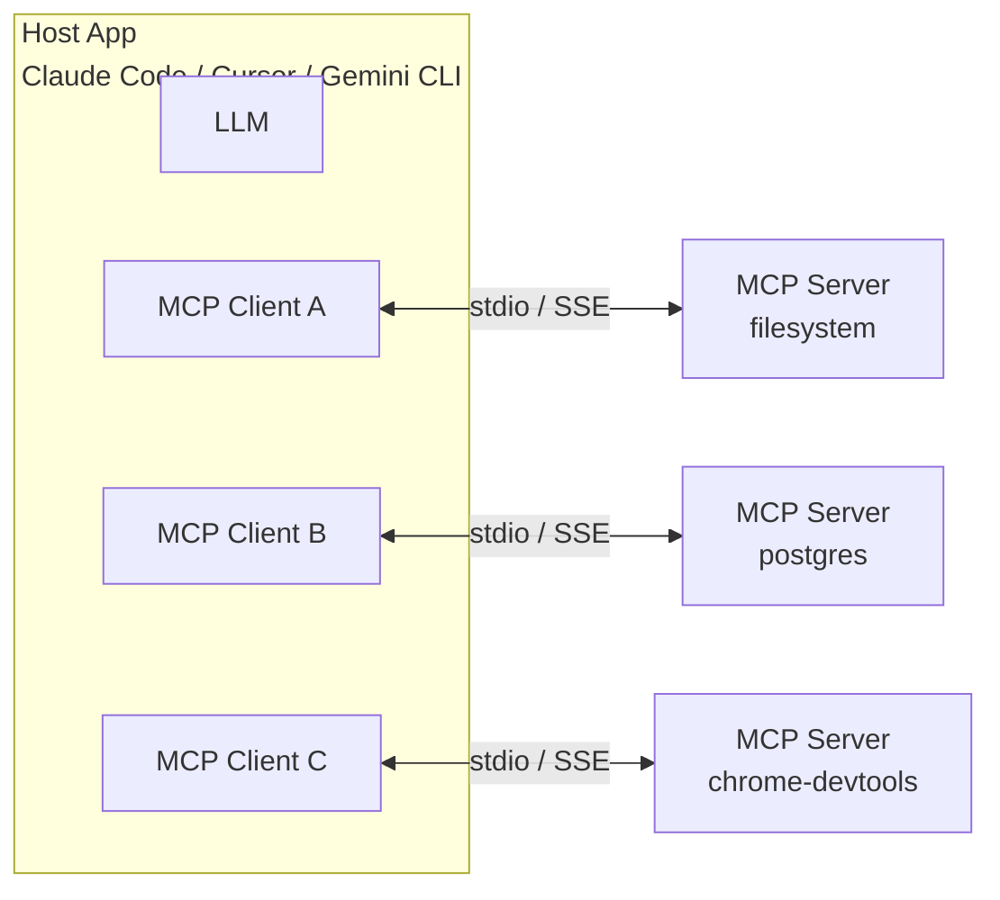

# Tool Calling、Structured Output、MCP 协议

> Agent 落地的核心是"让模型可靠地输出可被执行的东西"。这一篇拆开 function calling 在 OpenAI / Anthropic / Gemini 三家的形态差异、JSON Schema 约束、constrained decoding 实现原理，以及 2024-2026 兴起的 MCP 协议。


## 总览



要在面试里讲清两个层次的区别：

- **Tool Calling 是 LLM API 层的能力**：模型决定"现在要调一个工具"，按 schema 输出参数。
- **MCP 是 Tool 的生态协议**：让"模型 ↔ 工具"之间的协议标准化，工具可以独立进程托管、跨应用复用。

## 1. JSON Schema 约束 vs Prompt 指令

Prompt 里写"请输出 JSON"是最弱的方式，模型可能漏字段、错类型、嵌一层奇怪的 markdown 包装。**JSON Schema 约束**是 SDK 在采样阶段做 token-level 屏蔽，**保证语法合法**。

### 三家 API 的形态差异

```python
# 1) OpenAI / Compatible — Structured Outputs
from openai import OpenAI
client = OpenAI()
resp = client.chat.completions.create(
    model="gpt-4.1",
    messages=[{"role": "user", "content": "解析这条订单：iPhone 15 Pro × 2, 9999"}],
    response_format={
        "type": "json_schema",
        "json_schema": {
            "name": "Order",
            "strict": True,
            "schema": {
                "type": "object",
                "properties": {
                    "items": {
                        "type": "array",
                        "items": {
                            "type": "object",
                            "properties": {
                                "name": {"type": "string"},
                                "qty": {"type": "integer", "minimum": 1},
                                "unit_price": {"type": "number"},
                            },
                            "required": ["name", "qty", "unit_price"],
                            "additionalProperties": False,
                        },
                    },
                    "total": {"type": "number"},
                },
                "required": ["items", "total"],
                "additionalProperties": False,
            },
        },
    },
)
```

```python
# 2) Anthropic — 通过 Tool Use 间接实现
import anthropic
client = anthropic.Anthropic()
resp = client.messages.create(
    model="claude-opus-4-7",
    max_tokens=1024,
    tools=[{
        "name": "submit_order",
        "description": "提交订单",
        "input_schema": {  # 等价于 OpenAI 的 json_schema.schema
            "type": "object",
            "properties": {
                "items": {...},
                "total": {"type": "number"},
            },
            "required": ["items", "total"],
        },
    }],
    tool_choice={"type": "tool", "name": "submit_order"},   # 强制必调
    messages=[{"role": "user", "content": "解析这条订单..."}],
)
# resp.content[0].input 就是符合 schema 的 dict
```

```python
# 3) Gemini — response_schema 直接传 pydantic 类
from pydantic import BaseModel
from google import genai

class OrderItem(BaseModel):
    name: str
    qty: int
    unit_price: float

class Order(BaseModel):
    items: list[OrderItem]
    total: float

client = genai.Client()
resp = client.models.generate_content(
    model="gemini-2.5-pro",
    contents="解析这条订单...",
    config={
        "response_mime_type": "application/json",
        "response_schema": Order,
    },
)
order = Order.model_validate_json(resp.text)
```

**关键差异**：

| 维度 | OpenAI | Anthropic | Gemini |
|---|---|---|---|
| 直出 JSON | `response_format=json_schema` | 需要装成 tool | `response_schema=PydanticClass` |
| 强制调用 | `function_call="…"` (legacy) / `response_format` | `tool_choice={"type":"tool", ...}` | `tool_config.function_calling_config.mode="ANY"` |
| 多工具并发 | parallel_tool_calls=True | 单 tool_use 一次 | parallel_function_calling=True |
| Strict 模式 | `strict: True` 强约束 | 工具调用即强约束 | response_schema 强约束 |

### Constrained Decoding 的实现原理



- 把 JSON Schema 编译成一个 **有限状态机 (FSM)** 或 Earley parser。
- 每一步采样前，按当前状态算出"接下来合法的 token 集合"。
- 把不合法 token 的 logits 设为 -∞，再 softmax 采样。

主流开源实现：**Outlines**、**lm-format-enforcer**、**xgrammar**（vLLM 0.7+ 默认）。

**坑**：约束会让模型"逼出"内容。某些场景下模型本来想说"我不知道"，但被 schema 强行要求填字段，会编造。**对策**：在 schema 里加 `nullable / optional` 字段，让模型有退出口。

## 2. Tool Calling：多轮 Agent 循环

工具调用不是单次输入输出，是一个循环：



骨架代码（Anthropic 风格，最直观）：

```python
def run_agent(user_msg: str, tools: list[Tool], max_steps: int = 8) -> str:
    messages = [{"role": "user", "content": user_msg}]

    for step in range(max_steps):
        resp = client.messages.create(
            model="claude-opus-4-7",
            max_tokens=2048,
            tools=[t.to_anthropic_schema() for t in tools],
            messages=messages,
        )

        # 检查模型是否决定调用工具
        tool_calls = [c for c in resp.content if c.type == "tool_use"]
        if not tool_calls:
            # 没有工具调用 = 最终答案
            return "".join(c.text for c in resp.content if c.type == "text")

        # 把模型上一轮"思考 + tool_use"原样追加
        messages.append({"role": "assistant", "content": resp.content})

        # 执行工具，把结果作为下一轮输入
        tool_results = []
        for call in tool_calls:
            tool = next(t for t in tools if t.name == call.name)
            try:
                result = tool.execute(**call.input)
                tool_results.append({
                    "type": "tool_result",
                    "tool_use_id": call.id,
                    "content": json.dumps(result, ensure_ascii=False),
                })
            except Exception as e:
                tool_results.append({
                    "type": "tool_result",
                    "tool_use_id": call.id,
                    "content": f"Error: {e}",
                    "is_error": True,
                })
        messages.append({"role": "user", "content": tool_results})

    raise RuntimeError(f"Agent did not converge after {max_steps} steps")
```

**生产级要点**：

1. **`max_steps` 必须有上限**。无限循环代价是无限 token 费用。典型 8-16 步。
2. **`is_error: True` 标记**让模型知道这次调用失败，下次会主动调整 args 而不是重复。
3. **工具结果尽量精简**：把 1000 行 JSON 喂回去会很快爆 context。给摘要 + tool_use_id，让下一轮通过 ID 引用细节。
4. **并发工具调用** (parallel function calling)：模型一轮里说"我要并发查天气和股价"，Host 并行执行，再一并回结果。**显著降低端到端延迟**。

## 3. MCP（Model Context Protocol）

Anthropic 2024 年提出，2025-2026 成为事实标准。**解决的核心问题**：每个应用都要把"文件读写、数据库、Slack、Jira..." 接进自己的工具列表，重复造轮子。



**MCP 把 "tool" 这个抽象拆成三类资源**：

| 资源 | 用途 | 例子 |
|---|---|---|
| **Tools** | 可调用的函数 | `filesystem.read_file`、`postgres.execute_sql` |
| **Resources** | 可读取的数据 | `file://...`、`db://schema/users` |
| **Prompts** | 预置 prompt 模板 | `"summarize this file"` |

### MCP 协议要点

- **传输**：stdio（本地进程）或 SSE / HTTP（远程）。
- **协议**：JSON-RPC 2.0。客户端发 `tools/list` 获取工具清单，`tools/call` 执行。
- **能力声明**：服务端启动时通过 `initialize` 告知支持哪些资源类型。
- **权限**：Host 决定哪些 server 暴露给 LLM；通常按"会话级别"授权。

### 最小化的 MCP Server（Python）

```python
# pip install mcp
from mcp.server import Server
from mcp.types import Tool, TextContent

app = Server("hello-server")

@app.list_tools()
async def list_tools() -> list[Tool]:
    return [
        Tool(
            name="echo",
            description="把输入原样返回",
            inputSchema={
                "type": "object",
                "properties": {"message": {"type": "string"}},
                "required": ["message"],
            },
        ),
    ]

@app.call_tool()
async def call_tool(name: str, arguments: dict) -> list[TextContent]:
    if name == "echo":
        return [TextContent(type="text", text=arguments["message"])]
    raise ValueError(f"unknown tool: {name}")

if __name__ == "__main__":
    import asyncio
    from mcp.server.stdio import stdio_server
    asyncio.run(stdio_server(app))
```

跑起来后注册到 Claude Code / Cursor：

```json
{
  "mcpServers": {
    "hello": {
      "command": "python",
      "args": ["/abs/path/to/server.py"]
    }
  }
}
```

> 面试加分项：MCP 的真正价值不是"协议"本身，而是**让 Tool 的生态从应用内绑死走向跨应用复用**。一个写好的 `git-mcp-server` 可以同时被 Claude Code、Cursor、Gemini CLI、Continue 调用。**这是 Agent 时代的 "USB-C"**。

## 4. 工具设计：让模型用得对

工具的 schema 决定了模型用得好不好。这里有几条来自实战的经验：

**(1) 工具名要"动词 + 资源"**：`get_weather` 比 `weather` 好；`search_orders` 比 `orders_query` 好。模型对自然语言风格的名字理解更稳。

**(2) 描述要写"什么时候用"**：

```json
{
  "name": "calculate_shipping",
  "description": "计算订单的运费。**只在用户已经选好商品并提供收货地址时调用**。如果地址不完整请先调 ask_user。",
  ...
}
```

把"调用条件"写在 description 里，是教模型"什么时候不要调"。这一条比加 system prompt 有效十倍。

**(3) 参数 enum 化**：能枚举的尽量枚举。`status: "pending" | "shipped" | "cancelled"` 比 `status: string` 准确率高 30%+。

**(4) 输出"半结构化"**：返回值最好是 JSON，但带一个 `summary: string` 字段供模型用自然语言转述给用户：

```json
{
  "shipping_cost": 12.5,
  "estimated_days": 3,
  "summary": "运费 ¥12.5，预计 3 天送达。"
}
```

**(5) 避免"上帝工具"**：一个 `do_everything(action, params)` 比五个明确工具差太多。让 schema 帮模型筛选可能性。

## 5. 与简历项目的映射

| 简历技术点 | 对应实现 |
|---|---|
| Gemini Planner JSON Schema 输出 | §1 Gemini structured output + Pydantic |
| LangGraph 工具节点 | §2 多轮工具循环 |
| 双层意图解析（规则 + LLM） | 规则前置 + Tool Calling fallback |
| Provider 抽象 | §1 三家 API 差异 → 统一适配层 |
| 多模型路由 | 按 schema 复杂度 / 成本路由到不同模型 |
| ArtArch.AI 30+ 节点类型 | 每个节点是一个 tool schema |

## 6. 面试追问模板

**Q1：JSON Schema 约束是怎么"保证"模型一定输出合法 JSON 的？**
A：通过 constrained decoding。把 schema 编译成 FSM，每步采样前用当前状态算出合法 token 集合，把不合法 token 的 logits 设为 -∞ 再 softmax。本质上不是"让模型自觉"，是"逼模型只能从合法 token 里选"。

**Q2：为什么 Anthropic 用 tool_use 实现 structured output，而不是直接给 `response_format`？**
A：设计哲学不同。Anthropic 把"输出结构化 JSON"看作"调用一个特殊工具"的特例，复用一套机制。好处是 tool_use 的 streaming、error handling 全部能用上；坏处是接口稍微绕一层。**两家的最终效果等价**。

**Q3：工具调用失败时怎么处理？**
A：三层：1) 工具内部捕获异常，返回 `{is_error: True, message: "..."}` 给模型；2) 模型根据 error 决定重试还是改 args 或放弃；3) Host 维护"工具调用失败次数 / 累计 token"两个看门狗，超阈值直接终止 agent。

**Q4：parallel function calling 什么时候有用？**
A：用户问题包含多个 **独立** 的子任务时。例：「上海明天天气，再帮我查下 AAPL 股价」。串行要 2 个 round-trip，并行就 1 个。**别用在有依赖的工具上**（先查用户位置再查天气），模型可能不理解依赖关系。

**Q5：MCP 和传统 function calling 有什么区别？**
A：function calling 是 **API 单次调用的能力**，工具定义跟应用绑死。MCP 是 **进程间协议**，工具可以独立进程托管、被多个应用复用。打个比方：function calling 是"应用内嵌函数"，MCP 是"系统级 daemon"。

**Q6：如果模型反复调一个错的工具怎么办？**
A：(1) 检查 description 是否写清楚了"什么时候不要用"；(2) 在工具 error message 里给出"建议下一步做什么"；(3) Host 层做"同一工具同样参数连续 N 次"的硬熔断。**Anthropic 的官方建议是连续 3 次同参数即终止**。

**Q7：怎么测试工具的 schema 质量？**
A：构造一组 (user_query, expected_tool_call, expected_args) 评测集（50-200 条），跑离线评测：模型调对工具的比例、参数正确率。把这个评测集集成到 CI，每次工具 schema 改动跑一次。**ArtArch.AI 的 Pattern Hit Rate 就是这种评测**。

**Q8：MCP Server 怎么做权限隔离？**
A：MCP 协议本身不强制权限模型，全靠 Host 实现。生产级做法：(1) Host 配置文件里声明每个 server 的能力清单；(2) 工具调用前 Host 检查白名单；(3) 敏感操作（写文件、SQL DDL）要求人工确认；(4) 所有调用记 audit log。

## 7. 参考资料

- OpenAI [Structured Outputs guide](https://platform.openai.com/docs/guides/structured-outputs)
- Anthropic [Tool Use docs](https://docs.anthropic.com/en/docs/build-with-claude/tool-use)
- Google [Gemini Function Calling / Structured Output](https://ai.google.dev/gemini-api/docs/function-calling)
- **MCP 官方规范**：[modelcontextprotocol.io](https://modelcontextprotocol.io)
- *Toolformer: Language Models Can Teach Themselves to Use Tools* (Schick et al., 2023)
- [Outlines](https://github.com/dottxt-ai/outlines)、[lm-format-enforcer](https://github.com/noamgat/lm-format-enforcer)、[xgrammar](https://github.com/mlc-ai/xgrammar) — constrained decoding 三巨头
- Anthropic [building-effective-agents](https://www.anthropic.com/research/building-effective-agents) — 实战模式总结
