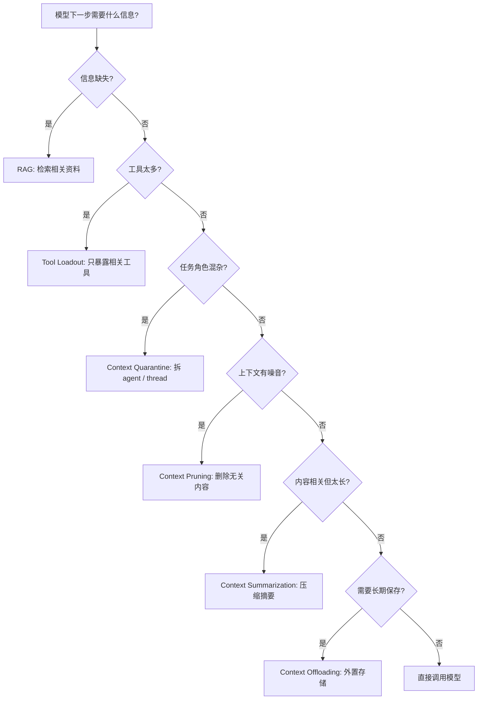
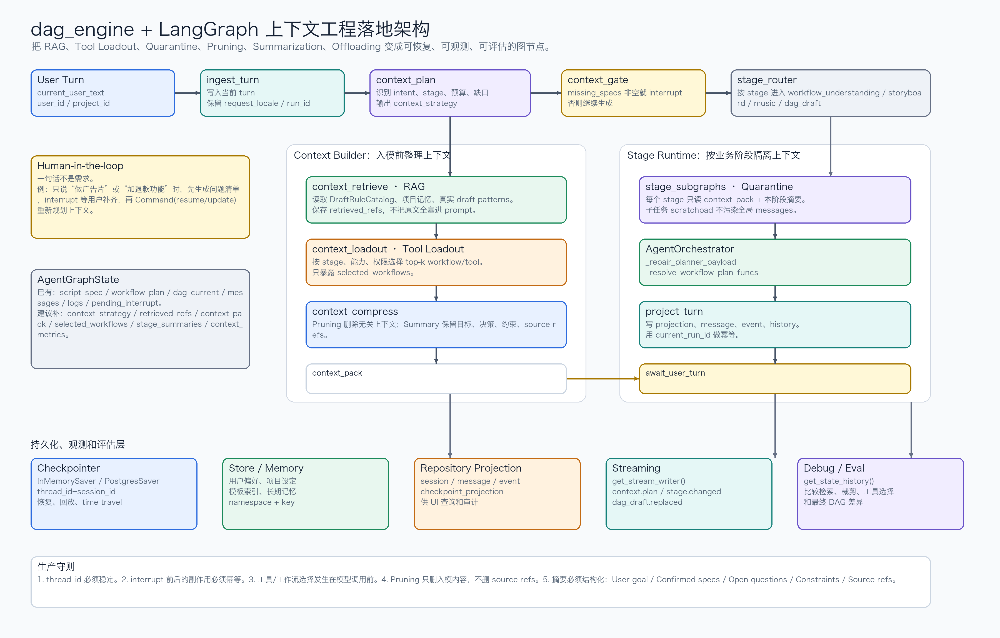

# How to Fix Your Context：上下文工程六法

> 来源仓库：<https://github.com/chinazhenzhen/how_to_fix_your_context>  
> 上游仓库：<https://github.com/langchain-ai/how_to_fix_your_context>  
> 这篇是面试复习版整理：保留原图，提炼 6 种 context engineering 技术，并结合 `dag_engine/agent` 的运行时结构，补充 LangGraph 最佳实践、可落地架构和带中文注释的伪代码。


## 1. 这份资料在讲什么

这份仓库围绕一个核心观点：Agent 质量不只取决于模型，也取决于你每一步给模型什么上下文。

Karpathy 把 Context Engineering 描述成：把“下一步需要的正确信息”放进上下文窗口的艺术和工程。这里的关键词不是“越多越好”，而是“刚好够用”。上下文太少，模型不知道该怎么做；上下文太多，模型会被历史、噪音、冲突信息和错误结论拖偏。

仓库基于 Drew Breunig 的文章《How to Fix Your Context》，用 LangGraph notebook 演示了 6 种修复上下文的方法：

| 方法 | 一句话解释 | 解决的主要问题 |
|---|---|---|
| RAG | 只在需要时检索相关资料放进上下文 | 缺少外部知识 |
| Tool Loadout | 只把当前任务相关工具暴露给模型 | 工具太多导致选择混乱 |
| Context Quarantine | 把不同任务隔离到不同 agent/thread | 上下文冲突、角色混杂 |
| Context Pruning | 删除检索结果或历史里的无关内容 | token 噪音太多 |
| Context Summarization | 把长上下文压缩成摘要 | 信息都相关但太长 |
| Context Offloading | 把信息放到外部存储，用工具读写 | 不适合一直塞进 prompt 的长期信息 |

## 2. 为什么长上下文会失败

长上下文失败不是因为模型“忘了”，而是模型对上下文里的 token 并不会等权处理。资料里引用了 Chroma 的 Context Rot 研究和 Drew Breunig 的四类失败模式：

| 失败模式 | 现象 | 例子 | 对策 |
|---|---|---|---|
| Context Poisoning | 错误进入上下文后被反复引用 | 第一次工具调用查错了，后续计划一直基于错数据 | 回滚、重检索、错误隔离 |
| Context Distraction | 历史太长，模型被旧任务牵引 | 用户已经换目标，但 agent 还围绕旧目标推理 | 摘要、阶段化 state、窗口裁剪 |
| Context Confusion | 无关信息让模型觉得都要用 | prompt 里塞了所有代码，模型引用了无关模块 | pruning、精确文件选择 |
| Context Clash | 上下文里存在互相矛盾的信息 | 两个文档给出不同 API 版本 | quarantine、source ranking、冲突检测 |

面试里可以这样讲：

> 上下文工程不是单纯扩大 context window，而是控制输入质量。生产 Agent 要持续决定：哪些信息检索进来、哪些工具暴露出去、哪些历史压缩、哪些信息外置、哪些上下文必须隔离。

## 3. 总体 LangGraph 实现框架

LangGraph 适合做上下文工程，不是因为它“自带聪明 agent”，而是因为它把一次 agent 运行拆成可观察、可恢复、可路由的 `State + Node + Edge`。这正好对应上下文工程的本质：每一步都决定“哪些信息进模型、哪些信息留在外部、哪些工具暴露、什么时候停下来问人”。

官方文档里可以抽象出 8 个关键机制：

| LangGraph 机制 | 对上下文工程的作用 | 典型 API / 概念 |
|---|---|---|
| 显式 `State` | 把上下文拆成结构化字段，避免全塞进 `messages` | `StateGraph(TypedDict/Pydantic/dataclass)`、reducers |
| 条件路由 | 根据当前状态决定检索、选工具、摘要、回答或人工确认 | `add_conditional_edges`、`Command(goto=...)` |
| 持久化检查点 | 线程内短期记忆、失败恢复、回放调试 | `compile(checkpointer=...)`、`thread_id`、`get_state_history` |
| 长期存储 | 跨线程保存用户偏好、项目记忆、工具目录、规则索引 | `Store`、`namespace`、`key` |
| 动态中断 | 不确定时暂停，等产品/用户补齐规格后再继续 | `interrupt()`、`Command(resume=..., update=...)` |
| 流式事件 | 把 agent 正在做什么暴露给前端和 trace | `stream()`、`astream()`、`get_stream_writer()`、`stream_mode="custom"` |
| 耐久执行 | 长流程中断后从检查点继续，避免重复副作用 | durable execution、idempotent task、durability modes |
| 容错策略 | 给慢工具、外部 API、LLM 调用加超时和重试边界 | retry policy、timeout、error handler、resume-safe failure |

这 8 个机制和 6 种 context engineering 方法可以这样对应：

| 上下文问题 | LangGraph 解决方式 | 落地原则 |
|---|---|---|
| 缺信息 | RAG 节点检索，并把命中文档引用写入 state | 主模型只看精选证据，原始证据留 trace |
| 工具太多 | 先 `select_tools`，再 `llm.bind_tools(selected)` | 工具 schema 也是上下文，不能全量暴露 |
| 上下文冲突 | 按阶段、角色、子任务拆 subgraph/thread | supervisor 只看摘要和结果，不吃子 agent 的 scratchpad |
| 检索噪音 | `prune_context` 节点抽取相关片段 | 删除噪音时保留 source id，方便回溯 |
| 全都相关但太长 | `summarize_context` 维护结构化摘要 | 摘要要保留决策、约束、未决问题、来源 |
| 不该进 prompt | Store / repository / object storage 外置 | prompt 里只放索引、引用和当前必要片段 |

### 3.1 通用骨架

下面这段伪代码表达的是“上下文构建器”模式：先规划上下文策略，再按策略检索、选工具、裁剪/摘要，最后才调用主模型。关键点是：LLM 调用不是图里的第一步，第一步应该是把上下文整理干净。

```python
from typing import Literal, TypedDict
from langgraph.graph import StateGraph, START, END
from langgraph.graph.message import MessagesState
from langgraph.types import Command

class ContextState(MessagesState):
    # 当前会话/线程标识。生产里会映射到 config.configurable.thread_id。
    session_id: str

    # 当前业务阶段，例如 intent、storyboard、music、dag_draft。
    # 阶段是 tool loadout 和 context quarantine 的重要输入。
    stage: str

    # 本轮用户真实意图。不要让后续节点反复从自然语言里猜。
    intent: str

    # 本轮要采用的上下文策略，例如 ["rag", "tool_loadout", "prune"]。
    context_strategy: list[str]

    # 检索命中的原始证据引用。这里存引用，不建议把长正文都放进 prompt。
    retrieved_refs: list[dict]

    # 已裁剪/压缩、允许进入主模型 prompt 的上下文包。
    context_pack: dict

    # 本轮允许暴露给模型的工具或工作流 ID。
    selected_tools: list[str]

    # 长会话摘要。它是短期记忆的一部分，由 checkpointer 保存。
    running_summary: str

    # token 预算。超过预算时触发 prune 或 summarize。
    context_budget: int

    # 等待用户补充的问题。非空时进入 interrupt。
    missing_specs: list[str]

def plan_context(state: ContextState) -> dict:
    """根据意图、阶段、预算和缺口，决定本轮上下文策略。"""
    strategy = []

    # 需要外部知识、项目规则或模板时，先检索，不让主模型凭记忆猜。
    if state["intent"] in {"question", "design", "modify_dag"}:
        strategy.append("rag")

    # 进入执行或生成阶段时，先缩小工具/工作流集合。
    if state["stage"] in {"storyboard", "music", "dag_draft"}:
        strategy.append("tool_loadout")

    # prompt 预算超标时，先做裁剪；如果全部信息都相关，再做摘要。
    if estimate_prompt_tokens(state) > state["context_budget"]:
        strategy.extend(["prune", "summarize"])

    # 如果需求缺关键规格，直接进入人工确认，不要让模型继续编。
    missing = detect_missing_specs(state)
    if missing:
        strategy.append("interrupt_for_specs")

    return {
        "context_strategy": dedupe(strategy),
        "missing_specs": missing,
    }

def route_context(state: ContextState) -> Literal[
    "retrieve_context",
    "select_tools",
    "compress_context",
    "ask_human",
    "call_model",
]:
    """把策略转成下一步节点。真实项目里也可以返回 Send 做并行检索。"""
    if "interrupt_for_specs" in state["context_strategy"]:
        return "ask_human"
    if "rag" in state["context_strategy"] and not state.get("retrieved_refs"):
        return "retrieve_context"
    if "tool_loadout" in state["context_strategy"] and not state.get("selected_tools"):
        return "select_tools"
    if needs_compression(state):
        return "compress_context"
    return "call_model"

def ask_human(state: ContextState) -> Command[Literal["plan_context"]]:
    """用 interrupt 暂停图执行，等待用户补齐不能由 AI 猜的规格。"""
    answer = interrupt({
        "kind": "missing_specs",
        "stage": state["stage"],
        "questions": state["missing_specs"],
    })

    # resume 后不要直接进模型，先把用户补充写回 state，再重新规划上下文。
    return Command(
        update={
            "messages": [{"role": "user", "content": answer}],
            "missing_specs": [],
        },
        goto="plan_context",
    )

builder = StateGraph(ContextState)
builder.add_node("plan_context", plan_context)
builder.add_node("retrieve_context", retrieve_context)
builder.add_node("select_tools", select_tools)
builder.add_node("compress_context", compress_context)
builder.add_node("ask_human", ask_human)
builder.add_node("call_model", call_model)

builder.add_edge(START, "plan_context")
builder.add_conditional_edges("plan_context", route_context)
builder.add_edge("retrieve_context", "plan_context")
builder.add_edge("select_tools", "plan_context")
builder.add_edge("compress_context", "plan_context")
builder.add_edge("call_model", END)

graph = builder.compile(checkpointer=checkpointer, store=store)
```

### 3.2 为什么这比“一个大 prompt”可靠

一个大 prompt 的问题是所有信息都同权出现：历史对话、旧错误、工具 schema、检索噪音、业务规则、用户新需求混在一起。LangGraph 的好处是可以把它们拆成不同生命周期：

| 生命周期 | 应该放哪里 | 例子 |
|---|---|---|
| 当前模型调用才需要 | 临时 `context_pack` | 本轮检索片段、当前 stage 的规则 |
| 当前线程要恢复 | checkpoint state | `running_summary`、`pending_interrupt`、最近 messages |
| 跨线程复用 | Store / repository | 用户偏好、项目设定、模板索引、规则库 |
| 只做审计/回放 | event projection / trace | 原始工具结果、检索 hit、token 统计 |
| 大对象 | object storage + ref | 文件全文、长日志、图片、视频生成结果 |

所以生产 Agent 的上下文工程不是“给模型更多东西”，而是每个节点只读自己需要的结构化字段，只向 state 写必要更新，并把可重放证据留在外部存储里。

## 4. 方法一：RAG

### 解决什么问题

RAG 是在模型缺外部知识时，把相关资料检索进上下文。仓库的 `01-rag.ipynb` 用 Lilian Weng 的博客作为资料源，构建向量库，再把 retriever 包成 tool，让模型按需检索。

它适合：

1. 问题依赖外部知识。
2. 不希望把所有资料一次性塞进 prompt。
3. 需要 trace “答案来自哪些文档”。

不适合：

1. 用户问题只依赖当前会话。
2. 检索源质量很差。
3. 资料冲突严重且没有 source ranking。

### LangGraph 伪代码

```python
from typing import Literal
from langgraph.graph import StateGraph, START, END
from langgraph.graph import MessagesState
from langchain_core.messages import ToolMessage

retriever_tool = create_retriever_tool(
    retriever,
    name="retrieve_blog_posts",
    description="Search relevant technical blog posts.",
)

llm_with_tools = llm.bind_tools([retriever_tool])

def llm_call(state: MessagesState) -> dict:
    response = llm_with_tools.invoke([
        SystemMessage(content=RAG_SYSTEM_PROMPT),
        *state["messages"],
    ])
    return {"messages": [response]}

def tool_node(state: MessagesState) -> dict:
    last = state["messages"][-1]
    outputs = []
    for call in last.tool_calls:
        if call["name"] == "retrieve_blog_posts":
            docs = retriever_tool.invoke(call["args"])
            outputs.append(ToolMessage(
                content=format_docs(docs),
                tool_call_id=call["id"],
            ))
    return {"messages": outputs}

def should_continue(state: MessagesState) -> Literal["tool_node", "__end__"]:
    last = state["messages"][-1]
    return "tool_node" if last.tool_calls else END

builder = StateGraph(MessagesState)
builder.add_node("llm_call", llm_call)
builder.add_node("tool_node", tool_node)
builder.add_edge(START, "llm_call")
builder.add_conditional_edges("llm_call", should_continue)
builder.add_edge("tool_node", "llm_call")
agent = builder.compile()
```

解析：

这里的关键不是“有向量库”，而是把检索变成一个显式工具调用。模型先判断是否需要检索，再把检索结果带回下一轮回答。这样可以避免每次都塞入大量文档，也方便记录每次 tool call 的 query、命中文档和 token 消耗。

## 5. 方法二：Tool Loadout

### 解决什么问题

Tool Loadout 是“工具上下文工程”。当工具很多时，把所有 tool schema 都塞给模型，会造成两个问题：

1. 工具描述本身占大量 token。
2. 相似工具互相干扰，模型选错工具。

仓库的 `02-tool-loadout.ipynb` 把 Python `math` 库函数做成工具注册表，先用向量检索从工具描述中选出 top-k，再只把相关工具 bind 给模型。

### LangGraph 伪代码

```python
from langgraph.store.base import BaseStore
from langgraph.store.memory import InMemoryStore

class ToolLoadoutState(MessagesState):
    selected_tools: list[str]

tool_store = InMemoryStore(index={"embed": embeddings})

def index_tools(tools: list[BaseTool]) -> None:
    for tool in tools:
        tool_store.put(
            ("tools",),
            key=tool.name,
            value={"name": tool.name, "description": tool.description},
        )

def select_relevant_tools(state: ToolLoadoutState, store: BaseStore) -> dict:
    user_query = state["messages"][-1].content
    hits = store.search(("tools",), query=user_query, limit=5)
    return {"selected_tools": [hit.key for hit in hits]}

def llm_call(state: ToolLoadoutState) -> dict:
    tools = [TOOL_REGISTRY[name] for name in state["selected_tools"]]
    model = llm.bind_tools(tools) if tools else llm
    response = model.invoke(state["messages"])
    return {"messages": [response]}

def tool_node(state: ToolLoadoutState) -> dict:
    # 只允许执行 selected_tools 里的工具
    return execute_selected_tool_calls(state)

builder = StateGraph(ToolLoadoutState)
builder.add_node("select_tools", select_relevant_tools)
builder.add_node("llm_call", llm_call)
builder.add_node("tool_node", tool_node)
builder.add_edge(START, "select_tools")
builder.add_edge("select_tools", "llm_call")
builder.add_conditional_edges("llm_call", tools_or_end)
builder.add_edge("tool_node", "llm_call")
graph = builder.compile(store=tool_store)
```

解析：

工具选择应该发生在 bind tools 之前，而不是让模型在几十个工具中自己挑。这个模式特别适合内部平台：比如工单、订单、支付、库存、CRM、监控都有工具，但用户当前只问“退款状态”，那只应该暴露订单和支付相关工具。

面试回答：

> 工具越多，不代表 Agent 越强。生产里要做动态 tool loadout：先根据用户意图和阶段选工具，再把少量相关工具暴露给模型，降低 token 成本和误调用风险。

## 6. 方法三：Context Quarantine

### 解决什么问题

Context Quarantine 是把不同任务的上下文隔离开。仓库的 `03-context-quarantine.ipynb` 用 supervisor 多 agent 架构：一个 supervisor 负责路由，math agent 只处理数学工具，research agent 只处理搜索研究。

它适合：

1. 一个任务需要多个专业角色。
2. 各角色上下文容易互相污染。
3. 不同 agent 需要不同 system prompt、工具和记忆。

### LangGraph 伪代码：Supervisor 风格

```python
from langgraph.prebuilt import create_react_agent
from langgraph_supervisor import create_supervisor

math_agent = create_react_agent(
    model=llm,
    tools=[add, multiply],
    prompt="You are a math expert. Only solve calculations.",
    name="math_expert",
)

research_agent = create_react_agent(
    model=llm,
    tools=[web_search],
    prompt="You are a research expert. Search and synthesize sources.",
    name="research_expert",
)

workflow = create_supervisor(
    agents=[math_agent, research_agent],
    model=llm,
    prompt="""
    Route tasks to the right specialist.
    Use research_expert for external facts.
    Use math_expert for calculations.
    Do not mix specialist scratchpads.
    """,
)

graph = workflow.compile(checkpointer=checkpointer)
```

### LangGraph 伪代码：手写路由风格

```python
class SupervisorState(MessagesState):
    task_type: Literal["research", "math", "mixed"]
    research_result: str
    math_result: str

def classify_task(state: SupervisorState) -> dict:
    task_type = router_llm.invoke(CLASSIFY_PROMPT.format(
        user=state["messages"][-1].content
    ))
    return {"task_type": task_type}

def route_task(state: SupervisorState) -> Literal["research_agent", "math_agent"]:
    return "research_agent" if state["task_type"] == "research" else "math_agent"

builder = StateGraph(SupervisorState)
builder.add_node("classify", classify_task)
builder.add_node("research_agent", research_subgraph)
builder.add_node("math_agent", math_subgraph)
builder.add_edge(START, "classify")
builder.add_conditional_edges("classify", route_task)
builder.add_edge("research_agent", END)
builder.add_edge("math_agent", END)
```

解析：

隔离的价值是减少 context clash。比如研究 agent 的网页结果、数学 agent 的中间计算、代码 agent 的文件 diff，不应该混成一个无限增长的 messages 列表。Supervisor 只保留任务分发和汇总上下文，细节留在各自子 agent/thread 里。

## 7. 方法四：Context Pruning

### 解决什么问题

Pruning 是删除无关内容。仓库的 `04-context-pruning.ipynb` 在 RAG 之后增加了一个 pruning 节点：先检索，再用更便宜的小模型按用户问题抽取相关片段，最后只把相关片段交给主模型。

资料里给出的效果：相同问题下，basic RAG 约 25k tokens，pruning 后约 11k tokens。

### LangGraph 伪代码

```python
class PruningState(MessagesState):
    raw_docs: list[str]
    pruned_context: str

def retrieve_docs(state: PruningState) -> dict:
    query = state["messages"][-1].content
    docs = retriever.invoke(query)
    return {"raw_docs": [doc.page_content for doc in docs]}

def prune_docs(state: PruningState) -> dict:
    query = state["messages"][-1].content
    pruned = cheap_llm.invoke(f"""
    User question:
    {query}

    Documents:
    {join_docs(state["raw_docs"])}

    Extract only the information relevant to the question.
    Remove boilerplate, unrelated examples, navigation text, and repeated content.
    Keep exact facts, numbers, and source names.
    """)
    return {"pruned_context": pruned.content}

def answer(state: PruningState) -> dict:
    response = strong_llm.invoke([
        SystemMessage(content="Answer using the pruned context."),
        HumanMessage(content=state["messages"][-1].content),
        HumanMessage(content=f"Context:\n{state['pruned_context']}"),
    ])
    return {"messages": [response]}

builder = StateGraph(PruningState)
builder.add_edge(START, "retrieve")
builder.add_node("retrieve", retrieve_docs)
builder.add_node("prune", prune_docs)
builder.add_node("answer", answer)
builder.add_edge("retrieve", "prune")
builder.add_edge("prune", "answer")
builder.add_edge("answer", END)
```

解析：

Pruning 适合“检索回来的内容里只有一部分相关”的场景。它不是摘要全部内容，而是明确删除无关内容。要注意，pruning 可能删掉后来需要的证据，所以最好保留 `raw_docs` 在 state 或 trace 中，方便调试和回放。

## 8. 方法五：Context Summarization

### 解决什么问题

Summarization 是把长上下文压缩成摘要。和 pruning 不同，它不一定删除主题，只是把冗长内容压缩。仓库的 `05-context-summarization.ipynb` 给 tool result 增加 summarization step，用小模型把文档压到更短但保留关键事实。

适合：

1. 全部内容都相关，但太长。
2. 长会话需要保留历史决策。
3. 工具输出很 verbose，比如日志、搜索结果、代码文件。

不适合：

1. 需要逐字引用原文。
2. 金额、法律条款、医疗建议等不能损失细节的场景。
3. 摘要模型不可靠且没有回溯原文机制。

### LangGraph 伪代码

```python
class SummaryState(MessagesState):
    running_summary: str
    raw_tool_result: str

def should_summarize(state: SummaryState) -> Literal["summarize", "answer"]:
    tokens = estimate_tokens(state["messages"], state.get("raw_tool_result", ""))
    return "summarize" if tokens > state["context_budget"] else "answer"

def summarize_context(state: SummaryState) -> dict:
    summary = cheap_llm.invoke(f"""
    Existing summary:
    {state.get("running_summary", "")}

    New content:
    {state["raw_tool_result"]}

    Produce a compact summary.
    Preserve decisions, constraints, source names, numbers, open questions, and user preferences.
    Remove repetition and examples that do not affect future decisions.
    """)
    return {
        "running_summary": summary.content,
        "raw_tool_result": "",
    }

def answer(state: SummaryState) -> dict:
    response = strong_llm.invoke([
        SystemMessage(content=f"Conversation summary:\n{state['running_summary']}"),
        *trim_recent_messages(state["messages"], keep_last=6),
    ])
    return {"messages": [response]}

builder = StateGraph(SummaryState)
builder.add_node("summarize", summarize_context)
builder.add_node("answer", answer)
builder.add_conditional_edges(START, should_summarize)
builder.add_edge("summarize", "answer")
builder.add_edge("answer", END)
```

解析：

摘要最好是结构化的，不要只写自然语言流水账。生产里可以要求摘要固定包含：

```text
User goal:
Confirmed decisions:
Open questions:
Important constraints:
Files/tools already inspected:
Do not repeat:
```

这样后续恢复比一段散文摘要更稳定。

## 9. 方法六：Context Offloading

### 解决什么问题

Offloading 是把信息放到 LLM 上下文之外，用工具读写。仓库的 `06-context-offloading.ipynb` 演示了两种模式：

1. session scratchpad：当前线程内临时笔记。
2. persistent memory：用 LangGraph Store 跨线程保存记忆。

这和真实 Agent 产品很接近：长期偏好、项目设定、研究笔记、用户画像、历史决策，不应该每轮都塞进 prompt，而应该在需要时检索或读取。

### LangGraph 伪代码：线程内 scratchpad

```python
from pydantic import Field
from langchain_core.tools import tool

class ScratchpadState(MessagesState):
    scratchpad: str = Field(default="", description="Temporary notes for this thread")

@tool
def write_to_scratchpad(notes: str) -> str:
    """Save notes for later use in this conversation."""
    return notes

@tool
def read_from_scratchpad() -> str:
    """Read saved notes for this conversation."""
    return "__READ_SCRATCHPAD__"

def tool_node(state: ScratchpadState) -> dict:
    updates = {"messages": []}
    for call in state["messages"][-1].tool_calls:
        if call["name"] == "write_to_scratchpad":
            notes = call["args"]["notes"]
            updates["scratchpad"] = notes
            updates["messages"].append(ToolMessage(
                content="Wrote notes to scratchpad.",
                tool_call_id=call["id"],
            ))
        elif call["name"] == "read_from_scratchpad":
            updates["messages"].append(ToolMessage(
                content=state.get("scratchpad", "No notes."),
                tool_call_id=call["id"],
            ))
    return updates
```

### LangGraph 伪代码：跨线程持久记忆

```python
from langgraph.store.memory import InMemoryStore
from langgraph.store.base import BaseStore

store = InMemoryStore()

def tool_node_persistent(state: ScratchpadState, store: BaseStore) -> dict:
    user_id = state["user_id"]
    namespace = ("user_memory", user_id)
    outputs = []

    for call in state["messages"][-1].tool_calls:
        if call["name"] == "save_memory":
            key = call["args"]["key"]
            value = call["args"]["value"]
            store.put(namespace, key, {"value": value})
            outputs.append(ToolMessage(
                content=f"Saved memory: {key}",
                tool_call_id=call["id"],
            ))

        if call["name"] == "read_memory":
            key = call["args"]["key"]
            item = store.get(namespace, key)
            value = item.value["value"] if item else "not found"
            outputs.append(ToolMessage(
                content=value,
                tool_call_id=call["id"],
            ))

    return {"messages": outputs}

graph = builder.compile(store=store, checkpointer=checkpointer)
```

解析：

Offloading 的关键是“可寻址”。如果只是把一段文本扔到数据库里，后面模型未必知道什么时候读。生产设计里要给 memory 加 namespace、key、metadata、ttl、source、last_updated 和权限边界。

适合外置的信息：

| 类型 | 存储方式 |
|---|---|
| 用户长期偏好 | user memory |
| 项目背景设定 | project memory |
| 当前研究计划 | thread scratchpad |
| 大文件内容 | object storage + chunk index |
| 工具调用结果 | event store / trace |
| 已确认决策 | checkpoint + projection |

## 10. 六种方法怎么选

可以按下面的判断顺序：



实践里经常组合使用：

| 场景 | 推荐组合 |
|---|---|
| 复杂研究问答 | RAG + pruning + summarization |
| 多工具业务 Agent | tool loadout + quarantine |
| 长流程创作 Agent | summarization + checkpoint + offloading |
| 代码库问答 | RAG + tool loadout + context pruning |
| 多角色任务 | supervisor quarantine + shared final summary |

## 11. 放到 `dag_engine/agent` 里怎么设计

`dag_engine/agent` 现在已经有一个很适合接上下文工程的骨架：

1. `AgentGraphRuntime` 用 `StateGraph` 组织节点，默认 `InMemorySaver`，生产可用 `PostgresSaver`。
2. `handle_turn` / `stream_turn` 通过 `thread_id=session_id` 复用同一条 LangGraph 线程。
3. `_node_await_user_turn` 已经使用 `interrupt()` 暂停，再用 `Command(resume=..., update=...)` 恢复。
4. `_node_project_turn` 用 `get_stream_writer()` 发 `message.created`、`stage.changed`、`dag_draft.replaced` 等 custom events。
5. `AgentGraphState` 已经把 `script_spec`、`workflow_plan`、`dag_current`、`messages`、`logs`、`pending_interrupt` 分成了结构化字段。
6. `AgentRepository` 已经有 `session_projection`、`message_projection`、`event_projection`、`checkpoint_projection`，天然适合做 offloading 和回放。

新架构图我放成了 PNG，方便单独打开放大看：



单独打开原图：[`assets/context-engineering-dagengine-langgraph.png`](../../assets/context-engineering-dagengine-langgraph.png)

### 11.1 现有结构和六法的映射

| 六法 | `dag_engine/agent` 当前已有基础 | 可以补强的点 |
|---|---|---|
| RAG | `DraftRuleCatalog.get_planning_context()` 已经像规则检索入口 | 把检索命中拆成 `retrieved_refs`，区分原始证据和入模片段 |
| Tool Loadout | `_resolve_workflow_plan_funcs()` 会把 symbolic workflow key 修成真实 registry ID | 在 LLM 生成前先 top-k 选择工作流/工具，避免把完整 registry 塞给模型 |
| Context Quarantine | 图里已经按 `workflow_understanding`、`storyboard`、`music`、`dag_draft` 拆节点 | 进一步把 stage 变成 subgraph，stage 内 scratchpad 不直接污染全局 messages |
| Context Pruning | planner payload 已有 repair/normalize 流程 | 对模板、规则、历史 messages 做入模前裁剪，保留 source refs |
| Context Summarization | `build_session_summary()` 和 session projection 是摘要基础 | 增加 `running_summary` / `stage_summaries`，按 token 预算触发 |
| Context Offloading | repository 已保存 state、messages、events、history | 大工具结果、长模板、完整 checkpoint history 只存引用，prompt 只放必要摘要 |

### 11.2 推荐增加的 state 字段

不要把所有东西都放进 `messages`。`messages` 只适合保存对话语义，不适合保存检索命中、工具目录、模板全文、长日志和每个 stage 的内部草稿。

```python
class AgentGraphState(TypedDict, total=False):
    # 已有字段：session_id / user_id / project_id / stage / messages / script_spec / workflow_plan ...

    # 本轮上下文策略。例：["rag", "tool_loadout", "prune", "interrupt_for_specs"]。
    context_strategy: list[str]

    # 检索命中引用。只保存 doc_id、source、score、chunk_id，不直接塞全文。
    retrieved_refs: list[dict]

    # 允许进入模型 prompt 的精选上下文。
    # 这里可以放 stage_rules、workflow_candidates、recent_summary、user_constraints。
    context_pack: dict

    # 本轮可用的工具/工作流/节点函数 ID。
    selected_tools: list[str]
    selected_workflows: dict[str, str]

    # 每个 stage 的结构化摘要，避免 storyboard 的细节污染 music 阶段。
    stage_summaries: dict[str, str]

    # 本轮未补齐的产品规格问题。非空时进入 interrupt。
    missing_specs: list[dict]

    # token 预算与实际消耗，用于触发 prune/summarize，也方便评估。
    context_budget: int
    context_metrics: dict

    # 外部存储引用。大文本、模板全文、工具原始输出都放外部。
    memory_refs: list[dict]
```

### 11.3 推荐图结构

现有图大致是：

```text
START
  -> ingest_turn
  -> workflow_understanding / intent / format_confirm / synopsis_choice / core_elements / storyboard / music / transition_sfx / dag_draft
  -> project_turn
  -> await_user_turn
  -> ingest_turn
```

可以改成：

```text
START
  -> ingest_turn
  -> context_plan
  -> context_retrieve        # 可选：RAG / 规则 / 模板 / 项目记忆
  -> context_loadout         # 可选：选择 workflow/tool/function
  -> context_compress        # 可选：prune / summarize
  -> context_gate            # 可选：缺规格就 interrupt
  -> stage_subgraph          # workflow_understanding / storyboard / music / dag_draft ...
  -> project_turn            # 写 projection、事件、checkpoint history
  -> await_user_turn
  -> ingest_turn
```

这里的关键变化是：每个业务 stage 之前先经过一层 Context Builder。主模型不直接面对全部历史、全部规则、全部工具，而是只接收 `context_pack`。

### 11.4 详细伪代码：上下文计划节点

```python
from typing import Literal
from langgraph.types import Command
from langgraph.config import get_stream_writer
from langgraph.graph import StateGraph, START

def _node_context_plan(state: AgentGraphState) -> dict:
    """决定本轮需要哪些上下文处理步骤。

    这个节点应该非常便宜，最好不用或少用大模型。
    它只做分类、预算估算、缺口识别，不负责生成最终内容。
    """
    writer = get_stream_writer()

    user_text = state.get("current_user_text", "")
    stage = state.get("stage", "workflow_understanding")
    script_spec = state.get("script_spec") or {}

    strategy: list[str] = []
    missing_specs: list[dict] = []

    # 1. 判断是否需要 RAG。
    # dag_engine 的 RAG 不一定是通用网页检索，更常见是：
    # - 业务规则库：不同生成类型、比例、时长、镜头数的约束
    # - 真实 draft 模板：已有作品的结构和节点组合
    # - workflow registry：有哪些真实可执行工作流
    if stage in {"workflow_understanding", "storyboard", "dag_draft"}:
        strategy.append("rag")

    # 2. 判断是否需要 Tool Loadout。
    # 只要接下来会让模型选择 generation_node_func / sequence_node_func /
    # audio_generation_node_func，就必须先缩小候选集合。
    if stage in {"storyboard", "music", "transition_sfx", "dag_draft"}:
        strategy.append("tool_loadout")

    # 3. 判断是否需要 Pruning / Summarization。
    # 注意这里不要只看 messages，也要看 script_spec、workflow_plan、模板候选和规则文本。
    estimated = estimate_context_tokens(
        messages=state.get("messages", []),
        script_spec=script_spec,
        workflow_plan=state.get("workflow_plan"),
        context_pack=state.get("context_pack"),
    )
    budget = state.get("context_budget", 12_000)
    if estimated > budget:
        strategy.append("prune")
    if estimated > budget * 1.5:
        strategy.append("summarize")

    # 4. 判断是否存在“不能由 AI 猜”的规格缺口。
    # 例：用户只说“加个退款功能”，那必须问：
    # - 是否支持部分退款？
    # - 优惠券、积分、满减如何回滚？
    # - 多次退款的幂等键是什么？
    # - 超时、失败、人工审核怎么处理？
    # 对 dag_engine 来说，同类问题是：用户只说“做一个广告片”，但没说比例、时长、
    # 镜头数量、品牌调性、禁用元素、是否需要旁白，这些都不应该让模型硬编。
    missing_specs = detect_missing_script_specs(stage, user_text, script_spec)
    if missing_specs:
        strategy.append("interrupt_for_specs")

    writer({
        "type": "context.plan",
        "stage": stage,
        "strategy": strategy,
        "estimated_tokens": estimated,
        "budget": budget,
        "missing_specs": missing_specs,
    })

    return {
        "context_strategy": dedupe(strategy),
        "missing_specs": missing_specs,
        "context_metrics": {
            **state.get("context_metrics", {}),
            "estimated_tokens_before": estimated,
        },
    }
```

### 11.5 详细伪代码：RAG + Tool Loadout

```python
def _node_context_retrieve(state: AgentGraphState) -> dict:
    """从规则库、模板库、项目记忆里取候选证据。

    原则：
    1. 这里可以取多一点，但不要全给模型。
    2. 原始命中保存到 refs，方便 trace 和回放。
    3. 真正进入 prompt 的内容后面由 prune 节点决定。
    """
    stage = state["stage"]
    script_spec = state.get("script_spec") or {}
    user_text = state.get("current_user_text", "")

    # 读取 dag_engine 已有的 planning context。
    # 这一步对应现在的 self.ops.draft_rule_catalog.get_planning_context(...)
    planning_context = self.ops.draft_rule_catalog.get_planning_context(script_spec)

    # 检索项目级记忆，例如品牌约束、用户偏好、历史已确认设定。
    # 如果使用 LangGraph Store，namespace 应按 user/project/stage 分层。
    project_memories = store.search(
        ("project_memory", state["project_id"], stage),
        query=user_text,
        limit=8,
    )

    # 检索真实 draft pattern，避免模型只凭语言描述 invent 节点结构。
    draft_patterns = self.ops.load_real_draft_patterns(
        generation_type=script_spec.get("generation_type"),
        aspect_ratio=script_spec.get("aspect_ratio"),
        limit=12,
    )

    refs = []
    refs.extend(to_refs("planning_context", planning_context))
    refs.extend(to_refs("project_memory", project_memories))
    refs.extend(to_refs("draft_pattern", draft_patterns))

    return {
        "retrieved_refs": refs,
        "context_pack": {
            **state.get("context_pack", {}),
            # 这里只放短摘要，完整内容通过 ref 回查。
            "planning_context_summary": summarize_planning_context(planning_context),
            "memory_hits": [short_memory(hit) for hit in project_memories],
            "draft_pattern_candidates": [short_pattern(p) for p in draft_patterns],
        },
    }

def _node_context_loadout(state: AgentGraphState) -> dict:
    """从完整 workflow registry 里选出本轮允许模型看到的候选。

    这一步是 Tool Loadout 在 dag_engine 里的核心。
    不要把所有 generation/sequence/audio workflow 都塞进 prompt。
    """
    stage = state["stage"]
    script_spec = state.get("script_spec") or {}
    planning_summary = state.get("context_pack", {}).get("planning_context_summary", "")

    # 1. 先按硬条件过滤：生成类型、是否需要图片输入、是否支持视频/音频、比例、时长等。
    hard_filtered = filter_workflows_by_capability(
        registry=self.ops.workflow_registry,
        generation_type=script_spec.get("generation_type"),
        requires_image=bool(script_spec.get("reference_image")),
        stage=stage,
    )

    # 2. 再按语义相关性排序：用户需求、stage、规则摘要、历史选择共同决定 top-k。
    ranked = rank_workflows(
        candidates=hard_filtered,
        query=build_workflow_query(state, planning_summary),
        limit=8,
    )

    # 3. 输出给模型的是少量候选 ID + 短描述，不是完整 Python 函数或全量 registry。
    selected = {
        item.kind: item.workflow_id
        for item in ranked
        if item.kind in {"generation", "sequence", "audio"}
    }

    return {
        "selected_workflows": selected,
        "selected_tools": [item.workflow_id for item in ranked],
        "context_pack": {
            **state.get("context_pack", {}),
            "workflow_candidates": [
                {
                    "id": item.workflow_id,
                    "kind": item.kind,
                    "capabilities": item.capabilities,
                    "why_selected": item.reason,
                }
                for item in ranked
            ],
        },
    }
```

### 11.6 详细伪代码：Pruning + Summarization

```python
def _node_context_compress(state: AgentGraphState) -> dict:
    """把 context_pack 压到预算内。

    Pruning 和 Summarization 的区别：
    - pruning：删除与本轮 stage 无关的内容；
    - summarization：相关内容太长时压缩，但保留决策和约束。
    """
    stage = state["stage"]
    context_pack = state.get("context_pack", {})
    budget = state.get("context_budget", 12_000)

    # 1. pruning：只保留当前 stage 必需字段。
    # 例如 music 阶段不需要完整 storyboard 推理链，只需要镜头节奏、情绪、时长。
    pruned_pack = prune_context_pack(
        context_pack,
        keep_rules=[
            "保留用户明确要求",
            "保留已经确认的 script_spec",
            "保留当前 stage 直接相关的 workflow_candidates",
            "保留会影响 DAG 正确性的限制",
            "删除历史闲聊、重复模板、无关 stage 的 scratchpad",
        ],
        stage=stage,
    )

    # 2. summarization：如果裁剪后仍超预算，生成结构化摘要。
    # 摘要必须是结构化字段，不能只是一段自然语言。
    if estimate_tokens(pruned_pack) > budget:
        stage_summary = cheap_llm.invoke({
            "task": "summarize_dag_engine_context",
            "stage": stage,
            "schema": {
                "user_goal": "用户最终要什么",
                "confirmed_specs": "已经确认的规格",
                "open_questions": "仍未确认的问题",
                "workflow_constraints": "工作流选择限制",
                "draft_constraints": "DAG 生成必须遵守的限制",
                "source_refs": "摘要依据哪些 retrieved_refs",
            },
            "content": pruned_pack,
        }).parsed

        pruned_pack = {
            "stage_summary": stage_summary,
            "workflow_candidates": pruned_pack.get("workflow_candidates", []),
            "source_refs": stage_summary["source_refs"],
        }

    return {
        "context_pack": pruned_pack,
        "stage_summaries": {
            **state.get("stage_summaries", {}),
            stage: render_stage_summary(pruned_pack),
        },
        "context_metrics": {
            **state.get("context_metrics", {}),
            "estimated_tokens_after": estimate_tokens(pruned_pack),
        },
    }
```

### 11.7 详细伪代码：人工确认和恢复

`dag_engine` 已经有 `pending_interrupt` 和 `_node_await_user_turn`。建议把它从“等下一轮用户输入”扩展成更明确的规格确认机制：当问题不能由 AI 可靠推断时，生成结构化问题，用户回答后通过 `Command(resume=..., update=...)` 回写 state，再重新进入 `context_plan`。

```python
def _node_context_gate(state: AgentGraphState) -> Command[Literal["context_plan", "stage_router"]]:
    """决定是否需要暂停等待用户补充。

    用在“产品一句话不是需求”的场景：
    AI 可以帮忙发现缺口，但不能替产品经理决定业务规则。
    """
    missing_specs = state.get("missing_specs") or []
    if not missing_specs:
        return Command(goto="stage_router")

    # interrupt 的 payload 必须 JSON serializable。
    # 前端可以把它渲染成问题列表、单选、多选或自由输入表单。
    user_answer = interrupt({
        "kind": "spec_clarification",
        "stage": state["stage"],
        "questions": missing_specs,
        "why_blocked": "这些规格会影响 DAG 结构或工作流选择，不能由模型猜测。",
    })

    # 恢复后先把用户回答合并进 script_spec，不要直接继续生成。
    # 因为新答案可能改变 RAG、tool loadout 和 pruning 的结果。
    updated_spec = merge_spec_answers(
        old_spec=state.get("script_spec", {}),
        answers=user_answer,
    )

    return Command(
        update={
            "script_spec": updated_spec,
            "missing_specs": [],
            "current_user_text": normalize_user_answer(user_answer),
        },
        goto="context_plan",
    )
```

### 11.8 详细伪代码：stage 隔离和结果投影

```python
def _node_stage_router(state: AgentGraphState) -> str:
    """把当前 turn 路由到具体业务 stage。

    这里沿用 dag_engine 现有 stage：
    workflow_understanding / intent / format_confirm / synopsis_choice /
    core_elements / storyboard / music / transition_sfx / dag_draft。
    """
    return state.get("stage", "workflow_understanding")

def _node_storyboard(state: AgentGraphState) -> dict:
    """storyboard 阶段只读它需要的上下文。

    不读取完整历史，不读取 music 的 scratchpad，不读取无关工具目录。
    这就是 Context Quarantine。
    """
    prompt_context = {
        "user_goal": state["context_pack"].get("stage_summary", {}).get("user_goal"),
        "script_spec": state.get("script_spec", {}),
        "workflow_candidates": state["context_pack"].get("workflow_candidates", []),
        "recent_messages": trim_recent_messages(state.get("messages", []), keep_last=4),
        "storyboard_rules": state["context_pack"].get("storyboard_rules", []),
    }

    # 调用 orchestrator 时，只传 prompt_context，而不是整个 state。
    payload = self.ops.plan_storyboard(prompt_context)

    # stage 节点只返回结构化更新。
    # 真实 workflow ID 的校验仍交给 _repair_planner_payload / _resolve_workflow_plan_funcs。
    return self.ops._apply_workflow_payload(
        session=state_to_session_model(state),
        payload=payload,
        planning_context=state["context_pack"].get("planning_context_summary"),
    )

def _node_project_turn(state: AgentGraphState) -> dict:
    """把可查的结果投影到 repository。

    这一步要按 current_run_id 做幂等，避免 durable resume 后重复写 event/message。
    """
    run_id = state.get("current_run_id")

    self.repository.save_state(
        session_id=state["session_id"],
        state=state_to_session_payload(state),
        idempotency_key=f"state:{state['session_id']}:{run_id}",
    )

    self.repository.append_event(
        session_id=state["session_id"],
        event={
            "type": "context.metrics",
            "run_id": run_id,
            "strategy": state.get("context_strategy", []),
            "metrics": state.get("context_metrics", {}),
            "retrieved_refs": state.get("retrieved_refs", []),
        },
        idempotency_key=f"event:context.metrics:{run_id}",
    )

    # checkpoint history 用于 time travel / debug / eval。
    # 这里保存的是投影，不要替代 LangGraph checkpointer。
    history = self.graph.get_state_history(self._thread_config(state["session_id"]))
    self.repository.save_history(state["session_id"], history)

    return finalize_turn_update(state)
```

### 11.9 生产注意事项

1. `thread_id=session_id` 必须稳定。换了 `thread_id`，checkpointer 就无法恢复同一条会话。
2. `interrupt()` 前面的副作用要么没有，要么幂等。官方文档明确说恢复时节点会从头执行，不是从 `interrupt()` 那一行继续。
3. `_node_project_turn` 这类写数据库的节点要用 `current_run_id`、event id 或业务 idempotency key，避免失败恢复时重复写消息。
4. `Store` 和 `checkpointer` 不要混用职责：checkpointer 管线程内状态恢复，Store 管跨线程长期记忆，repository projection 管查询和 UI。
5. `get_stream_writer()` 只发进度和可视化事件，不要把它当状态存储；真正要恢复的内容必须写进 state、Store 或 repository。
6. 工具选择、workflow 选择、模型选择都应该发生在模型调用前。让模型在完整 registry 中“自己看着办”，就是把 tool loadout 问题推给了 LLM。
7. Pruning 节点不能丢失可审计性：入模片段可以删减，但 `retrieved_refs` 要保留原始 source、score、chunk id。
8. 摘要必须结构化。`User goal / Confirmed specs / Open questions / Constraints / Source refs` 比一段散文摘要更适合恢复。

## 12. 面试答法

### Q1：什么是 Context Engineering？

回答：

> Context Engineering 是控制模型每一步输入质量的工程方法。它不只是 prompt 写得好，而是动态决定检索哪些资料、暴露哪些工具、保留哪些历史、压缩哪些内容、隔离哪些上下文，以及哪些信息应该外置到 memory 或数据库。

解析：

这个答案比“管理上下文窗口”更具体，因为它说出了可落地动作：检索、工具选择、裁剪、摘要、隔离、外置。

### Q2：RAG、Pruning、Summarization 有什么区别？

回答：

> RAG 解决信息缺失，把外部知识拿进来；Pruning 解决噪音太多，把无关内容删掉；Summarization 解决内容相关但太长，把信息压缩。三者可以组合：先 RAG 检索，再 pruning 删噪音，最后 summarization 压缩长结果。

### Q3：为什么 Tool Loadout 很重要？

回答：

> 工具 schema 本身也是上下文。工具越多，token 越贵，模型越容易被相似工具干扰。生产 Agent 不应该把所有工具都 bind 给模型，而应该先按用户意图、阶段和权限选出少量相关工具，再让模型调用。

### Q4：Context Quarantine 和多 Agent 有什么关系？

回答：

> Context Quarantine 是多 Agent 的一个核心价值：不是为了“显得智能”才拆 agent，而是为了隔离不同任务的上下文。研究、计算、代码修改、业务审批应该有不同 system prompt、工具和 scratchpad，最后由 supervisor 汇总。

### Q5：Offloading 和 summarization 的边界是什么？

回答：

> Summarization 还是把信息放回模型上下文，只是压短；Offloading 是把信息放到外部存储，需要时通过工具读。长期偏好、项目记忆、大文件、研究笔记更适合 offload；当前回合必须直接参与推理的信息才适合 summary。

## 13. 最终记忆点

1. 长上下文不是银弹，信息太多会带来 poisoning、distraction、confusion、clash。
2. RAG 是“拿进来”，pruning 是“删掉噪音”，summarization 是“压缩”，offloading 是“放外面”。
3. Tool loadout 把工具也当成上下文管理。
4. Quarantine 的本质是隔离上下文，不是盲目堆多 Agent。
5. LangGraph 的价值在于把这些上下文操作做成可观测、可恢复、可路由的节点。

一句可背版本：

> Context Engineering 的核心不是把窗口塞满，而是在每一步只给模型正确、必要、无冲突的信息。LangGraph 适合把这件事工程化：检索、选工具、隔离、裁剪、摘要和外置记忆都可以变成显式节点，并被 trace、checkpoint 和 eval 管起来。

## 14. 资料来源

- GitHub：<https://github.com/chinazhenzhen/how_to_fix_your_context>
- 上游 GitHub：<https://github.com/langchain-ai/how_to_fix_your_context>
- Drew Breunig, How to Fix Your Context：<https://www.dbreunig.com/2025/06/26/how-to-fix-your-context.html>
- Drew Breunig, How Contexts Fail and How to Fix Them：<https://www.dbreunig.com/2025/06/22/how-contexts-fail-and-how-to-fix-them.html>
- LangChain Blog, Context Engineering for Agents：<https://blog.langchain.com/context-engineering-for-agents/>
- Chroma Research, Context Rot：<https://research.trychroma.com/context-rot>
- LangChain Docs, Context engineering in agents：<https://docs.langchain.com/oss/python/langchain/context-engineering>
- LangGraph Docs, Graph API：<https://docs.langchain.com/oss/python/langgraph/graph-api>
- LangGraph Docs, Persistence：<https://docs.langchain.com/oss/python/langgraph/persistence>
- LangGraph Docs, Interrupts：<https://docs.langchain.com/oss/python/langgraph/interrupts>
- LangGraph Docs, Streaming：<https://docs.langchain.com/oss/python/langgraph/streaming>
- LangGraph Docs, Long-term memory：<https://docs.langchain.com/oss/python/langchain/long-term-memory>
- LangGraph Docs, Durable execution：<https://docs.langchain.com/oss/python/langgraph/durable-execution>
- LangGraph Docs, Fault tolerance：<https://docs.langchain.com/oss/python/langgraph/fault-tolerance>
