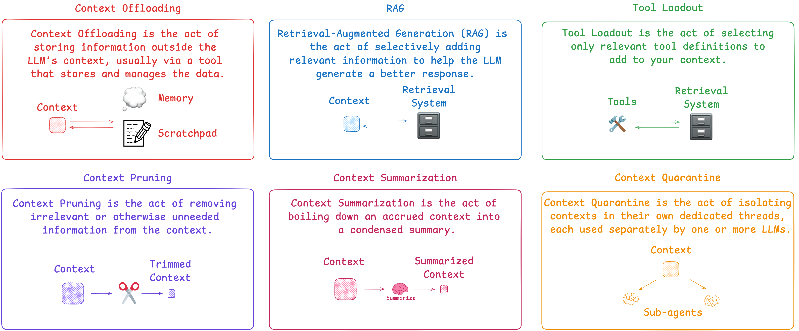
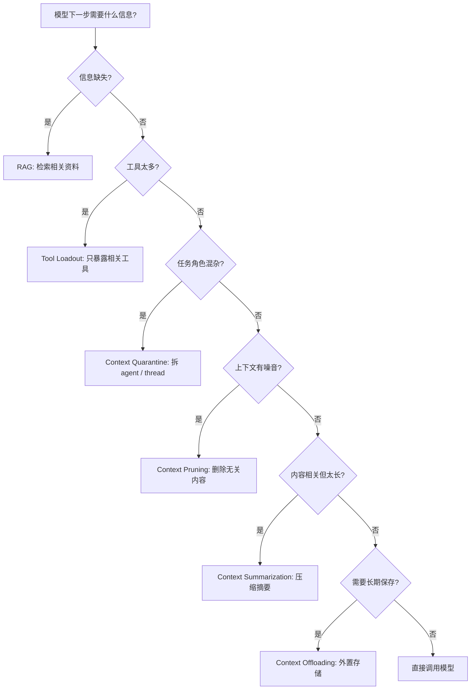
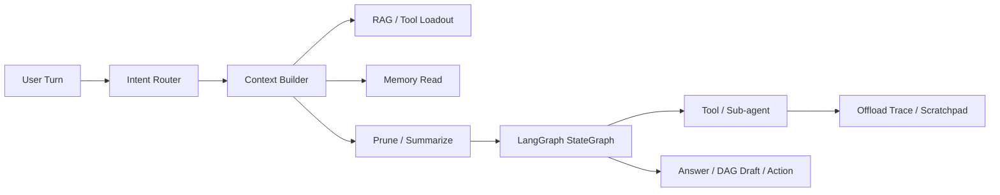

# How to Fix Your Context：上下文工程六法

> 来源仓库：<https://github.com/chinazhenzhen/how_to_fix_your_context>  
> 上游仓库：<https://github.com/langchain-ai/how_to_fix_your_context>  
> 这篇是面试复习版整理：保留原图，提炼 6 种 context engineering 技术，并补充如果用 LangGraph 在生产 Agent 中实现时的伪代码。



## 1. 这份资料在讲什么

这份仓库围绕一个核心观点：Agent 质量不只取决于模型，也取决于你每一步给模型什么上下文。

Karpathy 把 Context Engineering 描述成：把“下一步需要的正确信息”放进上下文窗口的艺术和工程。这里的关键词不是“越多越好”，而是“刚好够用”。上下文太少，模型不知道该怎么做；上下文太多，模型会被历史、噪音、冲突信息和错误结论拖偏。

仓库基于 Drew Breunig 的文章《How to Fix Your Context》，用 LangGraph notebook 演示了 6 种修复上下文的方法：

| 方法 | 一句话解释 | 解决的主要问题 |
|---|---|---|
| RAG | 只在需要时检索相关资料放进上下文 | 缺少外部知识 |
| Tool Loadout | 只把当前任务相关工具暴露给模型 | 工具太多导致选择混乱 |
| Context Quarantine | 把不同任务隔离到不同 agent/thread | 上下文冲突、角色混杂 |
| Context Pruning | 删除检索结果或历史里的无关内容 | token 噪音太多 |
| Context Summarization | 把长上下文压缩成摘要 | 信息都相关但太长 |
| Context Offloading | 把信息放到外部存储，用工具读写 | 不适合一直塞进 prompt 的长期信息 |

## 2. 为什么长上下文会失败

长上下文失败不是因为模型“忘了”，而是模型对上下文里的 token 并不会等权处理。资料里引用了 Chroma 的 Context Rot 研究和 Drew Breunig 的四类失败模式：

| 失败模式 | 现象 | 例子 | 对策 |
|---|---|---|---|
| Context Poisoning | 错误进入上下文后被反复引用 | 第一次工具调用查错了，后续计划一直基于错数据 | 回滚、重检索、错误隔离 |
| Context Distraction | 历史太长，模型被旧任务牵引 | 用户已经换目标，但 agent 还围绕旧目标推理 | 摘要、阶段化 state、窗口裁剪 |
| Context Confusion | 无关信息让模型觉得都要用 | prompt 里塞了所有代码，模型引用了无关模块 | pruning、精确文件选择 |
| Context Clash | 上下文里存在互相矛盾的信息 | 两个文档给出不同 API 版本 | quarantine、source ranking、冲突检测 |

面试里可以这样讲：

> 上下文工程不是单纯扩大 context window，而是控制输入质量。生产 Agent 要持续决定：哪些信息检索进来、哪些工具暴露出去、哪些历史压缩、哪些信息外置、哪些上下文必须隔离。

## 3. 总体 LangGraph 实现框架

LangGraph 适合做上下文工程，是因为它把 Agent 拆成 `State + Node + Edge`：

1. `State` 保存可恢复的上下文结构，比如 messages、retrieved_docs、summary、selected_tools、scratchpad。
2. `Node` 负责一个上下文操作，比如检索、裁剪、摘要、工具选择、写入外部存储。
3. `Edge` 控制什么时候继续调用模型、什么时候调用工具、什么时候结束或进入人工确认。
4. `Store` 保存跨会话记忆，`checkpointer` 保存线程内恢复点。

一个通用骨架：

```python
from typing import TypedDict, Literal
from langgraph.graph import StateGraph, START, END
from langgraph.graph.message import MessagesState

class ContextState(MessagesState):
    retrieved_docs: list[str]
    selected_tools: list[str]
    summary: str
    scratchpad: str
    context_budget: int

def plan_next_step(state: ContextState) -> dict:
    # 读 state.messages + summary，判断下一步要不要检索、调工具、摘要或结束
    return {"route": "retrieve"}

def route(state: ContextState) -> Literal["retrieve", "select_tools", "answer", "summarize"]:
    return state.get("route", "answer")

builder = StateGraph(ContextState)
builder.add_node("plan", plan_next_step)
builder.add_node("retrieve", retrieve_context)
builder.add_node("select_tools", select_relevant_tools)
builder.add_node("summarize", summarize_context)
builder.add_node("answer", call_llm)

builder.add_edge(START, "plan")
builder.add_conditional_edges("plan", route)
builder.add_edge("retrieve", "answer")
builder.add_edge("select_tools", "answer")
builder.add_edge("summarize", "answer")
builder.add_edge("answer", END)

graph = builder.compile(checkpointer=checkpointer, store=store)
```

关键设计点：

| 状态字段 | 为什么要显式保存 |
|---|---|
| `retrieved_docs` | 便于 trace、回放和评估检索质量 |
| `selected_tools` | 便于解释为什么只暴露这些工具 |
| `summary` | 便于恢复长会话，不依赖完整历史 |
| `scratchpad` | 便于把中间研究计划和发现外置 |
| `context_budget` | 便于按 token 预算触发 prune/summarize |

## 4. 方法一：RAG

### 解决什么问题

RAG 是在模型缺外部知识时，把相关资料检索进上下文。仓库的 `01-rag.ipynb` 用 Lilian Weng 的博客作为资料源，构建向量库，再把 retriever 包成 tool，让模型按需检索。

它适合：

1. 问题依赖外部知识。
2. 不希望把所有资料一次性塞进 prompt。
3. 需要 trace “答案来自哪些文档”。

不适合：

1. 用户问题只依赖当前会话。
2. 检索源质量很差。
3. 资料冲突严重且没有 source ranking。

### LangGraph 伪代码

```python
from typing import Literal
from langgraph.graph import StateGraph, START, END
from langgraph.graph import MessagesState
from langchain_core.messages import ToolMessage

retriever_tool = create_retriever_tool(
    retriever,
    name="retrieve_blog_posts",
    description="Search relevant technical blog posts.",
)

llm_with_tools = llm.bind_tools([retriever_tool])

def llm_call(state: MessagesState) -> dict:
    response = llm_with_tools.invoke([
        SystemMessage(content=RAG_SYSTEM_PROMPT),
        *state["messages"],
    ])
    return {"messages": [response]}

def tool_node(state: MessagesState) -> dict:
    last = state["messages"][-1]
    outputs = []
    for call in last.tool_calls:
        if call["name"] == "retrieve_blog_posts":
            docs = retriever_tool.invoke(call["args"])
            outputs.append(ToolMessage(
                content=format_docs(docs),
                tool_call_id=call["id"],
            ))
    return {"messages": outputs}

def should_continue(state: MessagesState) -> Literal["tool_node", "__end__"]:
    last = state["messages"][-1]
    return "tool_node" if last.tool_calls else END

builder = StateGraph(MessagesState)
builder.add_node("llm_call", llm_call)
builder.add_node("tool_node", tool_node)
builder.add_edge(START, "llm_call")
builder.add_conditional_edges("llm_call", should_continue)
builder.add_edge("tool_node", "llm_call")
agent = builder.compile()
```

解析：

这里的关键不是“有向量库”，而是把检索变成一个显式工具调用。模型先判断是否需要检索，再把检索结果带回下一轮回答。这样可以避免每次都塞入大量文档，也方便记录每次 tool call 的 query、命中文档和 token 消耗。

## 5. 方法二：Tool Loadout

### 解决什么问题

Tool Loadout 是“工具上下文工程”。当工具很多时，把所有 tool schema 都塞给模型，会造成两个问题：

1. 工具描述本身占大量 token。
2. 相似工具互相干扰，模型选错工具。

仓库的 `02-tool-loadout.ipynb` 把 Python `math` 库函数做成工具注册表，先用向量检索从工具描述中选出 top-k，再只把相关工具 bind 给模型。

### LangGraph 伪代码

```python
from langgraph.store.base import BaseStore
from langgraph.store.memory import InMemoryStore

class ToolLoadoutState(MessagesState):
    selected_tools: list[str]

tool_store = InMemoryStore(index={"embed": embeddings})

def index_tools(tools: list[BaseTool]) -> None:
    for tool in tools:
        tool_store.put(
            ("tools",),
            key=tool.name,
            value={"name": tool.name, "description": tool.description},
        )

def select_relevant_tools(state: ToolLoadoutState, store: BaseStore) -> dict:
    user_query = state["messages"][-1].content
    hits = store.search(("tools",), query=user_query, limit=5)
    return {"selected_tools": [hit.key for hit in hits]}

def llm_call(state: ToolLoadoutState) -> dict:
    tools = [TOOL_REGISTRY[name] for name in state["selected_tools"]]
    model = llm.bind_tools(tools) if tools else llm
    response = model.invoke(state["messages"])
    return {"messages": [response]}

def tool_node(state: ToolLoadoutState) -> dict:
    # 只允许执行 selected_tools 里的工具
    return execute_selected_tool_calls(state)

builder = StateGraph(ToolLoadoutState)
builder.add_node("select_tools", select_relevant_tools)
builder.add_node("llm_call", llm_call)
builder.add_node("tool_node", tool_node)
builder.add_edge(START, "select_tools")
builder.add_edge("select_tools", "llm_call")
builder.add_conditional_edges("llm_call", tools_or_end)
builder.add_edge("tool_node", "llm_call")
graph = builder.compile(store=tool_store)
```

解析：

工具选择应该发生在 bind tools 之前，而不是让模型在几十个工具中自己挑。这个模式特别适合内部平台：比如工单、订单、支付、库存、CRM、监控都有工具，但用户当前只问“退款状态”，那只应该暴露订单和支付相关工具。

面试回答：

> 工具越多，不代表 Agent 越强。生产里要做动态 tool loadout：先根据用户意图和阶段选工具，再把少量相关工具暴露给模型，降低 token 成本和误调用风险。

## 6. 方法三：Context Quarantine

### 解决什么问题

Context Quarantine 是把不同任务的上下文隔离开。仓库的 `03-context-quarantine.ipynb` 用 supervisor 多 agent 架构：一个 supervisor 负责路由，math agent 只处理数学工具，research agent 只处理搜索研究。

它适合：

1. 一个任务需要多个专业角色。
2. 各角色上下文容易互相污染。
3. 不同 agent 需要不同 system prompt、工具和记忆。

### LangGraph 伪代码：Supervisor 风格

```python
from langgraph.prebuilt import create_react_agent
from langgraph_supervisor import create_supervisor

math_agent = create_react_agent(
    model=llm,
    tools=[add, multiply],
    prompt="You are a math expert. Only solve calculations.",
    name="math_expert",
)

research_agent = create_react_agent(
    model=llm,
    tools=[web_search],
    prompt="You are a research expert. Search and synthesize sources.",
    name="research_expert",
)

workflow = create_supervisor(
    agents=[math_agent, research_agent],
    model=llm,
    prompt="""
    Route tasks to the right specialist.
    Use research_expert for external facts.
    Use math_expert for calculations.
    Do not mix specialist scratchpads.
    """,
)

graph = workflow.compile(checkpointer=checkpointer)
```

### LangGraph 伪代码：手写路由风格

```python
class SupervisorState(MessagesState):
    task_type: Literal["research", "math", "mixed"]
    research_result: str
    math_result: str

def classify_task(state: SupervisorState) -> dict:
    task_type = router_llm.invoke(CLASSIFY_PROMPT.format(
        user=state["messages"][-1].content
    ))
    return {"task_type": task_type}

def route_task(state: SupervisorState) -> Literal["research_agent", "math_agent"]:
    return "research_agent" if state["task_type"] == "research" else "math_agent"

builder = StateGraph(SupervisorState)
builder.add_node("classify", classify_task)
builder.add_node("research_agent", research_subgraph)
builder.add_node("math_agent", math_subgraph)
builder.add_edge(START, "classify")
builder.add_conditional_edges("classify", route_task)
builder.add_edge("research_agent", END)
builder.add_edge("math_agent", END)
```

解析：

隔离的价值是减少 context clash。比如研究 agent 的网页结果、数学 agent 的中间计算、代码 agent 的文件 diff，不应该混成一个无限增长的 messages 列表。Supervisor 只保留任务分发和汇总上下文，细节留在各自子 agent/thread 里。

## 7. 方法四：Context Pruning

### 解决什么问题

Pruning 是删除无关内容。仓库的 `04-context-pruning.ipynb` 在 RAG 之后增加了一个 pruning 节点：先检索，再用更便宜的小模型按用户问题抽取相关片段，最后只把相关片段交给主模型。

资料里给出的效果：相同问题下，basic RAG 约 25k tokens，pruning 后约 11k tokens。

### LangGraph 伪代码

```python
class PruningState(MessagesState):
    raw_docs: list[str]
    pruned_context: str

def retrieve_docs(state: PruningState) -> dict:
    query = state["messages"][-1].content
    docs = retriever.invoke(query)
    return {"raw_docs": [doc.page_content for doc in docs]}

def prune_docs(state: PruningState) -> dict:
    query = state["messages"][-1].content
    pruned = cheap_llm.invoke(f"""
    User question:
    {query}

    Documents:
    {join_docs(state["raw_docs"])}

    Extract only the information relevant to the question.
    Remove boilerplate, unrelated examples, navigation text, and repeated content.
    Keep exact facts, numbers, and source names.
    """)
    return {"pruned_context": pruned.content}

def answer(state: PruningState) -> dict:
    response = strong_llm.invoke([
        SystemMessage(content="Answer using the pruned context."),
        HumanMessage(content=state["messages"][-1].content),
        HumanMessage(content=f"Context:\n{state['pruned_context']}"),
    ])
    return {"messages": [response]}

builder = StateGraph(PruningState)
builder.add_edge(START, "retrieve")
builder.add_node("retrieve", retrieve_docs)
builder.add_node("prune", prune_docs)
builder.add_node("answer", answer)
builder.add_edge("retrieve", "prune")
builder.add_edge("prune", "answer")
builder.add_edge("answer", END)
```

解析：

Pruning 适合“检索回来的内容里只有一部分相关”的场景。它不是摘要全部内容，而是明确删除无关内容。要注意，pruning 可能删掉后来需要的证据，所以最好保留 `raw_docs` 在 state 或 trace 中，方便调试和回放。

## 8. 方法五：Context Summarization

### 解决什么问题

Summarization 是把长上下文压缩成摘要。和 pruning 不同，它不一定删除主题，只是把冗长内容压缩。仓库的 `05-context-summarization.ipynb` 给 tool result 增加 summarization step，用小模型把文档压到更短但保留关键事实。

适合：

1. 全部内容都相关，但太长。
2. 长会话需要保留历史决策。
3. 工具输出很 verbose，比如日志、搜索结果、代码文件。

不适合：

1. 需要逐字引用原文。
2. 金额、法律条款、医疗建议等不能损失细节的场景。
3. 摘要模型不可靠且没有回溯原文机制。

### LangGraph 伪代码

```python
class SummaryState(MessagesState):
    running_summary: str
    raw_tool_result: str

def should_summarize(state: SummaryState) -> Literal["summarize", "answer"]:
    tokens = estimate_tokens(state["messages"], state.get("raw_tool_result", ""))
    return "summarize" if tokens > state["context_budget"] else "answer"

def summarize_context(state: SummaryState) -> dict:
    summary = cheap_llm.invoke(f"""
    Existing summary:
    {state.get("running_summary", "")}

    New content:
    {state["raw_tool_result"]}

    Produce a compact summary.
    Preserve decisions, constraints, source names, numbers, open questions, and user preferences.
    Remove repetition and examples that do not affect future decisions.
    """)
    return {
        "running_summary": summary.content,
        "raw_tool_result": "",
    }

def answer(state: SummaryState) -> dict:
    response = strong_llm.invoke([
        SystemMessage(content=f"Conversation summary:\n{state['running_summary']}"),
        *trim_recent_messages(state["messages"], keep_last=6),
    ])
    return {"messages": [response]}

builder = StateGraph(SummaryState)
builder.add_node("summarize", summarize_context)
builder.add_node("answer", answer)
builder.add_conditional_edges(START, should_summarize)
builder.add_edge("summarize", "answer")
builder.add_edge("answer", END)
```

解析：

摘要最好是结构化的，不要只写自然语言流水账。生产里可以要求摘要固定包含：

```text
User goal:
Confirmed decisions:
Open questions:
Important constraints:
Files/tools already inspected:
Do not repeat:
```

这样后续恢复比一段散文摘要更稳定。

## 9. 方法六：Context Offloading

### 解决什么问题

Offloading 是把信息放到 LLM 上下文之外，用工具读写。仓库的 `06-context-offloading.ipynb` 演示了两种模式：

1. session scratchpad：当前线程内临时笔记。
2. persistent memory：用 LangGraph Store 跨线程保存记忆。

这和真实 Agent 产品很接近：长期偏好、项目设定、研究笔记、用户画像、历史决策，不应该每轮都塞进 prompt，而应该在需要时检索或读取。

### LangGraph 伪代码：线程内 scratchpad

```python
from pydantic import Field
from langchain_core.tools import tool

class ScratchpadState(MessagesState):
    scratchpad: str = Field(default="", description="Temporary notes for this thread")

@tool
def write_to_scratchpad(notes: str) -> str:
    """Save notes for later use in this conversation."""
    return notes

@tool
def read_from_scratchpad() -> str:
    """Read saved notes for this conversation."""
    return "__READ_SCRATCHPAD__"

def tool_node(state: ScratchpadState) -> dict:
    updates = {"messages": []}
    for call in state["messages"][-1].tool_calls:
        if call["name"] == "write_to_scratchpad":
            notes = call["args"]["notes"]
            updates["scratchpad"] = notes
            updates["messages"].append(ToolMessage(
                content="Wrote notes to scratchpad.",
                tool_call_id=call["id"],
            ))
        elif call["name"] == "read_from_scratchpad":
            updates["messages"].append(ToolMessage(
                content=state.get("scratchpad", "No notes."),
                tool_call_id=call["id"],
            ))
    return updates
```

### LangGraph 伪代码：跨线程持久记忆

```python
from langgraph.store.memory import InMemoryStore
from langgraph.store.base import BaseStore

store = InMemoryStore()

def tool_node_persistent(state: ScratchpadState, store: BaseStore) -> dict:
    user_id = state["user_id"]
    namespace = ("user_memory", user_id)
    outputs = []

    for call in state["messages"][-1].tool_calls:
        if call["name"] == "save_memory":
            key = call["args"]["key"]
            value = call["args"]["value"]
            store.put(namespace, key, {"value": value})
            outputs.append(ToolMessage(
                content=f"Saved memory: {key}",
                tool_call_id=call["id"],
            ))

        if call["name"] == "read_memory":
            key = call["args"]["key"]
            item = store.get(namespace, key)
            value = item.value["value"] if item else "not found"
            outputs.append(ToolMessage(
                content=value,
                tool_call_id=call["id"],
            ))

    return {"messages": outputs}

graph = builder.compile(store=store, checkpointer=checkpointer)
```

解析：

Offloading 的关键是“可寻址”。如果只是把一段文本扔到数据库里，后面模型未必知道什么时候读。生产设计里要给 memory 加 namespace、key、metadata、ttl、source、last_updated 和权限边界。

适合外置的信息：

| 类型 | 存储方式 |
|---|---|
| 用户长期偏好 | user memory |
| 项目背景设定 | project memory |
| 当前研究计划 | thread scratchpad |
| 大文件内容 | object storage + chunk index |
| 工具调用结果 | event store / trace |
| 已确认决策 | checkpoint + projection |

## 10. 六种方法怎么选

可以按下面的判断顺序：



实践里经常组合使用：

| 场景 | 推荐组合 |
|---|---|
| 复杂研究问答 | RAG + pruning + summarization |
| 多工具业务 Agent | tool loadout + quarantine |
| 长流程创作 Agent | summarization + checkpoint + offloading |
| 代码库问答 | RAG + tool loadout + context pruning |
| 多角色任务 | supervisor quarantine + shared final summary |

## 11. 放到生产 Agent 里怎么设计

如果把这套方法放进你的 Agent Runtime，可以这样分层：



推荐 state：

```python
class AgentContextState(MessagesState):
    session_id: str
    stage: str
    intent: str
    relevant_docs: list[DocRef]
    selected_tools: list[str]
    working_summary: str
    scratchpad_ref: str
    memory_refs: list[str]
    token_budget: int
    last_error: dict | None
```

推荐节点：

| 节点 | 责任 |
|---|---|
| `classify_intent` | 判断当前用户 turn 是问答、修改、继续、取消还是执行动作 |
| `select_context_strategy` | 决定用 RAG、tool loadout、summary、memory read 的哪几种 |
| `retrieve_context` | 从知识库、代码库、业务库检索 |
| `select_tools` | 根据 intent 和 stage 选择工具 |
| `compress_context` | prune 或 summarize |
| `call_model` | 只把整理后的上下文给主模型 |
| `write_memory` | 把长期事实和阶段决策外置 |
| `project_events` | 把上下文决策写入 trace，便于回放和评测 |

伪代码：

```python
def select_context_strategy(state: AgentContextState) -> dict:
    strategy = []
    if state["intent"] in {"question", "research"}:
        strategy.append("rag")
    if state["stage"] in {"execution", "tool_use"}:
        strategy.append("tool_loadout")
    if estimate_tokens(state["messages"]) > state["token_budget"]:
        strategy.append("summarize")
    if needs_long_term_preference(state):
        strategy.append("memory_read")
    return {"context_strategy": strategy}

def route_context(state: AgentContextState):
    # 可以返回多个节点，也可以串行化为 retrieve -> select_tools -> compress
    if "rag" in state["context_strategy"]:
        return "retrieve_context"
    if "tool_loadout" in state["context_strategy"]:
        return "select_tools"
    if "summarize" in state["context_strategy"]:
        return "compress_context"
    return "call_model"
```

## 12. 面试答法

### Q1：什么是 Context Engineering？

回答：

> Context Engineering 是控制模型每一步输入质量的工程方法。它不只是 prompt 写得好，而是动态决定检索哪些资料、暴露哪些工具、保留哪些历史、压缩哪些内容、隔离哪些上下文，以及哪些信息应该外置到 memory 或数据库。

解析：

这个答案比“管理上下文窗口”更具体，因为它说出了可落地动作：检索、工具选择、裁剪、摘要、隔离、外置。

### Q2：RAG、Pruning、Summarization 有什么区别？

回答：

> RAG 解决信息缺失，把外部知识拿进来；Pruning 解决噪音太多，把无关内容删掉；Summarization 解决内容相关但太长，把信息压缩。三者可以组合：先 RAG 检索，再 pruning 删噪音，最后 summarization 压缩长结果。

### Q3：为什么 Tool Loadout 很重要？

回答：

> 工具 schema 本身也是上下文。工具越多，token 越贵，模型越容易被相似工具干扰。生产 Agent 不应该把所有工具都 bind 给模型，而应该先按用户意图、阶段和权限选出少量相关工具，再让模型调用。

### Q4：Context Quarantine 和多 Agent 有什么关系？

回答：

> Context Quarantine 是多 Agent 的一个核心价值：不是为了“显得智能”才拆 agent，而是为了隔离不同任务的上下文。研究、计算、代码修改、业务审批应该有不同 system prompt、工具和 scratchpad，最后由 supervisor 汇总。

### Q5：Offloading 和 summarization 的边界是什么？

回答：

> Summarization 还是把信息放回模型上下文，只是压短；Offloading 是把信息放到外部存储，需要时通过工具读。长期偏好、项目记忆、大文件、研究笔记更适合 offload；当前回合必须直接参与推理的信息才适合 summary。

## 13. 最终记忆点

1. 长上下文不是银弹，信息太多会带来 poisoning、distraction、confusion、clash。
2. RAG 是“拿进来”，pruning 是“删掉噪音”，summarization 是“压缩”，offloading 是“放外面”。
3. Tool loadout 把工具也当成上下文管理。
4. Quarantine 的本质是隔离上下文，不是盲目堆多 Agent。
5. LangGraph 的价值在于把这些上下文操作做成可观测、可恢复、可路由的节点。

一句可背版本：

> Context Engineering 的核心不是把窗口塞满，而是在每一步只给模型正确、必要、无冲突的信息。LangGraph 适合把这件事工程化：检索、选工具、隔离、裁剪、摘要和外置记忆都可以变成显式节点，并被 trace、checkpoint 和 eval 管起来。

## 14. 资料来源

- GitHub：<https://github.com/chinazhenzhen/how_to_fix_your_context>
- 上游 GitHub：<https://github.com/langchain-ai/how_to_fix_your_context>
- Drew Breunig, How to Fix Your Context：<https://www.dbreunig.com/2025/06/26/how-to-fix-your-context.html>
- Drew Breunig, How Contexts Fail and How to Fix Them：<https://www.dbreunig.com/2025/06/22/how-contexts-fail-and-how-to-fix-them.html>
- LangChain Blog, Context Engineering for Agents：<https://blog.langchain.com/context-engineering-for-agents/>
- Chroma Research, Context Rot：<https://research.trychroma.com/context-rot>
