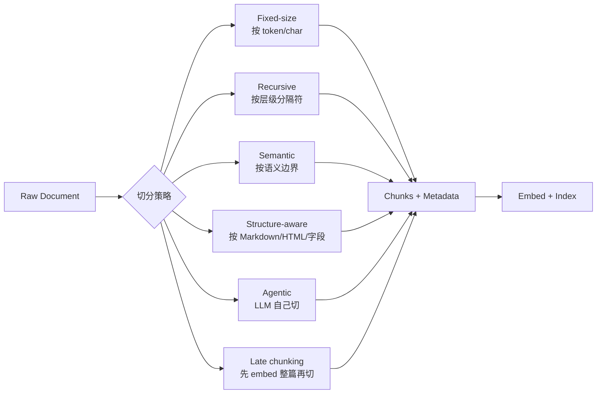
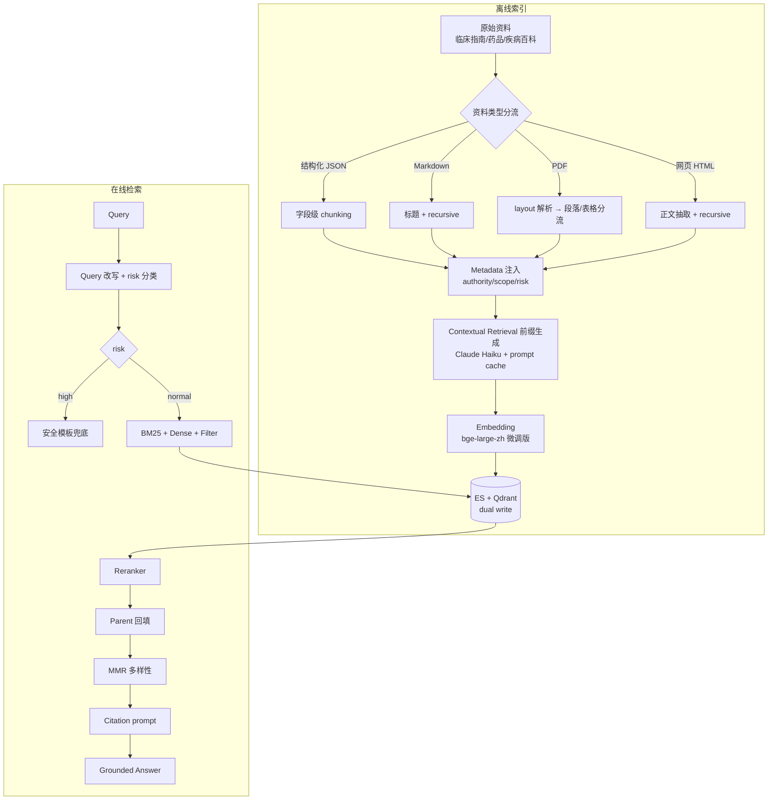

# Chunking 策略：RAG 里最被低估的工程模块

> 写在前面：很多团队 RAG 上不去，第一直觉是"换更好的 embedding"或"加 reranker"。但 chunking 才是上限——再好的双塔模型也救不回一段被切成两半的处方禁忌；再聪明的 cross-encoder 也无法把"成人剂量"和"儿童剂量"重新缝回同一个 chunk。Anthropic 在 [Contextual Retrieval](https://www.anthropic.com/news/contextual-retrieval) 里也明确说："better chunking is often more impactful than a better embedding model"。
>
> 本文按"为什么 → 策略全谱 → 真实代码 → 落地坑 → 评测 → 我的简历项目怎么用"的顺序展开，目标是让你看完能直接抄一份生产可用的 chunking pipeline 出去。


## 0. 本文地图

| 模块 | 必须掌握 | 面试容易翻车的点 |
|---|---|---|
| Chunking 的本质 | chunk = retrieval unit + context unit | 把 chunk 当成"切字符串" |
| 策略全谱 | fixed / recursive / semantic / structure / agentic / late | 只会 fixed-size |
| 父子 / Small-to-Big | 检索粒度 ≠ 上下文粒度 | 把 retrieval chunk 直接喂给 LLM |
| Contextual Retrieval | chunk 加 doc-level 摘要前缀 | 不知道这是 2024 年最实用的提升 |
| Metadata schema | source / authority / updated_at / scope | metadata 设计被忽视 |
| 表格 / OCR / PDF | 结构化字段单独成 chunk | 用 PyPDF text mode 一把梭 |
| 评测 | 不同 chunk size 跑同一份 gold set | 凭直觉拍 chunk_size=512 |

## 1. 为什么 chunking 是 RAG 的沉默杀手

### 1.1 三个真实事故

**事故 A · 处方禁忌被切断**

医学知识库里某条："**XX 药品成人剂量为每日 3 次，每次 100mg；孕妇、儿童、肝肾功能不全者禁用。**"

`chunk_size=200`、`overlap=20` 时这条会被切成：

- chunk1: `XX 药品成人剂量为每日 3 次，每次 100mg；孕妇、儿童`
- chunk2: `儿童、肝肾功能不全者禁用。`

用户问"老人能吃 XX 吗"，dense 召回到 chunk1（剂量描述近义），LLM 直接回答"成人每日 3 次，每次 100mg"——**禁忌信息被切走了**。这种 bug embedding 模型再强也救不回来。

**事故 B · 表格被铺平**

PDF 表格用 PyPDF 提取后会变成空格分隔的乱序文字，整张表常被当成一个 chunk 但所有列对应关系丢失。结果就是 reranker 分很高、答案完全错。

**事故 C · OCR 段落跨页**

扫描版临床指南被 OCR 之后段落跨页，一段话从 page 3 末尾延续到 page 4 开头。按页切 → 每段都半截。按 token 切 → 跨页 token 距离很远，相邻 chunk 拿不到完整意思。

### 1.2 chunking 同时影响四个指标

| 指标 | chunk 太小 | chunk 太大 |
|---|---|---|
| Recall@K | 单 chunk 信息少，相关 chunk 多但都进 K 难 | 单 chunk 信息多，但容易被无关上下文淹没 |
| Top-3 命中率 | 多个相关 chunk 互相挤排名 | 一个 chunk 占住，但里面 80% 是噪声 |
| Faithfulness | 上下文不足，LLM 自由发挥 | 上下文充足但混入冲突，LLM 选错 |
| Token 成本 | chunk 多检索成本高，但每个便宜 | 每次 LLM 输入 token ↑ |

**核心矛盾**：retrieval 想要小 chunk（精准定位 + 节省上下文），生成想要大 chunk（充分理解 + 减少跨 chunk 拼接）。这个矛盾决定了"父子 chunk / Small-to-Big"必然存在（§5）。

### 1.3 一句话定义

> Chunk 不是"文档切片"——chunk 是 **embedding 模型的最大有效输入** + **召回的最小可索引单元** + **上下文给 LLM 的最小信息封装**，三者必须同时满足。

任何只考虑一个维度的 chunking 策略都会在另外两个维度上翻车。

## 2. Chunking 策略全谱（从最原始到 2025 最先进）



### 2.1 Fixed-size：最原始也最普及

按字符或 token 数硬切，固定 overlap。简单、快、不依赖任何理解。

```python
def fixed_size_chunk(text: str, chunk_size: int = 500, overlap: int = 80) -> list[str]:
    chunks = []
    i = 0
    while i < len(text):
        chunks.append(text[i:i + chunk_size])
        i += chunk_size - overlap
    return chunks
```

**适合**：纯文本、内容均质（如新闻、聊天记录）。
**短板**：所有 §1.1 的事故都会发生。

LangChain 的 `CharacterTextSplitter` 默认就是这个。**90% 的 RAG 教程止步于此，也是 90% 的 RAG 翻车原因**。

### 2.2 Recursive Character Splitter：层级分隔符回退

LangChain 真正常用的是 `RecursiveCharacterTextSplitter`——按一组分隔符的**优先级**递归切，优先按段落（`\n\n`）切；切完仍超长就按句号、再按空格、最后才硬切字符。

```python
from langchain_text_splitters import RecursiveCharacterTextSplitter

splitter = RecursiveCharacterTextSplitter(
    chunk_size=500,
    chunk_overlap=80,
    separators=["\n\n", "\n", "。", "！", "？", "；", "，", " ", ""],  # 中文优先
    length_function=len,  # 用 tiktoken 算 token 更准
)
chunks = splitter.split_text(long_text)
```

**关键 tip**：中文文档一定要把 `separators` 改成中文标点优先，默认是英文 `". "` 这种切中文几乎不命中，等于退化成 fixed-size 切。

**LlamaIndex 的对应实现**叫 `SentenceSplitter` 和 `TokenTextSplitter`，思路一致但默认参数更"安全"。Jerry Liu 在 LlamaIndex blog 里建议中文场景把 `chunk_size` 算成 token 而不是 char——bge-large-zh 512 token 大约对应 1000-1300 个中文字符。

### 2.3 Semantic Chunking：按语义边界切

Greg Kamradt（@LangChainAI 的研究内容贡献者）2023 年在 [5 Levels of Text Splitting](https://github.com/FullStackRetrieval-com/RetrievalTutorials) 里把这种策略推广开。核心思路：

1. 把文档按句子切分。
2. 用 embedding 模型 encode 每个句子。
3. 计算**相邻句子的 cosine 距离**——距离突然变大的位置就是"语义边界"。
4. 在边界处切分。

```python
import numpy as np
from sentence_transformers import SentenceTransformer

def semantic_chunk(
    text: str,
    encoder: SentenceTransformer,
    breakpoint_percentile: float = 95,
    buffer_size: int = 1,  # 把相邻几个句子合并算 embedding，更稳
) -> list[str]:
    import re
    sentences = [s.strip() for s in re.split(r"(?<=[。！？\.\!\?])\s*", text) if s.strip()]
    if len(sentences) < 3:
        return ["".join(sentences)]

    # buffer：每个"句子组"是 [i-buffer_size, i, i+buffer_size]
    grouped = [
        "".join(sentences[max(0, i - buffer_size): i + buffer_size + 1])
        for i in range(len(sentences))
    ]
    embeddings = encoder.encode(grouped, normalize_embeddings=True)

    distances = []
    for i in range(len(embeddings) - 1):
        dist = 1 - np.dot(embeddings[i], embeddings[i + 1])
        distances.append(dist)
    threshold = np.percentile(distances, breakpoint_percentile)

    chunks, current = [], [sentences[0]]
    for i, dist in enumerate(distances):
        if dist > threshold:
            chunks.append("".join(current))
            current = [sentences[i + 1]]
        else:
            current.append(sentences[i + 1])
    if current:
        chunks.append("".join(current))
    return chunks
```

**优点**：chunk 边界天然落在语义跳变处，处方禁忌之类的"连续语义块"不会被切断。
**短板**：

1. 慢——每个文档要 embed 一次（虽然 sentence 级 embedding 比 chunk 级便宜）。
2. 阈值要调，分位数 95 vs 90 差异很大。
3. 对结构化文档（表格、列表）效果反而不如 §2.4。

LlamaIndex 有 `SemanticSplitterNodeParser`，LangChain 有 `SemanticChunker`，工程上都已经可以直接用。

### 2.4 Structure-aware：按文档结构切

对 Markdown / HTML / PDF（带 layout）/ 医学指南这种**强结构文档**，按结构切收益最大。

```python
from langchain_text_splitters import MarkdownHeaderTextSplitter

headers_to_split_on = [
    ("#", "h1"),
    ("##", "h2"),
    ("###", "h3"),
]
md_splitter = MarkdownHeaderTextSplitter(headers_to_split_on=headers_to_split_on)
# 输出 List[Document]，每个 Document 自带 metadata={"h1": ..., "h2": ...}
docs = md_splitter.split_text(markdown_text)

# 再过一道 RecursiveCharacterTextSplitter 处理过长的 section
from langchain_text_splitters import RecursiveCharacterTextSplitter
char_splitter = RecursiveCharacterTextSplitter(chunk_size=600, chunk_overlap=80)
final_docs = char_splitter.split_documents(docs)
# 每个 final chunk 继承上层 h1/h2/h3 metadata，retrieval 时可按 h1 过滤
```

**医疗领域结构化切分实战**：临床指南、药品说明书、疾病百科都有**固定字段**。

```python
def chunk_medical_drug_doc(doc: dict) -> list[dict]:
    """药品说明书按字段独立成 chunk，每个 chunk 同时保留药品名 + 字段名 metadata。"""
    drug_name = doc["drug_name"]
    fields = ["适应症", "用法用量", "不良反应", "禁忌", "注意事项", "孕妇及哺乳期妇女用药",
              "儿童用药", "老年用药", "药物相互作用", "药理毒理", "贮藏"]
    chunks = []
    for field in fields:
        content = doc.get(field, "").strip()
        if not content:
            continue
        chunks.append({
            "text": f"【{drug_name} · {field}】\n{content}",
            "metadata": {
                "drug_id": doc["drug_id"],
                "drug_name": drug_name,
                "field": field,
                "authority": doc.get("authority", "national_drug_administration"),
                "updated_at": doc["updated_at"],
                # field 是关键：高风险问题（"禁忌"）可以直接走 field 过滤
            },
        })
    return chunks
```

**为什么这样切**：用户问"老人能吃 XX 吗"，可以**强制过滤** `field IN ("老年用药", "禁忌", "注意事项")`——把 dense 召回的语义模糊性挡在过滤层之前。百度健康助手的 Top-3 命中率从 70% → 88% 中，**至少 8pp 来自结构化字段切分 + 元数据过滤**，远超后续 reranker 微调。

### 2.5 Agentic Chunking：让 LLM 自己切

2024 年开始流行——用一个便宜的 LLM 读一篇文档，输出"应该怎么切"。LlamaIndex 叫 [`PropositionBasedChunking`](https://docs.llamaindex.ai/en/stable/examples/node_parsers/dense_x_retrieval/) 或 [DenseX](https://arxiv.org/abs/2312.06648)。思路是：

1. LLM 把每个段落改写成一系列**独立命题**（每条都自包含、可单独检索）。
2. 每条命题就是一个 chunk。

```text
原文：
急性胰腺炎是胰腺的炎症性疾病，主要表现为上腹剧烈疼痛，常向腰背部放射。
血淀粉酶、脂肪酶是关键检查指标。重症患者需禁食并住院治疗。

LLM 改写为 propositions：
1. 急性胰腺炎是胰腺的炎症性疾病。
2. 急性胰腺炎主要表现为上腹剧烈疼痛。
3. 急性胰腺炎的疼痛常向腰背部放射。
4. 急性胰腺炎的关键检查指标包括血淀粉酶。
5. 急性胰腺炎的关键检查指标包括脂肪酶。
6. 急性胰腺炎重症患者需禁食。
7. 急性胰腺炎重症患者需住院治疗。
```

**优点**：每个 chunk 都是"完整命题"，dense 召回精度极高。
**短板**：

1. 离线索引时要跑一遍 LLM，**索引成本翻 10-100 倍**。
2. LLM 改写可能丢字段、加幻觉（"常住院治疗" → "必须住院治疗"）。
3. 对结构化文档反而过度切分。

适合：FAQ、产品说明、运营文案这种"事实密度高、生成量小"的语料。**不适合**：医学指南、法规、学术论文（信息丢失/扭曲风险高）。

### 2.6 Late Chunking：先 embed 整篇再切

2024 年 Jina AI 提出 [Late Chunking](https://jina.ai/news/late-chunking-in-long-context-embedding-models/)。常规流程是"切 chunk → 各自 embed"，但每个 chunk 失去了上下文。Late chunking 反过来：

1. 用支持长上下文的 embedding 模型（jina-v3、bge-m3 都支持 8K-32K）**整篇文档一次 forward**。
2. 在 token level 拿到所有 token 的 hidden state。
3. **再**按 chunk 边界把 token embeddings **pool** 成 chunk embeddings。

```python
# 伪代码：late chunking 的精髓在 pooling 之前每个 token 已经看到全篇
def late_chunk_embed(text: str, chunk_spans: list[tuple[int, int]], model) -> list[np.ndarray]:
    # 1. 整篇 tokenize 一次
    tokens = tokenizer(text, return_tensors="pt", truncation=False)
    # 2. 整篇 forward，token-level hidden state
    with torch.no_grad():
        hidden = model(**tokens, output_hidden_states=True).last_hidden_state[0]  # (L, D)
    # 3. 按 chunk_spans 切 token，mean pool
    chunk_embeddings = []
    for start, end in chunk_spans:
        chunk_embeddings.append(hidden[start:end].mean(dim=0).numpy())
    return chunk_embeddings
```

**效果**：在 BEIR 上比常规 chunking 平均涨 2-5pp，对"代词跨 chunk"（"它/其/上述"）类问题尤其有效。

**Tip**：和 Anthropic 的 Contextual Retrieval（§4）解决的是同一类问题但实现完全不同——一个是 embedding 自带上下文，一个是 chunk 文本前拼摘要。生产里两个不冲突可以叠加。

## 3. Chunk size 怎么选——别凭直觉拍

`chunk_size = 512` 是 RAG 教程的"幸存者偏差"。真实场景必须做 A/B 评测。

### 3.1 三个硬约束

1. **embedding 模型上限**：
   - `bge-large-zh` 上限 **512 token**，超了直接截断。
   - `bge-m3` 上限 **8192 token**，可以做大 chunk。
   - `text-embedding-3-large` 上限 8191 token。
   - `cohere-embed-v3` 上限 512 token。
2. **reranker 模型上限**：cross-encoder 是 query + doc 拼接进 transformer，`bge-reranker-large` 总长 512 token，所以 doc chunk 最好留出 query 长度的余量（**< 480 token**）。
3. **LLM 上下文预算**：如果你的生成 prompt 已经吃了 4K（system + few-shot + query），留给 retrieval 的可能只有 6K。Top-3 × chunk_size = 6K 意味着每个 chunk ≤ 2000 token——这又会回头约束 chunk_size 上限。

### 3.2 标准 A/B 评测流程

```python
import json
from pathlib import Path

def evaluate_chunk_size(
    docs: list[dict],
    gold_set: list[dict],  # [{"query": ..., "relevant_doc_ids": [...]}]
    chunk_sizes: list[int],
    overlap_ratio: float = 0.15,
    encoder=None,
    reranker=None,
    top_k: int = 5,
) -> dict:
    results = {}
    for cs in chunk_sizes:
        # 1. 用当前 chunk_size 重建索引
        chunks = []
        for d in docs:
            ch = recursive_split(d["text"], chunk_size=cs, overlap=int(cs * overlap_ratio))
            for i, c in enumerate(ch):
                chunks.append({
                    "id": f"{d['id']}#chunk{i}",
                    "doc_id": d["id"],
                    "text": c,
                    "embedding": encoder.encode(c, normalize_embeddings=True),
                })

        # 2. 跑评测集
        recall, mrr, top3_hit = 0, 0, 0
        for sample in gold_set:
            q_emb = encoder.encode(sample["query"], normalize_embeddings=True)
            scored = sorted(chunks, key=lambda c: -np.dot(c["embedding"], q_emb))
            hits = [c["doc_id"] for c in scored[:top_k]]
            if any(d in sample["relevant_doc_ids"] for d in hits):
                recall += 1
            ranks = [i for i, d in enumerate(hits) if d in sample["relevant_doc_ids"]]
            if ranks:
                mrr += 1 / (ranks[0] + 1)
            if any(d in sample["relevant_doc_ids"] for d in hits[:3]):
                top3_hit += 1
        n = len(gold_set)
        results[cs] = {
            "recall@k": recall / n,
            "mrr": mrr / n,
            "top3_hit": top3_hit / n,
            "num_chunks": len(chunks),
        }
    return results

# 实测网格
result = evaluate_chunk_size(
    docs=medical_kb,
    gold_set=load_json("gold_set_1000.json"),
    chunk_sizes=[256, 384, 512, 768, 1024, 1536],
)
print(json.dumps(result, indent=2, ensure_ascii=False))
```

**经验区间**：

| 文档类型 | 推荐 chunk_size (token) | overlap |
|---|---|---|
| FAQ / 短问答 | 128-256 | 0 |
| 客服对话 / 短文 | 256-512 | 20-60 |
| 医学百科 / 一般技术文档 | 400-800 | 80-160 |
| 法律条文 / 学术论文 | 600-1200 | 100-200 |
| 长报告 / PDF 整段 | 1200-2000 | 200-400 |

**Pinecone 的经验数据**（[Chunking Strategies](https://www.pinecone.io/learn/chunking-strategies/)）：MS MARCO 上 chunk_size 100-200 token 时 Recall 最高，但人类可读性差；500-800 是工程甜点。

### 3.3 Overlap 怎么定

经验法则：`overlap ≈ 0.1 ~ 0.2 × chunk_size`。

- **太小**（< 10%）：跨 chunk 信息丢失。
- **太大**（> 30%）：索引膨胀、检索分数被重复内容抬高（一个事实出现在 3 个相邻 chunk 里都会被 dense 召回到，挤占 Top-K）。

## 4. Anthropic Contextual Retrieval：2024 年最实用的 chunking 升级

[原文](https://www.anthropic.com/news/contextual-retrieval)（Erik Schluntz 主笔）做的实验：

- baseline：BM25 + Dense，Recall@20 = 5.7% fail rate（失败率，越低越好）
- + Contextual Embeddings：fail rate = 3.7%（-35%）
- + Contextual BM25：fail rate = 2.9%（-49%）
- + Reranker：fail rate = 1.9%（-67%）

**核心思路**：每个 chunk 在 embed/index 前，**前置一段 doc-level 摘要**，告诉它"在整篇里大概是什么角色"。

### 4.1 Prompt 模板（直接抄）

```text
<document>
{whole_document}
</document>

Here is the chunk we want to situate within the whole document:
<chunk>
{chunk_content}
</chunk>

Please give a short succinct context to situate this chunk within the overall
document for the purposes of improving search retrieval of the chunk. Answer
only with the succinct context and nothing else.
```

### 4.2 实现代码

```python
import anthropic

client = anthropic.Anthropic()

def contextualize_chunk(whole_doc: str, chunk: str) -> str:
    """用 Claude Haiku 给 chunk 生成 50-100 token 的上下文前缀。"""
    msg = client.messages.create(
        model="claude-haiku-4-5",
        max_tokens=200,
        # ⭐ 关键：用 prompt caching 缓存整篇文档，避免重复 input token
        system=[
            {
                "type": "text",
                "text": f"<document>\n{whole_doc}\n</document>",
                "cache_control": {"type": "ephemeral"},
            }
        ],
        messages=[
            {
                "role": "user",
                "content": f"<chunk>\n{chunk}\n</chunk>\n\n请用 1-2 句话描述这个 chunk 在整篇文档里的位置和角色（用于检索时增强上下文）。直接输出描述，不要前缀。",
            }
        ],
    )
    return msg.content[0].text.strip()


def index_with_context(doc_text: str, doc_id: str):
    chunks = recursive_split(doc_text, 500, 80)
    contextualized = []
    for c in chunks:
        ctx = contextualize_chunk(doc_text, c)
        # 索引文本 = 上下文前缀 + 原始 chunk
        indexed_text = f"{ctx}\n\n{c}"
        contextualized.append({
            "doc_id": doc_id,
            "indexed_text": indexed_text,
            "original_text": c,  # 给 LLM 看的是原文，避免 LLM 把摘要也当事实
            "context": ctx,
        })
    return contextualized
```

### 4.3 成本与收益

- **prompt caching** 是关键：一篇 10K token 的文档，没有 cache 是 N_chunks × 10K input；有 cache 是 1 × 10K + N_chunks × (chunk_size + few hundred)。Anthropic 的实验里成本降到大约 $1.02 / 百万 token doc。
- **离线一次性投入**：和原始 chunking 一次性跑，不影响在线检索延迟。
- **可叠加**：和 BM25 / Dense / Reranker / Hybrid 都正交，**fail rate 降幅可叠加**。

### 4.4 工程坑

1. LLM 偶尔会"复述 chunk 内容"而不是"描述位置"——加 "不要复述原文，只描述位置和角色" 到 prompt 里。
2. 长文档（> 200K token）整篇放 system 会顶 cache 上限——切大 section 后再做 contextual。
3. 索引文本里 ctx + chunk 一起 embed，但**召回返回时只给 LLM 看 original_text**，否则 LLM 会把摘要也当成事实引用。

## 5. 父子 chunk / Small-to-Big：检索粒度 ≠ 上下文粒度

§1.2 提到的核心矛盾：检索想小，生成想大。**解法**：用小 chunk 做索引，用大 chunk（或整 section）做上下文。

### 5.1 Parent-Document Retriever（LangChain / LlamaIndex 都有现成）

```python
# 概念实现 —— 真实项目可以直接用 langchain.retrievers.ParentDocumentRetriever
class ParentDocumentStore:
    def __init__(self):
        self.parents = {}   # parent_id → full text
        self.children = []  # child chunks, each carries parent_id

    def index(self, doc_id: str, text: str,
              parent_size: int = 2000, child_size: int = 400):
        parent_chunks = recursive_split(text, parent_size, 200)
        for pi, parent in enumerate(parent_chunks):
            parent_id = f"{doc_id}#p{pi}"
            self.parents[parent_id] = parent
            for ci, child in enumerate(recursive_split(parent, child_size, 80)):
                self.children.append({
                    "id": f"{parent_id}#c{ci}",
                    "parent_id": parent_id,
                    "text": child,
                    "embedding": encoder.encode(child),
                })

    def retrieve(self, query: str, top_k: int = 5) -> list[str]:
        # 1. 在小 chunk 上检索
        q_emb = encoder.encode(query)
        scored = sorted(self.children, key=lambda c: -np.dot(c["embedding"], q_emb))
        # 2. 用 parent_id 回填到大 chunk（去重）
        seen_parents = set()
        contexts = []
        for c in scored:
            if c["parent_id"] in seen_parents:
                continue
            seen_parents.add(c["parent_id"])
            contexts.append(self.parents[c["parent_id"]])
            if len(contexts) >= top_k:
                break
        return contexts
```

### 5.2 LlamaIndex 的 `RecursiveRetriever`（更通用）

LlamaIndex 的 [`RecursiveRetriever`](https://docs.llamaindex.ai/en/stable/examples/retrievers/recursive_retriever_nodes/) 把"小 chunk → 大 chunk → 整章"建成图，检索时按 IndexNode 链回填，适合层次特别多的文档（如百科）。

```python
from llama_index.core.retrievers import RecursiveRetriever
from llama_index.core.schema import IndexNode, TextNode

# 大 chunk：完整段落
parents = [TextNode(text=para, id_=f"p{i}") for i, para in enumerate(parent_chunks)]
# 小 chunk：每段的命题切分，每个 IndexNode 指向 parent
children = []
for p in parents:
    for j, prop in enumerate(propositions(p.text)):
        children.append(IndexNode(text=prop, index_id=p.id_, id_=f"{p.id_}-c{j}"))

# 检索时小 chunk 命中 → 自动回到大 chunk 给 LLM
retriever = RecursiveRetriever(
    "vector",
    retriever_dict={"vector": vector_index.as_retriever()},
    node_dict={n.id_: n for n in parents + children},
)
```

### 5.3 工程注意

- **小 chunk 是真实索引单元**：embedding / BM25 / reranker 都跑在它上面。
- **大 chunk 是"召回回填"**：只在最终 prompt 拼接时用。
- **去重必做**：同一个 parent 下有多个 child 命中要去重，否则 Top-3 可能全是同一段。
- **多样性约束**：把"按 parent_id 去重"加入排序后处理（§7）。

## 6. Metadata：chunking 的另一半

只切文本不存 metadata 的 RAG 是没有未来的。**metadata 至少要包含**：

```python
@dataclass
class ChunkMetadata:
    chunk_id: str                  # 全局唯一
    doc_id: str                    # 回到原文
    parent_id: str | None          # 父子 chunk
    source: str                    # 哪份资料 / URL / 文件名
    authority: str                 # clinical_guideline / textbook / forum / blog
    updated_at: str                # ISO 8601, 用于过期淘汰
    section_path: list[str]        # ["疾病百科", "心血管", "高血压", "用药"]
    field: str | None              # 结构化字段（适应症 / 禁忌 / 用法用量）
    scope: list[str]               # ["adult", "elderly"] / ["pregnant", "child"]
    risk_level: str                # low / medium / high
    language: str                  # zh-CN / en-US
    embedding_model: str           # 哪个版本的 embedding，便于灰度迁移
    chunk_strategy: str            # recursive_v2 / semantic_v1，便于回滚
```

### 6.1 为什么 metadata 决定上限

- **过滤** > 重排 > 召回 > 生成。在医疗里，先按 `scope` / `risk_level` / `authority` 过滤，再 ANN，比纯 ANN 排序提升大得多。
- **可追溯**：用户问题答错了，能立刻定位是哪个 chunk、哪份资料、哪个版本。
- **灰度切流**：换 embedding 模型时，新老 index 共存，按 `embedding_model` metadata 路由。
- **过期淘汰**：临床指南有版本，旧版要降权或删除。`updated_at` 是必备字段。

### 6.2 Qdrant payload 实现示例

```python
from qdrant_client import QdrantClient
from qdrant_client.models import PointStruct, Filter, FieldCondition, MatchValue, MatchAny

client = QdrantClient(host="localhost", port=6333)

points = [
    PointStruct(
        id=hash(c.chunk_id) % (2**63),
        vector=c.embedding.tolist(),
        payload={
            "chunk_id": c.chunk_id,
            "doc_id": c.doc_id,
            "authority": c.authority,
            "updated_at": c.updated_at,
            "scope": c.scope,
            "risk_level": c.risk_level,
            "field": c.field,
        },
    )
    for c in chunks
]
client.upsert(collection_name="medical_kb", points=points)

# 检索：必须是权威来源 + 适用于老年人 + 最近 3 年
hits = client.search(
    collection_name="medical_kb",
    query_vector=q_emb.tolist(),
    query_filter=Filter(
        must=[
            FieldCondition(key="authority", match=MatchAny(any=["clinical_guideline", "national_drug_administration"])),
            FieldCondition(key="scope", match=MatchAny(any=["elderly", "all"])),
            FieldCondition(key="updated_at", range={"gte": "2023-01-01"}),
        ]
    ),
    limit=10,
)
```

**Tip**：Qdrant 的 pre-filter 在 HNSW 图搜索时跳过不满足条件的节点；如果用 Milvus，要确认走的是 `partition` + scalar filter，而不是 ANN 完取 Top-K 再 post-filter（后者会被滤穿）。

## 7. chunking 后处理：去重、合并、多样性

切完不是结束。三个后处理步骤决定最终质量：

```python
def post_process(chunks: list[dict]) -> list[dict]:
    chunks = dedupe_by_minhash(chunks, threshold=0.85)
    chunks = merge_adjacent_same_field(chunks)
    chunks = enforce_min_length(chunks, min_chars=80)
    return chunks
```

### 7.1 MinHash 去重

```python
from datasketch import MinHash, MinHashLSH

def dedupe_by_minhash(chunks: list[dict], num_perm: int = 128, threshold: float = 0.85):
    lsh = MinHashLSH(threshold=threshold, num_perm=num_perm)
    keep = []
    for i, c in enumerate(chunks):
        m = MinHash(num_perm=num_perm)
        for token in c["text"]:  # 中文按字符 hash 足够
            m.update(token.encode("utf-8"))
        if not lsh.query(m):
            lsh.insert(f"c{i}", m)
            keep.append(c)
    return keep
```

PDF OCR 经常重复同一段（页眉页脚、扫描误差），不去重会污染 Top-K。

### 7.2 同源相邻合并

如果两个 chunk 来自同一 `doc_id` 且 `position` 相邻，rerank 后可考虑在 context 阶段合并（保留更完整的语义）。

### 7.3 多样性约束 (MMR)

> 不要让 Top-3 都是同一段的复述。

```python
def mmr_select(query_emb, candidates: list[dict], top_n: int = 3, lambda_: float = 0.5):
    """Maximal Marginal Relevance: 平衡相关性与多样性。"""
    selected, remaining = [], list(candidates)
    while remaining and len(selected) < top_n:
        best, best_score = None, -np.inf
        for c in remaining:
            rel = np.dot(c["embedding"], query_emb)
            div = 0 if not selected else max(np.dot(c["embedding"], s["embedding"]) for s in selected)
            score = lambda_ * rel - (1 - lambda_) * div
            if score > best_score:
                best_score, best = score, c
        selected.append(best)
        remaining.remove(best)
    return selected
```

`lambda_=0.5` 是 Carbonell 1998 的论文经验值，工程上可在 0.4-0.7 之间调。

## 8. 表格、PDF、OCR 这些"非文本"的特殊处理

### 8.1 PDF 的层次

| 提取层次 | 工具 | 适合 |
|---|---|---|
| 纯文本（按 stream） | `pypdf` | 简单文档 |
| Layout-aware | `pdfplumber`, `pdfminer.six` | 多栏排版 |
| 表格抽取 | `camelot`, `tabula-py`, `pdfplumber.extract_tables()` | 表格密集文档 |
| 多模态版面分析 | `unstructured.io`, `LlamaParse`, `Docling`（IBM 2024 开源） | 扫描 PDF / 复杂版面 |
| LLM-based 解析 | GPT-4o / Claude vision / Qwen2-VL | 真正复杂的版面 |

**生产经验**：

- 简单 PDF：`pdfplumber` 足够，比 `pypdf` 保留段落更好。
- 医学指南、年报：用 `unstructured` 或 `LlamaParse`（Jerry Liu 团队）。它们能识别 title / paragraph / table / list / image，每种单独切。
- 扫描版：上 OCR（PaddleOCR 中文最稳），再过版面分析。

### 8.2 表格的 chunking

**反模式**：把整张表 OCR 成文字一把扔进 chunk。

**正确做法**：表格按行展开，每行单独 chunk，前置表头：

```python
def chunk_table(table: list[list[str]], table_caption: str = "") -> list[str]:
    headers = table[0]
    chunks = []
    for row in table[1:]:
        row_text = " | ".join(f"{h}: {v}" for h, v in zip(headers, row))
        chunks.append(f"{table_caption}\n{row_text}" if table_caption else row_text)
    return chunks
```

**进阶**：表格转 Markdown 后整张表 embed 一次作为"摘要 chunk"，再每行单独 embed 作为"细节 chunk"——大小双索引。

### 8.3 OCR 后处理

- **段落重组**：OCR 经常把一段切成多行，要按"行尾标点判断"还原段落。
- **置信度过滤**：低置信度区域单独 chunk，metadata 打 `ocr_confidence`，retrieval 时降权或回退到人审。

## 9. 实战架构：百度健康助手的 chunking pipeline



**关键决策与对应增益**（凭实际项目里的复盘数据）：

| 改动 | Top-3 命中率 ↑ | 备注 |
|---|---|---|
| Fixed-size → Recursive + 中文标点 | +3pp | 基础修正 |
| 加结构化字段切分（药品/疾病/指南） | +6pp | metadata 过滤同步上线 |
| 加 Contextual Retrieval 前缀 | +4pp | 离线索引成本 ×1.5 |
| 小 chunk 检索 + parent 回填 | +2pp | 上下文质量上升 |
| MinHash 去重 + MMR 多样性 | +1pp | 解决 Top-3 重复问题 |
| 单独训 reranker 做领域微调 | +5pp | 见 [Vector DB + Reranker](./07-vector-db-reranker.md) |

> 整体 70% → 88% 的来源里，**chunking 相关变动占 ~13pp，reranker 占 ~5pp**。这就是为什么我说 chunking 是 RAG 真正的天花板。

## 10. 评测：怎么证明新 chunking 比旧的好

### 10.1 离线评测套件

```python
@dataclass
class ChunkingEval:
    name: str
    splitter: callable        # text → list[chunk dict]
    encoder: callable
    reranker: callable | None
    gold_set: list[dict]      # [{"query", "relevant_doc_ids"}]

    def run(self) -> dict:
        index = self._build_index()
        metrics = defaultdict(float)
        n = len(self.gold_set)
        for sample in self.gold_set:
            retrieved = self._retrieve(sample["query"], index, top_k=20)
            top_3 = retrieved[:3]
            relevant = set(sample["relevant_doc_ids"])
            metrics["recall@20"] += len(set(r["doc_id"] for r in retrieved) & relevant) > 0
            metrics["top3_hit"] += len(set(r["doc_id"] for r in top_3) & relevant) > 0
            ranks = [i for i, r in enumerate(retrieved) if r["doc_id"] in relevant]
            metrics["mrr"] += (1 / (ranks[0] + 1)) if ranks else 0
        return {k: v / n for k, v in metrics.items()}
```

跑 N 个 chunking 变体，对比 `top3_hit` 是最稳的口径。

### 10.2 在线 shadow traffic

新 chunking 上线前必须跑 shadow：

- 1% 流量同时打两套索引。
- 记录两套的 Top-K 和最终生成。
- 用 LLM-as-judge（GPT-4 / Claude）对比 helpful + safe。
- 一致率 < 95% 的 case 入人审 queue。

> 这是 Stripe 在 [How we built it](https://stripe.com/blog/how-we-built-it-stripe-radar) 系列里强调的——任何检索改动都不能直接切流，shadow 是非协商项。

### 10.3 监控

```python
# Prometheus 指标
from prometheus_client import Histogram, Counter

CHUNK_HIT_TOP3 = Counter("rag_chunk_top3_hit_total", "Top-3 命中", ["chunking_version"])
CHUNK_RETRIEVE_LATENCY = Histogram("rag_chunk_retrieve_seconds", "检索延迟", ["chunking_version"])
CHUNK_COVERAGE = Histogram("rag_chunk_coverage_pct", "Citation 覆盖率")

# 上线后跟踪每个 chunking_version 的 (top3_hit, latency)
```

加上 retrieval traceID 串到生成阶段，最终用户反馈也能反推到 chunking 版本——这才是闭环。

## 11. 反模式与避坑清单

1. ❌ **`chunk_size = 512` 拍脑袋**：没评测过的 chunk size 等于没选。
2. ❌ **overlap = 0**：跨 chunk 信息永远丢。
3. ❌ **不带 metadata**：只是切字符串。
4. ❌ **PDF 用 PyPDF 一把梭**：表格全废。
5. ❌ **只用一种 chunking 策略**：FAQ、表格、长文混在一起用 recursive。
6. ❌ **embedding 模型换了不重建索引**：bge-v1 切的 chunk 在 bge-v2 上语义偏移。
7. ❌ **Contextual Retrieval 不开 prompt cache**：成本爆炸。
8. ❌ **没有版本字段**：上线后想回滚发现回不去。
9. ❌ **去重之前融合 BM25 + Dense**：同源重复被融合分数抬高。
10. ❌ **chunk size A/B 评测数据集 < 200 条**：噪声 > 信号。

## 12. 与简历项目的映射

| 简历技术点 | 本文章节 | 相关深读 |
|---|---|---|
| 百度健康助手 · Top-3 70%→88% | §9 实战架构 | [RAG 混合检索](./02-rag-retrieval.md) |
| 医疗结构化字段切分 | §2.4 / §6 | — |
| 引用溯源 / 医学幻觉降低 | §4 Contextual / §5 Parent-Document | — |
| Elasticsearch + Faiss 自建检索 | §6.2 Qdrant payload | [Vector DB + Reranker](./07-vector-db-reranker.md) |
| 风控关键字与 scope 过滤 | §6 metadata + §8 OCR 置信度 | — |

## 13. 参考资料

- Anthropic · [Contextual Retrieval](https://www.anthropic.com/news/contextual-retrieval) — Erik Schluntz, 2024
- Jina AI · [Late Chunking in Long-Context Embedding Models](https://jina.ai/news/late-chunking-in-long-context-embedding-models/)
- Greg Kamradt · [5 Levels of Text Splitting](https://github.com/FullStackRetrieval-com/RetrievalTutorials)
- LlamaIndex · [Recursive Retriever + Node References](https://docs.llamaindex.ai/en/stable/examples/retrievers/recursive_retriever_nodes/)
- LangChain · [Parent Document Retriever](https://python.langchain.com/docs/how_to/parent_document_retriever/)
- Pinecone · [Chunking Strategies for RAG](https://www.pinecone.io/learn/chunking-strategies/)
- Chen et al. · [Dense X Retrieval / Proposition-based Chunking](https://arxiv.org/abs/2312.06648)
- Jerry Liu (LlamaIndex CEO) · 各场合公开演讲提到 "chunking is everything"
- IBM · [Docling](https://github.com/DS4SD/docling) — 2024 年最强 PDF 版面解析开源
- Unstructured.io · [unstructured](https://github.com/Unstructured-IO/unstructured) — 通用文档解析
- Carbonell & Goldstein · *The Use of MMR, Diversity-Based Reranking for Reordering Documents and Producing Summaries* (1998)
