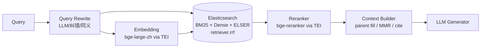

# Elasticsearch 在 RAG 与 Agent 工程里的落地

> 写在前面：很多 Python / AI 团队来到生产 RAG 才意识到——**ES 不是"古典 BM25 的代名词"**，它在 8.x 之后已经完成了三件大事：原生 `dense_vector` + HNSW、原生 `retriever.rrf` 混合检索、ELSER 稀疏向量预训练。**在简历里"了解 ES"和"在 RAG / Agent 里把 ES 用透"是两个完全不同的段位**。本文按"基础速查 → RAG 落地 → Agent 落地 → 生产工程 → 面试 Q&A"五段展开，目标是把 ES 上的所有可考点压成一篇能背的复习长文。
>
> 你在百度健康助手用 ES 做 BM25 主路、在百度地图 UGC 用 ES 做电话精确召回 / 黑产用户行为聚合——这两块都需要这一篇支撑。


## 0. 本文地图

| 模块 | 必须掌握 | 面试容易翻车的点 |
|---|---|---|
| ES 基础 | shard / replica / inverted index / mapping / analyzer | 把 ES 当 "MySQL+全文搜" 用 |
| BM25 调参 | k1 / b / IDF / TF-norm | 不知道 BM25 是 ES 默认 similarity |
| Dense Vector | dense_vector + HNSW + 多向量 | 还以为 ES 不支持向量 |
| 混合检索 | RRF retriever / sub_searches | 自己手撸融合分数 |
| ELSER | 稀疏向量预训练 | 不知道 ES 自带预训练稀疏 emb |
| Agent 落地 | tool result store / behavior 聚合 / hybrid 召回 | 只把 ES 当"知识库" |
| 生产工程 | mapping 设计 / refresh_interval / merge policy / index lifecycle | 不知道 hot-warm-cold tiering |
| 监控 | _cat APIs / Slow log / 慢查询定位 | 不会 EXPLAIN profile |

---

## 1. ES 在 2026 年是什么形态（快速复习，对齐认知）

### 1.1 ES 8.x 之后的三件大事

1. **`dense_vector` + HNSW 索引正式 GA**（8.0）：原本 RAG 团队都要外挂 Faiss/Qdrant，现在 ES 单引擎能搞定。
2. **`retriever.rrf` 原生混合检索**（8.8）：BM25 + Dense + ELSER 多路融合一行 query 搞定，不用客户端融合。
3. **ELSER (Elastic Learned Sparse Encoder)**（8.11）：预训练稀疏向量模型，效果接近 dense embedding 但**完全可解释**（每个 token 一个 score），且**全 ES 内推理**，不需要外部 GPU 服务。

这三件叠起来，**ES 在 RAG 场景里从"BM25 提供者"升级成了"一体化检索栈"**。

### 1.2 核心概念速查（面试必背）

| 概念 | 一句话 | 易错点 |
|---|---|---|
| Index | 一个逻辑表 | 不是 MySQL 的 "数据库" |
| Shard | 物理分片，水平扩展单元 | 一旦定就**不能动态改**（要 reindex） |
| Replica | 副本，读扩展 + 高可用 | 副本数可以热改 |
| Document | 一行 JSON | 默认 `_source` 全存（可关，省存储） |
| Mapping | schema | 字段类型一旦定型基本不能改（动态映射的坑） |
| Analyzer | 分词器 + token filter 链 | 中文必须配 `ik_max_word` 或 `smartcn` |
| Inverted Index | 倒排索引（BM25 的物理基础） | 全文 = 倒排，keyword = 精确 |
| Doc Values | 列存（用于排序 / 聚合） | 关掉省存储，但不能 sort/aggs |
| `_source` | 原始 JSON 存储 | 关掉拿不回原文，但可以 stored_fields |
| BM25 | 默认 similarity（`b=0.75, k1=1.2`） | 不是 TF-IDF！ |
| Term vs Match | term 不分词精确；match 走 analyzer 分词 | 中文 match 不走 ik 就退化成单字 |

### 1.3 BM25 公式（背一下）

```text
score(q, d) = Σ_t  IDF(t) · (f(t,d) · (k1+1)) / (f(t,d) + k1·(1 - b + b·|d|/avgdl))

  IDF(t) = log(1 + (N - df(t) + 0.5) / (df(t) + 0.5))

  k1 = 1.2     # 默认。越大 → TF 影响越大（短文档敏感）
  b  = 0.75    # 默认。越大 → 长度归一化越强
  N           # 文档总数
  df(t)       # 词 t 出现的文档数
  f(t,d)      # 词 t 在文档 d 的 TF
  |d| / avgdl # 文档长度 / 平均文档长度
```

调参经验：

- 长文档（学术论文 / 知识库）：`b` 适当下调到 0.5，避免过度惩罚长文档。
- 短文档（FAQ / 商品标题）：`k1` 上调到 1.5-1.8，让 TF 更显著。
- **不要乱调，先看 explain**：`?explain=true` 看每条 hit 的打分细节。

---

## 2. RAG 落地：ES 做混合检索的完整路径

### 2.1 单 BM25 不够：为什么必须 hybrid

在 RAG 场景，BM25 和 Dense 是**互补的**：

| 场景 | BM25 命中 | Dense 命中 |
|---|---|---|
| "氯雷他定的禁忌症" | ✅ 药名精确匹配 | ❌ 模糊到"抗组胺药" |
| "心口疼喘不上气" | ❌ 口语 vs "胸闷气短" | ✅ 语义匹配 |
| "BERT base 训练 hyperparameter" | ✅ 术语 | ✅ 语义 |
| 用户错别字 "氯雷它定" | ❌ tokenize 失败 | ✅ 拼写鲁棒 |

**核心结论**：BM25 保术语精确召回、Dense 保语义泛化，二者**必须 hybrid**。

### 2.2 ES 8.8+ 的三种 hybrid 写法

#### 方式 A：原生 `retriever.rrf`（最干净）

```python
from elasticsearch import AsyncElasticsearch
es = AsyncElasticsearch(["http://es:9200"])

async def hybrid_search(query: str, q_vec: list[float], size: int = 50):
    res = await es.search(
        index="medical_kb",
        retriever={
            "rrf": {
                "retrievers": [
                    # 一路：BM25
                    {"standard": {"query": {"match": {"content": {"query": query, "boost": 1.0}}}}},
                    # 二路：Dense kNN
                    {"knn": {
                        "field": "embedding",
                        "query_vector": q_vec,
                        "k": 80,
                        "num_candidates": 200,
                    }},
                ],
                "rank_window_size": 100,    # 每路保留多少送入 RRF
                "rank_constant": 60,         # k=60，Cormack 2009 默认
            }
        },
        size=size,
    )
    return [{"id": h["_id"], "score": h["_score"], **h["_source"]} for h in res["hits"]["hits"]]
```

#### 方式 B：`sub_searches` + linear combination（8.6+）

```python
# 适合需要显式加权的场景
body = {
    "sub_searches": [
        {"query": {"match": {"content": query}}},
        {"query": {"knn": {"field": "embedding", "query_vector": q_vec, "num_candidates": 200}}},
    ],
    "rank": {"rrf": {"rank_window_size": 100, "rank_constant": 60}},
    "size": size,
}
```

#### 方式 C：客户端融合（兼容 ES 7.x）

只在不能升级到 8.8 时用——客户端用 RRF / Weighted 自己融合（见 [Vector DB + Reranker](./07-vector-db-reranker.md) §2 的代码）。

### 2.3 Dense Vector + HNSW 怎么建

```python
# 1. 建 mapping
await es.indices.create(
    index="medical_kb",
    mappings={
        "properties": {
            "doc_id":     {"type": "keyword"},
            "content":    {"type": "text", "analyzer": "ik_max_word"},
            "embedding":  {
                "type": "dense_vector",
                "dims": 1024,                       # bge-large-zh
                "index": True,
                "similarity": "cosine",             # cosine / dot_product / l2_norm
                "index_options": {
                    "type": "hnsw",
                    "m": 24,                        # 越大召回↑ 内存↑
                    "ef_construction": 200,         # 建图质量
                },
            },
            "authority":  {"type": "keyword"},      # 元数据过滤
            "scope":      {"type": "keyword"},      # 多值
            "updated_at": {"type": "date"},
            "field":      {"type": "keyword"},      # 结构化字段
            "risk_level": {"type": "keyword"},
        }
    },
)

# 2. 索引 dense 向量
await es.index(
    index="medical_kb",
    id=chunk_id,
    document={
        "doc_id": doc_id,
        "content": chunk_text,
        "embedding": embed(chunk_text).tolist(),
        "authority": "clinical_guideline",
        "scope": ["adult", "elderly"],
        "updated_at": "2024-03-15",
        "field": "禁忌",
        "risk_level": "high",
    },
)

# 3. 检索（带 pre-filter）
res = await es.search(
    index="medical_kb",
    knn={
        "field": "embedding",
        "query_vector": q_vec,
        "k": 50,
        "num_candidates": 200,
        # ⭐ pre-filter：HNSW 图搜索过程中过滤，不会丢精度
        "filter": {
            "bool": {
                "must": [
                    {"terms": {"authority": ["clinical_guideline", "national_drug_administration"]}},
                    {"terms": {"scope": ["elderly", "all"]}},
                    {"range": {"updated_at": {"gte": "2023-01-01"}}},
                ]
            }
        },
    },
)
```

**关键参数实测经验**（百万级 chunk 规模）：

| 参数 | 推荐值 | 影响 |
|---|---|---|
| `m` | 16-32 | 召回 / 内存 / 建图速度 tradeoff，24 是工业甜点 |
| `ef_construction` | 100-400 | 200 起步，再大边际递减 |
| `num_candidates` | k × 4 ~ k × 10 | 越大召回↑ 延迟↑，200 是甜点 |
| `similarity` | cosine | 大多数 embedding 模型用 cosine |

**容量估算**：1000 万 chunk × 1024 维 fp32 + HNSW(m=24) ≈ **45-55 GB**（不含原文、不含 BM25 倒排）。

### 2.4 ELSER（Elastic 自研稀疏向量）：BM25 与 Dense 之外的第三路

ELSER（Elastic Learned Sparse Encoder）是 Elastic 自研的**预训练稀疏向量模型**。把每段文本编码成一组 `(token → weight)` 对，相比 BM25 能学到"同义词"和"语义扩展"，相比 dense 又完全可解释。

```python
# 1. 在 ES cluster 部署 ELSER（一次性）
# 通过 ML node 自动 download + deploy

# 2. 加 sparse_vector 字段
await es.indices.put_mapping(
    index="medical_kb",
    properties={
        "elser_embedding": {"type": "sparse_vector"}
    },
)

# 3. ingest pipeline 自动 inference（写入时自动算）
await es.ingest.put_pipeline(
    id="elser-pipeline",
    processors=[{
        "inference": {
            "model_id": ".elser_model_2_linux-x86_64",
            "input_output": [{"input_field": "content", "output_field": "elser_embedding"}],
        }
    }],
)

# 4. 检索（一行）
body = {
    "query": {
        "sparse_vector": {
            "field": "elser_embedding",
            "inference_id": ".elser_model_2_linux-x86_64",
            "query": query,                          # 直接给原始查询
        }
    }
}
```

**ELSER 适合什么场景**：

- 不想自己跑 dense embedding 服务（TEI/vLLM 一套都不想搭）。
- 需要**可解释检索**（"为什么命中"能看到具体 token 的贡献）。
- 通用语义场景，但**领域适配差**（医学 / 法律的专有词覆盖弱于 bge-large-zh）。

**何时不用 ELSER**：

- 中文场景目前只有英文版稳定（中文版 elser-2 在 2026 才扩展）。
- 已经有强势 dense 模型 + GPU 服务，ELSER 收益有限。

### 2.5 完整 RAG 链路上 ES 的位置



**ES 在这个链路里同时承担**：

1. **BM25 倒排**（术语精确召回）
2. **Dense HNSW**（语义召回）
3. **ELSER 稀疏**（可解释语义召回，可选）
4. **Metadata pre-filter**（按 authority / scope / 时间约束）
5. **结果聚合 + RRF 融合**（一步出 Top-K）

这是 ES 在 2026 年 RAG 工程里**作为"一体化检索后端"**的核心价值。

---

## 3. Agent 落地：ES 不只是知识库

在 Agent 系统里 ES 有 5 个独特价值场景，**都不是"BM25 检索"那么简单**：

### 3.1 场景 A：作为 Agent 的工具检索后端

百度健康助手 / 地图 UGC 的 Audit Agent 都有多个 RAG 工具（`phone_lookup_rag`, `poi_history_rag`, `similar_report_cluster`...）。**每个工具的后端 99% 都是 ES**——因为：

- 需要**精确字段匹配**（user_id / poi_id / phone）+ 全文匹配混合。
- 需要**时间范围 filter**（"过去 30 天"）。
- 需要**结构化聚合**（聚合统计上报次数、通过率）。
- 这些都是 ES 的舒适区，Milvus / Qdrant 做不了或做得很费劲。

```python
# Audit Agent 的工具实现：phone_lookup_rag
async def phone_lookup_rag(phone: str) -> PhoneLookupResult:
    res = await es.search(
        index="poi_phone_bindings",
        query={
            "bool": {
                "must": [{"term": {"phone": phone}}],
                "filter": [{"range": {"bind_at": {"gte": "now-365d"}}}],
            }
        },
        aggs={
            "by_industry": {"terms": {"field": "poi_industry", "size": 10}},
            "by_city":     {"terms": {"field": "poi_city",     "size": 20}},
            "active_pois": {
                "filter": {"term": {"is_active": True}},
                "aggs": {"count": {"value_count": {"field": "poi_id"}}}
            },
        },
        size=50,
        sort=[{"bind_at": "desc"}],
    )
    return PhoneLookupResult(
        bound_pois=[h["_source"] for h in res["hits"]["hits"]],
        industry_distribution=res["aggregations"]["by_industry"]["buckets"],
        city_distribution=res["aggregations"]["by_city"]["buckets"],
        active_poi_count=res["aggregations"]["active_pois"]["count"]["value"],
    )
```

**为什么 ES 比 SQL 适合**：

- 一次查询同时拿"匹配文档 + 聚合统计"（SQL 要 union + 两次扫表）。
- 倒排索引让 phone 精确召回 O(1)。
- terms 聚合自带去重计数，比 SQL `COUNT(DISTINCT)` 快。

### 3.2 场景 B：Agent trace + 工具调用结果存储

LangGraph + Langfuse 的 trace 落地存储——**ES 是工具调用 trace 落库的最佳选择之一**：

```python
# tool_call_trace mapping
{
    "properties": {
        "session_id":   {"type": "keyword"},
        "run_id":       {"type": "keyword"},
        "agent_role":   {"type": "keyword"},      # orchestrator / evaluator
        "tool_name":    {"type": "keyword"},
        "input":        {"type": "object", "enabled": False},   # 不索引，存 JSON
        "output":       {"type": "object", "enabled": False},
        "input_text":   {"type": "text", "analyzer": "ik_max_word"},  # 选关键字段开全文
        "latency_ms":   {"type": "integer"},
        "status":       {"type": "keyword"},
        "started_at":   {"type": "date"},
        "prompt_version": {"type": "keyword"},
        "model":        {"type": "keyword"},
        "tokens_in":    {"type": "integer"},
        "tokens_out":   {"type": "integer"},
        "cost_usd":     {"type": "scaled_float", "scaling_factor": 1_000_000},
    }
}

# 查询：找最近 24h 调用 phone_lookup_rag 失败的 trace
res = await es.search(
    index="tool_call_trace",
    query={
        "bool": {
            "must": [
                {"term": {"tool_name": "phone_lookup_rag"}},
                {"term": {"status": "error"}},
                {"range": {"started_at": {"gte": "now-24h"}}},
            ]
        }
    },
    aggs={
        "by_agent": {"terms": {"field": "agent_role"}},
        "p95_latency": {"percentiles": {"field": "latency_ms", "percents": [50, 95, 99]}},
    },
    size=200,
)
```

**ES vs ClickHouse vs Postgres 做 trace 存储**：

| 维度 | ES | ClickHouse | Postgres jsonb |
|---|---|---|---|
| 写入吞吐 | 高（10w+ QPS） | 极高（百万） | 中（万级） |
| 全文搜索 | ✅ 原生 | ❌（自建 ik 复杂） | 中等 |
| 聚合 | ✅ 强（aggregation framework） | ✅ 极强 | 一般 |
| 时序优化 | 中（ILM 分层） | ✅ 原生 | 弱 |
| 复杂 JOIN | ❌ | ✅ | ✅ |
| 跨字段全文 + 聚合 | ✅ 一站式 | 弱 | 弱 |

**结论**：**Agent trace 体量中等 + 需要"全文 + 聚合"混合** → ES 最舒服。体量上亿后再考虑 ClickHouse + 全文外挂。

### 3.3 场景 C：Agent 长上下文 / Memory 存储

跨 session 的 Agent memory（类似 [LangGraph 上下文工程 §9](../interview/notes/langgraph-context-engineering.md) 讲的 Karpathy append-and-review 模型）——**ES 是放 long-term memory 最朴素也最有效的方案**：

```python
# user_memory mapping
{
    "properties": {
        "user_id":         {"type": "keyword"},
        "memory_type":     {"type": "keyword"},   # preference / fact / event
        "content":         {"type": "text", "analyzer": "ik_max_word"},
        "content_emb":     {"type": "dense_vector", "dims": 1024, "index": True,
                            "similarity": "cosine"},
        "importance":      {"type": "float"},     # LLM 打的重要度
        "created_at":      {"type": "date"},
        "last_recalled_at":{"type": "date"},      # 衰减用
        "recall_count":    {"type": "integer"},
    }
}

# 查询：拉这个用户最相关的 Top-5 memory（hybrid）
res = await es.search(
    index="user_memory",
    retriever={
        "rrf": {
            "retrievers": [
                {"standard": {"query": {"bool": {
                    "must": [{"term": {"user_id": uid}}],
                    "should": [{"match": {"content": current_topic}}],
                }}}},
                {"knn": {"field": "content_emb", "query_vector": q_emb,
                          "k": 30, "num_candidates": 100,
                          "filter": {"term": {"user_id": uid}}}},
            ],
            "rank_window_size": 50,
            "rank_constant": 60,
        }
    },
    size=5,
)
```

这套是 [MemGPT](https://github.com/cpacker/MemGPT) / [Letta](https://github.com/letta-ai/letta) 类长记忆系统的工程后端推荐方案——**ES 单引擎搞定 hybrid 检索 + scoped filter，比 vector DB + SQL 双栈干净**。

### 3.4 场景 D：用户行为 / 业务事件聚合查询

百度地图 UGC 的"用户行为序列工具"（`user_behavior_sequence`）就是直接打 ES：

```python
# 查 user_id 最近 7 天的所有上报事件 + 聚合
res = await es.search(
    index="ugc_events",
    query={
        "bool": {
            "must": [{"term": {"user_id": uid}}],
            "filter": [{"range": {"event_ts": {"gte": "now-7d"}}}],
        }
    },
    aggs={
        "by_hour":   {"date_histogram": {"field": "event_ts", "calendar_interval": "hour"}},
        "by_type":   {"terms": {"field": "report_type", "size": 20}},
        "by_city":   {"terms": {"field": "poi_city", "size": 20}},
        "speed_max": {"max": {"script": "doc['lat'].value * 111 ..."}}, # 速度 km/h
        "device_signatures": {"cardinality": {"field": "device_fingerprint"}},
    },
    size=200,
    sort=[{"event_ts": "desc"}],
)
```

**为什么不是 ClickHouse**：ES 自带全文（看用户文本上报内容）+ 聚合 + filter pre-filter，**一次查询出 Agent 需要的所有 evidence**，不用拼多次。

### 3.5 场景 E：相似 case 查询 / Agent decision caching

把 Agent 决策结果当 RAG 缓存——也用 ES（见 [百度地图 UGC Q13](../interview/baidu-map-ugc.md#q13相似-case-缓存怎么做)）：

```python
# decision_cache mapping
{
    "properties": {
        "report_signature":   {"type": "keyword"},          # 业务指纹
        "simhash":            {"type": "long"},              # 内容指纹
        "evidence_emb":       {"type": "dense_vector", "dims": 256,
                                "index": True, "similarity": "cosine"},
        "decision":           {"type": "object", "enabled": False},
        "confidence":         {"type": "float"},
        "created_at":         {"type": "date"},
        "ttl_at":             {"type": "date"},
    }
}

# 查：找最近 24h 相似 case 的决策
res = await es.search(
    index="decision_cache",
    knn={
        "field": "evidence_emb",
        "query_vector": evidence_emb,
        "k": 5,
        "num_candidates": 50,
        "filter": [{"range": {"created_at": {"gte": "now-24h"}}}],
        "similarity": 0.95,                                   # 阈值过滤
    },
    size=5,
)
```

---

## 4. ES 在 RAG/Agent 项目的生产工程

### 4.1 Mapping 设计的 6 条铁律

1. **能用 `keyword` 就别用 `text`**：搜索 vs 聚合两种用法用两个字段（`field_kw` + `field_text`），多花 30% 存储换查询正确性。
2. **`index: false` 关掉不查的字段**：`_source` 还在但不进倒排，省存储 + 加速 refresh。
3. **`enabled: false` 关掉 object 内部解析**：纯存 JSON 取回看，不进 mapping、不索引（用于 input/output/raw_response 大 blob）。
4. **`norms: false` 关掉长度归一化**：keyword 字段不需要 BM25 长度归一化。
5. **`store: true` 单独存高频取回字段**：避免每次都解析整个 `_source`。
6. **dense_vector 的 `dims` / `similarity` 一次定死**：改不了，新 mapping = 新 index = reindex。

### 4.2 refresh / flush / merge 三件事

- **`refresh_interval`**：默认 1s。写多读少场景可以调到 30s-60s，提升写入吞吐 2-3 倍（代价是数据 N 秒后才可见）。
- **`flush`**：translog 落盘到 lucene segment，自动触发，**不要手动 flush**（除非批量导入完成）。
- **`force_merge`**：合并 segment。**只在历史 index 不再写时跑**（hot 阶段不要 force_merge，否则反而拖慢）。

```python
# 批量写入前
await es.indices.put_settings(index="medical_kb", settings={"refresh_interval": "-1"})  # 关 refresh
await es.indices.put_settings(index="medical_kb", settings={"number_of_replicas": 0})    # 关副本

# ... 批量 bulk index ...

# 完事后
await es.indices.put_settings(index="medical_kb", settings={"refresh_interval": "1s", "number_of_replicas": 1})
await es.indices.forcemerge(index="medical_kb", max_num_segments=1)  # 合并 segment
```

**导入百万级 chunk 时这套优化能从 30min → 5min**。

### 4.3 Index Lifecycle Management (ILM)：hot-warm-cold-frozen 分层

```yaml
# ILM policy 示例：trace 索引
policy:
  phases:
    hot:                                                  # 实时写 + 查
      min_age: "0ms"
      actions:
        rollover: { max_age: "1d", max_size: "50gb" }
        set_priority: { priority: 100 }
    warm:                                                 # 7 天后只读
      min_age: "7d"
      actions:
        shrink: { number_of_shards: 1 }
        forcemerge: { max_num_segments: 1 }
        readonly: {}
        set_priority: { priority: 50 }
    cold:                                                 # 30 天后转冷盘
      min_age: "30d"
      actions:
        searchable_snapshot: { snapshot_repository: "s3-cold" }
        set_priority: { priority: 10 }
    delete:
      min_age: "180d"
      actions:
        delete: {}
```

**收益**：trace 索引一年从 30TB → 6TB（hot 1TB + warm 2TB + cold 3TB），查询性能基本不影响。

### 4.4 慢查询定位三板斧

```python
# 1. _explain API：单条文档为什么命中 + 各打分维度
explain = await es.explain(index="medical_kb", id="chunk_123",
                            query={"match": {"content": "氯雷他定 禁忌"}})

# 2. _profile：完整查询的 phase 耗时
res = await es.search(
    index="medical_kb",
    query={"match": {"content": "氯雷他定 禁忌"}},
    profile=True,
)
# res["profile"] 里有每个 shard 的 query / fetch / aggregation 耗时

# 3. Slow log（开启 cluster setting）
await es.cluster.put_settings(persistent={
    "logger.org.elasticsearch.index.search.slowlog": "TRACE",
    "index.search.slowlog.threshold.query.warn": "1s",
    "index.search.slowlog.threshold.fetch.warn": "500ms",
})
```

### 4.5 监控指标（接 Prometheus + Grafana）

```text
- elasticsearch_cluster_health_status        # green/yellow/red
- elasticsearch_cluster_pending_tasks
- elasticsearch_indices_search_query_total
- elasticsearch_indices_search_query_time_seconds (P95/P99)
- elasticsearch_indices_indexing_index_total
- elasticsearch_indices_indexing_index_time_seconds
- elasticsearch_jvm_memory_used_bytes / max_bytes
- elasticsearch_jvm_gc_collection_seconds_count
- elasticsearch_thread_pool_search_queue
- elasticsearch_thread_pool_write_queue
- elasticsearch_indices_fielddata_memory_size_bytes  # 不该高
```

**预警阈值**：

- `search_queue > 100` 持续 1min → query 限流不够 / shard 不足。
- `JVM heap > 75%` → 老年代清理跟不上，要么加内存要么减 fielddata。
- `pending_tasks > 50` → master 节点压力，看 cluster.routing.allocation 设置。

---

## 5. ES vs 其他检索栈（生产选型对照表）

| 维度 | Elasticsearch | OpenSearch | Vespa | Solr | Vector DB（Qdrant/Milvus） |
|---|---|---|---|---|---|
| BM25 | ✅ 原生 | ✅ 原生（fork） | ✅ | ✅ | ❌ |
| Dense Vector + HNSW | ✅ 8.0+ | ✅ k-NN plugin | ✅ ANN | 弱 | ✅ 强 |
| Hybrid 原生 | ✅ retriever.rrf 8.8+ | ✅ hybrid query | ✅ 强 | 弱 | 客户端融合 |
| 学习排序 (LTR) | Elastic 商业版 | ✅ 开源 | ✅ 原生 | ✅ | ❌ |
| 全文 + 聚合 | ✅ 强 | ✅ 同 | ✅ 强 | ✅ | ❌ |
| Filter pre-execute | ✅ | ✅ | ✅ | 弱 | Qdrant ✅ |
| 多向量 (per-field) | 8.7+ | ✅ | ✅ | 8.7+ Milvus 多向量 |
| ELSER 稀疏 | ✅ 独家 | ❌ | ❌ | ❌ | ❌ |
| 自托管难度 | 中（JVM 调优） | 中 | 高 | 中 | 低 |
| License | Elastic License 2.0（限制 SaaS 转售）| Apache 2.0 | Apache 2.0 | Apache 2.0 | Apache 2.0 |
| 生态成熟度 | ★★★★★ | ★★★★ | ★★★ | ★★★ | ★★★★ |
| 国内 / 商用 | Elastic 不开放某些国家 | AWS 主推、合规友好 | 较冷门 | 老系统 | Milvus 国产、Qdrant 中立 |

**选型决策树**：

```text
你的场景需要：
├─ 只做向量检索（无全文 / 弱聚合）→ Qdrant / Milvus
├─ 全文 + 向量 + 聚合一站式 → Elasticsearch（首选）
├─ License / 合规敏感（AWS 系）→ OpenSearch
├─ 极致性能 + 学术研究 → Vespa
└─ 历史遗留 + Java 生态 → Solr（不推荐新项目）
```

---

## 6. 与本站姊妹篇 / 简历项目映射

| 简历技术点 | 本文章节 | 相关姊妹篇 |
|---|---|---|
| 百度健康助手 BM25 + Dense 混合 | §2.2 / §2.3 | [RAG 混合检索](./02-rag-retrieval.md) |
| 百度地图 UGC `phone_lookup_rag` 工具后端 | §3.1 | [百度地图 UGC Q5](../interview/baidu-map-ugc.md#q5怎么识别虚假电话这是-agent-化的杀手-case) |
| Audit Agent trace 落库 | §3.2 | [Vector DB + Reranker](./07-vector-db-reranker.md) |
| 用户行为序列 / `user_behavior_sequence` 工具 | §3.4 | [百度地图 UGC Q7-Q8](../interview/baidu-map-ugc.md) |
| Agent 决策 cache | §3.5 | [百度地图 UGC Q13](../interview/baidu-map-ugc.md#q13相似-case-缓存怎么做) |
| Chunk 元数据过滤 | §2.3 pre-filter | [Chunking 策略](./11-chunking-strategy.md) |

---

## 7. 面试 Q&A（13 题，按由浅入深排序）

### Q1：ES 和 MySQL 全文索引有什么本质区别？

**核心论点**：MySQL 全文索引是"附加能力"，ES 是"为搜索而生"。具体三个 level：

1. **架构**：ES 原生**分布式**（shard + replica），MySQL 单机为主。
2. **倒排索引实现**：ES 用 Lucene，segment-based、append-only、merge policy；MySQL InnoDB 的 FTS 是 in-place 修改、并发能力有限。
3. **打分模型**：ES 默认 BM25 + 可换 similarity（DFR/IB/LM），MySQL natural language mode 只有简化版 TF-IDF。
4. **聚合能力**：ES `aggregations` 跨 shard 并行执行，MySQL 要 GROUP BY 全表扫。
5. **生态**：ES 有 Kibana / Logstash / Beats / ELSER 一整套。

**面试加分**：提"ES 8.x 之后还原生支持 dense_vector + HNSW + ELSER 稀疏"，体现你跟得上版本。

### Q2：BM25 的 `k1` 和 `b` 分别控制什么？怎么调？

**核心论点**：`k1` 控制 TF 饱和速度，`b` 控制文档长度归一化强度。

- **`k1`**（默认 1.2）：TF 影响曲线的陡峭程度。`k1=0` → TF 完全无效（只看是否出现）；`k1→∞` → TF 线性影响。**短文档场景上调到 1.5-1.8**，让重复出现的词更显著。
- **`b`**（默认 0.75）：长度归一化。`b=0` → 完全不归一化（长文档天然 TF 高）；`b=1` → 完全归一化。**长文档（论文 / 文档库）调到 0.5**，避免过度惩罚长文档。

**怎么调**：

```python
await es.indices.create(
    index="medical_kb",
    settings={"index": {
        "similarity": {
            "custom_bm25": {"type": "BM25", "k1": 1.4, "b": 0.65}
        }
    }},
    mappings={"properties": {"content": {"type": "text", "similarity": "custom_bm25"}}},
)
```

**面试金句**："BM25 调参的关键不是拍参数，是先构造一个 (query, gold_doc) 评测集，跑 grid search（k1 ∈ {1.0, 1.2, 1.5, 2.0} × b ∈ {0.5, 0.75, 1.0}），看 Recall@10 / nDCG。"

### Q3：什么时候用 `term` 什么时候用 `match`？

**关键区别**：

- **`term`**：**不走 analyzer**，把 query string 直接当 token 查。`{"term": {"status": "active"}}` 精确匹配。
- **`match`**：**走 analyzer 分词**后查。`{"match": {"content": "急性胰腺炎"}}` 会被 ik_max_word 切成 `["急性", "胰腺炎", "胰腺", "急"]` 多 term OR 查。

**踩坑**：

- 中文 `text` 字段用 `term` 查 → 几乎查不到（因为 term 不分词）。
- `keyword` 字段用 `match` 查 → 等价于 term（因为 keyword 字段不走 analyzer）。

**生产规则**：

| 字段类型 + 查询需求 | 用什么 |
|---|---|
| `keyword` 精确匹配 | `term` / `terms` |
| `text` 全文匹配 | `match` / `match_phrase` |
| 多字段全文 | `multi_match` |
| 短语精确匹配 | `match_phrase` |
| 模糊匹配 | `fuzzy` / `match` with `fuzziness="AUTO"` |
| 前缀 | `prefix` / `match_phrase_prefix` |

### Q4：ES 怎么实现 BM25 + Dense 的混合检索？

**核心论点**：ES 8.8+ 用 `retriever.rrf`，单 query 搞定。

```python
{
    "retriever": {
        "rrf": {
            "retrievers": [
                {"standard": {"query": {"match": {"content": query}}}},
                {"knn": {"field": "embedding", "query_vector": q_vec, "k": 50, "num_candidates": 200}},
            ],
            "rank_window_size": 100,
            "rank_constant": 60,
        }
    },
    "size": 20,
}
```

**RRF 公式**：`score(d) = Σ 1 / (k + rank_i(d))`，`k=60` 是 Cormack 2009 默认值。

**为什么 RRF 比 weighted 好**：BM25 分数 0-10、cosine 0-1，**尺度完全不可比**，weighted 必须手动 normalize；RRF 只看 rank，天然鲁棒。

**面试加分**：提"RRF 在冷启动时最稳，有评测集后可切到 Weighted 调 α 再挤 1-2pp"。

### Q5：`dense_vector` HNSW 的 `m` / `ef_construction` / `num_candidates` 怎么调？

| 参数 | 含义 | 推荐值 | 调高影响 |
|---|---|---|---|
| `m` | 每个节点的最大连接数（HNSW 图的密度） | 16-32 | 召回↑ 内存↑ 建图时间↑ |
| `ef_construction` | 建图时候选集大小 | 100-400 | 建图慢 + 索引质量更好 |
| `num_candidates` | 查询时候选集（必须 ≥ `k`） | k × 4 ~ k × 10 | 召回↑ 延迟↑ |

**生产甜点**：`m=24, ef_construction=200, num_candidates=200` 是百万级 chunk 实测最优。

**容量估算**：1000 万 × 1024 维 fp32 + HNSW(m=24) ≈ 50 GB。**这个数字背下来面试加分**。

**注意**：`m` 一旦定型不能改（要 reindex），`num_candidates` 是查询时参数可以随时调。

### Q6：ES 怎么做元数据过滤 + ANN，避免"明明库里有但查不到"？

**核心论点**：必须用 **pre-filter**（HNSW 图搜索时过滤），不是 post-filter（ANN 完取 Top-K 再筛）。

```python
# ✅ 正确：在 knn query 里挂 filter，HNSW 图搜索时过滤
{
    "knn": {
        "field": "embedding",
        "query_vector": q_vec,
        "k": 50,
        "num_candidates": 200,
        "filter": {
            "bool": {
                "must": [
                    {"terms": {"authority": ["clinical_guideline"]}},
                    {"range": {"updated_at": {"gte": "2023-01-01"}}},
                ]
            }
        }
    }
}

# ❌ 错误：在外层 bool 加 filter，等同 post-filter，会被滤穿
```

**面试加分**：提"如果不带 filter 召回都正常，加了 filter 召回掉很多，**先怀疑 post-filter**，把 `?explain=true` 跑一遍看图搜索是否进了过滤逻辑"。

### Q7：什么是 ELSER？什么时候选 ELSER 而不是 BM25 / Dense？

**核心论点**：ELSER = Elastic 自研的预训练**稀疏向量**模型，介于 BM25 和 Dense 之间。

| 维度 | BM25 | Dense (bge-large-zh) | ELSER |
|---|---|---|---|
| 学习能力 | 静态（IDF + TF） | 学习的 | 学习的 |
| 同义词 | 弱（要词典） | 强 | 强（学到的） |
| 可解释 | ✅ 强 | ❌ 黑盒 | ✅ 强（每个 token 一个 weight） |
| 计算 | ES 内置 | 外部 GPU 服务 | **ES ML node 内置** |
| 中文支持 | ✅ | ✅ | ❌ 当前主要英文 |

**选 ELSER 的场景**：

- 英文场景 + 不想搭 GPU embedding 服务。
- 需要"为什么命中"可解释（合规 / 审计）。
- 通用语义场景，不需要领域 embedding。

**不选 ELSER**：

- 中文场景（2026 中文 ELSER 还在 beta）。
- 已经有强 dense 模型 + 推理服务。
- 领域专用（医疗 / 法律）—— bge-large-zh + 领域微调更好。

### Q8：ES 怎么扮演 Agent 工具调用的后端？

**核心论点**：Agent 系统里 99% 的 RAG 工具后端用 ES——因为 ES **一次查询同时给"文档命中 + 聚合统计"**。

**典型样例（phone_lookup_rag 工具）**：

```python
async def phone_lookup_rag(phone: str):
    res = await es.search(
        index="poi_phone_bindings",
        query={"bool": {"must": [{"term": {"phone": phone}}],
                        "filter": [{"range": {"bind_at": {"gte": "now-365d"}}}]}},
        aggs={
            "by_industry": {"terms": {"field": "poi_industry"}},
            "active_count": {"filter": {"term": {"is_active": True}}},
        },
        size=50, sort=[{"bind_at": "desc"}],
    )
    return PhoneLookupResult(...)
```

**ES 在 Agent 里的 5 大场景**（见 §3）：

1. 工具检索后端（RAG 工具）
2. Agent trace + 工具调用结果存储
3. Agent 长上下文 / Memory 存储
4. 用户行为 / 业务事件聚合查询
5. 相似 case 决策 cache

### Q9：ES 写入慢 / 索引慢，怎么排查 + 优化？

**排查工具**：

1. `GET /_cat/indices?v` 看 docs.count / store.size / status。
2. `GET /_nodes/stats/indices/indexing` 看 indexing rate / time。
3. `GET /_cat/thread_pool/write?v` 看 write queue（持续 > 50 → 写阻塞）。
4. `GET /_cluster/pending_tasks` 看 master 待办。

**6 个常见优化**：

| 问题 | 优化 |
|---|---|
| Bulk 批太小 | 单 bulk 5-15 MB 是甜点 |
| Refresh 太频 | 批量写时 `refresh_interval=-1`，写完再恢复 |
| 副本写阻塞 | 批量写时 `number_of_replicas=0`，写完再加回 |
| 单 shard 过大 | 单 shard 控制 30-50 GB |
| Mapping 字段太多 | 关 `dynamic mapping`，预定义 mapping |
| 写入热点 | 用 `_doc` id 路由 + `random_routing` 打散 |

**实测**：百万级 chunk 写入用上面 6 个优化，从 30min → 5min。

### Q10：ES 查询慢，P99 突然涨到 5s，怎么定位？

**三板斧**：

1. **`?explain=true`**：单条文档为什么命中 + 各打分维度。
2. **`?profile=true`**：返回 `profile` 字段，列每个 phase 耗时。
3. **Slow log**：开 cluster setting，超阈值自动写到 log。

**常见根因**：

| 现象 | 根因 | 修 |
|---|---|---|
| 单 shard 极慢，其他正常 | 数据倾斜 / 热点 shard | 调路由、加 shard、warm 历史 index |
| 所有 shard 慢 | JVM heap 满 / GC 频繁 | 看 `jvm.gc`，调内存或减 fielddata |
| 聚合很慢 | cardinality 高 | 加 precision_threshold、用 composite aggs |
| script 慢 | painless 重运算 | 改 runtime field / 业务侧预算 |
| Wildcards | `*foo*` 不走倒排 | 改 prefix / suffix / reverse field |
| 深翻页 | from > 10000 | search_after / scroll |

### Q11：ES 怎么做"hot-warm-cold"分层？

**核心**：Index Lifecycle Management (ILM) policy 定义生命周期，每个阶段配不同节点池。

```text
hot   (SSD, 高 CPU)  →  实时写入 + 查询 (7d)
warm  (HDD, 普通 CPU) →  只读 + 偶尔查询 (30d)
cold  (HDD + Snapshot) → 几乎不查，从 S3 拉 (180d)
delete                → 自动删除
```

每阶段的 action：

- **hot → warm**：`shrink`（合并 shard）→ `forcemerge`（合并 segment 到 1 个）→ `readonly`。
- **warm → cold**：`searchable_snapshot` 上传到 S3，本地保留 metadata。
- **cold → delete**：直接删除。

**收益**：trace 索引 30TB → 6TB，查询性能基本不影响。

### Q12：ES 的 Inverted Index 是怎么实现的（segment / merge）？

**核心**：ES 基于 Lucene，文档**永远不直接修改 segment**。

**写入流程**：

1. 文档进入 `in-memory buffer`。
2. 每 `refresh_interval`（默认 1s）：buffer → 新 segment（这时已可见，但还在 OS page cache）。
3. 写 translog（每次或每 5s `fsync`，看 `index.translog.durability`）。
4. 每 `flush`：translog 落盘 + 持久化所有 segment 到磁盘。
5. **Merge policy** 后台合并小 segment → 大 segment（删旧 segment）。
6. 删除文档 = 标记 deleted bit + merge 时真正 drop。
7. 更新文档 = 标记旧文档 deleted + 写新文档。

**面试加分**：

- "为什么 ES 适合写多读多但不适合频繁更新"——因为更新 = 标记 + 重写。
- "为什么 forceMerge 不能在 hot 阶段跑"——会消耗大量 I/O + 阻塞 refresh。

### Q13：ES 与 Vector DB（Qdrant/Milvus）在 RAG 选型的判断？

**核心论点**：**ES 是"全文 + 向量 + 聚合一站式"，Vector DB 是"向量纯做精"**。

```text
你的场景：
├─ 已经在用 ES 做 BM25 / 日志 / trace → 直接上 ES 8.x dense_vector，最少新依赖
├─ 量级 < 千万 chunk + 多字段过滤要求 → Qdrant payload filter 极强
├─ 量级 > 亿 chunk + 分布式 + GPU 索引 → Milvus 2.4+
└─ 全文 + 向量 + 聚合 + 时序日志同库 → 必须 ES（其他 DB 都拼不出来）
```

**百度健康助手 / 地图 UGC 的实际架构**：

- ES 主路：BM25 + dense_vector + 聚合（trace、用户行为、工具结果）。
- Milvus 旁路：仅承担**亿级电话行为向量** ANN（Q5），因为这部分量级超 ES 单引擎舒适区。
- pgvector：完全没用——业务侧 OLTP 跟 vector 强解耦。

**面试金句**："Vector DB 是优势在'纯向量场景'的特化引擎，ES 优势在'文本 + 元数据 + 向量 + 聚合'的一站式。看你的业务诉求里这五件哪几件同时存在，就能选出来。"

---

## 8. 全局技术栈速查表（ES 周边生态）

| 问题域 | 主推 | 备选 | 一句话理由 |
|---|---|---|---|
| ES 客户端（Py async） | `elasticsearch[async]` 8.x | httpx 直调 | 官方 + async 完整 |
| ES 客户端（Go） | `elastic/go-elasticsearch` v8 | olivere/elastic | 官方支持 |
| ES 中文分词 | **`ik` 分词器**（ik_max_word + ik_smart） | hanlp ES plugin / smartcn | 中文 ES 事实标准 |
| 同义词热更 | `synonym_graph` filter + `synonyms_path` file watcher | 重启 reload | 热更不重启 |
| Embedding 推理（外挂） | HF TEI / Triton | vLLM | TEI Rust + FP16 |
| Embedding 推理（内挂） | ES `inference processor` + ML node | ELSER | 一切在 ES 内 |
| 索引管理 | Kibana Dev Tools + `elasticsearch-dump` 备份 | curator | 备份必备 |
| ILM | ES 原生 ILM policy + Kibana UI | manual cron | 官方 |
| Reindex | ES `_reindex` API + slice + remote | logstash | slice 并发 |
| 监控 | Elastic Agent + Stack Monitoring / Prometheus exporter | Datadog | 自托管推 Prometheus |
| Slow log | ES `index.search.slowlog.threshold` 配置 | manual | 必开 |
| 部署 | ECK (Elastic Cloud on Kubernetes) + StatefulSet | manual K8s | ECK 自动 ILM |
| 备份 | `_snapshot` + S3 repository | logstash | 标配 |
| Anomaly Detection | Elastic Anomaly Detection (商业) / 自建 IsolationForest | manual | 一般自建够 |
| Search Relevance UI | Quepid / 自建 A/B | manual | 内部相关性评测 |
| Vector DB 联动 | Milvus / Qdrant 旁路 + ES 主路 | 单 ES | 亿+ 量级旁挂 |
| Reranker 旁挂 | HF TEI bge-reranker | jina-reranker | 与 ES 解耦 |

---

## 9. 参考资料

**官方文档：**

- [Elasticsearch Reference (8.x latest)](https://www.elastic.co/guide/en/elasticsearch/reference/current/index.html)
- [ES `retriever.rrf` 文档](https://www.elastic.co/guide/en/elasticsearch/reference/current/rrf-retriever.html)
- [ES `dense_vector` + kNN](https://www.elastic.co/guide/en/elasticsearch/reference/current/knn-search.html)
- [ELSER 模型](https://www.elastic.co/guide/en/machine-learning/current/ml-nlp-elser.html)
- [Index Lifecycle Management](https://www.elastic.co/guide/en/elasticsearch/reference/current/index-lifecycle-management.html)
- [ES 中文 IK 分词器](https://github.com/infinilabs/analysis-ik)

**学术 / 工程参考：**

- BM25 原论文：Robertson & Walker, 1994 *Some Simple Effective Approximations to the 2-Poisson Model*
- HNSW 论文：Malkov & Yashunin, 2018 *Efficient and robust approximate nearest neighbor search using Hierarchical Navigable Small World graphs*
- RRF 论文：Cormack et al., 2009 *Reciprocal Rank Fusion outperforms Condorcet and individual Rank Learning Methods*

**Elastic 团队官方博客（必读）：**

- [Hybrid search using RRF](https://www.elastic.co/blog/hybrid-search-elasticsearch)
- [Introducing ELSER](https://www.elastic.co/blog/may-2023-launch-information-retrieval-elasticsearch-ai-model)
- [Vector search in Elasticsearch](https://www.elastic.co/blog/introducing-vector-search-and-similarity-search-in-elasticsearch)
- [Tuning HNSW for vector search](https://www.elastic.co/blog/introducing-approximate-nearest-neighbor-search-in-elasticsearch-8-0)

**本站姊妹篇：**

- [RAG 混合检索与医疗问答](./02-rag-retrieval.md)
- [Vector DB 选型 + Reranker 深入](./07-vector-db-reranker.md)
- [Chunking 策略：RAG 工程落地](./11-chunking-strategy.md)
- [LangGraph 上下文工程实战](../interview/notes/langgraph-context-engineering.md)
- 项目 Q&A：[百度健康助手](../interview/baidu-health.md) · [百度地图 UGC](../interview/baidu-map-ugc.md)
