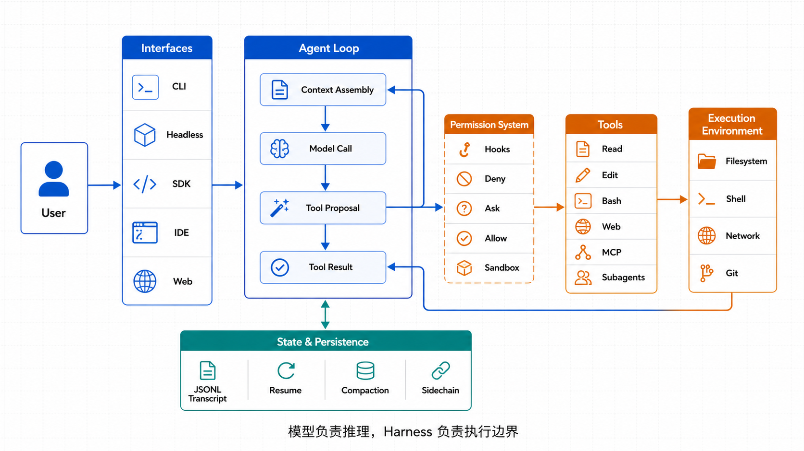
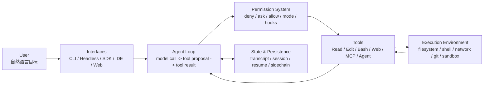
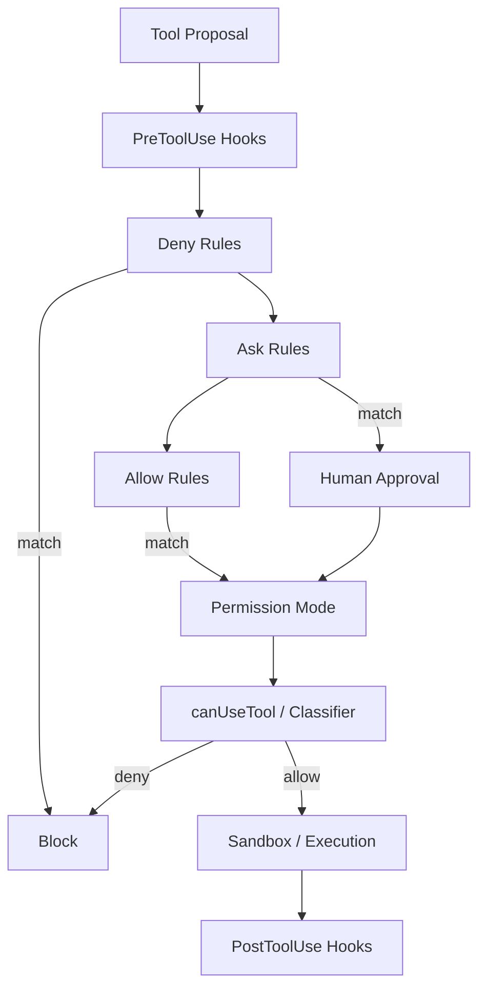
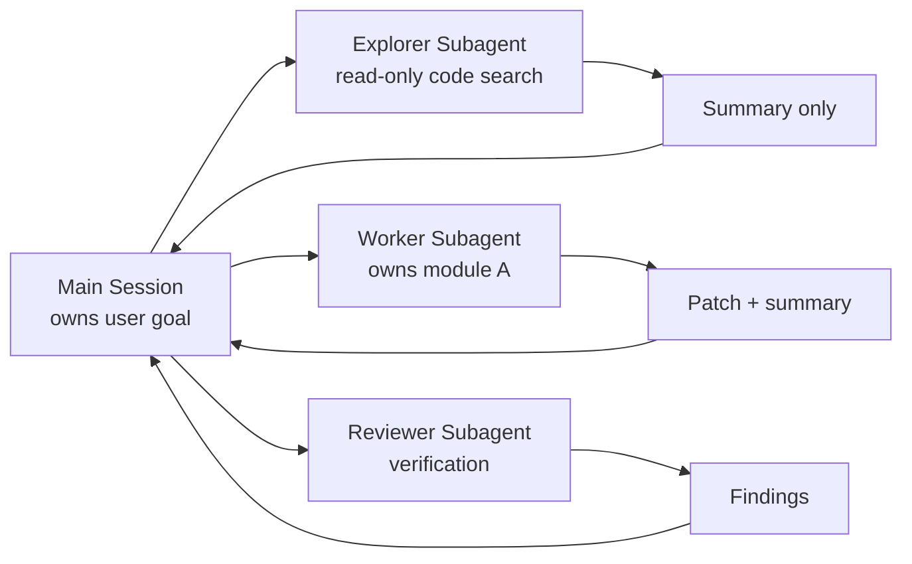
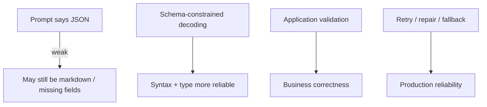
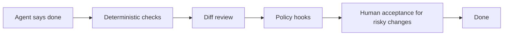

# Claude Code 源码分析与架构设计复盘



> 调研日期：2026-05-15  
> 资料范围：公开论文、Anthropic 官方文档、公开源码分析项目索引与工程实践文档。本文只提炼可迁移的架构模式，不复刻泄露源码、原始 prompt 或专有实现细节。

## 0. 搜索结论

这次检索最值得看的资料分三类：

| 类型 | 资料 | 价值 | 使用方式 |
|---|---|---|---|
| 源码分析论文 | [Dive into Claude Code: The Design Space of Today's and Future AI Agent Systems](https://arxiv.org/abs/2604.14228) | 把 Claude Code 抽象成 7 个高层组件、5 层子系统和 13 条设计原则 | 作为架构主线 |
| 官方文档 | [How Claude Code works](https://code.claude.com/docs/en/how-claude-code-works)、[Permissions](https://code.claude.com/docs/en/permissions)、[Hooks](https://code.claude.com/docs/en/hooks)、[Subagents](https://code.claude.com/docs/en/sub-agents) | 验证 agent loop、权限、hooks、subagent、MCP、CLI structured output 的真实产品语义 | 作为可落地接口约束 |
| 工程问题论文 | [Engineering Pitfalls in AI Coding Tools](https://arxiv.org/abs/2603.20847)、[Decoding the Configuration of AI Coding Agents](https://arxiv.org/abs/2511.09268) | 从 bug 与配置文件角度说明：工具调用、命令执行、配置上下文是 AI coding agent 的高风险区 | 作为设计 checklist |
| 社区索引 | [learn-claude-code / SourcePulse](https://www.sourcepulse.org/projects/11032055) | 提供 v1.0.33 逆向研究项目入口，强调异步队列、多 agent、上下文压缩、安全框架 | 只借鉴抽象，不依赖泄露内容 |
| 结构化输出 | [Structured outputs docs](https://platform.claude.com/docs/en/build-with-claude/structured-outputs)、[Structured outputs announcement](https://claude.com/blog/structured-outputs-on-the-claude-developer-platform)、[Claude Code headless JSON output](https://code.claude.com/docs/en/headless) | 回答“怎么保证 LLM 输出 JSON 正确”这个核心工程问题 | 作为 schema / retry / fallback 设计依据 |

一句话结论：

> Claude Code 的核心不是一个复杂 planner，而是一个很薄的 ReAct agent loop，加上很厚的工程外壳：权限、工具、上下文、hooks、subagent、持久化、压缩、恢复和可审计执行。

## 1. Claude Code 的高层架构

源码分析论文把 Claude Code 拆成 7 个高层组件。这个抽象很适合照着设计自己的 coding agent：



| 组件 | 负责什么 | 设计要点 |
|---|---|---|
| User | 提出目标、审批高风险动作、验收结果 | 人类保留最终决策权 |
| Interfaces | interactive CLI、`claude -p`、Agent SDK、IDE、Web、CI | 不同入口汇入同一个 loop，避免多套行为 |
| Agent Loop | 组上下文、调模型、解析工具请求、回填工具结果 | 模型负责推理，harness 负责执行和边界 |
| Permission System | deny-first、ask/allow、permission mode、hooks、classifier、sandbox | 安全不是 prompt 里的几句话，而是运行时策略 |
| Tools | 文件、搜索、命令、网页、MCP、subagent | 工具是 action proposal，不是让模型直接碰系统 |
| Execution Environment | 本地文件系统、shell、网络、git、远程环境 | 对 Bash 和网络要额外隔离 |
| State & Persistence | JSONL transcript、session metadata、resume、fork、subagent sidechain | 追加式日志比“覆盖式状态”更适合审计和恢复 |

## 2. 核心运行链路

Claude Code 的主循环可以简化成：

```text
while task_not_done:
    context = assemble_context(settings, CLAUDE.md, history, memory, tool_schemas)
    response = call_model(context)

    if response.has_tool_use:
        for tool_call in response.tool_uses:
            decision = permission_gate(tool_call)
            if decision.allow:
                result = execute_tool(tool_call)
            else:
                result = denied_feedback(decision)
            append_tool_result(result)
        compact_if_needed()
        continue

    render_answer(response)
    break
```

关键不是 `while`，而是循环周围的工程约束：

| 环节 | 生产设计 | 不这么做会怎样 |
|---|---|---|
| Context assembly | 只放本轮必要上下文，工具 schema 延迟/按需暴露 | 工具太多、历史太长，模型开始乱选或忽略约束 |
| Model call | 模型只输出文字和结构化 tool proposal | 模型绕过权限直接执行是不允许的 |
| Permission gate | PreToolUse hook、deny、ask、allow、permission mode、sandbox 多层判断 | Prompt injection 或误操作会直接打到 shell / 文件系统 |
| Tool execution | 参数校验、幂等、超时、stderr/stdout 归一、审计 | 命令卡死、重复执行、输出爆 context |
| Result feedback | 工具结果作为下一轮输入，失败也结构化返回 | 模型不知道失败原因，只能编 |
| Compaction | 输出截断、历史裁剪、摘要、自动压缩 | 长任务在上下文边界处失忆或污染 |
| Persistence | 每轮追加 transcript，支持 resume/fork/rewind | 无法复盘线上 badcase，也无法恢复长任务 |

## 3. 5 层子系统视角

源码分析论文还把系统拆成更低一层的子系统。照这个结构设计，职责边界会比较清晰：

```text
1. Interface Layer
   - CLI TUI / headless / SDK / IDE / Web / CI

2. Core Agent Layer
   - query loop
   - context assembly
   - model routing
   - tool proposal parsing

3. Safety & Policy Layer
   - permissions
   - hooks
   - sandbox
   - protected paths
   - risk classifier

4. Capability Layer
   - built-in tools
   - MCP tools
   - skills
   - plugins
   - subagents

5. State & Recovery Layer
   - append-only transcripts
   - session metadata
   - context compaction
   - subagent sidechain
   - resume / fork / rewind
```

面试里要强调：Claude Code 没把 agent 做成一个庞大的状态机框架，而是把“大部分复杂度”放在 harness。模型仍然自由推理，但所有外部动作必须穿过确定性边界。

## 4. 权限系统怎么设计

Claude Code 官方权限文档给出的核心思想是 deny-first + 多层防御：



设计 tips：

| 场景 | 推荐设计 |
|---|---|
| 读文件 | 默认允许工作目录读；对 `.env`、密钥、凭证目录显式 deny |
| 写文件 | acceptEdits 只适合工作区内普通编辑；`.git`、`.claude`、CI 配置、hooks 配置要更严 |
| Bash | 先 allow 常见安全命令，例如 `npm test`、`pytest`；危险命令必须 ask/deny |
| 网络 | WebFetch 按 domain allowlist；Bash 里的 `curl`、`wget` 也要单独拦 |
| Hook | PreToolUse 做安全扫描，PostToolUse 做格式化/测试/trace |
| Sandbox | Bash 子进程单独做 OS 级文件/网络隔离，权限系统和 sandbox 互补 |
| Auto mode | 可用 classifier 自动判断低风险动作，但不要把它当成安全边界的唯一来源 |

一个简化配置示例：

```json
{
  "permissions": {
    "deny": [
      "Read(./.env)",
      "Read(./secrets/**)",
      "Bash(rm -rf *)",
      "Bash(curl * | sh)"
    ],
    "allow": [
      "Read(./src/**)",
      "Edit(./src/**)",
      "Bash(npm test*)",
      "Bash(pytest*)"
    ],
    "ask": [
      "Bash(git push*)",
      "Edit(./.github/**)",
      "Edit(./.claude/**)"
    ]
  }
}
```

注意：Bash 权限不能只看命令前缀，管道、重定向、命令替换、环境变量、通配符都可能改变真实行为。生产实现里要把 shell 命令解析、安全规则、sandbox 放在一起看。

## 5. Hooks：把不可控 agent 变成可治理 runtime

Hooks 是 Claude Code 最值得借鉴的扩展点之一。官方 hooks 文档说明它们可以在生命周期事件上执行 shell、HTTP、MCP tool、prompt 或 subagent。

| Hook | 典型用途 |
|---|---|
| `SessionStart` | 注入项目上下文、加载环境、读取动态配置 |
| `PreToolUse` | 阻止危险命令、检查 protected path、改写工具参数 |
| `PostToolUse` | 自动格式化、补 trace、跑局部 lint |
| `PermissionRequest` | 把审批发到 Slack/飞书/企业审批系统 |
| `Stop` | 在 agent 宣称完成前跑测试或检查 checklist |
| `PostCompact` | 压缩后重新注入关键约束，避免重要规则丢失 |

Hook 的关键是“输入输出都结构化”：

```json
{
  "session_id": "sess_xxx",
  "transcript_path": "/path/to/session.jsonl",
  "cwd": "/repo",
  "permission_mode": "default",
  "hook_event_name": "PreToolUse",
  "tool_name": "Bash",
  "tool_input": {
    "command": "npm test"
  }
}
```

Hook 输出建议统一成：

```json
{
  "decision": "allow",
  "reason": "command is in project test allowlist",
  "updatedInput": {
    "command": "npm test -- --runInBand"
  }
}
```

实现建议：

- Hook 要有超时，默认 30-60s，避免 agent 被外部系统卡死。
- 相同 hook handler 去重并行执行，减少重复成本。
- Hook 配置文件本身要受保护，防止模型悄悄加一个“自动放行所有命令”的 hook。
- 阻断类 hook 的 stderr / reason 要回填给模型，让模型知道为什么被拒绝。
- 复杂验证用 agent hook 或独立 checker，不要把所有逻辑塞进 prompt。

## 6. 上下文工程与压缩

Claude Code 源码分析里最重要的结论之一：上下文窗口是核心瓶颈。即使模型支持百万 token，生产 agent 仍然会被工具输出、历史、工具 schema、错误日志、子任务 scratchpad 塞满。

可迁移的上下文策略：

| 策略 | 解决什么 | 实现方式 |
|---|---|---|
| Tool loadout | 工具 schema 太多 | 只暴露本阶段工具；MCP server 可只挂给 subagent |
| Output budgeting | 工具输出太长 | stdout/stderr 分段、截断、保留尾部错误、存原文引用 |
| Snip | 历史太深 | 删除旧工具结果，保留摘要和引用 |
| Micro-compact | cache overhead / 小范围膨胀 | 对局部历史做轻量压缩 |
| Context collapse | 长会话历史过重 | 把旧会话折叠成结构化状态摘要 |
| Auto-compact | 最后一层语义压缩 | 让模型生成可继续工作的摘要，但要保留约束、决策、未决问题 |
| Sidechain | subagent 历史污染 parent | subagent 自己写 transcript，只把最终 summary 返回 parent |

摘要模板不要只写“做了什么”，至少保留这些字段：

```json
{
  "goal": "用户当前目标",
  "confirmed_constraints": ["已经确认的约束"],
  "decisions": [
    {"decision": "选择方案 A", "reason": "为什么"}
  ],
  "changed_files": ["src/a.ts"],
  "open_questions": ["还缺什么"],
  "failed_attempts": [
    {"action": "npm test", "error": "失败摘要", "next": "下一步"}
  ],
  "must_not_do": ["不能改 public API", "不能删除用户改动"]
}
```

## 7. Subagents 与隔离

Subagent 的价值不是“多开几个模型显得强”，而是隔离上下文、隔离工具权限、隔离写入范围。



设计 tips：

| 问题 | 推荐做法 |
|---|---|
| 子 agent 把 parent context 吃爆 | 子 agent 单独 transcript，parent 只收 summary |
| 多 worker 冲突 | 给每个 worker 明确文件/模块 ownership |
| 工具过多 | MCP server 按 subagent scope 注入，不进入 parent 主上下文 |
| 权限失控 | subagent permissionMode 只允许变窄；高风险写操作回到 parent 审批 |
| 验证不可信 | reviewer 和 worker 分离，reviewer 用只读权限和独立上下文 |
| 长任务成本爆炸 | 只有明确可并行、写集不重叠、结果可合并时才 spawn |

面试表达：

> Subagent 是 context quarantine。主会话负责目标和集成，子会话负责局部探索或执行，最后只把可审计摘要和 patch 带回来。

## 8. 如何保证 LLM 输出 JSON 格式正确

这类问题要分三层回答：



### 8.1 最小可用方案：Claude Code CLI

Claude Code headless 模式支持 `--output-format json` 和 `--json-schema`。用于脚本化任务时，不要让下游直接 parse 自然语言：

```bash
claude -p "Extract changed modules from this diff" \
  --output-format json \
  --json-schema '{
    "type": "object",
    "properties": {
      "modules": {
        "type": "array",
        "items": {"type": "string"}
      },
      "risk": {
        "type": "string",
        "enum": ["low", "medium", "high"]
      }
    },
    "required": ["modules", "risk"],
    "additionalProperties": false
  }' | jq '.structured_output'
```

### 8.2 API 方案：优先 structured output / strict tool

Anthropic structured outputs 文档给的核心点：

- 用 JSON Schema 约束输出，而不是只在 prompt 里说“输出 JSON”。
- structured output 会把 schema 编译成 grammar，约束模型生成。
- 仍然要处理 `refusal` 和 `max_tokens`，这两种情况下输出可能不符合 schema。
- schema 太复杂会增加编译和生成成本，optional、`anyOf`、union types 要控制数量。

设计 schema 时的规则：

| 规则 | 原因 |
|---|---|
| 字段尽量 required | 可减少遗漏；如果输出顺序重要，required 字段会先出现 |
| `additionalProperties: false` | 防止模型塞入下游不认识的字段 |
| enum 优先于自由文本 | 让 planner / classifier 可控 |
| 数字加 `minimum` / `maximum` | 防止生成离谱参数 |
| 不把业务大段文本塞进 enum | enum 是控制面，不是知识库 |
| 少用深层嵌套和大量 optional | 降低 grammar 复杂度和失败概率 |

### 8.3 应用层必须二次校验

Schema 只能保证结构，不保证业务语义。比如模型输出：

```json
{
  "workflow_pattern": "video_dag_v99",
  "shot_count": 3,
  "shots": [
    {"id": "s1", "duration_sec": 5},
    {"id": "s2", "duration_sec": 5}
  ]
}
```

JSON 是合法的，但业务上错了：`workflow_pattern` 不存在，`shot_count` 和 `shots.length` 不一致。

推荐模式：

```python
from pydantic import BaseModel, Field, ValidationError

class Shot(BaseModel):
    id: str
    duration_sec: int = Field(ge=1, le=12)
    subject: str

class PlannerOutput(BaseModel):
    workflow_pattern: str
    shot_count: int = Field(ge=1, le=12)
    shots: list[Shot]

class RetryableModelOutputError(Exception):
    pass

class BusinessValidationError(Exception):
    pass

def validate_output(raw_json: str, registry: set[str]) -> PlannerOutput:
    try:
        parsed = PlannerOutput.model_validate_json(raw_json)
    except ValidationError as exc:
        raise RetryableModelOutputError(str(exc)) from exc

    if parsed.workflow_pattern not in registry:
        raise BusinessValidationError(f"unknown workflow_pattern: {parsed.workflow_pattern}")
    if parsed.shot_count != len(parsed.shots):
        raise BusinessValidationError("shot_count does not match shots length")
    return parsed
```

### 8.4 Repair loop 要有边界

```python
async def call_with_schema_retry(prompt: str, schema: dict, registry: set[str], max_retries: int = 2):
    errors: list[str] = []

    for attempt in range(max_retries + 1):
        raw = await llm_json_call(
            prompt=prompt,
            schema=schema,
            previous_errors=errors[-2:],
        )
        try:
            return validate_output(raw, registry)
        except RetryableModelOutputError as exc:
            errors.append(f"schema error: {exc}")
            continue
        except BusinessValidationError as exc:
            errors.append(f"business error: {exc}")
            continue

    return {
        "status": "needs_human",
        "reason": "model could not produce valid business output after bounded retries",
        "errors": errors,
    }
```

Retry 原则：

- 最多 1-2 次，不要无限 repair。
- 错误信息要结构化回填给模型。
- 每次 retry 不要把完整失败输出无限累加进 prompt，只给最近错误摘要。
- 如果是业务缺信息，不要 retry，要问用户或 fallback。
- 对写操作不要在 repair 过程中执行副作用。

### 8.5 Tool calling 比 raw JSON 更适合动作

如果输出会触发真实动作，例如改文件、发请求、部署、提交 PR，应该让模型输出 tool call：

```json
{
  "tool_name": "create_patch",
  "arguments": {
    "file_path": "src/auth.ts",
    "operation": "replace",
    "old_text": "...",
    "new_text": "..."
  }
}
```

然后 harness 做：

```text
parse -> schema validate -> permission gate -> business validate -> idempotency key -> execute -> audit -> result
```

这比让模型输出一段“我已经修改了文件”的 JSON 安全得多。

## 9. Tools 设计：模型只能提案，系统负责执行

工具设计原则：

| 原则 | 说明 |
|---|---|
| 单一职责 | 一个工具只做一类动作，例如 `read_file`、`apply_patch`、`run_tests` |
| 强类型参数 | 路径、枚举、布尔、数字范围要清晰 |
| 小返回值 | 长 stdout 存外部引用，返回摘要和 tail |
| 幂等 | 写操作必须支持 idempotency key 或 dry-run |
| 可取消 | 长命令要有 session id，可 poll / cancel |
| 可审计 | 每次执行生成 audit_id，关联 session / tool_call / cwd |
| 错误结构化 | `ok=false`、`error_code`、`retryable`、`stderr_tail` |

工具返回结构：

```json
{
  "ok": false,
  "tool": "run_tests",
  "audit_id": "aud_123",
  "error_code": "TEST_FAILED",
  "retryable": true,
  "summary": "2 tests failed in auth.test.ts",
  "stdout_tail": "...",
  "stderr_tail": "AssertionError: expected 401 got 200",
  "artifacts": [
    {"type": "log", "path": ".agent/runs/aud_123.log"}
  ]
}
```

## 10. 持久化、恢复与审计

Claude Code 源码分析里提到 append-oriented session storage，这是非常关键的生产设计。

推荐落库结构：

```text
.agent/
  sessions/
    sess_abc.jsonl
    sess_abc.meta.json
  sidechains/
    sess_abc.agent_review_001.jsonl
    sess_abc.agent_review_001.meta.json
  artifacts/
    aud_123.stdout.log
    aud_123.stderr.log
```

`session.jsonl` 里每行一个事件：

```json
{"type":"user_message","ts":"2026-05-15T10:00:00Z","content":"fix failing auth test"}
{"type":"assistant_tool_use","tool":"Read","input":{"file_path":"auth.test.ts"}}
{"type":"tool_result","tool":"Read","ok":true,"summary":"120 lines"}
{"type":"assistant_tool_use","tool":"Edit","input":{"file_path":"auth.ts"}}
{"type":"permission_decision","decision":"allow","source":"allow_rule"}
{"type":"tool_result","tool":"Edit","ok":true}
{"type":"verification","command":"npm test","ok":true}
```

优势：

- 易审计：每个动作有时间线。
- 易恢复：崩溃后读取最后事件继续。
- 易回放：可以重建 agent 当时看到的上下文。
- 易隔离：subagent sidechain 不污染 parent transcript。
- 易调试：线上 badcase 能定位是模型、权限、工具还是上下文问题。

## 11. 可靠性与评测

`Engineering Pitfalls in AI Coding Tools` 这类论文说明，AI coding tool 的常见问题集中在工具调用、命令执行、API/配置集成等位置。设计时要把验证链路做成一等公民。

| 风险 | 设计兜底 |
|---|---|
| 模型误以为完成 | Stop hook 跑测试 / lint / smoke check |
| 工具调用参数错 | schema + business validation |
| 命令卡死 | timeout + background session + cancel |
| 输出太长 | artifact 化 + tail 摘要 |
| 改错文件 | protected path + ownership + diff review |
| 多 agent 冲突 | disjoint write set + integration step |
| 配置漂移 | `.claude/settings.json` / CLAUDE.md 进版本控制 |
| Prompt injection | 外部内容降权、工具权限独立于模型推理 |

完成判定不要只靠模型自评：



## 12. 如果自己实现一个 Claude Code-like Agent

最小架构建议：

```text
agent/
  loop.ts                 # while loop / model call / tool result feed
  context.ts              # CLAUDE.md / history / memory / tool schema loader
  permissions.ts          # deny / ask / allow / permission modes
  hooks.ts                # lifecycle hooks
  tools/
    read.ts
    edit.ts
    bash.ts
    grep.ts
    web_fetch.ts
    agent.ts
  mcp.ts                  # MCP tool registry
  storage.ts              # JSONL transcript / metadata
  compaction.ts           # snip / summarize / artifact references
  subagents.ts            # isolated sessions
  eval.ts                 # stop checks / regression eval
```

核心接口：

```ts
type ToolProposal = {
  id: string;
  name: string;
  input: unknown;
};

type PermissionDecision =
  | { type: "allow"; source: "rule" | "hook" | "human" | "classifier" }
  | { type: "ask"; reason: string }
  | { type: "deny"; reason: string };

type ToolResult = {
  id: string;
  ok: boolean;
  summary: string;
  content?: unknown;
  errorCode?: string;
  retryable?: boolean;
  artifactRefs?: Array<{ type: string; path: string }>;
};
```

核心 loop：

```ts
async function runAgent(session: Session, userInput: string) {
  await storage.append(session.id, { type: "user_message", content: userInput });

  while (true) {
    const context = await contextBuilder.build(session);
    const response = await model.call(context);
    await storage.append(session.id, { type: "assistant_response", response });

    if (!response.toolCalls.length) {
      return response.text;
    }

    for (const call of response.toolCalls) {
      const decision = await permissions.evaluate(call, session);
      await storage.append(session.id, { type: "permission_decision", call, decision });

      if (decision.type !== "allow") {
        await storage.append(session.id, {
          type: "tool_result",
          callId: call.id,
          ok: false,
          summary: decision.reason,
        });
        continue;
      }

      const result = await tools.execute(call, { timeoutMs: 60_000 });
      await storage.append(session.id, { type: "tool_result", callId: call.id, result });
    }

    await compaction.maybeCompact(session);
  }
}
```

## 13. 面试 Q&A

### Q1：Claude Code 最核心的架构是什么？

答：

> 一个薄的 ReAct loop 加一个厚的 agent harness。模型负责推理和提出 tool proposal；系统负责上下文装配、权限、工具执行、审计、压缩、恢复和验证。生产价值主要在 harness，而不是 while loop 本身。

### Q2：为什么不能只靠 prompt 限制模型别乱执行？

答：

> Prompt 是模型输入，权限是系统边界。模型可以被 prompt injection 影响，也可能误判用户意图，所以外部动作必须经过独立的 permission gate、hooks、sandbox 和 human approval。安全策略不能和模型推理在同一层。

### Q3：如何保证 LLM 输出 JSON 正确？

答：

> 分四层：第一，用 structured output / JSON Schema 做生成约束；第二，用 Pydantic/Zod 做解析和类型校验；第三，用业务 registry 做语义校验，例如工具名、节点类型、shot_count；第四，有限 retry 和 fallback。JSON 正确不等于业务正确，业务正确一定要应用层兜底。

### Q4：Claude Code 为什么需要 hooks？

答：

> Hooks 是把 agent 行为接入组织治理的方式。PreToolUse 可以拦危险命令，PostToolUse 可以自动格式化，Stop hook 可以在模型说完成前跑确定性检查，PermissionRequest 可以接企业审批系统。它让 agent loop 不需要硬编码所有组织策略。

### Q5：Subagent 的核心价值是什么？

答：

> 不是并发本身，而是隔离。子 agent 有独立上下文、独立 transcript、可缩窄工具权限，只把 summary 或 patch 返回主会话。这样可以降低上下文污染，也能把复杂任务拆成可审计的局部工作。

### Q6：长任务里最容易坏在哪里？

答：

> 上下文边界、工具输出、权限疲劳和验证缺失。长日志会污染 prompt，多轮历史会牵引模型，用户频繁审批会习惯性点 allow，模型也可能过早宣布完成。所以要有 compaction、artifact refs、auto-check hooks 和最终测试。

## 14. 参考资料

- [Dive into Claude Code: The Design Space of Today's and Future AI Agent Systems](https://arxiv.org/abs/2604.14228)
- [How Claude Code works](https://code.claude.com/docs/en/how-claude-code-works)
- [Claude Code overview](https://code.claude.com/docs/en/overview)
- [Extend Claude Code](https://code.claude.com/docs/en/features-overview)
- [Configure permissions](https://code.claude.com/docs/en/permissions)
- [Claude Code settings](https://code.claude.com/docs/en/settings)
- [Hooks reference](https://code.claude.com/docs/en/hooks)
- [Hooks guide](https://code.claude.com/docs/en/hooks-guide)
- [Create custom subagents](https://code.claude.com/docs/en/sub-agents)
- [Run Claude Code programmatically / headless](https://code.claude.com/docs/en/headless)
- [Structured outputs](https://platform.claude.com/docs/en/build-with-claude/structured-outputs)
- [Structured outputs on the Claude Developer Platform](https://claude.com/blog/structured-outputs-on-the-claude-developer-platform)
- [Claude Code power user tips](https://support.claude.com/en/articles/14554000-claude-code-power-user-tips)
- [Claude Code power user customization: hooks](https://claude.com/blog/how-to-configure-hooks)
- [Engineering Pitfalls in AI Coding Tools](https://arxiv.org/abs/2603.20847)
- [Decoding the Configuration of AI Coding Agents](https://arxiv.org/abs/2511.09268)
- [learn-claude-code / SourcePulse](https://www.sourcepulse.org/projects/11032055)
