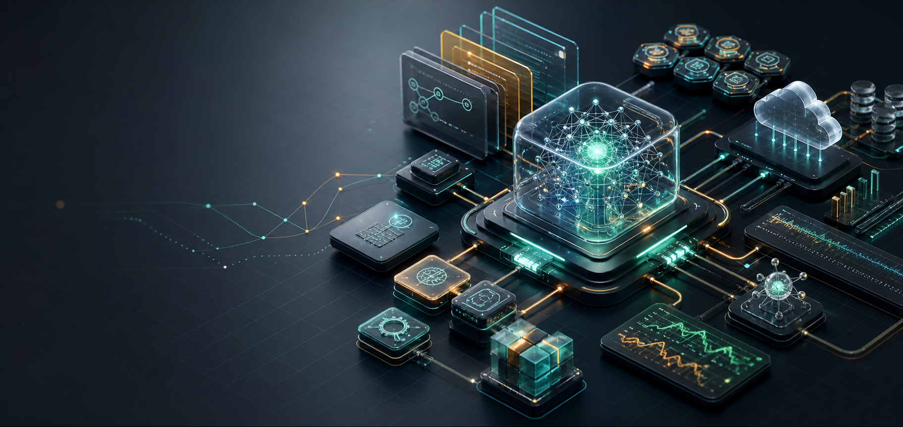

# AI Agent 岗位分类复习资料

这组资料按你的简历技术栈拆分，目标不是泛泛复习，而是让你在面试里能讲出“为什么这么设计、边界在哪里、指标怎么量、上线后怎么治理”。

## 阅读方法

这套资料不是按“知识点词典”写的，而是按技术博客长文组织：每篇都有架构图、源码骨架、设计模式、失败边界、指标口径和面试回答模板。建议在站内阅读器中阅读，它会自动生成目录、渲染 Mermaid 图、格式化表格和代码块。

## 推荐复习顺序

1. [AI Agent 与 LangGraph 工程化](./01-ai-agent-langgraph.md)  
   对应 ArtArch.AI 项目，是你的第一主战场。重点背熟：Workflow vs Agent、LangGraph checkpoint、interrupt/resume、Planner + deterministic assembly。

2. [RAG、混合检索与医疗问答](./02-rag-retrieval.md)  
   对应百度健康助手。重点背熟：BM25 vs Dense、reranker、引用溯源、医疗安全风控、RAG 评测。

3. [LLM 工程化、工具调用、评测与可观测](./03-llm-engineering-observability.md)  
   连接 Agent 与后端平台。重点背熟：structured output、tool calling、安全边界、trace、eval、成本治理。

4. [Vibe Coding 时代的工程师优势](./09-vibe-coding-requirement-spec.md)
   对应 AI 辅助编程面试追问。重点背熟：问题定义、上下文构建、业务语义验证、Token 成本控制，以及“退款功能”如何拆成可执行规格。

5. [How to Fix Your Context：上下文工程六法](./10-context-engineering-langgraph.md)
   对应上下文工程与 LangGraph 落地。重点背熟：RAG、Tool Loadout、Context Quarantine、Pruning、Summarization、Offloading，以及它们在 LangGraph 里如何变成节点。

6. [后端架构、SSE、Kubernetes GPU 与 Operator](./04-backend-cloud-native.md)
   对应你的后端和平台经验。重点背熟：SSE vs WebSocket、FastAPI streaming、K8s Device Plugin、CRD/Operator。

7. [资料来源与延伸阅读](./references.md)
   面试前按主题快速打开官方文档、论文、源码和行业工程博客。

## 技术栈到面试能力映射

| 简历技术栈 | 面试官关注点 | 你要打出的能力 |
|---|---|---|
| LangGraph / Agent Runtime | 是否懂生产级长流程 Agent | 状态显式化、可中断、可恢复、可回放 |
| Planner + DAG 装配 | 是否能控制 LLM 不确定性 | LLM 做语义决策，代码做确定性执行 |
| Gemini / JSON Schema | 是否能做结构化输出 | schema 约束、业务校验、fallback |
| AI 辅助编程 | 是否懂 Vibe Coding 风险 | 需求规格、上下文、验证、责任归属、成本控制 |
| Context Engineering | 是否能控制上下文质量 | RAG、工具选择、隔离、裁剪、摘要、外置记忆 |
| SSE / Responses-style API | 是否懂流式体验和工程细节 | first token、事件协议、断线恢复、代理缓冲 |
| RAG / BM25 + Dense + Rerank | 是否懂搜索质量 | 混合召回、重排、引用溯源、评测分桶 |
| 医疗安全兜底 | 是否懂高风险业务边界 | 风险识别、拒答、转人工、召回优先 |
| K8s / GPU / Operator | 是否有平台底座能力 | Device Plugin、CRD、控制循环、多租户治理 |
| Trace / Eval / Badcase | 是否能持续迭代 | 离线/在线评测、回放、成本和质量闭环 |

## 面试复习节奏

- **第 1 天**：只练 ArtArch.AI Agent Runtime，目标是 15 分钟讲清楚架构。
- **第 2 天**：练 RAG 与医疗安全，目标是能拆 retrieval / generation / safety / eval。
- **第 3 天**：练 LLM 工程化，目标是 structured output、tool calling、trace、eval 都能落到工程细节。
- **第 4 天**：练 K8s/GPU/后端系统设计，目标是证明你不是只懂应用层。
- **第 5 天**：模拟面试，用 [interview-qa.md](../interview-qa.md) 逐题回答并录音复盘。

## 一句话心法

面试里不要把 LLM 讲成魔法。你要反复表达：**我用工程系统管理模型的不确定性，用评测和可观测持续逼近业务目标。**
